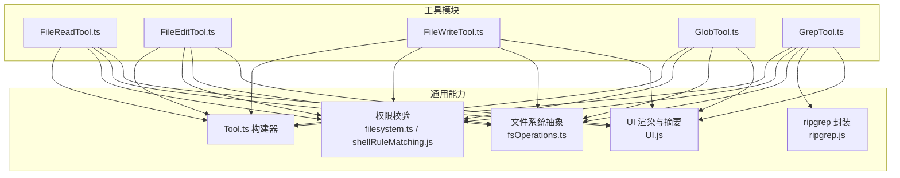
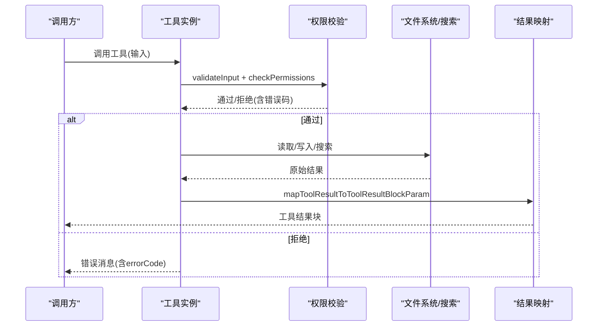
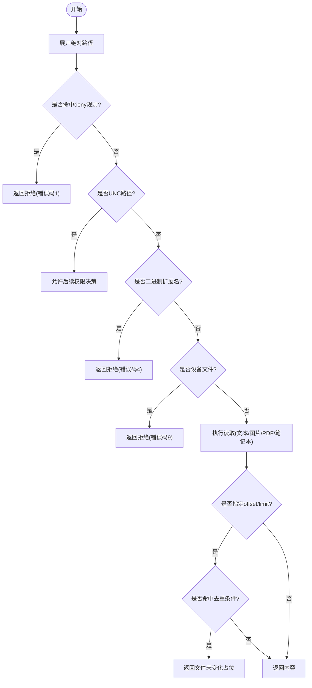
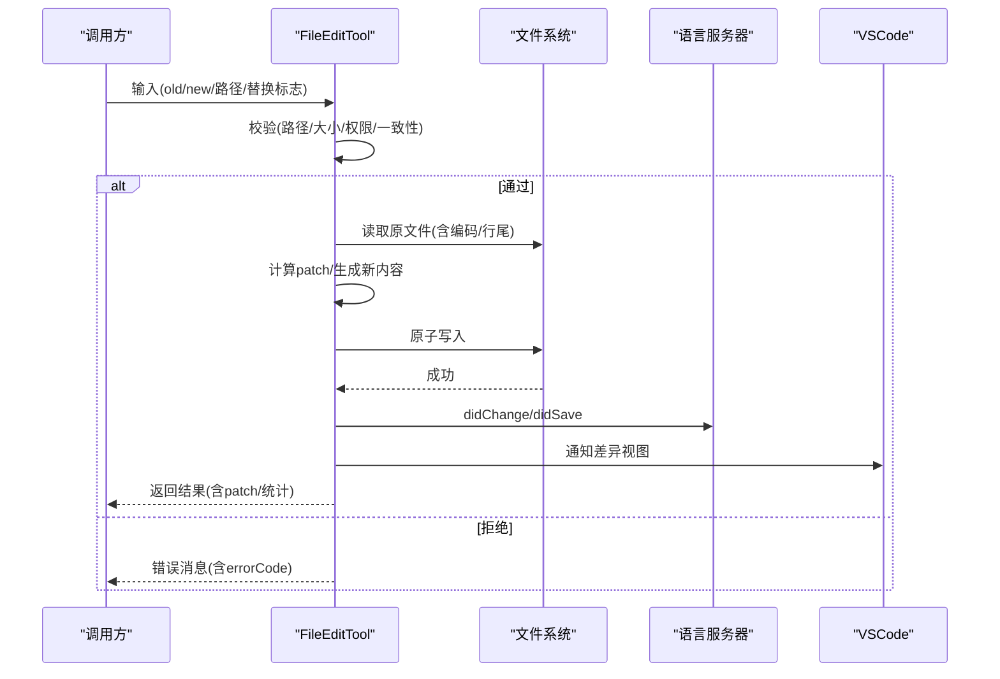
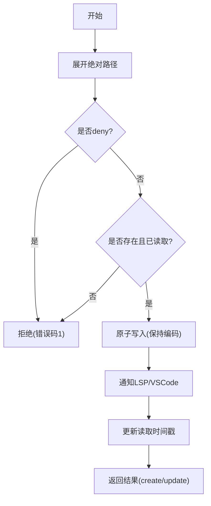
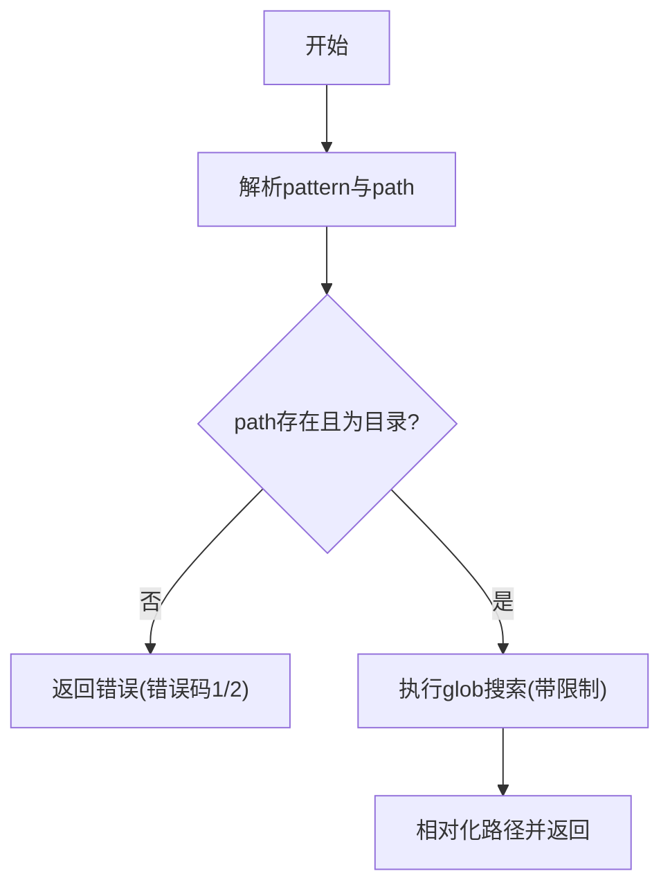
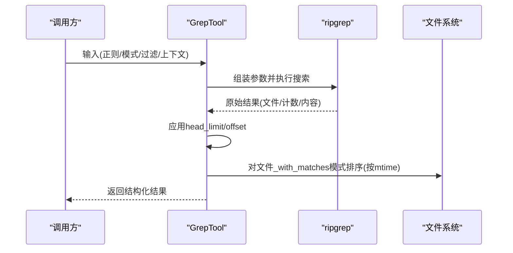
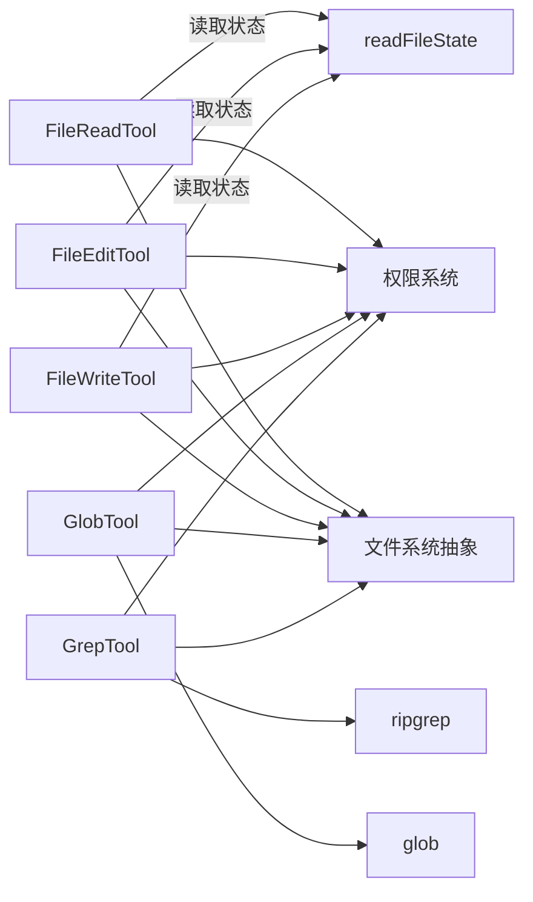

# 文件操作工具

<cite>
**本文引用的文件**
- [FileReadTool.ts](file://src/tools/FileReadTool/FileReadTool.ts)
- [FileEditTool.ts](file://src/tools/FileEditTool/FileEditTool.ts)
- [FileWriteTool.ts](file://src/tools/FileWriteTool/FileWriteTool.ts)
- [GlobTool.ts](file://src/tools/GlobTool/GlobTool.ts)
- [GrepTool.ts](file://src/tools/GrepTool/GrepTool.ts)
</cite>

## 目录
1. [简介](#简介)
2. [项目结构](#项目结构)
3. [核心组件](#核心组件)
4. [架构总览](#架构总览)
5. [详细组件分析](#详细组件分析)
6. [依赖关系分析](#依赖关系分析)
7. [性能考量](#性能考量)
8. [故障排查指南](#故障排查指南)
9. [结论](#结论)
10. [附录](#附录)

## 简介
本文件为文件操作工具的权威参考文档，覆盖以下五大工具：
- FileReadTool：文件读取，支持文本、图片、PDF、Jupyter Notebook 等多类型内容，并具备偏移读取与分页读取能力。
- FileEditTool：文件编辑，基于“旧字符串→新字符串”的替换策略，支持全量替换或单次替换，并进行一致性校验与原子写入。
- FileWriteTool：文件写入，覆盖式写入完整内容，支持路径存在性检查与一致性校验。
- GlobTool：文件模式匹配，基于通配符/模式查找文件列表。
- GrepTool：文本搜索，基于 ripgrep 的正则搜索，支持多种输出模式与上下文控制。

文档将从功能特性、参数与返回值、权限与安全、性能与最佳实践等维度进行系统阐述，并提供典型使用场景与排障建议。

## 项目结构
这些工具均位于 src/tools 下的独立子目录中，采用统一的工具框架封装，遵循相同的输入/输出模式、权限校验与 UI 渲染规范。

图表来源
- [FileReadTool.ts:337-718](file://src/tools/FileReadTool/FileReadTool.ts#L337-L718)
- [FileEditTool.ts:86-595](file://src/tools/FileEditTool/FileEditTool.ts#L86-L595)
- [FileWriteTool.ts:94-434](file://src/tools/FileWriteTool/FileWriteTool.ts#L94-L434)
- [GlobTool.ts:57-198](file://src/tools/GlobTool/GlobTool.ts#L57-L198)
- [GrepTool.ts:160-577](file://src/tools/GrepTool/GrepTool.ts#L160-L577)

章节来源
- [FileReadTool.ts:1-120](file://src/tools/FileReadTool/FileReadTool.ts#L1-L120)
- [FileEditTool.ts:1-120](file://src/tools/FileEditTool/FileEditTool.ts#L1-L120)
- [FileWriteTool.ts:1-120](file://src/tools/FileWriteTool/FileWriteTool.ts#L1-L120)
- [GlobTool.ts:1-60](file://src/tools/GlobTool/GlobTool.ts#L1-L60)
- [GrepTool.ts:1-60](file://src/tools/GrepTool/GrepTool.ts#L1-L60)

## 核心组件
- 统一构建器：所有工具通过 buildTool 构建，提供一致的输入/输出模式、权限校验、UI 渲染与摘要生成。
- 权限系统：基于通配规则匹配与 deny 规则，结合路径展开与 UNC 路径安全处理。
- 文件系统抽象：通过 getFsImplementation 提供跨平台文件操作能力。
- 搜索引擎：GrepTool 使用 ripgrep，具备超时控制与结果截断能力。
- UI 与摘要：提供用户可读的工具使用消息、错误消息与结果摘要。

章节来源
- [FileReadTool.ts:337-418](file://src/tools/FileReadTool/FileReadTool.ts#L337-L418)
- [FileEditTool.ts:86-142](file://src/tools/FileEditTool/FileEditTool.ts#L86-L142)
- [FileWriteTool.ts:94-145](file://src/tools/FileWriteTool/FileWriteTool.ts#L94-L145)
- [GlobTool.ts:57-142](file://src/tools/GlobTool/GlobTool.ts#L57-L142)
- [GrepTool.ts:160-240](file://src/tools/GrepTool/GrepTool.ts#L160-L240)

## 架构总览
工具调用流程遵循“输入校验 → 权限检查 → 可选技能发现 → 执行 → 结果映射”的通用模式；其中 FileReadTool 还包含去重与会话内缓存优化。

图表来源
- [FileReadTool.ts:398-495](file://src/tools/FileReadTool/FileReadTool.ts#L398-L495)
- [FileEditTool.ts:137-362](file://src/tools/FileEditTool/FileEditTool.ts#L137-L362)
- [FileWriteTool.ts:153-222](file://src/tools/FileWriteTool/FileWriteTool.ts#L153-L222)
- [GrepTool.ts:201-240](file://src/tools/GrepTool/GrepTool.ts#L201-L240)

## 详细组件分析

### FileReadTool（文件读取）
- 功能特性
  - 支持文本、图片、PDF、Jupyter Notebook、部分 PDF 分页提取等多类型输出。
  - 支持按行偏移与限制范围读取，避免大文件一次性读取。
  - 支持 PDF 页面范围读取与最大页数限制。
  - 针对 macOS 截图路径的空格兼容处理。
  - 内容去重：若同一范围且文件未变更，返回“文件未变化”占位以节省缓存开销。
  - 安全限制：禁止读取特定设备文件（如 /dev/zero、/proc/self/fd/0 等），二进制扩展名检测（除 PDF/图片/SVG 外）。
- 参数
  - file_path: 绝对路径（内部自动展开）
  - offset: 起始行号（仅大文件场景）
  - limit: 读取行数（仅大文件场景）
  - pages: PDF 页面范围（如 "1-5","3","10-20"）
- 返回值
  - type: 文本/图像/笔记本/PDF/部分提取/文件未变化
  - 具体字段随类型而异（见下方输出结构）
- 权限与安全
  - deny 规则拦截
  - UNC 路径延迟真实访问以避免凭据泄露
  - 设备文件黑名单
  - 二进制文件扩展名白名单（PDF/图片/SVG）
- 性能与最佳实践
  - 大文件优先使用 offset/limit 或 pages
  - 合理设置读取上限，避免超出令牌/大小限制
  - 利用去重机制减少重复读取
- 输出结构
  - 文本：包含文件路径、内容、起止行与总行数
  - 图像：base64 数据、MIME 类型、原尺寸与可选显示尺寸
  - 笔记本：cells 数组
  - PDF：base64 数据与原尺寸
  - 部分提取：输出目录与页数
  - 未变化：占位提示

图表来源
- [FileReadTool.ts:418-495](file://src/tools/FileReadTool/FileReadTool.ts#L418-L495)
- [FileReadTool.ts:594-651](file://src/tools/FileReadTool/FileReadTool.ts#L594-L651)

章节来源
- [FileReadTool.ts:227-336](file://src/tools/FileReadTool/FileReadTool.ts#L227-L336)
- [FileReadTool.ts:398-495](file://src/tools/FileReadTool/FileReadTool.ts#L398-L495)
- [FileReadTool.ts:496-718](file://src/tools/FileReadTool/FileReadTool.ts#L496-L718)

### FileEditTool（文件编辑）
- 功能特性
  - 基于“旧字符串→新字符串”的替换策略，支持 replace_all 控制。
  - 自动编码识别与换行规范化，保持原文件编码与行尾风格。
  - 一致性校验：必须先读取文件，且自上次读取后未被外部修改。
  - 原子写入：确保并发写入不交错，写入前后通知 LSP 与 VSCode。
  - 技能发现与激活：根据目标路径动态加载技能。
- 参数
  - file_path: 绝对路径
  - old_string: 待替换的旧文本
  - new_string: 新文本
  - replace_all: 是否全部替换（默认 false）
- 返回值
  - filePath、oldString、newString、originalFile、structuredPatch、userModified、replaceAll、gitDiff（可选）
- 权限与安全
  - deny 规则拦截
  - UNC 路径延迟真实访问
  - 团队内存敏感内容防护
  - 文件过大限制（1GiB）
- 性能与最佳实践
  - 优先使用更具体的上下文以避免多处匹配
  - 先读取再编辑，避免时间戳不一致导致的失败
  - 大文件谨慎使用 replace_all
- 错误与行为
  - 无变化、路径不存在、非空文件创建、非笔记本但路径为 .ipynb、未读取即写、内容被意外修改、未找到旧字符串、设置文件校验失败等均有明确错误码与提示。

图表来源
- [FileEditTool.ts:137-362](file://src/tools/FileEditTool/FileEditTool.ts#L137-L362)
- [FileEditTool.ts:387-595](file://src/tools/FileEditTool/FileEditTool.ts#L387-L595)

章节来源
- [FileEditTool.ts:56-111](file://src/tools/FileEditTool/FileEditTool.ts#L56-L111)
- [FileEditTool.ts:137-362](file://src/tools/FileEditTool/FileEditTool.ts#L137-L362)
- [FileEditTool.ts:387-595](file://src/tools/FileEditTool/FileEditTool.ts#L387-L595)

### FileWriteTool（文件写入）
- 功能特性
  - 覆盖式写入完整内容，保留原文件编码，严格一致性校验。
  - 原子写入与 LSP/VSCode 通知。
  - 技能发现与激活。
- 参数
  - file_path: 绝对路径
  - content: 要写入的完整内容（包含期望的换行）
- 返回值
  - type: create/update
  - filePath、content、structuredPatch、originalFile（null 表示新建）、gitDiff（可选）
- 权限与安全
  - deny 规则拦截
  - UNC 路径延迟真实访问
  - 团队内存敏感内容防护
- 性能与最佳实践
  - 先读取再写入，避免时间戳不一致
  - 明确换行风格，避免因换行导致的 diff 噪音
- 错误与行为
  - 未读取即写、内容被意外修改、路径无效等有明确错误码与提示。

图表来源
- [FileWriteTool.ts:153-222](file://src/tools/FileWriteTool/FileWriteTool.ts#L153-L222)
- [FileWriteTool.ts:223-434](file://src/tools/FileWriteTool/FileWriteTool.ts#L223-L434)

章节来源
- [FileWriteTool.ts:56-92](file://src/tools/FileWriteTool/FileWriteTool.ts#L56-L92)
- [FileWriteTool.ts:153-222](file://src/tools/FileWriteTool/FileWriteTool.ts#L153-L222)
- [FileWriteTool.ts:223-434](file://src/tools/FileWriteTool/FileWriteTool.ts#L223-L434)

### GlobTool（文件模式匹配）
- 功能特性
  - 基于 glob 模式查找文件，支持指定根目录。
  - 结果相对化（相对于当前工作目录），并限制最大返回数量。
  - 读取权限校验与路径有效性检查。
- 参数
  - pattern: glob 模式
  - path: 可选，搜索根目录（默认当前工作目录）
- 返回值
  - durationMs、numFiles、filenames（数组）、truncated（是否截断）
- 权限与安全
  - deny 规则拦截
  - UNC 路径延迟真实访问
- 性能与最佳实践
  - 使用更具体的 pattern 与 path 以减少扫描范围
  - 若结果被截断，缩小范围或增加约束

图表来源
- [GlobTool.ts:94-134](file://src/tools/GlobTool/GlobTool.ts#L94-L134)
- [GlobTool.ts:154-176](file://src/tools/GlobTool/GlobTool.ts#L154-L176)

章节来源
- [GlobTool.ts:26-56](file://src/tools/GlobTool/GlobTool.ts#L26-L56)
- [GlobTool.ts:94-134](file://src/tools/GlobTool/GlobTool.ts#L94-L134)
- [GlobTool.ts:154-176](file://src/tools/GlobTool/GlobTool.ts#L154-L176)

### GrepTool（文本搜索）
- 功能特性
  - 基于 ripgrep 的正则搜索，支持多种输出模式：content/files_with_matches/count。
  - 上下文控制：-B/-A/-C 或 context；行号控制：-n；大小写忽略：-i；多行模式：-U/--multiline-dotall。
  - 文件类型过滤：--type；glob 过滤：--glob；忽略模式：结合权限系统忽略规则。
  - 结果截断与偏移：head_limit 与 offset，避免超大输出。
  - 默认排除版本控制目录，降低噪声。
- 参数
  - pattern: 正则表达式
  - path: 可选，搜索根目录
  - glob: 可选，文件 glob 过滤
  - output_mode: content/files_with_matches/count（默认 files_with_matches）
  - -B/-A/-C/context: 上下文行数（仅 content 模式）
  - -n: 是否显示行号（仅 content 模式）
  - -i: 是否大小写不敏感
  - type: 文件类型过滤
  - head_limit: 限制输出条目数（默认 250，0 表示不限）
  - offset: 跳过前 N 个条目后再应用 head_limit
  - multiline: 多行模式
- 返回值
  - mode、numFiles、filenames（或 content/numLines/numMatches）、appliedLimit、appliedOffset
- 权限与安全
  - deny 规则拦截
  - UNC 路径延迟真实访问
  - 忽略模式与插件缓存排除目录
- 性能与最佳实践
  - 使用 head_limit 与 offset 控制输出规模
  - 优先使用 type 或 glob 缩小搜索范围
  - content 模式下合理设置上下文，避免产生巨量行

图表来源
- [GrepTool.ts:310-390](file://src/tools/GrepTool/GrepTool.ts#L310-L390)
- [GrepTool.ts:441-576](file://src/tools/GrepTool/GrepTool.ts#L441-L576)

章节来源
- [GrepTool.ts:33-91](file://src/tools/GrepTool/GrepTool.ts#L33-L91)
- [GrepTool.ts:144-158](file://src/tools/GrepTool/GrepTool.ts#L144-L158)
- [GrepTool.ts:310-390](file://src/tools/GrepTool/GrepTool.ts#L310-L390)
- [GrepTool.ts:441-576](file://src/tools/GrepTool/GrepTool.ts#L441-L576)

## 依赖关系分析
- 工具间耦合度低，均通过 Tool 构建器与统一接口交互。
- FileReadTool 与 FileEditTool/FileWriteTool 在一致性校验上存在协作关系（读取状态共享）。
- GrepTool 依赖 ripgrep，GlobTool 依赖本地 glob 实现。
- 权限系统与路径展开在各工具中复用，保证行为一致。

图表来源
- [FileReadTool.ts:502-507](file://src/tools/FileReadTool/FileReadTool.ts#L502-L507)
- [FileEditTool.ts:389-394](file://src/tools/FileEditTool/FileEditTool.ts#L389-L394)
- [FileWriteTool.ts:225-227](file://src/tools/FileWriteTool/FileWriteTool.ts#L225-L227)
- [GrepTool.ts:441-441](file://src/tools/GrepTool/GrepTool.ts#L441-L441)
- [GlobTool.ts:158-158](file://src/tools/GlobTool/GlobTool.ts#L158-L158)

章节来源
- [FileReadTool.ts:502-507](file://src/tools/FileReadTool/FileReadTool.ts#L502-L507)
- [FileEditTool.ts:389-394](file://src/tools/FileEditTool/FileEditTool.ts#L389-L394)
- [FileWriteTool.ts:225-227](file://src/tools/FileWriteTool/FileWriteTool.ts#L225-L227)
- [GlobTool.ts:158-158](file://src/tools/GlobTool/GlobTool.ts#L158-L158)
- [GrepTool.ts:441-441](file://src/tools/GrepTool/GrepTool.ts#L441-L441)

## 性能考量
- 大文件读取
  - 优先使用 offset/limit 或 PDF pages，避免一次性读取整文件。
  - FileReadTool 内置去重与会话内缓存，减少重复传输。
- 搜索性能
  - GrepTool 默认 head_limit=250，避免超大输出；合理使用 type/glob/ignore 模式缩小范围。
  - GlobTool 限制最大结果数量并相对化路径。
- 并发与原子性
  - FileEditTool/FileWriteTool 在写入前后进行一致性校验，避免并发写入冲突。
- 平台差异
  - WSL 存在文件读取性能退化，搜索超时由 ripgrep 内部处理。

## 故障排查指南
- 文件不存在
  - FileReadTool/GlobTool/GrepTool 在路径不存在时提供相似文件建议与当前工作目录提示。
- 权限拒绝
  - 检查 deny 规则与路径展开后的匹配结果；UNC 路径需特别注意。
- 文件被意外修改
  - FileEditTool/FileWriteTool 在写入前检查时间戳与内容一致性，若不一致会报错。
- 二进制文件无法读取
  - FileReadTool 对二进制扩展名进行拦截，建议改用专用工具或导出为文本/图片/PDF。
- PDF/图片读取异常
  - 确认扩展名与 MIME 类型；PDF 支持页面范围与最大页数限制。
- 搜索超时或结果过多
  - GrepTool 使用 ripgrep，可通过 head_limit/offset 与更精确的 glob/type 缩小范围。

章节来源
- [FileReadTool.ts:609-650](file://src/tools/FileReadTool/FileReadTool.ts#L609-L650)
- [FileEditTool.ts:289-311](file://src/tools/FileEditTool/FileEditTool.ts#L289-L311)
- [FileWriteTool.ts:208-220](file://src/tools/FileWriteTool/FileWriteTool.ts#L208-L220)
- [GrepTool.ts:437-441](file://src/tools/GrepTool/GrepTool.ts#L437-L441)

## 结论
上述五大工具围绕“读取、编辑、写入、模式匹配、内容搜索”构建了完整的文件操作能力谱系。通过统一的工具框架、严格的权限与安全策略、以及针对性能与体验的优化（如去重、截断、原子写入、上下文控制），能够在保证安全性的同时满足从探索到精细修改的多样化需求。建议在生产环境中优先采用“先读取再修改”的策略，并结合 head_limit/offset 与更精确的 glob/type 进行性能优化。

## 附录
- 常见使用场景
  - 批量文件操作：使用 GlobTool 获取候选列表，再用 FileReadTool/WriteTool/EditTool 逐个处理。
  - 正则表达式搜索：使用 GrepTool 的 content 模式配合 -C/-n/-i 等参数定位问题。
  - 文件内容修改：FileEditTool 适合“旧→新”的精准替换；FileWriteTool 适合完全覆盖。
  - 大文件处理：优先使用 FileReadTool 的 offset/limit 或 PDF pages。
- 最佳实践清单
  - 明确路径为绝对路径并使用 expandPath
  - 先读取再写入，避免时间戳不一致
  - 使用 head_limit/offset 控制输出规模
  - 合理设置 glob/type 以缩小搜索范围
  - 注意 UNC 路径与二进制文件限制