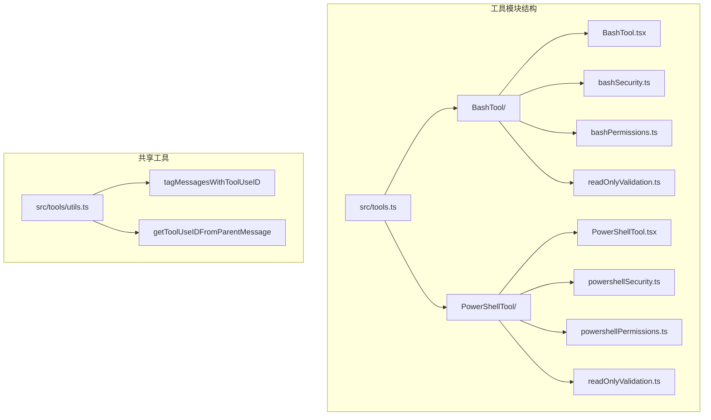
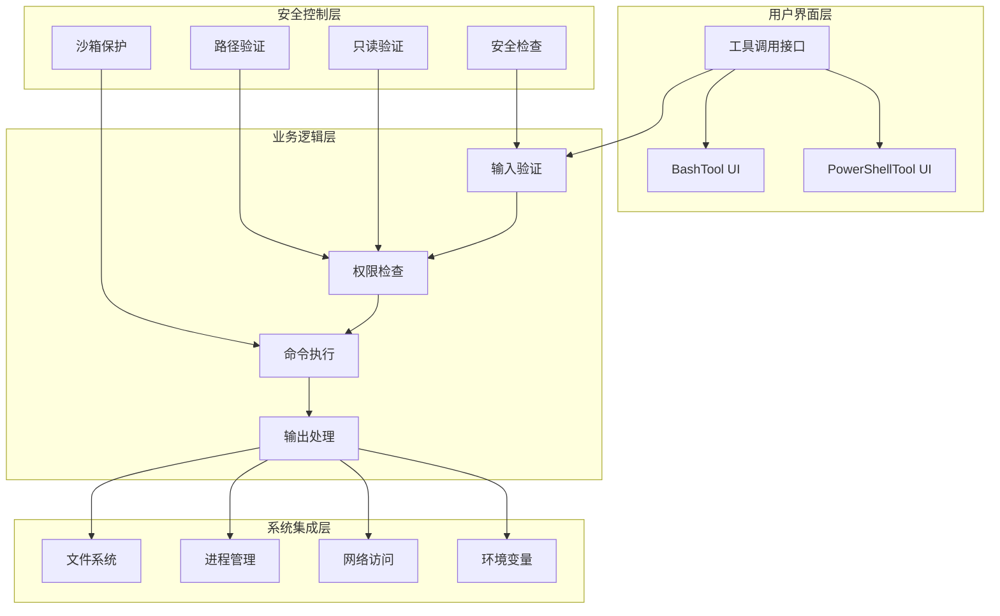
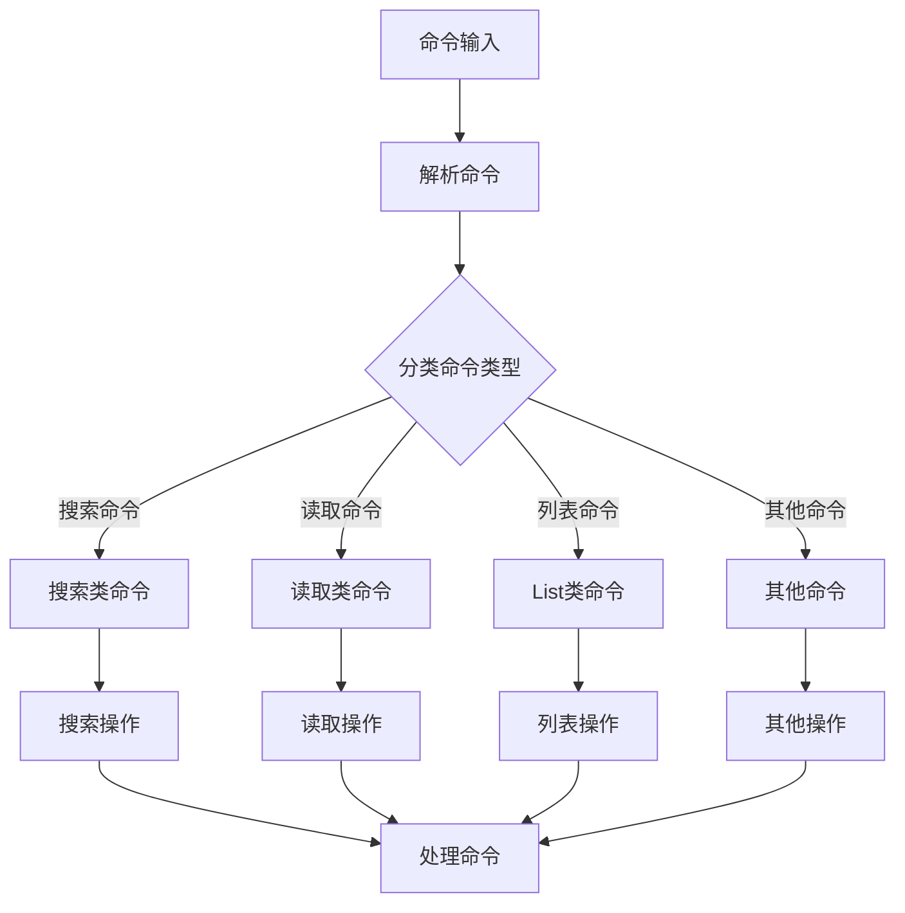
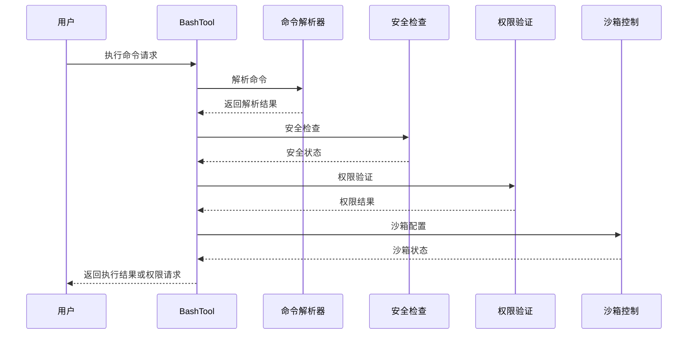
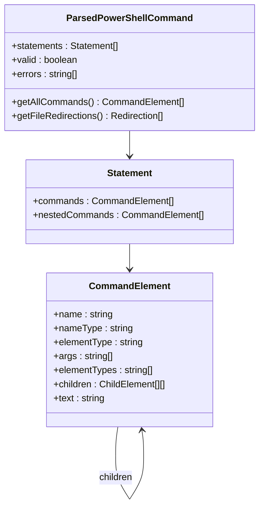
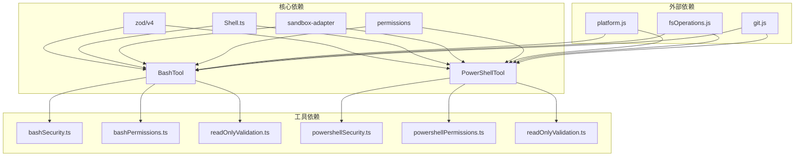
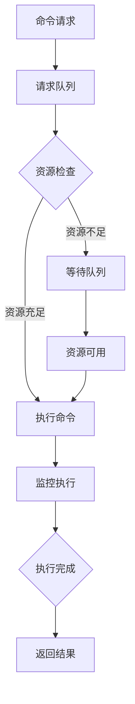

# 系统命令工具

<cite>
**本文档引用的文件**
- [src/tools.ts](file://src/tools.ts)
- [src/tools/utils.ts](file://src/tools/utils.ts)
- [src/tools/BashTool/BashTool.tsx](file://src/tools/BashTool/BashTool.tsx)
- [src/tools/BashTool/bashSecurity.ts](file://src/tools/BashTool/bashSecurity.ts)
- [src/tools/BashTool/bashPermissions.ts](file://src/tools/BashTool/bashPermissions.ts)
- [src/tools/BashTool/readOnlyValidation.ts](file://src/tools/BashTool/readOnlyValidation.ts)
- [src/tools/PowerShellTool/PowerShellTool.tsx](file://src/tools/PowerShellTool/PowerShellTool.tsx)
- [src/tools/PowerShellTool/powershellSecurity.ts](file://src/tools/PowerShellTool/powershellSecurity.ts)
- [src/tools/PowerShellTool/powershellPermissions.ts](file://src/tools/PowerShellTool/powershellPermissions.ts)
- [src/tools/PowerShellTool/readOnlyValidation.ts](file://src/tools/PowerShellTool/readOnlyValidation.ts)
</cite>

## 目录
1. [简介](#简介)
2. [项目结构](#项目结构)
3. [核心组件](#核心组件)
4. [架构概览](#架构概览)
5. [详细组件分析](#详细组件分析)
6. [依赖关系分析](#依赖关系分析)
7. [性能考虑](#性能考虑)
8. [故障排除指南](#故障排除指南)
9. [结论](#结论)

## 简介

系统命令工具是 Claude Code 平台中用于执行系统命令的核心组件，主要包含两个核心工具：BashTool（Linux/Unix 命令执行）和 PowerShellTool（Windows PowerShell 执行）。这些工具提供了安全的命令执行环境，集成了权限控制、沙箱保护、输出处理和错误管理等功能。

本系统旨在为用户提供安全、可控的命令行访问能力，同时确保不会对系统造成意外损害。通过多层次的安全检查、权限验证和输出监控，系统能够在提供强大功能的同时保持高度的安全性。

## 项目结构

系统命令工具位于项目的 `src/tools` 目录下，采用模块化设计，每个工具都有独立的目录和完整的功能实现。

**图表来源**
- [src/tools.ts](file://src/tools.ts)
- [src/tools/utils.ts](file://src/tools/utils.ts)

**章节来源**
- [src/tools.ts](file://src/tools.ts)
- [src/tools/utils.ts](file://src/tools/utils.ts)

## 核心组件

### BashTool（Linux/Unix 命令执行）

BashTool 是系统中最复杂的命令执行工具，支持多种 Linux/Unix 命令格式和高级功能：

#### 主要特性
- **智能命令分类**：自动识别搜索、读取、列表等不同类型的命令
- **安全沙箱**：可选的沙箱模式，限制命令执行范围
- **权限控制系统**：基于规则的权限验证和用户确认流程
- **输出处理**：智能的输出截断、图像检测和大文件处理
- **后台任务**：支持长时间运行命令的后台执行

#### 关键功能模块
- **命令解析**：支持复杂的管道和重定向操作
- **安全检查**：多层次的安全验证和危险模式检测
- **路径验证**：严格的文件系统访问控制
- **只读模式**：自动识别和允许只读命令

### PowerShellTool（Windows PowerShell 执行）

PowerShellTool 专为 Windows 环境设计，提供原生的 PowerShell 命令执行能力：

#### 主要特性
- **AST 解析**：基于抽象语法树的深度命令分析
- **安全验证**：针对 PowerShell 特有的攻击向量进行防护
- **跨平台兼容**：在 Windows 上提供完整功能，在其他平台有限制
- **权限管理**：与 BashTool 类似的权限控制系统

#### 安全增强
- **动态命令检测**：识别动态执行的命令名称
- **脚本块验证**：检查潜在的恶意脚本块注入
- **COM 对象防护**：防止危险的 COM 组件调用
- **下载器检测**：识别常见的恶意下载模式

**章节来源**
- [src/tools/BashTool/BashTool.tsx](file://src/tools/BashTool/BashTool.tsx)
- [src/tools/PowerShellTool/PowerShellTool.tsx](file://src/tools/PowerShellTool/PowerShellTool.tsx)

## 架构概览

系统采用分层架构设计，确保安全性和可维护性：

**图表来源**
- [src/tools/BashTool/BashTool.tsx](file://src/tools/BashTool/BashTool.tsx)
- [src/tools/PowerShellTool/PowerShellTool.tsx](file://src/tools/PowerShellTool/PowerShellTool.tsx)

## 详细组件分析

### BashTool 深入分析

#### 命令分类系统

BashTool 实现了智能的命令分类机制，能够自动识别不同类型的命令并应用相应的处理策略：

**图表来源**
- [src/tools/BashTool/BashTool.tsx](file://src/tools/BashTool/BashTool.tsx)

#### 权限控制系统

BashTool 的权限控制采用多层验证机制：

**图表来源**
- [src/tools/BashTool/bashPermissions.ts](file://src/tools/BashTool/bashPermissions.ts)
- [src/tools/BashTool/bashSecurity.ts](file://src/tools/BashTool/bashSecurity.ts)

#### 输出处理机制

BashTool 提供了强大的输出处理能力：

| 处理类型 | 功能描述 | 实现方式 |
|---------|----------|----------|
| 输出截断 | 防止过长输出影响性能 | EndTruncatingAccumulator |
| 图像检测 | 自动识别图像数据 | isImageOutput |
| 大文件处理 | 超大输出的临时存储 | 工具结果存储 |
| 进度报告 | 长时间运行命令的进度显示 | AsyncGenerator |

**章节来源**
- [src/tools/BashTool/BashTool.tsx](file://src/tools/BashTool/BashTool.tsx)
- [src/tools/BashTool/bashSecurity.ts](file://src/tools/BashTool/bashSecurity.ts)

### PowerShellTool 深入分析

#### AST 解析架构

PowerShellTool 使用抽象语法树（AST）进行深度命令分析：

**图表来源**
- [src/tools/PowerShellTool/powershellSecurity.ts](file://src/tools/PowerShellTool/powershellSecurity.ts)

#### PowerShell 特有安全检查

PowerShellTool 包含针对 PowerShell 特有的安全威胁的检查：

| 安全威胁 | 检测方法 | 防护措施 |
|---------|----------|----------|
| 动态命令执行 | 检查命令名称元素类型 | 仅允许字符串常量命令名 |
| 脚本块注入 | 分析脚本块 AST 结构 | 严格验证脚本块内容 |
| 下载器模式 | 检测 Invoke-WebRequest 和相关命令 | 阻止远程下载操作 |
| COM 对象滥用 | 监控 New-Object -ComObject | 限制危险 COM 组件 |
| 代理执行 | 检测 Invoke-Expression 使用 | 强制用户确认 |

**章节来源**
- [src/tools/PowerShellTool/PowerShellTool.tsx](file://src/tools/PowerShellTool/PowerShellTool.tsx)
- [src/tools/PowerShellTool/powershellSecurity.ts](file://src/tools/PowerShellTool/powershellSecurity.ts)

### 安全机制对比分析

| 安全特性 | BashTool | PowerShellTool | 共同特点 |
|---------|----------|----------------|----------|
| 命令解析 | 词法分析 | AST 解析 | 深度解析 |
| 权限验证 | 规则匹配 | 规则匹配 | 多层验证 |
| 沙箱保护 | 可选沙箱 | Windows 不支持 | 平台差异 |
| 输出监控 | 智能截断 | 智能截断 | 性能保护 |
| 用户确认 | 交互式确认 | 交互式确认 | 透明控制 |

**章节来源**
- [src/tools/BashTool/bashPermissions.ts](file://src/tools/BashTool/bashPermissions.ts)
- [src/tools/PowerShellTool/powershellPermissions.ts](file://src/tools/PowerShellTool/powershellPermissions.ts)

## 依赖关系分析

系统命令工具之间存在复杂的依赖关系，形成了一个完整的安全执行生态系统：

**图表来源**
- [src/tools/BashTool/BashTool.tsx](file://src/tools/BashTool/BashTool.tsx)
- [src/tools/PowerShellTool/PowerShellTool.tsx](file://src/tools/PowerShellTool/PowerShellTool.tsx)

**章节来源**
- [src/tools.ts](file://src/tools.ts)

## 性能考虑

系统在设计时充分考虑了性能优化，特别是在处理大量输出和复杂命令时的表现：

### 输出处理优化

| 优化策略 | 实现方式 | 性能收益 |
|---------|----------|----------|
| 流式处理 | AsyncGenerator | 减少内存占用 |
| 智能截断 | EndTruncatingAccumulator | 控制输出大小 |
| 图像压缩 | resizeShellImageOutput | 减少传输时间 |
| 大文件存储 | 工具结果存储 | 避免内存溢出 |

### 并发控制

系统实现了智能的并发控制机制，确保多个命令可以安全地并行执行：

## 故障排除指南

### 常见问题及解决方案

#### BashTool 相关问题

| 问题类型 | 症状 | 解决方案 |
|---------|------|----------|
| 命令超时 | 命令执行超过最大时间限制 | 调整 timeout 参数或使用 run_in_background |
| 权限拒绝 | 权限检查失败 | 添加适当的权限规则或联系管理员 |
| 输出过大 | 内存使用过高 | 使用 run_in_background 或减少输出 |
| 沙箱限制 | 某些命令无法执行 | 检查沙箱配置或禁用沙箱模式 |

#### PowerShellTool 相关问题

| 问题类型 | 症状 | 解决方案 |
|---------|------|----------|
| PowerShell 不可用 | 系统提示 PowerShell 不可用 | 安装 PowerShell 或使用 BashTool |
| AST 解析失败 | 命令解析错误 | 简化命令语法或使用基本命令 |
| 安全警告过多 | 频繁出现安全警告 | 添加精确的权限规则 |
| 跨平台兼容性 | 在非 Windows 平台功能受限 | 使用 BashTool 或调整命令语法 |

**章节来源**
- [src/tools/BashTool/BashTool.tsx](file://src/tools/BashTool/BashTool.tsx)
- [src/tools/PowerShellTool/PowerShellTool.tsx](file://src/tools/PowerShellTool/PowerShellTool.tsx)

## 结论

系统命令工具为 Claude Code 平台提供了强大而安全的命令执行能力。通过精心设计的安全架构、智能的权限控制系统和高效的性能优化，这些工具能够在保证安全性的同时提供优秀的用户体验。

### 主要优势

1. **多层次安全防护**：从命令解析到执行的全方位安全检查
2. **智能权限管理**：基于规则的灵活权限控制和用户确认流程
3. **跨平台兼容**：针对不同操作系统提供优化的执行环境
4. **性能优化**：高效的输出处理和资源管理机制
5. **易用性设计**：直观的用户界面和详细的错误反馈

### 最佳实践建议

1. **优先使用只读命令**：在可能的情况下使用只读命令以提高安全性
2. **合理设置超时时间**：为长时间运行的命令设置合适的超时限制
3. **启用沙箱保护**：在支持的平台上启用沙箱模式以增加安全性
4. **定期更新权限规则**：根据实际使用情况调整权限配置
5. **监控系统资源**：关注内存和 CPU 使用情况，避免资源耗尽

通过遵循这些指导原则，用户可以充分利用系统命令工具的强大功能，同时确保系统的安全性和稳定性。