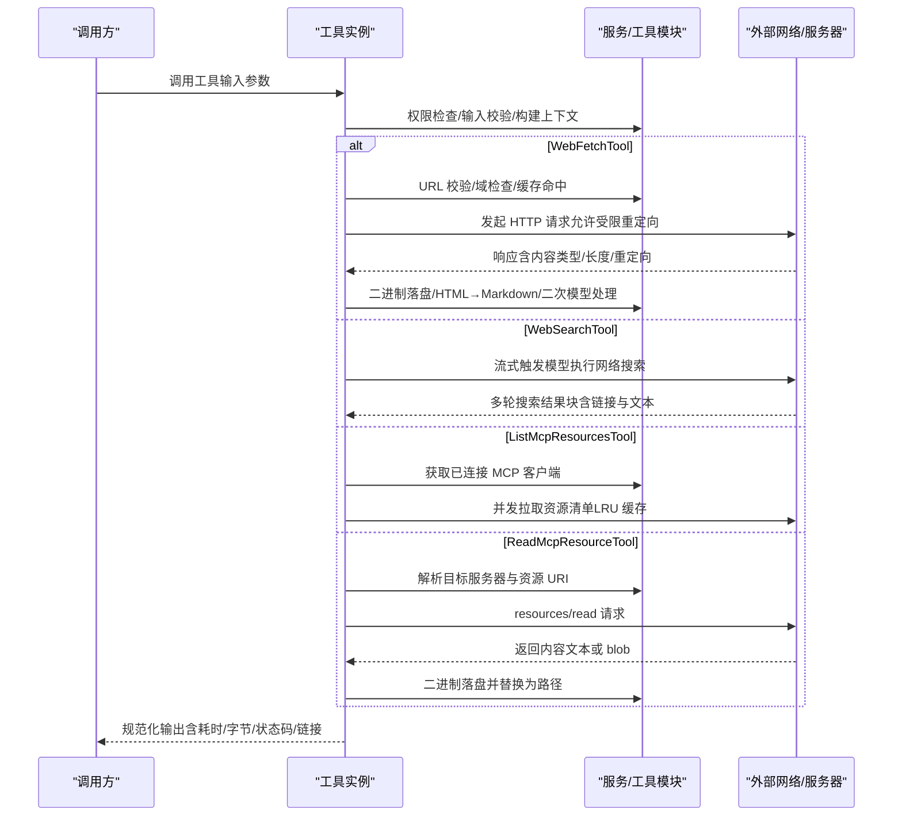
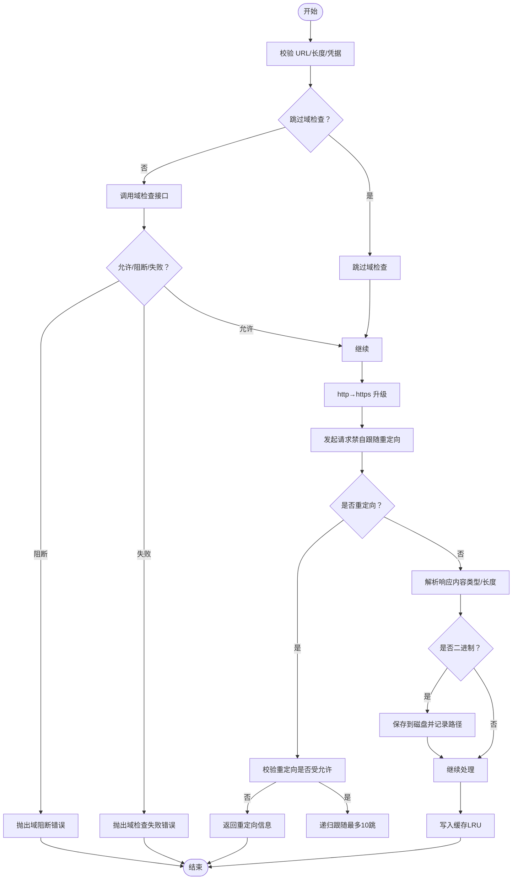
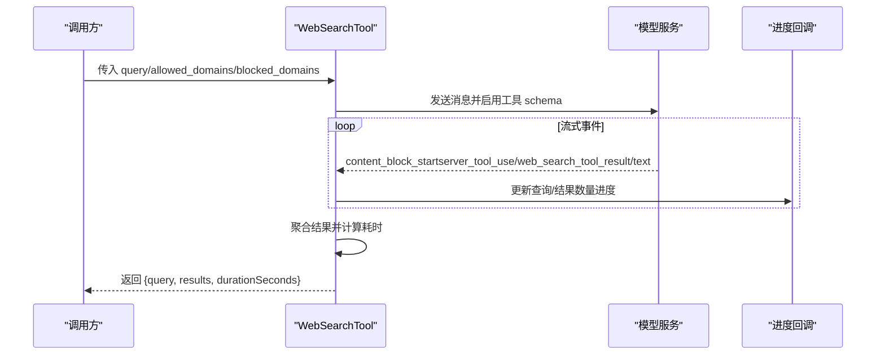
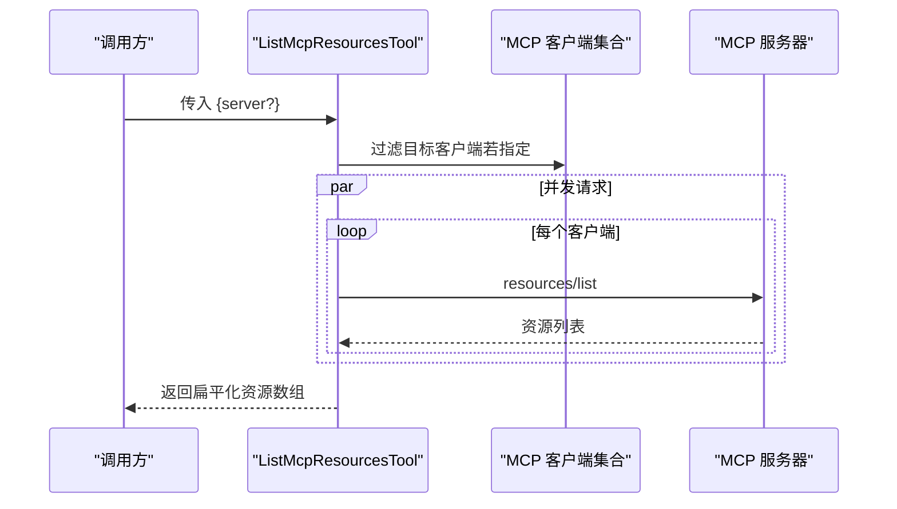
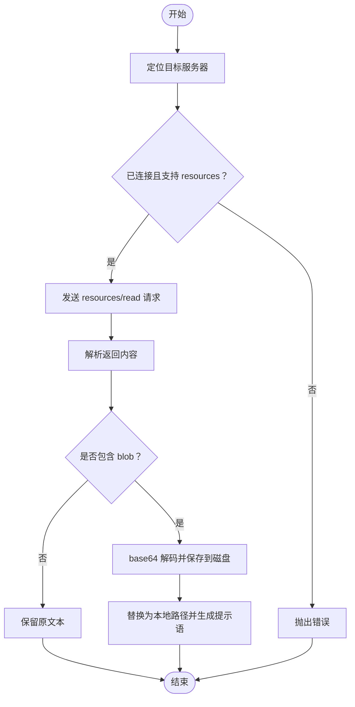
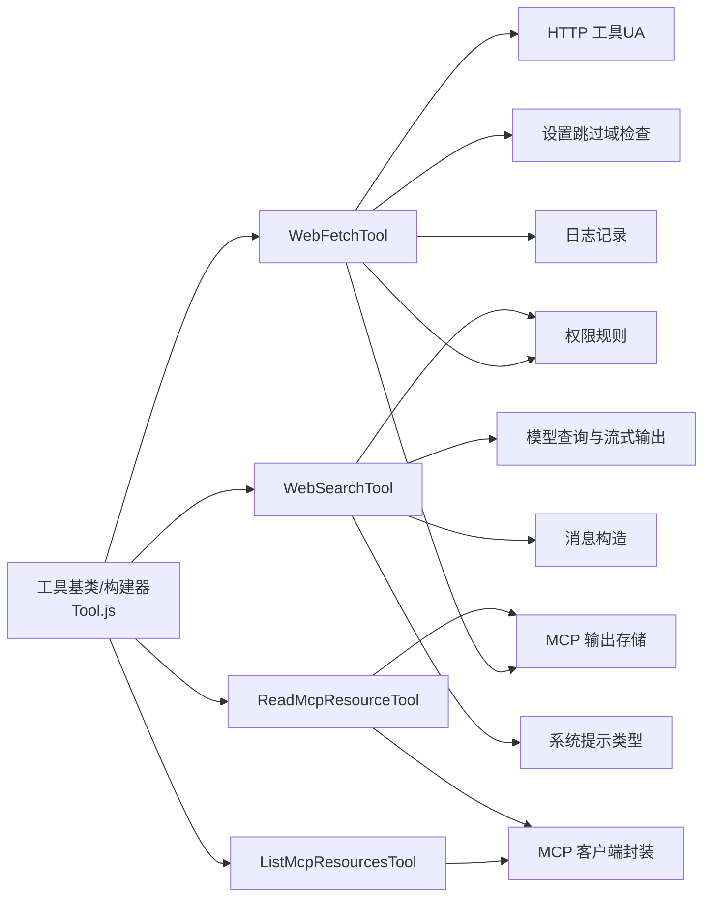

# 网络与网页工具

<cite>
**本文引用的文件**   
- [WebFetchTool.ts](file://src/tools/WebFetchTool/WebFetchTool.ts)
- [WebFetch 工具辅助模块](file://src/tools/WebFetchTool/utils.ts)
- [WebFetch 预批准域名](file://src/tools/WebFetchTool/preapproved.ts)
- [WebSearchTool.ts](file://src/tools/WebSearchTool/WebSearchTool.ts)
- [ListMcpResourcesTool.ts](file://src/tools/ListMcpResourcesTool/ListMcpResourcesTool.ts)
- [ReadMcpResourceTool.ts](file://src/tools/ReadMcpResourceTool/ReadMcpResourceTool.ts)
- [MCP 客户端封装](file://src/services/mcp/client.js)
- [HTTP 工具（用户代理）](file://src/utils/http.js)
- [分析日志与事件](file://src/services/analytics/index.js)
- [模型查询与流式输出](file://src/services/api/claude.js)
- [工具基类与构建器](file://src/Tool.js)
- [权限规则与提示词](file://src/utils/permissions/permissions.js)
- [权限结果类型](file://src/utils/permissions/PermissionResult.js)
- [消息构造与系统提示](file://src/utils/messages.js)
- [系统提示类型](file://src/utils/systemPromptType.js)
- [慢操作序列化](file://src/utils/slowOperations.js)
- [终端截断检测](file://src/utils/terminal.js)
- [MCP 输出存储](file://src/utils/mcpOutputStorage.js)
- [错误与日志](file://src/utils/errors.js)
- [日志记录](file://src/utils/log.js)
- [设置与配置](file://src/utils/settings/settings.js)
- [Web 搜索提示词](file://src/tools/WebSearchTool/prompt.js)
- [WebFetch 提示词与二次模型提示](file://src/tools/WebFetchTool/prompt.js)
- [WebFetch UI](file://src/tools/WebFetchTool/UI.tsx)
- [WebSearch UI](file://src/tools/WebSearchTool/UI.tsx)
- [ListMcpResources UI](file://src/tools/ListMcpResourcesTool/UI.tsx)
- [ReadMcpResource UI](file://src/tools/ReadMcpResourceTool/UI.tsx)
</cite>

## 目录
1. [简介](#简介)
2. [项目结构](#项目结构)
3. [核心组件](#核心组件)
4. [架构总览](#架构总览)
5. [详细组件分析](#详细组件分析)
6. [依赖关系分析](#依赖关系分析)
7. [性能考量](#性能考量)
8. [故障排查指南](#故障排查指南)
9. [结论](#结论)
10. [附录](#附录)

## 简介
本文件为网络与网页工具的权威参考文档，覆盖以下工具：
- WebFetchTool：从网页抓取内容并按提示词进行提取或总结
- WebSearchTool：通过模型执行网络搜索，返回结果链接与摘要
- ListMcpResourcesTool：列出已连接 MCP 服务器的可用资源清单
- ReadMcpResourceTool：读取指定 MCP 资源，支持文本与二进制内容

文档重点说明：
- HTTP 请求处理、响应解析、错误重试机制与速率限制
- 请求头配置、安全策略、URL 校验与内容过滤
- 响应格式与参数说明、UI 渲染与工具结果映射
- 实际使用场景与最佳实践（请求优化、缓存策略、错误处理）
- 网络安全与合规要求（预批准域名、域检查、出口代理阻断、x402 支付）

## 项目结构
四个工具均位于 src/tools 下，采用统一的工具构建器模式，配合服务层与通用工具模块完成网络访问、权限控制、UI 渲染与结果映射。

```mermaid
graph TB
subgraph "工具层"
WFT["WebFetchTool.ts"]
WST["WebSearchTool.ts"]
LMRT["ListMcpResourcesTool.ts"]
RMRT["ReadMcpResourceTool.ts"]
end
subgraph "服务层"
MCP["MCP 客户端封装<br/>services/mcp/client.js"]
HTTPU["HTTP 工具UA<br/>utils/http.js"]
CLAUDE["模型查询与流式输出<br/>services/api/claude.js"]
ANALYTICS["分析日志与事件<br/>services/analytics/index.js"]
end
subgraph "通用工具"
PERM["权限规则与提示词<br/>utils/permissions/permissions.js"]
MSG["消息构造与系统提示<br/>utils/messages.js"]
SYS["系统提示类型<br/>utils/systemPromptType.js"]
SLOW["慢操作序列化<br/>utils/slowOperations.js"]
TERM["终端截断检测<br/>utils/terminal.js"]
STORE["MCP 输出存储<br/>utils/mcpOutputStorage.js"]
ERR["错误与日志<br/>utils/errors.js"]
LOG["日志记录<br/>utils/log.js"]
SETT["设置与配置<br/>utils/settings/settings.js"]
end
WFT --> HTTPU
WFT --> PERM
WFT --> ANALYTICS
WFT --> STORE
WFT --> ERR
WFT --> LOG
WFT --> SETT
WST --> CLAUDE
WST --> MSG
WST --> SYS
WST --> SLOW
WST --> PERM
LMRT --> MCP
RMRT --> MCP
RMRT --> STORE
RMRT --> TERM
```

图表来源
- [WebFetchTool.ts:1-320](file://src/tools/WebFetchTool/WebFetchTool.ts#L1-L320)
- [WebSearchTool.ts:1-437](file://src/tools/WebSearchTool/WebSearchTool.ts#L1-L437)
- [ListMcpResourcesTool.ts:1-125](file://src/tools/ListMcpResourcesTool/ListMcpResourcesTool.ts#L1-L125)
- [ReadMcpResourceTool.ts:1-160](file://src/tools/ReadMcpResourceTool/ReadMcpResourceTool.ts#L1-L160)
- [MCP 客户端封装](file://src/services/mcp/client.js)
- [HTTP 工具（用户代理）](file://src/utils/http.js)
- [分析日志与事件](file://src/services/analytics/index.js)
- [模型查询与流式输出](file://src/services/api/claude.js)
- [权限规则与提示词](file://src/utils/permissions/permissions.js)
- [消息构造与系统提示](file://src/utils/messages.js)
- [系统提示类型](file://src/utils/systemPromptType.js)
- [慢操作序列化](file://src/utils/slowOperations.js)
- [终端截断检测](file://src/utils/terminal.js)
- [MCP 输出存储](file://src/utils/mcpOutputStorage.js)
- [错误与日志](file://src/utils/errors.js)
- [日志记录](file://src/utils/log.js)
- [设置与配置](file://src/utils/settings/settings.js)

章节来源
- [WebFetchTool.ts:1-320](file://src/tools/WebFetchTool/WebFetchTool.ts#L1-L320)
- [WebSearchTool.ts:1-437](file://src/tools/WebSearchTool/WebSearchTool.ts#L1-L437)
- [ListMcpResourcesTool.ts:1-125](file://src/tools/ListMcpResourcesTool/ListMcpResourcesTool.ts#L1-L125)
- [ReadMcpResourceTool.ts:1-160](file://src/tools/ReadMcpResourceTool/ReadMcpResourceTool.ts#L1-L160)

## 核心组件
- WebFetchTool：抓取网页内容，自动 HTML→Markdown 转换，支持二进制内容落盘，带缓存与域检查、重定向白名单校验、超时与大小限制、x402 支付重试。
- WebSearchTool：通过模型流式执行网络搜索，聚合多轮搜索结果，支持 allowed_domains/blocked_domains 过滤，最大使用次数限制。
- ListMcpResourcesTool：枚举已连接 MCP 服务器资源，带 LRU 缓存与健康重连。
- ReadMcpResourceTool：读取指定资源，拦截二进制 blob，转存磁盘并替换为路径，支持 MIME 类型识别与截断检测。

章节来源
- [WebFetchTool.ts:66-307](file://src/tools/WebFetchTool/WebFetchTool.ts#L66-L307)
- [WebSearchTool.ts:152-435](file://src/tools/WebSearchTool/WebSearchTool.ts#L152-L435)
- [ListMcpResourcesTool.ts:40-123](file://src/tools/ListMcpResourcesTool/ListMcpResourcesTool.ts#L40-L123)
- [ReadMcpResourceTool.ts:49-158](file://src/tools/ReadMcpResourceTool/ReadMcpResourceTool.ts#L49-L158)

## 架构总览
四个工具共享统一的工具基类与渲染管线；网络访问由各自工具内部模块负责，部分工具复用 MCP 客户端与通用 HTTP 工具。

图表来源
- [WebFetchTool.ts:208-299](file://src/tools/WebFetchTool/WebFetchTool.ts#L208-L299)
- [WebFetch 工具辅助模块:384-519](file://src/tools/WebFetchTool/utils.ts#L384-L519)
- [WebSearchTool.ts:254-399](file://src/tools/WebSearchTool/WebSearchTool.ts#L254-L399)
- [ListMcpResourcesTool.ts:66-100](file://src/tools/ListMcpResourcesTool/ListMcpResourcesTool.ts#L66-L100)
- [ReadMcpResourceTool.ts:75-143](file://src/tools/ReadMcpResourceTool/ReadMcpResourceTool.ts#L75-L143)

## 详细组件分析

### WebFetchTool（网页内容获取）
- 功能要点
  - 输入校验：URL 必填且可解析；提示词必填
  - 权限控制：预批准域名豁免；否则按主机名规则匹配 deny/ask/allow
  - 安全与合规：URL 长度上限、禁止用户名/密码、公网可解析主机名、HTTPS 升级
  - 域检查：通过 api.anthropic.com 的域检查接口，支持跳过预检
  - HTTP 行为：禁用自动跟随重定向，仅允许同源/仅 www 变更的重定向；最多 10 跳
  - 内容处理：HTML→Markdown；二进制内容落盘；缓存（LRU，15 分钟，50MB）
  - 错误处理：402 x402 支付重试；403 出口代理阻断识别；中断/超时处理
  - 输出：字节数、状态码、状态文本、处理后结果、耗时、原始 URL
- 关键流程（抓取与重定向）

图表来源
- [WebFetch 工具辅助模块:139-366](file://src/tools/WebFetchTool/utils.ts#L139-L366)
- [WebFetch 工具辅助模块:384-519](file://src/tools/WebFetchTool/utils.ts#L384-L519)

- API 参数与请求头
  - 输入参数
    - url: 字符串，必填，需可解析为 URL
    - prompt: 字符串，必填，用于对抓取内容进行处理
  - 输出字段
    - bytes: 数字，抓取内容字节数
    - code: 数字，HTTP 状态码
    - codeText: 字符串，状态文本
    - result: 字符串，处理后的结果
    - durationMs: 数字，耗时（毫秒）
    - url: 字符串，原始请求 URL
  - 请求头
    - Accept: text/markdown, text/html, */*
    - User-Agent: 来自 HTTP 工具
  - 速率限制与超时
    - 单次请求超时：60 秒
    - 最大内容长度：10MB
    - 最大重定向跳数：10
    - 缓存 TTL：15 分钟，容量 50MB
  - URL 验证与过滤
    - 长度上限：2000
    - 禁止携带用户名/密码
    - 主机名至少两段
    - 预批准域名白名单（代码相关文档站点）
  - 安全与合规
    - 仅 GET 请求
    - 二进制内容落盘，避免在上下文中直接传递大体积 base64
    - 402 x402 支付头自动重试
    - 403 出口代理阻断识别
- 使用场景
  - API 文档抓取与摘要：结合 prompt 对接口文档进行抽取
  - 网页内容分析：HTML→Markdown 后再由模型进行结构化提取
  - 二进制文件辅助：PDF/图片等落盘后供后续分析
- 最佳实践
  - 优先使用预批准域名以减少权限与域检查开销
  - 对长内容设置合理 prompt，避免二次模型提示过长
  - 利用缓存减少重复抓取；必要时手动清理缓存
  - 对可能的重定向场景，遵循“仅允许同源/仅 www 变更”的原则
  - 在企业网络环境下谨慎使用跳过域检查选项

章节来源
- [WebFetchTool.ts:24-48](file://src/tools/WebFetchTool/WebFetchTool.ts#L24-L48)
- [WebFetchTool.ts:104-180](file://src/tools/WebFetchTool/WebFetchTool.ts#L104-L180)
- [WebFetchTool.ts:208-299](file://src/tools/WebFetchTool/WebFetchTool.ts#L208-L299)
- [WebFetch 工具辅助模块:108-129](file://src/tools/WebFetchTool/utils.ts#L108-L129)
- [WebFetch 工具辅助模块:139-203](file://src/tools/WebFetchTool/utils.ts#L139-L203)
- [WebFetch 工具辅助模块:212-243](file://src/tools/WebFetchTool/utils.ts#L212-L243)
- [WebFetch 工具辅助模块:262-366](file://src/tools/WebFetchTool/utils.ts#L262-L366)
- [WebFetch 工具辅助模块:384-519](file://src/tools/WebFetchTool/utils.ts#L384-L519)
- [WebFetch 预批准域名:14-131](file://src/tools/WebFetchTool/preapproved.ts#L14-L131)
- [HTTP 工具（用户代理）](file://src/utils/http.js)
- [分析日志与事件](file://src/services/analytics/index.js)
- [WebFetch 提示词与二次模型提示](file://src/tools/WebFetchTool/prompt.js)

### WebSearchTool（网络搜索）
- 功能要点
  - 输入校验：query 至少 2 字符；不允许同时指定 allowed_domains 与 blocked_domains
  - 工具 Schema：web_search_20250305，max_uses=8
  - 权限：需要显式授权（allow/rule/ask）
  - 模型流式执行：逐块累积内容，解析 server_tool_use/web_search_tool_result/text
  - 结果聚合：将多次搜索结果合并为数组，混合文本摘要
  - 输出：query、results（字符串摘要或搜索结果对象）、durationSeconds
- 关键流程（流式搜索）

图表来源
- [WebSearchTool.ts:254-399](file://src/tools/WebSearchTool/WebSearchTool.ts#L254-L399)
- [WebSearchTool.ts:86-150](file://src/tools/WebSearchTool/WebSearchTool.ts#L86-L150)

- API 参数与请求头
  - 输入参数
    - query: 字符串，必填（≥2）
    - allowed_domains: 字符串数组（可选）
    - blocked_domains: 字符串数组（可选）
  - 输出字段
    - query: 字符串
    - results: 数组，元素为字符串（摘要）或对象（包含 title/url）
    - durationSeconds: 数字
  - 工具 Schema
    - type: web_search_20250305
    - name: web_search
    - max_uses: 8
  - 允许域/阻止域
    - 二者不可同时使用
    - 仅允许指定域名或排除指定域名
- 使用场景
  - 实时新闻/技术动态检索
  - 产品对比与竞品分析
  - 快速获取多来源链接以便进一步阅读
- 最佳实践
  - 合理设置 allowed_domains/blocked_domains 以聚焦高质量来源
  - 控制单次查询复杂度，避免过多上下文干扰
  - 注意 max_uses 限制，分批多次搜索

章节来源
- [WebSearchTool.ts:25-74](file://src/tools/WebSearchTool/WebSearchTool.ts#L25-L74)
- [WebSearchTool.ts:152-253](file://src/tools/WebSearchTool/WebSearchTool.ts#L152-L253)
- [WebSearchTool.ts:254-435](file://src/tools/WebSearchTool/WebSearchTool.ts#L254-L435)
- [Web 搜索提示词](file://src/tools/WebSearchTool/prompt.js)

### ListMcpResourcesTool（MCP 资源列表）
- 功能要点
  - 输入：server（可选），用于筛选特定服务器
  - 并发拉取：对所有已连接客户端并发执行资源列表请求
  - 缓存：LRU 缓存（按服务器名），启动时预热，连接关闭或资源变更通知时失效
  - 输出：资源数组（uri/name/mimeType/description/server）
- 关键流程（资源枚举）

图表来源
- [ListMcpResourcesTool.ts:66-100](file://src/tools/ListMcpResourcesTool/ListMcpResourcesTool.ts#L66-L100)
- [MCP 客户端封装](file://src/services/mcp/client.js)

- API 参数与输出
  - 输入参数
    - server: 字符串（可选）
  - 输出字段
    - uri: 字符串
    - name: 字符串
    - mimeType: 字符串（可选）
    - description: 字符串（可选）
    - server: 字符串（服务器名称）
- 使用场景
  - MCP 服务集成前的资源盘点
  - 自动化选择合适的资源进行读取
- 最佳实践
  - 优先指定 server 以减少并发与网络负载
  - 利用内置缓存避免频繁刷新

章节来源
- [ListMcpResourcesTool.ts:15-38](file://src/tools/ListMcpResourcesTool/ListMcpResourcesTool.ts#L15-L38)
- [ListMcpResourcesTool.ts:40-123](file://src/tools/ListMcpResourcesTool/ListMcpResourcesTool.ts#L40-L123)
- [MCP 客户端封装](file://src/services/mcp/client.js)

### ReadMcpResourceTool（MCP 资源读取）
- 功能要点
  - 输入：server（服务器名）、uri（资源 URI）
  - 连接校验：必须已连接且具备 resources 能力
  - 请求：resources/read 方法，使用强类型 Schema 校验
  - 二进制处理：拦截 blob 字段，解码后落盘，替换为本地路径
  - 输出：contents 数组（每项包含 uri/mimeType/text/blobSavedTo）
- 关键流程（资源读取与二进制落盘）

图表来源
- [ReadMcpResourceTool.ts:75-143](file://src/tools/ReadMcpResourceTool/ReadMcpResourceTool.ts#L75-L143)
- [MCP 客户端封装](file://src/services/mcp/client.js)

- API 参数与输出
  - 输入参数
    - server: 字符串（服务器名）
    - uri: 字符串（资源 URI）
  - 输出字段
    - contents: 数组
      - uri: 字符串
      - mimeType: 字符串（可选）
      - text: 字符串（可选）
      - blobSavedTo: 字符串（可选，二进制落盘路径）
- 使用场景
  - 从 MCP 服务器读取文档、配置、日志等资源
  - 将二进制内容（如 PDF、图片）落盘供后续分析
- 最佳实践
  - 明确指定 server 与 uri，避免歧义
  - 注意 MIME 类型与文件扩展名的对应关系
  - 利用截断检测确保输出在终端中可读

章节来源
- [ReadMcpResourceTool.ts:22-47](file://src/tools/ReadMcpResourceTool/ReadMcpResourceTool.ts#L22-L47)
- [ReadMcpResourceTool.ts:49-158](file://src/tools/ReadMcpResourceTool/ReadMcpResourceTool.ts#L49-L158)
- [MCP 客户端封装](file://src/services/mcp/client.js)
- [MCP 输出存储](file://src/utils/mcpOutputStorage.js)
- [终端截断检测](file://src/utils/terminal.js)

## 依赖关系分析
- 工具基类与构建器
  - 所有工具通过统一的 buildTool 构建，提供输入/输出模式、权限检查、描述、UI 渲染、结果映射等能力
- 网络与安全
  - WebFetchTool 依赖 HTTP 工具设置 UA、域检查、重定向白名单、缓存与二进制落盘
  - WebSearchTool 依赖模型服务进行流式搜索，并通过工具 Schema 控制使用次数
  - MCP 工具依赖 MCP 客户端封装与输出存储
- 权限与合规
  - 权限规则来自通用权限模块；WebFetchTool 支持预批准域名豁免
  - 设置模块支持跳过域检查；日志模块记录异常与分析事件

图表来源
- [工具基类与构建器](file://src/Tool.js)
- [WebFetchTool.ts:1-320](file://src/tools/WebFetchTool/WebFetchTool.ts#L1-L320)
- [WebSearchTool.ts:1-437](file://src/tools/WebSearchTool/WebSearchTool.ts#L1-L437)
- [ListMcpResourcesTool.ts:1-125](file://src/tools/ListMcpResourcesTool/ListMcpResourcesTool.ts#L1-L125)
- [ReadMcpResourceTool.ts:1-160](file://src/tools/ReadMcpResourceTool/ReadMcpResourceTool.ts#L1-L160)
- [HTTP 工具（用户代理）](file://src/utils/http.js)
- [权限规则与提示词](file://src/utils/permissions/permissions.js)
- [设置与配置](file://src/utils/settings/settings.js)
- [MCP 输出存储](file://src/utils/mcpOutputStorage.js)
- [日志记录](file://src/utils/log.js)
- [模型查询与流式输出](file://src/services/api/claude.js)
- [消息构造与系统提示](file://src/utils/messages.js)
- [系统提示类型](file://src/utils/systemPromptType.js)
- [MCP 客户端封装](file://src/services/mcp/client.js)

章节来源
- [工具基类与构建器](file://src/Tool.js)
- [WebFetchTool.ts:1-320](file://src/tools/WebFetchTool/WebFetchTool.ts#L1-L320)
- [WebSearchTool.ts:1-437](file://src/tools/WebSearchTool/WebSearchTool.ts#L1-L437)
- [ListMcpResourcesTool.ts:1-125](file://src/tools/ListMcpResourcesTool/ListMcpResourcesTool.ts#L1-L125)
- [ReadMcpResourceTool.ts:1-160](file://src/tools/ReadMcpResourceTool/ReadMcpResourceTool.ts#L1-L160)

## 性能考量
- 缓存策略
  - WebFetchTool：URL→Markdown 内容缓存（LRU，15 分钟，50MB），命中则直接返回
  - ListMcpResourcesTool：按服务器名缓存资源列表，连接关闭或资源变更时失效
- 超时与大小限制
  - 单次请求超时 60 秒；最大内容 10MB；重定向最多 10 跳
- 并发与资源
  - WebSearchTool：流式累积，避免一次性加载大量中间结果
  - ListMcpResourcesTool：对多个客户端并发请求，但单个失败不影响整体
- 模型调用
  - WebSearchTool：根据特性开关选择不同模型，减少思考以提升速度
  - WebFetchTool：对长内容进行截断并使用轻量模型进行摘要

[本节为通用性能讨论，不直接分析具体文件]

## 故障排查指南
- 常见错误与处理
  - 域阻断/检查失败：WebFetchTool 抛出明确错误，建议检查网络策略或跳过域检查设置
  - 出口代理阻断（403 + 特定响应头）：识别后抛出阻断错误，需调整企业策略
  - 402 x402：自动尝试支付重试，失败则回退原错误
  - 重定向异常：非允许的重定向会返回重定向信息而非自动跟随
  - 权限不足：WebSearchTool 需要授权；WebFetchTool 可通过规则或预批准域名豁免
- 日志与诊断
  - 使用日志模块记录异常；分析事件模块记录关键指标
  - WebFetchTool 支持清理缓存以排除缓存污染
- UI 与结果
  - 工具提供进度回调与结果消息渲染，便于用户感知执行状态
  - MCP 工具支持输出截断检测，避免过长输出导致显示问题

章节来源
- [WebFetch 工具辅助模块:20-48](file://src/tools/WebFetchTool/utils.ts#L20-L48)
- [WebFetch 工具辅助模块:316-366](file://src/tools/WebFetchTool/utils.ts#L316-L366)
- [WebFetch 工具辅助模块:80-83](file://src/tools/WebFetchTool/utils.ts#L80-L83)
- [WebFetchTool.ts:104-180](file://src/tools/WebFetchTool/WebFetchTool.ts#L104-L180)
- [WebSearchTool.ts:209-222](file://src/tools/WebSearchTool/WebSearchTool.ts#L209-L222)
- [日志记录](file://src/utils/log.js)
- [分析日志与事件](file://src/services/analytics/index.js)

## 结论
上述四个工具围绕“安全、可控、可观测”的原则设计：
- WebFetchTool 提供稳健的网页抓取能力，兼顾性能与安全
- WebSearchTool 通过流式模型交互实现高效检索
- ListMcpResourcesTool 与 ReadMcpResourceTool 为 MCP 服务集成提供基础能力
- 统一的工具基类与权限/日志/存储模块确保了跨工具的一致性与可维护性

[本节为总结性内容，不直接分析具体文件]

## 附录
- UI 渲染与工具结果映射
  - WebFetchTool：支持工具使用消息、进度消息与结果消息渲染
  - WebSearchTool：支持工具使用消息、进度消息与结果消息渲染
  - ListMcpResourcesTool：支持工具使用消息与结果消息渲染
  - ReadMcpResourceTool：支持工具使用消息与结果消息渲染
- 相关文件路径
  - WebFetchTool.ts 与 UI.tsx、prompt.js、preapproved.ts、utils.ts
  - WebSearchTool.ts 与 UI.tsx、prompt.js
  - ListMcpResourcesTool.ts 与 UI.tsx、prompt.ts
  - ReadMcpResourceTool.ts 与 UI.tsx、prompt.ts
  - 服务与工具模块：services/mcp/client.js、utils/http.js、utils/permissions/permissions.js、utils/messages.js、utils/systemPromptType.js、utils/slowOperations.js、utils/terminal.js、utils/mcpOutputStorage.js、utils/errors.js、utils/log.js、utils/settings/settings.js

章节来源
- [WebFetchTool.ts:1-320](file://src/tools/WebFetchTool/WebFetchTool.ts#L1-L320)
- [WebSearchTool.ts:1-437](file://src/tools/WebSearchTool/WebSearchTool.ts#L1-L437)
- [ListMcpResourcesTool.ts:1-125](file://src/tools/ListMcpResourcesTool/ListMcpResourcesTool.ts#L1-L125)
- [ReadMcpResourceTool.ts:1-160](file://src/tools/ReadMcpResourceTool/ReadMcpResourceTool.ts#L1-L160)
- [MCP 客户端封装](file://src/services/mcp/client.js)
- [HTTP 工具（用户代理）](file://src/utils/http.js)
- [权限规则与提示词](file://src/utils/permissions/permissions.js)
- [消息构造与系统提示](file://src/utils/messages.js)
- [系统提示类型](file://src/utils/systemPromptType.js)
- [慢操作序列化](file://src/utils/slowOperations.js)
- [终端截断检测](file://src/utils/terminal.js)
- [MCP 输出存储](file://src/utils/mcpOutputStorage.js)
- [错误与日志](file://src/utils/errors.js)
- [日志记录](file://src/utils/log.js)
- [设置与配置](file://src/utils/settings/settings.js)
- [WebFetch 提示词与二次模型提示](file://src/tools/WebFetchTool/prompt.js)
- [Web 搜索提示词](file://src/tools/WebSearchTool/prompt.js)