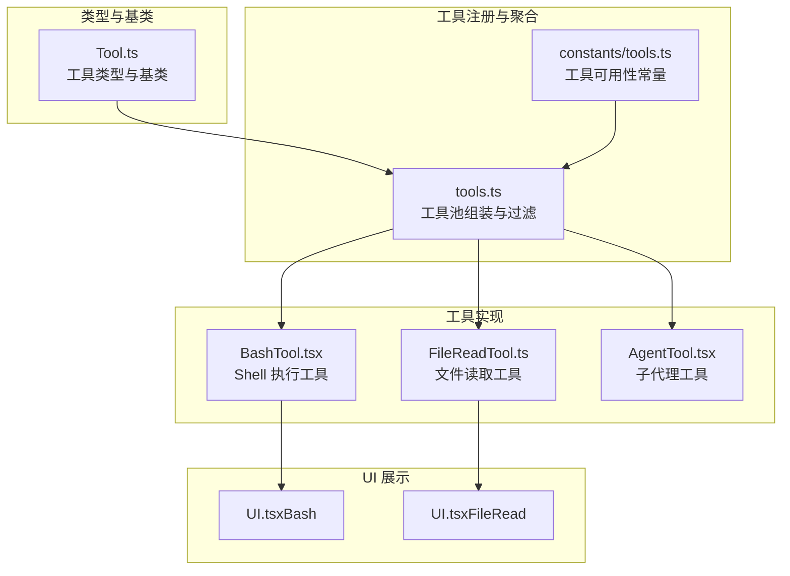
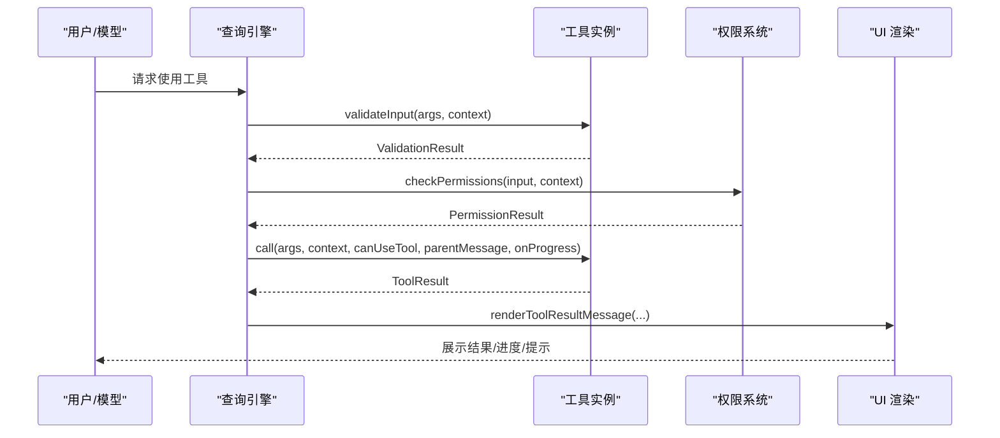
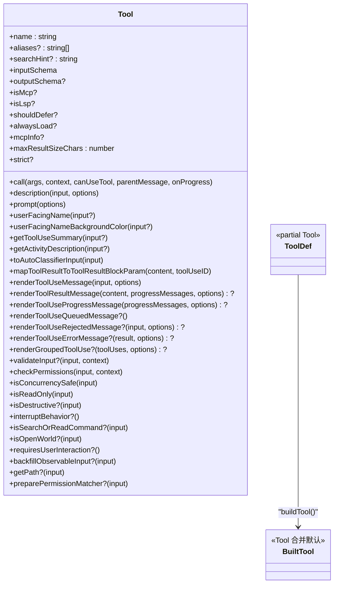
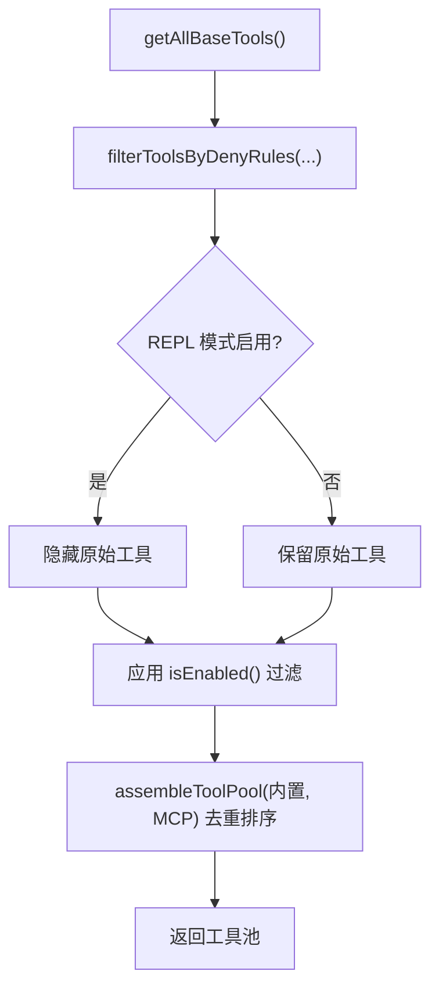
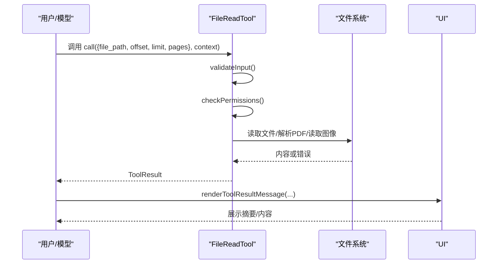
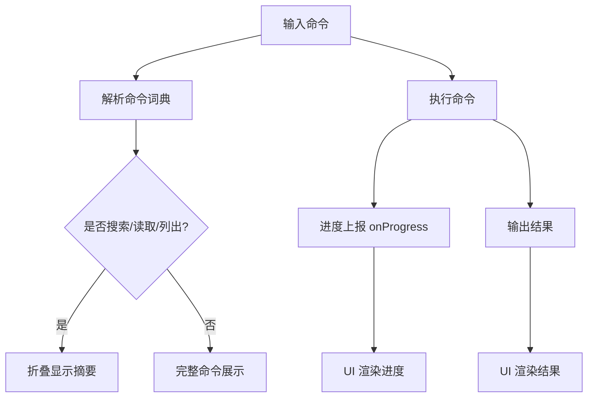
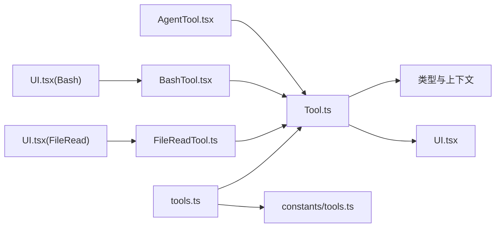

# 工具定义与类型系统

<cite>
**本文引用的文件**
- [Tool.ts](file://src/Tool.ts)
- [tools.ts](file://src/tools.ts)
- [tools.md](file://docs/tools.md)
- [FileReadTool.ts](file://src/tools/FileReadTool/FileReadTool.ts)
- [BashTool.tsx](file://src/tools/BashTool/BashTool.tsx)
- [AgentTool.tsx](file://src/tools/AgentTool/AgentTool.tsx)
- [UI.tsx（Bash）](file://src/tools/BashTool/UI.tsx)
- [UI.tsx（FileRead）](file://src/tools/FileReadTool/UI.tsx)
- [tools.ts（常量）](file://src/constants/tools.ts)
</cite>

## 目录
1. [简介](#简介)
2. [项目结构](#项目结构)
3. [核心组件](#核心组件)
4. [架构总览](#架构总览)
5. [详细组件分析](#详细组件分析)
6. [依赖分析](#依赖分析)
7. [性能考虑](#性能考虑)
8. [故障排查指南](#故障排查指南)
9. [结论](#结论)
10. [附录](#附录)

## 简介
本文件系统性阐述 Claude Code 的“工具定义与类型系统”。围绕 Tool 基类的设计理念、工具类型层次结构、元数据与生命周期方法、标准化接口（输入校验、输出格式化、错误处理）、以及典型工具实现与 UI 渲染，帮助初学者快速上手，同时为高级用户提供类型安全与可扩展性的实现细节。

## 项目结构
- 工具类型与基类定义位于 [Tool.ts](file://src/Tool.ts)，统一了工具接口、上下文、权限模型、进度与结果消息等核心抽象。
- 工具注册与聚合逻辑位于 [tools.ts](file://src/tools.ts)，负责按环境与权限过滤工具集合，并合并内置工具与 MCP 工具。
- 工具参考与目录位于 [tools.md](file://docs/tools.md)，提供工具清单与开发模式概览。
- 典型工具实现与 UI 示例：
  - 文件读取工具：[FileReadTool.ts](file://src/tools/FileReadTool/FileReadTool.ts)
  - Shell 执行工具：[BashTool.tsx](file://src/tools/BashTool/BashTool.tsx)
  - 子代理工具：[AgentTool.tsx](file://src/tools/AgentTool/AgentTool.tsx)
  - 对应 UI 组件：
    - [UI.tsx（Bash）](file://src/tools/BashTool/UI.tsx)
    - [UI.tsx（FileRead）](file://src/tools/FileReadTool/UI.tsx)
- 工具常量与可用性限制位于 [tools.ts（常量）](file://src/constants/tools.ts)。

图表来源
- [Tool.ts](file://src/Tool.ts)
- [tools.ts](file://src/tools.ts)
- [FileReadTool.ts](file://src/tools/FileReadTool/FileReadTool.ts)
- [BashTool.tsx](file://src/tools/BashTool/BashTool.tsx)
- [AgentTool.tsx](file://src/tools/AgentTool/AgentTool.tsx)
- [UI.tsx（Bash）](file://src/tools/BashTool/UI.tsx)
- [UI.tsx（FileRead）](file://src/tools/FileReadTool/UI.tsx)
- [tools.ts（常量）](file://src/constants/tools.ts)

章节来源
- [Tool.ts](file://src/Tool.ts)
- [tools.ts](file://src/tools.ts)
- [tools.md](file://docs/tools.md)

## 核心组件
- 工具类型与接口
  - 工具类型通过泛型约束输入/输出/进度，统一暴露 call、description、render 系列方法，以及可选的 validateInput、checkPermissions、isSearchOrReadCommand 等能力。
  - 工具默认行为由 buildTool 提供，确保在缺失实现时采用安全默认（如只读、非并发安全、允许权限放行等）。
- 工具上下文 ToolUseContext
  - 汇集命令、调试开关、思考配置、MCP 客户端与资源、文件读写缓存、会话状态、通知与 UI 回调等，贯穿工具执行生命周期。
- 权限与规则
  - 工具通过 checkPermissions 与匹配器 preparePermissionMatcher 实现细粒度权限控制；全局 deny 规则在 getTools/filterToolsByDenyRules 中生效。
- 进度与结果
  - 工具可通过 onProgress 发送 ToolProgress；ToolResult 支持附加新消息与上下文修改器；UI 侧通过 renderToolUse* 与 renderToolResultMessage 组合展示。

章节来源
- [Tool.ts](file://src/Tool.ts)
- [tools.ts](file://src/tools.ts)

## 架构总览
工具系统以“类型安全 + 可插拔实现 + 统一 UI”为核心目标：
- 类型层：Tool 接口 + buildTool 默认填充，保证一致性与安全性。
- 生命周期：validateInput → checkPermissions → call → renderToolResultMessage。
- UI 层：渲染调用、进度、结果与拒绝/错误 UI，支持简洁与详细两种模式。
- 集成层：tools.ts 负责按权限与环境筛选工具，合并内置与 MCP 工具，形成最终工具池。

图表来源
- [Tool.ts](file://src/Tool.ts)
- [tools.ts](file://src/tools.ts)

## 详细组件分析

### Tool 基类与类型系统
- 设计理念
  - 以类型安全为核心：通过泛型约束输入/输出/进度，确保编译期检查与运行期一致性。
  - 以默认安全为原则：未实现的方法采用保守默认（如只读、非并发安全、允许权限），避免误用风险。
  - 以可扩展为目标：统一的 buildTool 将默认实现与具体工具实现解耦，便于新增工具与维护。
- 关键接口
  - 输入/输出/进度：inputSchema、outputSchema、progress 类型。
  - 生命周期：call、validateInput、checkPermissions、isConcurrencySafe、isReadOnly、isDestructive、interruptBehavior、isSearchOrReadCommand、isOpenWorld、requiresUserInteraction、isMcp/isLsp、shouldDefer/alwaysLoad、mcpInfo、maxResultSizeChars、strict、backfillObservableInput、toAutoClassifierInput、mapToolResultToToolResultBlockParam、renderToolUseMessage/renderToolResultMessage/renderToolUseProgressMessage/renderToolUseQueuedMessage/renderToolUseRejectedMessage/renderToolUseErrorMessage/renderGroupedToolUse 等。
  - 描述与展示：description、prompt、userFacingName、userFacingNameBackgroundColor、getToolUseSummary、getActivityDescription、extractSearchText、isResultTruncated、renderToolUseTag。
- 工具集合与构建
  - Tools 为只读数组别名；buildTool 合并默认实现与自定义实现，生成完整工具对象。

图表来源
- [Tool.ts](file://src/Tool.ts)

章节来源
- [Tool.ts](file://src/Tool.ts)

### 工具注册与工具池装配
- 工具注册
  - 在 [tools.ts](file://src/tools.ts) 中集中导入与注册工具，按环境变量与特性门控条件性加载，避免不必要的依赖与打包体积。
- 工具池装配
  - getTools：按权限上下文过滤工具，结合 REPL 模式隐藏原始工具，尊重 isEnabled()。
  - assembleToolPool：合并内置工具与 MCP 工具，去重并保持排序稳定，确保提示缓存命中。
  - getMergedTools：返回包含 MCP 工具的完整列表，用于需要考虑 MCP 工具的场景。
- 权限过滤
  - filterToolsByDenyRules：基于权限规则对工具进行黑名单过滤，匹配策略与运行时一致。

图表来源
- [tools.ts](file://src/tools.ts)

章节来源
- [tools.ts](file://src/tools.ts)
- [tools.ts（常量）](file://src/constants/tools.ts)

### 文件读取工具（FileReadTool）示例
- 输入/输出与权限
  - 输入包含文件路径、偏移/限制（文本范围）、PDF 页面范围等；输出根据类型区分文本、图片、笔记本、PDF、分页提取、未变更等。
  - validateInput 对页面范围、二进制扩展、设备路径等进行预检；checkPermissions 基于路径匹配规则与权限上下文决定是否允许。
- 并发与只读
  - isConcurrencySafe 返回 true；isReadOnly 返回 true。
- 结果映射与 UI
  - mapToolResultToToolResultBlockParam 将不同输出类型映射为 SDK 消息块；UI 组件渲染“读取了 N 行/图像大小/PDF 大小/分页数量”等摘要信息。
- 特殊优化
  - 文件内容去重：若同一范围且文件未变更，直接返回“未变更”占位，减少重复传输与缓存开销。

图表来源
- [FileReadTool.ts](file://src/tools/FileReadTool/FileReadTool.ts)
- [UI.tsx（FileRead）](file://src/tools/FileReadTool/UI.tsx)

章节来源
- [FileReadTool.ts](file://src/tools/FileReadTool/FileReadTool.ts)
- [UI.tsx（FileRead）](file://src/tools/FileReadTool/UI.tsx)

### Shell 执行工具（BashTool）示例
- 输入/输出与 UI
  - 输入为命令字符串；输出为结构化结果（stdout、stderr、退出码、耗时等）；UI 通过 UI.tsx 渲染命令摘要、进度与结果。
- 搜索/读取命令识别
  - isSearchOrReadBashCommand 基于命令词典识别搜索/读取/列出类命令，用于 UI 折叠显示。
- 权限与只读
  - 通过权限规则与只读约束（readOnlyValidation）控制危险命令；silent 命令在成功时显示“完成”而非“无输出”。
- 进度与中断
  - 支持长时间任务的进度展示与后台运行提示；支持中断行为（取消/阻塞）。

图表来源
- [BashTool.tsx](file://src/tools/BashTool/BashTool.tsx)
- [UI.tsx（Bash）](file://src/tools/BashTool/UI.tsx)

章节来源
- [BashTool.tsx](file://src/tools/BashTool/BashTool.tsx)
- [UI.tsx（Bash）](file://src/tools/BashTool/UI.tsx)

### 子代理工具（AgentTool）示例
- 输入/输出与多态
  - 输入包含任务描述、提示、子代理类型、模型选择、隔离模式（工作树/远程）等；输出同步完成或异步启动（含 agentId、输出文件路径等）。
- 多代理与团队
  - 支持团队创建/删除、消息发送、权限模式（plan/bypass/auto）等；UI 支持分组渲染与后台提示。
- 进度与生命周期
  - 通过 runAgent 与任务系统管理生命周期，支持前台/后台运行与自动后台策略。

章节来源
- [AgentTool.tsx](file://src/tools/AgentTool/AgentTool.tsx)

### 工具元数据与生命周期方法
- 元数据
  - name、aliases、searchHint、mcpInfo、shouldDefer/alwaysLoad、strict、maxResultSizeChars 等。
- 生命周期方法
  - validateInput：输入校验（纯计算，不触发 I/O）。
  - checkPermissions：权限决策（与通用权限系统协作）。
  - call：核心执行逻辑，返回 ToolResult。
  - renderToolUseMessage / renderToolResultMessage / renderToolUseProgressMessage / renderToolUseRejectedMessage / renderToolUseErrorMessage：UI 渲染。
  - isConcurrencySafe / isReadOnly / isDestructive：并发与破坏性标记。
  - isSearchOrReadCommand / isOpenWorld / requiresUserInteraction：交互与展示语义。
  - toAutoClassifierInput：分类器输入摘要。
  - mapToolResultToToolResultBlockParam：结果到 SDK 消息块的映射。
  - backfillObservableInput：观察者可见输入的后填充（兼容历史字段）。
  - getPath：针对文件路径类工具的路径提取。
  - preparePermissionMatcher：权限规则匹配器（用于 hook/规则匹配）。

章节来源
- [Tool.ts](file://src/Tool.ts)

### 标准化接口与错误处理
- 输入验证
  - validateInput 优先进行路径展开、规则匹配、二进制/设备路径等预检，避免不必要的 I/O。
- 输出格式化
  - mapToolResultToToolResultBlockParam 将内部输出映射为 SDK 消息块，确保跨 UI/SDK 的一致性。
- 错误处理
  - renderToolUseErrorMessage 提供统一错误 UI；部分工具（如 FileReadTool）在 call 内捕获错误并给出友好提示（如相似文件建议）。
- 权限与拒绝
  - checkPermissions 返回权限决策；UI 提供 renderToolUseRejectedMessage 自定义拒绝视图。

章节来源
- [FileReadTool.ts](file://src/tools/FileReadTool/FileReadTool.ts)
- [UI.tsx（FileRead）](file://src/tools/FileReadTool/UI.tsx)
- [UI.tsx（Bash）](file://src/tools/BashTool/UI.tsx)

### 异步操作与 UI 交互
- 异步工具
  - AgentTool 支持异步启动与后台运行；BashTool 支持长时间任务的进度与后台提示。
- UI 交互
  - UI.tsx 提供工具使用消息、进度消息、排队消息、错误消息与拒绝消息的渲染；支持简洁/详细模式切换与主题适配。

章节来源
- [AgentTool.tsx](file://src/tools/AgentTool/AgentTool.tsx)
- [BashTool.tsx](file://src/tools/BashTool/BashTool.tsx)
- [UI.tsx（Bash）](file://src/tools/BashTool/UI.tsx)
- [UI.tsx（FileRead）](file://src/tools/FileReadTool/UI.tsx)

## 依赖分析
- 工具类型依赖
  - Tool.ts 依赖消息类型、权限类型、MCP 类型、系统提示类型、文件状态缓存、工具结果存储等，形成强类型闭环。
- 工具注册依赖
  - tools.ts 依赖各工具模块与权限过滤器，按环境变量与特性门控动态装配。
- UI 依赖
  - 各工具 UI 依赖 Ink 组件、快捷键绑定、主题与工具类型，确保一致的终端体验。

图表来源
- [Tool.ts](file://src/Tool.ts)
- [tools.ts](file://src/tools.ts)
- [FileReadTool.ts](file://src/tools/FileReadTool/FileReadTool.ts)
- [BashTool.tsx](file://src/tools/BashTool/BashTool.tsx)
- [AgentTool.tsx](file://src/tools/AgentTool/AgentTool.tsx)
- [UI.tsx（FileRead）](file://src/tools/FileReadTool/UI.tsx)
- [UI.tsx（Bash）](file://src/tools/BashTool/UI.tsx)
- [tools.ts（常量）](file://src/constants/tools.ts)

章节来源
- [Tool.ts](file://src/Tool.ts)
- [tools.ts](file://src/tools.ts)
- [tools.ts（常量）](file://src/constants/tools.ts)

## 性能考虑
- 输入预检与短路
  - validateInput 优先进行字符串/路径层面的检查，避免昂贵 I/O 与权限判定。
- 结果缓存与去重
  - FileReadTool 使用 readFileState 缓存已读取范围，检测文件时间戳未变化时返回“未变更”占位，显著降低重复传输与缓存开销。
- 并发安全
  - isConcurrencySafe 标记工具是否可并行执行，避免资源竞争与状态冲突。
- UI 折叠与节流
  - 搜索/读取命令识别与 UI 折叠减少冗余展示；进度阈值与后台提示避免 UI 卡顿。

章节来源
- [FileReadTool.ts](file://src/tools/FileReadTool/FileReadTool.ts)
- [BashTool.tsx](file://src/tools/BashTool/BashTool.tsx)

## 故障排查指南
- 输入校验失败
  - 检查 validateInput 的返回值与错误码，确认路径、范围、二进制/设备路径等是否符合要求。
- 权限被拒绝
  - 查看 checkPermissions 的决策与规则匹配；确认 deny 规则与通配符模式是否覆盖目标路径或命令。
- UI 显示异常
  - 检查 renderToolUseMessage / renderToolResultMessage / renderToolUseErrorMessage 的实现；确认主题、样式与 verbose 模式设置。
- 结果映射问题
  - 核对 mapToolResultToToolResultBlockParam 的分支与 SDK 消息块结构，确保字段完整与类型正确。

章节来源
- [Tool.ts](file://src/Tool.ts)
- [FileReadTool.ts](file://src/tools/FileReadTool/FileReadTool.ts)
- [UI.tsx（FileRead）](file://src/tools/FileReadTool/UI.tsx)
- [UI.tsx（Bash）](file://src/tools/BashTool/UI.tsx)

## 结论
Claude Code 的工具系统以类型安全为基础，通过统一的 Tool 接口与 buildTool 默认实现，实现了“可插拔 + 可观测 + 可扩展”的工具生态。配合权限系统、UI 渲染与工具池装配，既满足初学者快速上手，也为高级用户提供了强大的定制空间与性能保障。

## 附录
- 快速开始
  - 使用 buildTool 定义工具，至少实现 name、inputSchema、call、checkPermissions、isConcurrencySafe、isReadOnly、prompt、renderToolUseMessage、renderToolResultMessage。
  - 在 tools.ts 中注册工具，并通过 getTools/assembleToolPool 获取工具池。
- 参考文档
  - [tools.md](file://docs/tools.md) 提供工具清单与开发模式概览。

章节来源
- [tools.md](file://docs/tools.md)
- [tools.ts](file://src/tools.ts)
- [Tool.ts](file://src/Tool.ts)