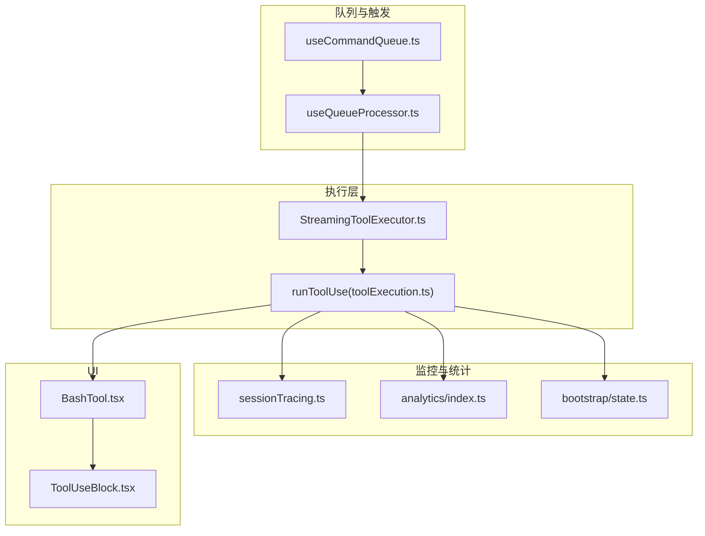
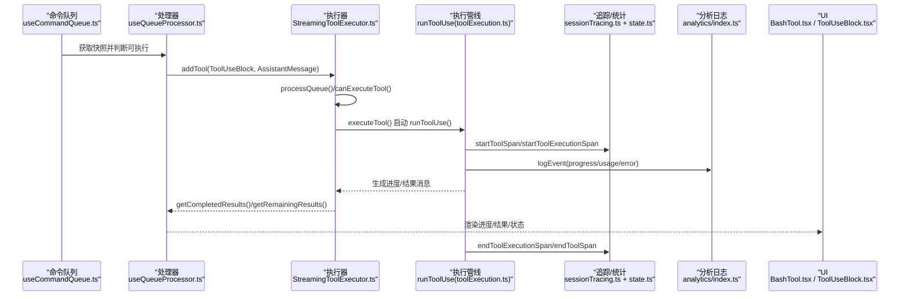
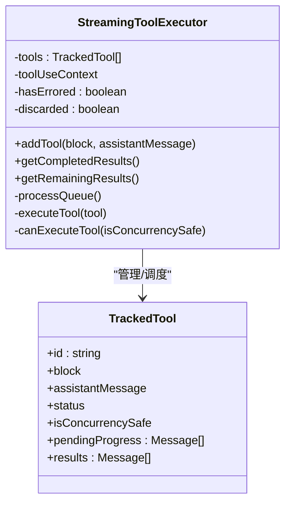
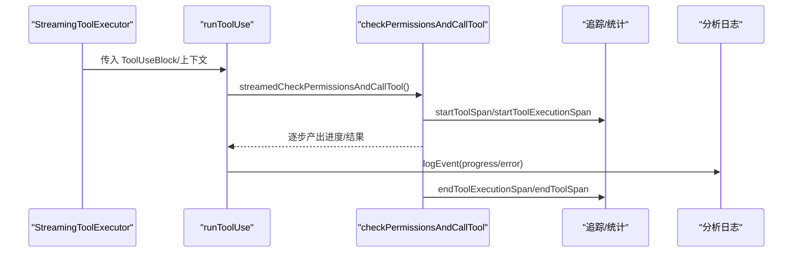
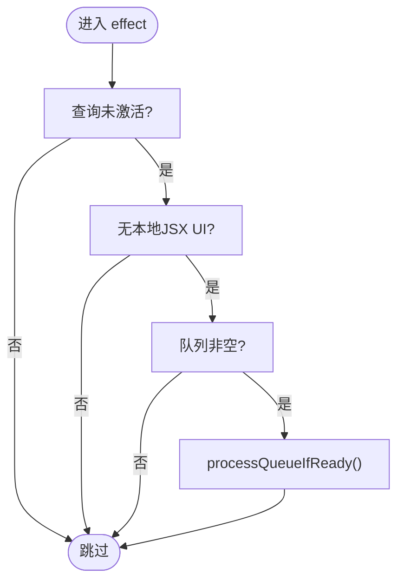
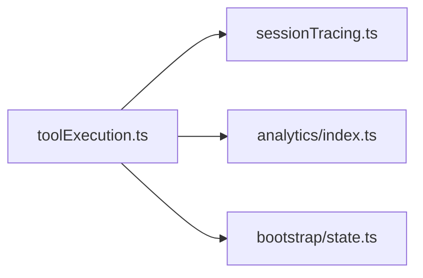
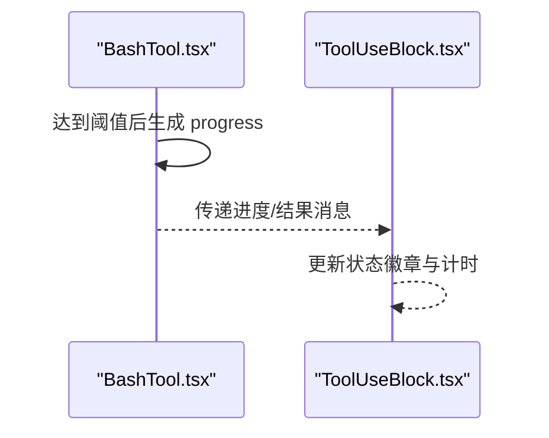
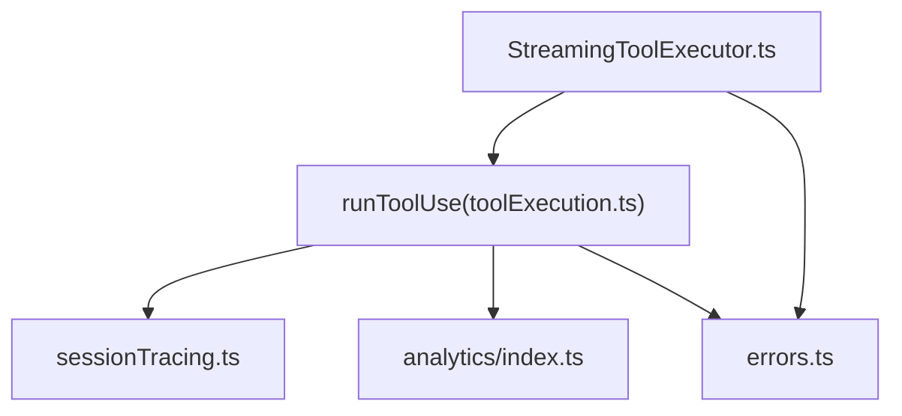

# 工具执行与监控

<cite>
**本文引用的文件**
- [StreamingToolExecutor.ts](file://src/services/tools/StreamingToolExecutor.ts)
- [toolExecution.ts](file://src/services/tools/toolExecution.ts)
- [useQueueProcessor.ts](file://src/hooks/useQueueProcessor.ts)
- [useCommandQueue.ts](file://src/hooks/useCommandQueue.ts)
- [sessionTracing.ts](file://src/utils/telemetry/sessionTracing.ts)
- [index.ts](file://src/services/analytics/index.ts)
- [state.ts](file://src/bootstrap/state.ts)
- [errors.ts](file://src/utils/errors.ts)
- [BashTool.tsx](file://src/tools/BashTool/BashTool.tsx)
- [ToolUseBlock.tsx](file://web/components/tools/ToolUseBlock.tsx)
</cite>

## 目录
1. [简介](#简介)
2. [项目结构](#项目结构)
3. [核心组件](#核心组件)
4. [架构总览](#架构总览)
5. [详细组件分析](#详细组件分析)
6. [依赖关系分析](#依赖关系分析)
7. [性能考量](#性能考量)
8. [故障排查指南](#故障排查指南)
9. [结论](#结论)
10. [附录](#附录)

## 简介
本文件系统性阐述 Claude Code 中“工具执行与监控”的设计与实现，覆盖以下主题：
- 工具执行引擎的工作原理与生命周期管理
- 并发控制机制（队列、资源分配、执行顺序）
- 监控指标（执行时长、资源消耗、成功率/错误率统计）
- 进度报告机制（实时状态更新、中间结果输出、完成通知）
- 错误处理策略（重试、降级、故障恢复）
- 开发者优化建议与监控系统集成方法

## 项目结构
围绕工具执行与监控的关键模块如下：
- 执行引擎：StreamingToolExecutor 负责并发安全的工具调度与结果产出
- 执行管线：runToolUse 及其子流程负责权限校验、输入校验、工具调用与进度事件
- 队列与触发：useQueueProcessor/useCommandQueue 提供统一命令队列与触发条件
- 监控与追踪：sessionTracing 提供 OpenTelemetry/Perfetto 双轨追踪；analytics 提供事件日志；state 提供会话级统计
- UI 展示：BashTool.tsx 与 ToolUseBlock.tsx 提供进度与状态展示

图表来源
- [StreamingToolExecutor.ts:40-124](file://src/services/tools/StreamingToolExecutor.ts#L40-L124)
- [toolExecution.ts:337-490](file://src/services/tools/toolExecution.ts#L337-L490)
- [useQueueProcessor.ts:28-67](file://src/hooks/useQueueProcessor.ts#L28-L67)
- [useCommandQueue.ts:13-15](file://src/hooks/useCommandQueue.ts#L13-L15)
- [sessionTracing.ts:176-272](file://src/utils/telemetry/sessionTracing.ts#L176-L272)
- [index.ts:133-164](file://src/services/analytics/index.ts#L133-L164)
- [state.ts:582-590](file://src/bootstrap/state.ts#L582-L590)
- [BashTool.tsx:54-76](file://src/tools/BashTool/BashTool.tsx#L54-L76)
- [ToolUseBlock.tsx:64-125](file://web/components/tools/ToolUseBlock.tsx#L64-L125)

章节来源
- [StreamingToolExecutor.ts:40-124](file://src/services/tools/StreamingToolExecutor.ts#L40-L124)
- [toolExecution.ts:337-490](file://src/services/tools/toolExecution.ts#L337-L490)
- [useQueueProcessor.ts:28-67](file://src/hooks/useQueueProcessor.ts#L28-L67)
- [useCommandQueue.ts:13-15](file://src/hooks/useCommandQueue.ts#L13-L15)
- [sessionTracing.ts:176-272](file://src/utils/telemetry/sessionTracing.ts#L176-L272)
- [index.ts:133-164](file://src/services/analytics/index.ts#L133-L164)
- [state.ts:582-590](file://src/bootstrap/state.ts#L582-L590)
- [BashTool.tsx:54-76](file://src/tools/BashTool/BashTool.tsx#L54-L76)
- [ToolUseBlock.tsx:64-125](file://web/components/tools/ToolUseBlock.tsx#L64-L125)

## 核心组件
- StreamingToolExecutor：维护工具队列与并发状态，按并发安全规则调度执行，缓冲并有序产出结果与进度消息。
- runToolUse：封装权限检查、输入校验、工具调用与进度事件，统一产出消息流。
- sessionTracing：提供交互、LLM 请求、工具调用、阻塞等待等多层级追踪，支持 OTel 与 Perfetto。
- analytics：事件日志门面，支持同步/异步事件记录与延迟初始化。
- bootstrap/state：会话级统计（总工具耗时、次数、令牌用量等），用于监控与报表。
- UI 组件：BashTool.tsx 与 ToolUseBlock.tsx 提供进度阈值、状态徽章与计时显示。

章节来源
- [StreamingToolExecutor.ts:40-124](file://src/services/tools/StreamingToolExecutor.ts#L40-L124)
- [toolExecution.ts:337-490](file://src/services/tools/toolExecution.ts#L337-L490)
- [sessionTracing.ts:466-524](file://src/utils/telemetry/sessionTracing.ts#L466-L524)
- [index.ts:133-164](file://src/services/analytics/index.ts#L133-L164)
- [state.ts:582-590](file://src/bootstrap/state.ts#L582-L590)
- [BashTool.tsx:54-76](file://src/tools/BashTool/BashTool.tsx#L54-L76)
- [ToolUseBlock.tsx:64-125](file://web/components/tools/ToolUseBlock.tsx#L64-L125)

## 架构总览
工具执行从“命令队列”触发，经“并发调度器”进入“工具执行管线”，在执行过程中通过“进度事件”与“工具结果”回传到 UI；同时“追踪与统计”贯穿全链路，形成可观测闭环。

图表来源
- [useCommandQueue.ts:13-15](file://src/hooks/useCommandQueue.ts#L13-L15)
- [useQueueProcessor.ts:48-67](file://src/hooks/useQueueProcessor.ts#L48-L67)
- [StreamingToolExecutor.ts:140-151](file://src/services/tools/StreamingToolExecutor.ts#L140-L151)
- [toolExecution.ts:337-490](file://src/services/tools/toolExecution.ts#L337-L490)
- [sessionTracing.ts:466-524](file://src/utils/telemetry/sessionTracing.ts#L466-L524)
- [index.ts:133-164](file://src/services/analytics/index.ts#L133-L164)
- [BashTool.tsx:1108-1143](file://src/tools/BashTool/BashTool.tsx#L1108-L1143)
- [ToolUseBlock.tsx:64-125](file://web/components/tools/ToolUseBlock.tsx#L64-L125)

## 详细组件分析

### 组件一：StreamingToolExecutor（并发执行与状态跟踪）
- 职责
  - 维护 TrackedTool 列表，跟踪状态（queued/executing/completed/yielded）与待定进度
  - 基于 isConcurrencySafe 决策是否允许并发执行，保证非并发工具串行
  - 收集工具结果与上下文修改器，按顺序产出消息
  - 处理中断、兄弟工具错误传播与丢弃（流式回退）
- 关键点
  - canExecuteTool：仅当无执行中工具或全部并发安全时才启动新工具
  - executeTool：为每个工具创建子 AbortController，支持兄弟进程级联取消
  - 进度优先：pendingProgress 队列优先产出，确保 UI 实时反馈
  - 上下文一致性：非并发工具完成后应用上下文修改器，保持顺序语义

图表来源
- [StreamingToolExecutor.ts:21-52](file://src/services/tools/StreamingToolExecutor.ts#L21-L52)
- [StreamingToolExecutor.ts:129-151](file://src/services/tools/StreamingToolExecutor.ts#L129-L151)
- [StreamingToolExecutor.ts:265-405](file://src/services/tools/StreamingToolExecutor.ts#L265-L405)

章节来源
- [StreamingToolExecutor.ts:40-124](file://src/services/tools/StreamingToolExecutor.ts#L40-L124)
- [StreamingToolExecutor.ts:129-151](file://src/services/tools/StreamingToolExecutor.ts#L129-L151)
- [StreamingToolExecutor.ts:265-405](file://src/services/tools/StreamingToolExecutor.ts#L265-L405)
- [StreamingToolExecutor.ts:412-490](file://src/services/tools/StreamingToolExecutor.ts#L412-L490)

### 组件二：runToolUse（工具调用生命周期）
- 职责
  - 解析工具名与输入，进行权限与输入校验
  - 包装为进度事件与最终结果的消息流
  - 记录分析事件（tengu_tool_use_progress/tengu_tool_use_error 等）
  - 在 Bash 等工具上触发阻塞等待与执行阶段的追踪
- 关键点
  - 输入校验失败与验证失败均转为带错误标记的 tool_result
  - 进度事件通过 createProgressMessage 产出，同时上报分析事件
  - 对 Bash 工具的兄弟错误传播使用 siblingAbortController

图表来源
- [toolExecution.ts:337-490](file://src/services/tools/toolExecution.ts#L337-L490)
- [toolExecution.ts:492-570](file://src/services/tools/toolExecution.ts#L492-L570)
- [toolExecution.ts:599-752](file://src/services/tools/toolExecution.ts#L599-L752)
- [sessionTracing.ts:466-524](file://src/utils/telemetry/sessionTracing.ts#L466-L524)
- [index.ts:133-164](file://src/services/analytics/index.ts#L133-L164)

章节来源
- [toolExecution.ts:337-490](file://src/services/tools/toolExecution.ts#L337-L490)
- [toolExecution.ts:492-570](file://src/services/tools/toolExecution.ts#L492-L570)
- [toolExecution.ts:599-752](file://src/services/tools/toolExecution.ts#L599-L752)
- [toolExecution.ts:150-171](file://src/services/tools/toolExecution.ts#L150-L171)

### 组件三：队列与触发（useQueueProcessor/useCommandQueue）
- 职责
  - useCommandQueue：订阅全局命令队列，返回冻结快照，驱动 UI 与逻辑重新渲染
  - useQueueProcessor：在查询未激活、无本地 UI 阻塞、队列非空时触发批量执行
- 关键点
  - 通过 useSyncExternalStore 绕过上下文传播延迟，避免 Ink 环境下的漏通知
  - 优先级：now > next（用户输入）> later（任务通知）

图表来源
- [useQueueProcessor.ts:48-67](file://src/hooks/useQueueProcessor.ts#L48-L67)
- [useCommandQueue.ts:13-15](file://src/hooks/useCommandQueue.ts#L13-L15)

章节来源
- [useQueueProcessor.ts:28-67](file://src/hooks/useQueueProcessor.ts#L28-L67)
- [useCommandQueue.ts:13-15](file://src/hooks/useCommandQueue.ts#L13-L15)

### 组件四：监控与统计（sessionTracing、analytics、state）
- sessionTracing
  - 交互、LLM 请求、工具调用、阻塞等待、执行阶段等多级 span
  - 支持 OTel 与 Perfetto 双轨记录，自动清理超时未结束的 span
- analytics
  - 事件门面，支持同步/异步记录；未绑定 sink 时缓存事件，启动后批量投递
- state
  - 会话级统计：总工具耗时、次数、令牌用量等，用于仪表盘与报表

图表来源
- [toolExecution.ts:522-556](file://src/services/tools/toolExecution.ts#L522-L556)
- [sessionTracing.ts:176-272](file://src/utils/telemetry/sessionTracing.ts#L176-L272)
- [index.ts:133-164](file://src/services/analytics/index.ts#L133-L164)
- [state.ts:582-590](file://src/bootstrap/state.ts#L582-L590)

章节来源
- [sessionTracing.ts:176-272](file://src/utils/telemetry/sessionTracing.ts#L176-L272)
- [sessionTracing.ts:466-524](file://src/utils/telemetry/sessionTracing.ts#L466-L524)
- [index.ts:133-164](file://src/services/analytics/index.ts#L133-L164)
- [state.ts:582-590](file://src/bootstrap/state.ts#L582-L590)

### 组件五：进度报告与 UI 展示（BashTool.tsx、ToolUseBlock.tsx）
- BashTool.tsx
  - 使用 PROGRESS_THRESHOLD_MS 控制何时显示进度与后台化提示
  - 持续产生 progress 类型消息，携带耗时、行数、字节等指标
- ToolUseBlock.tsx
  - 显示运行中/错误/完成状态与耗时
  - 运行中显示旋转加载与计时器

图表来源
- [BashTool.tsx:1108-1143](file://src/tools/BashTool/BashTool.tsx#L1108-L1143)
- [ToolUseBlock.tsx:64-125](file://web/components/tools/ToolUseBlock.tsx#L64-L125)

章节来源
- [BashTool.tsx:54-76](file://src/tools/BashTool/BashTool.tsx#L54-L76)
- [BashTool.tsx:1108-1143](file://src/tools/BashTool/BashTool.tsx#L1108-L1143)
- [ToolUseBlock.tsx:64-125](file://web/components/tools/ToolUseBlock.tsx#L64-L125)

## 依赖关系分析
- StreamingToolExecutor 依赖：
  - 工具定义与输入校验（findToolByName、inputSchema）
  - runToolUse（实际工具调用）
  - 分析事件与追踪（logEvent、startToolSpan 等）
  - 错误分类与短栈（classifyToolError、shortErrorStack）
- runToolUse 依赖：
  - 权限钩子、预/后置钩子、MCP 工具解析
  - 追踪与分析事件
  - 任务输出与 UI 进度

图表来源
- [StreamingToolExecutor.ts:76-124](file://src/services/tools/StreamingToolExecutor.ts#L76-L124)
- [toolExecution.ts:337-490](file://src/services/tools/toolExecution.ts#L337-L490)
- [sessionTracing.ts:466-524](file://src/utils/telemetry/sessionTracing.ts#L466-L524)
- [index.ts:133-164](file://src/services/analytics/index.ts#L133-L164)
- [errors.ts:150-171](file://src/utils/errors.ts#L150-L171)

章节来源
- [StreamingToolExecutor.ts:76-124](file://src/services/tools/StreamingToolExecutor.ts#L76-L124)
- [toolExecution.ts:337-490](file://src/services/tools/toolExecution.ts#L337-L490)
- [errors.ts:150-171](file://src/utils/errors.ts#L150-L171)

## 性能考量
- 并发策略
  - 并发安全工具可并行，非并发工具串行，避免资源竞争与状态不一致
  - 兄弟 Bash 工具错误传播通过 siblingAbortController 立即终止后续子进程
- 进度与 UI
  - PROGRESS_THRESHOLD_MS 控制进度阈值，避免频繁 UI 更新
  - 进度消息优先产出，提升感知响应
- 追踪与采样
  - OTel/Perfetto 双轨记录，自动清理超时 span，降低内存压力
  - 分析事件支持异步记录，减少主线程阻塞
- 统计维度
  - 会话级总工具耗时、次数、令牌用量，便于趋势分析与容量规划

[本节为通用指导，无需具体文件引用]

## 故障排查指南
- 常见问题与定位
  - 输入校验失败：查看 InputValidationError 日志与错误详情
  - 权限拒绝/阻塞：关注 blocked_on_user 阶段与决策来源
  - 工具执行异常：通过 classifyToolError 提取稳定错误标识
  - Bash 工具级联失败：兄弟工具被 sibling_abort 触发取消
- 排查步骤
  - 检查 runToolUse 的错误分支与分析事件
  - 查看 sessionTracing 的工具执行阶段与耗时
  - 核对 state 中的工具耗时与次数统计
  - 使用 UI 的状态徽章与计时辅助定位卡顿点

章节来源
- [toolExecution.ts:614-752](file://src/services/tools/toolExecution.ts#L614-L752)
- [toolExecution.ts:150-171](file://src/services/tools/toolExecution.ts#L150-L171)
- [sessionTracing.ts:526-624](file://src/utils/telemetry/sessionTracing.ts#L526-L624)
- [state.ts:582-590](file://src/bootstrap/state.ts#L582-L590)
- [errors.ts:150-171](file://src/utils/errors.ts#L150-L171)

## 结论
该体系以 StreamingToolExecutor 为核心，结合 runToolUse 的严格生命周期与进度事件，配合 sessionTracing、analytics 与 state 的多维监控，实现了高并发、可观测、可扩展的工具执行平台。通过合理的并发策略、进度阈值与错误传播机制，既保障了用户体验，也为性能优化与故障定位提供了坚实基础。

[本节为总结性内容，无需具体文件引用]

## 附录
- 代码示例路径（不含具体代码内容）
  - 工具执行器实现：[StreamingToolExecutor.ts:40-124](file://src/services/tools/StreamingToolExecutor.ts#L40-L124)
  - 工具调用生命周期：[toolExecution.ts:337-490](file://src/services/tools/toolExecution.ts#L337-L490)
  - 并发控制与队列处理：[StreamingToolExecutor.ts:129-151](file://src/services/tools/StreamingToolExecutor.ts#L129-L151)
  - 进度阈值与 UI 展示：[BashTool.tsx:54-76](file://src/tools/BashTool/BashTool.tsx#L54-L76), [ToolUseBlock.tsx:64-125](file://web/components/tools/ToolUseBlock.tsx#L64-L125)
  - 监控与统计接口：[sessionTracing.ts:466-524](file://src/utils/telemetry/sessionTracing.ts#L466-L524), [index.ts:133-164](file://src/services/analytics/index.ts#L133-L164), [state.ts:582-590](file://src/bootstrap/state.ts#L582-L590)
  - 错误处理与分类：[toolExecution.ts:150-171](file://src/services/tools/toolExecution.ts#L150-L171), [errors.ts:150-171](file://src/utils/errors.ts#L150-L171)