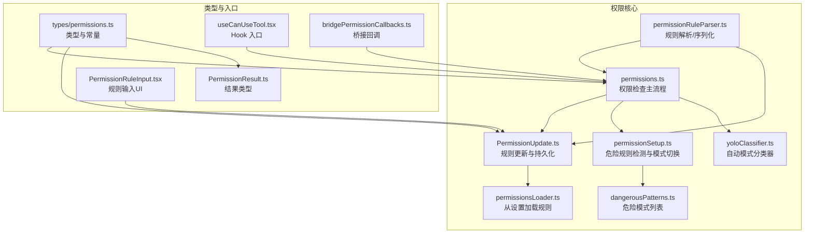
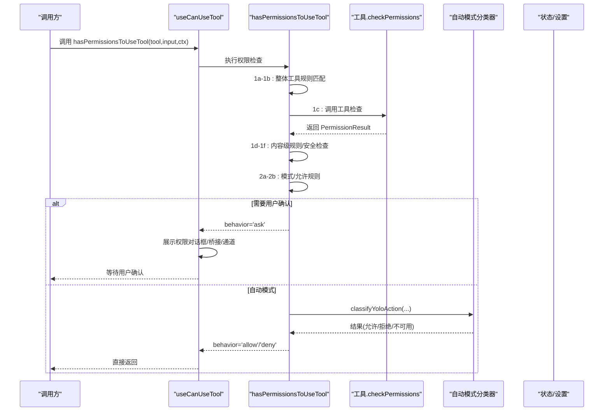
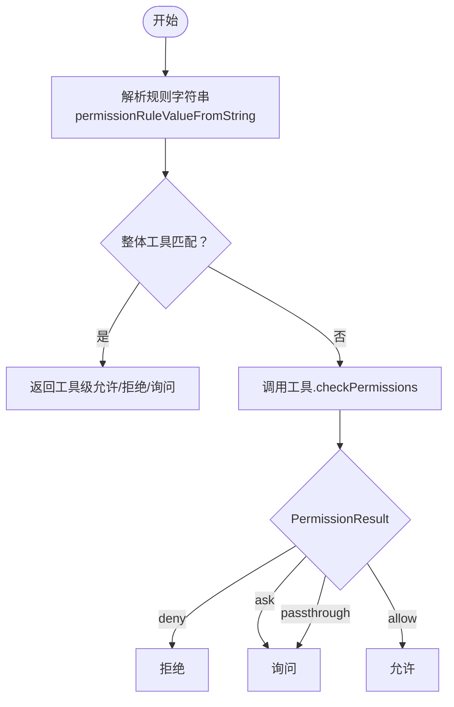
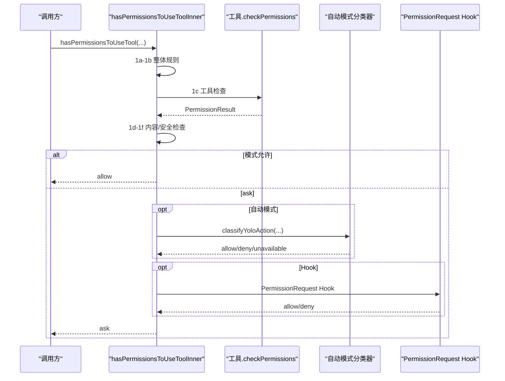
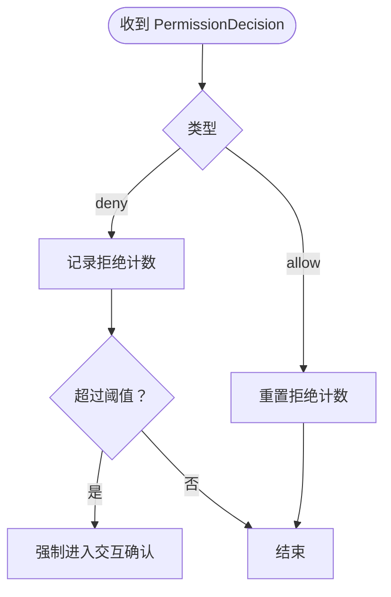
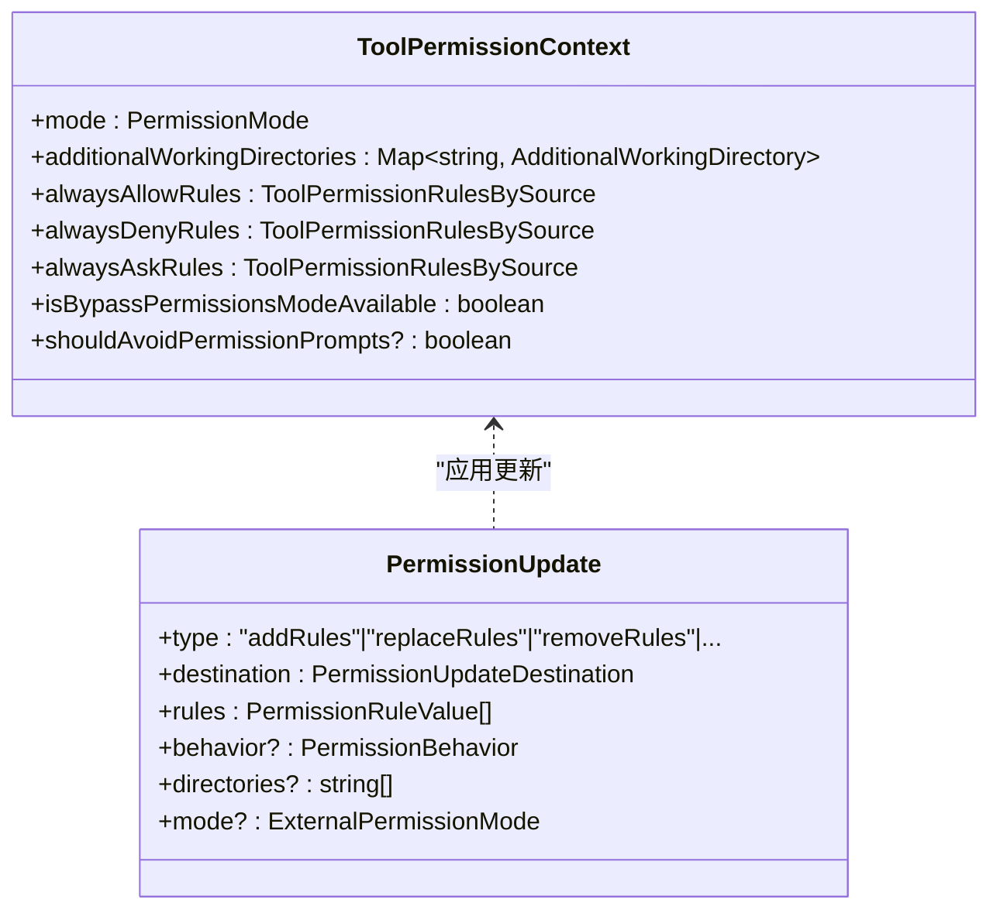
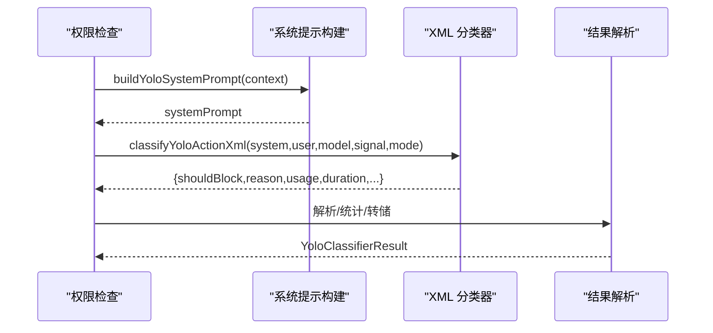
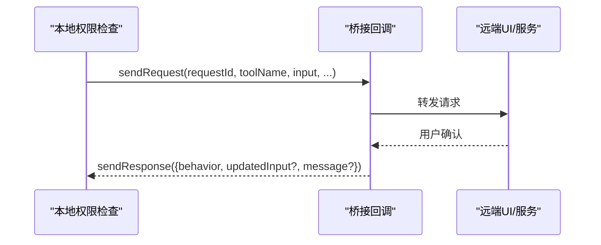
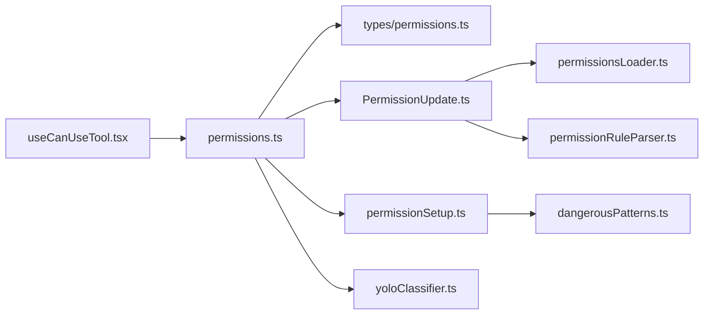

# 工具权限与安全控制

<cite>
**本文档引用的文件**
- [permissions.ts](file://src/utils/permissions/permissions.ts)
- [PermissionUpdate.ts](file://src/utils/permissions/PermissionUpdate.ts)
- [permissionSetup.ts](file://src/utils/permissions/permissionSetup.ts)
- [permissionRuleParser.ts](file://src/utils/permissions/permissionRuleParser.ts)
- [permissionsLoader.ts](file://src/utils/permissions/permissionsLoader.ts)
- [permissions.ts（类型定义）](file://src/types/permissions.ts)
- [useCanUseTool.tsx](file://src/hooks/useCanUseTool.tsx)
- [dangerousPatterns.ts](file://src/utils/permissions/dangerousPatterns.ts)
- [yoloClassifier.ts](file://src/utils/permissions/yoloClassifier.ts)
- [bridgePermissionCallbacks.ts](file://src/bridge/bridgePermissionCallbacks.ts)
- [PermissionResult.ts](file://src/utils/permissions/PermissionResult.ts)
- [PermissionUpdate.ts（组件）](file://src/utils/permissions/PermissionUpdate.ts)
- [PermissionRuleInput.tsx](file://src/components/permissions/rules/PermissionRuleInput.tsx)
</cite>

## 目录
1. [简介](#简介)
2. [项目结构](#项目结构)
3. [核心组件](#核心组件)
4. [架构总览](#架构总览)
5. [详细组件分析](#详细组件分析)
6. [依赖关系分析](#依赖关系分析)
7. [性能考虑](#性能考虑)
8. [故障排除指南](#故障排除指南)
9. [结论](#结论)
10. [附录](#附录)

## 简介
本文件系统性阐述 Claude Code 工具权限与安全控制体系的设计与实现，覆盖权限模型层次、规则匹配机制、检查流程（静态/动态/运行时）、拒绝规则（全局/特定工具/条件）、权限上下文构建、决策实现、安全最佳实践以及扩展与自定义策略的实现细节。文档面向开发者与安全工程师，既提供高层概览也包含代码级参考。

## 项目结构
权限系统主要分布在以下模块：
- 权限核心逻辑：src/utils/permissions/*.ts
- 类型与常量：src/types/permissions.ts
- Hook 入口：src/hooks/useCanUseTool.tsx
- 规则解析与持久化：permissionRuleParser.ts、permissionsLoader.ts、PermissionUpdate.ts
- 危险模式与自动模式分类器：dangerousPatterns.ts、yoloClassifier.ts
- 桥接回调：bridgePermissionCallbacks.ts
- UI 规则编辑：src/components/permissions/rules/*.tsx

**图表来源**
- [permissions.ts:1158-1319](file://src/utils/permissions/permissions.ts#L1158-L1319)
- [PermissionUpdate.ts:55-206](file://src/utils/permissions/PermissionUpdate.ts#L55-L206)
- [permissionSetup.ts:1-120](file://src/utils/permissions/permissionSetup.ts#L1-L120)
- [permissionRuleParser.ts:93-152](file://src/utils/permissions/permissionRuleParser.ts#L93-L152)
- [permissionsLoader.ts:120-145](file://src/utils/permissions/permissionsLoader.ts#L120-L145)
- [dangerousPatterns.ts:14-82](file://src/utils/permissions/dangerousPatterns.ts#L14-L82)
- [yoloClassifier.ts:484-540](file://src/utils/permissions/yoloClassifier.ts#L484-L540)
- [types/permissions.ts:1-120](file://src/types/permissions.ts#L1-L120)
- [useCanUseTool.tsx:28-191](file://src/hooks/useCanUseTool.tsx#L28-L191)
- [PermissionResult.ts:1-35](file://src/utils/permissions/PermissionResult.ts#L1-L35)
- [bridgePermissionCallbacks.ts:1-46](file://src/bridge/bridgePermissionCallbacks.ts#L1-L46)
- [PermissionRuleInput.tsx:79-113](file://src/components/permissions/rules/PermissionRuleInput.tsx#L79-L113)

**章节来源**
- [permissions.ts:1-120](file://src/utils/permissions/permissions.ts#L1-L120)
- [types/permissions.ts:1-120](file://src/types/permissions.ts#L1-L120)

## 核心组件
- 权限检查主流程：hasPermissionsToUseTool 及其内部 hasPermissionsToUseToolInner，负责规则匹配、模式转换、自动模式分类器、Hook 钩子等。
- 权限上下文：ToolPermissionContext，承载模式、额外工作目录、三类规则集合、是否避免权限提示等。
- 规则更新与持久化：applyPermissionUpdate/applyPermissionUpdates、persistPermissionUpdates，支持 add/remove/replace 规则及目录。
- 规则解析与加载：permissionRuleParser（字符串↔规则值）、permissionsLoader（从设置源加载规则）。
- 自动模式分类器：yoloClassifier 构建系统提示、两阶段 XML 分类、错误转储与统计。
- 桥接回调：bridgePermissionCallbacks 定义桥接场景下的请求/响应协议。
- Hook 入口：useCanUseTool 将权限检查与 UI、桥接、通道回调集成。

**章节来源**
- [permissions.ts:473-1319](file://src/utils/permissions/permissions.ts#L473-L1319)
- [types/permissions.ts:413-443](file://src/types/permissions.ts#L413-L443)
- [PermissionUpdate.ts:55-206](file://src/utils/permissions/PermissionUpdate.ts#L55-L206)
- [permissionRuleParser.ts:93-152](file://src/utils/permissions/permissionRuleParser.ts#L93-L152)
- [permissionsLoader.ts:120-145](file://src/utils/permissions/permissionsLoader.ts#L120-L145)
- [yoloClassifier.ts:484-540](file://src/utils/permissions/yoloClassifier.ts#L484-L540)
- [bridgePermissionCallbacks.ts:1-46](file://src/bridge/bridgePermissionCallbacks.ts#L1-L46)
- [useCanUseTool.tsx:28-191](file://src/hooks/useCanUseTool.tsx#L28-L191)

## 架构总览
权限系统采用“规则驱动 + 模式控制 + 自动分类器”的分层设计：
- 规则层：允许/拒绝/询问三类规则，按来源（用户/项目/本地/会话/命令行/标志）组织。
- 模式层：默认、禁止询问、接受编辑、计划、旁路权限、自动模式等，影响最终决策。
- 实现层：工具实现的 checkPermissions 提供内容级规则；自动模式分类器在无法交互时进行安全判定。
- 回收层：危险规则检测与清理、拒绝次数限制、错误转储与审计。

**图表来源**
- [permissions.ts:1158-1319](file://src/utils/permissions/permissions.ts#L1158-L1319)
- [yoloClassifier.ts:711-800](file://src/utils/permissions/yoloClassifier.ts#L711-L800)
- [useCanUseTool.tsx:32-191](file://src/hooks/useCanUseTool.tsx#L32-L191)

## 详细组件分析

### 权限模型与规则系统
- 规则值与来源
  - 规则值：{ toolName, ruleContent? }，支持转义括号以存储复杂内容。
  - 来源：userSettings、projectSettings、localSettings、flagSettings、policySettings、cliArg、command、session。
  - 行为：allow/deny/ask。
- 规则匹配
  - 整体工具匹配：仅当 ruleContent 为空时匹配“整个工具”。
  - 内容级匹配：通过工具实现的 checkPermissions 返回 PermissionResult，支持 ask/deny/allow/passthrough。
  - MCP 工具匹配：支持 mcp__server 或 mcp__server__* 通配符匹配。
- 规则解析与序列化
  - escapeRuleContent/unescapeRuleContent 处理括号转义。
  - permissionRuleValueFromString/permissionRuleValueToString 支持解析/生成规则字符串。
- 规则加载与持久化
  - loadAllPermissionRulesFromDisk 从启用的设置源加载规则。
  - applyPermissionUpdate/replaceRules/addRules/removeRules 统一更新上下文。
  - persistPermissionUpdates 将更新写回设置文件（可选）。

**图表来源**
- [permissions.ts:238-302](file://src/utils/permissions/permissions.ts#L238-L302)
- [permissionRuleParser.ts:93-152](file://src/utils/permissions/permissionRuleParser.ts#L93-L152)

**章节来源**
- [permissionRuleParser.ts:18-152](file://src/utils/permissions/permissionRuleParser.ts#L18-L152)
- [permissionsLoader.ts:120-145](file://src/utils/permissions/permissionsLoader.ts#L120-L145)
- [PermissionUpdate.ts:55-206](file://src/utils/permissions/PermissionUpdate.ts#L55-L206)

### 权限检查流程（静态/动态/运行时）
- 静态检查（规则层）
  - 1a：整体工具被拒绝
  - 1b：整体工具被要求询问
  - 1c：工具实现的 checkPermissions 返回结果
  - 1d：工具实现明确拒绝
  - 1f：内容级“询问”规则优先于旁路权限
  - 1g：安全检查（如敏感路径）必须询问
- 动态检查（模式与Hook）
  - 2a：模式决定（旁路权限/计划模式可用旁路）
  - 2b：允许规则命中
  - 3：将 passthrough 转换为 ask
  - 运行时：自动模式分类器、Hook 请求、桥接回调
- 运行时权限验证
  - 不要询问模式：ask 转 deny
  - 自动模式：使用分类器替代人工确认，失败时根据门控策略 fail-closed/fail-open
  - Headless 场景：先尝试 PermissionRequest Hook，再自动拒绝

**图表来源**
- [permissions.ts:1158-1319](file://src/utils/permissions/permissions.ts#L1158-L1319)
- [yoloClassifier.ts:711-800](file://src/utils/permissions/yoloClassifier.ts#L711-L800)

**章节来源**
- [permissions.ts:1158-1319](file://src/utils/permissions/permissions.ts#L1158-L1319)

### 权限拒绝规则与实现
- 全局拒绝：deny 规则直接拒绝
- 特定工具拒绝：工具级 deny 或内容级 deny
- 条件拒绝：安全检查（敏感路径/环境）、Hook 拒绝、自动模式拒绝
- 拒绝限制：连续/累计拒绝次数超过阈值后强制进入交互确认

**图表来源**
- [permissions.ts:984-1058](file://src/utils/permissions/permissions.ts#L984-L1058)

**章节来源**
- [permissions.ts:984-1058](file://src/utils/permissions/permissions.ts#L984-L1058)

### 权限上下文构建与更新
- ToolPermissionContext 字段
  - mode：当前权限模式
  - additionalWorkingDirectories：额外工作目录映射
  - alwaysAllow/Deny/AskRules：按来源组织的规则集合
  - isBypassPermissionsModeAvailable：计划模式下是否可用旁路权限
  - shouldAvoidPermissionPrompts：避免权限提示（后台/无头）
- 更新操作
  - addRules/replaceRules/removeRules：增删改规则
  - addDirectories/removeDirectories：增删额外工作目录
  - setMode：切换模式

**图表来源**
- [types/permissions.ts:413-443](file://src/types/permissions.ts#L413-L443)
- [PermissionUpdate.ts:55-206](file://src/utils/permissions/PermissionUpdate.ts#L55-L206)

**章节来源**
- [types/permissions.ts:413-443](file://src/types/permissions.ts#L413-L443)
- [PermissionUpdate.ts:55-206](file://src/utils/permissions/PermissionUpdate.ts#L55-L206)

### 自动模式分类器与安全控制
- 系统提示构建：根据外部/内部模板、用户自定义规则、Bash/PowerShell 指南拼装
- 两阶段 XML 分类：快速阶段 + 思考阶段，支持 fast/thinking/both 模式
- 错误处理：API 不可用时的 fail-closed/fail-open 策略，超长提示的降级处理
- 统计与审计：token 使用、延迟、原因、请求 ID、会话关联

**图表来源**
- [yoloClassifier.ts:484-540](file://src/utils/permissions/yoloClassifier.ts#L484-L540)
- [yoloClassifier.ts:711-800](file://src/utils/permissions/yoloClassifier.ts#L711-L800)

**章节来源**
- [yoloClassifier.ts:484-540](file://src/utils/permissions/yoloClassifier.ts#L484-L540)
- [yoloClassifier.ts:711-800](file://src/utils/permissions/yoloClassifier.ts#L711-L800)

### 桥接与远程权限控制
- 桥接回调接口：sendRequest/sendResponse/cancelRequest/onResponse
- 用于将权限请求转发到远端（Web 应用），并在用户确认后返回行为（允许/拒绝）

**图表来源**
- [bridgePermissionCallbacks.ts:10-27](file://src/bridge/bridgePermissionCallbacks.ts#L10-L27)

**章节来源**
- [bridgePermissionCallbacks.ts:1-46](file://src/bridge/bridgePermissionCallbacks.ts#L1-L46)

### 规则编写与UI示例
- 规则格式：工具名或 工具名(内容)，内容中括号需转义
- UI 输入建议：提供示例与占位提示，帮助用户正确输入规则
- 示例路径参考：
  - 规则输入组件示例：[PermissionRuleInput.tsx:79-113](file://src/components/permissions/rules/PermissionRuleInput.tsx#L79-L113)

**章节来源**
- [permissionRuleParser.ts:55-152](file://src/utils/permissions/permissionRuleParser.ts#L55-L152)
- [PermissionRuleInput.tsx:79-113](file://src/components/permissions/rules/PermissionRuleInput.tsx#L79-L113)

## 依赖关系分析
- 权限核心依赖类型定义（避免循环导入）
- 规则解析与持久化相互协作
- 自动模式分类器依赖系统提示构建与工具投影
- Hook 入口串联 UI、桥接与分类器

**图表来源**
- [permissions.ts:1-120](file://src/utils/permissions/permissions.ts#L1-L120)
- [types/permissions.ts:1-120](file://src/types/permissions.ts#L1-L120)
- [PermissionUpdate.ts:1-50](file://src/utils/permissions/PermissionUpdate.ts#L1-L50)
- [permissionSetup.ts:1-120](file://src/utils/permissions/permissionSetup.ts#L1-L120)
- [yoloClassifier.ts:1-80](file://src/utils/permissions/yoloClassifier.ts#L1-L80)
- [useCanUseTool.tsx:20-30](file://src/hooks/useCanUseTool.tsx#L20-L30)
- [permissionsLoader.ts:1-40](file://src/utils/permissions/permissionsLoader.ts#L1-L40)
- [permissionRuleParser.ts:1-40](file://src/utils/permissions/permissionRuleParser.ts#L1-L40)
- [dangerousPatterns.ts:1-40](file://src/utils/permissions/dangerousPatterns.ts#L1-L40)

**章节来源**
- [permissions.ts:1-120](file://src/utils/permissions/permissions.ts#L1-L120)
- [types/permissions.ts:1-120](file://src/types/permissions.ts#L1-L120)

## 性能考虑
- 规则匹配优化：对规则按来源聚合，减少重复解析；内容级规则通过 Map 缓存。
- 自动模式分类器：使用 prompt caching（1小时TTL）、两阶段模式、短文本输出格式，降低 token 消耗。
- 拒绝限制：超过阈值后强制交互，避免无限自动拒绝导致的性能浪费。
- Hook 与分类器并发：在 Bash 工具中支持推测式分类器结果，缩短等待时间。

[本节为通用指导，无需具体文件引用]

## 故障排除指南
- 分类器不可用：根据门控策略选择 fail-closed（拒绝并提示）或 fail-open（退回正常交互）。
- 超长提示：自动模式分类器提示过长时，降级为正常交互，避免无意义重试。
- 拒绝阈值触发：连续/累计拒绝超过阈值后强制交互，可在 /permissions 查看历史。
- 桥接请求取消：本地取消挂起的桥接请求，避免 UI 停滞。
- Hook 异常：Hook 失败不崩溃，回退到自动拒绝或正常交互。

**章节来源**
- [permissions.ts:843-876](file://src/utils/permissions/permissions.ts#L843-L876)
- [permissions.ts:889-901](file://src/utils/permissions/permissions.ts#L889-L901)
- [permissions.ts:932-952](file://src/utils/permissions/permissions.ts#L932-L952)
- [bridgePermissionCallbacks.ts:21-27](file://src/bridge/bridgePermissionCallbacks.ts#L21-L27)

## 结论
该权限系统通过“规则 + 模式 + 分类器 + Hook”的组合，在保证安全性的同时兼顾易用性与可扩展性。其核心优势在于：
- 清晰的规则语法与来源管理
- 灵活的模式切换与自动模式分类器
- 严格的危险规则检测与拒绝限制
- 完整的审计与错误转储能力

## 附录

### 安全最佳实践
- 最小权限原则：默认 deny，仅在必要时添加 allow/ask 规则。
- 审计与日志：开启自动模式分类器事件与错误转储，定期审查拒绝统计。
- 漏洞防护：禁用危险前缀规则（如 Bash/PowerShell 的解释器前缀），在自动模式下严格校验。
- 环境隔离：结合额外工作目录与沙箱策略，限制工具作用范围。

[本节为通用指导，无需具体文件引用]

### 扩展与自定义
- 自定义权限策略
  - 新增规则来源：在 PermissionRuleSource 中扩展，并在 PermissionUpdateDestination 中声明可持久化来源。
  - 自定义模式：在 INTERNAL_PERMISSION_MODES 中注册新模式，并在 transitionPermissionMode 中处理状态切换。
  - 自定义分类器：扩展 yoloClassifier 的系统提示与解析逻辑，适配企业规则。
- 自定义 Hook
  - 在 PermissionRequest Hook 中实现业务逻辑，支持 allow/deny/interrupt。
- 规则 UI
  - 借助 PermissionRuleInput.tsx 的示例，扩展规则输入与校验逻辑。

**章节来源**
- [types/permissions.ts:16-38](file://src/types/permissions.ts#L16-L38)
- [permissionSetup.ts:597-646](file://src/utils/permissions/permissionSetup.ts#L597-L646)
- [yoloClassifier.ts:484-540](file://src/utils/permissions/yoloClassifier.ts#L484-L540)
- [PermissionRuleInput.tsx:79-113](file://src/components/permissions/rules/PermissionRuleInput.tsx#L79-L113)