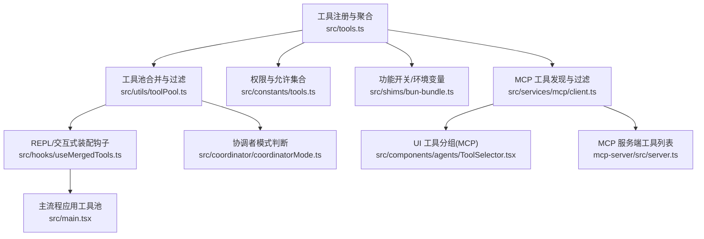
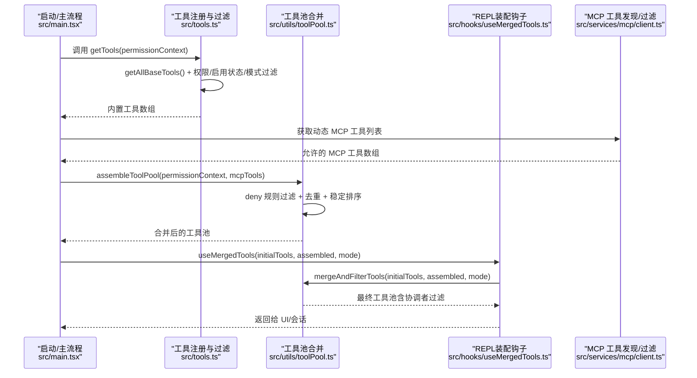
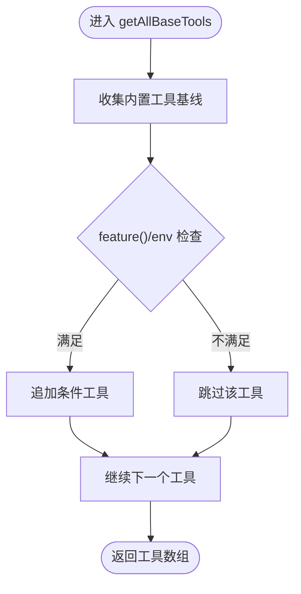
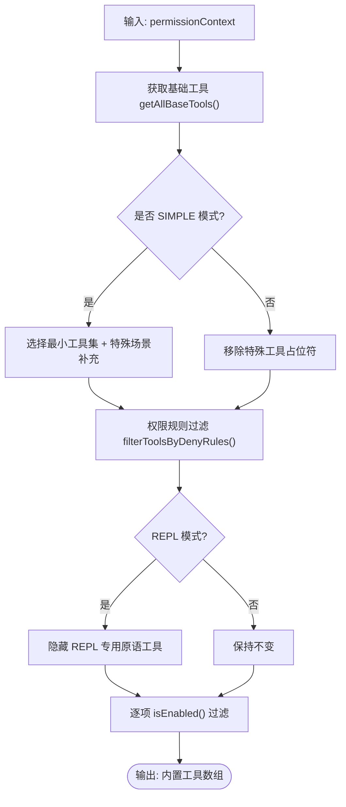
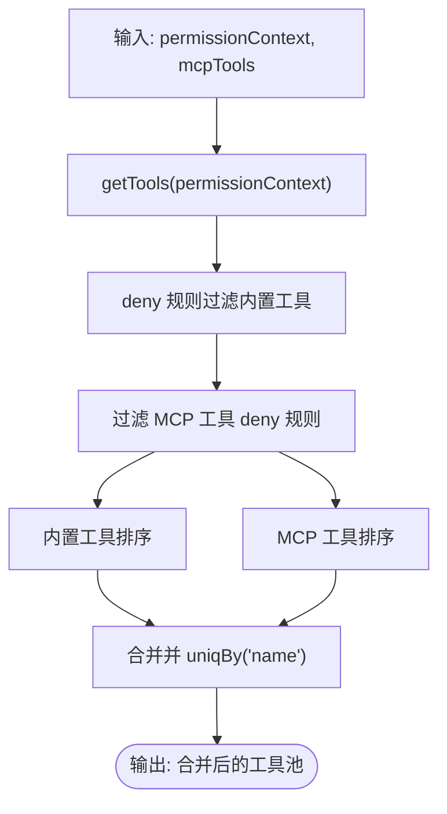
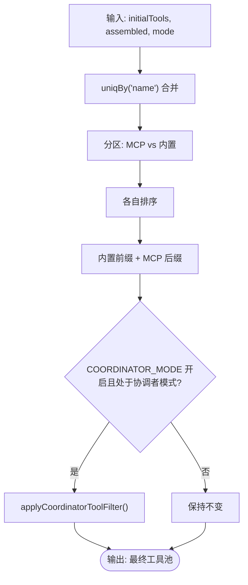
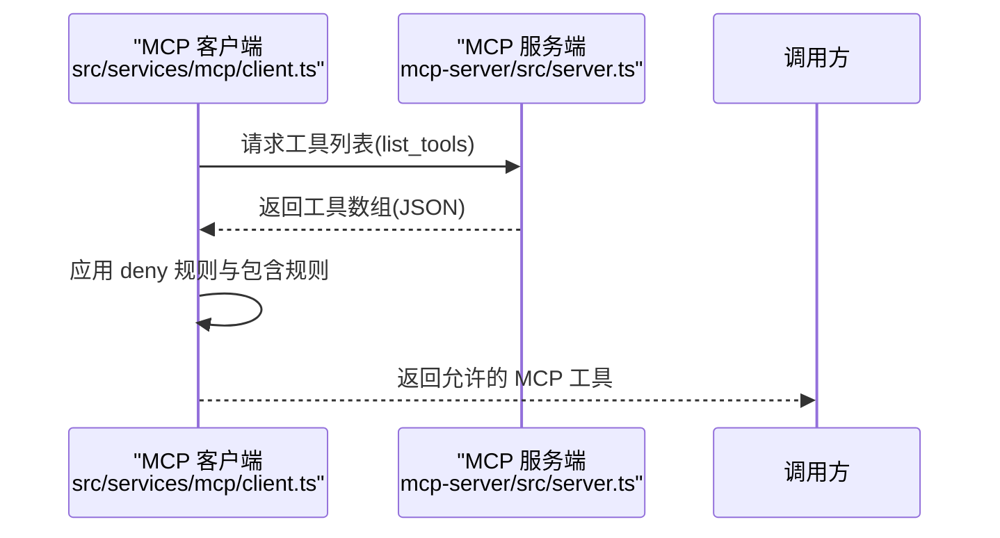
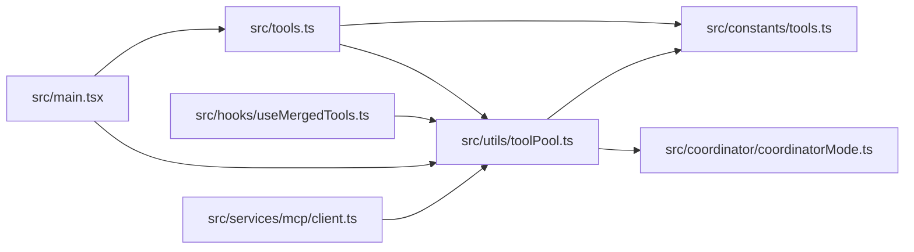

# 工具注册与发现机制

<cite>
**本文引用的文件**
- [src/tools.ts](file://src/tools.ts)
- [src/utils/toolPool.ts](file://src/utils/toolPool.ts)
- [src/hooks/useMergedTools.ts](file://src/hooks/useMergedTools.ts)
- [src/constants/tools.ts](file://src/constants/tools.ts)
- [src/coordinator/coordinatorMode.ts](file://src/coordinator/coordinatorMode.ts)
- [src/shims/bun-bundle.ts](file://src/shims/bun-bundle.ts)
- [src/main.tsx](file://src/main.tsx)
- [src/services/mcp/client.ts](file://src/services/mcp/client.ts)
- [src/components/agents/ToolSelector.tsx](file://src/components/agents/ToolSelector.tsx)
- [mcp-server/src/server.ts](file://mcp-server/src/server.ts)
</cite>

## 目录
1. [引言](#引言)
2. [项目结构](#项目结构)
3. [核心组件](#核心组件)
4. [架构总览](#架构总览)
5. [详细组件分析](#详细组件分析)
6. [依赖关系分析](#依赖关系分析)
7. [性能考量](#性能考量)
8. [故障排查指南](#故障排查指南)
9. [结论](#结论)
10. [附录](#附录)

## 引言
本文件系统性解析 Claude Code 的工具注册与发现机制，重点覆盖以下方面：
- 工具注册表的构建：getAllBaseTools() 的装配逻辑与条件加载策略（feature flags、环境变量、动态导入）。
- 工具获取与过滤：getTools() 如何结合权限规则、启用状态与 REPL/协调者模式进行筛选。
- 工具池组装：内置工具与 MCP 工具的合并策略、去重与排序稳定性。
- 发现与过滤：权限规则、启用状态检查、MCP 工具过滤、以及协调者模式下的专用过滤。
- 实践示例：通过代码片段路径展示工具注册流程、动态加载技术与工具池管理。

本指南既面向初学者解释初始化与基本概念，也为高级用户提供性能优化与扩展机制的实现细节。

## 项目结构
与工具注册与发现直接相关的关键模块如下：
- 工具注册与聚合：src/tools.ts
- 工具池合并与协调者过滤：src/utils/toolPool.ts
- REPL/交互式工具池装配钩子：src/hooks/useMergedTools.ts
- 权限与允许集合常量：src/constants/tools.ts
- 协调者模式开关与判断：src/coordinator/coordinatorMode.ts
- 功能开关与环境变量辅助：src/shims/bun-bundle.ts
- 主流程中工具池应用与合成：src/main.tsx
- MCP 工具发现与过滤：src/services/mcp/client.ts
- UI 层工具分组与 MCP 标识：src/components/agents/ToolSelector.tsx
- MCP 服务端工具列表导出：mcp-server/src/server.ts

**图表来源**
- [src/tools.ts:193-367](file://src/tools.ts#L193-L367)
- [src/utils/toolPool.ts:55-79](file://src/utils/toolPool.ts#L55-L79)
- [src/hooks/useMergedTools.ts:20-44](file://src/hooks/useMergedTools.ts#L20-L44)
- [src/constants/tools.ts:36-112](file://src/constants/tools.ts#L36-L112)
- [src/coordinator/coordinatorMode.ts:36-41](file://src/coordinator/coordinatorMode.ts#L36-L41)
- [src/shims/bun-bundle.ts:39-41](file://src/shims/bun-bundle.ts#L39-L41)
- [src/main.tsx:1870-1901](file://src/main.tsx#L1870-L1901)
- [src/services/mcp/client.ts:1980-1998](file://src/services/mcp/client.ts#L1980-L1998)
- [src/components/agents/ToolSelector.tsx:54-74](file://src/components/agents/ToolSelector.tsx#L54-L74)
- [mcp-server/src/server.ts:379-414](file://mcp-server/src/server.ts#L379-L414)

**章节来源**
- [src/tools.ts:193-367](file://src/tools.ts#L193-L367)
- [src/utils/toolPool.ts:55-79](file://src/utils/toolPool.ts#L55-L79)
- [src/hooks/useMergedTools.ts:20-44](file://src/hooks/useMergedTools.ts#L20-L44)
- [src/constants/tools.ts:36-112](file://src/constants/tools.ts#L36-L112)
- [src/coordinator/coordinatorMode.ts:36-41](file://src/coordinator/coordinatorMode.ts#L36-L41)
- [src/shims/bun-bundle.ts:39-41](file://src/shims/bun-bundle.ts#L39-L41)
- [src/main.tsx:1870-1901](file://src/main.tsx#L1870-L1901)
- [src/services/mcp/client.ts:1980-1998](file://src/services/mcp/client.ts#L1980-L1998)
- [src/components/agents/ToolSelector.tsx:54-74](file://src/components/agents/ToolSelector.tsx#L54-L74)
- [mcp-server/src/server.ts:379-414](file://mcp-server/src/server.ts#L379-L414)

## 核心组件
- 工具注册表构建器：getAllBaseTools() 返回当前环境可提供的“全部基础工具”清单，严格遵循 feature flags、环境变量与运行时能力检测，确保死代码消除与按需加载。
- 工具获取与过滤器：getTools() 在基础工具之上，结合权限上下文、REPL 模式、简单模式、启用状态等进行二次过滤与调整。
- 工具池组装器：assembleToolPool() 将内置工具与 MCP 工具合并，执行权限过滤、名称去重与稳定排序，保证提示缓存键稳定。
- 工具池合并与协调者过滤：mergeAndFilterTools() 负责将初始工具与已组装工具合并，维持内置工具前缀连续性，并在协调者模式下进行最终过滤。
- 权限与允许集合：constants/tools.ts 定义了不同场景（异步代理、协调者模式、进程内同伴等）的允许/禁止工具集合。
- 协调者模式：coordinatorMode.ts 提供模式判断与内部工具白名单，确保协调者仅暴露必要工具。
- 功能开关与环境变量：bun-bundle.ts 的 feature() 与 env 变量辅助函数统一管理特性开关与环境配置。
- 主流程集成：main.tsx 在动作执行前应用协调者过滤并注入合成输出工具，确保与 REPL/交互路径一致。

**章节来源**
- [src/tools.ts:193-367](file://src/tools.ts#L193-L367)
- [src/utils/toolPool.ts:55-79](file://src/utils/toolPool.ts#L55-L79)
- [src/hooks/useMergedTools.ts:20-44](file://src/hooks/useMergedTools.ts#L20-L44)
- [src/constants/tools.ts:36-112](file://src/constants/tools.ts#L36-L112)
- [src/coordinator/coordinatorMode.ts:36-41](file://src/coordinator/coordinatorMode.ts#L36-L41)
- [src/shims/bun-bundle.ts:39-41](file://src/shims/bun-bundle.ts#L39-L41)
- [src/main.tsx:1870-1901](file://src/main.tsx#L1870-L1901)

## 架构总览
工具系统从“注册表构建”到“池装配”的端到端流程如下：

**图表来源**
- [src/main.tsx:1870-1901](file://src/main.tsx#L1870-L1901)
- [src/tools.ts:271-327](file://src/tools.ts#L271-L327)
- [src/utils/toolPool.ts:55-79](file://src/utils/toolPool.ts#L55-L79)
- [src/hooks/useMergedTools.ts:20-44](file://src/hooks/useMergedTools.ts#L20-L44)
- [src/services/mcp/client.ts:1980-1998](file://src/services/mcp/client.ts#L1980-L1998)

## 详细组件分析

### 组件一：工具注册表构建器 getAllBaseTools()
- 职责：返回当前环境“可能可用”的完整工具清单，严格受 feature flags、环境变量与运行时能力控制，确保死代码消除与按需加载。
- 关键点：
  - 使用 feature() 与 isEnvTruthy/process.env 判定是否引入特定工具或功能。
  - 对嵌入式能力（如搜索工具）进行条件拼接，避免冗余。
  - 显式包含 MCP 资源工具以支持后续动态发现。
- 复杂度：线性时间 O(N)，N 为工具项数量；空间 O(N) 存储工具数组。
- 扩展建议：新增工具时，遵循同一条件分支模式，避免硬编码依赖。

**图表来源**
- [src/tools.ts:193-251](file://src/tools.ts#L193-L251)

**章节来源**
- [src/tools.ts:193-251](file://src/tools.ts#L193-L251)

### 组件二：工具获取与过滤器 getTools()
- 职责：在基础工具上进行权限、模式与启用状态的最终筛选，生成“对当前会话有效”的工具集。
- 关键点：
  - 支持简单模式（仅 Bash/Read/Edit 等），并在 REPL/协调者模式下做特殊处理。
  - 隐藏 REPL 专用原语工具，防止直接调用。
  - 过滤掉被权限规则“全量拒绝”的工具。
  - 逐个检查工具的 isEnabled()，剔除禁用项。
- 复杂度：O(N + M)，N 为内置工具数，M 为 deny 规则匹配成本；过滤后再次 O(K) 检查启用状态。

**图表来源**
- [src/tools.ts:271-327](file://src/tools.ts#L271-L327)

**章节来源**
- [src/tools.ts:271-327](file://src/tools.ts#L271-L327)

### 组件三：工具池组装器 assembleToolPool()
- 职责：将内置工具与 MCP 工具合并，执行权限过滤、去重与稳定排序，保证提示缓存键稳定。
- 关键点：
  - 先对内置工具与 MCP 工具分别排序，再合并，确保内置工具作为连续前缀。
  - 去重策略：uniqBy('name')，内置工具优先。
  - 与服务器缓存策略对齐：内置工具前缀连续，避免中间插入导致缓存失效。
- 复杂度：O(B log B + M log M + (B+M))，B/M 分别为内置与 MCP 工具数。

**图表来源**
- [src/tools.ts:345-367](file://src/tools.ts#L345-L367)

**章节来源**
- [src/tools.ts:345-367](file://src/tools.ts#L345-L367)

### 组件四：工具池合并与协调者过滤 mergeAndFilterTools()
- 职责：在 REPL/交互式路径中，将初始工具与已组装工具合并，维持内置工具前缀连续，并在协调者模式下进行最终过滤。
- 关键点：
  - 初始工具优先于已组装工具（去重时后者被前者覆盖）。
  - 分区排序：先内置后 MCP，各自内部排序，保证缓存友好。
  - 协调者模式过滤：仅保留 COORDINATOR_MODE_ALLOWED_TOOLS 或 PR 订阅类工具。
- 复杂度：O(I log I + T log T + T)，I 为初始工具数，T 为组装后工具数。

**图表来源**
- [src/utils/toolPool.ts:55-79](file://src/utils/toolPool.ts#L55-L79)

**章节来源**
- [src/utils/toolPool.ts:55-79](file://src/utils/toolPool.ts#L55-L79)

### 组件五：权限规则与允许集合
- deny 规则过滤：filterToolsByDenyRules() 基于权限上下文对工具进行“全量拒绝”过滤，匹配策略与运行时一致。
- 允许集合：
  - 异步代理允许工具集：ASYNC_AGENT_ALLOWED_TOOLS
  - 协调者模式允许工具集：COORDINATOR_MODE_ALLOWED_TOOLS
  - 进程内同伴允许工具集：IN_PROCESS_TEAMMATE_ALLOWED_TOOLS
- 复杂度：O(N) 匹配每个工具的 deny 规则。

**章节来源**
- [src/tools.ts:262-269](file://src/tools.ts#L262-L269)
- [src/constants/tools.ts:36-112](file://src/constants/tools.ts#L36-L112)

### 组件六：协调者模式与工具过滤
- 判断：coordinatorMode.ts 提供 isCoordinatorMode()，结合 feature('COORDINATOR_MODE') 与环境变量进行判定。
- 过滤：applyCoordinatorToolFilter() 仅保留协调者允许的工具，或 PR 订阅类轻量工具。
- 主流程集成：main.tsx 在协调者模式下动态加载工具池过滤模块并对工具进行过滤。

**章节来源**
- [src/coordinator/coordinatorMode.ts:36-41](file://src/coordinator/coordinatorMode.ts#L36-L41)
- [src/utils/toolPool.ts:35-41](file://src/utils/toolPool.ts#L35-L41)
- [src/main.tsx:1870-1877](file://src/main.tsx#L1870-L1877)

### 组件七：MCP 工具发现与过滤
- 发现：getMCPTools() 通过客户端拉取工具列表，结合 feature('CHICAGO_MCP')、连接类型与计算机使用 MCP 服务器进行包装与过滤。
- 过滤：isIncludedMcpTool() 与 deny 规则共同决定最终 MCP 工具集合。
- 服务端导出：mcp-server/src/server.ts 暴露 list_tools/get_tool_source 等接口，便于外部查询工具清单。

**图表来源**
- [src/services/mcp/client.ts:1980-1998](file://src/services/mcp/client.ts#L1980-L1998)
- [mcp-server/src/server.ts:379-414](file://mcp-server/src/server.ts#L379-L414)

**章节来源**
- [src/services/mcp/client.ts:1980-1998](file://src/services/mcp/client.ts#L1980-L1998)
- [mcp-server/src/server.ts:379-414](file://mcp-server/src/server.ts#L379-L414)

### 组件八：UI 工具分组与 MCP 标识
- ToolSelector.tsx 中对工具进行分组，其中 MCP 分组标记为 isMcp: true，用于 UI 层区分与渲染。

**章节来源**
- [src/components/agents/ToolSelector.tsx:54-74](file://src/components/agents/ToolSelector.tsx#L54-L74)

## 依赖关系分析
- 模块耦合：
  - tools.ts 为核心注册与过滤模块，被 main.tsx、hooks/useMergedTools.ts、utils/toolPool.ts 广泛依赖。
  - utils/toolPool.ts 与 constants/tools.ts、services/mcp/utils.js 紧密协作，负责去重、排序与协调者过滤。
  - hooks/useMergedTools.ts 仅依赖纯函数工具，避免 React 依赖污染。
- 外部依赖：
  - lodash-es/partition、uniqBy 用于高效去重与分区。
  - feature() 与 isEnvTruthy 提供统一的特性开关与环境变量访问。

**图表来源**
- [src/tools.ts:193-367](file://src/tools.ts#L193-L367)
- [src/utils/toolPool.ts:55-79](file://src/utils/toolPool.ts#L55-L79)
- [src/constants/tools.ts:36-112](file://src/constants/tools.ts#L36-L112)
- [src/hooks/useMergedTools.ts:20-44](file://src/hooks/useMergedTools.ts#L20-L44)
- [src/main.tsx:1870-1901](file://src/main.tsx#L1870-L1901)
- [src/services/mcp/client.ts:1980-1998](file://src/services/mcp/client.ts#L1980-L1998)

**章节来源**
- [src/tools.ts:193-367](file://src/tools.ts#L193-L367)
- [src/utils/toolPool.ts:55-79](file://src/utils/toolPool.ts#L55-L79)
- [src/hooks/useMergedTools.ts:20-44](file://src/hooks/useMergedTools.ts#L20-L44)
- [src/main.tsx:1870-1901](file://src/main.tsx#L1870-L1901)
- [src/services/mcp/client.ts:1980-1998](file://src/services/mcp/client.ts#L1980-L1998)

## 性能考量
- 死代码消除与按需加载：feature() 与环境变量在构建期决定是否引入模块，减少运行时体积与冷启动时间。
- 排序与去重稳定性：内置工具前缀连续，配合 uniqBy('name') 与 localeCompare 排序，避免缓存键抖动。
- 过滤成本控制：deny 规则与 isEnabled() 检查为 O(N) 级别，建议在权限上下文稳定时复用结果。
- MCP 工具缓存：客户端对工具获取设置缓存大小，降低重复拉取开销。
- REPL/协调者模式分支：在模式切换时仅进行一次过滤，避免重复计算。

[本节为通用性能建议，无需具体文件分析]

## 故障排查指南
- 工具未出现或被隐藏
  - 检查权限上下文是否存在针对该工具的“全量拒绝”规则。
  - 确认工具的 isEnabled() 返回值是否为 true。
  - 若处于 REPL 模式，确认该工具是否属于 REPL 专用原语工具集合。
- MCP 工具缺失
  - 确认 MCP 服务器已正确返回工具列表，且未被 isIncludedMcpTool() 过滤。
  - 检查 deny 规则是否屏蔽了对应工具名或前缀。
- 协调者模式工具异常
  - 确认 CLAUDE_CODE_COORDINATOR_MODE 环境变量与 feature('COORDINATOR_MODE') 配置一致。
  - 检查 applyCoordinatorToolFilter() 是否误删工具。
- 缓存键不稳定
  - 确保内置工具始终位于前缀位置，且合并后未被打乱顺序。
  - 避免在合并后对整体数组进行非稳定排序。

**章节来源**
- [src/tools.ts:262-269](file://src/tools.ts#L262-L269)
- [src/tools.ts:312-323](file://src/tools.ts#L312-L323)
- [src/services/mcp/client.ts:1980-1998](file://src/services/mcp/client.ts#L1980-L1998)
- [src/utils/toolPool.ts:35-41](file://src/utils/toolPool.ts#L35-L41)

## 结论
Claude Code 的工具系统通过“注册表构建 + 权限过滤 + 池装配 + 协调者过滤”的分层设计，实现了高可扩展性与强一致性：
- 注册表构建严格受控于 feature flags 与环境变量，确保按需加载与死代码消除。
- 过滤链路清晰，涵盖权限、启用状态、REPL/协调者模式与 MCP 工具过滤。
- 工具池合并强调稳定性与去重，保障提示缓存策略的有效性。
- UI 与服务端工具发现接口完善，便于调试与运维。

[本节为总结性内容，无需具体文件分析]

## 附录
- 示例：工具注册流程（代码片段路径）
  - [getAllBaseTools() 定义:193-251](file://src/tools.ts#L193-L251)
  - [getTools() 定义:271-327](file://src/tools.ts#L271-L327)
  - [assembleToolPool() 定义:345-367](file://src/tools.ts#L345-L367)
  - [mergeAndFilterTools() 定义:55-79](file://src/utils/toolPool.ts#L55-L79)
- 示例：动态加载与特性开关（代码片段路径）
  - [feature() 与 envBool():33-41](file://src/shims/bun-bundle.ts#L33-L41)
  - [isCoordinatorMode():36-41](file://src/coordinator/coordinatorMode.ts#L36-L41)
- 示例：MCP 工具发现与过滤（代码片段路径）
  - [MCP 工具获取与过滤:1980-1998](file://src/services/mcp/client.ts#L1980-L1998)
  - [服务端工具列表导出:379-414](file://mcp-server/src/server.ts#L379-L414)
- 示例：工具池在主流程中的应用（代码片段路径）
  - [主流程工具池应用与合成:1870-1901](file://src/main.tsx#L1870-L1901)