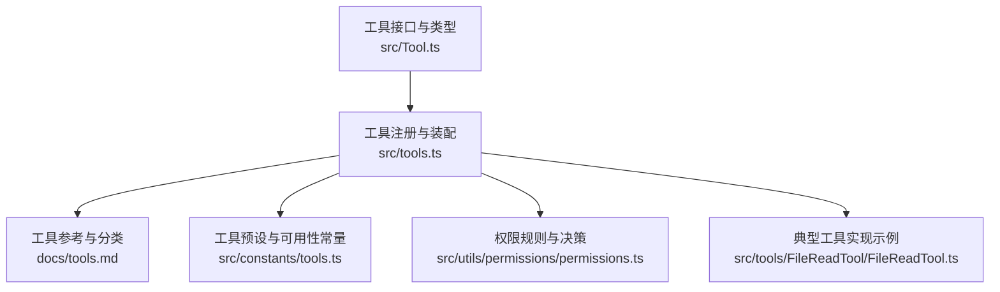
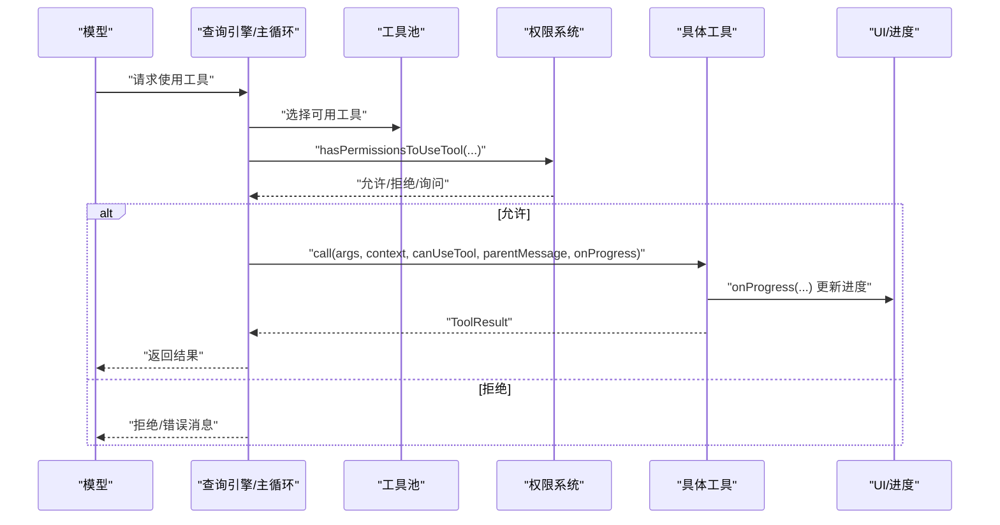
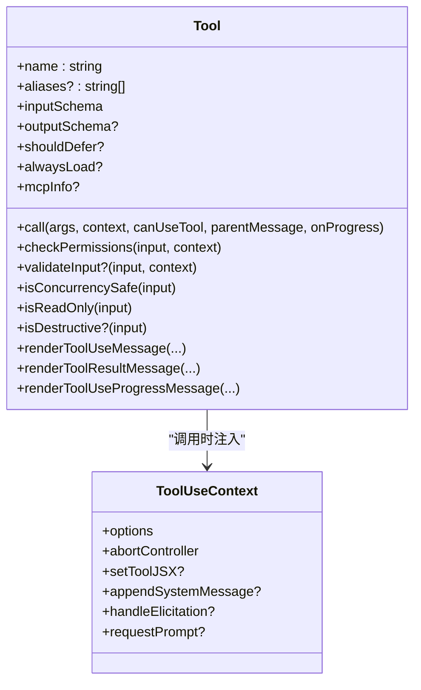
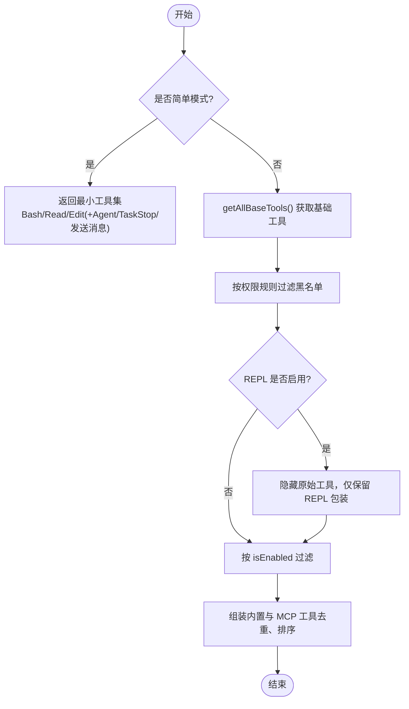
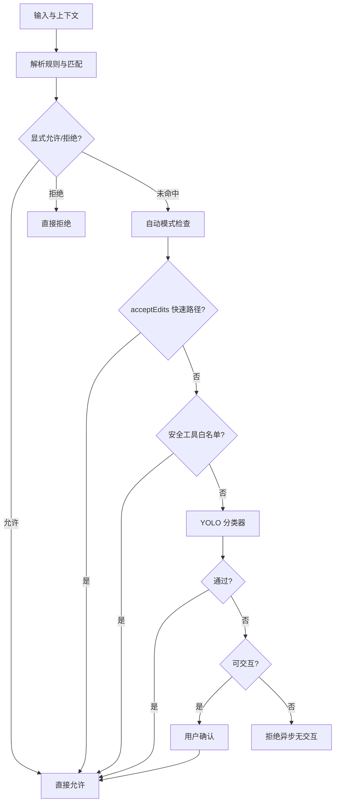
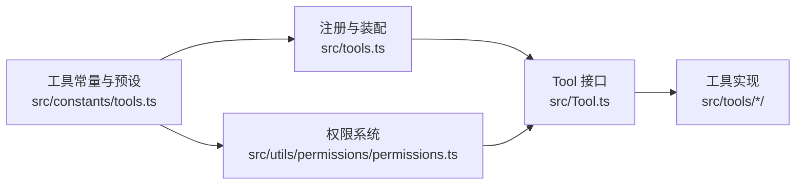

# 工具系统

<cite>
**本文引用的文件**
- [src/Tool.ts](file://src/Tool.ts)
- [src/tools.ts](file://src/tools.ts)
- [docs/tools.md](file://docs/tools.md)
- [src/constants/tools.ts](file://src/constants/tools.ts)
- [src/utils/permissions/permissions.ts](file://src/utils/permissions/permissions.ts)
- [src/tools/FileReadTool/FileReadTool.ts](file://src/tools/FileReadTool/FileReadTool.ts)
</cite>

## 目录
1. [简介](#简介)
2. [项目结构](#项目结构)
3. [核心组件](#核心组件)
4. [架构总览](#架构总览)
5. [详细组件分析](#详细组件分析)
6. [依赖分析](#依赖分析)
7. [性能考量](#性能考量)
8. [故障排查指南](#故障排查指南)
9. [结论](#结论)
10. [附录](#附录)

## 简介
本文件系统性阐述 Claude Code 的工具（Tool）体系：从工具的定义、类型系统与输入输出模式，到权限控制、并发安全、进度报告与错误处理；从工具的生命周期与执行流程，到注册与装配机制；并提供创建自定义工具的实践指南与性能优化建议。目标是帮助初学者快速上手，同时为高级用户提供可扩展的实现细节。

## 项目结构
工具系统围绕统一的工具接口与装配函数构建，核心文件如下：
- 工具接口与类型定义：src/Tool.ts
- 工具注册与装配：src/tools.ts
- 工具参考与分类：docs/tools.md
- 工具预设与可用性常量：src/constants/tools.ts
- 权限规则与决策：src/utils/permissions/permissions.ts
- 典型工具实现示例：src/tools/FileReadTool/FileReadTool.ts

图表来源
- [src/Tool.ts:1-795](file://src/Tool.ts#L1-L795)
- [src/tools.ts:1-391](file://src/tools.ts#L1-L391)
- [docs/tools.md:1-174](file://docs/tools.md#L1-L174)
- [src/constants/tools.ts:1-114](file://src/constants/tools.ts#L1-L114)
- [src/utils/permissions/permissions.ts:1-800](file://src/utils/permissions/permissions.ts#L1-L800)
- [src/tools/FileReadTool/FileReadTool.ts:1-200](file://src/tools/FileReadTool/FileReadTool.ts#L1-L200)

章节来源
- [src/Tool.ts:1-795](file://src/Tool.ts#L1-L795)
- [src/tools.ts:1-391](file://src/tools.ts#L1-L391)
- [docs/tools.md:1-174](file://docs/tools.md#L1-L174)
- [src/constants/tools.ts:1-114](file://src/constants/tools.ts#L1-L114)
- [src/utils/permissions/permissions.ts:1-800](file://src/utils/permissions/permissions.ts#L1-L800)
- [src/tools/FileReadTool/FileReadTool.ts:1-200](file://src/tools/FileReadTool/FileReadTool.ts#L1-L200)

## 核心组件
- 工具接口与类型系统
  - 工具类型 Tool<TInput, TOutput, TProgress> 定义了调用签名、描述、输入/输出模式、并发安全、只读/破坏性标记、权限检查、延迟加载策略、UI 渲染钩子等。
  - 提供 buildTool 辅助函数，自动填充常用默认行为（如 isConcurrencySafe 默认 false、checkPermissions 默认允许等），确保一致性与安全性。
- 工具注册与装配
  - getAllBaseTools 汇总所有内置工具，并按环境特性与开关动态启用/禁用特定工具。
  - getTools 在权限上下文与 REPL/简单模式下进行过滤与调整，保证工具集合在不同运行模式下的正确性。
  - assembleToolPool 将内置工具与 MCP 工具合并，去重并保持提示词缓存稳定性。
- 权限模型
  - ToolPermissionContext 描述权限模式、附加工作目录、显式允许/拒绝/询问规则、是否可绕过权限等。
  - 权限决策流程：规则匹配（允许/拒绝/询问）、自动模式分类器、交互式弹窗、钩子决策、沙箱/工作目录限制等。
- 进度与 UI
  - ToolProgressData 与多种具体进度类型（如 Bash、MCP、Skill 等）统一抽象。
  - 工具通过 renderToolUseMessage/renderToolResultMessage 等钩子提供终端渲染与结果展示。
- 错误处理与中断
  - 工具可声明 interruptBehavior（取消或阻塞），支持 canUseTool 钩子与 AbortController 协作以实现中断。
  - 统一的错误消息与拒绝 UI，便于用户理解失败原因。

章节来源
- [src/Tool.ts:362-795](file://src/Tool.ts#L362-L795)
- [src/tools.ts:193-391](file://src/tools.ts#L193-L391)
- [src/utils/permissions/permissions.ts:473-800](file://src/utils/permissions/permissions.ts#L473-L800)

## 架构总览
工具系统在运行时的总体流程如下：

图表来源
- [src/tools.ts:271-327](file://src/tools.ts#L271-L327)
- [src/utils/permissions/permissions.ts:473-800](file://src/utils/permissions/permissions.ts#L473-L800)
- [src/Tool.ts:379-403](file://src/Tool.ts#L379-L403)

## 详细组件分析

### 工具接口与类型系统
- 关键能力
  - 输入/输出模式：通过 Zod schema 定义输入，可选输出 schema；部分 MCP 工具支持 JSON Schema 直传。
  - 并发安全：isConcurrencySafe 控制是否允许并行执行，避免资源竞争。
  - 只读/破坏性：isReadOnly/isDestructive 标记用于权限与 UI 提示。
  - 延迟加载：shouldDefer/alwaysLoad 控制工具是否延迟加载，配合 ToolSearch 使用。
  - 权限钩子：checkPermissions 返回允许/拒绝/询问及更新后的输入；validateInput 可在权限前做参数校验。
  - UI 渲染：renderToolUseMessage/renderToolResultMessage/renderToolUseProgressMessage 等钩子提供终端渲染。
  - 进度与中断：onProgress 回调、interruptBehavior、context 中的 AbortController 支持。
- 默认行为
  - buildTool 自动填充默认值，确保“安全关闭”（例如默认不允许并发、默认需要用户确认）。

图表来源
- [src/Tool.ts:362-695](file://src/Tool.ts#L362-L695)

章节来源
- [src/Tool.ts:362-795](file://src/Tool.ts#L362-L795)

### 工具注册与装配
- getAllBaseTools
  - 汇总所有内置工具，按环境变量与特性开关动态启用（如嵌入搜索工具、计划模式工具、PowerShell 工具、工作树工具等）。
- getTools
  - 在简单模式（CLAUDE_CODE_SIMPLE）下返回最小工具集；在 REPL 模式下隐藏原始工具，仅保留 REPL 包装工具。
  - 结合权限上下文过滤黑名单工具，再应用 isEnabled 判定。
- assembleToolPool
  - 合并内置工具与 MCP 工具，按名称排序并去重，内置工具优先，保证提示词缓存稳定。
- getMergedTools
  - 返回内置与 MCP 工具的完整列表，用于统计与缓存场景。

图表来源
- [src/tools.ts:193-391](file://src/tools.ts#L193-L391)

章节来源
- [src/tools.ts:193-391](file://src/tools.ts#L193-L391)

### 权限控制与并发安全
- 权限上下文
  - ToolPermissionContext 包含权限模式、附加工作目录、规则来源（设置/命令行/会话等）、是否可绕过权限等。
- 规则匹配
  - 支持工具级、服务器级（MCP）与内容级规则（如 Bash(git *)），并提供工具名规范化以适配显示名与前缀模式。
- 决策流程
  - 顺序：显式允许/拒绝规则 → 分类器自动模式 → 钩子（headless 场景）→ 用户交互 → 沙箱/工作目录限制。
  - 自动模式：acceptEdits 快速路径、安全工具白名单、YOLO 分类器，失败回退至用户确认。
- 并发安全
  - 工具通过 isConcurrencySafe 声明是否可并行；UI 层根据 inProgressToolCallCount 控制并发渲染。
  - 对于非并发安全工具，contextModifier 可在调用前后修改上下文（如串行化执行）。

图表来源
- [src/utils/permissions/permissions.ts:473-800](file://src/utils/permissions/permissions.ts#L473-L800)

章节来源
- [src/utils/permissions/permissions.ts:1-800](file://src/utils/permissions/permissions.ts#L1-L800)

### 进度报告与 UI 渲染
- 进度类型
  - ToolProgressData 抽象进度数据，各工具可实现 BashProgress、MCPProgress、SkillProgress 等。
- 渲染钩子
  - 调用前：renderToolUseMessage 显示调用摘要。
  - 执行中：renderToolUseProgressMessage 展示进度 UI。
  - 结束后：renderToolResultMessage 展示结果；renderToolUseRejectedMessage/renderToolUseErrorMessage 提供拒绝/错误 UI。
- 中断与取消
  - interruptBehavior 控制新消息到达时的行为（取消/阻塞）；AbortController 与 canUseTool 配合实现中断。

章节来源
- [src/Tool.ts:305-695](file://src/Tool.ts#L305-L695)

### 错误处理策略
- 参数校验
  - validateInput 在 checkPermissions 前执行，返回 ValidationResult，失败时阻止后续流程。
- 工具内部错误
  - 工具抛出异常或返回 ToolResult 时，UI 层通过 renderToolUseErrorMessage 渲染人类可读的错误信息。
- 中断与超时
  - 通过 onProgress 与 context.abortController 实现中断；对长耗时工具建议周期性上报进度。
- 文件读取示例
  - FileReadTool 对设备文件、过大文件、二进制文件等进行限制与提示，避免阻塞与资源浪费。

章节来源
- [src/Tool.ts:489-503](file://src/Tool.ts#L489-L503)
- [src/tools/FileReadTool/FileReadTool.ts:96-128](file://src/tools/FileReadTool/FileReadTool.ts#L96-L128)

### 创建自定义工具（实践指南）
- 步骤
  - 使用 buildTool 定义工具：name、aliases、description、inputSchema、call、checkPermissions、isConcurrencySafe、isReadOnly、prompt、UI 渲染钩子等。
  - 如需延迟加载，设置 shouldDefer 或 alwaysLoad；如为 MCP 工具，提供 mcpInfo。
  - 在 src/tools.ts 中注册工具（如需条件启用，参考 getAllBaseTools 的模式）。
  - 在权限系统中完善规则匹配与 UI 提示。
- 参数验证
  - 在 validateInput 中进行业务约束校验；必要时使用 z.infer<Input> 的类型推导。
- 结果渲染
  - renderToolResultMessage 返回 React 节点；如需全文索引，实现 extractSearchText。
- 性能优化
  - 合理设置 maxResultSizeChars，避免大结果直接回传；对长任务定期 onProgress。
  - 对非并发安全工具，考虑串行化或外部锁；对 IO 密集工具，使用流式处理与分块读取。

章节来源
- [docs/tools.md:19-50](file://docs/tools.md#L19-L50)
- [src/Tool.ts:783-795](file://src/Tool.ts#L783-L795)

## 依赖分析
- 工具接口与实现
  - 所有工具实现均遵循 Tool 接口；通过 buildTool 统一默认行为，降低重复代码与风险。
- 注册与装配
  - src/tools.ts 是工具装配的单一事实来源；assembleToolPool 保证内置与 MCP 工具的一致性与缓存友好。
- 权限与工具
  - 权限系统通过 getDenyRuleForTool/filterToolsByDenyRules 与工具名/服务器名匹配，支持 MCP 服务器级屏蔽。
- 常量与预设
  - src/constants/tools.ts 提供工具可用性集合（如异步代理允许工具、协调者模式允许工具），用于过滤与 UI 提示。

图表来源
- [src/Tool.ts:362-795](file://src/Tool.ts#L362-L795)
- [src/tools.ts:193-391](file://src/tools.ts#L193-L391)
- [src/utils/permissions/permissions.ts:287-302](file://src/utils/permissions/permissions.ts#L287-L302)
- [src/constants/tools.ts:36-114](file://src/constants/tools.ts#L36-L114)

章节来源
- [src/Tool.ts:362-795](file://src/Tool.ts#L362-L795)
- [src/tools.ts:193-391](file://src/tools.ts#L193-L391)
- [src/utils/permissions/permissions.ts:287-302](file://src/utils/permissions/permissions.ts#L287-L302)
- [src/constants/tools.ts:36-114](file://src/constants/tools.ts#L36-L114)

## 性能考量
- 工具装配与缓存
  - assembleToolPool 对内置与 MCP 工具分别排序后合并，内置工具作为连续前缀，避免提示词缓存失效。
- 输入/输出大小控制
  - 工具可通过 maxResultSizeChars 控制结果大小；FileReadTool 对超大文件与设备文件进行限制。
- 并发与串行化
  - 非并发安全工具应串行执行；UI 层根据 inProgressToolCallCount 控制并发渲染。
- 自动模式分类器
  - 通过 acceptEdits 快速路径与安全工具白名单减少分类器调用；失败时回退至用户确认。
- I/O 与网络
  - 文件读取采用分块与令牌估算；网络请求（WebFetch/搜索）建议设置超时与重试策略。

章节来源
- [src/tools.ts:354-367](file://src/tools.ts#L354-L367)
- [src/tools/FileReadTool/FileReadTool.ts:175-185](file://src/tools/FileReadTool/FileReadTool.ts#L175-L185)
- [src/utils/permissions/permissions.ts:593-793](file://src/utils/permissions/permissions.ts#L593-L793)

## 故障排查指南
- 工具未出现
  - 检查是否被权限规则拒绝（getDenyRuleForTool）；确认环境特性开关是否启用（如 PowerShell、工作树模式）。
- 权限弹窗频繁
  - 检查 allow/ask/deny 规则与自动模式配置；必要时添加规则或切换模式。
- 工具无法中断
  - 确认 interruptBehavior 设置；在 UI 层触发中断时，工具应在 onProgress 中响应 AbortController。
- 结果过大导致内存问题
  - 调整 maxResultSizeChars；对文件读取使用 offset/limit；对网络请求分页处理。
- MCP 工具不可见
  - 确认 MCP 服务器连接状态与工具列表；检查权限规则是否屏蔽该服务器或工具。

章节来源
- [src/utils/permissions/permissions.ts:287-302](file://src/utils/permissions/permissions.ts#L287-L302)
- [src/tools.ts:351-352](file://src/tools.ts#L351-L352)

## 结论
Claude Code 的工具系统以统一接口为核心，结合严格的权限模型、灵活的装配机制与完善的 UI/进度抽象，实现了高可扩展性与安全性。通过 buildTool 的默认行为与工具常量/预设，开发者可以快速创建高质量工具；通过权限系统与自动模式，系统在安全与效率之间取得平衡。建议在实现自定义工具时，优先关注并发安全、输入验证、进度上报与错误渲染，并合理利用延迟加载与缓存策略提升整体性能。

## 附录
- 工具参考与分类：参见 docs/tools.md，涵盖文件系统、Shell/执行、Agent/编排、任务管理、Web、MCP、集成、调度与触发、实用工具等类别。
- 工具预设与可用性：src/constants/tools.ts 提供异步代理允许工具、协调者模式允许工具等集合，用于过滤与 UI 提示。

章节来源
- [docs/tools.md:1-174](file://docs/tools.md#L1-L174)
- [src/constants/tools.ts:36-114](file://src/constants/tools.ts#L36-L114)