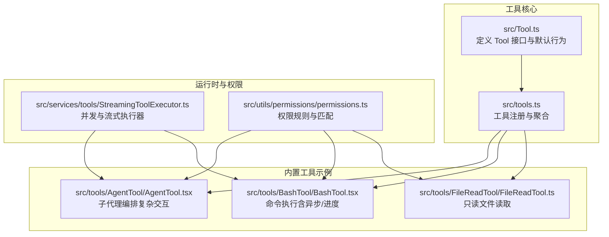
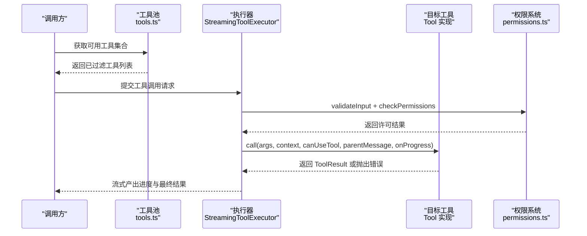
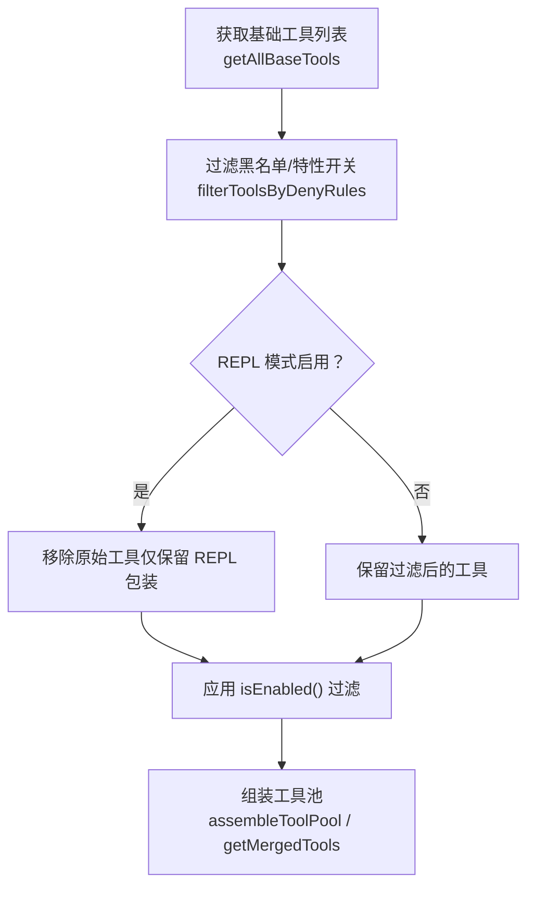
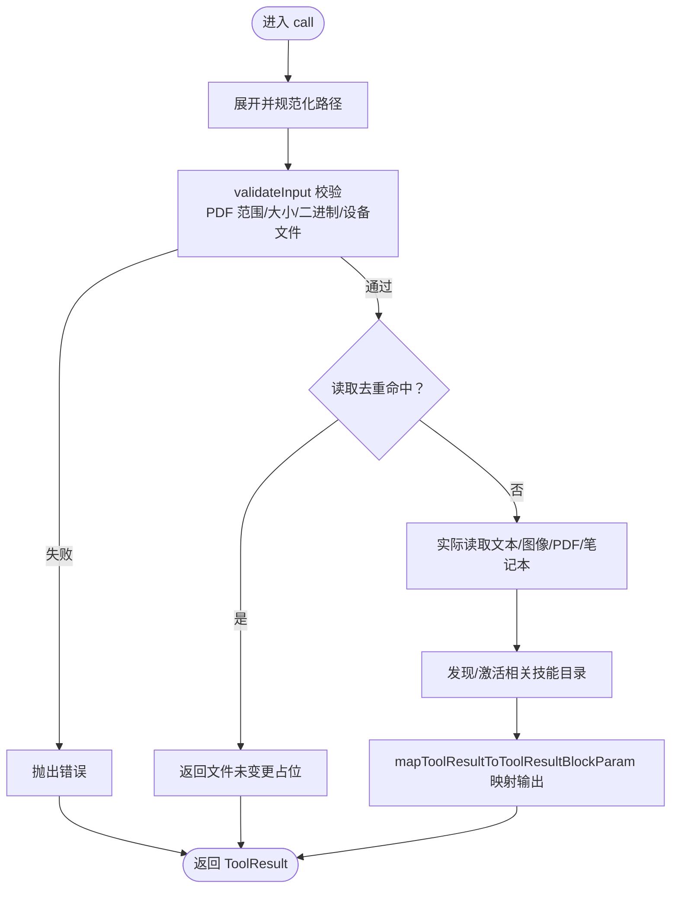
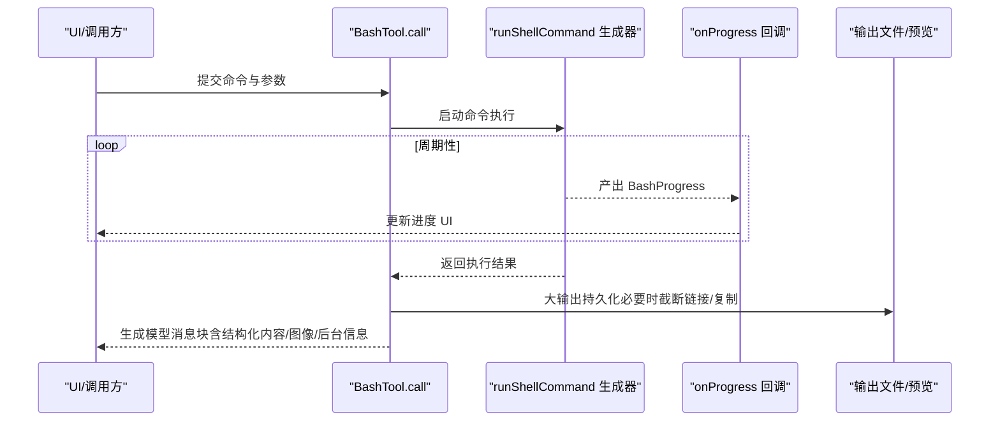
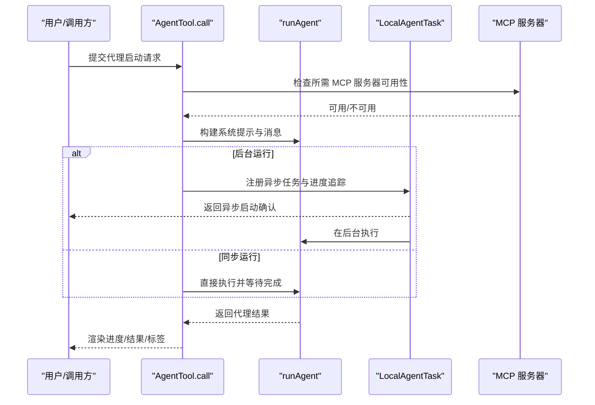
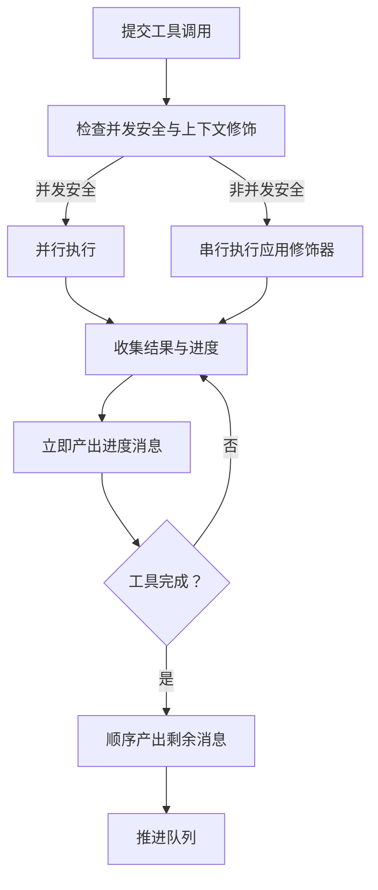
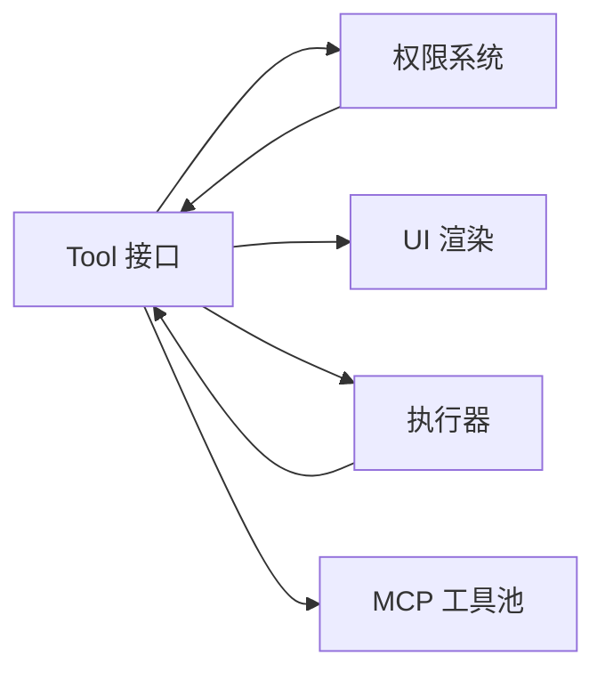

# 自定义工具开发

<cite>
**本文引用的文件**
- [Tool.ts](file://src/Tool.ts)
- [tools.ts](file://src/tools.ts)
- [tools.md](file://docs/tools.md)
- [FileReadTool.ts](file://src/tools/FileReadTool/FileReadTool.ts)
- [BashTool.tsx](file://src/tools/BashTool/BashTool.tsx)
- [AgentTool.tsx](file://src/tools/AgentTool/AgentTool.tsx)
- [runAgent.ts](file://src/tools/AgentTool/runAgent.ts)
- [agentToolUtils.ts](file://src/tools/AgentTool/agentToolUtils.ts)
- [StreamingToolExecutor.ts](file://src/services/tools/StreamingToolExecutor.ts)
- [tools.js](file://src/tools.js)
- [PermissionRule.ts](file://src/utils/permissions/PermissionRule.ts)
- [permissions.ts](file://src/utils/permissions/permissions.ts)
- [workloadContext.ts](file://src/utils/workloadContext.ts)
</cite>

## 目录
1. [简介](#简介)
2. [项目结构](#项目结构)
3. [核心组件](#核心组件)
4. [架构总览](#架构总览)
5. [详细组件分析](#详细组件分析)
6. [依赖关系分析](#依赖关系分析)
7. [性能考量](#性能考量)
8. [故障排查指南](#故障排查指南)
9. [结论](#结论)
10. [附录](#附录)

## 简介
本指南面向希望在 Claude Code 中开发自定义工具的工程师，系统讲解如何基于 Tool 基类构建工具、实现核心接口与生命周期管理、进行参数校验与权限控制、处理输入输出与错误、支持异步执行与进度上报，并给出从简单只读工具到复杂交互式工具的完整开发范式。文档同时覆盖权限集成、安全考虑与性能优化建议，以及测试、调试与部署的最佳实践。

## 项目结构
Claude Code 的工具体系以统一的 Tool 接口为核心，所有工具遵循一致的生命周期与契约；工具注册与聚合由 tools.ts 负责；具体工具实现位于 src/tools/<ToolName>/ 下，每个工具模块自包含输入模式、权限模型、执行逻辑与 UI 渲染。

图示来源
- [Tool.ts:362-695](file://src/Tool.ts#L362-L695)
- [tools.ts:193-391](file://src/tools.ts#L193-L391)
- [FileReadTool.ts:337-718](file://src/tools/FileReadTool/FileReadTool.ts#L337-L718)
- [BashTool.tsx:420-800](file://src/tools/BashTool/BashTool.tsx#L420-L800)
- [AgentTool.tsx:196-800](file://src/tools/AgentTool/AgentTool.tsx#L196-L800)
- [StreamingToolExecutor.ts:388-433](file://src/services/tools/StreamingToolExecutor.ts#L388-L433)
- [permissions.ts:207-245](file://src/utils/permissions/permissions.ts#L207-L245)

章节来源
- [tools.md:1-174](file://docs/tools.md#L1-L174)
- [tools.ts:193-391](file://src/tools.ts#L193-L391)

## 核心组件
- Tool 接口与默认行为：定义工具的输入/输出模式、描述、调用、权限检查、UI 渲染、摘要与活动描述等方法，并提供 buildTool 构造器与一组安全默认值（如并发安全、只读、破坏性标记、权限许可等）。
- 工具注册与聚合：tools.ts 统一导出工具清单、按权限过滤、合并内置与 MCP 工具、生成工具池。
- 运行时执行器：StreamingToolExecutor 负责并发调度、上下文修饰、进度消息收集与结果产出。
- 权限系统：PermissionRule 与 permissions 提供规则解析、匹配与拒绝/询问/允许的行为判定。

章节来源
- [Tool.ts:362-795](file://src/Tool.ts#L362-L795)
- [tools.ts:193-391](file://src/tools.ts#L193-L391)
- [StreamingToolExecutor.ts:388-433](file://src/services/tools/StreamingToolExecutor.ts#L388-L433)
- [PermissionRule.ts:19-40](file://src/utils/permissions/PermissionRule.ts#L19-L40)
- [permissions.ts:207-245](file://src/utils/permissions/permissions.ts#L207-L245)

## 架构总览
工具从注册到调用的关键路径如下：

图示来源
- [tools.ts:271-327](file://src/tools.ts#L271-L327)
- [StreamingToolExecutor.ts:388-433](file://src/services/tools/StreamingToolExecutor.ts#L388-L433)
- [permissions.ts:207-245](file://src/utils/permissions/permissions.ts#L207-L245)
- [Tool.ts:379-385](file://src/Tool.ts#L379-L385)

## 详细组件分析

### Tool 接口与 buildTool
- 关键字段与方法
  - 名称与别名、描述、输入/输出模式（Zod 或 JSON Schema）、是否并发安全、是否只读/破坏性、是否延迟加载/始终加载、是否 MCP/LSP 工具标识。
  - 生命周期钩子：validateInput、checkPermissions、call、mapToolResultToToolResultBlockParam、renderToolUseMessage/Result/Progress/Queued/Rejected/Error 等。
  - 辅助能力：getToolUseSummary、getActivityDescription、toAutoClassifierInput、getPath、preparePermissionMatcher、isSearchOrReadCommand、isOpenWorld、requiresUserInteraction、interruptBehavior、isTransparentWrapper、renderGroupedToolUse 等。
- 默认行为与构造器
  - buildTool 将工具定义与 TOOL_DEFAULTS 合并，自动填充 isEnabled/isConcurrencySafe/isReadOnly/isDestructive/checkPermissions/toAutoClassifierInput/userFacingName 等默认实现，确保一致性与安全性。

```mermaid
classDiagram
class Tool {
+name : string
+aliases? : string[]
+description(...)
+inputSchema
+outputSchema?
+call(...)
+validateInput?
+checkPermissions(...)
+isConcurrencySafe(...)
+isReadOnly(...)
+isDestructive?
+isSearchOrReadCommand?
+isOpenWorld?
+requiresUserInteraction?()
+interruptBehavior?()
+isMcp?
+isLsp?
+shouldDefer?
+alwaysLoad?
+mcpInfo?
+maxResultSizeChars : number
+strict?
+backfillObservableInput?
+getPath?
+preparePermissionMatcher?
+prompt(...)
+userFacingName(...)
+userFacingNameBackgroundColor?
+isTransparentWrapper?()
+getToolUseSummary?
+getActivityDescription?
+toAutoClassifierInput(...)
+mapToolResultToToolResultBlockParam(...)
+renderToolUseMessage(...)
+renderToolResultMessage?
+extractSearchText?
+renderToolUseProgressMessage?
+renderToolUseQueuedMessage?
+renderToolUseRejectedMessage?
+renderToolUseErrorMessage?
+renderGroupedToolUse?
}
class ToolDef {
+name : string
+aliases?
+description(...)
+inputSchema
+outputSchema?
+call(...)
+validateInput?
+checkPermissions(...)
+isConcurrencySafe?
+isReadOnly?
+isDestructive?
+isSearchOrReadCommand?
+isOpenWorld?
+requiresUserInteraction?
+interruptBehavior?
+isMcp?
+isLsp?
+shouldDefer?
+alwaysLoad?
+mcpInfo?
+maxResultSizeChars
+strict?
+backfillObservableInput?
+getPath?
+preparePermissionMatcher?
+prompt(...)
+userFacingName(...)
+userFacingNameBackgroundColor?
+isTransparentWrapper?
+getToolUseSummary?
+getActivityDescription?
+toAutoClassifierInput(...)
+mapToolResultToToolResultBlockParam(...)
+renderToolUseMessage(...)
+renderToolResultMessage?
+extractSearchText?
+renderToolUseProgressMessage?
+renderToolUseQueuedMessage?
+renderToolUseRejectedMessage?
+renderToolUseErrorMessage?
+renderGroupedToolUse?
}
Tool <|.. ToolDef : "部分可选"
ToolDef --> Tool : "buildTool 合并默认值"
```

图示来源
- [Tool.ts:362-795](file://src/Tool.ts#L362-L795)

章节来源
- [Tool.ts:362-795](file://src/Tool.ts#L362-L795)

### 工具注册与聚合
- getAllBaseTools：汇总所有内置工具，按特性开关与环境变量裁剪。
- getTools/filterToolsByDenyRules：根据权限上下文过滤工具，隐藏 REPL 模式下的原始工具。
- assembleToolPool/getMergedTools：合并内置与 MCP 工具，去重并保持提示缓存稳定排序。

图示来源
- [tools.ts:193-391](file://src/tools.ts#L193-L391)

章节来源
- [tools.ts:193-391](file://src/tools.ts#L193-L391)

### 文件只读工具：FileReadTool
- 输入模式：文件路径、偏移/限制（分页读取文本）、PDF 页面范围等。
- 输出模式：文本、图片、笔记本、PDF、拆分页结果或“文件未变更”占位。
- 安全与合规：二进制扩展检测、设备文件阻断、UNC 路径提示、读取令牌上限校验、内容脱敏提醒。
- 性能优化：读取去重（同一范围且未变更时返回占位）、技能目录发现与激活、文件历史跟踪。
- UI 与可搜索性：渲染摘要、提取可索引文本、映射为模型消息块。

图示来源
- [FileReadTool.ts:496-718](file://src/tools/FileReadTool/FileReadTool.ts#L496-L718)

章节来源
- [FileReadTool.ts:337-718](file://src/tools/FileReadTool/FileReadTool.ts#L337-L718)

### 命令执行工具：BashTool（异步/进度/后台）
- 输入模式：命令字符串、超时、描述、是否后台运行、禁用沙箱等。
- 并发与安全：只读约束检查、权限匹配（支持复合命令拆分）、沙箱注解与违规标注。
- 异步与进度：runShellCommand 生成器驱动，周期性 onProgress 上报 BashProgress；大输出持久化与预览；后台任务注册与通知。
- UI 与可搜索性：进度消息、排队消息、结果消息、错误消息、结构化内容直传、图像输出压缩与尺寸控制。

图示来源
- [BashTool.tsx:624-800](file://src/tools/BashTool/BashTool.tsx#L624-L800)
- [BashTool.tsx:1108-1143](file://src/tools/BashTool/BashTool.tsx#L1108-L1143)

章节来源
- [BashTool.tsx:420-800](file://src/tools/BashTool/BashTool.tsx#L420-L800)
- [BashTool.tsx:1108-1143](file://src/tools/BashTool/BashTool.tsx#L1108-L1143)

### 子代理编排工具：AgentTool（复杂交互）
- 输入模式：任务描述、提示词、子代理类型、模型、是否后台运行、隔离模式（工作树/远程）、工作目录等。
- 生命周期：选择代理定义、检查 MCP 服务器可用性、设置颜色与元数据、构建系统提示与消息、决定同步/异步执行。
- 异步与隔离：工作树隔离、远程隔离、后台任务注册、进度追踪、清理与收尾。
- UI 与交互：进度消息、错误消息、标签渲染、群组渲染、多代理协作（团队）。

图示来源
- [AgentTool.tsx:239-800](file://src/tools/AgentTool/AgentTool.tsx#L239-L800)
- [runAgent.ts:95-200](file://src/tools/AgentTool/runAgent.ts#L95-L200)
- [agentToolUtils.ts:70-116](file://src/tools/AgentTool/agentToolUtils.ts#L70-L116)

章节来源
- [AgentTool.tsx:196-800](file://src/tools/AgentTool/AgentTool.tsx#L196-L800)
- [runAgent.ts:95-200](file://src/tools/AgentTool/runAgent.ts#L95-L200)
- [agentToolUtils.ts:70-116](file://src/tools/AgentTool/agentToolUtils.ts#L70-L116)

### 并发与流式执行：StreamingToolExecutor
- 并发调度：对非并发安全工具应用上下文修饰器，保证串行化；对并发安全工具并行执行。
- 结果收集：维护 pendingProgress 队列，优先产出进度消息；完成后顺序产出消息并标记已产出。
- 队列推进：单个工具完成后触发 processQueue，维持整体吞吐与顺序一致性。

图示来源
- [StreamingToolExecutor.ts:388-433](file://src/services/tools/StreamingToolExecutor.ts#L388-L433)

章节来源
- [StreamingToolExecutor.ts:388-433](file://src/services/tools/StreamingToolExecutor.ts#L388-L433)

## 依赖关系分析
- 工具到权限：工具通过 validateInput 与 checkPermissions 与权限系统交互；permissions 提供规则解析与匹配。
- 工具到 UI：工具通过 renderToolUseMessage/Result/Progress/Queued/Rejected/Error 控制 UI 表现。
- 工具到执行器：StreamingToolExecutor 统一调度工具调用，处理并发、进度与结果。
- 工具到 MCP：工具池中包含 MCP 工具，AgentTool 支持 MCP 服务器连接与工具发现。

图示来源
- [Tool.ts:362-695](file://src/Tool.ts#L362-L695)
- [permissions.ts:207-245](file://src/utils/permissions/permissions.ts#L207-L245)
- [StreamingToolExecutor.ts:388-433](file://src/services/tools/StreamingToolExecutor.ts#L388-L433)
- [tools.ts:345-367](file://src/tools.ts#L345-L367)

章节来源
- [Tool.ts:362-695](file://src/Tool.ts#L362-L695)
- [permissions.ts:207-245](file://src/utils/permissions/permissions.ts#L207-L245)
- [StreamingToolExecutor.ts:388-433](file://src/services/tools/StreamingToolExecutor.ts#L388-L433)
- [tools.ts:345-367](file://src/tools.ts#L345-L367)

## 性能考量
- 输入/输出规模控制
  - 使用 maxResultSizeChars 控制工具结果大小，避免过大的内联输出；对超限输出采用持久化与预览策略（如 BashTool 的大输出文件链接/复制与截断）。
  - 对只读工具（如 FileReadTool）使用 token 估算与上限校验，防止一次性读取过大文件。
- 并发与上下文修饰
  - 非并发安全工具通过上下文修饰器串行化，避免竞态；并发安全工具并行执行以提升吞吐。
- 缓存与去重
  - FileReadTool 的“文件未变更”去重可显著减少重复传输与缓存开销。
- I/O 与外部资源
  - BashTool 的后台任务与进度上报降低阻塞；MCP 服务器连接与工具发现需注意延迟与失败重试。
- 工作负载与上下文
  - workloadContext 通过 AsyncLocalStorage 传播工作负载标签，便于后台任务与异步链路的可观测性与隔离。

章节来源
- [FileReadTool.ts:496-718](file://src/tools/FileReadTool/FileReadTool.ts#L496-L718)
- [BashTool.tsx:728-753](file://src/tools/BashTool/BashTool.tsx#L728-L753)
- [StreamingToolExecutor.ts:388-433](file://src/services/tools/StreamingToolExecutor.ts#L388-L433)
- [workloadContext.ts:1-34](file://src/utils/workloadContext.ts#L1-L34)

## 故障排查指南
- 参数校验失败
  - validateInput 返回 result=false 时，应提供明确的 message 与 errorCode，便于 UI 与日志定位问题。
- 权限被拒
  - checkPermissions 返回 deny/ask 行为，结合权限规则与匹配器（如 BashTool 的复合命令拆分匹配）排查。
- 执行中断
  - BashTool 在 onProgress 中持续上报进度，若长时间无响应，检查生成器循环与 TaskOutput 轮询；异常时查看 stderr 合并与沙箱注解。
- MCP 服务器问题
  - AgentTool 在启动前检查所需 MCP 服务器可用性，若缺失则抛出明确错误；确认连接状态与认证。
- 后台任务与清理
  - AgentTool 的工作树隔离与远程隔离需要在完成后清理；若出现残留目录，检查 hasWorktreeChanges 与 removeAgentWorktree 的分支逻辑。

章节来源
- [FileReadTool.ts:418-495](file://src/tools/FileReadTool/FileReadTool.ts#L418-L495)
- [permissions.ts:207-245](file://src/utils/permissions/permissions.ts#L207-L245)
- [BashTool.tsx:1108-1143](file://src/tools/BashTool/BashTool.tsx#L1108-L1143)
- [AgentTool.tsx:369-410](file://src/tools/AgentTool/AgentTool.tsx#L369-L410)
- [agentToolUtils.ts:62-116](file://src/tools/AgentTool/agentToolUtils.ts#L62-L116)

## 结论
通过统一的 Tool 接口与 buildTool 构造器，Claude Code 为自定义工具提供了清晰的开发范式：严格的输入/输出模式、完善的生命周期钩子、可插拔的权限与 UI 渲染、以及强大的并发与流式执行能力。开发者可据此快速实现从只读查询到复杂交互的各类工具，并在安全与性能之间取得平衡。

## 附录

### 开发步骤与最佳实践
- 设计阶段
  - 明确工具职责与输入输出，选择合适的只读/破坏性/并发安全属性。
  - 设计权限规则与匹配器，确保 validateInput 与 checkPermissions 覆盖关键边界。
- 实现阶段
  - 使用 buildTool 构造工具，最小化自定义实现，充分利用默认行为。
  - 实现 call 与必要的 UI 渲染方法；对大输出采用持久化与预览。
  - 对异步工具实现 onProgress，提供有意义的进度与活动描述。
- 测试与调试
  - 单元测试覆盖 validateInput、checkPermissions、call 的关键分支。
  - 集成测试验证 UI 渲染、进度上报与错误处理。
  - 使用 workloadContext 与日志定位后台任务与异步链路问题。
- 部署与运维
  - 通过 tools.ts 注册工具，确保权限过滤与工具池合并正确。
  - 对 MCP 工具关注服务器连接与认证状态，提供友好的错误提示。
  - 持续监控工具耗时、输出大小与错误率，优化阈值与提示文案。

章节来源
- [tools.md:19-50](file://docs/tools.md#L19-L50)
- [tools.ts:193-391](file://src/tools.ts#L193-L391)
- [workloadContext.ts:1-34](file://src/utils/workloadContext.ts#L1-L34)