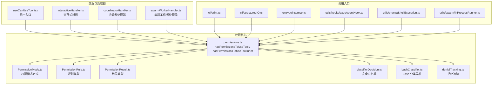
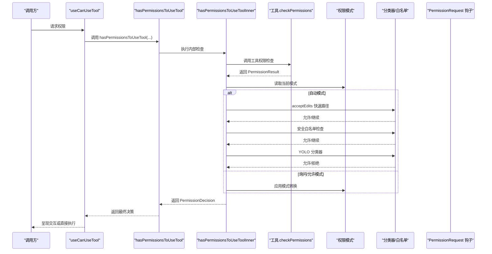
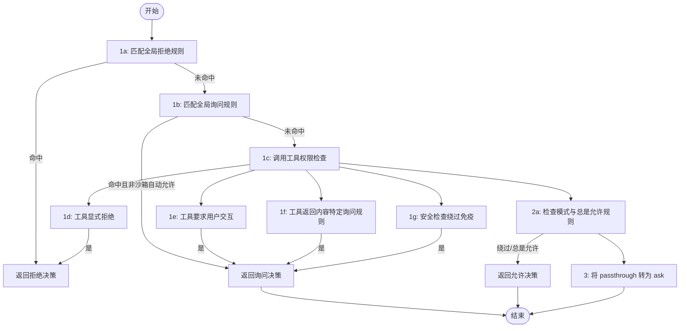
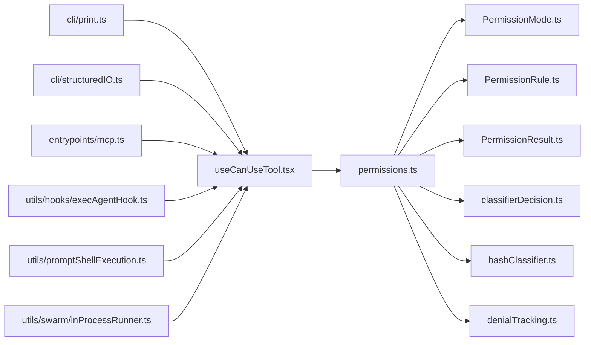

# 权限检查机制

<cite>
**本文引用的文件**
- [permissions.ts](file://src/utils/permissions/permissions.ts)
- [useCanUseTool.tsx](file://src/hooks/useCanUseTool.tsx)
- [PermissionMode.ts](file://src/utils/permissions/PermissionMode.ts)
- [PermissionRule.ts](file://src/utils/permissions/PermissionRule.ts)
- [PermissionResult.ts](file://src/utils/permissions/PermissionResult.ts)
- [classifierDecision.ts](file://src/utils/permissions/classifierDecision.ts)
- [bashClassifier.ts](file://src/utils/permissions/bashClassifier.ts)
- [interactiveHandler.ts](file://src/hooks/toolPermission/handlers/interactiveHandler.ts)
- [coordinatorHandler.ts](file://src/hooks/toolPermission/handlers/coordinatorHandler.ts)
- [swarmWorkerHandler.ts](file://src/hooks/toolPermission/handlers/swarmWorkerHandler.ts)
- [denialTracking.ts](file://src/utils/permissions/denialTracking.ts)
- [print.ts](file://src/cli/print.ts)
- [structuredIO.ts](file://src/cli/structuredIO.ts)
- [mcp.ts](file://src/entrypoints/mcp.ts)
- [execAgentHook.ts](file://src/utils/hooks/execAgentHook.ts)
- [promptShellExecution.ts](file://src/utils/promptShellExecution.ts)
- [inProcessRunner.ts](file://src/utils/swarm/inProcessRunner.ts)
</cite>

## 目录
1. [简介](#简介)
2. [项目结构](#项目结构)
3. [核心组件](#核心组件)
4. [架构总览](#架构总览)
5. [详细组件分析](#详细组件分析)
6. [依赖关系分析](#依赖关系分析)
7. [性能考量](#性能考量)
8. [故障排查指南](#故障排查指南)
9. [结论](#结论)
10. [附录](#附录)

## 简介
本文件系统性解析 Claude Code 的权限检查机制，重点围绕 hasPermissionsToUseTool 及其内部实现 hasPermissionsToUseToolInner 的完整流程，覆盖规则匹配、模式判断、分类器决策与钩子执行四大阶段，并对三种权限模式（自动模式、询问模式、允许模式）的行为差异进行对比。文档同时给出优先级处理与短路机制说明、错误处理策略与性能优化建议，并提供面向初学者的概念讲解与面向高级用户的自定义扩展指导。

## 项目结构
权限检查相关代码主要分布在以下模块：
- 工具权限核心：src/utils/permissions/*.ts
- UI 交互与处理器：src/hooks/toolPermission/handlers/*.ts
- 模式与规则类型：src/utils/permissions/PermissionMode.ts、PermissionRule.ts、PermissionResult.ts
- 分类器与 Bash 分类器：classifierDecision.ts、bashClassifier.ts
- 调用入口与集成点：src/hooks/useCanUseTool.tsx、src/cli/print.ts、src/cli/structuredIO.ts、src/entrypoints/mcp.ts、src/utils/hooks/execAgentHook.ts 等

图表来源
- [permissions.ts:472-1319](file://src/utils/permissions/permissions.ts#L472-L1319)
- [useCanUseTool.tsx:28-191](file://src/hooks/useCanUseTool.tsx#L28-L191)
- [interactiveHandler.ts:57-538](file://src/hooks/toolPermission/handlers/interactiveHandler.ts#L57-L538)
- [coordinatorHandler.ts:26-67](file://src/hooks/toolPermission/handlers/coordinatorHandler.ts#L26-L67)
- [swarmWorkerHandler.ts:40-161](file://src/hooks/toolPermission/handlers/swarmWorkerHandler.ts#L40-L161)
- [PermissionMode.ts:42-91](file://src/utils/permissions/PermissionMode.ts#L42-L91)
- [PermissionRule.ts:19-42](file://src/utils/permissions/PermissionRule.ts#L19-L42)
- [PermissionResult.ts:1-37](file://src/utils/permissions/PermissionResult.ts#L1-L37)
- [classifierDecision.ts:50-98](file://src/utils/permissions/classifierDecision.ts#L50-L98)
- [bashClassifier.ts:24-63](file://src/utils/permissions/bashClassifier.ts#L24-L63)
- [denialTracking.ts:12-45](file://src/utils/permissions/denialTracking.ts#L12-L45)

章节来源
- [permissions.ts:472-1319](file://src/utils/permissions/permissions.ts#L472-L1319)
- [useCanUseTool.tsx:28-191](file://src/hooks/useCanUseTool.tsx#L28-L191)

## 核心组件
- hasPermissionsToUseTool：对外暴露的统一权限检查函数，负责规则匹配、模式判断、分类器与钩子执行、以及最终决策转换与持久化。
- hasPermissionsToUseToolInner：内部实现，按阶段顺序执行检查并支持短路返回。
- 权限模式与规则：定义模式枚举、规则行为与值结构，用于控制检查流程与提示文案。
- 分类器与白名单：在自动模式下跳过不必要的分类器调用，提升性能。
- 交互处理器：协调用户交互、远程通道、钩子与分类器的异步竞争与短路。

章节来源
- [permissions.ts:472-1319](file://src/utils/permissions/permissions.ts#L472-L1319)
- [PermissionMode.ts:42-91](file://src/utils/permissions/PermissionMode.ts#L42-L91)
- [PermissionRule.ts:19-42](file://src/utils/permissions/PermissionRule.ts#L19-L42)
- [PermissionResult.ts:1-37](file://src/utils/permissions/PermissionResult.ts#L1-L37)
- [classifierDecision.ts:50-98](file://src/utils/permissions/classifierDecision.ts#L50-L98)
- [bashClassifier.ts:24-63](file://src/utils/permissions/bashClassifier.ts#L24-L63)

## 架构总览
权限检查采用“阶段化 + 短路 + 异步竞争”的设计：
- 规则匹配阶段：先检查全局 deny/ask 规则，再调用工具自身的 checkPermissions 获取更细粒度结果。
- 模式判断阶段：根据当前模式（默认/计划/接受编辑/绕过/不询问/自动）决定是否允许或转换行为。
- 分类器与钩子阶段：在自动模式下尝试 acceptEdits 快速路径、安全白名单跳过、YOLO 分类器；在交互模式下并发运行钩子与分类器，以最快结果为准。
- 决策转换与持久化：将 passthrough 转为 ask，必要时生成提示消息与建议更新。

图表来源
- [permissions.ts:472-800](file://src/utils/permissions/permissions.ts#L472-L800)
- [useCanUseTool.tsx:32-191](file://src/hooks/useCanUseTool.tsx#L32-L191)

## 详细组件分析

### hasPermissionsToUseTool 与 hasPermissionsToUseToolInner
- hasPermissionsToUseTool：作为对外接口，负责在允许后重置连续拒绝计数、应用 dontAsk 模式转换、以及自动模式下的分类器与快速路径。
- hasPermissionsToUseToolInner：严格按阶段执行，支持短路返回，避免不必要的计算：
  - 步骤 1a/1b：全局 deny/ask 规则匹配，Bash 沙箱自动允许分支。
  - 步骤 1c：调用工具自身 checkPermissions 获取细粒度结果。
  - 步骤 1d/1e/1f/1g：工具显式 ask 规则、安全检查等对 bypassImmune 的保护。
  - 步骤 2a/2b：模式绕过与总是允许规则。
  - 步骤 3：将 passthrough 转换为 ask 并生成提示消息。

图表来源
- [permissions.ts:1158-1319](file://src/utils/permissions/permissions.ts#L1158-L1319)

章节来源
- [permissions.ts:472-800](file://src/utils/permissions/permissions.ts#L472-L800)
- [permissions.ts:1158-1319](file://src/utils/permissions/permissions.ts#L1158-L1319)

### 权限模式与行为差异
- 默认模式：遵循规则与工具检查，必要时弹窗确认。
- 计划模式：与绕过模式兼容，若初始启用绕过，则在该会话中允许工具使用。
- 接受编辑模式：在工作目录内对文件编辑类操作快速允许，避免分类器开销。
- 绕过权限模式：完全跳过权限检查，直接允许。
- 不询问模式：将询问决策转换为拒绝，避免打扰。
- 自动模式：在满足条件时通过分类器自动决策，否则回退到弹窗。

章节来源
- [PermissionMode.ts:42-91](file://src/utils/permissions/PermissionMode.ts#L42-L91)
- [permissions.ts:503-591](file://src/utils/permissions/permissions.ts#L503-L591)

### 规则匹配与优先级
- 全局拒绝规则优先于全局询问规则，工具显式的拒绝与安全检查优先于模式绕过。
- 内容特定询问规则与安全检查对模式绕过免疫，确保关键路径的安全性。
- 模式绕过仅对“整体工具”生效，不改变工具内部返回的 ask 行为。

章节来源
- [permissions.ts:1170-1260](file://src/utils/permissions/permissions.ts#L1170-L1260)
- [permissions.ts:1262-1297](file://src/utils/permissions/permissions.ts#L1262-L1297)

### 分类器决策与白名单优化
- acceptEdits 快速路径：在自动模式下，若工具在 acceptEdits 模式下允许，则直接放行，避免分类器调用。
- 安全白名单：对只读/低风险工具直接放行，减少分类器负担。
- YOLO 分类器：在满足条件时进行自动分类，记录统计信息并支持拒绝上限回退到弹窗。

章节来源
- [permissions.ts:593-686](file://src/utils/permissions/permissions.ts#L593-L686)
- [classifierDecision.ts:50-98](file://src/utils/permissions/classifierDecision.ts#L50-L98)
- [denialTracking.ts:12-45](file://src/utils/permissions/denialTracking.ts#L12-L45)

### 钩子执行与远程通道
- PermissionRequest 钩子：在无 UI 或异步场景下提供早期决策，失败时不会崩溃而是回退到自动拒绝。
- 远程通道：桥接（Bridge）与多通道（Telegram/iMessage/Discord）并行竞速，任一响应即短路。
- 集群工作者：在 Swarm 中先尝试分类器，再通过邮箱板转发给领导者，注册回调等待响应。

章节来源
- [permissions.ts:400-471](file://src/utils/permissions/permissions.ts#L400-L471)
- [interactiveHandler.ts:410-530](file://src/hooks/toolPermission/handlers/interactiveHandler.ts#L410-L530)
- [coordinatorHandler.ts:26-67](file://src/hooks/toolPermission/handlers/coordinatorHandler.ts#L26-L67)
- [swarmWorkerHandler.ts:40-161](file://src/hooks/toolPermission/handlers/swarmWorkerHandler.ts#L40-L161)

### 交互式权限流程
- 用户交互前的“宽限期”避免误触取消分类器。
- 分类器运行期间显示指示器，完成后根据匹配度与规则描述自动批准。
- 支持 Esc 提前关闭确认窗口，或在终端聚焦时保留确认标记更长时间。

章节来源
- [interactiveHandler.ts:108-136](file://src/hooks/toolPermission/handlers/interactiveHandler.ts#L108-L136)
- [interactiveHandler.ts:444-530](file://src/hooks/toolPermission/handlers/interactiveHandler.ts#L444-L530)

## 依赖关系分析
- 调用入口广泛分布于 CLI、MCP、Agent Hook、Shell 提示等场景，统一通过 useCanUseTool 与 hasPermissionsToUseTool 协调。
- 分类器与 Bash 分类器在外部构建中为桩函数，默认禁用，避免在非目标环境加载重型依赖。
- 拒绝追踪与统计埋点贯穿自动模式，用于衡量分类器成本与效果。

图表来源
- [print.ts:142-4263](file://src/cli/print.ts#L142-L4263)
- [structuredIO.ts:36-545](file://src/cli/structuredIO.ts#L36-L545)
- [mcp.ts:23-152](file://src/entrypoints/mcp.ts#L23-L152)
- [execAgentHook.ts:19-171](file://src/utils/hooks/execAgentHook.ts#L19-L171)
- [promptShellExecution.ts:7-97](file://src/utils/promptShellExecution.ts#L7-L97)
- [inProcessRunner.ts:81-306](file://src/utils/swarm/inProcessRunner.ts#L81-L306)

章节来源
- [print.ts:142-4263](file://src/cli/print.ts#L142-L4263)
- [structuredIO.ts:36-545](file://src/cli/structuredIO.ts#L36-L545)
- [mcp.ts:23-152](file://src/entrypoints/mcp.ts#L23-L152)
- [execAgentHook.ts:19-171](file://src/utils/hooks/execAgentHook.ts#L19-L171)
- [promptShellExecution.ts:7-97](file://src/utils/promptShellExecution.ts#L7-L97)
- [inProcessRunner.ts:81-306](file://src/utils/swarm/inProcessRunner.ts#L81-L306)

## 性能考量
- 快速路径优化
  - acceptEdits 快速路径：在自动模式下，若工具在 acceptEdits 模式允许，则直接放行，避免分类器调用。
  - 安全白名单：对只读/低风险工具直接放行，减少分类器 API 调用次数。
- 拒绝上限与回退
  - 当连续或累计拒绝达到阈值时，自动回退到弹窗，避免持续的分类器调用造成性能与体验问题。
- 分类器成本分析
  - 对分类器调用进行 token 使用量、缓存命中、阶段耗时等指标埋点，便于后续优化。
- 外部构建兼容
  - Bash 分类器在外部构建中为桩函数，默认禁用，避免在非目标环境加载重型依赖。

章节来源
- [permissions.ts:600-793](file://src/utils/permissions/permissions.ts#L600-L793)
- [classifierDecision.ts:50-98](file://src/utils/permissions/classifierDecision.ts#L50-L98)
- [bashClassifier.ts:24-63](file://src/utils/permissions/bashClassifier.ts#L24-L63)
- [denialTracking.ts:12-45](file://src/utils/permissions/denialTracking.ts#L12-L45)

## 故障排查指南
- 分类器异常
  - 分类器 API 失败会被记录但不中断流程，可查看日志定位网络/限流/模型问题。
- 钩子异常
  - PermissionRequest 钩子失败会被捕获并记录，不影响后续自动拒绝。
- 模式冲突
  - dontAsk 模式会将 ask 转为 deny；自动模式下安全检查可能强制弹窗。
- 交互卡顿
  - 若分类器指示器常驻，检查是否存在长时间运行的分类器任务或终端焦点状态异常。

章节来源
- [interactiveHandler.ts:522-530](file://src/hooks/toolPermission/handlers/interactiveHandler.ts#L522-L530)
- [permissions.ts:462-470](file://src/utils/permissions/permissions.ts#L462-L470)
- [permissions.ts:503-517](file://src/utils/permissions/permissions.ts#L503-L517)

## 结论
hasPermissionsToUseTool 通过“规则匹配—模式判断—分类器与钩子—决策转换”的分层设计，在保证安全性的同时兼顾了性能与用户体验。自动模式下的 acceptEdits 快速路径与安全白名单显著降低了分类器开销；交互式处理器通过异步竞争与短路机制提升了响应速度。对于高级用户，可通过自定义规则、钩子与分类器扩展点实现更精细的权限控制。

## 附录

### 权限检查流程图（代码级）

图表来源
- [permissions.ts:472-800](file://src/utils/permissions/permissions.ts#L472-L800)
- [useCanUseTool.tsx:32-191](file://src/hooks/useCanUseTool.tsx#L32-L191)