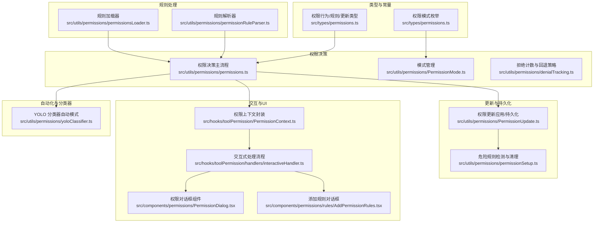
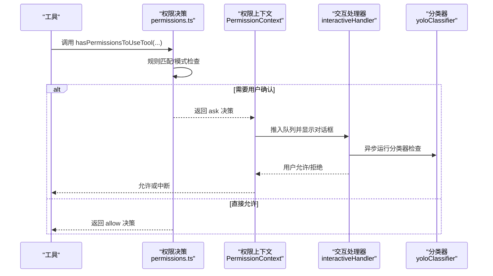
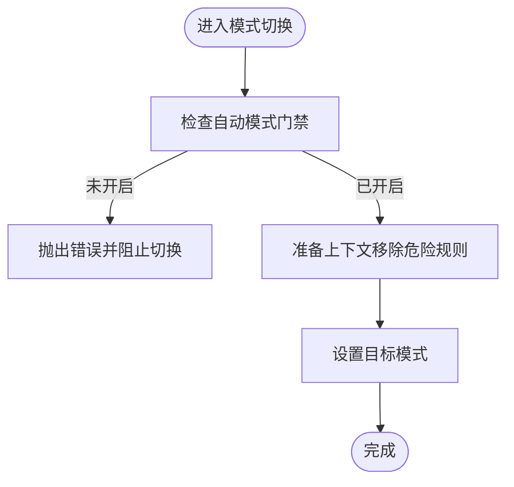
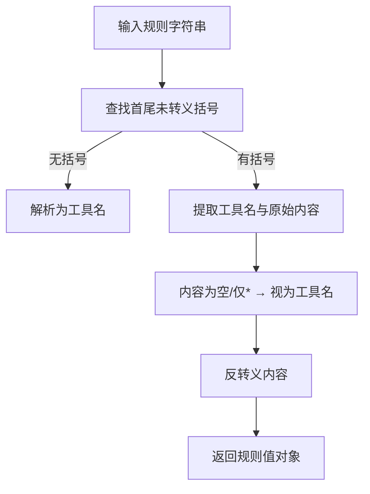
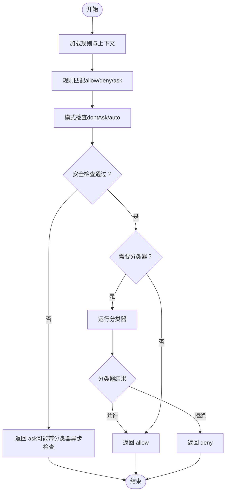
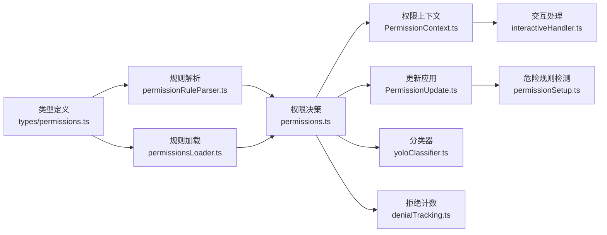

# 权限模型

<cite>
**本文引用的文件**
- [src/types/permissions.ts](file://src/types/permissions.ts)
- [src/utils/permissions/permissions.ts](file://src/utils/permissions/permissions.ts)
- [src/utils/permissions/permissionRuleParser.ts](file://src/utils/permissions/permissionRuleParser.ts)
- [src/utils/permissions/permissionSetup.ts](file://src/utils/permissions/permissionSetup.ts)
- [src/utils/permissions/PermissionUpdate.ts](file://src/utils/permissions/PermissionUpdate.ts)
- [src/utils/permissions/permissionsLoader.ts](file://src/utils/permissions/permissionsLoader.ts)
- [src/utils/permissions/PermissionMode.ts](file://src/utils/permissions/PermissionMode.ts)
- [src/utils/permissions/denialTracking.ts](file://src/utils/permissions/denialTracking.ts)
- [src/utils/permissions/yoloClassifier.ts](file://src/utils/permissions/yoloClassifier.ts)
- [src/hooks/toolPermission/PermissionContext.ts](file://src/hooks/toolPermission/PermissionContext.ts)
- [src/hooks/toolPermission/handlers/interactiveHandler.ts](file://src/hooks/toolPermission/handlers/interactiveHandler.ts)
- [src/components/permissions/PermissionDialog.tsx](file://src/components/permissions/PermissionDialog.tsx)
- [src/components/permissions/rules/AddPermissionRules.tsx](file://src/components/permissions/rules/AddPermissionRules.tsx)
- [src/commands/permissions/permissions.tsx](file://src/commands/permissions/permissions.tsx)
- [src/utils/teammateMailbox.ts](file://src/utils/teammateMailbox.ts)
</cite>

## 目录
1. [引言](#引言)
2. [项目结构](#项目结构)
3. [核心组件](#核心组件)
4. [架构总览](#架构总览)
5. [详细组件分析](#详细组件分析)
6. [依赖关系分析](#依赖关系分析)
7. [性能考量](#性能考量)
8. [故障排查指南](#故障排查指南)
9. [结论](#结论)
10. [附录](#附录)

## 引言
本文件系统化阐述 Claude Code 的权限模型：从设计理念到实现机制，覆盖工具调用权限检查流程、决策逻辑、权限模式与规则匹配、用户交互机制、以及配置与动态更新。文档同时面向初学者与高级用户，既提供基础概念，也给出可扩展的实现细节与最佳实践。

## 项目结构
权限系统围绕“权限上下文（ToolPermissionContext）”展开，通过规则解析器、规则加载器、更新应用器与模式管理器协同工作，并在工具执行前进行决策，必要时弹出交互式对话框或触发自动化分类器评估。

图表来源
- [src/types/permissions.ts:16-38](file://src/types/permissions.ts#L16-L38)
- [src/utils/permissions/permissions.ts:473-800](file://src/utils/permissions/permissions.ts#L473-L800)
- [src/utils/permissions/permissionRuleParser.ts:93-152](file://src/utils/permissions/permissionRuleParser.ts#L93-L152)
- [src/utils/permissions/permissionsLoader.ts:120-133](file://src/utils/permissions/permissionsLoader.ts#L120-L133)
- [src/utils/permissions/PermissionUpdate.ts:55-206](file://src/utils/permissions/PermissionUpdate.ts#L55-L206)
- [src/utils/permissions/permissionSetup.ts:295-342](file://src/utils/permissions/permissionSetup.ts#L295-L342)
- [src/utils/permissions/PermissionMode.ts:42-91](file://src/utils/permissions/PermissionMode.ts#L42-L91)
- [src/utils/permissions/denialTracking.ts:7-47](file://src/utils/permissions/denialTracking.ts#L7-L47)
- [src/hooks/toolPermission/PermissionContext.ts:96-348](file://src/hooks/toolPermission/PermissionContext.ts#L96-L348)
- [src/hooks/toolPermission/handlers/interactiveHandler.ts:57-531](file://src/hooks/toolPermission/handlers/interactiveHandler.ts#L57-L531)
- [src/components/permissions/PermissionDialog.tsx:17-71](file://src/components/permissions/PermissionDialog.tsx#L17-L71)
- [src/components/permissions/rules/AddPermissionRules.tsx:48-181](file://src/components/permissions/rules/AddPermissionRules.tsx#L48-L181)
- [src/utils/permissions/yoloClassifier.ts:484-540](file://src/utils/permissions/yoloClassifier.ts#L484-L540)

章节来源
- [src/types/permissions.ts:16-38](file://src/types/permissions.ts#L16-L38)
- [src/utils/permissions/permissions.ts:473-800](file://src/utils/permissions/permissions.ts#L473-L800)
- [src/utils/permissions/permissionRuleParser.ts:93-152](file://src/utils/permissions/permissionRuleParser.ts#L93-L152)
- [src/utils/permissions/permissionsLoader.ts:120-133](file://src/utils/permissions/permissionsLoader.ts#L120-L133)
- [src/utils/permissions/PermissionUpdate.ts:55-206](file://src/utils/permissions/PermissionUpdate.ts#L55-L206)
- [src/utils/permissions/permissionSetup.ts:295-342](file://src/utils/permissions/permissionSetup.ts#L295-L342)
- [src/utils/permissions/PermissionMode.ts:42-91](file://src/utils/permissions/PermissionMode.ts#L42-L91)
- [src/utils/permissions/denialTracking.ts:7-47](file://src/utils/permissions/denialTracking.ts#L7-L47)
- [src/hooks/toolPermission/PermissionContext.ts:96-348](file://src/hooks/toolPermission/PermissionContext.ts#L96-L348)
- [src/hooks/toolPermission/handlers/interactiveHandler.ts:57-531](file://src/hooks/toolPermission/handlers/interactiveHandler.ts#L57-L531)
- [src/components/permissions/PermissionDialog.tsx:17-71](file://src/components/permissions/PermissionDialog.tsx#L17-L71)
- [src/components/permissions/rules/AddPermissionRules.tsx:48-181](file://src/components/permissions/rules/AddPermissionRules.tsx#L48-L181)
- [src/utils/permissions/yoloClassifier.ts:484-540](file://src/utils/permissions/yoloClassifier.ts#L484-L540)

## 核心组件
- 权限模式与行为
  - 模式：default、plan、acceptEdits、bypassPermissions、dontAsk、auto（ant-only）
  - 行为：allow、deny、ask
- 规则与更新
  - 规则值：工具名 + 可选内容片段
  - 更新操作：addRules、replaceRules、removeRules、setMode、addDirectories、removeDirectories
- 决策结果
  - allow、ask（含消息、建议、阻断路径、元数据等）、deny
- 上下文
  - ToolPermissionContext：包含当前模式、额外工作目录、三类规则集合、是否可用 bypass、是否避免弹窗、是否等待自动化检查等

章节来源
- [src/types/permissions.ts:16-38](file://src/types/permissions.ts#L16-L38)
- [src/types/permissions.ts:44-132](file://src/types/permissions.ts#L44-L132)
- [src/types/permissions.ts:151-266](file://src/types/permissions.ts#L151-L266)
- [src/types/permissions.ts:419-441](file://src/types/permissions.ts#L419-L441)

## 架构总览
权限系统在工具执行前进行检查，按以下顺序决策：
1) 规则匹配（allow/deny/ask）
2) 模式转换（如 auto、dontAsk）
3) 自动化检查（如分类器）
4) 用户交互（弹窗确认）
5) 钩子与远程通道（桥接/频道）
6) 应用更新（持久化）

图表来源
- [src/utils/permissions/permissions.ts:473-800](file://src/utils/permissions/permissions.ts#L473-L800)
- [src/hooks/toolPermission/PermissionContext.ts:96-348](file://src/hooks/toolPermission/PermissionContext.ts#L96-L348)
- [src/hooks/toolPermission/handlers/interactiveHandler.ts:57-531](file://src/hooks/toolPermission/handlers/interactiveHandler.ts#L57-L531)
- [src/utils/permissions/yoloClassifier.ts:484-540](file://src/utils/permissions/yoloClassifier.ts#L484-L540)

## 详细组件分析

### 权限模式与切换
- 模式定义与外部映射：default、plan、acceptEdits、bypassPermissions、dontAsk、auto（ant-only）
- 外部模式映射：auto 在外部视为 default；非 ant 环境不暴露 auto
- 模式切换副作用：计划模式进入/退出附加、自动模式激活时移除危险规则并记录

图表来源
- [src/utils/permissions/PermissionMode.ts:42-91](file://src/utils/permissions/PermissionMode.ts#L42-L91)
- [src/utils/permissions/permissionSetup.ts:597-646](file://src/utils/permissions/permissionSetup.ts#L597-L646)

章节来源
- [src/utils/permissions/PermissionMode.ts:42-91](file://src/utils/permissions/PermissionMode.ts#L42-L91)
- [src/utils/permissions/permissionSetup.ts:597-646](file://src/utils/permissions/permissionSetup.ts#L597-L646)

### 规则解析与匹配
- 规则格式：工具名 或 工具名(内容片段)
- 转义与反向转义：括号与反斜杠转义，保证内容安全存储与解析
- 匹配策略：
  - 整体工具匹配：仅当规则无内容片段时
  - 前缀/通配符匹配：支持 Bash(prefix:*)、PowerShell(*) 等
  - MCP 服务器级规则：mcp__server、mcp__server__*

图表来源
- [src/utils/permissions/permissionRuleParser.ts:93-152](file://src/utils/permissions/permissionRuleParser.ts#L93-L152)

章节来源
- [src/utils/permissions/permissionRuleParser.ts:93-152](file://src/utils/permissions/permissionRuleParser.ts#L93-L152)
- [src/utils/permissions/permissions.ts:238-302](file://src/utils/permissions/permissions.ts#L238-L302)

### 权限决策主流程
- 规则优先：allow/deny/ask 三类规则按来源聚合
- 模式影响：dontAsk 将 ask 转为 deny；auto 模式下尝试分类器快速放行
- 安全检查：敏感路径/跨机消息等不可自动放行
- 拒绝计数：连续/累计拒绝超过阈值后回退到人工确认

图表来源
- [src/utils/permissions/permissions.ts:473-800](file://src/utils/permissions/permissions.ts#L473-L800)
- [src/utils/permissions/denialTracking.ts:12-47](file://src/utils/permissions/denialTracking.ts#L12-L47)

章节来源
- [src/utils/permissions/permissions.ts:473-800](file://src/utils/permissions/permissions.ts#L473-L800)
- [src/utils/permissions/denialTracking.ts:12-47](file://src/utils/permissions/denialTracking.ts#L12-L47)

### 自动模式与分类器
- 自动模式（auto）：在满足条件时绕过弹窗，使用 YOLO 分类器对动作进行安全评估
- 提示模板：系统提示包含允许/拒绝/环境规则，支持外部模板与内部模板
- 两阶段 XML 分类器：fast/thinking/both 三种模式，支持阶段一快速判定与阶段二链式思考
- 使用统计与成本：记录输入/输出/缓存读写令牌、耗时、请求 ID、消息 ID 等指标

章节来源
- [src/utils/permissions/yoloClassifier.ts:484-540](file://src/utils/permissions/yoloClassifier.ts#L484-L540)
- [src/utils/permissions/yoloClassifier.ts:711-800](file://src/utils/permissions/yoloClassifier.ts#L711-L800)

### 用户交互与远程通道
- 交互式处理：将权限请求推入队列，显示对话框，异步运行钩子与分类器
- 远程通道：桥接（桥接端）与频道（Telegram/iMessage/Discord）并行竞速，先到先决
- 队列与原子决议：使用 resolve-once 防止重复决议，支持 recheckPermission 动态刷新

章节来源
- [src/hooks/toolPermission/handlers/interactiveHandler.ts:57-531](file://src/hooks/toolPermission/handlers/interactiveHandler.ts#L57-L531)
- [src/hooks/toolPermission/PermissionContext.ts:96-348](file://src/hooks/toolPermission/PermissionContext.ts#L96-L348)

### 规则配置与动态更新
- 规则来源：用户设置、项目设置、本地设置、会话、命令行参数、策略设置
- 更新操作：增删改规则、设置模式、增删额外工作目录
- 持久化：仅对可编辑来源（用户/项目/本地）写入设置文件
- 危险规则检测：对 Bash/PowerShell/Agent 的过度宽松规则进行识别与清理

章节来源
- [src/utils/permissions/permissionsLoader.ts:120-133](file://src/utils/permissions/permissionsLoader.ts#L120-L133)
- [src/utils/permissions/PermissionUpdate.ts:55-206](file://src/utils/permissions/PermissionUpdate.ts#L55-L206)
- [src/utils/permissions/permissionSetup.ts:295-342](file://src/utils/permissions/permissionSetup.ts#L295-L342)

### 权限规则 UI 与命令入口
- 规则列表命令：提供规则查看与重试被拒操作的入口
- 添加规则对话框：选择保存位置（用户/项目/本地），检测不可达规则并提示

章节来源
- [src/commands/permissions/permissions.tsx:5-9](file://src/commands/permissions/permissions.tsx#L5-L9)
- [src/components/permissions/rules/AddPermissionRules.tsx:48-181](file://src/components/permissions/rules/AddPermissionRules.tsx#L48-L181)

## 依赖关系分析
- 类型解耦：权限类型集中于 types/permissions.ts，避免循环依赖
- 规则解析与加载：parser 与 loader 解耦，便于扩展新规则格式
- 决策与交互：permissions.ts 作为中枢，PermissionContext 与 interactiveHandler 作为交互层
- 自动化：yoloClassifier 与 denialTracking 独立模块，通过接口注入

图表来源
- [src/types/permissions.ts:16-38](file://src/types/permissions.ts#L16-L38)
- [src/utils/permissions/permissionRuleParser.ts:93-152](file://src/utils/permissions/permissionRuleParser.ts#L93-L152)
- [src/utils/permissions/permissionsLoader.ts:120-133](file://src/utils/permissions/permissionsLoader.ts#L120-L133)
- [src/utils/permissions/permissions.ts:473-800](file://src/utils/permissions/permissions.ts#L473-L800)
- [src/hooks/toolPermission/PermissionContext.ts:96-348](file://src/hooks/toolPermission/PermissionContext.ts#L96-L348)
- [src/hooks/toolPermission/handlers/interactiveHandler.ts:57-531](file://src/hooks/toolPermission/handlers/interactiveHandler.ts#L57-L531)
- [src/utils/permissions/PermissionUpdate.ts:55-206](file://src/utils/permissions/PermissionUpdate.ts#L55-L206)
- [src/utils/permissions/permissionSetup.ts:295-342](file://src/utils/permissions/permissionSetup.ts#L295-L342)
- [src/utils/permissions/yoloClassifier.ts:484-540](file://src/utils/permissions/yoloClassifier.ts#L484-L540)
- [src/utils/permissions/denialTracking.ts:12-47](file://src/utils/permissions/denialTracking.ts#L12-L47)

## 性能考量
- 规则解析与匹配：使用 Map 缓存规则索引，避免重复解析
- 分类器调用：启用提示缓存（1小时 TTL），合并阶段用量统计，减少重复计算
- 拒绝计数：限制连续/累计拒绝次数，防止频繁弹窗导致体验下降
- 异步检查：分类器与钩子并发运行，尽早确定结果，缩短等待时间

## 故障排查指南
- 分类器不可用/报错
  - 现象：分类器返回 unavailable 或报错
  - 排查：检查网络、速率限制、模型可用性；查看错误转储路径与日志
  - 参考
    - [src/utils/permissions/yoloClassifier.ts:213-250](file://src/utils/permissions/yoloClassifier.ts#L213-L250)
- 规则未生效
  - 现象：规则未按预期匹配
  - 排查：确认规则格式、转义字符、来源优先级；检查是否被危险规则清理
  - 参考
    - [src/utils/permissions/permissionRuleParser.ts:93-152](file://src/utils/permissions/permissionRuleParser.ts#L93-L152)
    - [src/utils/permissions/permissionsLoader.ts:120-133](file://src/utils/permissions/permissionsLoader.ts#L120-L133)
- 模式切换失败
  - 现象：无法进入自动模式或模式切换异常
  - 排查：检查门禁开关、策略禁用标志、缓存状态
  - 参考
    - [src/utils/permissions/permissionSetup.ts:689-800](file://src/utils/permissions/permissionSetup.ts#L689-L800)
- 权限请求未弹窗
  - 现象：ask 决策但无弹窗
  - 排查：确认 shouldAvoidPermissionPrompts、awaitAutomatedChecksBeforeDialog；检查远程通道是否抢先响应
  - 参考
    - [src/utils/permissions/permissions.ts:518-551](file://src/utils/permissions/permissions.ts#L518-L551)
    - [src/hooks/toolPermission/handlers/interactiveHandler.ts:234-298](file://src/hooks/toolPermission/handlers/interactiveHandler.ts#L234-L298)

章节来源
- [src/utils/permissions/yoloClassifier.ts:213-250](file://src/utils/permissions/yoloClassifier.ts#L213-L250)
- [src/utils/permissions/permissionRuleParser.ts:93-152](file://src/utils/permissions/permissionRuleParser.ts#L93-L152)
- [src/utils/permissions/permissionsLoader.ts:120-133](file://src/utils/permissions/permissionsLoader.ts#L120-L133)
- [src/utils/permissions/permissionSetup.ts:689-800](file://src/utils/permissions/permissionSetup.ts#L689-L800)
- [src/utils/permissions/permissions.ts:518-551](file://src/utils/permissions/permissions.ts#L518-L551)
- [src/hooks/toolPermission/handlers/interactiveHandler.ts:234-298](file://src/hooks/toolPermission/handlers/interactiveHandler.ts#L234-L298)

## 结论
该权限模型以“规则 + 模式 + 自动化 + 交互”的分层设计实现了灵活而安全的工具调用控制。通过严格的规则解析与匹配、可配置的模式切换、强大的自动化分类器与完善的用户交互机制，系统在保障安全的同时兼顾了开发效率与用户体验。对于高级用户，可通过钩子、远程通道与自定义规则进一步扩展；对于初学者，建议从默认模式与受控规则开始，逐步探索自动模式与更细粒度的权限控制。

## 附录

### 权限模式对比与适用场景
- default：常规开发场景，遵循规则与弹窗
- plan：计划/规划模式，适合离线/批量任务
- acceptEdits：接受编辑模式，对工作目录内的文件编辑快速放行
- bypassPermissions：完全绕过权限检查（受组织策略限制）
- dontAsk：遇到 ask 直接拒绝，避免打断
- auto（ant-only）：自动模式，使用分类器快速放行安全动作

章节来源
- [src/utils/permissions/PermissionMode.ts:42-91](file://src/utils/permissions/PermissionMode.ts#L42-L91)

### 规则配置与动态更新要点
- 规则来源优先级：策略设置 > 项目设置 > 本地设置 > 用户设置 > 命令行参数 > 会话
- 危险规则清理：自动模式下移除 Bash/PowerShell/Agent 的过度宽松规则
- 持久化范围：仅对可编辑来源（用户/项目/本地）写入

章节来源
- [src/utils/permissions/permissionsLoader.ts:120-133](file://src/utils/permissions/permissionsLoader.ts#L120-L133)
- [src/utils/permissions/permissionSetup.ts:505-580](file://src/utils/permissions/permissionSetup.ts#L505-L580)
- [src/utils/permissions/PermissionUpdate.ts:208-216](file://src/utils/permissions/PermissionUpdate.ts#L208-L216)

### 示例：权限检查实现与用户提示
- 权限检查入口
  - [hasPermissionsToUseTool 实现:473-800](file://src/utils/permissions/permissions.ts#L473-L800)
- 规则定义与解析
  - [规则字符串解析:93-152](file://src/utils/permissions/permissionRuleParser.ts#L93-L152)
- 用户提示与对话框
  - [权限对话框组件:17-71](file://src/components/permissions/PermissionDialog.tsx#L17-L71)
  - [添加规则对话框:48-181](file://src/components/permissions/rules/AddPermissionRules.tsx#L48-L181)
- 交互处理与远程通道
  - [交互式处理流程:57-531](file://src/hooks/toolPermission/handlers/interactiveHandler.ts#L57-L531)
  - [权限上下文封装:96-348](file://src/hooks/toolPermission/PermissionContext.ts#L96-L348)
- 团队协作消息
  - [权限请求/响应消息构造:485-536](file://src/utils/teammateMailbox.ts#L485-L536)

章节来源
- [src/utils/permissions/permissions.ts:473-800](file://src/utils/permissions/permissions.ts#L473-L800)
- [src/utils/permissions/permissionRuleParser.ts:93-152](file://src/utils/permissions/permissionRuleParser.ts#L93-L152)
- [src/components/permissions/PermissionDialog.tsx:17-71](file://src/components/permissions/PermissionDialog.tsx#L17-L71)
- [src/components/permissions/rules/AddPermissionRules.tsx:48-181](file://src/components/permissions/rules/AddPermissionRules.tsx#L48-L181)
- [src/hooks/toolPermission/handlers/interactiveHandler.ts:57-531](file://src/hooks/toolPermission/handlers/interactiveHandler.ts#L57-L531)
- [src/hooks/toolPermission/PermissionContext.ts:96-348](file://src/hooks/toolPermission/PermissionContext.ts#L96-L348)
- [src/utils/teammateMailbox.ts:485-536](file://src/utils/teammateMailbox.ts#L485-L536)