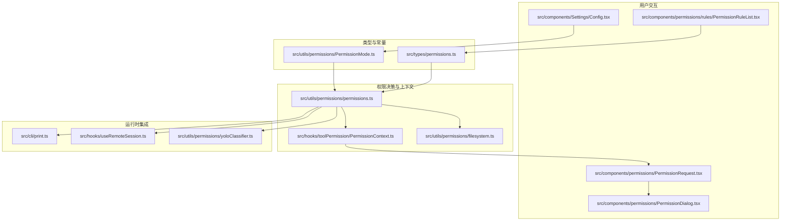
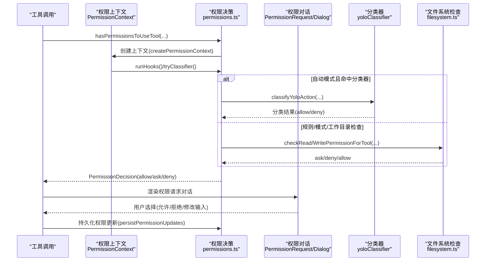
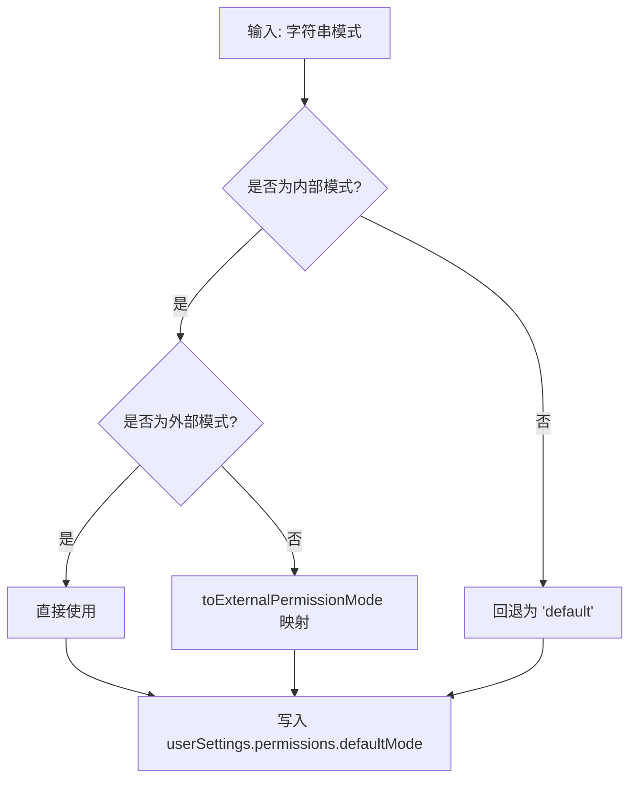
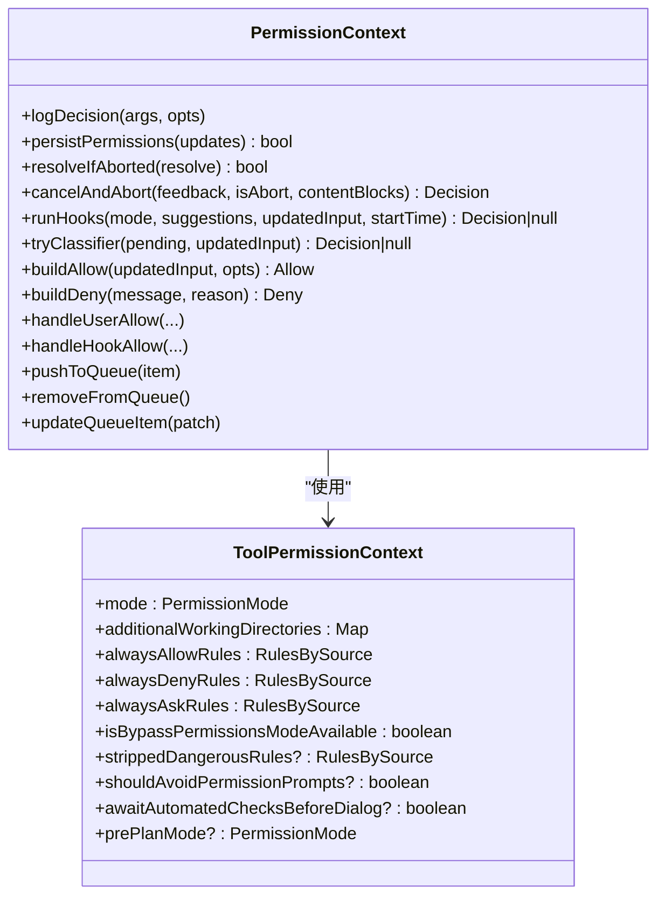
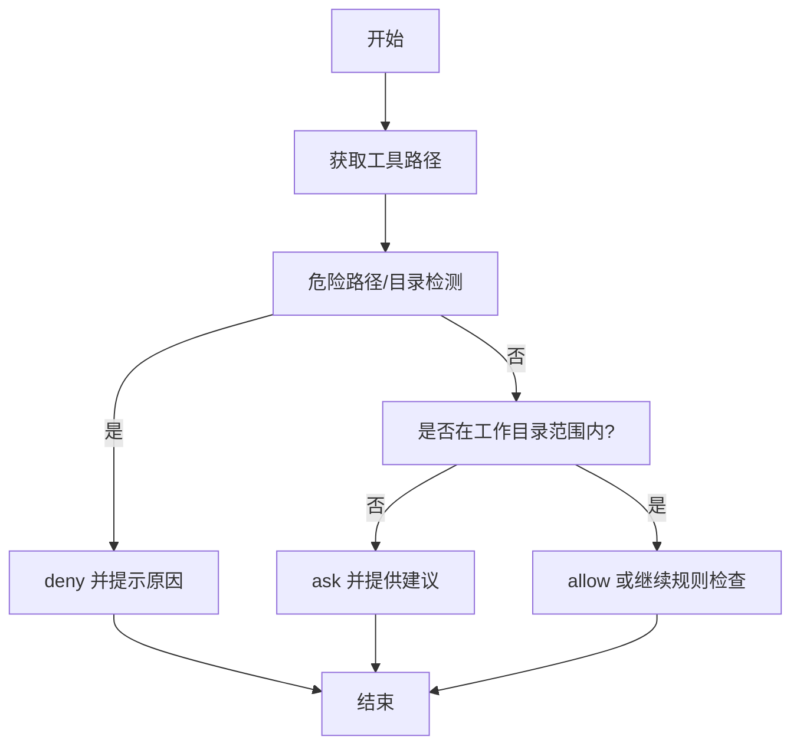
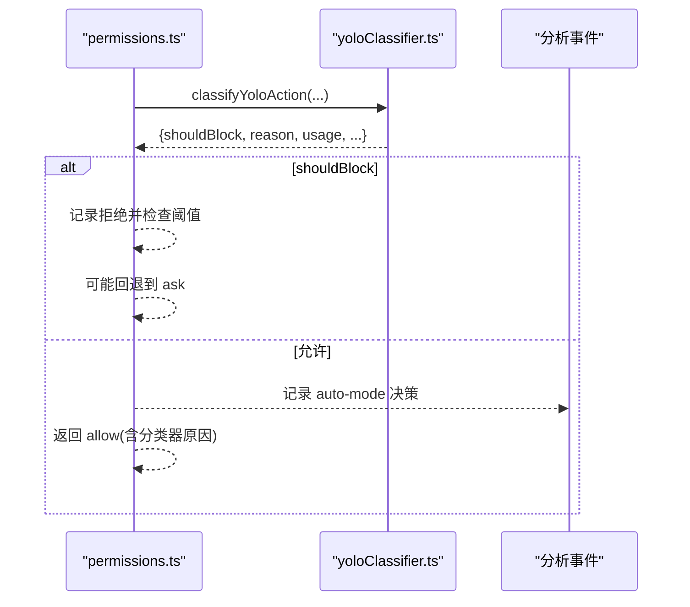
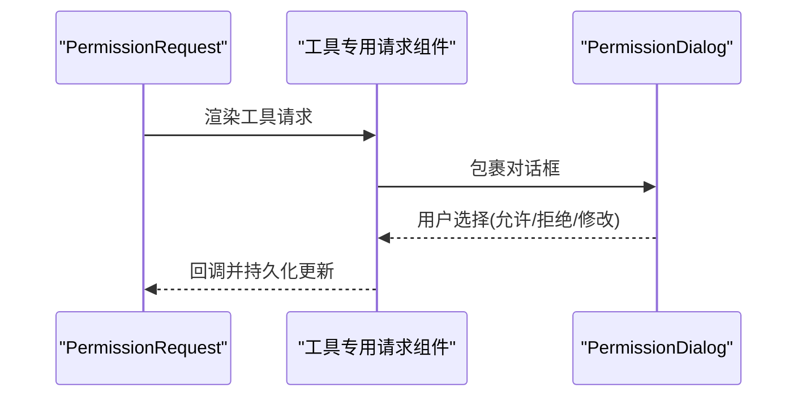
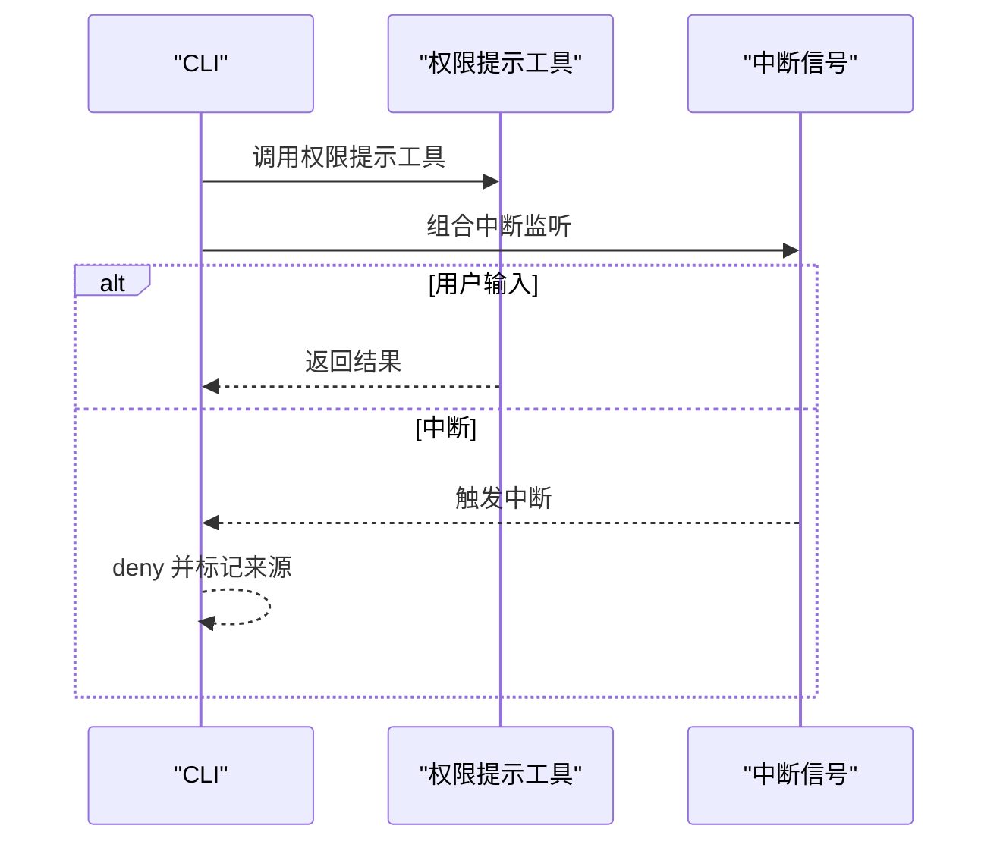
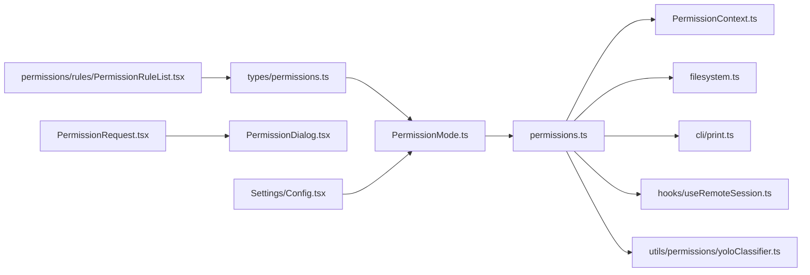

# 权限模式管理

<cite>
**本文引用的文件**
- [PermissionMode.ts](file://src/utils/permissions/PermissionMode.ts)
- [permissions.ts](file://src/utils/permissions/permissions.ts)
- [filesystem.ts](file://src/utils/permissions/filesystem.ts)
- [PermissionContext.ts](file://src/hooks/toolPermission/PermissionContext.ts)
- [PermissionDialog.tsx](file://src/components/permissions/PermissionDialog.tsx)
- [PermissionRequest.tsx](file://src/components/permissions/PermissionRequest.tsx)
- [Config.tsx](file://src/components/Settings/Config.tsx)
- [PermissionRuleList.tsx](file://src/components/permissions/rules/PermissionRuleList.tsx)
- [print.ts](file://src/cli/print.ts)
- [types/permissions.ts](file://src/types/permissions.ts)
- [useRemoteSession.ts](file://src/hooks/useRemoteSession.ts)
- [yoloClassifier.ts](file://src/utils/permissions/yoloClassifier.ts)
</cite>

## 目录
1. [引言](#引言)
2. [项目结构](#项目结构)
3. [核心组件](#核心组件)
4. [架构总览](#架构总览)
5. [详细组件分析](#详细组件分析)
6. [依赖关系分析](#依赖关系分析)
7. [性能考量](#性能考量)
8. [故障排查指南](#故障排查指南)
9. [结论](#结论)
10. [附录](#附录)

## 引言
本文件系统性阐述 Claude Code 的权限模式管理，围绕三种核心模式（自动模式、询问模式、允许模式）的设计理念、适用场景与实现细节展开；解释模式切换机制与状态管理；详述自动模式下 AI 分类器的决策流程；说明模式对工具调用行为的影响（权限检查、用户提示与安全限制）；并给出模式配置选项与用户交互界面的实现路径与示例定位。

## 项目结构
权限模式管理横跨“类型定义—工具权限上下文—UI 对话—CLI/远程会话—文件系统与规则”等模块，形成从“策略定义到执行落地”的完整闭环。

图表来源
- [types/permissions.ts:16-441](file://src/types/permissions.ts#L16-L441)
- [PermissionMode.ts:42-91](file://src/utils/permissions/PermissionMode.ts#L42-L91)
- [permissions.ts:109-121](file://src/utils/permissions/permissions.ts#L109-L121)
- [PermissionContext.ts:96-104](file://src/hooks/toolPermission/PermissionContext.ts#L96-L104)
- [filesystem.ts:1-200](file://src/utils/permissions/filesystem.ts#L1-L200)
- [PermissionDialog.tsx:1-73](file://src/components/permissions/PermissionDialog.tsx#L1-L73)
- [PermissionRequest.tsx:47-82](file://src/components/permissions/PermissionRequest.tsx#L47-L82)
- [Config.tsx:508-521](file://src/components/Settings/Config.tsx#L508-L521)
- [PermissionRuleList.tsx:795-835](file://src/components/permissions/rules/PermissionRuleList.tsx#L795-L835)
- [print.ts:4149-4238](file://src/cli/print.ts#L4149-L4238)
- [useRemoteSession.ts:340-351](file://src/hooks/useRemoteSession.ts#L340-L351)
- [yoloClassifier.ts:898-917](file://src/utils/permissions/yoloClassifier.ts#L898-L917)

章节来源
- [types/permissions.ts:16-441](file://src/types/permissions.ts#L16-L441)
- [PermissionMode.ts:42-143](file://src/utils/permissions/PermissionMode.ts#L42-L143)
- [permissions.ts:109-200](file://src/utils/permissions/permissions.ts#L109-L200)

## 核心组件
- 模式枚举与外部映射：定义内部/外部模式集合、标题短名、颜色与符号，并提供外部模式映射与校验。
- 工具权限上下文：封装权限队列、钩子执行、分类器尝试、持久化更新与决策日志。
- 文件系统权限检查：针对读写操作进行路径合法性、工作目录范围与危险路径保护的判定。
- 用户交互对话：统一的权限对话框容器与按工具分派的具体请求组件。
- CLI/远程集成：在 CLI 中以竞态方式等待权限提示工具或中断信号；远程会话中生成“需要权限”的合成消息。
- 自动模式分类器：在敏感路径与高风险命令上进行两阶段判定，支持失败关闭窗口与拒绝次数跟踪。

章节来源
- [PermissionMode.ts:117-143](file://src/utils/permissions/PermissionMode.ts#L117-L143)
- [PermissionContext.ts:174-215](file://src/hooks/toolPermission/PermissionContext.ts#L174-L215)
- [filesystem.ts:1178-1217](file://src/utils/permissions/filesystem.ts#L1178-L1217)
- [PermissionDialog.tsx:1-73](file://src/components/permissions/PermissionDialog.tsx#L1-L73)
- [PermissionRequest.tsx:47-82](file://src/components/permissions/PermissionRequest.tsx#L47-L82)
- [print.ts:4149-4238](file://src/cli/print.ts#L4149-L4238)
- [useRemoteSession.ts:340-351](file://src/hooks/useRemoteSession.ts#L340-L351)
- [yoloClassifier.ts:898-917](file://src/utils/permissions/yoloClassifier.ts#L898-L917)

## 架构总览
权限模式管理采用“策略定义—上下文决策—UI 提示—持久化更新—分类器辅助—安全边界”的分层设计。模式选择影响默认行为与提示策略；工具调用通过上下文触发权限检查与可能的分类器异步评估；最终决策以 allow/deny/ask 形式返回，并可记录到设置源中。

图表来源
- [permissions.ts:109-200](file://src/utils/permissions/permissions.ts#L109-L200)
- [PermissionContext.ts:174-215](file://src/hooks/toolPermission/PermissionContext.ts#L174-L215)
- [filesystem.ts:1178-1217](file://src/utils/permissions/filesystem.ts#L1178-L1217)
- [PermissionRequest.tsx:146-200](file://src/components/permissions/PermissionRequest.tsx#L146-L200)
- [yoloClassifier.ts:898-917](file://src/utils/permissions/yoloClassifier.ts#L898-L917)

## 详细组件分析

### 权限模式与配置
- 内部模式集合包含外部模式与自动/气泡模式；外部模式用于对外用户可见与持久化存储。
- 外部映射确保内部模式（如 auto/bubble）在外部视角被转换为 default 等合法值。
- 设置界面提供模式变更入口，解析字符串模式并校验是否为外部模式，再写入用户设置。

图表来源
- [PermissionMode.ts:117-121](file://src/utils/permissions/PermissionMode.ts#L117-L121)
- [PermissionMode.ts:111-115](file://src/utils/permissions/PermissionMode.ts#L111-L115)
- [Config.tsx:508-521](file://src/components/Settings/Config.tsx#L508-L521)

章节来源
- [PermissionMode.ts:42-91](file://src/utils/permissions/PermissionMode.ts#L42-L91)
- [PermissionMode.ts:111-143](file://src/utils/permissions/PermissionMode.ts#L111-L143)
- [types/permissions.ts:16-441](file://src/types/permissions.ts#L16-L441)
- [Config.tsx:508-521](file://src/components/Settings/Config.tsx#L508-L521)

### 工具权限上下文与决策流水线
- 上下文负责：
  - 构建决策（allow/ask/deny），记录日志与取消信号处理；
  - 运行权限钩子（PermissionRequest），支持中断与永久更新；
  - 在 Bash 工具上尝试分类器自动批准；
  - 持久化权限更新并应用到上下文。
- 决策来源包括：规则匹配、模式强制、分类器、钩子、工作目录限制、安全检查等。

图表来源
- [PermissionContext.ts:96-104](file://src/hooks/toolPermission/PermissionContext.ts#L96-L104)
- [PermissionContext.ts:174-215](file://src/hooks/toolPermission/PermissionContext.ts#L174-L215)
- [types/permissions.ts:419-441](file://src/types/permissions.ts#L419-L441)

章节来源
- [PermissionContext.ts:1-390](file://src/hooks/toolPermission/PermissionContext.ts#L1-L390)
- [types/permissions.ts:419-441](file://src/types/permissions.ts#L419-L441)

### 文件系统权限检查与安全边界
- 针对读/写操作，先提取工具目标路径，再进行：
  - 路径规范化与危险检测（遍历、大小写不敏感比较、危险目录/文件）；
  - 工作目录范围判断（超出范围则要求权限）；
  - 生成建议（允许特定路径或技能作用域）。
- 对于 Bash/PowerShell 等高危工具，结合沙箱与安全检查策略。

图表来源
- [filesystem.ts:1178-1217](file://src/utils/permissions/filesystem.ts#L1178-L1217)

章节来源
- [filesystem.ts:57-80](file://src/utils/permissions/filesystem.ts#L57-L80)
- [filesystem.ts:1178-1217](file://src/utils/permissions/filesystem.ts#L1178-L1217)

### 自动模式下的分类器决策
- 自动模式启用时，对敏感路径与高风险命令进行两阶段分类：
  - 快速阶段：基于提示词与工具调用摘要快速判定；
  - 思考阶段：进一步细化理由与可解析性；
  - 若解析失败或不可用，按失败关闭策略阻断；
  - 支持拒绝次数跟踪与阈值触发的提示回退。
- 分类器结果作为决策依据，记录到分析事件中并可设置“分类器已批准”的规则缓存。

图表来源
- [permissions.ts:878-927](file://src/utils/permissions/permissions.ts#L878-L927)
- [yoloClassifier.ts:898-917](file://src/utils/permissions/yoloClassifier.ts#L898-L917)

章节来源
- [permissions.ts:878-927](file://src/utils/permissions/permissions.ts#L878-L927)
- [yoloClassifier.ts:898-917](file://src/utils/permissions/yoloClassifier.ts#L898-L917)

### 用户交互与权限对话
- 统一对话容器提供边框与主题色，按工具分派具体请求组件；
- 请求组件负责：
  - 通知提示与键盘绑定；
  - 用户交互期间阻止自动批准；
  - 允许/拒绝回调，支持反馈与附加内容块；
  - 重新检查权限与持久化更新。
- 设置界面中的规则列表支持重试被拒项并回传消息。

图表来源
- [PermissionRequest.tsx:146-200](file://src/components/permissions/PermissionRequest.tsx#L146-L200)
- [PermissionDialog.tsx:1-73](file://src/components/permissions/PermissionDialog.tsx#L1-L73)
- [PermissionRuleList.tsx:795-835](file://src/components/permissions/rules/PermissionRuleList.tsx#L795-L835)

章节来源
- [PermissionRequest.tsx:47-127](file://src/components/permissions/PermissionRequest.tsx#L47-L127)
- [PermissionDialog.tsx:1-73](file://src/components/permissions/PermissionDialog.tsx#L1-L73)
- [PermissionRuleList.tsx:795-835](file://src/components/permissions/rules/PermissionRuleList.tsx#L795-L835)

### CLI 与远程会话中的权限提示
- CLI 中以竞态方式等待权限提示工具与中断信号，避免死锁等待；
- 远程会话中生成“需要权限”的合成消息，携带描述与建议。

图表来源
- [print.ts:4149-4238](file://src/cli/print.ts#L4149-L4238)
- [useRemoteSession.ts:340-351](file://src/hooks/useRemoteSession.ts#L340-L351)

章节来源
- [print.ts:4149-4238](file://src/cli/print.ts#L4149-L4238)
- [useRemoteSession.ts:340-351](file://src/hooks/useRemoteSession.ts#L340-L351)

## 依赖关系分析
- 类型与模式：类型定义文件提供模式枚举、行为与决策结构；模式工具提供标题、颜色与外部映射。
- 决策与上下文：权限主流程依赖上下文与文件系统检查；自动模式依赖分类器模块。
- UI 与设置：设置界面与规则列表负责模式与规则的持久化；请求组件负责用户交互。
- 运行时集成：CLI 与远程会话分别在不同通道接入权限提示与中断处理。

图表来源
- [types/permissions.ts:16-441](file://src/types/permissions.ts#L16-L441)
- [PermissionMode.ts:42-91](file://src/utils/permissions/PermissionMode.ts#L42-L91)
- [permissions.ts:109-200](file://src/utils/permissions/permissions.ts#L109-L200)
- [PermissionContext.ts:96-104](file://src/hooks/toolPermission/PermissionContext.ts#L96-L104)
- [filesystem.ts:1178-1217](file://src/utils/permissions/filesystem.ts#L1178-L1217)
- [print.ts:4149-4238](file://src/cli/print.ts#L4149-L4238)
- [useRemoteSession.ts:340-351](file://src/hooks/useRemoteSession.ts#L340-L351)
- [yoloClassifier.ts:898-917](file://src/utils/permissions/yoloClassifier.ts#L898-L917)
- [PermissionRequest.tsx:146-200](file://src/components/permissions/PermissionRequest.tsx#L146-L200)
- [PermissionDialog.tsx:1-73](file://src/components/permissions/PermissionDialog.tsx#L1-L73)
- [Config.tsx:508-521](file://src/components/Settings/Config.tsx#L508-L521)
- [PermissionRuleList.tsx:795-835](file://src/components/permissions/rules/PermissionRuleList.tsx#L795-L835)

章节来源
- [types/permissions.ts:16-441](file://src/types/permissions.ts#L16-L441)
- [PermissionMode.ts:42-143](file://src/utils/permissions/PermissionMode.ts#L42-L143)
- [permissions.ts:109-200](file://src/utils/permissions/permissions.ts#L109-L200)

## 性能考量
- 分类器两阶段判定与失败关闭窗口需权衡延迟与安全性；建议在高风险路径上启用并限制失败重试频率。
- 权限钩子与规则匹配应尽量避免昂贵的 I/O；必要时采用缓存与懒加载。
- CLI 中的竞态等待避免阻塞中断，减少用户等待时间。
- 文件系统检查在 Windows/macOS 上进行路径归一化，降低误判成本。

## 故障排查指南
- 自动模式频繁回退到提示：检查拒绝次数阈值与分类器可用性；查看分析事件中的分类器阶段信息。
- 权限提示未响应：确认 CLI 中中断信号组合与权限提示工具的竞态逻辑；远程会话中检查合成消息是否正确生成。
- 文件系统权限异常：核对工作目录范围、危险路径名单与大小写不敏感比较逻辑；确认建议生成是否合理。
- 模式切换无效：检查设置写入路径与外部模式映射；确认类型校验与默认回退逻辑。

章节来源
- [permissions.ts:878-927](file://src/utils/permissions/permissions.ts#L878-L927)
- [print.ts:4149-4238](file://src/cli/print.ts#L4149-L4238)
- [filesystem.ts:57-92](file://src/utils/permissions/filesystem.ts#L57-L92)
- [Config.tsx:508-521](file://src/components/Settings/Config.tsx#L508-L521)

## 结论
权限模式管理通过“模式—规则—分类器—UI—持久化”的闭环，实现了从安全边界到用户体验的平衡。自动模式在保障安全的前提下提升效率，询问与允许模式满足不同信任度场景；通过清晰的类型与接口抽象，系统具备良好的扩展性与可维护性。

## 附录
- 模式配置选项与示例定位
  - 模式字符串解析与外部映射：[PermissionMode.ts:117-121](file://src/utils/permissions/PermissionMode.ts#L117-L121), [PermissionMode.ts:111-115](file://src/utils/permissions/PermissionMode.ts#L111-L115)
  - 设置界面模式变更：[Config.tsx:508-521](file://src/components/Settings/Config.tsx#L508-L521)
- 自动模式分类器集成
  - 两阶段判定与失败关闭：[yoloClassifier.ts:898-917](file://src/utils/permissions/yoloClassifier.ts#L898-L917)
  - 决策回退与阈值处理：[permissions.ts:878-927](file://src/utils/permissions/permissions.ts#L878-L927)
- 工具调用权限检查
  - 文件系统读写检查与建议生成：[filesystem.ts:1178-1217](file://src/utils/permissions/filesystem.ts#L1178-L1217)
  - Bash/PowerShell 安全检查与沙箱策略：[permissions.ts:1-200](file://src/utils/permissions/permissions.ts#L1-L200)
- 用户交互与规则管理
  - 权限对话框与请求组件：[PermissionDialog.tsx:1-73](file://src/components/permissions/PermissionDialog.tsx#L1-L73), [PermissionRequest.tsx:146-200](file://src/components/permissions/PermissionRequest.tsx#L146-L200)
  - 规则列表与重试被拒项：[PermissionRuleList.tsx:795-835](file://src/components/permissions/rules/PermissionRuleList.tsx#L795-L835)
- CLI 与远程会话
  - 权限提示工具竞态与中断处理：[print.ts:4149-4238](file://src/cli/print.ts#L4149-L4238)
  - 合成权限消息：[useRemoteSession.ts:340-351](file://src/hooks/useRemoteSession.ts#L340-L351)