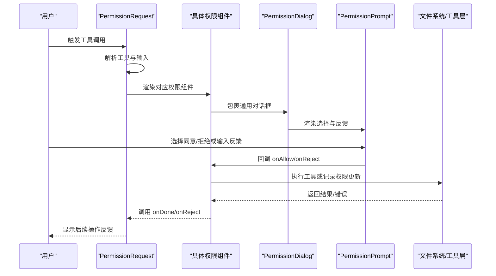
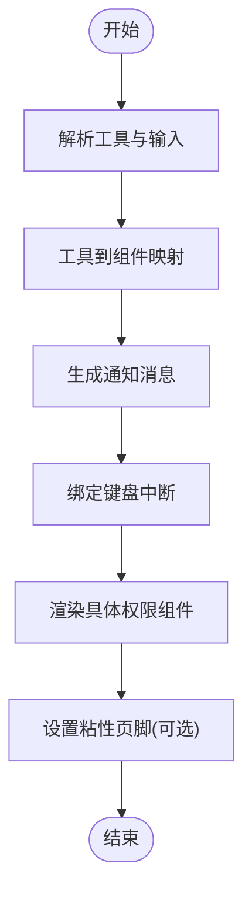
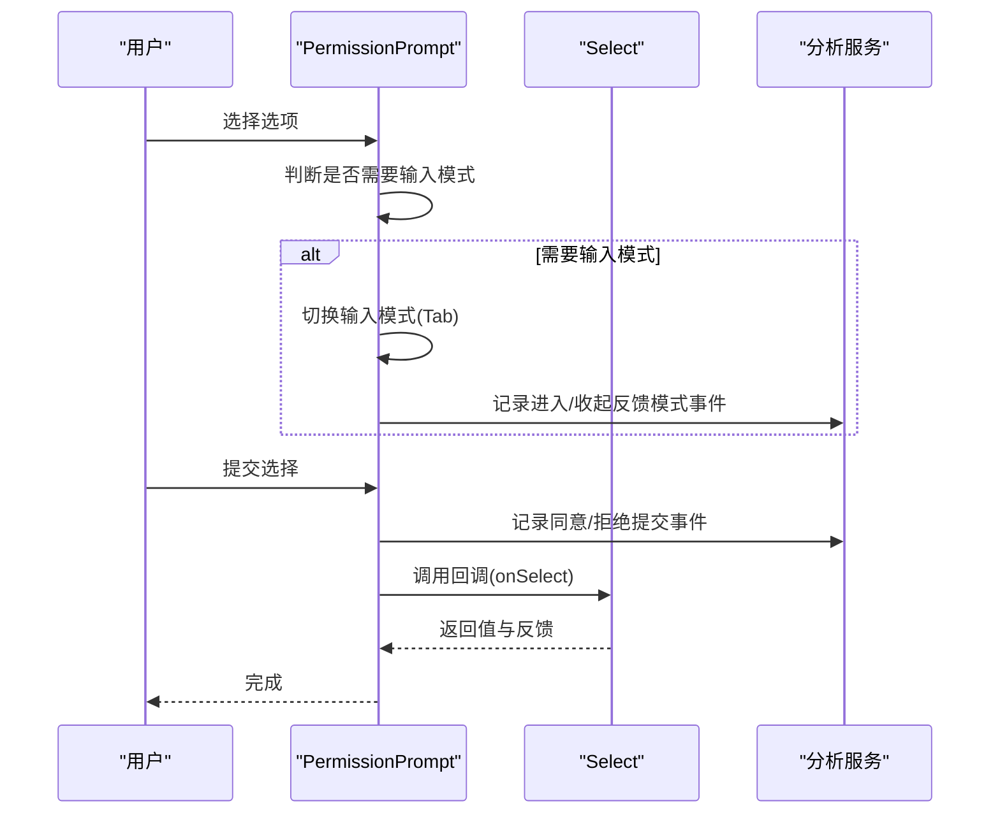
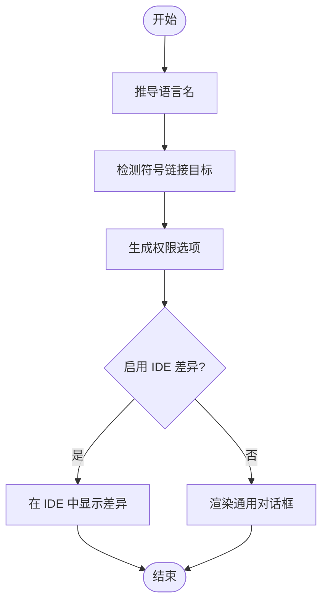
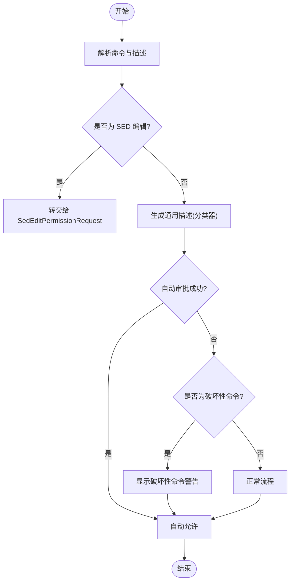
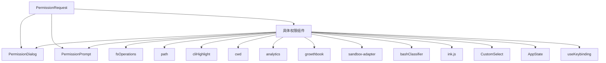

# 权限用户界面

<cite>
**本文档引用的文件**
- [PermissionDialog.tsx](file://src/components/permissions/PermissionDialog.tsx)
- [PermissionPrompt.tsx](file://src/components/permissions/PermissionPrompt.tsx)
- [PermissionRequest.tsx](file://src/components/permissions/PermissionRequest.tsx)
- [FilePermissionDialog.tsx](file://src/components/permissions/FilePermissionDialog/FilePermissionDialog.tsx)
- [BashPermissionRequest.tsx](file://src/components/permissions/BashPermissionRequest/BashPermissionRequest.tsx)
- [PermissionExplanation.tsx](file://src/components/permissions/PermissionExplanation.tsx)
- [PermissionDecisionDebugInfo.tsx](file://src/components/permissions/PermissionDecisionDebugInfo.tsx)
- [useShellPermissionFeedback.ts](file://src/components/permissions/useShellPermissionFeedback.ts)
- [PermissionRuleExplanation.tsx](file://src/components/permissions/PermissionRuleExplanation.tsx)
- [PermissionRequestTitle.tsx](file://src/components/permissions/PermissionRequestTitle.tsx)
- [WorkerBadge.tsx](file://src/components/permissions/WorkerBadge.tsx)
- [PermissionRuleList.tsx](file://src/components/permissions/rules/PermissionRuleList.tsx)
- [RecentDenialsTab.tsx](file://src/components/permissions/rules/RecentDenialsTab.tsx)
- [PermissionUpdateSchema.ts](file://src/utils/permissions/PermissionUpdateSchema.ts)
- [PermissionResult.ts](file://src/utils/permissions/PermissionResult.ts)
- [bashPermissions.ts](file://src/tools/BashTool/bashPermissions.ts)
- [destructiveCommandWarning.ts](file://src/tools/BashTool/destructiveCommandWarning.ts)
- [bashToolUseOptions.ts](file://src/components/permissions/BashPermissionRequest/bashToolUseOptions.ts)
- [useFilePermissionDialog.ts](file://src/components/permissions/FilePermissionDialog/useFilePermissionDialog.ts)
- [permissionOptions.ts](file://src/components/permissions/FilePermissionDialog/permissionOptions.ts)
- [ideDiffConfig.ts](file://src/components/permissions/FilePermissionDialog/ideDiffConfig.ts)
- [ShowInIDEPrompt.tsx](file://src/components/ShowInIDEPrompt.tsx)
- [CustomSelect/index.ts](file://src/components/CustomSelect/index.ts)
- [ink.js](file://src/ink.js)
- [AppState.tsx](file://src/state/AppState.tsx)
- [useKeybinding.ts](file://src/keybindings/useKeybinding.ts)
- [analytics/index.ts](file://src/services/analytics/index.ts)
- [growthbook.ts](file://src/services/analytics/growthbook.ts)
- [sandbox-adapter.ts](file://src/utils/sandbox/sandbox-adapter.ts)
- [bashClassifier.ts](file://src/utils/permissions/bashClassifier.ts)
- [fsOperations.ts](file://src/utils/fsOperations.ts)
- [path.ts](file://src/utils/path.ts)
- [cliHighlight.ts](file://src/utils/cliHighlight.ts)
- [cwd.ts](file://src/utils/cwd.ts)
- [unaryLogging.ts](file://src/utils/unaryLogging.ts)
- [hooks.ts](file://src/components/permissions/hooks.ts)
- [utils.ts](file://src/components/permissions/utils.ts)
</cite>

## 目录
1. [简介](#简介)
2. [项目结构](#项目结构)
3. [核心组件](#核心组件)
4. [架构总览](#架构总览)
5. [详细组件分析](#详细组件分析)
6. [依赖关系分析](#依赖关系分析)
7. [性能考虑](#性能考虑)
8. [故障排除指南](#故障排除指南)
9. [结论](#结论)
10. [附录](#附录)

## 简介
本文件面向 Claude Code 的权限用户界面，系统性阐述权限提示对话框的设计与实现，覆盖用户交互流程、界面元素、不同权限场景（工具调用、文件操作、系统命令）的界面变化，以及权限确认、拒绝与后续反馈机制。文档同时提供权限历史记录与统计信息的展示思路，并通过图示与路径引用帮助初学者快速上手、高级用户进行界面定制与扩展。

## 项目结构
权限用户界面主要位于 `src/components/permissions/` 目录下，围绕统一的权限请求入口与多种具体权限请求组件展开，配合工具层的权限规则与分类器、沙箱策略等形成完整的权限控制闭环。

```mermaid
graph TB
PR["PermissionRequest<br/>权限请求入口"] --> PD["PermissionDialog<br/>通用对话框容器"]
PR --> PP["PermissionPrompt<br/>通用选择与反馈"]
PR --> FS["FilesystemPermissionRequest<br/>文件系统权限"]
PR --> BE["BashPermissionRequest<br/>Bash 权限"]
PR --> WE["WebFetchPermissionRequest<br/>网页抓取权限"]
PR --> NE["NotebookEditPermissionRequest<br/>笔记本编辑权限"]
PR --> FE["FileEditPermissionRequest<br/>文件编辑权限"]
PR --> FW["FileWritePermissionRequest<br/>文件写入权限"]
PR --> SE["SkillPermissionRequest<br/>技能权限"]
PR --> QE["AskUserQuestionPermissionRequest<br/>提问权限"]
PR --> EM["EnterPlanModePermissionRequest<br/>进入计划模式"]
PR --> XM["ExitPlanModePermissionRequest<br/>退出计划模式"]
BE --> BTO["bashToolUseOptions<br/>Bash 选项"]
BE --> BC["bashClassifier<br/>Bash 分类器"]
BE --> SB["SandboxManager<br/>沙箱适配器"]
FS --> FPD["FilePermissionDialog<br/>文件权限对话框"]
FPD --> PFD["useFilePermissionDialog<br/>文件权限钩子"]
FPD --> PO["permissionOptions<br/>权限选项"]
FPD --> IDC["ideDiffConfig<br/>IDE 差异配置"]
FPD --> SID["ShowInIDEPrompt<br/>在 IDE 中显示提示"]
PR --> PE["PermissionExplanation<br/>权限解释"]
PR --> PRD["PermissionDecisionDebugInfo<br/>决策调试信息"]
PR --> PRE["PermissionRuleExplanation<br/>规则解释"]
PR --> WBD["WorkerBadge<br/>工作者徽章"]
PR --> PRT["PermissionRequestTitle<br/>标题组件"]
PR --> CS["CustomSelect<br/>自定义选择器"]
PR --> IK["ink.js<br/>终端 UI 组件库"]
PR --> AS["AppState<br/>应用状态"]
PR --> KB["useKeybinding<br/>快捷键绑定"]
PR --> AN["analytics<br/>分析日志"]
PR --> GB["growthbook<br/>特性开关"]
PR --> FSOPS["fsOperations<br/>文件系统操作"]
PR --> PATH["path<br/>路径工具"]
PR --> HL["cliHighlight<br/>语法高亮"]
PR --> CWD["cwd<br/>当前工作目录"]
PR --> UL["unaryLogging<br/>单次事件日志"]
PR --> PH["hooks<br/>权限钩子"]
PR --> PU["utils<br/>权限工具"]
```

**图表来源**
- [PermissionRequest.tsx:47-82](file://src/components/permissions/PermissionRequest.tsx#L47-L82)
- [PermissionDialog.tsx:1-73](file://src/components/permissions/PermissionDialog.tsx#L1-L73)
- [PermissionPrompt.tsx:1-337](file://src/components/permissions/PermissionPrompt.tsx#L1-L337)
- [FilePermissionDialog.tsx:1-205](file://src/components/permissions/FilePermissionDialog/FilePermissionDialog.tsx#L1-L205)
- [BashPermissionRequest.tsx:1-483](file://src/components/permissions/BashPermissionRequest/BashPermissionRequest.tsx#L1-L483)

**章节来源**
- [PermissionRequest.tsx:1-218](file://src/components/permissions/PermissionRequest.tsx#L1-L218)
- [PermissionDialog.tsx:1-73](file://src/components/permissions/PermissionDialog.tsx#L1-L73)
- [PermissionPrompt.tsx:1-337](file://src/components/permissions/PermissionPrompt.tsx#L1-L337)

## 核心组件
- 权限请求入口：根据工具类型动态选择具体权限请求组件，负责通知消息生成、键盘中断处理与粘性页脚支持。
- 通用对话框容器：提供带边框、内边距、标题与副标题的统一外观，支持工作者徽章与右侧标题区域。
- 通用选择与反馈：提供“是否继续”问题、可选反馈输入（Tab 展开）、分析事件记录、快捷键绑定。
- 文件权限对话框：针对文件/目录操作，支持 IDE 差异视图、符号链接目标提示、语言识别、权限选项与变更应用。
- Bash 权限请求：集成分类器自动审批、破坏性命令警告、沙箱策略、SED 编辑特殊处理与反馈收集。

**章节来源**
- [PermissionRequest.tsx:83-127](file://src/components/permissions/PermissionRequest.tsx#L83-L127)
- [PermissionDialog.tsx:7-31](file://src/components/permissions/PermissionDialog.tsx#L7-L31)
- [PermissionPrompt.tsx:10-29](file://src/components/permissions/PermissionPrompt.tsx#L10-L29)
- [FilePermissionDialog.tsx:20-47](file://src/components/permissions/FilePermissionDialog/FilePermissionDialog.tsx#L20-L47)
- [BashPermissionRequest.tsx:71-133](file://src/components/permissions/BashPermissionRequest/BashPermissionRequest.tsx#L71-L133)

## 架构总览
权限系统采用“请求入口 + 具体权限组件 + 通用 UI 容器 + 工具与规则”的分层设计。请求入口根据工具类型路由到对应权限组件；通用容器提供一致的视觉与交互体验；工具层提供权限规则、分类器与沙箱策略；UI 层通过选择器、反馈输入、IDE 集成等方式增强用户体验。

**图表来源**
- [PermissionRequest.tsx:146-216](file://src/components/permissions/PermissionRequest.tsx#L146-L216)
- [PermissionDialog.tsx:17-71](file://src/components/permissions/PermissionDialog.tsx#L17-L71)
- [PermissionPrompt.tsx:135-225](file://src/components/permissions/PermissionPrompt.tsx#L135-L225)

## 详细组件分析

### 权限请求入口（PermissionRequest）
- 功能职责：根据工具类型映射到具体权限组件；生成通知消息；注册键盘中断处理；支持粘性页脚以保持响应选项可见。
- 关键点：
  - 工具到组件映射：覆盖文件编辑、文件写入、Bash、PowerShell、网页抓取、笔记本编辑、计划模式切换、技能、提问、工作流、监控等。
  - 通知消息：根据工具名称或特性生成用户友好提示。
  - 键盘中断：绑定 Ctrl+C 中断当前权限请求。
  - 粘性页脚：用于长计划滚动时保持选项可见。

**图表来源**
- [PermissionRequest.tsx:47-82](file://src/components/permissions/PermissionRequest.tsx#L47-L82)
- [PermissionRequest.tsx:128-143](file://src/components/permissions/PermissionRequest.tsx#L128-L143)
- [PermissionRequest.tsx:172-180](file://src/components/permissions/PermissionRequest.tsx#L172-L180)

**章节来源**
- [PermissionRequest.tsx:47-82](file://src/components/permissions/PermissionRequest.tsx#L47-L82)
- [PermissionRequest.tsx:128-143](file://src/components/permissions/PermissionRequest.tsx#L128-L143)
- [PermissionRequest.tsx:172-180](file://src/components/permissions/PermissionRequest.tsx#L172-L180)

### 通用对话框容器（PermissionDialog）
- 功能职责：提供统一的边框样式、内边距、标题与副标题布局，支持工作者徽章与右侧标题区域。
- 关键点：
  - 主题色：默认使用“permission”主题色。
  - 布局：标题区（含副标题与徽章）+ 内容区（children）+ 底部提示（Esc/Tab 提示）。
  - 可定制：颜色、内边距、右侧标题区域。

**章节来源**
- [PermissionDialog.tsx:7-31](file://src/components/permissions/PermissionDialog.tsx#L7-L31)
- [PermissionDialog.tsx:17-71](file://src/components/permissions/PermissionDialog.tsx#L17-L71)

### 通用选择与反馈（PermissionPrompt）
- 功能职责：提供“是否继续”问题、可选反馈输入（Tab 展开）、分析事件记录、快捷键绑定。
- 关键点：
  - 选项格式：支持普通选项与带输入模式的选项（accept/reject）。
  - 输入模式：按 Tab 在同意/拒绝选项间切换输入模式，收集反馈。
  - 分析事件：记录进入/收起反馈模式、提交同意/拒绝等事件。
  - 快捷键：为带快捷键的选项注册处理函数。
  - 取消：Esc 记录事件并触发取消回调。

**图表来源**
- [PermissionPrompt.tsx:135-225](file://src/components/permissions/PermissionPrompt.tsx#L135-L225)
- [PermissionPrompt.tsx:226-250](file://src/components/permissions/PermissionPrompt.tsx#L226-L250)
- [PermissionPrompt.tsx:252-264](file://src/components/permissions/PermissionPrompt.tsx#L252-L264)

**章节来源**
- [PermissionPrompt.tsx:10-29](file://src/components/permissions/PermissionPrompt.tsx#L10-L29)
- [PermissionPrompt.tsx:135-225](file://src/components/permissions/PermissionPrompt.tsx#L135-L225)
- [PermissionPrompt.tsx:226-250](file://src/components/permissions/PermissionPrompt.tsx#L226-L250)
- [PermissionPrompt.tsx:252-264](file://src/components/permissions/PermissionPrompt.tsx#L252-L264)

### 文件权限对话框（FilePermissionDialog）
- 功能职责：针对文件/目录操作提供统一权限对话框，支持 IDE 差异视图、符号链接目标提示、语言识别、权限选项与变更应用。
- 关键点：
  - 语言识别：基于路径推导语言名，用于日志与高亮。
  - 符号链接：检测并提示符号链接目标，特别是跨工作目录的情况。
  - IDE 差异：支持在 IDE 中显示差异并应用变更。
  - 权限选项：通过钩子生成同意/拒绝/一次性同意等选项。
  - 输入解析：使用提供的解析器解析原始输入，确保变更一致性。

**图表来源**
- [FilePermissionDialog.tsx:69-74](file://src/components/permissions/FilePermissionDialog/FilePermissionDialog.tsx#L69-L74)
- [FilePermissionDialog.tsx:75-89](file://src/components/permissions/FilePermissionDialog/FilePermissionDialog.tsx#L75-L89)
- [FilePermissionDialog.tsx:90-111](file://src/components/permissions/FilePermissionDialog/FilePermissionDialog.tsx#L90-L111)
- [FilePermissionDialog.tsx:116-120](file://src/components/permissions/FilePermissionDialog/FilePermissionDialog.tsx#L116-L120)
- [FilePermissionDialog.tsx:159-161](file://src/components/permissions/FilePermissionDialog/FilePermissionDialog.tsx#L159-L161)

**章节来源**
- [FilePermissionDialog.tsx:20-47](file://src/components/permissions/FilePermissionDialog/FilePermissionDialog.tsx#L20-L47)
- [FilePermissionDialog.tsx:69-74](file://src/components/permissions/FilePermissionDialog/FilePermissionDialog.tsx#L69-L74)
- [FilePermissionDialog.tsx:75-89](file://src/components/permissions/FilePermissionDialog/FilePermissionDialog.tsx#L75-L89)
- [FilePermissionDialog.tsx:90-111](file://src/components/permissions/FilePermissionDialog/FilePermissionDialog.tsx#L90-L111)
- [FilePermissionDialog.tsx:116-120](file://src/components/permissions/FilePermissionDialog/FilePermissionDialog.tsx#L116-L120)
- [FilePermissionDialog.tsx:159-161](file://src/components/permissions/FilePermissionDialog/FilePermissionDialog.tsx#L159-L161)

### Bash 权限请求（BashPermissionRequest）
- 功能职责：处理 Bash 工具调用的权限请求，支持分类器自动审批、破坏性命令警告、沙箱策略、SED 编辑特殊处理与反馈收集。
- 关键点：
  - SED 编辑：检测并转交给专门的 SedEditPermissionRequest。
  - 分类器：异步生成通用描述，尝试自动审批；提供“正在尝试自动审批…”动画提示。
  - 破坏性命令：根据前缀判断并给出警告。
  - 沙箱策略：决定是否使用沙箱执行。
  - 反馈与解释：结合 useShellPermissionFeedback 与 PermissionExplanation 提供上下文解释。

**图表来源**
- [BashPermissionRequest.tsx:81-116](file://src/components/permissions/BashPermissionRequest/BashPermissionRequest.tsx#L81-L116)
- [BashPermissionRequest.tsx:183-191](file://src/components/permissions/BashPermissionRequest/BashPermissionRequest.tsx#L183-L191)
- [BashPermissionRequest.tsx:210-230](file://src/components/permissions/BashPermissionRequest/BashPermissionRequest.tsx#L210-L230)
- [BashPermissionRequest.tsx:231-260](file://src/components/permissions/BashPermissionRequest/BashPermissionRequest.tsx#L231-L260)
- [BashPermissionRequest.tsx:261-300](file://src/components/permissions/BashPermissionRequest/BashPermissionRequest.tsx#L261-L300)

**章节来源**
- [BashPermissionRequest.tsx:71-133](file://src/components/permissions/BashPermissionRequest/BashPermissionRequest.tsx#L71-L133)
- [BashPermissionRequest.tsx:136-483](file://src/components/permissions/BashPermissionRequest/BashPermissionRequest.tsx#L136-L483)

### 权限解释与调试（PermissionExplanation, PermissionDecisionDebugInfo）
- 权限解释：根据工具名称、输入、描述与消息上下文生成解释内容，辅助用户理解权限用途。
- 决策调试：在调试模式下展示权限决策详情，便于排查与优化。

**章节来源**
- [PermissionExplanation.tsx](file://src/components/permissions/PermissionExplanation.tsx)
- [PermissionDecisionDebugInfo.tsx](file://src/components/permissions/PermissionDecisionDebugInfo.tsx)

### Shell 权限反馈（useShellPermissionFeedback）
- 功能职责：管理同意/拒绝反馈输入状态、焦点选项、输入模式切换与回调处理，支持解释器可见性联动。
- 关键点：集中处理反馈输入与键盘交互，避免重复逻辑。

**章节来源**
- [useShellPermissionFeedback.ts](file://src/components/permissions/useShellPermissionFeedback.ts)

### 权限规则与历史（PermissionRuleExplanation, PermissionRuleList, RecentDenialsTab）
- 权限规则解释：对当前权限决策涉及的规则进行解释。
- 规则列表与最近拒绝：展示已配置的权限规则与最近拒绝记录，便于审计与调整。

**章节来源**
- [PermissionRuleExplanation.tsx](file://src/components/permissions/PermissionRuleExplanation.tsx)
- [PermissionRuleList.tsx](file://src/components/permissions/rules/PermissionRuleList.tsx)
- [RecentDenialsTab.tsx](file://src/components/permissions/rules/RecentDenialsTab.tsx)

## 依赖关系分析
- 组件耦合：
  - PermissionRequest 作为入口，低耦合地依赖各具体权限组件。
  - PermissionDialog/PermissionPrompt 为通用容器与选择器，被广泛复用。
  - 文件权限对话框依赖 IDE 差异配置与文件系统操作工具。
  - Bash 权限请求依赖分类器、沙箱与破坏性命令检测。
- 外部依赖：
  - ink.js 提供终端 UI 组件。
  - CustomSelect 提供可内联描述的选择器。
  - 分析服务与特性开关用于行为追踪与功能控制。
  - 路径与文件系统工具用于安全路径解析与语言识别。

**图表来源**
- [PermissionRequest.tsx:192-202](file://src/components/permissions/PermissionRequest.tsx#L192-L202)
- [FilePermissionDialog.tsx:116-120](file://src/components/permissions/FilePermissionDialog/FilePermissionDialog.tsx#L116-L120)
- [BashPermissionRequest.tsx:136-483](file://src/components/permissions/BashPermissionRequest/BashPermissionRequest.tsx#L136-L483)

**章节来源**
- [PermissionRequest.tsx:192-202](file://src/components/permissions/PermissionRequest.tsx#L192-L202)
- [FilePermissionDialog.tsx:116-120](file://src/components/permissions/FilePermissionDialog/FilePermissionDialog.tsx#L116-L120)
- [BashPermissionRequest.tsx:136-483](file://src/components/permissions/BashPermissionRequest/BashPermissionRequest.tsx#L136-L483)

## 性能考虑
- 渲染优化：
  - 使用 useMemo 缓存语言名、符号链接目标、IDE 差异配置等计算结果，减少不必要的重渲染。
  - 将闪烁动画独立为子组件，避免主对话框树频繁重建。
- 异步处理：
  - 分类器描述生成使用 AbortController，避免竞态与内存泄漏。
  - 文件差异在 IDE 中打开后及时关闭标签页，避免资源占用。
- 事件与日志：
  - 条件记录分析事件，避免在无反馈模式下产生冗余日志。
  - 单次事件日志稳定化 Promise，确保日志一致性。

[本节为通用指导，无需特定文件引用]

## 故障排除指南
- 无法看到反馈输入：
  - 确认焦点在带反馈的选项上，按 Tab 切换输入模式。
  - 检查快捷键绑定是否冲突。
- 自动审批未生效：
  - 等待分类器描述生成完成，查看“正在尝试自动审批…”提示。
  - 检查特性开关与网络状态。
- 文件操作异常：
  - 检查符号链接目标是否在工作目录外，必要时手动确认。
  - 确认 IDE 差异视图是否正确应用变更。
- Bash 命令被拒绝：
  - 查看破坏性命令警告，确认是否为危险操作。
  - 检查沙箱策略与权限规则。

**章节来源**
- [PermissionPrompt.tsx:274-294](file://src/components/permissions/PermissionPrompt.tsx#L274-L294)
- [BashPermissionRequest.tsx:183-191](file://src/components/permissions/BashPermissionRequest/BashPermissionRequest.tsx#L183-L191)
- [FilePermissionDialog.tsx:159-161](file://src/components/permissions/FilePermissionDialog/FilePermissionDialog.tsx#L159-L161)
- [destructiveCommandWarning.ts](file://src/tools/BashTool/destructiveCommandWarning.ts)

## 结论
权限用户界面通过统一的入口与容器、灵活的通用选择与反馈机制，以及针对不同工具场景的具体实现，构建了清晰、可扩展且用户友好的权限控制体系。配合分类器、沙箱与规则系统，既保障了安全性，又提升了用户体验。开发者可基于现有组件与钩子进行二次开发，满足更复杂的权限需求。

[本节为总结性内容，无需特定文件引用]

## 附录

### 不同权限场景的界面变化
- 工具调用权限：根据工具类型选择对应组件，显示工具名称与描述，支持解释与规则说明。
- 文件操作权限：显示文件路径、语言识别、符号链接提示、IDE 差异视图与权限选项。
- 系统命令权限（Bash）：显示命令预览、破坏性警告、分类器自动审批状态与反馈输入。

**章节来源**
- [PermissionRequest.tsx:47-82](file://src/components/permissions/PermissionRequest.tsx#L47-L82)
- [FilePermissionDialog.tsx:159-161](file://src/components/permissions/FilePermissionDialog/FilePermissionDialog.tsx#L159-L161)
- [BashPermissionRequest.tsx:210-230](file://src/components/permissions/BashPermissionRequest/BashPermissionRequest.tsx#L210-L230)

### 权限确认、拒绝与后续操作的界面反馈
- 确认：记录同意事件，执行工具或应用权限更新，显示后续操作提示。
- 拒绝：记录拒绝事件与反馈，可选传递反馈给工具或分析系统。
- 后续操作：根据工具类型与权限结果，引导用户进行下一步操作（如在 IDE 中查看差异、重新评估规则等）。

**章节来源**
- [PermissionPrompt.tsx:183-225](file://src/components/permissions/PermissionPrompt.tsx#L183-L225)
- [FilePermissionDialog.tsx:155-158](file://src/components/permissions/FilePermissionDialog/FilePermissionDialog.tsx#L155-L158)

### 权限历史记录与统计信息
- 规则与最近拒绝：在规则面板中查看已配置规则与最近拒绝记录，便于审计与调整。
- 分析事件：记录用户交互与决策事件，支持后续统计与优化。

**章节来源**
- [PermissionRuleList.tsx](file://src/components/permissions/rules/PermissionRuleList.tsx)
- [RecentDenialsTab.tsx](file://src/components/permissions/rules/RecentDenialsTab.tsx)
- [PermissionPrompt.tsx:135-171](file://src/components/permissions/PermissionPrompt.tsx#L135-L171)

### 代码示例（路径引用）
- 权限对话框实现：[PermissionDialog.tsx:17-71](file://src/components/permissions/PermissionDialog.tsx#L17-L71)
- 通用选择与反馈：[PermissionPrompt.tsx:135-225](file://src/components/permissions/PermissionPrompt.tsx#L135-L225)
- 权限请求入口：[PermissionRequest.tsx:146-216](file://src/components/permissions/PermissionRequest.tsx#L146-L216)
- 文件权限对话框：[FilePermissionDialog.tsx:159-161](file://src/components/permissions/FilePermissionDialog/FilePermissionDialog.tsx#L159-L161)
- Bash 权限请求：[BashPermissionRequest.tsx:136-483](file://src/components/permissions/BashPermissionRequest/BashPermissionRequest.tsx#L136-L483)
- 权限解释与调试：[PermissionExplanation.tsx](file://src/components/permissions/PermissionExplanation.tsx), [PermissionDecisionDebugInfo.tsx](file://src/components/permissions/PermissionDecisionDebugInfo.tsx)
- Shell 权限反馈：[useShellPermissionFeedback.ts](file://src/components/permissions/useShellPermissionFeedback.ts)
- 权限规则与历史：[PermissionRuleExplanation.tsx](file://src/components/permissions/PermissionRuleExplanation.tsx), [PermissionRuleList.tsx](file://src/components/permissions/rules/PermissionRuleList.tsx), [RecentDenialsTab.tsx](file://src/components/permissions/rules/RecentDenialsTab.tsx)