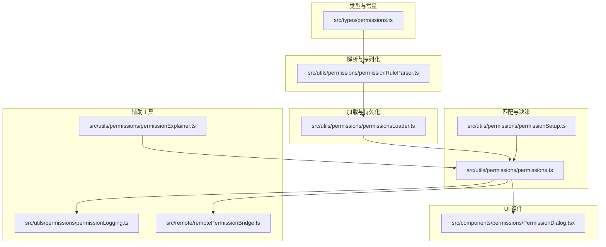
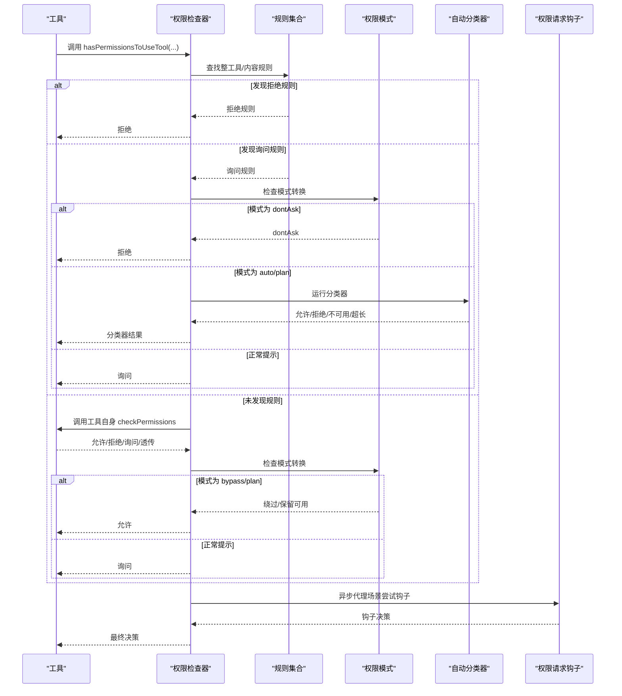
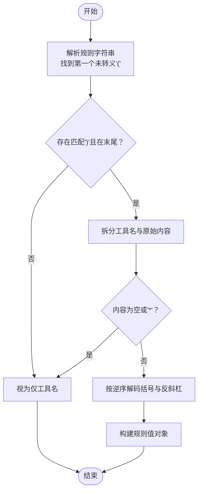
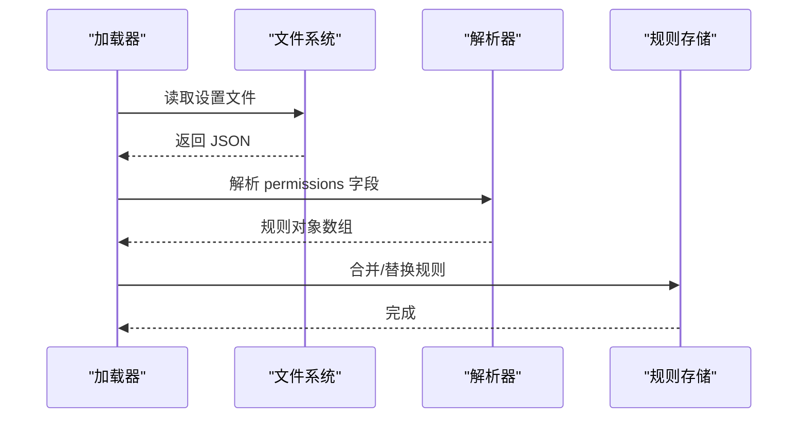
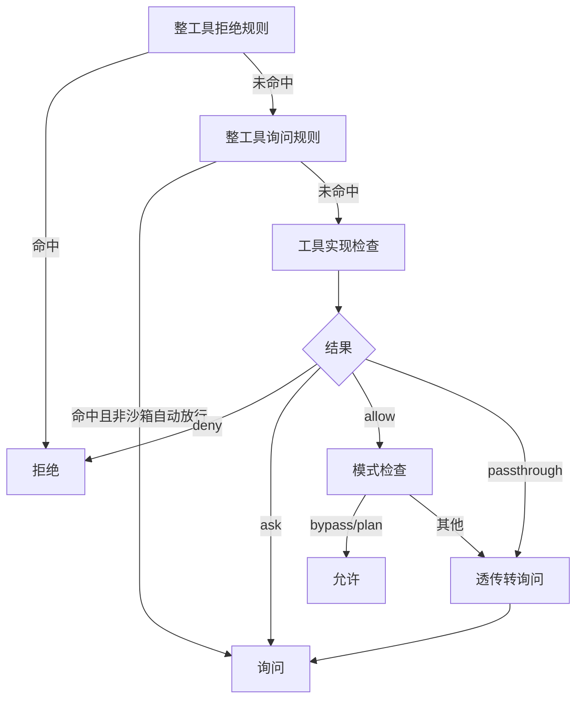
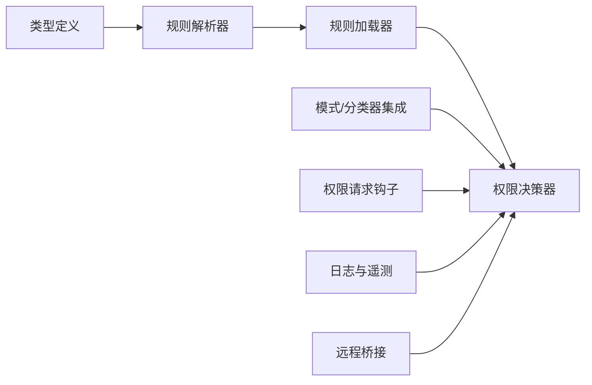

# 权限规则系统

<cite>
**本文档引用的文件**
- [src/types/permissions.ts](file://src/types/permissions.ts)
- [src/utils/permissions/permissions.ts](file://src/utils/permissions/permissions.ts)
- [src/utils/permissions/permissionRuleParser.ts](file://src/utils/permissions/permissionRuleParser.ts)
- [src/utils/permissions/permissionsLoader.ts](file://src/utils/permissions/permissionsLoader.ts)
- [src/utils/permissions/permissionSetup.ts](file://src/utils/permissions/permissionSetup.ts)
- [src/utils/permissions/permissionExplainer.ts](file://src/utils/permissions/permissionExplainer.ts)
- [src/utils/permissions/permissionLogging.ts](file://src/utils/permissions/permissionLogging.ts)
- [src/remote/remotePermissionBridge.ts](file://src/remote/remotePermissionBridge.ts)
- [src/components/permissions/PermissionDialog.tsx](file://src/components/permissions/PermissionDialog.tsx)
</cite>

## 目录
1. [简介](#简介)
2. [项目结构](#项目结构)
3. [核心组件](#核心组件)
4. [架构总览](#架构总览)
5. [详细组件分析](#详细组件分析)
6. [依赖关系分析](#依赖关系分析)
7. [性能考量](#性能考量)
8. [故障排查指南](#故障排查指南)
9. [结论](#结论)
10. [附录](#附录)

## 简介
本文件系统性梳理 Claude Code 的权限规则系统，覆盖数据结构、解析机制、匹配算法与优先级、规则类型与使用场景、规则来源与动态更新、规则语法与内容匹配逻辑（含转义与通配），并提供从“规则定义—解析—匹配—应用”的完整流程示例路径。文档同时面向初学者与高级开发者：前者可快速建立对权限规则的直观理解，后者可据此扩展或定制规则类型与行为。

## 项目结构
权限规则系统主要分布在以下模块：
- 类型与常量定义：集中于类型文件，确保无运行时依赖，避免循环导入
- 规则解析与序列化：负责规则字符串与对象之间的转换，支持转义与通配
- 规则加载与持久化：从多源设置中加载规则，并支持增删改写
- 规则匹配与决策：按优先级执行规则检查、模式转换、自动分类器决策
- 辅助工具：解释器（风险评估）、日志与遥测、远程桥接与 UI 组件

图表来源
- [src/types/permissions.ts](file://src/types/permissions.ts)
- [src/utils/permissions/permissionRuleParser.ts](file://src/utils/permissions/permissionRuleParser.ts)
- [src/utils/permissions/permissionsLoader.ts](file://src/utils/permissions/permissionsLoader.ts)
- [src/utils/permissions/permissions.ts](file://src/utils/permissions/permissions.ts)
- [src/utils/permissions/permissionSetup.ts](file://src/utils/permissions/permissionSetup.ts)
- [src/utils/permissions/permissionExplainer.ts](file://src/utils/permissions/permissionExplainer.ts)
- [src/utils/permissions/permissionLogging.ts](file://src/utils/permissions/permissionLogging.ts)
- [src/remote/remotePermissionBridge.ts](file://src/remote/remotePermissionBridge.ts)
- [src/components/permissions/PermissionDialog.tsx](file://src/components/permissions/PermissionDialog.tsx)

章节来源
- [src/types/permissions.ts](file://src/types/permissions.ts)
- [src/utils/permissions/permissionRuleParser.ts](file://src/utils/permissions/permissionRuleParser.ts)
- [src/utils/permissions/permissionsLoader.ts](file://src/utils/permissions/permissionsLoader.ts)
- [src/utils/permissions/permissions.ts](file://src/utils/permissions/permissions.ts)
- [src/utils/permissions/permissionSetup.ts](file://src/utils/permissions/permissionSetup.ts)
- [src/utils/permissions/permissionExplainer.ts](file://src/utils/permissions/permissionExplainer.ts)
- [src/utils/permissions/permissionLogging.ts](file://src/utils/permissions/permissionLogging.ts)
- [src/remote/remotePermissionBridge.ts](file://src/remote/remotePermissionBridge.ts)
- [src/components/permissions/PermissionDialog.tsx](file://src/components/permissions/PermissionDialog.tsx)

## 核心组件
- 权限模式与行为
  - 模式：默认、绕过权限、接受编辑、不询问、计划、自动、冒泡
  - 行为：允许、拒绝、询问
- 规则来源与更新目标
  - 规则来源：用户设置、项目设置、本地设置、策略设置、标志设置、命令行参数、命令、会话
  - 更新目标：用户设置、项目设置、本地设置、会话、命令行参数
- 决策结果与原因
  - 结果：允许、拒绝、询问、透传
  - 原因：规则、模式、子命令结果、权限提示工具、钩子、异步代理、沙箱覆盖、分类器、工作目录、安全检查、其他
- 工具权限上下文
  - 包含当前模式、额外工作目录、各来源的“总是允许/拒绝/询问”规则映射、是否可用绕过权限模式等

章节来源
- [src/types/permissions.ts](file://src/types/permissions.ts)
- [src/utils/permissions/permissions.ts](file://src/utils/permissions/permissions.ts)

## 架构总览
权限决策遵循“规则优先、模式次之、自动分类器（可选）”的分层流程。系统在不同上下文（本地 CLI、远程 CCR、无头/异步代理）下保持一致的行为语义，并通过钩子、解释器与遥测增强可观测性与用户体验。

图表来源
- [src/utils/permissions/permissions.ts](file://src/utils/permissions/permissions.ts)
- [src/utils/permissions/permissionSetup.ts](file://src/utils/permissions/permissionSetup.ts)

## 详细组件分析

### 数据结构与类型
- 权限模式与行为
  - 模式集合：包含外部与内部模式，内部模式根据特性开关动态启用
  - 行为枚举：allow/deny/ask
- 规则值与规则
  - 规则值包含工具名与可选的内容片段；内容片段用于精确匹配工具调用细节
  - 规则由来源、行为、规则值组成
- 决策结果与原因
  - 允许：可能携带更新后的输入、用户修改标记、决策原因、工具使用 ID、内容块等
  - 询问：消息、建议的权限更新、阻断路径、元数据、分类器待定检查等
  - 拒绝：消息、明确的决策原因
  - 透传：用于工具内部未决但需进一步处理的情况
- 工具权限上下文
  - 模式、额外工作目录、来自各来源的规则映射、是否可用绕过权限模式、是否应避免权限提示等

章节来源
- [src/types/permissions.ts](file://src/types/permissions.ts)

### 规则解析与序列化
- 解析规则字符串
  - 支持“工具名(内容)”格式；内容中的括号需转义
  - 处理空内容与通配符“*”作为工具级规则
  - 规则内容转义顺序：先转义反斜杠，再转义括号；逆向解码
- 序列化规则值
  - 将规则值还原为字符串，对括号进行转义
- 工具名兼容
  - 提供旧工具名到新工具名的映射，保证历史规则兼容

图表来源
- [src/utils/permissions/permissionRuleParser.ts](file://src/utils/permissions/permissionRuleParser.ts)

章节来源
- [src/utils/permissions/permissionRuleParser.ts](file://src/utils/permissions/permissionRuleParser.ts)

### 规则加载与持久化
- 加载规则
  - 从启用的设置源加载权限配置，转换为规则对象数组
  - 当启用“仅允许托管权限规则”时，仅使用策略设置中的规则
- 添加/删除规则
  - 新增规则时去重并保留未知键，避免破坏其他字段
  - 删除规则时规范化条目以匹配 canonical 名称
- 同步规则
  - 替换式同步：先清空对应源与行为组合，再批量替换，确保一致性

图表来源
- [src/utils/permissions/permissionsLoader.ts](file://src/utils/permissions/permissionsLoader.ts)
- [src/utils/permissions/permissionRuleParser.ts](file://src/utils/permissions/permissionRuleParser.ts)

章节来源
- [src/utils/permissions/permissionsLoader.ts](file://src/utils/permissions/permissionsLoader.ts)

### 规则匹配与优先级
- 匹配步骤
  1) 整工具拒绝规则：若命中直接拒绝
  2) 整工具询问规则：若命中且非沙箱自动放行，则进入提示
  3) 工具实现检查：调用工具自身的 checkPermissions，可能返回允许/拒绝/询问/透传
  4) 模式转换：bypass/plan 模式可直接允许
  5) 总是允许规则：若命中允许规则，直接允许
  6) 透传转询问：将透传结果转为询问
- MCP 服务器级规则
  - 支持“mcp__server”匹配服务器级别规则，以及“mcp__server__*”通配
- Agent 特殊规则
  - 使用“Agent(agentType)”语法拒绝特定子代理类型
- 沙箱自动放行
  - 在 Bash 工具上，满足沙箱条件时可跳过询问规则

图表来源
- [src/utils/permissions/permissions.ts](file://src/utils/permissions/permissions.ts)

章节来源
- [src/utils/permissions/permissions.ts](file://src/utils/permissions/permissions.ts)

### 自动模式与分类器
- 自动模式入口
  - 通过模式切换或计划模式激活自动模式，移除危险规则并记录回退
- 快速路径
  - 接受编辑模式快检：若在 acceptEdits 模式下可允许，则直接放行
  - 安全工具白名单：跳过分类器
- 分类器决策
  - 若分类器不可用且门禁开启则拒绝，否则回退正常提示
  - 若分类器提示超长（上下文窗口不足）则回退正常提示
  - 连续拒绝达到阈值后回退至提示，防止过度自动化
- 遥测与统计
  - 记录分类器耗时、令牌用量、阶段信息、成本估算等

章节来源
- [src/utils/permissions/permissions.ts](file://src/utils/permissions/permissions.ts)
- [src/utils/permissions/permissionSetup.ts](file://src/utils/permissions/permissionSetup.ts)

### 规则来源与动态更新
- 规则来源
  - 用户设置、项目设置、本地设置、策略设置、标志设置、命令行参数、命令、会话
- 动态更新
  - 支持添加/替换/删除规则，以及设置模式、增删额外工作目录
  - 更新后可持久化到对应设置源，或仅在内存中生效（如会话）
- 危险规则检测与清理
  - 对 Bash/PowerShell 的通配与脚本解释器前缀规则、Agent 允许规则进行危险性检测
  - 自动模式下移除危险规则并记录回退

章节来源
- [src/types/permissions.ts](file://src/types/permissions.ts)
- [src/utils/permissions/permissions.ts](file://src/utils/permissions/permissions.ts)
- [src/utils/permissions/permissionSetup.ts](file://src/utils/permissions/permissionSetup.ts)

### 规则语法与内容匹配逻辑
- 语法格式
  - “工具名” 或 “工具名(内容)”
  - 内容中括号需转义；空内容或“*”表示工具级规则
- 匹配要点
  - 工具名支持 MCP 服务器级匹配与通配
  - Agent 规则使用“Agent(type)”语法
  - 沙箱自动放行仅在 Bash 且满足条件时生效
- 转义与解码
  - 转义顺序：先转义反斜杠，再转义括号；解码逆序进行

章节来源
- [src/utils/permissions/permissionRuleParser.ts](file://src/utils/permissions/permissionRuleParser.ts)
- [src/utils/permissions/permissions.ts](file://src/utils/permissions/permissions.ts)

### 权限解释器与可视化
- 权限解释器
  - 基于模型生成风险等级、解释、理由与风险描述
  - 可通过配置开关启用/禁用
- UI 组件
  - 权限对话框组件提供统一的权限提示界面样式

章节来源
- [src/utils/permissions/permissionExplainer.ts](file://src/utils/permissions/permissionExplainer.ts)
- [src/components/permissions/PermissionDialog.tsx](file://src/components/permissions/PermissionDialog.tsx)

### 日志与遥测
- 决策日志
  - 统一记录批准/拒绝事件，区分用户、钩子、分类器、配置等来源
  - 对代码编辑工具补充语言属性，便于细粒度统计
- OTel 事件
  - 记录决策与来源，便于链路追踪与可观测性

章节来源
- [src/utils/permissions/permissionLogging.ts](file://src/utils/permissions/permissionLogging.ts)

### 远程桥接与无头场景
- 远程权限桥接
  - 为远程模式构造合成的助手消息与工具桩，确保权限流程一致
- 无头/异步代理
  - 在无法弹窗的场景下尝试权限请求钩子，失败则按策略自动拒绝

章节来源
- [src/remote/remotePermissionBridge.ts](file://src/remote/remotePermissionBridge.ts)
- [src/utils/permissions/permissions.ts](file://src/utils/permissions/permissions.ts)

## 依赖关系分析
- 类型与实现分离
  - 类型定义位于独立文件，避免运行时依赖与循环导入
- 解析器与加载器耦合
  - 解析器负责字符串与对象互转，加载器负责从设置源读取并转换为规则
- 决策器与模式/分类器协作
  - 决策器在规则匹配后根据模式与分类器决定最终结果
- 钩子与日志
  - 钩子提供扩展点，日志负责审计与统计

图表来源
- [src/types/permissions.ts](file://src/types/permissions.ts)
- [src/utils/permissions/permissionRuleParser.ts](file://src/utils/permissions/permissionRuleParser.ts)
- [src/utils/permissions/permissionsLoader.ts](file://src/utils/permissions/permissionsLoader.ts)
- [src/utils/permissions/permissions.ts](file://src/utils/permissions/permissions.ts)
- [src/utils/permissions/permissionSetup.ts](file://src/utils/permissions/permissionSetup.ts)
- [src/utils/permissions/permissionLogging.ts](file://src/utils/permissions/permissionLogging.ts)
- [src/remote/remotePermissionBridge.ts](file://src/remote/remotePermissionBridge.ts)

章节来源
- [src/types/permissions.ts](file://src/types/permissions.ts)
- [src/utils/permissions/permissions.ts](file://src/utils/permissions/permissions.ts)

## 性能考量
- 规则解析与去重
  - 解析采用单次扫描定位括号，避免多次遍历
  - 去重通过规范化条目进行，减少重复写入
- 分类器调用
  - 通过快速路径（acceptEdits、安全白名单）减少 API 调用
  - 超时与不可用时采用回退策略，避免阻塞
- 拒绝阈值
  - 连续/累计拒绝达到阈值后回退提示，降低自动化带来的资源浪费

## 故障排查指南
- 规则未生效
  - 检查规则来源是否被允许（策略设置可能限制只读）
  - 确认规则内容是否正确转义
  - 核对工具名是否为最新名称（旧名需映射）
- 自动模式异常
  - 确认门禁状态与模式切换逻辑
  - 检查是否存在危险规则被移除
- 无头/远程场景
  - 确认钩子是否返回决策
  - 检查是否因上下文限制而自动拒绝

章节来源
- [src/utils/permissions/permissionsLoader.ts](file://src/utils/permissions/permissionsLoader.ts)
- [src/utils/permissions/permissionSetup.ts](file://src/utils/permissions/permissionSetup.ts)
- [src/utils/permissions/permissions.ts](file://src/utils/permissions/permissions.ts)

## 结论
该权限规则系统通过清晰的类型定义、严谨的解析与加载、严格的匹配优先级与模式转换、以及自动分类器与钩子扩展点，实现了在多场景（本地、远程、无头）下一致且可控的权限治理能力。对于初学者，建议从“规则语法—来源—基本流程”入手；对于高级用户，可在现有框架内扩展规则类型、优化匹配策略或接入新的分类器。

## 附录

### 规则定义与应用示例（路径指引）
- 定义规则字符串
  - 示例：工具名与内容的组合，内容需按规则转义
  - 参考路径：[规则解析器](file://src/utils/permissions/permissionRuleParser.ts)
- 解析规则字符串为对象
  - 参考路径：[规则解析器](file://src/utils/permissions/permissionRuleParser.ts)
- 从设置源加载规则
  - 参考路径：[规则加载器](file://src/utils/permissions/permissionsLoader.ts)
- 同步规则到上下文
  - 参考路径：[权限主流程](file://src/utils/permissions/permissions.ts)
- 执行权限决策
  - 参考路径：[权限主流程](file://src/utils/permissions/permissions.ts)
- 自动模式与分类器
  - 参考路径：[权限主流程](file://src/utils/permissions/permissions.ts)，[模式集成](file://src/utils/permissions/permissionSetup.ts)
- 远程与无头场景
  - 参考路径：[远程桥接](file://src/remote/remotePermissionBridge.ts)，[权限主流程](file://src/utils/permissions/permissions.ts)