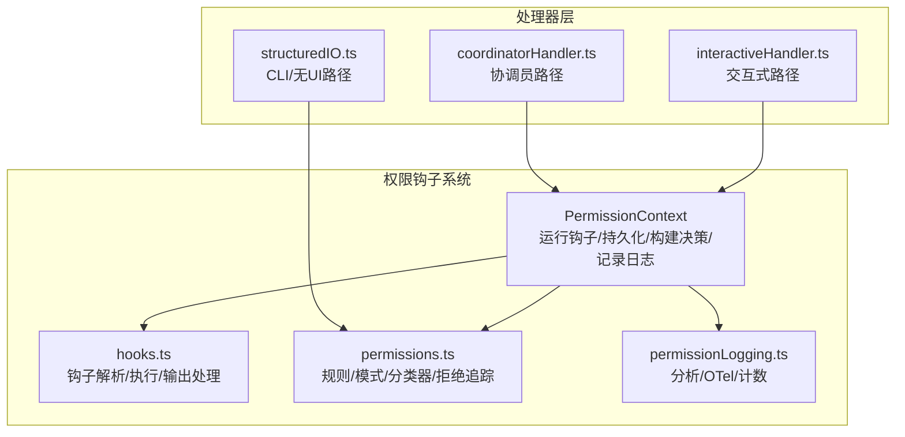
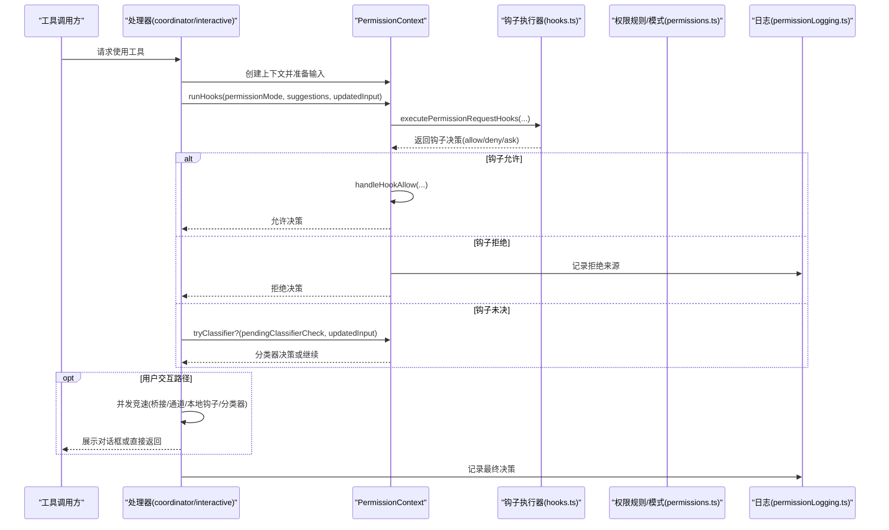
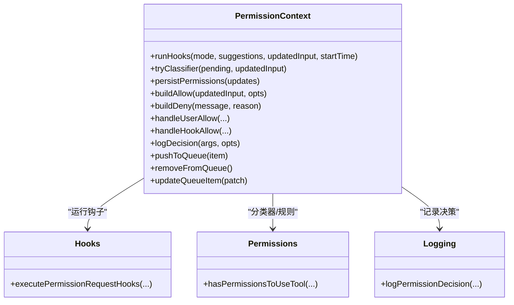
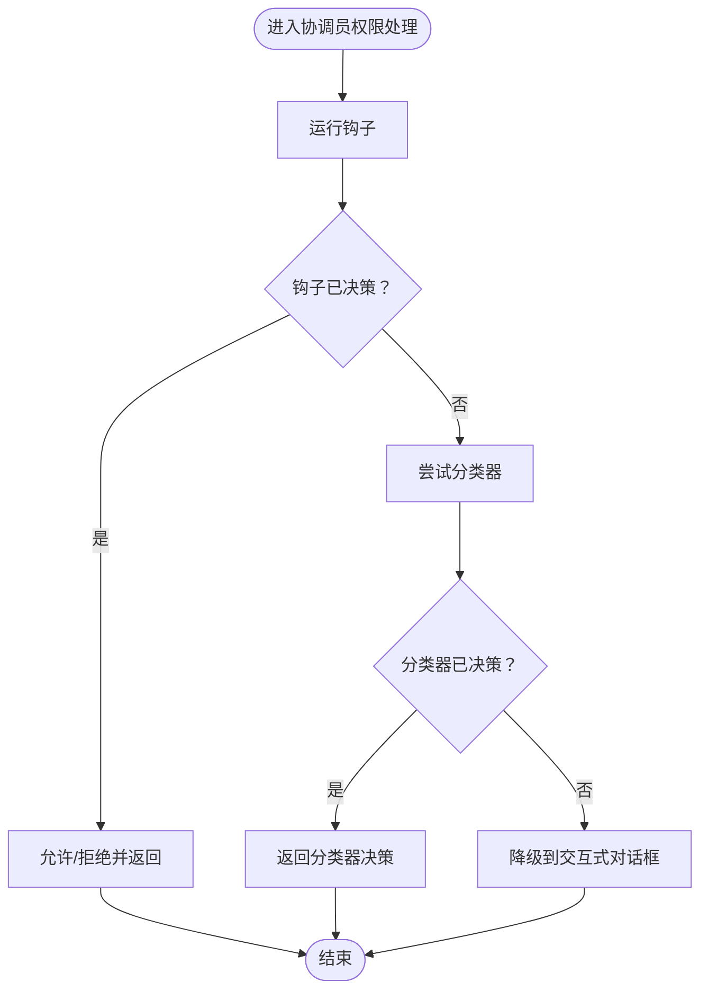
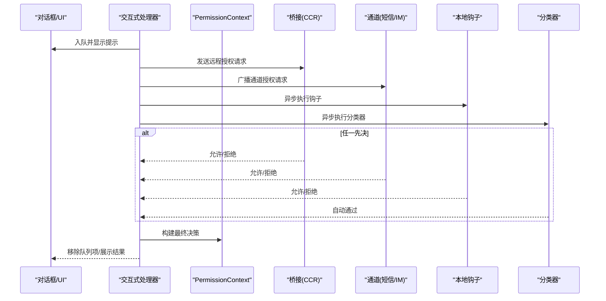
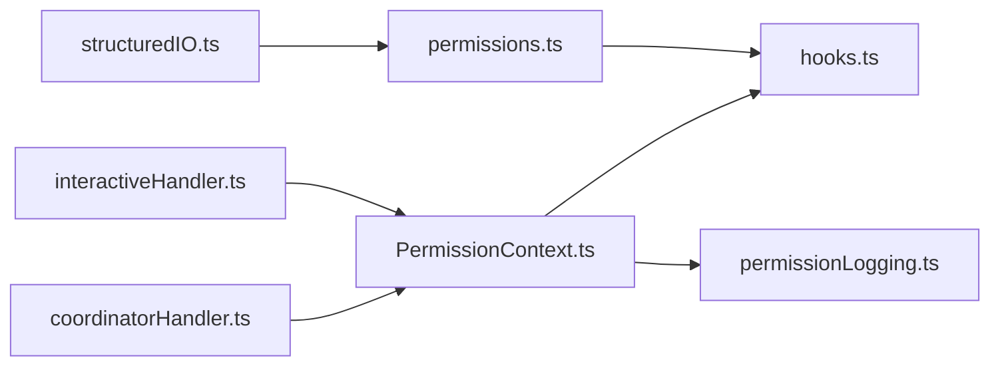

# 权限钩子系统

<cite>
**本文引用的文件**
- [coordinatorHandler.ts](file://src/hooks/toolPermission/handlers/coordinatorHandler.ts)
- [interactiveHandler.ts](file://src/hooks/toolPermission/handlers/interactiveHandler.ts)
- [PermissionContext.ts](file://src/hooks/toolPermission/PermissionContext.ts)
- [permissionLogging.ts](file://src/hooks/toolPermission/permissionLogging.ts)
- [hooks.ts](file://src/utils/hooks.ts)
- [permissions.ts](file://src/utils/permissions/permissions.ts)
- [PermissionResult.ts](file://src/utils/permissions/PermissionResult.ts)
- [PermissionUpdateSchema.ts](file://src/utils/permissions/PermissionUpdateSchema.ts)
- [structuredIO.ts](file://src/cli/structuredIO.ts)
</cite>

## 目录
1. [引言](#引言)
2. [项目结构](#项目结构)
3. [核心组件](#核心组件)
4. [架构总览](#架构总览)
5. [详细组件分析](#详细组件分析)
6. [依赖关系分析](#依赖关系分析)
7. [性能考量](#性能考量)
8. [故障排查指南](#故障排查指南)
9. [结论](#结论)
10. [附录](#附录)

## 引言
本文件系统性阐述 Claude Code 的“权限钩子”（Permission Hooks）体系：从架构设计、执行机制到与权限系统的集成方式，覆盖协调员处理器、交互式处理器与群组工作者处理器三类路径，并给出注册、执行、结果处理与错误处理的完整流程图解与参考路径，帮助初学者快速理解，同时为高级用户提供自定义钩子开发与集成的实践指导。

## 项目结构
权限钩子位于工具权限检查流水线的关键节点，围绕以下模块协同工作：
- 工具权限上下文与决策：PermissionContext 负责运行钩子、持久化权限更新、构建允许/拒绝决策、记录日志与指标。
- 钩子执行器：hooks.ts 提供统一的钩子解析、校验、执行与输出处理能力，支持命令型、HTTP 型与回调型钩子。
- 权限规则与模式：permissions.ts 提供规则解析、模式判断、自动模式分类器、拒绝追踪等能力。
- 处理器层：coordinatorHandler.ts 与 interactiveHandler.ts 分别面向协调员与交互式主代理场景，组织自动化检查（钩子+分类器）与用户对话框的竞速与降级逻辑。
- 日志与指标：permissionLogging.ts 统一采集分析事件、OTel 指标与代码编辑工具计数。
- CLI 场景：structuredIO.ts 提供无 UI 环境下的权限请求钩子执行与决策回传。

**图表来源**
- [PermissionContext.ts:1-390](file://src/hooks/toolPermission/PermissionContext.ts#L1-L390)
- [hooks.ts:1-800](file://src/utils/hooks.ts#L1-L800)
- [permissions.ts:1-800](file://src/utils/permissions/permissions.ts#L1-L800)
- [permissionLogging.ts:1-240](file://src/hooks/toolPermission/permissionLogging.ts#L1-L240)
- [coordinatorHandler.ts:1-67](file://src/hooks/toolPermission/handlers/coordinatorHandler.ts#L1-L67)
- [interactiveHandler.ts:1-538](file://src/hooks/toolPermission/handlers/interactiveHandler.ts#L1-L538)
- [structuredIO.ts:568-859](file://src/cli/structuredIO.ts#L568-L859)

**章节来源**
- [PermissionContext.ts:1-390](file://src/hooks/toolPermission/PermissionContext.ts#L1-L390)
- [hooks.ts:1-800](file://src/utils/hooks.ts#L1-L800)
- [permissions.ts:1-800](file://src/utils/permissions/permissions.ts#L1-L800)
- [permissionLogging.ts:1-240](file://src/hooks/toolPermission/permissionLogging.ts#L1-L240)
- [coordinatorHandler.ts:1-67](file://src/hooks/toolPermission/handlers/coordinatorHandler.ts#L1-L67)
- [interactiveHandler.ts:1-538](file://src/hooks/toolPermission/handlers/interactiveHandler.ts#L1-L538)
- [structuredIO.ts:568-859](file://src/cli/structuredIO.ts#L568-L859)

## 核心组件
- 权限上下文（PermissionContext）
  - 职责：封装一次工具使用前的权限检查上下文；负责运行钩子、尝试分类器、持久化权限更新、构建允许/拒绝决策、记录日志与指标。
  - 关键方法：runHooks、tryClassifier、persistPermissions、buildAllow、buildDeny、handleUserAllow、handleHookAllow、logDecision、pushToQueue/removeFromQueue/updateQueueItem。
  - 参考路径：[PermissionContext.ts:96-347](file://src/hooks/toolPermission/PermissionContext.ts#L96-L347)

- 钩子执行器（hooks.ts）
  - 职责：解析钩子配置、执行命令/HTTP/回调型钩子、校验输出 JSON、提取权限决策、阻断错误、异步钩子后台执行与唤醒。
  - 关键能力：executePermissionRequestHooks（生成器）、parseHookOutput、processHookJSONOutput、execCommandHook、execHttpHook、registerPendingAsyncHook。
  - 参考路径：[hooks.ts:389-737](file://src/utils/hooks.ts#L389-L737)

- 权限规则与模式（permissions.ts）
  - 职责：解析规则、匹配工具/代理、计算 ask/allow/deny、自动模式分类器、拒绝追踪与降级策略。
  - 关键能力：hasPermissionsToUseTool、toolAlwaysAllowedRule、getDenyRuleForTool、getAskRuleForTool、runPermissionRequestHooksForHeadlessAgent、classifyYoloAction。
  - 参考路径：[permissions.ts:392-471](file://src/utils/permissions/permissions.ts#L392-L471)

- 处理器（coordinatorHandler.ts / interactiveHandler.ts）
  - 协调员处理器：顺序等待钩子与分类器，失败时降级到交互式对话。
  - 交互式处理器：并发竞速桥接远程授权、通道授权、本地钩子与分类器，以及用户交互，原子性地决定最终结果。
  - 参考路径：[coordinatorHandler.ts:26-62](file://src/hooks/toolPermission/handlers/coordinatorHandler.ts#L26-L62)，[interactiveHandler.ts:57-531](file://src/hooks/toolPermission/handlers/interactiveHandler.ts#L57-L531)

- 日志与指标（permissionLogging.ts）
  - 职责：统一记录批准/拒绝事件，区分来源（钩子/用户/分类器/配置），并上报分析与 OTel 指标。
  - 参考路径：[permissionLogging.ts:181-235](file://src/hooks/toolPermission/permissionLogging.ts#L181-L235)

**章节来源**
- [PermissionContext.ts:96-347](file://src/hooks/toolPermission/PermissionContext.ts#L96-L347)
- [hooks.ts:389-737](file://src/utils/hooks.ts#L389-L737)
- [permissions.ts:392-471](file://src/utils/permissions/permissions.ts#L392-L471)
- [coordinatorHandler.ts:26-62](file://src/hooks/toolPermission/handlers/coordinatorHandler.ts#L26-L62)
- [interactiveHandler.ts:57-531](file://src/hooks/toolPermission/handlers/interactiveHandler.ts#L57-L531)
- [permissionLogging.ts:181-235](file://src/hooks/toolPermission/permissionLogging.ts#L181-L235)

## 架构总览
权限钩子系统在“工具使用前”的关键点插入可编程的检查与决策能力，形成“规则/模式→钩子→分类器→用户对话框”的多层防护与自动化路径。处理器根据运行环境选择最优路径，确保安全与可用性的平衡。

**图表来源**
- [coordinatorHandler.ts:26-62](file://src/hooks/toolPermission/handlers/coordinatorHandler.ts#L26-L62)
- [interactiveHandler.ts:57-531](file://src/hooks/toolPermission/handlers/interactiveHandler.ts#L57-L531)
- [PermissionContext.ts:216-263](file://src/hooks/toolPermission/PermissionContext.ts#L216-L263)
- [hooks.ts:389-737](file://src/utils/hooks.ts#L389-L737)
- [permissions.ts:392-471](file://src/utils/permissions/permissions.ts#L392-L471)
- [permissionLogging.ts:181-235](file://src/hooks/toolPermission/permissionLogging.ts#L181-L235)

## 详细组件分析

### 权限上下文（PermissionContext）
- 注册与执行
  - runHooks：按序遍历钩子生成器，遇到允许/拒绝即短路返回；支持超时与中断信号。
  - tryClassifier：仅 Bash 工具在具备分类器特性时触发，返回自动决策。
  - persistPermissions：持久化钩子建议的权限更新，同步到应用状态。
- 结果构建
  - buildAllow/buildDeny：构造最终决策对象，携带 updatedInput、decisionReason、contentBlocks 等。
  - handleUserAllow/handleHookAllow：分别处理用户确认与钩子允许后的收尾（持久化、日志、指标）。
- 队列与 UI 同步
  - pushToQueue/removeFromQueue/updateQueueItem：在交互式路径中管理对话框队列状态。
- 参考路径
  - [PermissionContext.ts:216-347](file://src/hooks/toolPermission/PermissionContext.ts#L216-L347)

**图表来源**
- [PermissionContext.ts:216-347](file://src/hooks/toolPermission/PermissionContext.ts#L216-L347)
- [hooks.ts:389-737](file://src/utils/hooks.ts#L389-L737)
- [permissions.ts:473-800](file://src/utils/permissions/permissions.ts#L473-L800)
- [permissionLogging.ts:181-235](file://src/hooks/toolPermission/permissionLogging.ts#L181-L235)

**章节来源**
- [PermissionContext.ts:216-347](file://src/hooks/toolPermission/PermissionContext.ts#L216-L347)

### 协调员处理器（coordinatorHandler）
- 执行时机：协调员工作线程在工具调用前先运行自动化检查（钩子→分类器），若均未决则降级到交互式对话。
- 关键流程：
  - 调用 ctx.runHooks 获取钩子决策；
  - 若未决，按需调用 ctx.tryClassifier；
  - 异常时记录日志并降级到对话框。
- 参考路径
  - [coordinatorHandler.ts:26-62](file://src/hooks/toolPermission/handlers/coordinatorHandler.ts#L26-L62)

**图表来源**
- [coordinatorHandler.ts:26-62](file://src/hooks/toolPermission/handlers/coordinatorHandler.ts#L26-L62)

**章节来源**
- [coordinatorHandler.ts:26-62](file://src/hooks/toolPermission/handlers/coordinatorHandler.ts#L26-L62)

### 交互式处理器（interactiveHandler）
- 执行时机：主代理交互式路径，同时并发竞速多个授权来源（桥接远程、通道授权、本地钩子、分类器）。
- 关键流程：
  - 将待确认项入队，设置 UI 指示与交互回调；
  - 并发启动桥接请求与通道通知；
  - 异步运行本地钩子与 Bash 分类器；
  - 使用原子性 resolveOnce 保证唯一决议，避免竞态；
  - 支持 recheckPermission 动态刷新权限状态。
- 参考路径
  - [interactiveHandler.ts:57-531](file://src/hooks/toolPermission/handlers/interactiveHandler.ts#L57-L531)

**图表来源**
- [interactiveHandler.ts:57-531](file://src/hooks/toolPermission/handlers/interactiveHandler.ts#L57-L531)
- [PermissionContext.ts:216-347](file://src/hooks/toolPermission/PermissionContext.ts#L216-L347)

**章节来源**
- [interactiveHandler.ts:57-531](file://src/hooks/toolPermission/handlers/interactiveHandler.ts#L57-L531)

### CLI/无 UI 场景（structuredIO）
- 执行时机：SDK/无界面环境，无法弹出对话框，需由钩子先行做出允许/拒绝决策。
- 关键流程：
  - 以异步生成器方式运行 PermissionRequest 钩子；
  - 钩子返回允许/拒绝即终止，否则回退到自动拒绝；
  - 支持钩子提供的 updatedPermissions 与 updatedInput。
- 参考路径
  - [structuredIO.ts:568-859](file://src/cli/structuredIO.ts#L568-L859)

**章节来源**
- [structuredIO.ts:568-859](file://src/cli/structuredIO.ts#L568-L859)

### 钩子注册与执行机制
- 注册
  - 钩子来源于会话配置快照与插件/技能匹配器，按事件类型筛选；
  - 支持命令型、HTTP 型与回调型钩子，统一通过 executePermissionRequestHooks 运行。
- 执行
  - 输出严格遵循 JSON Schema，支持同步与异步两种响应；
  - 解析后提取 permissionRequestResult 决策、updatedInput、updatedPermissions 等字段。
- 错误处理
  - 钩子异常会被捕获并记录，不中断整体流程；
  - 对于非 Error 抛出，会附加上下文前缀以便追踪。
- 参考路径
  - [hooks.ts:389-737](file://src/utils/hooks.ts#L389-L737)

**章节来源**
- [hooks.ts:389-737](file://src/utils/hooks.ts#L389-L737)

### 权限规则与分类器
- 规则匹配
  - 支持 allow/deny/ask 三种行为，按来源（用户/项目/本地/会话/命令行）聚合；
  - 工具名匹配支持 MCP 服务器级规则与通配符。
- 自动模式分类器
  - 在 auto/plan 模式下，对安全敏感操作进行自动审批/拒绝；
  - 支持 acceptEdits 快速路径与安全白名单优化。
- 参考路径
  - [permissions.ts:122-302](file://src/utils/permissions/permissions.ts#L122-L302)
  - [permissions.ts:518-800](file://src/utils/permissions/permissions.ts#L518-L800)

**章节来源**
- [permissions.ts:122-302](file://src/utils/permissions/permissions.ts#L122-L302)
- [permissions.ts:518-800](file://src/utils/permissions/permissions.ts#L518-L800)

## 依赖关系分析
- 组件耦合
  - PermissionContext 与 hooks.ts、permissions.ts、permissionLogging.ts 强耦合，承担“运行钩子→决策→记录”的核心职责。
  - 处理器层（coordinatorHandler/interactiveHandler/structuredIO）通过 ctx.runHooks/tryClassifier 与上下文解耦。
- 外部依赖
  - 分类器（Bash/Transcript）与自动模式（YOLO）在特性开关开启时参与决策。
  - 桥接（Bridge）与通道（Channel）用于远程授权与多端联动。
- 循环依赖规避
  - 类型与 Schema 通过延迟加载（lazySchema）与拆分避免循环导入。

**图表来源**
- [coordinatorHandler.ts:1-67](file://src/hooks/toolPermission/handlers/coordinatorHandler.ts#L1-L67)
- [interactiveHandler.ts:1-538](file://src/hooks/toolPermission/handlers/interactiveHandler.ts#L1-L538)
- [structuredIO.ts:568-859](file://src/cli/structuredIO.ts#L568-L859)
- [PermissionContext.ts:1-390](file://src/hooks/toolPermission/PermissionContext.ts#L1-L390)
- [hooks.ts:1-800](file://src/utils/hooks.ts#L1-L800)
- [permissions.ts:1-800](file://src/utils/permissions/permissions.ts#L1-L800)
- [permissionLogging.ts:1-240](file://src/hooks/toolPermission/permissionLogging.ts#L1-L240)

**章节来源**
- [coordinatorHandler.ts:1-67](file://src/hooks/toolPermission/handlers/coordinatorHandler.ts#L1-L67)
- [interactiveHandler.ts:1-538](file://src/hooks/toolPermission/handlers/interactiveHandler.ts#L1-L538)
- [structuredIO.ts:568-859](file://src/cli/structuredIO.ts#L568-L859)
- [PermissionContext.ts:1-390](file://src/hooks/toolPermission/PermissionContext.ts#L1-L390)
- [hooks.ts:1-800](file://src/utils/hooks.ts#L1-L800)
- [permissions.ts:1-800](file://src/utils/permissions/permissions.ts#L1-L800)
- [permissionLogging.ts:1-240](file://src/hooks/toolPermission/permissionLogging.ts#L1-L240)

## 性能考量
- 并发与竞速
  - 交互式路径并发启动桥接、通道、本地钩子与分类器，缩短等待时间，原子性决议避免重复执行。
- 分类器优化
  - acceptEdits 快速路径与安全白名单减少昂贵 API 调用；
  - 自动模式下仅对高风险操作启用分类器，其余走快速路径。
- I/O 与内存
  - 异步钩子后台执行，避免阻塞主线程；任务输出缓冲与流式处理降低内存峰值。
- 参考路径
  - [interactiveHandler.ts:410-531](file://src/hooks/toolPermission/handlers/interactiveHandler.ts#L410-L531)
  - [permissions.ts:600-686](file://src/utils/permissions/permissions.ts#L600-L686)

[本节为通用性能讨论，无需列出具体文件来源]

## 故障排查指南
- 钩子输出格式错误
  - 现象：钩子输出非 JSON 或字段不符合 Schema。
  - 处理：查看 hooks.ts 中的输出解析与验证逻辑，修正钩子输出。
  - 参考路径：[hooks.ts:382-451](file://src/utils/hooks.ts#L382-L451)
- 钩子异常
  - 现象：钩子抛出异常或非 Error 对象。
  - 处理：coordinatorHandler/interactiveHandler 会记录日志并降级到对话框；structuredIO 会记录错误并回退拒绝。
  - 参考路径：[coordinatorHandler.ts:47-57](file://src/hooks/toolPermission/handlers/coordinatorHandler.ts#L47-L57)，[interactiveHandler.ts:523-529](file://src/hooks/toolPermission/handlers/interactiveHandler.ts#L523-L529)，[structuredIO.ts:844-854](file://src/cli/structuredIO.ts#L844-L854)
- 分类器不可用
  - 现象：自动模式下分类器不可用或失败。
  - 处理：permissions.ts 中有失败关闭与降级策略，必要时回退到交互式确认。
  - 参考路径：[permissions.ts:518-548](file://src/utils/permissions/permissions.ts#L518-L548)
- 决策来源追踪
  - 现象：需要定位某次决策的来源（钩子/用户/分类器/配置）。
  - 处理：permissionLogging.ts 统一记录并区分来源标签，便于审计与分析。
  - 参考路径：[permissionLogging.ts:107-176](file://src/hooks/toolPermission/permissionLogging.ts#L107-L176)

**章节来源**
- [hooks.ts:382-451](file://src/utils/hooks.ts#L382-L451)
- [coordinatorHandler.ts:47-57](file://src/hooks/toolPermission/handlers/coordinatorHandler.ts#L47-L57)
- [interactiveHandler.ts:523-529](file://src/hooks/toolPermission/handlers/interactiveHandler.ts#L523-L529)
- [structuredIO.ts:844-854](file://src/cli/structuredIO.ts#L844-L854)
- [permissions.ts:518-548](file://src/utils/permissions/permissions.ts#L518-L548)
- [permissionLogging.ts:107-176](file://src/hooks/toolPermission/permissionLogging.ts#L107-L176)

## 结论
权限钩子系统通过“规则/模式→钩子→分类器→对话框”的多层路径，在不同运行环境下提供一致的安全保障与用户体验。PermissionContext 作为核心编排单元，结合 hooks.ts 的强大执行与校验能力、permissions.ts 的规则与自动模式决策，以及交互式/协调员/CLI 三类处理器的差异化适配，实现了可扩展、可观测、可降级的权限控制闭环。

[本节为总结性内容，无需列出具体文件来源]

## 附录

### 权限钩子类型与用途
- PermissionRequest 钩子
  - 用途：在工具使用前提供允许/拒绝决策，可附带 updatedInput 与 updatedPermissions。
  - 输出字段：decision（allow/deny）、updatedInput、updatedPermissions。
  - 参考路径：[hooks.ts:121-134](file://src/utils/hooks.ts#L121-L134)，[PermissionResult.ts:1-37](file://src/utils/permissions/PermissionResult.ts#L1-L37)

**章节来源**
- [hooks.ts:121-134](file://src/utils/hooks.ts#L121-L134)
- [PermissionResult.ts:1-37](file://src/utils/permissions/PermissionResult.ts#L1-L37)

### 权限更新与持久化
- 更新类型
  - addRules/replaceRules/removeRules、setMode、addDirectories/removeDirectories。
- 目的地
  - userSettings/projectSettings/localSettings/session/cliArg。
- 参考路径
  - [PermissionUpdateSchema.ts:24-78](file://src/utils/permissions/PermissionUpdateSchema.ts#L24-L78)

**章节来源**
- [PermissionUpdateSchema.ts:24-78](file://src/utils/permissions/PermissionUpdateSchema.ts#L24-L78)

### 示例参考路径（不含代码内容）
- 定义与注册钩子
  - [hooks.ts:389-737](file://src/utils/hooks.ts#L389-L737)
- 执行钩子（生成器）
  - [PermissionContext.ts:216-263](file://src/hooks/toolPermission/PermissionContext.ts#L216-L263)
- 处理器路径（协调员）
  - [coordinatorHandler.ts:26-62](file://src/hooks/toolPermission/handlers/coordinatorHandler.ts#L26-L62)
- 处理器路径（交互式）
  - [interactiveHandler.ts:57-531](file://src/hooks/toolPermission/handlers/interactiveHandler.ts#L57-L531)
- CLI/无 UI 路径
  - [structuredIO.ts:568-859](file://src/cli/structuredIO.ts#L568-L859)
- 权限规则与模式
  - [permissions.ts:122-302](file://src/utils/permissions/permissions.ts#L122-L302)
  - [permissions.ts:518-800](file://src/utils/permissions/permissions.ts#L518-L800)
- 日志与指标
  - [permissionLogging.ts:181-235](file://src/hooks/toolPermission/permissionLogging.ts#L181-L235)