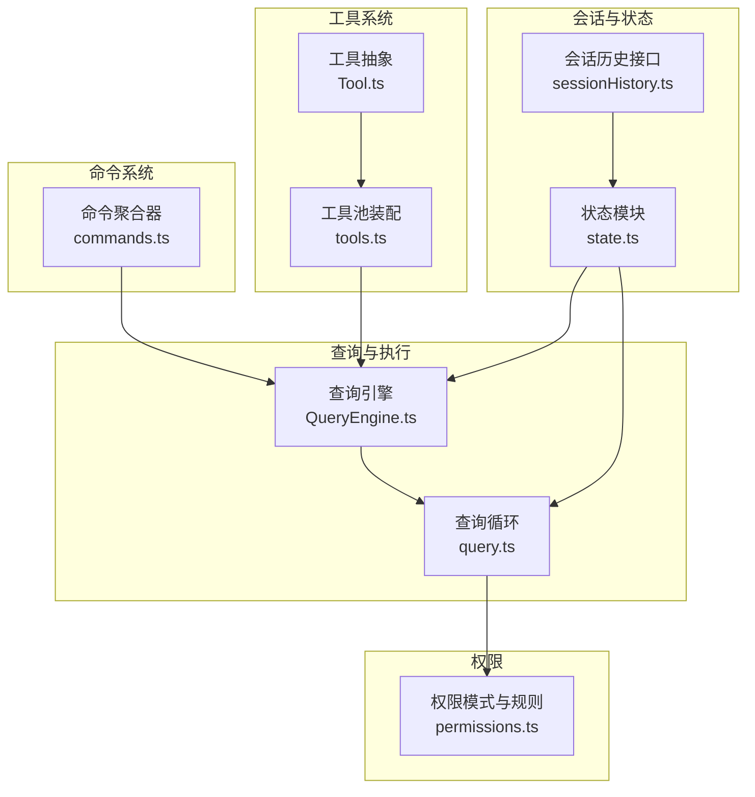
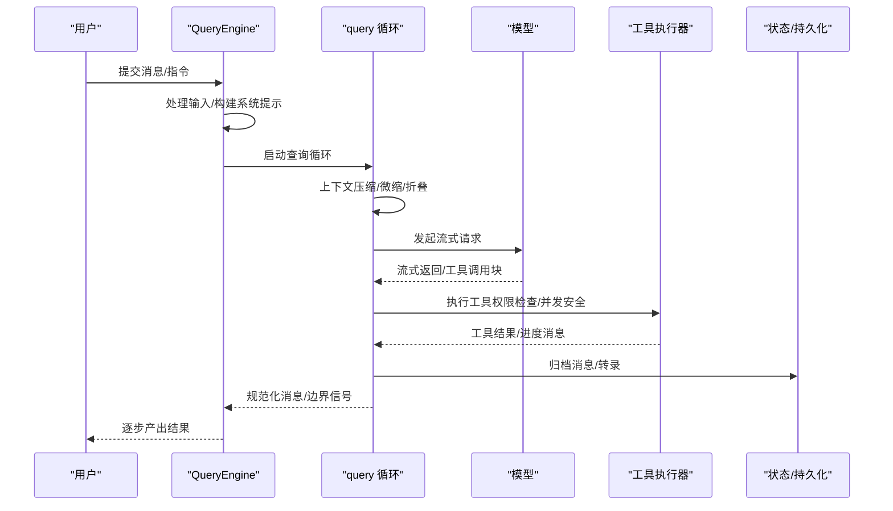
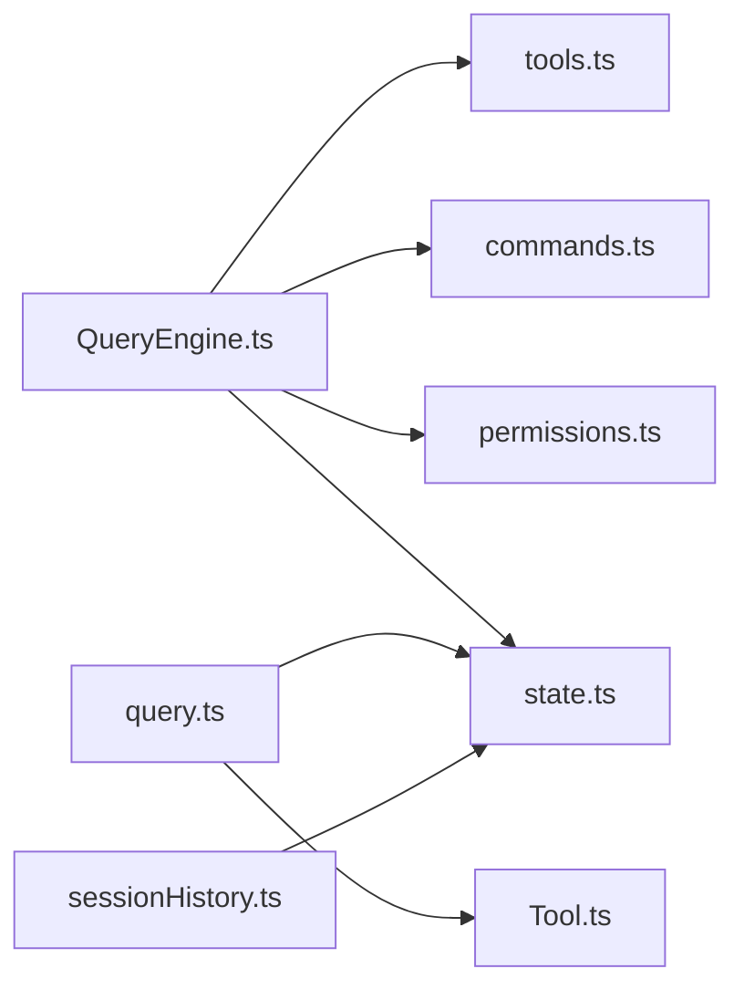

# 核心概念

<cite>
**本文引用的文件**
- [QueryEngine.ts](file://src/QueryEngine.ts)
- [query.ts](file://src/query.ts)
- [Tool.ts](file://src/Tool.ts)
- [tools.ts](file://src/tools.ts)
- [commands.ts](file://src/commands.ts)
- [Task.ts](file://src/Task.ts)
- [state.ts](file://src/bootstrap/state.ts)
- [permissions.ts](file://src/types/permissions.ts)
- [sessionHistory.ts](file://src/assistant/sessionHistory.ts)
</cite>

## 目录
1. [引言](#引言)
2. [项目结构](#项目结构)
3. [核心组件](#核心组件)
4. [架构总览](#架构总览)
5. [详细组件分析](#详细组件分析)
6. [依赖关系分析](#依赖关系分析)
7. [性能考量](#性能考量)
8. [故障排查指南](#故障排查指南)
9. [结论](#结论)
10. [附录](#附录)

## 引言
本文件面向 Claude Code 的“核心概念”，系统化阐述以下主题：
- 命令系统与工具系统的区别与联系
- 权限控制模型的设计理念与运行机制
- 会话管理与状态持久化
- QueryEngine 的工作原理、工具生命周期与消息传递机制
- Agent 模式、团队协作与多代理编排
- 并辅以来自源码的路径级示例，帮助初学者建立概念理解，同时为高级用户提供实现细节参考。

## 项目结构
从整体上看，系统围绕“会话—查询—工具—权限”四条主线展开：
- 会话与状态：通过全局状态模块维护会话 ID、目录、成本与用量、交互时间等；会话切换与持久化由会话历史接口支撑。
- 命令系统：以“技能/命令”为核心，支持动态加载、过滤与可用性校验，覆盖本地/插件/MCP 等来源。
- 工具系统：统一抽象为 Tool 接口，内置 Bash、文件读写、搜索、网络检索、任务与团队协作等工具，并支持 MCP 扩展。
- 查询引擎：QueryEngine 将用户输入、系统提示、工具与权限整合，驱动 query 循环，完成上下文压缩、流式调用、工具执行与消息归档。

图示来源
- [state.ts:1-120](file://src/bootstrap/state.ts#L1-L120)
- [sessionHistory.ts:1-90](file://src/assistant/sessionHistory.ts#L1-L90)
- [commands.ts:259-348](file://src/commands.ts#L259-L348)
- [tools.ts:193-251](file://src/tools.ts#L193-L251)
- [Tool.ts:362-473](file://src/Tool.ts#L362-L473)
- [QueryEngine.ts:184-207](file://src/QueryEngine.ts#L184-L207)
- [query.ts:219-239](file://src/query.ts#L219-L239)
- [permissions.ts:16-443](file://src/types/permissions.ts#L16-L443)

章节来源
- [state.ts:1-120](file://src/bootstrap/state.ts#L1-L120)
- [sessionHistory.ts:1-90](file://src/assistant/sessionHistory.ts#L1-L90)
- [commands.ts:259-348](file://src/commands.ts#L259-L348)
- [tools.ts:193-251](file://src/tools.ts#L193-L251)
- [Tool.ts:362-473](file://src/Tool.ts#L362-L473)
- [QueryEngine.ts:184-207](file://src/QueryEngine.ts#L184-L207)
- [query.ts:219-239](file://src/query.ts#L219-L239)
- [permissions.ts:16-443](file://src/types/permissions.ts#L16-L443)

## 核心组件
- QueryEngine：承载一次对话的生命周期与会话状态，负责系统提示构建、工具与命令装配、权限包装、消息归档与结果产出。
- query 循环：在单次 turn 内协调上下文压缩（自动/微缩）、模型调用、工具执行、消息规范化与持久化。
- Tool 抽象：统一工具的输入/输出、并发安全、只读/破坏性、权限检查、进度渲染、摘要生成等能力。
- 工具池装配：根据权限上下文与环境特性组装内置与 MCP 工具，去重与排序稳定提示缓存。
- 命令系统：统一管理技能/命令，支持动态发现、可用性过滤与远程安全命令白名单。
- 权限模型：以模式与规则为中心，结合自动化分类器与交互式弹窗，实现“允许/询问/拒绝”的决策闭环。
- 会话与持久化：全局状态维护会话标识与统计，会话历史接口提供事件分页拉取，QueryEngine 在关键节点写入转录。

章节来源
- [QueryEngine.ts:184-207](file://src/QueryEngine.ts#L184-L207)
- [query.ts:219-239](file://src/query.ts#L219-L239)
- [Tool.ts:362-473](file://src/Tool.ts#L362-L473)
- [tools.ts:193-251](file://src/tools.ts#L193-L251)
- [commands.ts:478-520](file://src/commands.ts#L478-L520)
- [permissions.ts:16-443](file://src/types/permissions.ts#L16-L443)
- [state.ts:431-498](file://src/bootstrap/state.ts#L431-L498)
- [sessionHistory.ts:18-90](file://src/assistant/sessionHistory.ts#L18-L90)

## 架构总览
QueryEngine 作为会话主控制器，贯穿“输入处理—系统提示—工具与命令—权限—模型调用—工具执行—消息归档—结果产出”的完整链路。query 循环在 turn 级别组织上述步骤，并在必要时进行上下文压缩与恢复，保证长会话的稳定性与性能。

图示来源
- [QueryEngine.ts:209-236](file://src/QueryEngine.ts#L209-L236)
- [query.ts:241-251](file://src/query.ts#L241-L251)
- [query.ts:337-344](file://src/query.ts#L337-L344)
- [query.ts:659-708](file://src/query.ts#L659-L708)
- [state.ts:431-498](file://src/bootstrap/state.ts#L431-L498)

章节来源
- [QueryEngine.ts:209-236](file://src/QueryEngine.ts#L209-L236)
- [query.ts:241-251](file://src/query.ts#L241-L251)
- [query.ts:337-344](file://src/query.ts#L337-L344)
- [query.ts:659-708](file://src/query.ts#L659-L708)
- [state.ts:431-498](file://src/bootstrap/state.ts#L431-L498)

## 详细组件分析

### 命令系统与工具系统的区别与联系
- 区别
  - 命令系统（commands）：以“技能/命令”为主，强调可被模型调用或本地执行的能力单元，具备描述、来源、可用性与启用状态等属性。
  - 工具系统（tools）：以“可执行动作”为主，强调输入/输出、并发安全、权限检查、只读/破坏性、进度与渲染等工程化能力。
- 联系
  - 技能/命令可通过工具池装配进入系统提示，供模型选择调用；部分命令亦可直接在本地执行。
  - 动态技能与插件命令/技能共同构成命令集合，与工具集合在权限与可用性上协同过滤。

章节来源
- [commands.ts:259-348](file://src/commands.ts#L259-L348)
- [commands.ts:478-520](file://src/commands.ts#L478-L520)
- [tools.ts:193-251](file://src/tools.ts#L193-L251)
- [tools.ts:345-367](file://src/tools.ts#L345-L367)

### 权限控制模型的设计理念
- 模式与规则
  - 模式：外部可感知的模式集合（如默认、计划模式、绕过权限、不询问等），内部还包含自动与冒泡模式。
  - 规则：按来源（用户/项目/本地/策略/CLI/会话）定义“允许/询问/拒绝”的工具与内容匹配。
- 决策流程
  - 输入校验与工具匹配后，先走规则判定；若未命中或需要进一步评估，则可能触发异步分类器或交互式弹窗。
  - 决策结果携带原因与建议，便于追踪与修复。
- 运行时上下文
  - 权限上下文包含额外工作目录、总是允许/拒绝/询问规则集、是否可绕过弹窗等，贯穿工具调用与查询循环。

章节来源
- [permissions.ts:16-443](file://src/types/permissions.ts#L16-L443)
- [Tool.ts:123-148](file://src/Tool.ts#L123-L148)
- [query.ts:666-669](file://src/query.ts#L666-L669)

### 会话管理与状态持久化
- 会话标识与切换
  - 全局状态维护稳定的会话 ID、父会话 ID、项目根目录与会话项目目录；支持会话切换与信号回调。
- 统计与指标
  - 记录总成本、API 时长、工具时长、令牌用量、交互时间等，用于成本控制与性能分析。
- 持久化与转录
  - QueryEngine 在关键节点写入转录（包括紧凑边界与用户消息确认），并在必要时刷新存储以保证可恢复性。
- 会话历史接口
  - 提供最新事件与更旧事件分页拉取，支持基于 OAuth 的鉴权与组织维度访问。

章节来源
- [state.ts:431-498](file://src/bootstrap/state.ts#L431-L498)
- [state.ts:543-589](file://src/bootstrap/state.ts#L543-L589)
- [QueryEngine.ts:450-463](file://src/QueryEngine.ts#L450-L463)
- [QueryEngine.ts:716-732](file://src/QueryEngine.ts#L716-L732)
- [sessionHistory.ts:18-90](file://src/assistant/sessionHistory.ts#L18-L90)

### QueryEngine 的工作原理
- 生命周期与状态
  - 每个会话对应一个 QueryEngine 实例，提交消息即开启新 turn，消息、文件缓存、用量等跨 turn 持久。
- 系统提示与上下文
  - 动态拼装默认/自定义/附加系统提示，注入用户上下文与内存机制提示（当显式配置时）。
- 权限包装
  - 包装 canUseTool 以收集权限拒绝记录，用于 SDK 报告与审计。
- 工具与命令装配
  - 组合内置工具与 MCP 工具，按权限规则过滤与去重，保证提示缓存稳定。
- 本地命令与快照
  - 对本地命令输出进行标准化与合成助手消息，必要时对文件历史做快照。
- 结果产出
  - 通过系统初始化消息、紧凑边界、用户消息确认与最终结果消息，向调用方提供结构化输出。

章节来源
- [QueryEngine.ts:184-207](file://src/QueryEngine.ts#L184-L207)
- [QueryEngine.ts:286-325](file://src/QueryEngine.ts#L286-L325)
- [QueryEngine.ts:244-271](file://src/QueryEngine.ts#L244-L271)
- [QueryEngine.ts:540-551](file://src/QueryEngine.ts#L540-L551)
- [QueryEngine.ts:641-655](file://src/QueryEngine.ts#L641-L655)
- [QueryEngine.ts:675-751](file://src/QueryEngine.ts#L675-L751)

### 工具的生命周期与消息传递机制
- 生命周期阶段
  - 输入校验 → 权限检查 → 工具调用 → 进度/结果消息 → 渲染与索引 → 可选的摘要与分组渲染。
- 消息传递
  - 工具执行过程中产生进度消息与结果消息，QueryEngine 与 query 循环负责规范化与持久化；工具也可注入附件与系统消息。
- 并发与中断
  - 工具声明中断行为（取消/阻塞），并标注并发安全性，避免竞态与资源冲突。
- 渲染与可观察性
  - 工具提供活动描述、结果截断判断、标签渲染与错误/拒绝 UI，便于终端与 UI 层展示。

章节来源
- [Tool.ts:362-473](file://src/Tool.ts#L362-L473)
- [Tool.ts:508-580](file://src/Tool.ts#L508-L580)
- [Tool.ts:605-667](file://src/Tool.ts#L605-L667)
- [query.ts:748-787](file://src/query.ts#L748-L787)

### Agent 模式、团队协作与多代理编排
- Agent 模式
  - 支持计划模式与实现模式的切换，权限模式可在进入/退出时保存与恢复；Agent 类型与颜色映射由状态模块维护。
- 团队协作
  - 通过团队创建/删除工具与消息发送工具，实现跨代理的任务分配与通信；Task 抽象定义了任务类型、状态与清理逻辑。
- 多代理编排
  - 任务类型涵盖本地 Shell、本地/远程 Agent、进程内队友、工作流与监控等；任务 ID 采用带前缀的随机字符串，避免符号链接攻击风险。
- 编排要点
  - 通过工具池装配与权限上下文，确保不同角色 Agent 在同一会话中协同工作；消息与进度在会话中可被检索与回放。

章节来源
- [state.ts:110-112](file://src/bootstrap/state.ts#L110-L112)
- [tools.ts:63-72](file://src/tools.ts#L63-L72)
- [Task.ts:6-29](file://src/Task.ts#L6-L29)
- [Task.ts:72-76](file://src/Task.ts#L72-L76)
- [Task.ts:98-106](file://src/Task.ts#L98-L106)

## 依赖关系分析
- QueryEngine 依赖
  - 工具池（tools.ts）与命令集合（commands.ts）用于装配系统提示与工具列表。
  - 权限类型（permissions.ts）用于权限上下文与决策。
  - 全局状态（state.ts）用于会话 ID、用量统计与持久化开关。
- query 循环依赖
  - 工具抽象（Tool.ts）用于工具执行与进度管理。
  - 附件与内存预取、自动/微缩/折叠服务、令牌预算与停止钩子等模块参与 turn 内部流程。
- 会话历史
  - 通过 sessionHistory.ts 提供事件分页接口，配合状态模块实现会话检索与恢复。

图示来源
- [QueryEngine.ts:130-173](file://src/QueryEngine.ts#L130-L173)
- [tools.ts:193-251](file://src/tools.ts#L193-L251)
- [commands.ts:259-348](file://src/commands.ts#L259-L348)
- [permissions.ts:416-443](file://src/types/permissions.ts#L416-L443)
- [state.ts:431-498](file://src/bootstrap/state.ts#L431-L498)
- [query.ts:219-239](file://src/query.ts#L219-L239)
- [Tool.ts:362-473](file://src/Tool.ts#L362-L473)
- [sessionHistory.ts:18-90](file://src/assistant/sessionHistory.ts#L18-L90)

章节来源
- [QueryEngine.ts:130-173](file://src/QueryEngine.ts#L130-L173)
- [tools.ts:193-251](file://src/tools.ts#L193-L251)
- [commands.ts:259-348](file://src/commands.ts#L259-L348)
- [permissions.ts:416-443](file://src/types/permissions.ts#L416-L443)
- [state.ts:431-498](file://src/bootstrap/state.ts#L431-L498)
- [query.ts:219-239](file://src/query.ts#L219-L239)
- [Tool.ts:362-473](file://src/Tool.ts#L362-L473)
- [sessionHistory.ts:18-90](file://src/assistant/sessionHistory.ts#L18-L90)

## 性能考量
- 上下文压缩与折叠
  - 自动/微缩/折叠在 turn 级别减少令牌占用，避免阻断阈值导致的提前失败。
- 流式工具执行
  - 支持流式工具执行器，降低端到端延迟，同时在回退时清理孤儿消息与结果。
- 令牌预算与恢复
  - 令牌预算跟踪与恢复路径（如最大输出令牌错误的暂 withhold）提升长会话稳定性。
- 存储与转录
  - 关键节点写入转录并可选择立即刷新，平衡可恢复性与性能。

章节来源
- [query.ts:414-426](file://src/query.ts#L414-L426)
- [query.ts:454-543](file://src/query.ts#L454-L543)
- [query.ts:659-741](file://src/query.ts#L659-L741)
- [query.ts:788-800](file://src/query.ts#L788-L800)
- [QueryEngine.ts:450-463](file://src/QueryEngine.ts#L450-L463)

## 故障排查指南
- 权限相关
  - 若出现频繁“询问”或“拒绝”，检查权限模式与规则来源（用户/项目/本地/策略/CLI/会话），核对决策原因与建议。
- 工具执行异常
  - 查看工具的错误/拒绝 UI 与进度消息，确认输入校验、并发安全与权限检查是否通过。
- 会话恢复问题
  - 确认转录写入是否成功，必要时检查会话历史接口返回与分页参数。
- 长会话卡顿
  - 启用自动/微缩/折叠，检查令牌预算与恢复路径，避免阻断阈值触发。

章节来源
- [permissions.ts:241-267](file://src/types/permissions.ts#L241-L267)
- [Tool.ts:635-667](file://src/Tool.ts#L635-L667)
- [sessionHistory.ts:45-87](file://src/assistant/sessionHistory.ts#L45-L87)
- [query.ts:628-648](file://src/query.ts#L628-L648)

## 结论
本文件从系统架构、核心组件与实现细节三个层面梳理了 Claude Code 的核心概念。命令系统与工具系统相辅相成，权限模型贯穿执行全链路，QueryEngine 与 query 循环提供了稳健的会话与消息处理能力。借助状态模块与会话历史接口，系统实现了可恢复、可观测与可扩展的对话体验。对于团队协作与多代理编排，系统通过任务抽象与工具池装配提供了清晰的扩展点。

## 附录
- 示例路径（仅列出路径，不展示具体代码内容）
  - 命令系统装配与过滤：[commands.ts:259-348](file://src/commands.ts#L259-L348)，[commands.ts:478-520](file://src/commands.ts#L478-L520)
  - 工具抽象与生命周期：[Tool.ts:362-473](file://src/Tool.ts#L362-L473)，[Tool.ts:508-580](file://src/Tool.ts#L508-L580)
  - 工具池装配与去重：[tools.ts:193-251](file://src/tools.ts#L193-L251)，[tools.ts:345-367](file://src/tools.ts#L345-L367)
  - QueryEngine 初始化与消息归档：[QueryEngine.ts:184-207](file://src/QueryEngine.ts#L184-L207)，[QueryEngine.ts:450-463](file://src/QueryEngine.ts#L450-L463)
  - query 循环与流式工具执行：[query.ts:241-251](file://src/query.ts#L241-L251)，[query.ts:659-708](file://src/query.ts#L659-L708)
  - 权限模式与规则：[permissions.ts:16-443](file://src/types/permissions.ts#L16-L443)
  - 会话状态与历史接口：[state.ts:431-498](file://src/bootstrap/state.ts#L431-L498)，[sessionHistory.ts:18-90](file://src/assistant/sessionHistory.ts#L18-L90)
  - 任务抽象与编排：[Task.ts:6-29](file://src/Task.ts#L6-L29)，[Task.ts:72-76](file://src/Task.ts#L72-L76)，[Task.ts:98-106](file://src/Task.ts#L98-L106)