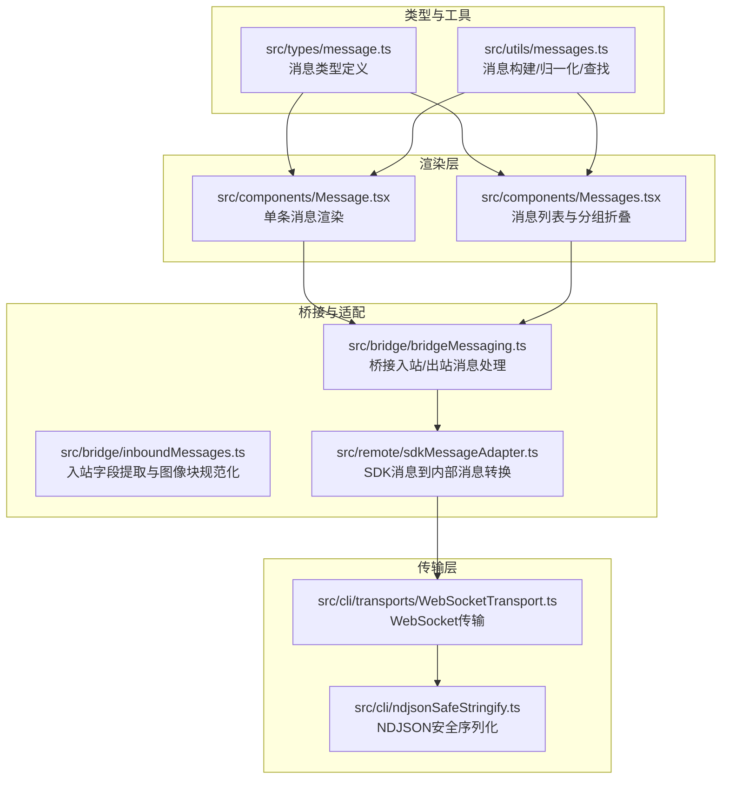
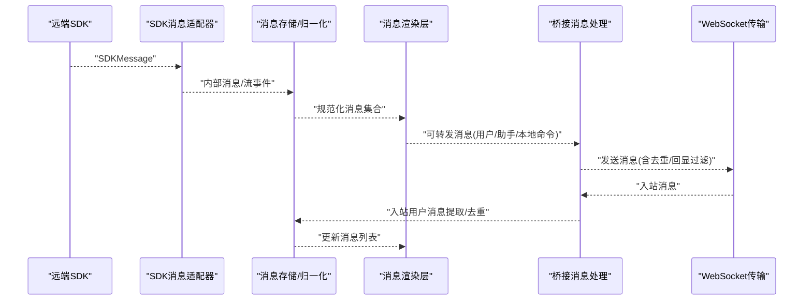
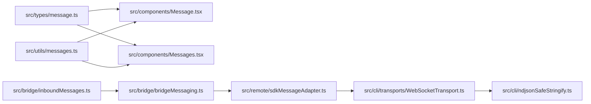

# 消息传递

<cite>
**本文引用的文件**
- [src/types/message.ts](file://src/types/message.ts)
- [src/components/Message.tsx](file://src/components/Message.tsx)
- [src/components/Messages.tsx](file://src/components/Messages.tsx)
- [src/bridge/bridgeMessaging.ts](file://src/bridge/bridgeMessaging.ts)
- [src/bridge/inboundMessages.ts](file://src/bridge/inboundMessages.ts)
- [src/remote/sdkMessageAdapter.ts](file://src/remote/sdkMessageAdapter.ts)
- [src/utils/messages.ts](file://src/utils/messages.ts)
- [src/cli/ndjsonSafeStringify.ts](file://src/cli/ndjsonSafeStringify.ts)
- [src/cli/transports/WebSocketTransport.ts](file://src/cli/transports/WebSocketTransport.ts)
</cite>

## 目录
1. [引言](#引言)
2. [项目结构](#项目结构)
3. [核心组件](#核心组件)
4. [架构总览](#架构总览)
5. [详细组件分析](#详细组件分析)
6. [依赖关系分析](#依赖关系分析)
7. [性能考量](#性能考量)
8. [故障排查指南](#故障排查指南)
9. [结论](#结论)
10. [附录](#附录)

## 引言
本文件系统性阐述 Claude Code 的消息传递机制，覆盖消息类型系统、格式规范与传输协议；解释消息在系统各组件间的路由、状态更新与事件通知；展示消息的序列化、反序列化与持久化处理；并通过图示与路径引用帮助初学者理解基本概念，同时为高级用户提供扩展与定制的实现细节。

## 项目结构
消息传递贯穿类型定义、渲染层、桥接层、远程适配层与传输层，形成“类型 → 渲染 → 路由/适配 → 传输”的完整链路。

图表来源
- [src/types/message.ts:1-416](file://src/types/message.ts#L1-L416)
- [src/utils/messages.ts:730-800](file://src/utils/messages.ts#L730-L800)
- [src/components/Message.tsx:1-628](file://src/components/Message.tsx#L1-L628)
- [src/components/Messages.tsx:1-835](file://src/components/Messages.tsx#L1-L835)
- [src/bridge/bridgeMessaging.ts:1-464](file://src/bridge/bridgeMessaging.ts#L1-L464)
- [src/bridge/inboundMessages.ts:1-83](file://src/bridge/inboundMessages.ts#L1-L83)
- [src/remote/sdkMessageAdapter.ts:1-304](file://src/remote/sdkMessageAdapter.ts#L1-L304)
- [src/cli/transports/WebSocketTransport.ts:60-100](file://src/cli/transports/WebSocketTransport.ts#L60-L100)
- [src/cli/ndjsonSafeStringify.ts:1-35](file://src/cli/ndjsonSafeStringify.ts#L1-L35)

章节来源
- [src/types/message.ts:1-416](file://src/types/message.ts#L1-L416)
- [src/utils/messages.ts:730-800](file://src/utils/messages.ts#L730-L800)
- [src/components/Message.tsx:1-628](file://src/components/Message.tsx#L1-L628)
- [src/components/Messages.tsx:1-835](file://src/components/Messages.tsx#L1-L835)
- [src/bridge/bridgeMessaging.ts:1-464](file://src/bridge/bridgeMessaging.ts#L1-L464)
- [src/bridge/inboundMessages.ts:1-83](file://src/bridge/inboundMessages.ts#L1-L83)
- [src/remote/sdkMessageAdapter.ts:1-304](file://src/remote/sdkMessageAdapter.ts#L1-L304)
- [src/cli/transports/WebSocketTransport.ts:60-100](file://src/cli/transports/WebSocketTransport.ts#L60-L100)
- [src/cli/ndjsonSafeStringify.ts:1-35](file://src/cli/ndjsonSafeStringify.ts#L1-L35)

## 核心组件
- 类型系统与格式规范
  - 内部消息类型：用户、助手、系统、附件、进度、聚合/折叠消息等，统一通过判别字段 type/subtype 约束。
  - 规范化消息：将多内容块拆分为单内容块消息，确保渲染与索引一致性。
  - 流式事件：封装来自 SDK 的流式事件，便于 UI 增量渲染。
- 渲染与交互
  - 单条消息渲染：根据内容块类型（文本/图片/工具调用/思考）选择对应组件。
  - 消息列表：支持分组、折叠、截断、虚拟滚动、搜索索引等。
- 桥接与适配
  - 入站消息处理：解析 SDK 消息、去重、过滤非用户消息、权限控制请求响应。
  - 入站字段提取：从桥接消息中抽取内容与 UUID，图像块规范化。
  - SDK 适配器：将远端 SDK 消息转换为内部消息，处理历史回放与工具结果渲染。
- 传输与序列化
  - WebSocket 传输：连接管理、心跳、重连、活动时间统计。
  - NDJSON 安全序列化：转义行终止符，保证逐行解析安全。

章节来源
- [src/types/message.ts:335-416](file://src/types/message.ts#L335-L416)
- [src/utils/messages.ts:730-800](file://src/utils/messages.ts#L730-L800)
- [src/components/Message.tsx:82-354](file://src/components/Message.tsx#L82-L354)
- [src/components/Messages.tsx:341-778](file://src/components/Messages.tsx#L341-L778)
- [src/bridge/bridgeMessaging.ts:132-208](file://src/bridge/bridgeMessaging.ts#L132-L208)
- [src/bridge/inboundMessages.ts:21-83](file://src/bridge/inboundMessages.ts#L21-L83)
- [src/remote/sdkMessageAdapter.ts:168-278](file://src/remote/sdkMessageAdapter.ts#L168-L278)
- [src/cli/transports/WebSocketTransport.ts:60-100](file://src/cli/transports/WebSocketTransport.ts#L60-L100)
- [src/cli/ndjsonSafeStringify.ts:18-32](file://src/cli/ndjsonSafeStringify.ts#L18-L32)

## 架构总览
消息在系统内的流转路径如下：

图表来源
- [src/remote/sdkMessageAdapter.ts:168-278](file://src/remote/sdkMessageAdapter.ts#L168-L278)
- [src/utils/messages.ts:730-800](file://src/utils/messages.ts#L730-L800)
- [src/components/Messages.tsx:341-778](file://src/components/Messages.tsx#L341-L778)
- [src/bridge/bridgeMessaging.ts:132-208](file://src/bridge/bridgeMessaging.ts#L132-L208)
- [src/cli/transports/WebSocketTransport.ts:60-100](file://src/cli/transports/WebSocketTransport.ts#L60-L100)

## 详细组件分析

### 类型系统与消息结构
- 消息类型
  - 用户消息：支持字符串或内容块数组，可携带工具结果、MCP 元数据、来源标记等。
  - 助手消息：封装模型返回的内容块（文本/工具调用/思考），支持错误与虚拟消息标记。
  - 系统消息：以 subtype 区分信息、API 错误、本地命令、钩子摘要、桥接状态、令牌用量、思考时长、内存保存、离线摘要、代理被杀、紧凑边界、微紧凑边界、权限重试、计划任务触发、API 指标等。
  - 附件消息：用于承载非显示或补充元数据。
  - 进度消息：用于工具执行的增量进度。
  - 聚合/折叠消息：用于 UI 展示优化。
- 判别字段与规范化
  - 统一使用 type/subtype 字段进行判别，避免运行时错误。
  - 归一化将多内容块拆分为单内容块消息，确保渲染与查找稳定。

章节来源
- [src/types/message.ts:26-342](file://src/types/message.ts#L26-L342)
- [src/types/message.ts:335-416](file://src/types/message.ts#L335-L416)

### 渲染机制与交互行为
- 单条消息渲染
  - 根据消息类型与内容块类型选择具体组件：文本、图片、工具调用、思考、工具结果、系统文本等。
  - 支持“仅摘要”模式、思维内容按需隐藏/展开、最新 Bash 输出自动展开等交互。
- 消息列表
  - 分组与折叠：对工具调用、只读搜索、后台 Bash 通知、钩子摘要、同伴关闭等进行折叠。
  - 截断与虚拟滚动：在长会话中限制渲染数量，使用锚点 UUID 控制切片，避免计数漂移。
  - 搜索索引：为工具结果与可检索文本建立缓存，提升搜索性能。
  - 可访问性与动画：根据工具使用状态与确认队列控制动画与进度条。

章节来源
- [src/components/Message.tsx:82-354](file://src/components/Message.tsx#L82-L354)
- [src/components/Messages.tsx:341-778](file://src/components/Messages.tsx#L341-L778)

### 桥接消息处理与路由
- 入站消息处理
  - 解析 SDK 消息，区分 control_response 与 control_request。
  - 回显与重复消息去重：基于最近发送/接收的 UUID 集合进行过滤。
  - 仅转发用户/助手与本地命令系统消息至桥接传输。
- 出站消息处理
  - 提取标题文本（去除显示标签与空内容）。
  - 构建最小成功响应，用于会话归档。
- 服务器控制请求
  - 对初始化、设置模型、设置最大思考令牌、设置权限模式、中断等请求进行快速响应，避免超时。

章节来源
- [src/bridge/bridgeMessaging.ts:132-208](file://src/bridge/bridgeMessaging.ts#L132-L208)
- [src/bridge/bridgeMessaging.ts:243-391](file://src/bridge/bridgeMessaging.ts#L243-L391)
- [src/bridge/bridgeMessaging.ts:399-416](file://src/bridge/bridgeMessaging.ts#L399-L416)

### 入站字段提取与图像块规范化
- 字段提取
  - 从 SDK 用户消息中提取内容与 UUID，跳过非用户类型与空内容。
- 图像块规范化
  - 处理移动端/网页客户端可能使用的驼峰命名 mediaType 或缺失字段问题，统一为标准字段，避免后续 API 调用失败。

章节来源
- [src/bridge/inboundMessages.ts:21-83](file://src/bridge/inboundMessages.ts#L21-L83)

### SDK 消息适配与历史回放
- 适配策略
  - 将 SDK 助手消息、部分事件与状态消息转换为内部消息；忽略不适用于 REPL 的事件。
  - 在直接连接模式下，将远端工具结果转换为本地可折叠渲染的用户消息。
- 历史回放
  - 支持将历史事件转换为用户消息以便展示，同时保留工具结果的匹配关系。

章节来源
- [src/remote/sdkMessageAdapter.ts:168-278](file://src/remote/sdkMessageAdapter.ts#L168-L278)

### 序列化、反序列化与传输
- 序列化
  - NDJSON 安全序列化：转义 U+2028/LINE SEPARATOR 与 U+2029/PARAGRAPH SEPARATOR，确保逐行解析安全。
- 反序列化
  - 入站消息解析：先标准化键名，再进行类型守卫与去重判断。
- 传输
  - WebSocket 传输：维护连接状态、心跳、重连与活动时间统计，避免代理空闲超时导致的异常断开。

章节来源
- [src/cli/ndjsonSafeStringify.ts:18-32](file://src/cli/ndjsonSafeStringify.ts#L18-L32)
- [src/bridge/bridgeMessaging.ts:140-208](file://src/bridge/bridgeMessaging.ts#L140-L208)
- [src/cli/transports/WebSocketTransport.ts:60-100](file://src/cli/transports/WebSocketTransport.ts#L60-L100)

### 消息创建与处理示例（路径引用）
- 创建用户消息
  - [createUserMessage:460-523](file://src/utils/messages.ts#L460-L523)
- 创建助手消息
  - [createAssistantMessage:411-433](file://src/utils/messages.ts#L411-L433)
- 创建进度消息
  - [createProgressMessage:603-620](file://src/utils/messages.ts#L603-L620)
- 归一化消息（多内容块拆分）
  - [normalizeMessages:730-800](file://src/utils/messages.ts#L730-L800)
- 单条消息渲染入口
  - [Message 组件 switch 分发:82-354](file://src/components/Message.tsx#L82-L354)
- 消息列表渲染与分组折叠
  - [Messages 组件主流程:341-778](file://src/components/Messages.tsx#L341-L778)
- 入站消息解析与去重
  - [handleIngressMessage:132-208](file://src/bridge/bridgeMessaging.ts#L132-L208)
- SDK 消息适配
  - [convertSDKMessage:168-278](file://src/remote/sdkMessageAdapter.ts#L168-L278)

## 依赖关系分析

图表来源
- [src/types/message.ts:1-416](file://src/types/message.ts#L1-L416)
- [src/utils/messages.ts:730-800](file://src/utils/messages.ts#L730-L800)
- [src/components/Message.tsx:1-628](file://src/components/Message.tsx#L1-L628)
- [src/components/Messages.tsx:1-835](file://src/components/Messages.tsx#L1-L835)
- [src/bridge/bridgeMessaging.ts:1-464](file://src/bridge/bridgeMessaging.ts#L1-L464)
- [src/bridge/inboundMessages.ts:1-83](file://src/bridge/inboundMessages.ts#L1-L83)
- [src/remote/sdkMessageAdapter.ts:1-304](file://src/remote/sdkMessageAdapter.ts#L1-L304)
- [src/cli/transports/WebSocketTransport.ts:60-100](file://src/cli/transports/WebSocketTransport.ts#L60-L100)
- [src/cli/ndjsonSafeStringify.ts:1-35](file://src/cli/ndjsonSafeStringify.ts#L1-L35)

章节来源
- [src/types/message.ts:1-416](file://src/types/message.ts#L1-L416)
- [src/utils/messages.ts:730-800](file://src/utils/messages.ts#L730-L800)
- [src/components/Message.tsx:1-628](file://src/components/Message.tsx#L1-L628)
- [src/components/Messages.tsx:1-835](file://src/components/Messages.tsx#L1-L835)
- [src/bridge/bridgeMessaging.ts:1-464](file://src/bridge/bridgeMessaging.ts#L1-L464)
- [src/bridge/inboundMessages.ts:1-83](file://src/bridge/inboundMessages.ts#L1-L83)
- [src/remote/sdkMessageAdapter.ts:1-304](file://src/remote/sdkMessageAdapter.ts#L1-L304)
- [src/cli/transports/WebSocketTransport.ts:60-100](file://src/cli/transports/WebSocketTransport.ts#L60-L100)
- [src/cli/ndjsonSafeStringify.ts:1-35](file://src/cli/ndjsonSafeStringify.ts#L1-L35)

## 性能考量
- 渲染性能
  - 虚拟滚动与截断：在长会话中限制渲染数量，使用锚点 UUID 控制切片，避免计数漂移带来的全屏重绘。
  - 消息分组与折叠：减少节点数量，降低布局与绘制成本。
  - 搜索索引缓存：对可检索文本进行小写缓存，降低输入搜索时的计算开销。
- 传输性能
  - NDJSON 安全序列化：避免逐行解析错误导致的丢包与重传。
  - 心跳与重连：维持连接健康，减少因代理空闲超时造成的频繁重建。
- 内存与 GC
  - 非虚拟化渲染路径设置上限，避免 Fiber 树过大引发 GC 压力。
  - 使用有界 UUID 集合进行回显与重复消息过滤，控制内存占用。

## 故障排查指南
- 入站消息解析失败
  - 检查是否为合法 SDK 消息，确认键名标准化与 JSON 解析是否成功。
  - 参考：[handleIngressMessage:140-208](file://src/bridge/bridgeMessaging.ts#L140-L208)
- 消息重复或回显
  - 确认最近发送/接收 UUID 集合是否正确维护，检查去重逻辑。
  - 参考：[BoundedUUIDSet:429-461](file://src/bridge/bridgeMessaging.ts#L429-L461)
- WebSocket 断连或频繁重连
  - 检查心跳与活动时间统计，确认代理空闲超时配置。
  - 参考：[WebSocketTransport:60-100](file://src/cli/transports/WebSocketTransport.ts#L60-L100)
- 工具结果未显示或无法折叠
  - 确认工具结果内容形状与工具名称匹配，检查归一化与查找映射。
  - 参考：[normalizeMessages:730-800](file://src/utils/messages.ts#L730-L800)
- NDJSON 行分割异常
  - 确保序列化时已转义行终止符。
  - 参考：[ndjsonSafeStringify:18-32](file://src/cli/ndjsonSafeStringify.ts#L18-L32)

章节来源
- [src/bridge/bridgeMessaging.ts:140-208](file://src/bridge/bridgeMessaging.ts#L140-L208)
- [src/bridge/bridgeMessaging.ts:429-461](file://src/bridge/bridgeMessaging.ts#L429-L461)
- [src/cli/transports/WebSocketTransport.ts:60-100](file://src/cli/transports/WebSocketTransport.ts#L60-L100)
- [src/utils/messages.ts:730-800](file://src/utils/messages.ts#L730-L800)
- [src/cli/ndjsonSafeStringify.ts:18-32](file://src/cli/ndjsonSafeStringify.ts#L18-L32)

## 结论
Claude Code 的消息传递机制通过清晰的类型系统、严格的规范化与渲染优化、稳健的桥接与适配层以及可靠的传输与序列化策略，实现了跨组件、跨进程、跨网络的高效消息流转。对于初学者，建议从消息类型与渲染入口入手；对于高级用户，可在桥接与适配层扩展自定义协议与传输方式，在渲染层定制交互体验，在工具层扩展消息语义与持久化策略。

## 附录
- 常用消息创建与处理函数路径
  - [createUserMessage:460-523](file://src/utils/messages.ts#L460-L523)
  - [createAssistantMessage:411-433](file://src/utils/messages.ts#L411-L433)
  - [createProgressMessage:603-620](file://src/utils/messages.ts#L603-L620)
  - [normalizeMessages:730-800](file://src/utils/messages.ts#L730-L800)
  - [Message 组件:82-354](file://src/components/Message.tsx#L82-L354)
  - [Messages 组件:341-778](file://src/components/Messages.tsx#L341-L778)
  - [handleIngressMessage:132-208](file://src/bridge/bridgeMessaging.ts#L132-L208)
  - [convertSDKMessage:168-278](file://src/remote/sdkMessageAdapter.ts#L168-L278)
  - [ndjsonSafeStringify:18-32](file://src/cli/ndjsonSafeStringify.ts#L18-L32)