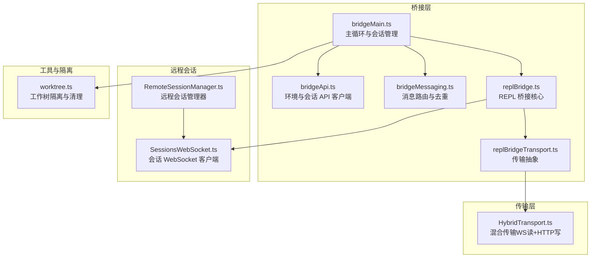
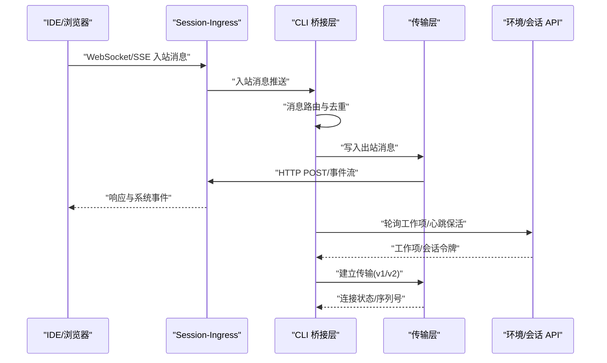
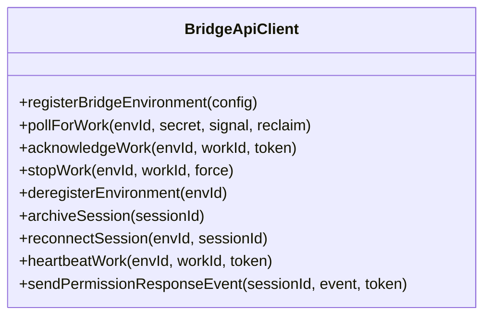
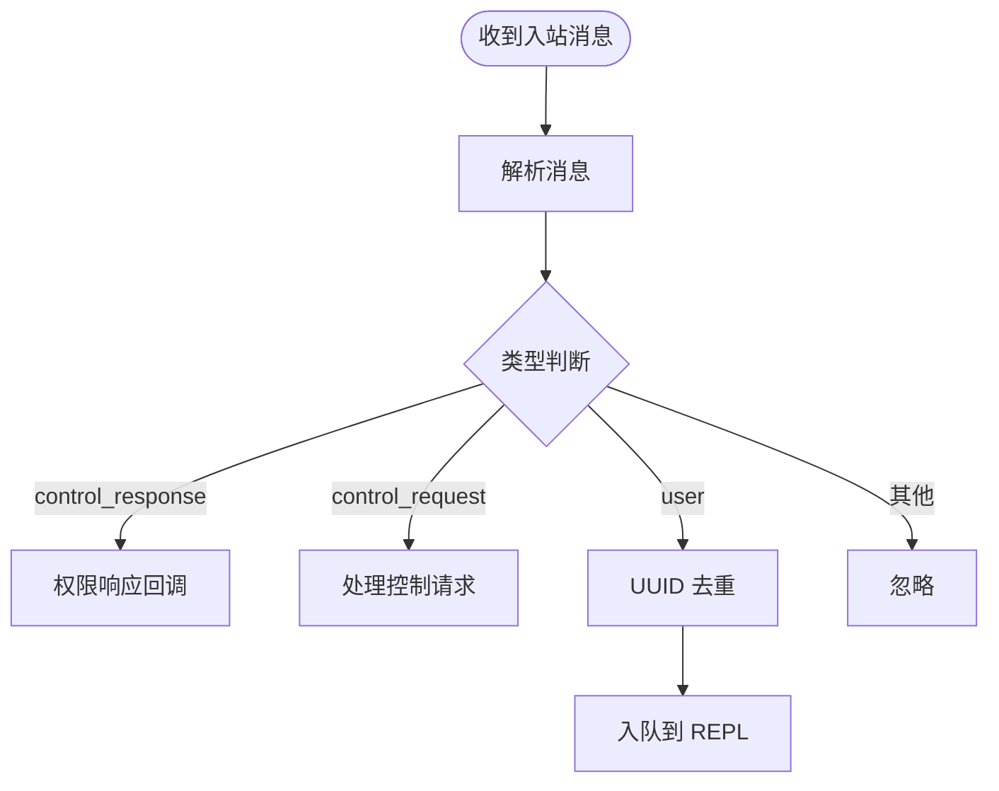
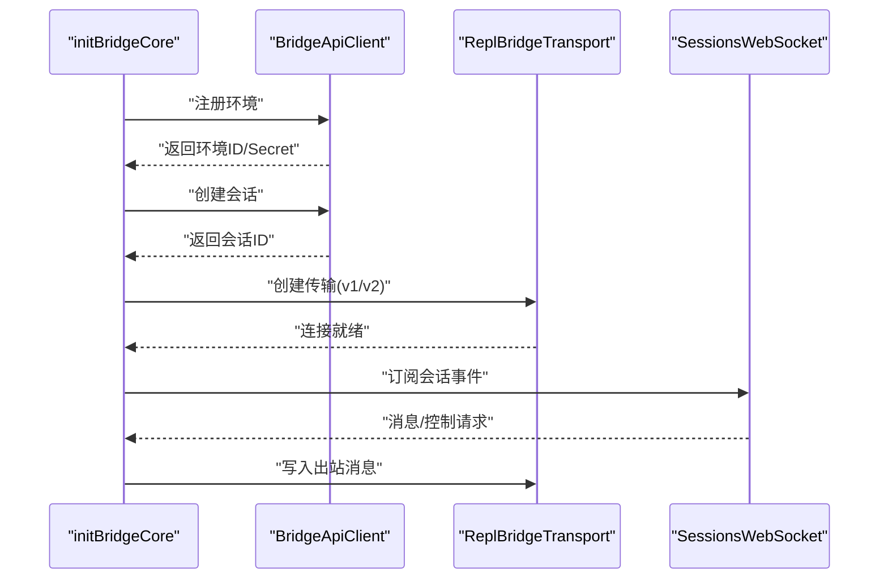
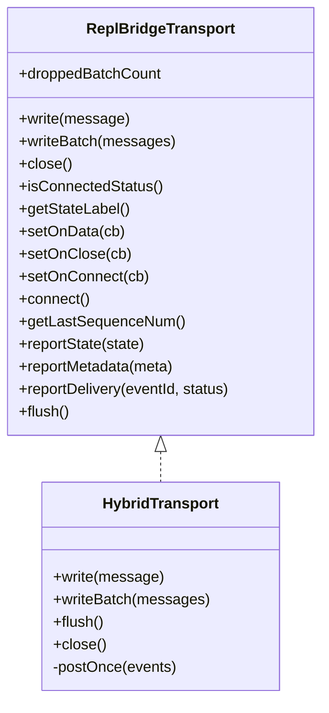
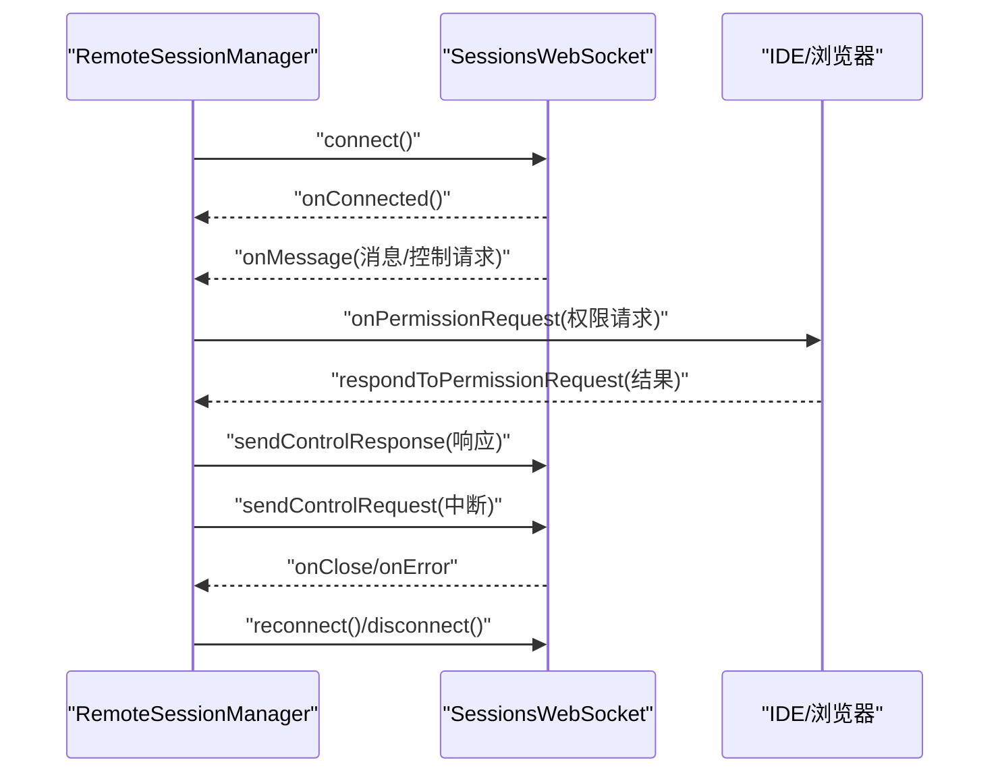
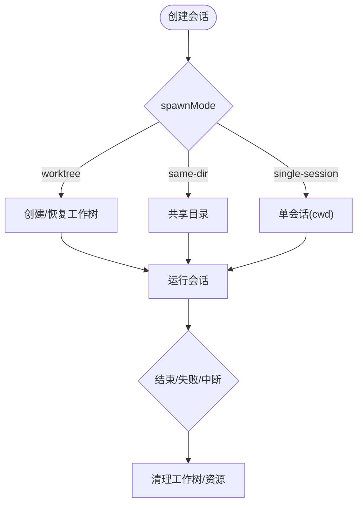
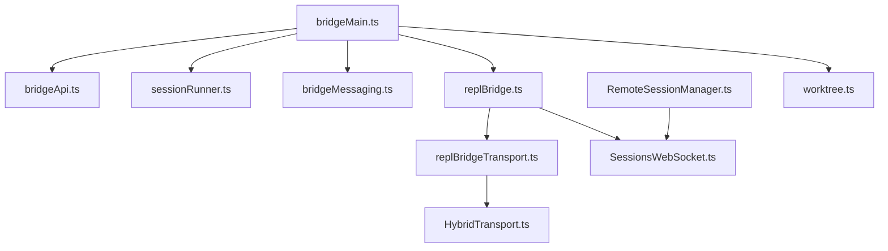

# IDE 集成

<cite>
**本文档引用的文件**
- [README.md](file://README.md)
- [bridgeMain.ts](file://src/bridge/bridgeMain.ts)
- [types.ts](file://src/bridge/types.ts)
- [bridgeApi.ts](file://src/bridge/bridgeApi.ts)
- [sessionRunner.ts](file://src/bridge/sessionRunner.ts)
- [bridgeMessaging.ts](file://src/bridge/bridgeMessaging.ts)
- [replBridge.ts](file://src/bridge/replBridge.ts)
- [replBridgeTransport.ts](file://src/bridge/replBridgeTransport.ts)
- [HybridTransport.ts](file://src/cli/transports/HybridTransport.ts)
- [SessionsWebSocket.ts](file://src/remote/SessionsWebSocket.ts)
- [RemoteSessionManager.ts](file://src/remote/RemoteSessionManager.ts)
- [worktree.ts](file://src/utils/worktree.ts)
- [bridge.md](file://docs/bridge.md)
</cite>

## 目录
1. [简介](#简介)
2. [项目结构](#项目结构)
3. [核心组件](#核心组件)
4. [架构总览](#架构总览)
5. [详细组件分析](#详细组件分析)
6. [依赖关系分析](#依赖关系分析)
7. [性能考量](#性能考量)
8. [故障排查指南](#故障排查指南)
9. [结论](#结论)
10. [附录](#附录)

## 简介
本文件面向 Claude Code 的 IDE 集成系统，系统性阐述 VS Code 与 JetBrains 插件的集成机制，涵盖桥接层架构、通信协议与数据交换格式、会话创建与管理工作树隔离与资源清理、传输层设计（WebSocket 传输、混合传输与串行批处理上传器）等。文档同时提供 IDE 插件安装配置指南、最佳实践与常见问题解决方案，帮助开发者与用户高效使用与维护该集成体系。

## 项目结构
- 桥接层位于 src/bridge/，负责连接 IDE 扩展与 CLI 会话，支持两种传输版本（v1：WebSocket + HTTP POST；v2：SSE + CCRClient）。
- 远程会话管理位于 src/remote/，封装 WebSocket 订阅与权限请求响应流程。
- 传输层位于 src/cli/transports/，包含 HybridTransport（混合传输）与 SSETransport/CCRClient 组合。
- 工作树隔离与资源清理逻辑位于 src/utils/worktree.ts，用于多会话模式下的环境隔离与回收。

**图表来源**
- [bridgeMain.ts:141-800](file://src/bridge/bridgeMain.ts#L141-L800)
- [bridgeApi.ts:68-542](file://src/bridge/bridgeApi.ts#L68-L542)
- [bridgeMessaging.ts:132-464](file://src/bridge/bridgeMessaging.ts#L132-L464)
- [replBridge.ts:260-800](file://src/bridge/replBridge.ts#L260-L800)
- [replBridgeTransport.ts:119-373](file://src/bridge/replBridgeTransport.ts#L119-L373)
- [HybridTransport.ts:54-285](file://src/cli/transports/HybridTransport.ts#L54-L285)
- [SessionsWebSocket.ts:82-406](file://src/remote/SessionsWebSocket.ts#L82-L406)
- [RemoteSessionManager.ts:95-345](file://src/remote/RemoteSessionManager.ts#L95-L345)
- [worktree.ts:702-800](file://src/utils/worktree.ts#L702-L800)

**章节来源**
- [README.md:193-236](file://README.md#L193-L236)
- [bridge.md:1-81](file://docs/bridge.md#L1-L81)

## 核心组件
- 桥接主循环与会话管理：负责轮询工作项、心跳保活、会话生命周期管理、错误恢复与资源清理。
- 环境与会话 API 客户端：封装环境注册、工作轮询、会话确认、停止工作、注销环境、权限事件发送、会话归档与重连。
- 消息路由与去重：解析入站消息、处理控制请求/响应、基于 UUID 的回声与重复消息过滤。
- REPL 桥接核心：初始化桥接、注册环境、创建会话、建立传输、处理断线重连与状态变更。
- 传输抽象：统一 v1（HybridTransport）与 v2（SSETransport + CCRClient）的读写接口。
- 混合传输：WebSocket 读取 + HTTP POST 写入，内置串行批处理上传器以保证顺序与可靠性。
- 远程会话管理：通过 WebSocket 订阅会话事件，处理权限请求与中断信号，支持重连与断开。
- 工作树隔离：在多会话模式下为每个会话创建独立工作树，避免相互污染，并在会话结束时清理。

**章节来源**
- [bridgeMain.ts:141-800](file://src/bridge/bridgeMain.ts#L141-L800)
- [bridgeApi.ts:141-451](file://src/bridge/bridgeApi.ts#L141-L451)
- [bridgeMessaging.ts:132-464](file://src/bridge/bridgeMessaging.ts#L132-L464)
- [replBridge.ts:260-800](file://src/bridge/replBridge.ts#L260-L800)
- [replBridgeTransport.ts:119-373](file://src/bridge/replBridgeTransport.ts#L119-L373)
- [HybridTransport.ts:54-285](file://src/cli/transports/HybridTransport.ts#L54-L285)
- [SessionsWebSocket.ts:82-406](file://src/remote/SessionsWebSocket.ts#L82-L406)
- [RemoteSessionManager.ts:95-345](file://src/remote/RemoteSessionManager.ts#L95-L345)
- [worktree.ts:702-800](file://src/utils/worktree.ts#L702-L800)

## 架构总览
IDE 与 CLI 的交互通过 Session-Ingress 层完成：IDE 通过 WebSocket/SSE 推送用户消息，CLI 通过混合传输或 CCRClient 将响应与系统事件回传。桥接层负责：
- 环境注册与会话创建
- 传输协商（v1 或 v2）
- 权限委托与控制请求处理
- 心跳保活与断线重连
- 多会话模式下的工作树隔离与资源回收

**图表来源**
- [bridge.md:36-66](file://docs/bridge.md#L36-L66)
- [bridgeApi.ts:199-247](file://src/bridge/bridgeApi.ts#L199-L247)
- [replBridgeTransport.ts:119-373](file://src/bridge/replBridgeTransport.ts#L119-L373)
- [HybridTransport.ts:54-285](file://src/cli/transports/HybridTransport.ts#L54-L285)

## 详细组件分析

### 桥接主循环与会话管理
- 轮询与心跳：根据配置周期性轮询工作项，空闲时进行心跳保活；支持容量模式下的心跳与轮询组合。
- 会话生命周期：创建、运行、完成/失败/中断、归档与清理；在多会话模式下维持活动会话集合与标题显示。
- 错误恢复：对认证失败触发重新连接，对致命错误终止并记录；支持超时与优雅关闭。
- 资源清理：移除工作树、停止工作项、归档会话、释放传输资源。

```mermaid
flowchart TD
Start(["开始轮询"]) --> Poll["轮询工作项"]
Poll --> HasWork{"有工作项?"}
HasWork --> |否| Idle["空闲/心跳保活"]
Idle --> Capacity{"是否达到容量?"}
Capacity --> |是| HB["心跳保活/轮询组合"]
Capacity --> |否| Sleep["按容量策略睡眠"]
HasWork --> |是| Spawn["解码工作密钥/启动会话"]
Spawn --> Run["运行会话/处理消息"]
Run --> Done{"会话结束?"}
Done --> |完成| Archive["归档会话/清理资源"]
Done --> |失败| Cleanup["清理资源/记录错误"]
Done --> |中断| StopWork["停止工作项"]
Archive --> Poll
Cleanup --> Poll
StopWork --> Poll
```

**图表来源**
- [bridgeMain.ts:600-800](file://src/bridge/bridgeMain.ts#L600-L800)

**章节来源**
- [bridgeMain.ts:141-800](file://src/bridge/bridgeMain.ts#L141-L800)

### 环境与会话 API 客户端
- 环境注册：携带机器名、目录、分支、仓库 URL、最大会话数与元数据，支持复用环境 ID。
- 工作轮询：支持 reclaim_older_than_ms 参数，避免重复投递。
- 会话确认与停止：通过会话令牌进行认证，支持强制停止。
- 注销与归档：注销环境、归档会话（幂等）。
- 重连与心跳：针对 v2 会话通过重连触发服务器重新派发工作，心跳使用会话令牌。

**图表来源**
- [types.ts:133-176](file://src/bridge/types.ts#L133-L176)
- [bridgeApi.ts:141-451](file://src/bridge/bridgeApi.ts#L141-L451)

**章节来源**
- [bridgeApi.ts:68-542](file://src/bridge/bridgeApi.ts#L68-L542)
- [types.ts:133-176](file://src/bridge/types.ts#L133-L176)

### 消息路由与去重
- 入站消息处理：解析 SDKMessage，区分 control_request/control_response，过滤非用户消息。
- 去重机制：基于最近发送与最近接收的 UUID 集合，过滤回声与重复消息。
- 控制请求处理：对 initialize/set_model/set_permission_mode/interrupt 等进行响应，支持仅出站模式的错误返回。

**图表来源**
- [bridgeMessaging.ts:132-208](file://src/bridge/bridgeMessaging.ts#L132-L208)

**章节来源**
- [bridgeMessaging.ts:132-464](file://src/bridge/bridgeMessaging.ts#L132-L464)

### REPL 桥接核心
- 初始化：注册环境、创建会话、设置崩溃恢复指针、准备消息去重集合。
- 传输选择：根据工作密钥中的 use_code_sessions 字段决定 v1（HybridTransport）或 v2（SSETransport + CCRClient）。
- 断线重连：支持环境丢失后的重连策略（原环境复活或新建会话），保持历史不重复发送。
- 状态管理：桥接状态变化回调，标题更新与持久化。

**图表来源**
- [replBridge.ts:318-570](file://src/bridge/replBridge.ts#L318-L570)
- [replBridgeTransport.ts:119-373](file://src/bridge/replBridgeTransport.ts#L119-L373)
- [SessionsWebSocket.ts:100-205](file://src/remote/SessionsWebSocket.ts#L100-L205)

**章节来源**
- [replBridge.ts:260-800](file://src/bridge/replBridge.ts#L260-L800)

### 传输层设计
- v1 混合传输（HybridTransport）：WebSocket 读取 + HTTP POST 写入，内置串行批处理上传器，保证事件顺序与可靠性，支持批量刷新与优雅关闭。
- v2 传输（SSETransport + CCRClient）：SSE 读取 + HTTP POST 写入，支持 worker 注册、心跳、状态上报与交付跟踪，适用于环境无关的直接会话模式。

**图表来源**
- [replBridgeTransport.ts:23-70](file://src/bridge/replBridgeTransport.ts#L23-L70)
- [HybridTransport.ts:54-285](file://src/cli/transports/HybridTransport.ts#L54-L285)

**章节来源**
- [replBridgeTransport.ts:119-373](file://src/bridge/replBridgeTransport.ts#L119-L373)
- [HybridTransport.ts:54-285](file://src/cli/transports/HybridTransport.ts#L54-L285)

### 远程会话管理
- WebSocket 订阅：连接到会话事件流，处理消息、权限请求与取消。
- 权限请求：接收 can_use_tool 请求，向 IDE 发起决策，再回传控制响应。
- 中断与重连：支持发送中断请求与强制重连，适配服务器端会话状态变化。

**图表来源**
- [RemoteSessionManager.ts:95-345](file://src/remote/RemoteSessionManager.ts#L95-L345)
- [SessionsWebSocket.ts:82-406](file://src/remote/SessionsWebSocket.ts#L82-L406)

**章节来源**
- [RemoteSessionManager.ts:95-345](file://src/remote/RemoteSessionManager.ts#L95-L345)
- [SessionsWebSocket.ts:82-406](file://src/remote/SessionsWebSocket.ts#L82-L406)

### 会话创建与管理工作树隔离
- 会话创建：通过 API 创建会话，支持初始事件与 Git 上下文注入。
- 工作树隔离：在多会话模式下为每个会话创建独立工作树，避免共享目录导致的冲突；支持稀疏检出与符号链接优化。
- 资源清理：会话结束或中断后清理工作树、tmux 会话与项目配置。

**图表来源**
- [worktree.ts:702-800](file://src/utils/worktree.ts#L702-L800)
- [createSession.ts:34-180](file://src/bridge/createSession.ts#L34-L180)

**章节来源**
- [worktree.ts:702-800](file://src/utils/worktree.ts#L702-L800)
- [createSession.ts:34-180](file://src/bridge/createSession.ts#L34-L180)

## 依赖关系分析
- 模块耦合：桥接主循环依赖 API 客户端与会话运行器；REPL 桥接核心依赖传输抽象与消息路由；远程会话管理依赖 WebSocket 客户端。
- 外部依赖：Axios 用于 HTTP 请求，WebSocket/Node-WS 用于实时通信，Bun 的子进程用于会话子进程管理。
- 循环依赖：通过接口与延迟导入避免模块间循环依赖；传输抽象统一封装 v1/v2 差异。

**图表来源**
- [bridgeMain.ts:1-80](file://src/bridge/bridgeMain.ts#L1-L80)
- [bridgeApi.ts:1-40](file://src/bridge/bridgeApi.ts#L1-L40)
- [sessionRunner.ts:1-20](file://src/bridge/sessionRunner.ts#L1-L20)
- [bridgeMessaging.ts:1-30](file://src/bridge/bridgeMessaging.ts#L1-L30)
- [replBridge.ts:1-60](file://src/bridge/replBridge.ts#L1-L60)
- [replBridgeTransport.ts:1-15](file://src/bridge/replBridgeTransport.ts#L1-L15)
- [HybridTransport.ts:1-15](file://src/cli/transports/HybridTransport.ts#L1-L15)
- [SessionsWebSocket.ts:1-20](file://src/remote/SessionsWebSocket.ts#L1-L20)
- [RemoteSessionManager.ts:1-20](file://src/remote/RemoteSessionManager.ts#L1-L20)
- [worktree.ts:1-20](file://src/utils/worktree.ts#L1-L20)

**章节来源**
- [bridgeMain.ts:1-120](file://src/bridge/bridgeMain.ts#L1-L120)
- [replBridge.ts:1-120](file://src/bridge/replBridge.ts#L1-L120)

## 性能考量
- 串行批处理上传器：HybridTransport 使用串行批处理与指数退避，减少并发写入带来的冲突与抖动。
- 心跳保活：在容量满载时采用心跳模式降低轮询压力，避免过度拉取。
- 去重与回声过滤：基于 UUID 的环形缓冲区确保消息只被处理一次，减少重复计算。
- 工作树优化：符号链接与稀疏检出减少磁盘占用与 IO 开销。
- 超时与优雅关闭：传输层在关闭前提供宽限期，确保最后一批事件被处理。

[本节为通用指导，无需特定文件分析]

## 故障排查指南
- 认证失败（401/403）：检查 OAuth 登录状态与订阅有效性；桥接层会抛出致命错误并记录详细信息。
- 会话过期（410）：使用重连功能或重启会话；桥接层会尝试重新派发工作。
- 传输异常：检查网络代理与 TLS 设置；WebSocket 客户端支持有限重试与永久关闭码处理。
- 权限请求未响应：确认 IDE 是否正确处理权限弹窗；桥接层会发送控制响应以避免服务器挂起。
- 工作树残留：确保会话结束后执行清理流程；必要时手动移除工作树目录。

**章节来源**
- [bridgeApi.ts:454-542](file://src/bridge/bridgeApi.ts#L454-L542)
- [SessionsWebSocket.ts:234-288](file://src/remote/SessionsWebSocket.ts#L234-L288)
- [worktree.ts:780-800](file://src/utils/worktree.ts#L780-L800)

## 结论
Claude Code 的 IDE 集成通过桥接层实现了稳定的双向通信，支持多种传输模式与会话管理策略。其设计强调可靠性（去重、心跳、重连）、可扩展性（传输抽象、权限委托）与安全性（JWT、可信设备令牌）。配合工作树隔离与资源清理，系统能够在多会话场景下保持环境隔离与性能稳定。建议在生产环境中启用适当的日志与监控，并遵循最佳实践以获得最佳体验。

[本节为总结性内容，无需特定文件分析]

## 附录

### IDE 插件安装与配置指南
- VS Code 插件
  - 在 VS Code 中安装 Claude Code 扩展。
  - 打开设置，配置 MCP 服务器路径与环境变量（如需要）。
  - 启动本地 MCP 服务器或使用内置配置。
- JetBrains 插件
  - 在 IDE 插件市场搜索并安装 Claude Code 插件。
  - 配置与 CLI 相同的 OAuth 与组织信息。
- 验证步骤
  - 在终端运行 `claude remote-control`，观察桥接状态与会话 URL。
  - 在 IDE 中打开会话，输入提示验证双向通信。
  - 查看调试日志与桥接状态面板，确认无错误。

**章节来源**
- [README.md:124-156](file://README.md#L124-L156)
- [bridge.md:162-190](file://docs/bridge.md#L162-L190)

### 最佳实践
- 使用工作树模式隔离多会话任务，避免共享目录冲突。
- 启用调试文件与日志，便于定位问题。
- 在高并发场景下优先使用 v2 传输（SSE + CCRClient）以提升吞吐。
- 正确处理权限请求，避免阻塞服务器等待。
- 定期清理工作树与临时资源，防止磁盘膨胀。

[本节为通用指导，无需特定文件分析]