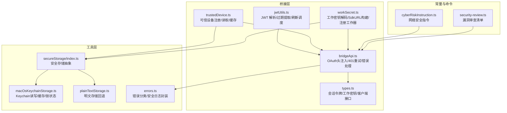
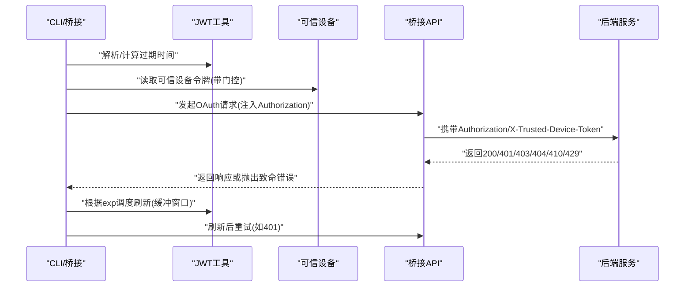
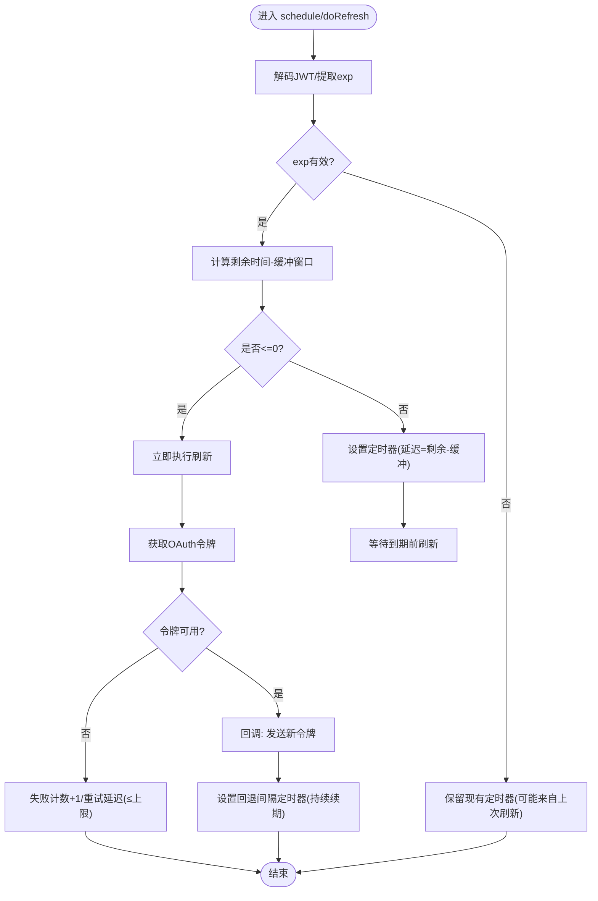
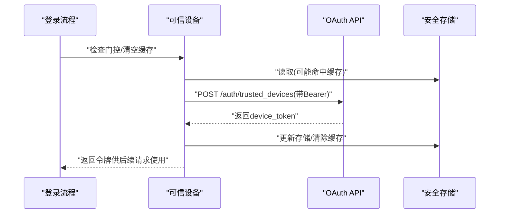
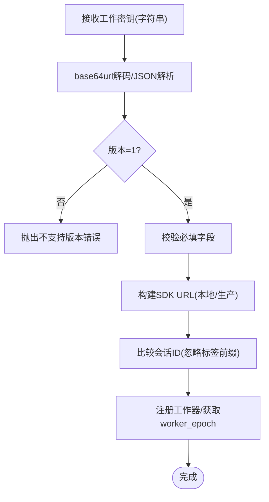
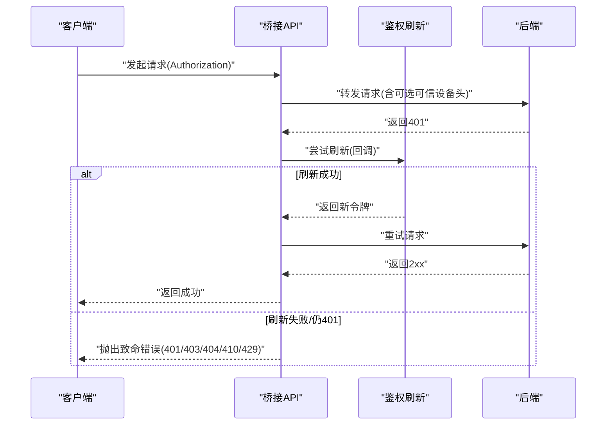
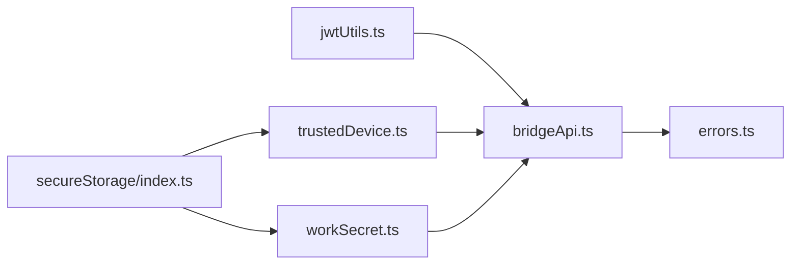

# 安全通信

<cite>
**本文引用的文件**
- [src/bridge/jwtUtils.ts](file://src/bridge/jwtUtils.ts)
- [src/bridge/trustedDevice.ts](file://src/bridge/trustedDevice.ts)
- [src/bridge/workSecret.ts](file://src/bridge/workSecret.ts)
- [src/bridge/bridgeApi.ts](file://src/bridge/bridgeApi.ts)
- [src/bridge/types.ts](file://src/bridge/types.ts)
- [src/utils/secureStorage/index.ts](file://src/utils/secureStorage/index.ts)
- [src/utils/secureStorage/macOsKeychainStorage.ts](file://src/utils/secureStorage/macOsKeychainStorage.ts)
- [src/utils/secureStorage/plainTextStorage.ts](file://src/utils/secureStorage/plainTextStorage.ts)
- [src/utils/errors.ts](file://src/utils/errors.ts)
- [src/constants/cyberRiskInstruction.ts](file://src/constants/cyberRiskInstruction.ts)
- [src/commands/security-review.ts](file://src/commands/security-review.ts)
</cite>

## 目录
1. [简介](#简介)
2. [项目结构](#项目结构)
3. [核心组件](#核心组件)
4. [架构总览](#架构总览)
5. [详细组件分析](#详细组件分析)
6. [依赖关系分析](#依赖关系分析)
7. [性能考量](#性能考量)
8. [故障排查指南](#故障排查指南)
9. [结论](#结论)
10. [附录](#附录)

## 简介
本文件面向 Claude Code 的安全通信系统，围绕以下目标展开：JWT 认证与刷新、可信设备认证（设备绑定与令牌管理）、工作密钥系统（密钥编码/解码、安全传输与访问控制）、以及安全通信协议的实现要点（加密传输、身份验证与授权检查）。同时提供安全最佳实践、威胁防护与漏洞检测修复建议。

## 项目结构
安全相关能力主要分布在桥接层（bridge）与工具层（utils），并通过类型定义（types）统一接口契约。关键模块如下：
- 桥接层（bridge）
  - JWT 工具：令牌解析、过期时间提取、自动刷新调度器
  - 可信设备：设备注册、令牌读取与缓存、门控开关
  - 工作密钥：工作密钥解码、SDK URL 构建、会话一致性校验、工作器注册
  - 桥接 API：统一的 OAuth 授权头注入、401 自动重试、错误分类与致命错误
  - 类型定义：会话令牌、工作密钥数据结构、客户端接口等
- 工具层（utils）
  - 安全存储：平台化安全存储抽象、macOS Keychain 实现、明文回退
  - 错误处理：通用错误分类、可记录日志的安全错误封装
- 常量与命令
  - 网络安全指令：限制与边界
  - 安全扫描命令：漏洞审查清单与排除规则

**图表来源**
- [src/bridge/jwtUtils.ts:1-259](file://src/bridge/jwtUtils.ts#L1-L259)
- [src/bridge/trustedDevice.ts:1-213](file://src/bridge/trustedDevice.ts#L1-L213)
- [src/bridge/workSecret.ts:1-130](file://src/bridge/workSecret.ts#L1-L130)
- [src/bridge/bridgeApi.ts:1-542](file://src/bridge/bridgeApi.ts#L1-L542)
- [src/bridge/types.ts:1-265](file://src/bridge/types.ts#L1-L265)
- [src/utils/secureStorage/index.ts:1-19](file://src/utils/secureStorage/index.ts#L1-L19)
- [src/utils/secureStorage/macOsKeychainStorage.ts:1-233](file://src/utils/secureStorage/macOsKeychainStorage.ts#L1-L233)
- [src/utils/secureStorage/plainTextStorage.ts:57-84](file://src/utils/secureStorage/plainTextStorage.ts#L57-L84)
- [src/utils/errors.ts:1-240](file://src/utils/errors.ts#L1-L240)
- [src/constants/cyberRiskInstruction.ts:1-24](file://src/constants/cyberRiskInstruction.ts#L1-L24)
- [src/commands/security-review.ts:43-168](file://src/commands/security-review.ts#L43-L168)

**章节来源**
- [src/bridge/jwtUtils.ts:1-259](file://src/bridge/jwtUtils.ts#L1-L259)
- [src/bridge/trustedDevice.ts:1-213](file://src/bridge/trustedDevice.ts#L1-L213)
- [src/bridge/workSecret.ts:1-130](file://src/bridge/workSecret.ts#L1-L130)
- [src/bridge/bridgeApi.ts:1-542](file://src/bridge/bridgeApi.ts#L1-L542)
- [src/bridge/types.ts:1-265](file://src/bridge/types.ts#L1-L265)
- [src/utils/secureStorage/index.ts:1-19](file://src/utils/secureStorage/index.ts#L1-L19)
- [src/utils/secureStorage/macOsKeychainStorage.ts:1-233](file://src/utils/secureStorage/macOsKeychainStorage.ts#L1-L233)
- [src/utils/secureStorage/plainTextStorage.ts:57-84](file://src/utils/secureStorage/plainTextStorage.ts#L57-L84)
- [src/utils/errors.ts:1-240](file://src/utils/errors.ts#L1-L240)
- [src/constants/cyberRiskInstruction.ts:1-24](file://src/constants/cyberRiskInstruction.ts#L1-L24)
- [src/commands/security-review.ts:43-168](file://src/commands/security-review.ts#L43-L168)

## 核心组件
- JWT 认证与刷新
  - 解析 JWT 负载与 exp 过期时间，支持剥离前缀
  - 基于过期时间与缓冲窗口的主动刷新调度器，具备失败计数与重试上限
- 可信设备认证
  - 设备注册（Enrollment）：登录后在服务端创建持久令牌，本地安全存储
  - 令牌读取与缓存：带门控开关与环境变量优先级，避免旧令牌污染
  - 头部注入：在桥接 API 请求中携带 X-Trusted-Device-Token
- 工作密钥系统
  - 工作密钥解码：base64url 解码与版本校验，字段完整性检查
  - SDK URL 构建：区分本地/生产路径，选择 ws/wss 与版本路径
  - 会话一致性：忽略标签前缀的会话 ID 比较逻辑
  - 工作器注册：向后端注册当前桥接为会话工作器并返回 worker_epoch
- 安全通信协议
  - OAuth 授权头注入：统一在请求头附加 Authorization、anthropic-version、runner 版本等
  - 401 自动重试：触发 OAuth 刷新后重试一次请求
  - 错误分类与致命错误：对 401/403/404/410/429 等进行语义化处理与用户提示

**章节来源**
- [src/bridge/jwtUtils.ts:15-259](file://src/bridge/jwtUtils.ts#L15-L259)
- [src/bridge/trustedDevice.ts:15-213](file://src/bridge/trustedDevice.ts#L15-L213)
- [src/bridge/workSecret.ts:5-130](file://src/bridge/workSecret.ts#L5-L130)
- [src/bridge/bridgeApi.ts:68-542](file://src/bridge/bridgeApi.ts#L68-L542)
- [src/bridge/types.ts:33-115](file://src/bridge/types.ts#L33-L115)

## 架构总览
下图展示从桥接到后端的关键交互，包括认证、授权与刷新链路：

**图表来源**
- [src/bridge/jwtUtils.ts:72-256](file://src/bridge/jwtUtils.ts#L72-L256)
- [src/bridge/trustedDevice.ts:54-210](file://src/bridge/trustedDevice.ts#L54-L210)
- [src/bridge/bridgeApi.ts:68-542](file://src/bridge/bridgeApi.ts#L68-L542)

## 详细组件分析

### JWT 认证与刷新
- 关键点
  - 解码 JWT 负载与 exp 字段，支持 sk-ant-si- 前缀剥离
  - 主动刷新：在过期前固定缓冲窗口触发；若未知过期时间则使用回退间隔
  - 失败处理：连续失败达到上限后停止重试，避免风暴
  - 并发安全：通过 generation 计数避免“过期定时器”被后续调度覆盖
- 数据结构与复杂度
  - 解码与解析为 O(1)（固定三段 base64url）
  - 调度器使用 Map 存储定时器与失败计数，操作均摊 O(1)
- 性能与可靠性
  - 缓冲窗口降低临界风险；回退间隔确保长会话稳定续期
  - 失败上限与重试延迟防止瞬时异常导致无限重试

**图表来源**
- [src/bridge/jwtUtils.ts:72-256](file://src/bridge/jwtUtils.ts#L72-L256)

**章节来源**
- [src/bridge/jwtUtils.ts:15-259](file://src/bridge/jwtUtils.ts#L15-L259)

### 可信设备认证
- 组件职责
  - 门控开关：通过 GrowthBook 特性门控制是否发送 X-Trusted-Device-Token
  - 注册流程：登录后调用 /auth/trusted_devices 创建设备令牌，持久化到安全存储
  - 读取与缓存：memoized 读取，支持环境变量覆盖，避免旧令牌污染
  - 头部注入：在桥接 API 请求中附加 X-Trusted-Device-Token
- 安全要点
  - 令牌持久化：macOS 使用 Keychain，其他平台回退明文存储并警告
  - 门控与时机：注册严格限定在登录后的短时间内，避免过期
  - 最佳实践：企业可通过环境变量预置令牌，绕过注册流程但不覆盖后续登录

**图表来源**
- [src/bridge/trustedDevice.ts:98-210](file://src/bridge/trustedDevice.ts#L98-L210)
- [src/utils/secureStorage/index.ts:9-17](file://src/utils/secureStorage/index.ts#L9-L17)
- [src/utils/secureStorage/macOsKeychainStorage.ts:26-176](file://src/utils/secureStorage/macOsKeychainStorage.ts#L26-L176)
- [src/utils/secureStorage/plainTextStorage.ts:57-84](file://src/utils/secureStorage/plainTextStorage.ts#L57-L84)

**章节来源**
- [src/bridge/trustedDevice.ts:15-213](file://src/bridge/trustedDevice.ts#L15-L213)
- [src/utils/secureStorage/index.ts:1-19](file://src/utils/secureStorage/index.ts#L1-L19)
- [src/utils/secureStorage/macOsKeychainStorage.ts:1-233](file://src/utils/secureStorage/macOsKeychainStorage.ts#L1-L233)
- [src/utils/secureStorage/plainTextStorage.ts:57-84](file://src/utils/secureStorage/plainTextStorage.ts#L57-L84)

### 工作密钥系统
- 密钥解码与校验
  - base64url 解码 + JSON 解析 + 版本号校验（当前仅支持 v1）
  - 必填字段校验：session_ingress_token、api_base_url
- SDK URL 构建
  - 本地：ws:// + /v2/；生产：wss:// + /v1/（经由 Envoy 重写）
- 会话一致性
  - 忽略标签前缀的会话 ID 比较，兼容不同 ID 形态
- 工作器注册
  - 向 /v1/code/sessions/{id}/worker/register 发起注册，返回 worker_epoch 用于心跳/事件携带

**图表来源**
- [src/bridge/workSecret.ts:5-127](file://src/bridge/workSecret.ts#L5-L127)

**章节来源**
- [src/bridge/workSecret.ts:1-130](file://src/bridge/workSecret.ts#L1-L130)
- [src/bridge/types.ts:33-51](file://src/bridge/types.ts#L33-L51)

### 安全通信协议实现
- 请求头注入
  - Authorization: Bearer <access_token>
  - anthropic-version、anthropic-beta、x-environment-runner-version
  - 可选 X-Trusted-Device-Token（当可信设备启用且存在令牌）
- 401 自动重试
  - 首次 401 触发刷新回调，成功后重试一次请求
  - 若仍 401 或刷新失败，转换为致命错误并附带错误类型
- 错误分类
  - 401：认证失败（附登录指引）
  - 403：权限不足（区分过期与角色缺失）
  - 404/410：资源不存在或会话过期
  - 429：速率限制
  - 其他：通用失败

**图表来源**
- [src/bridge/bridgeApi.ts:68-542](file://src/bridge/bridgeApi.ts#L68-L542)
- [src/utils/errors.ts:454-542](file://src/utils/errors.ts#L454-L542)

**章节来源**
- [src/bridge/bridgeApi.ts:68-542](file://src/bridge/bridgeApi.ts#L68-L542)
- [src/utils/errors.ts:454-542](file://src/utils/errors.ts#L454-L542)

## 依赖关系分析
- 组件耦合
  - jwtUtils 与 bridgeApi：前者提供过期时间与刷新调度，后者消费刷新回调
  - trustedDevice 与 bridgeApi：前者提供可信设备令牌，后者注入到请求头
  - workSecret 与 bridgeApi：前者提供 SDK URL/worker_epoch，后者用于建立连接与心跳
  - secureStorage 与 trustedDevice/workSecret：前者为后两者提供持久化能力
- 外部依赖
  - axios：HTTP 客户端
  - macOS security 命令：Keychain 读写与锁状态检测
  - GrowthBook：特性门控（门控开关）

**图表来源**
- [src/bridge/jwtUtils.ts:72-256](file://src/bridge/jwtUtils.ts#L72-L256)
- [src/bridge/trustedDevice.ts:98-210](file://src/bridge/trustedDevice.ts#L98-L210)
- [src/bridge/workSecret.ts:97-127](file://src/bridge/workSecret.ts#L97-L127)
- [src/bridge/bridgeApi.ts:68-542](file://src/bridge/bridgeApi.ts#L68-L542)
- [src/utils/secureStorage/index.ts:1-19](file://src/utils/secureStorage/index.ts#L1-L19)
- [src/utils/errors.ts:454-542](file://src/utils/errors.ts#L454-L542)

**章节来源**
- [src/bridge/jwtUtils.ts:72-256](file://src/bridge/jwtUtils.ts#L72-L256)
- [src/bridge/trustedDevice.ts:98-210](file://src/bridge/trustedDevice.ts#L98-L210)
- [src/bridge/workSecret.ts:97-127](file://src/bridge/workSecret.ts#L97-L127)
- [src/bridge/bridgeApi.ts:68-542](file://src/bridge/bridgeApi.ts#L68-L542)
- [src/utils/secureStorage/index.ts:1-19](file://src/utils/secureStorage/index.ts#L1-L19)
- [src/utils/errors.ts:454-542](file://src/utils/errors.ts#L454-L542)

## 性能考量
- 刷新调度
  - 缓冲窗口与回退间隔平衡了“提前续期”与“避免频繁刷新”的需求
  - 失败上限与重试延迟避免雪崩效应
- 存储与门控
  - macOS Keychain 读写带缓存与“过期即用旧值”的策略，减少频繁子进程调用
  - memoized 读取可信设备令牌，降低每次请求的开销
- 网络与超时
  - 请求超时与状态校验避免阻塞；429 明确提示速率限制

[本节为通用指导，无需具体文件分析]

## 故障排查指南
- 401/403/404/410/429
  - 401：检查登录状态与刷新回调是否生效；查看致命错误详情与错误类型
  - 403：确认组织权限与角色；区分会话过期与权限不足
  - 404/410：会话不存在或已过期，需重新启动远程控制
  - 429：降低轮询频率
- 可信设备问题
  - 令牌未发送：检查门控是否开启、环境变量是否覆盖、存储是否可写
  - 注册失败：确认登录后短时间内调用、网络可达、响应包含 device_token
- 工作密钥问题
  - 版本不支持：确保工作密钥版本为 v1
  - 字段缺失：确认 session_ingress_token 与 api_base_url 存在
  - URL 构建异常：确认 api_base_url 协议与主机格式正确
- 存储问题
  - macOS Keychain 锁定：检查 keychain 状态；在 SSH 会话中可能需要解锁
  - 明文存储警告：平台非 macOS 时采用明文存储，注意安全边界

**章节来源**
- [src/bridge/bridgeApi.ts:454-542](file://src/bridge/bridgeApi.ts#L454-L542)
- [src/bridge/trustedDevice.ts:98-210](file://src/bridge/trustedDevice.ts#L98-L210)
- [src/bridge/workSecret.ts:5-127](file://src/bridge/workSecret.ts#L5-L127)
- [src/utils/secureStorage/macOsKeychainStorage.ts:211-231](file://src/utils/secureStorage/macOsKeychainStorage.ts#L211-L231)
- [src/utils/secureStorage/plainTextStorage.ts:57-84](file://src/utils/secureStorage/plainTextStorage.ts#L57-L84)

## 结论
该安全通信体系以“门控开关 + 可信设备 + 工作密钥 + JWT 刷新”为核心，结合统一的 OAuth 头注入与 401 自动重试机制，形成闭环的身份验证与授权保障。通过安全存储抽象与严格的错误分类，系统在跨平台与高可用之间取得平衡。建议在生产环境中：
- 严格遵循门控与注册时机
- 对工作密钥进行版本与字段校验
- 在 macOS 上优先使用 Keychain，避免明文存储
- 控制轮询频率，避免 429

[本节为总结，无需具体文件分析]

## 附录
- 安全最佳实践
  - 令牌最小暴露面：仅在必要请求头中携带
  - 门控分阶段 rollout：先开启客户端门控再开启服务端强制
  - 注册时效性：登录后尽快完成可信设备注册
  - 日志脱敏：使用安全错误封装，避免敏感信息泄露
- 威胁与防护
  - 令牌泄露：通过短有效期与主动刷新降低风险
  - 中间人攻击：使用 wss 与受控 API 基础地址
  - 权限滥用：基于角色与作用域的 403 分类与抑制
- 漏洞检测与修复
  - 使用内置安全审查命令与清单，聚焦高影响问题
  - 对输入校验、路径遍历、命令注入等进行重点检查
  - 对日志输出进行脱敏，避免将用户输入直接写入日志

**章节来源**
- [src/constants/cyberRiskInstruction.ts:1-24](file://src/constants/cyberRiskInstruction.ts#L1-L24)
- [src/commands/security-review.ts:43-168](file://src/commands/security-review.ts#L43-L168)
- [src/utils/errors.ts:93-101](file://src/utils/errors.ts#L93-L101)