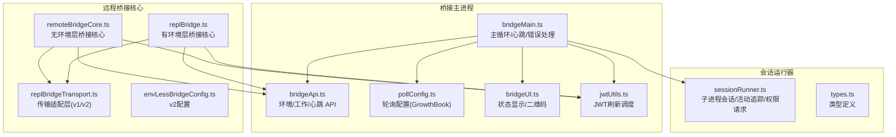
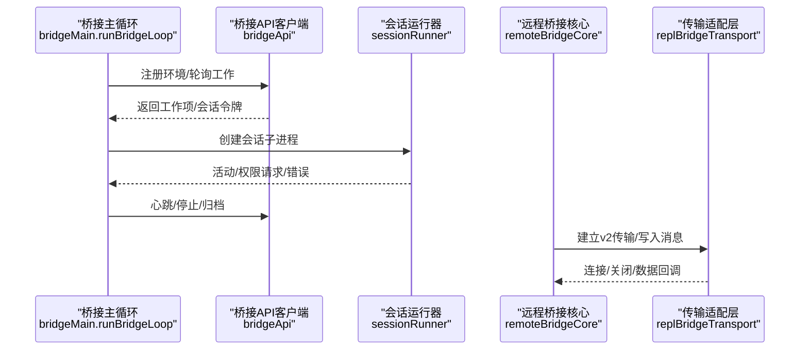
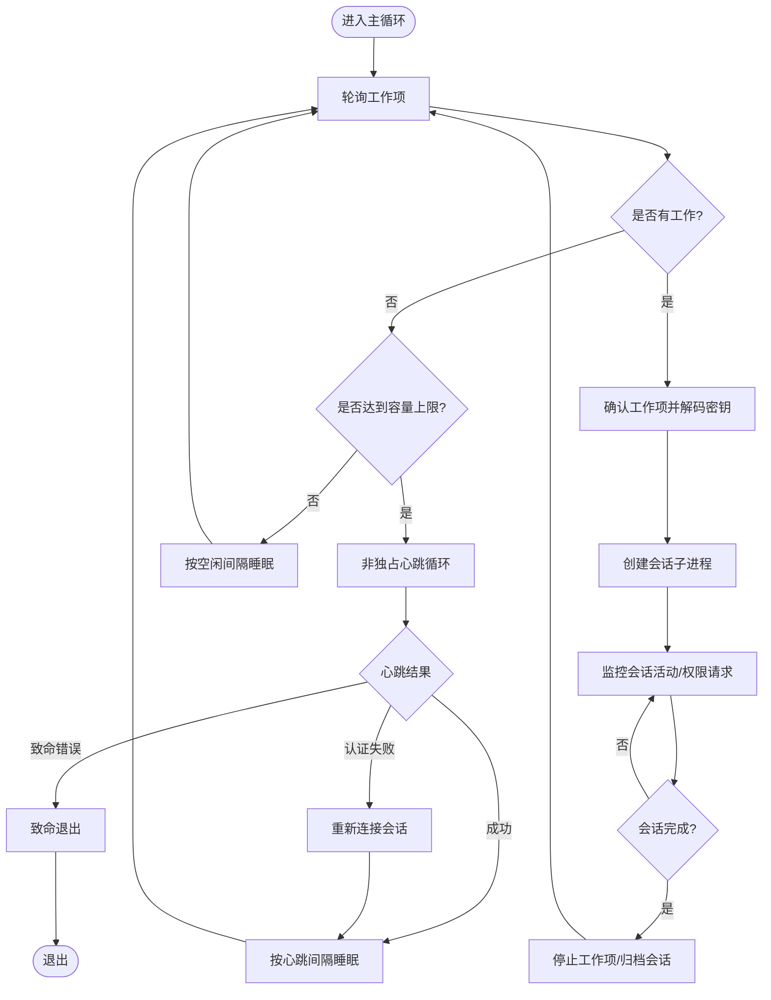
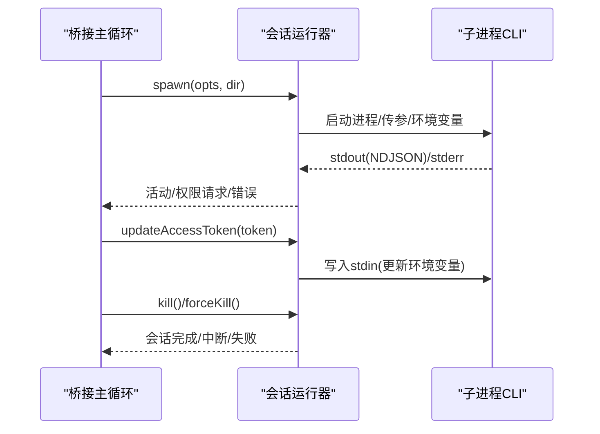
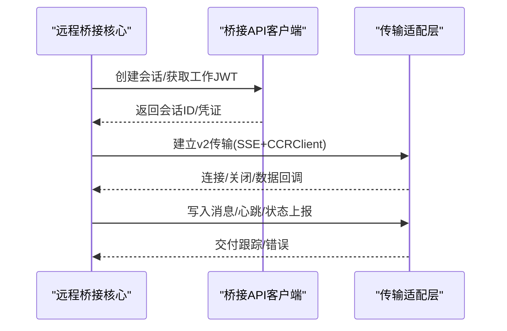
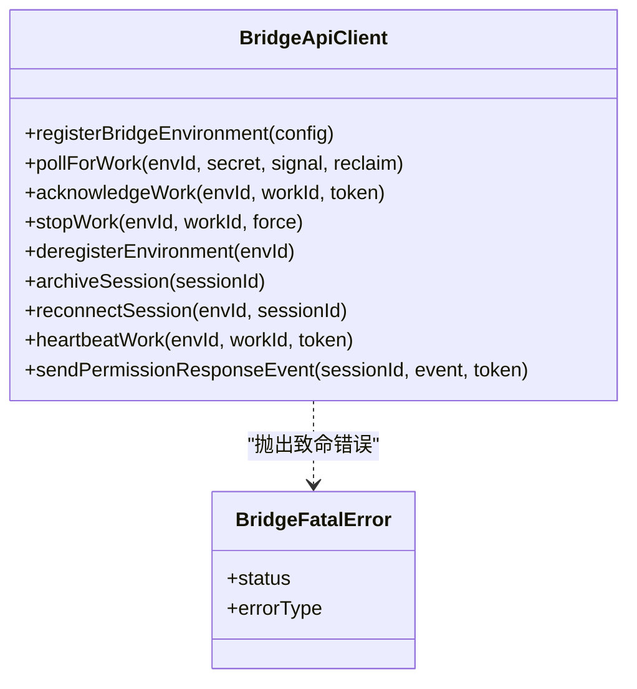
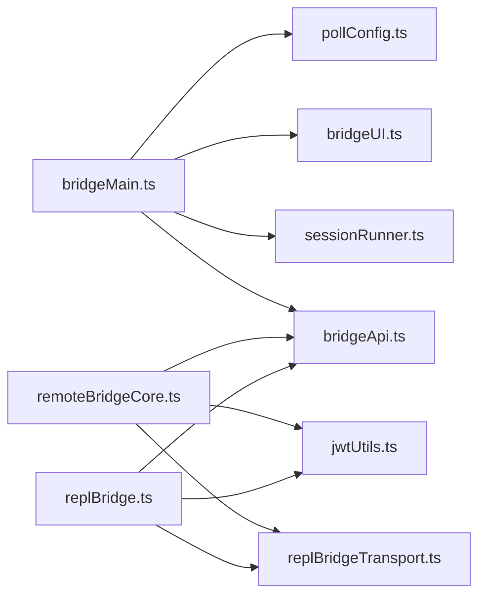

# 桥接架构设计

<cite>
**本文档引用的文件**
- [bridgeMain.ts](file://src/bridge/bridgeMain.ts)
- [bridgeConfig.ts](file://src/bridge/bridgeConfig.ts)
- [sessionRunner.ts](file://src/bridge/sessionRunner.ts)
- [remoteBridgeCore.ts](file://src/bridge/remoteBridgeCore.ts)
- [bridgeApi.ts](file://src/bridge/bridgeApi.ts)
- [types.ts](file://src/bridge/types.ts)
- [pollConfig.ts](file://src/bridge/pollConfig.ts)
- [pollConfigDefaults.ts](file://src/bridge/pollConfigDefaults.ts)
- [bridgeUI.ts](file://src/bridge/bridgeUI.ts)
- [bridgeStatusUtil.ts](file://src/bridge/bridgeStatusUtil.ts)
- [bridgeMessaging.ts](file://src/bridge/bridgeMessaging.ts)
- [replBridge.ts](file://src/bridge/replBridge.ts)
- [replBridgeTransport.ts](file://src/bridge/replBridgeTransport.ts)
- [envLessBridgeConfig.ts](file://src/bridge/envLessBridgeConfig.ts)
- [jwtUtils.ts](file://src/bridge/jwtUtils.ts)
</cite>

## 目录
1. [引言](#引言)
2. [项目结构](#项目结构)
3. [核心组件](#核心组件)
4. [架构总览](#架构总览)
5. [详细组件分析](#详细组件分析)
6. [依赖关系分析](#依赖关系分析)
7. [性能考虑](#性能考虑)
8. [故障排除指南](#故障排除指南)
9. [结论](#结论)

## 引言
本文件面向 Claude Code 的桥接架构设计，系统性阐述桥接系统的主循环设计、会话管理机制与状态同步策略；详解桥接配置体系（环境配置、会话限制与性能参数）；解释桥接 API 的设计模式（工作项轮询、心跳机制与错误处理）；并以架构图展示桥接主进程、会话运行器与远程 API 的交互流程。文档同时总结架构决策的技术考量与性能优化策略，帮助读者在不深入源码细节的情况下理解整体设计。

## 项目结构
桥接架构主要由以下模块构成：
- 桥接主循环与调度：负责轮询工作项、管理会话生命周期、执行心跳与错误恢复
- 会话运行器：负责子进程会话的创建、活动追踪、权限请求转发与调试日志
- 远程桥接核心：支持两种路径（有环境层与无环境层），统一消息处理与传输抽象
- 桥接 API 客户端：封装环境注册、工作轮询、心跳、停止与归档等后端接口
- 配置系统：集中化环境与认证配置，支持运行时参数与增长实验（GrowthBook）
- UI 与状态显示：实时渲染桥接状态、会话计数、工具活动与二维码
- 传输适配层：统一 v1（HybridTransport）与 v2（SSETransport + CCRClient）的传输接口
- JWT 刷新调度：在会话过期前主动刷新，确保长连接稳定

**图表来源**
- [bridgeMain.ts:141-800](file://src/bridge/bridgeMain.ts#L141-L800)
- [bridgeApi.ts:68-452](file://src/bridge/bridgeApi.ts#L68-L452)
- [sessionRunner.ts:248-553](file://src/bridge/sessionRunner.ts#L248-L553)
- [remoteBridgeCore.ts:140-760](file://src/bridge/remoteBridgeCore.ts#L140-L760)
- [replBridge.ts:260-800](file://src/bridge/replBridge.ts#L260-L800)
- [replBridgeTransport.ts:119-373](file://src/bridge/replBridgeTransport.ts#L119-L373)
- [pollConfig.ts:102-113](file://src/bridge/pollConfig.ts#L102-L113)
- [envLessBridgeConfig.ts:130-168](file://src/bridge/envLessBridgeConfig.ts#L130-L168)
- [bridgeUI.ts:42-533](file://src/bridge/bridgeUI.ts#L42-L533)
- [jwtUtils.ts:72-256](file://src/bridge/jwtUtils.ts#L72-L256)

**章节来源**
- [bridgeMain.ts:141-800](file://src/bridge/bridgeMain.ts#L141-L800)
- [sessionRunner.ts:248-553](file://src/bridge/sessionRunner.ts#L248-L553)
- [remoteBridgeCore.ts:140-760](file://src/bridge/remoteBridgeCore.ts#L140-L760)
- [replBridge.ts:260-800](file://src/bridge/replBridge.ts#L260-L800)
- [bridgeApi.ts:68-452](file://src/bridge/bridgeApi.ts#L68-L452)
- [pollConfig.ts:102-113](file://src/bridge/pollConfig.ts#L102-L113)
- [envLessBridgeConfig.ts:130-168](file://src/bridge/envLessBridgeConfig.ts#L130-L168)
- [bridgeUI.ts:42-533](file://src/bridge/bridgeUI.ts#L42-L533)
- [replBridgeTransport.ts:119-373](file://src/bridge/replBridgeTransport.ts#L119-L373)
- [jwtUtils.ts:72-256](file://src/bridge/jwtUtils.ts#L72-L256)

## 核心组件
- 桥接主循环（bridgeMain.runBridgeLoop）
  - 负责工作轮询、心跳、会话生命周期管理、容量唤醒与优雅退出
  - 支持多会话模式下的容量控制与空闲心跳
- 会话运行器（sessionRunner.createSessionSpawner）
  - 子进程会话创建、NDJSON 输出解析、活动追踪、权限请求转发
  - 支持调试日志与转录文件记录
- 远程桥接核心（remoteBridgeCore.initEnvLessBridgeCore）
  - 无环境层桥接：直接创建会话并建立 v2 传输
  - 统一消息处理、去重与控制请求响应
- 桥接 API 客户端（bridgeApi.createBridgeApiClient）
  - 环境注册、工作轮询、心跳、停止、归档、权限事件发送
  - OAuth 401 自动刷新与致命错误分类
- 配置系统
  - 桥接配置（bridgeConfig）：认证与基础 URL 解析
  - 轮询配置（pollConfig）：GrowthBook 驱动的动态轮询参数
  - v2 配置（envLessBridgeConfig）：超时、心跳、最小版本等
- UI 与状态显示（bridgeUI/createBridgeLogger）
  - 实时状态渲染、二维码生成、会话计数与活动轨迹
- 传输适配层（replBridgeTransport）
  - v1（HybridTransport）与 v2（SSETransport + CCRClient）统一接口
- JWT 刷新调度（jwtUtils.createTokenRefreshScheduler）
  - 基于 JWT 过期时间的预刷新与失败重试

**章节来源**
- [bridgeMain.ts:141-800](file://src/bridge/bridgeMain.ts#L141-L800)
- [sessionRunner.ts:248-553](file://src/bridge/sessionRunner.ts#L248-L553)
- [remoteBridgeCore.ts:140-760](file://src/bridge/remoteBridgeCore.ts#L140-L760)
- [bridgeApi.ts:68-452](file://src/bridge/bridgeApi.ts#L68-L452)
- [bridgeConfig.ts:1-51](file://src/bridge/bridgeConfig.ts#L1-L51)
- [pollConfig.ts:102-113](file://src/bridge/pollConfig.ts#L102-L113)
- [envLessBridgeConfig.ts:130-168](file://src/bridge/envLessBridgeConfig.ts#L130-L168)
- [bridgeUI.ts:42-533](file://src/bridge/bridgeUI.ts#L42-L533)
- [replBridgeTransport.ts:119-373](file://src/bridge/replBridgeTransport.ts#L119-L373)
- [jwtUtils.ts:72-256](file://src/bridge/jwtUtils.ts#L72-L256)

## 架构总览
桥接架构采用“主循环 + 会话运行器 + 远程桥接核心”的分层设计，通过统一的桥接 API 客户端与传输适配层实现 v1/v2 双协议兼容。主循环负责资源协调与错误恢复，会话运行器负责具体任务执行与输出解析，远程桥接核心负责与后端服务的直接通信。

**图表来源**
- [bridgeMain.ts:141-800](file://src/bridge/bridgeMain.ts#L141-L800)
- [bridgeApi.ts:68-452](file://src/bridge/bridgeApi.ts#L68-L452)
- [sessionRunner.ts:248-553](file://src/bridge/sessionRunner.ts#L248-L553)
- [remoteBridgeCore.ts:140-760](file://src/bridge/remoteBridgeCore.ts#L140-L760)
- [replBridgeTransport.ts:119-373](file://src/bridge/replBridgeTransport.ts#L119-L373)

## 详细组件分析

### 主循环设计（bridgeMain.runBridgeLoop）
- 工作轮询与空闲心跳
  - 在容量未满时按配置间隔轮询；容量满时进入“非独占心跳”模式，周期性心跳而不频繁轮询
  - 支持“容量唤醒”信号，当会话结束时立即唤醒以接收新工作
- 会话生命周期管理
  - 记录活跃会话、开始时间、工作 ID、兼容会话 ID、入口令牌、定时器与工作树信息
  - 会话结束时清理定时器、取消令牌刷新、归档会话并根据模式决定是否退出或继续
- 心跳与认证失效处理
  - 对所有活跃工作项发送心跳，区分“认证失败”“致命错误”“部分成功”
  - 认证失败触发“重新连接会话”以促使服务器重新派发工作
- 错误预算与睡眠检测
  - 使用指数退避与最大等待时间，避免在服务器异常时过度轮询
  - 通过睡眠阈值检测系统休眠，防止误判导致的无限重试

**图表来源**
- [bridgeMain.ts:141-800](file://src/bridge/bridgeMain.ts#L141-L800)

**章节来源**
- [bridgeMain.ts:141-800](file://src/bridge/bridgeMain.ts#L141-L800)

### 会话运行器（sessionRunner）
- 子进程创建与参数传递
  - 支持脚本参数前置（解决 Node 安装场景下的选项冲突）、调试文件与转录文件
  - 通过环境变量传递会话访问令牌与 CCR v2 标记
- 输出解析与活动追踪
  - 解析 NDJSON 输出，提取工具调用、文本内容与结果/错误事件
  - 维护最近活动环形缓冲区与最后 stderr 行，用于 UI 展示与诊断
- 权限请求与用户消息回放
  - 将特定控制请求转发至服务器进行审批
  - 回放首次真实用户消息，触发标题推导逻辑
- 令牌更新与进程控制
  - 通过 stdin 发送“更新环境变量”消息，动态替换会话令牌
  - 提供 SIGTERM/SIGKILL 控制，确保优雅退出

**图表来源**
- [sessionRunner.ts:248-553](file://src/bridge/sessionRunner.ts#L248-L553)

**章节来源**
- [sessionRunner.ts:248-553](file://src/bridge/sessionRunner.ts#L248-L553)

### 远程桥接核心（remoteBridgeCore）
- 无环境层桥接
  - 直接创建会话并获取工作 JWT，建立 v2 传输（SSE + CCRClient）
  - 支持“主动刷新”与“401 恢复”，每次刷新重建传输以保证 epoch 一致性
- 消息处理与去重
  - 统一的入站消息解析、控制请求处理与重复消息过滤
  - 使用有界 UUID 集合实现回显与重投递去重
- 传输适配与状态上报
  - v2 写路径通过 CCRClient，读路径通过 SSETransport
  - 支持状态上报（requires_action）、元数据上报与交付跟踪

**图表来源**
- [remoteBridgeCore.ts:140-760](file://src/bridge/remoteBridgeCore.ts#L140-L760)
- [replBridgeTransport.ts:119-373](file://src/bridge/replBridgeTransport.ts#L119-L373)

**章节来源**
- [remoteBridgeCore.ts:140-760](file://src/bridge/remoteBridgeCore.ts#L140-L760)
- [replBridgeTransport.ts:119-373](file://src/bridge/replBridgeTransport.ts#L119-L373)
- [bridgeMessaging.ts:132-208](file://src/bridge/bridgeMessaging.ts#L132-L208)

### 桥接 API 设计（bridgeApi）
- 接口职责
  - 环境注册、工作轮询、确认、停止、注销、归档、权限事件发送、会话重新连接
  - 心跳接口使用会话入口令牌，避免数据库查询开销
- 错误处理
  - 区分致命错误（401/403/404/410）与可恢复错误（429/其他）
  - 401 自动触发 OAuth 刷新并重试一次
- 安全校验
  - 对路径段 ID 进行安全模式校验，防止注入攻击

**图表来源**
- [bridgeApi.ts:68-452](file://src/bridge/bridgeApi.ts#L68-L452)
- [types.ts:133-176](file://src/bridge/types.ts#L133-L176)

**章节来源**
- [bridgeApi.ts:68-452](file://src/bridge/bridgeApi.ts#L68-L452)
- [types.ts:133-176](file://src/bridge/types.ts#L133-L176)

### 配置系统
- 桥接配置（bridgeConfig）
  - 开发者覆盖（CLAUDE_BRIDGE_*）优先于 OAuth 存储，便于内测与调试
- 轮询配置（pollConfig）
  - 通过 GrowthBook 动态下发轮询间隔、容量模式与回收窗口
  - 强校验拒绝无效配置，确保不会出现“既禁用心跳又禁用轮询”的危险组合
- v2 配置（envLessBridgeConfig）
  - 初始化重试、HTTP 超时、心跳间隔、最小版本等参数
  - 严格范围约束，防止极端配置影响稳定性

**章节来源**
- [bridgeConfig.ts:1-51](file://src/bridge/bridgeConfig.ts#L1-L51)
- [pollConfig.ts:102-113](file://src/bridge/pollConfig.ts#L102-L113)
- [pollConfigDefaults.ts:55-85](file://src/bridge/pollConfigDefaults.ts#L55-L85)
- [envLessBridgeConfig.ts:130-168](file://src/bridge/envLessBridgeConfig.ts#L130-L168)

### UI 与状态同步（bridgeUI）
- 状态机与渲染
  - 状态包括“空闲/已连接/已命名/重连中/失败”，支持闪烁动画与 QR 码
  - 多会话模式下显示会话列表与活动轨迹，单会话模式显示标题与工具摘要
- URL 构建与链接
  - 根据 ingress URL 与环境 ID 构建连接与会话链接，支持 OSC 8 超链接
- 日志与调试
  - 支持调试日志路径提示与详细日志输出开关

**章节来源**
- [bridgeUI.ts:42-533](file://src/bridge/bridgeUI.ts#L42-L533)
- [bridgeStatusUtil.ts:38-166](file://src/bridge/bridgeStatusUtil.ts#L38-L166)

### 传输适配层（replBridgeTransport）
- v1 适配（HybridTransport）
  - 直接复用现有 WebSocket 传输接口，保持一致的回调模型
- v2 适配（SSETransport + CCRClient）
  - 读写分离：SSETransport 负责读取事件流，CCRClient 负责写入与心跳
  - epoch 不一致时主动关闭并通知上层进行重连
  - 支持 outbound-only 模式（仅写入，无入站）

**章节来源**
- [replBridgeTransport.ts:119-373](file://src/bridge/replBridgeTransport.ts#L119-L373)

### JWT 刷新调度（jwtUtils）
- 预刷新策略
  - 基于 JWT exp 或 expires_in 预算缓冲时间触发刷新
  - 对不可解析的 OAuth 令牌采用固定间隔回退刷新
- 失败重试与并发控制
  - 最大连续失败次数限制，避免雪崩
  - 生成器计数防止过期刷新被新刷新抢占

**章节来源**
- [jwtUtils.ts:72-256](file://src/bridge/jwtUtils.ts#L72-L256)

## 依赖关系分析
- 组件耦合
  - bridgeMain 与 sessionRunner 通过 SessionSpawner 接口解耦，便于测试与替换
  - remoteBridgeCore 与 replBridge 共享 bridgeMessaging 的消息处理与去重逻辑
  - 传输层通过统一接口屏蔽 v1/v2 差异
- 外部依赖
  - Axios 用于 HTTP 请求与超时控制
  - GrowthBook 用于动态配置下发
  - 本地文件系统用于调试日志与转录文件

**图表来源**
- [bridgeMain.ts:141-800](file://src/bridge/bridgeMain.ts#L141-L800)
- [bridgeApi.ts:68-452](file://src/bridge/bridgeApi.ts#L68-L452)
- [sessionRunner.ts:248-553](file://src/bridge/sessionRunner.ts#L248-L553)
- [remoteBridgeCore.ts:140-760](file://src/bridge/remoteBridgeCore.ts#L140-L760)
- [replBridge.ts:260-800](file://src/bridge/replBridge.ts#L260-L800)
- [replBridgeTransport.ts:119-373](file://src/bridge/replBridgeTransport.ts#L119-L373)
- [pollConfig.ts:102-113](file://src/bridge/pollConfig.ts#L102-L113)
- [jwtUtils.ts:72-256](file://src/bridge/jwtUtils.ts#L72-L256)

**章节来源**
- [bridgeMain.ts:141-800](file://src/bridge/bridgeMain.ts#L141-L800)
- [remoteBridgeCore.ts:140-760](file://src/bridge/remoteBridgeCore.ts#L140-L760)
- [replBridge.ts:260-800](file://src/bridge/replBridge.ts#L260-L800)
- [bridgeApi.ts:68-452](file://src/bridge/bridgeApi.ts#L68-L452)
- [sessionRunner.ts:248-553](file://src/bridge/sessionRunner.ts#L248-L553)
- [replBridgeTransport.ts:119-373](file://src/bridge/replBridgeTransport.ts#L119-L373)
- [pollConfig.ts:102-113](file://src/bridge/pollConfig.ts#L102-L113)
- [jwtUtils.ts:72-256](file://src/bridge/jwtUtils.ts#L72-L256)

## 性能考虑
- 轮询与心跳策略
  - 容量满时启用非独占心跳，降低轮询频率，减少服务器压力
  - 通过 GrowthBook 动态调整轮询间隔与心跳间隔，平衡延迟与资源占用
- 令牌刷新
  - 预刷新缓冲与固定间隔回退，避免长时间无响应
  - v2 模式下通过“重新连接会话”触发服务器侧重派发，避免静默死亡
- 传输优化
  - v2 写路径批量上传，读写分离，减少阻塞
  - 有界 UUID 去重集合控制内存占用，避免无限增长
- I/O 与日志
  - 调试日志与转录文件分离，避免阻塞主输出流
  - UI 渲染按需刷新，避免频繁重绘

## 故障排除指南
- 认证失败（401）
  - 触发 OAuth 刷新并重试；若失败则视为致命错误
  - v2 模式下通过“重新连接会话”促使服务器重派发工作
- 服务器不可达或限流（429/5xx）
  - 指数退避与最大等待时间保护，避免雪崩
  - 通过“容量唤醒”在会话结束后尽快恢复轮询
- 会话超时或中断
  - 超时标记为“失败”，但不打印失败日志（避免噪音）
  - 中断会话不发送停止请求（由服务器或桥接退出处理）
- 传输异常（409/4090/4091/4092）
  - 4090（epoch 不一致）：重建传输并携带序列号，避免历史重放
  - 4091（初始化失败）：记录失败并等待轮询恢复
  - 4092（SSE 超时耗尽）：记录超时并等待轮询恢复
- 配置问题
  - 轮询配置强校验，非法值回退默认；检查 GrowthBook 标志与缓存刷新

**章节来源**
- [bridgeApi.ts:454-542](file://src/bridge/bridgeApi.ts#L454-L542)
- [remoteBridgeCore.ts:468-590](file://src/bridge/remoteBridgeCore.ts#L468-L590)
- [replBridgeTransport.ts:209-231](file://src/bridge/replBridgeTransport.ts#L209-L231)
- [pollConfig.ts:102-113](file://src/bridge/pollConfig.ts#L102-L113)

## 结论
该桥接架构通过“主循环 + 会话运行器 + 远程桥接核心”的清晰分层，结合 v1/v2 传输适配与动态配置系统，在保证稳定性的同时实现了高扩展性与可观测性。主循环的容量感知与非独占心跳策略有效降低了服务器负载；会话运行器的输出解析与权限请求转发提升了用户体验；JWT 刷新与传输重建机制确保了长连接的可靠性。建议在生产环境中配合 GrowthBook 动态调参与严格的配置校验，持续优化轮询与心跳参数，以获得最佳的吞吐与延迟表现。