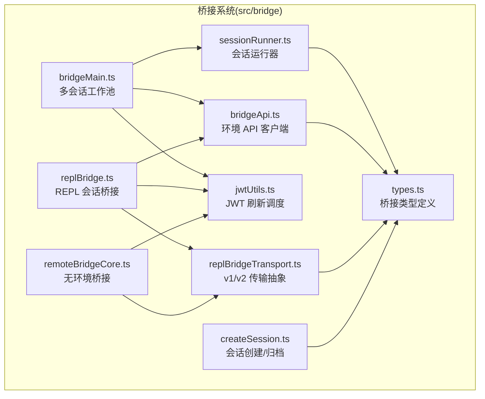
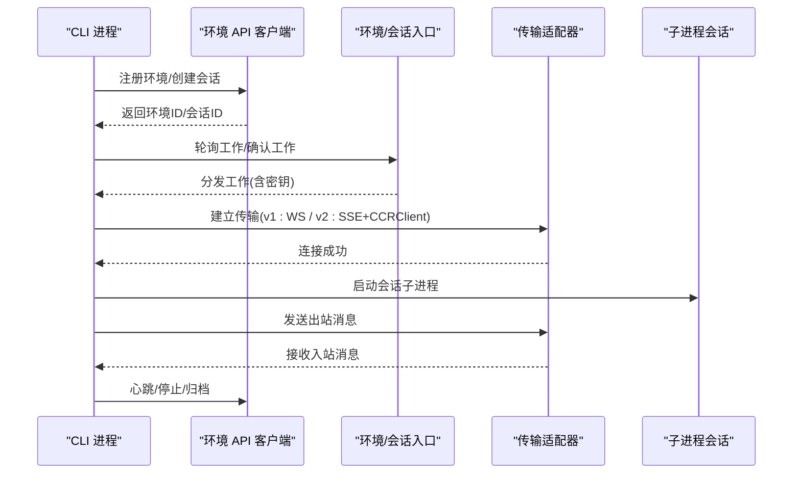
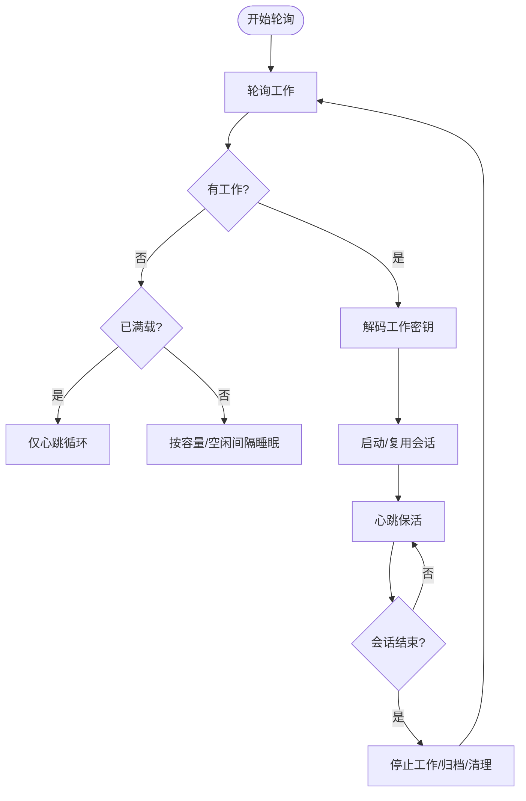
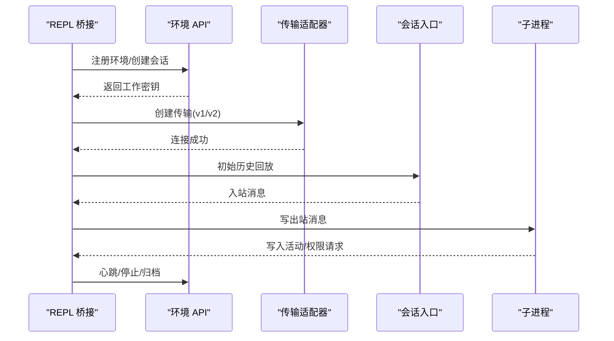
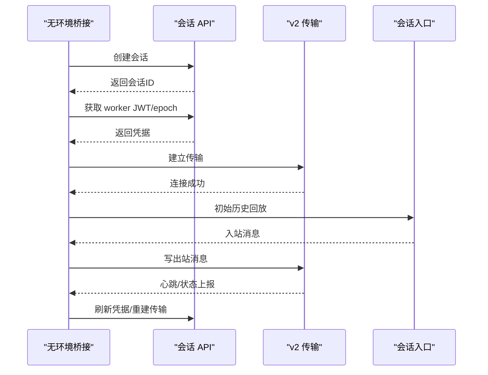
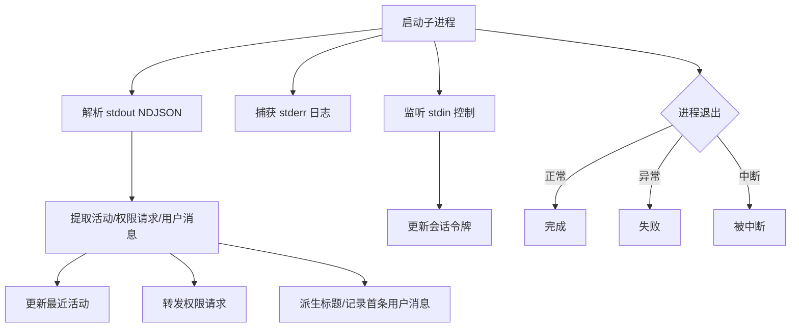
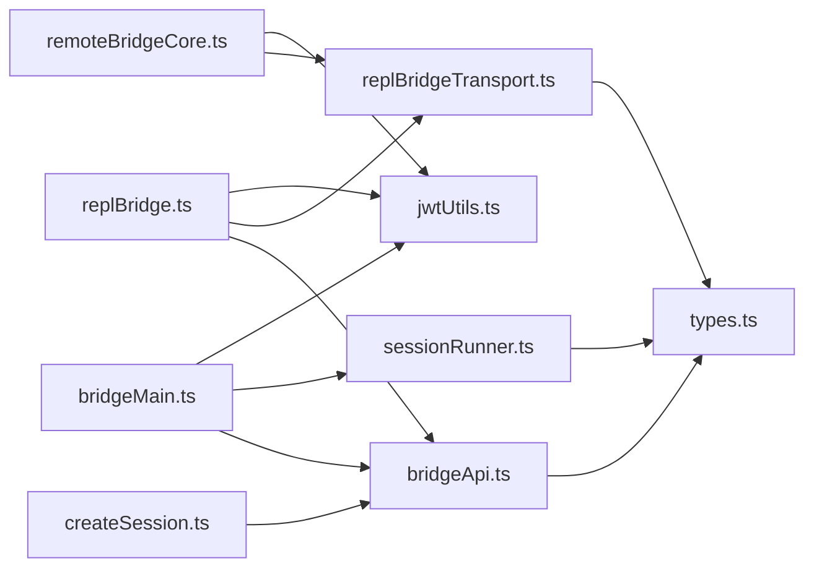

# 桥接系统

<cite>
**本文档引用的文件**
- [README.md](file://README.md)
- [docs/architecture.md](file://docs/architecture.md)
- [docs/bridge.md](file://docs/bridge.md)
- [src/bridge/bridgeMain.ts](file://src/bridge/bridgeMain.ts)
- [src/bridge/replBridge.ts](file://src/bridge/replBridge.ts)
- [src/bridge/sessionRunner.ts](file://src/bridge/sessionRunner.ts)
- [src/bridge/jwtUtils.ts](file://src/bridge/jwtUtils.ts)
- [src/bridge/types.ts](file://src/bridge/types.ts)
- [src/bridge/replBridgeTransport.ts](file://src/bridge/replBridgeTransport.ts)
- [src/bridge/bridgeApi.ts](file://src/bridge/bridgeApi.ts)
- [src/bridge/initReplBridge.ts](file://src/bridge/initReplBridge.ts)
- [src/bridge/createSession.ts](file://src/bridge/createSession.ts)
- [src/bridge/remoteBridgeCore.ts](file://src/bridge/remoteBridgeCore.ts)
</cite>

## 目录
1. [简介](#简介)
2. [项目结构](#项目结构)
3. [核心组件](#核心组件)
4. [架构总览](#架构总览)
5. [详细组件分析](#详细组件分析)
6. [依赖关系分析](#依赖关系分析)
7. [性能考虑](#性能考虑)
8. [故障排除指南](#故障排除指南)
9. [结论](#结论)
10. [附录](#附录)

## 简介
本文件面向 Claude Code 的桥接系统（Bridge），系统性阐述其架构设计与实现细节，覆盖 VS Code 与 JetBrains 插件的集成机制、远程会话管理、JWT 认证与安全通信协议、REPL 桥接、消息传递与状态同步、会话运行器的生命周期与错误恢复、IDE 集成指南、调试技巧、性能优化与故障排除，以及在远程协作与多设备开发中的作用。

## 项目结构
桥接系统位于 `src/bridge/` 目录，采用模块化分层设计：
- 协议与传输：`bridgeApi.ts`（环境 API）、`replBridgeTransport.ts`（v1/v2 传输抽象）
- 核心编排：`bridgeMain.ts`（多会话工作池）、`replBridge.ts`（REPL 会话桥接）、`remoteBridgeCore.ts`（无环境桥接）
- 会话执行：`sessionRunner.ts`（子进程会话管理）、`createSession.ts`（会话创建/归档/重命名）
- 安全与认证：`jwtUtils.ts`（JWT 解码与刷新调度）、`trustedDevice.ts`（可信设备令牌）
- 类型与配置：`types.ts`（桥接类型）、`bridgeConfig.ts`（桥接配置）、`pollConfig*.ts`（轮询策略）

图表来源
- [src/bridge/bridgeMain.ts](file://src/bridge/bridgeMain.ts)
- [src/bridge/replBridge.ts](file://src/bridge/replBridge.ts)
- [src/bridge/remoteBridgeCore.ts](file://src/bridge/remoteBridgeCore.ts)
- [src/bridge/sessionRunner.ts](file://src/bridge/sessionRunner.ts)
- [src/bridge/bridgeApi.ts](file://src/bridge/bridgeApi.ts)
- [src/bridge/replBridgeTransport.ts](file://src/bridge/replBridgeTransport.ts)
- [src/bridge/jwtUtils.ts](file://src/bridge/jwtUtils.ts)
- [src/bridge/createSession.ts](file://src/bridge/createSession.ts)
- [src/bridge/types.ts](file://src/bridge/types.ts)

章节来源
- [README.md](file://README.md)
- [docs/architecture.md](file://docs/architecture.md)
- [docs/bridge.md](file://docs/bridge.md)

## 核心组件
- 环境 API 客户端：封装 `/v1/environments/*` 与 `/v1/sessions/*` 的 OAuth/JWT 调用，支持重试、致命错误分类与幂等操作。
- REPL 桥接核心：负责注册环境、拉取工作、建立传输、处理入站消息、发送出站消息、权限控制请求与响应、心跳与断线重连。
- 无环境桥接核心：直接通过 `/v1/code/sessions` 创建会话并获取 worker JWT，绕过环境派发层，使用 v2 传输协议。
- 会话运行器：以子进程方式运行 CLI 会话，解析 NDJSON 输出、提取活动与权限请求、更新访问令牌、处理中断与退出。
- JWT 刷新调度：基于服务器返回的 `expires_in` 或 JWT 的 `exp` 做前瞻刷新，避免会话中断。
- 传输适配器：统一 v1（HybridTransport）与 v2（SSETransport + CCRClient）的写/读/状态接口，屏蔽底层差异。

章节来源
- [src/bridge/bridgeApi.ts](file://src/bridge/bridgeApi.ts)
- [src/bridge/replBridge.ts](file://src/bridge/replBridge.ts)
- [src/bridge/remoteBridgeCore.ts](file://src/bridge/remoteBridgeCore.ts)
- [src/bridge/sessionRunner.ts](file://src/bridge/sessionRunner.ts)
- [src/bridge/jwtUtils.ts](file://src/bridge/jwtUtils.ts)
- [src/bridge/replBridgeTransport.ts](file://src/bridge/replBridgeTransport.ts)

## 架构总览
桥接系统分为两类路径：
- 环境驱动路径（v1）：通过环境注册 → 工作轮询 → 确认工作 → 建立会话入口 WebSocket，再进入 REPL 桥接循环。
- 无环境路径（v2）：直接创建会话 → 获取 worker JWT → 建立 SSE + CCRClient 传输 → 周期性刷新 JWT 并重建传输。

图表来源
- [src/bridge/bridgeApi.ts](file://src/bridge/bridgeApi.ts)
- [src/bridge/replBridgeTransport.ts](file://src/bridge/replBridgeTransport.ts)
- [src/bridge/replBridge.ts](file://src/bridge/replBridge.ts)
- [src/bridge/remoteBridgeCore.ts](file://src/bridge/remoteBridgeCore.ts)

## 详细组件分析

### 组件 A：多会话工作池（bridgeMain.ts）
- 功能要点
  - 维护活跃会话映射、工作项、心跳定时器、容量唤醒信号、超时与清理队列。
  - 支持多模式（单会话、worktree、same-dir），按容量节流与心跳保活。
  - 处理 JWT 过期与环境丢失：通过 `reconnectSession` 触发服务端重新派发；失败时记录致命错误并决定是否退出。
  - 提供状态显示与日志，支持调试文件输出与会话标题设置。
- 关键流程
  - 轮询工作 → 解码工作密钥 → 建立/复用会话 → 启动子进程 → 心跳保活 → 结束回收。
  - 在容量满载时切换“仅心跳”模式，降低带宽占用。
- 错误恢复
  - 401/403：触发重新派发或致命错误；404/410：环境过期，直接退出。
  - 会话超时：标记为失败并清理资源。
- 性能特性
  - 指数退避与最大等待时间限制，避免风暴式重试。
  - 容量唤醒减少空转等待，提升吞吐。

图表来源
- [src/bridge/bridgeMain.ts](file://src/bridge/bridgeMain.ts)

章节来源
- [src/bridge/bridgeMain.ts](file://src/bridge/bridgeMain.ts)

### 组件 B：REPL 桥接核心（replBridge.ts）
- 功能要点
  - 初始化桥接参数（目录、机器名、分支、Git 信息、标题、基础 URL、工作类型、回调注入）。
  - 注册环境 → 创建会话 → 建立传输 → 初始历史回放 → 入站消息处理 → 出站消息发送 → 权限控制 → 断线重连 → 归档。
  - 支持“用户消息派生标题”策略（首次与第三次触发），并异步生成更佳标题。
  - v1 使用 HybridTransport（WS 读 + HTTP 写），v2 使用 SSETransport + CCRClient（读写均走 CCR）。
- 关键流程
  - onWorkReceived：解码工作密钥 → 选择 v1/v2 传输 → 建立连接 → 刷新 JWT（v2）→ 初始历史回放 → 开始消息泵。
  - 异常恢复：环境丢失 → 重注册 → 尝试原会话重连 → 失败则归档旧会话并创建新会话。
- 安全与去重
  - 入站/出站 UUID 去重集合，防止回环与重复消息。
  - 受信设备令牌头用于高安全级会话。
- 传输抽象
  - ReplBridgeTransport 统一 v1/v2 的写/读/状态/关闭/序列号等接口，便于替换与测试。

图表来源
- [src/bridge/replBridge.ts](file://src/bridge/replBridge.ts)
- [src/bridge/replBridgeTransport.ts](file://src/bridge/replBridgeTransport.ts)
- [src/bridge/bridgeApi.ts](file://src/bridge/bridgeApi.ts)

章节来源
- [src/bridge/replBridge.ts](file://src/bridge/replBridge.ts)
- [src/bridge/replBridgeTransport.ts](file://src/bridge/replBridgeTransport.ts)

### 组件 C：无环境桥接核心（remoteBridgeCore.ts）
- 功能要点
  - 直接创建会话（无需环境 ID）→ 获取 worker JWT 与 worker_epoch → 建立 v2 传输 → 周期性刷新 JWT 并重建传输。
  - 401 自动恢复：刷新 OAuth 后重新获取 JWT 并重建传输。
  - 支持仅出站模式（镜像模式），不接收入站提示。
- 关键流程
  - withRetry 包装关键步骤（创建会话、获取凭据、传输初始化）。
  - rebuildTransport：在刷新或 401 时重建传输，保持 SSE 序列号连续，避免历史重放。
  - teardown：优雅归档会话，处理 401 重试，记录遥测指标。
- 与 REPL 桥接的差异
  - REPL 桥接支持环境轮询与工作派发；无环境桥接直接对接会话入口，适合 REPL 场景。
  - 无环境桥接强制使用 v2 传输，简化了环境层依赖。

图表来源
- [src/bridge/remoteBridgeCore.ts](file://src/bridge/remoteBridgeCore.ts)
- [src/bridge/replBridgeTransport.ts](file://src/bridge/replBridgeTransport.ts)

章节来源
- [src/bridge/remoteBridgeCore.ts](file://src/bridge/remoteBridgeCore.ts)

### 组件 D：会话运行器（sessionRunner.ts）
- 功能要点
  - 子进程启动：传入 SDK URL、会话 ID、输入/输出格式、调试文件、权限模式等。
  - 输出解析：从 stdout 解析 NDJSON，提取工具调用、文本块、结果与错误，维护最近活动列表。
  - 权限请求：当子进程发出 `control_request` 时，通过回调转发到桥接层进行用户决策。
  - 令牌更新：通过 stdin 接收 `update_environment_variables` 消息，动态更新会话访问令牌。
  - 中断与退出：支持 SIGTERM/SIGINT 正常中断与 SIGKILL 强制终止。
- 设计模式
  - 事件驱动：基于 readline 流解析，低耦合地抽取活动与控制请求。
  - 安全隔离：子进程独立运行，桥接通过标准输入输出与之交互。

图表来源
- [src/bridge/sessionRunner.ts](file://src/bridge/sessionRunner.ts)

章节来源
- [src/bridge/sessionRunner.ts](file://src/bridge/sessionRunner.ts)

### 组件 E：JWT 认证与刷新（jwtUtils.ts）
- 功能要点
  - JWT 载荷解码：剥离前缀并解析 base64url 的 payload，提取 `exp`。
  - 刷新调度：基于 `exp` 或 `expires_in` 提前 5 分钟触发刷新，避免会话中断。
  - 生成/取消定时器：按会话维度管理刷新计划，支持并发刷新的代际控制。
  - 回退策略：当无法获取 OAuth 令牌时，按固定间隔重试，最多 3 次。
- 与桥接的集成
  - REPL 桥接：在 v1（OAuth 令牌）与 v2（会话入口 JWT）场景下分别处理刷新。
  - 无环境桥接：周期性调用 `/bridge` 获取新 JWT 与新 epoch，并重建传输。

章节来源
- [src/bridge/jwtUtils.ts](file://src/bridge/jwtUtils.ts)
- [src/bridge/replBridge.ts](file://src/bridge/replBridge.ts)
- [src/bridge/remoteBridgeCore.ts](file://src/bridge/remoteBridgeCore.ts)

### 组件 F：类型与配置（types.ts、bridgeConfig.ts、pollConfig*.ts）
- 类型体系
  - WorkData/WorkResponse：工作项数据结构。
  - WorkSecret：工作密钥（会话入口令牌、API 基础 URL、源与认证信息、可选 MCP 配置）。
  - SessionHandle：会话句柄（生命周期、活动、令牌、错误缓冲、写入 stdin、更新令牌）。
  - BridgeApiClient：环境 API 客户端接口（注册/轮询/确认/停止/注销/归档/重连/心跳/权限事件）。
  - BridgeConfig：桥接配置（目录、机器名、分支、Git 仓库、最大会话数、工作模式、调试文件、会话超时等）。
- 配置与策略
  - 轮询间隔配置：根据增长书门控与运行时参数动态调整。
  - 最小版本检查：确保客户端与服务端兼容。
  - 环境/会话 ID 校验：URL 路径安全校验，防止注入。

章节来源
- [src/bridge/types.ts](file://src/bridge/types.ts)

## 依赖关系分析
- 模块内聚与耦合
  - bridgeMain.ts 与 replBridge.ts 高度耦合于环境 API 与传输抽象；通过接口（BridgeApiClient、ReplBridgeTransport）降低直接依赖。
  - sessionRunner.ts 与 replBridge.ts 通过消息协议（NDJSON）解耦，仅共享类型定义。
  - jwtUtils.ts 作为通用工具被多处调用，保持纯函数与可测试性。
- 外部依赖
  - HTTP 客户端（axios）用于 API 调用。
  - 子进程（child_process）用于运行 CLI 会话。
  - 事件与流（readline、stream）用于解析与传输。
- 循环依赖
  - 未发现循环导入；各模块通过接口与类型文件解耦。

图表来源
- [src/bridge/bridgeMain.ts](file://src/bridge/bridgeMain.ts)
- [src/bridge/replBridge.ts](file://src/bridge/replBridge.ts)
- [src/bridge/remoteBridgeCore.ts](file://src/bridge/remoteBridgeCore.ts)
- [src/bridge/sessionRunner.ts](file://src/bridge/sessionRunner.ts)
- [src/bridge/bridgeApi.ts](file://src/bridge/bridgeApi.ts)
- [src/bridge/replBridgeTransport.ts](file://src/bridge/replBridgeTransport.ts)
- [src/bridge/jwtUtils.ts](file://src/bridge/jwtUtils.ts)
- [src/bridge/createSession.ts](file://src/bridge/createSession.ts)
- [src/bridge/types.ts](file://src/bridge/types.ts)

章节来源
- [src/bridge/bridgeMain.ts](file://src/bridge/bridgeMain.ts)
- [src/bridge/replBridge.ts](file://src/bridge/replBridge.ts)
- [src/bridge/remoteBridgeCore.ts](file://src/bridge/remoteBridgeCore.ts)
- [src/bridge/sessionRunner.ts](file://src/bridge/sessionRunner.ts)
- [src/bridge/bridgeApi.ts](file://src/bridge/bridgeApi.ts)
- [src/bridge/replBridgeTransport.ts](file://src/bridge/replBridgeTransport.ts)
- [src/bridge/jwtUtils.ts](file://src/bridge/jwtUtils.ts)
- [src/bridge/createSession.ts](file://src/bridge/createSession.ts)
- [src/bridge/types.ts](file://src/bridge/types.ts)

## 性能考虑
- 轮询与心跳
  - 空闲/部分占用/满载三种轮询间隔策略，结合心跳保活，平衡延迟与资源消耗。
  - 最大退避时间与放弃阈值避免长时间抖动。
- 传输效率
  - v2 使用 SSE + CCRClient，写路径批量上传，读路径事件流，减少 HTTP 调用次数。
  - 传输重建时携带 SSE 序列号，避免历史重放。
- 令牌刷新
  - 前瞻 5 分钟刷新，配合回退刷新间隔，降低会话中断概率。
- 日志与诊断
  - 调试文件与诊断日志分离，支持按会话 ID 与序列号定位问题。
- 并发与容量
  - 多会话模式下，容量唤醒与心跳组合减少空转，提高吞吐。

## 故障排除指南
- 常见错误与处理
  - 401/403：认证失败或权限不足。检查 OAuth 令牌有效性与组织策略；必要时触发刷新或重新登录。
  - 404/410：环境/会话过期。触发重注册/重连或重新创建会话。
  - 429：速率限制。降低轮询频率或等待冷却。
  - 传输关闭：区分 401（JWT 过期）与 409（epoch 不匹配/初始化失败）。前者自动刷新重建，后者需重建传输。
- 调试技巧
  - 启用调试文件：`--debug-file` 指定日志文件，查看桥接与会话子进程的详细输出。
  - 查看诊断日志：关注“桥接会话完成/失败/中断”等事件，结合时间戳定位问题。
  - 传输状态：观察“连接/重连/失败”状态变化，判断网络与服务端稳定性。
- 会话恢复
  - REPL 桥接支持“崩溃恢复指针”，在重启后尝试复用先前会话。
  - 无环境桥接每次创建新会话，但可通过标题派生与历史回放提升体验。

章节来源
- [src/bridge/bridgeApi.ts](file://src/bridge/bridgeApi.ts)
- [src/bridge/replBridge.ts](file://src/bridge/replBridge.ts)
- [src/bridge/remoteBridgeCore.ts](file://src/bridge/remoteBridgeCore.ts)
- [src/bridge/bridgeMain.ts](file://src/bridge/bridgeMain.ts)

## 结论
桥接系统通过“环境驱动路径（v1）”与“无环境路径（v2）”两种模式，实现了对 VS Code 与 JetBrains 插件的统一接入。其核心在于：
- 明确的传输抽象与协议适配（v1/v2），保证跨平台一致性；
- 健壮的心跳与断线重连机制，保障长连接稳定性；
- 周期性 JWT 刷新与传输重建，避免会话中断；
- 会话运行器的事件驱动与安全隔离，确保工具链与 IDE 的无缝协同；
- 丰富的遥测与日志，支撑远程协作与多设备开发场景下的可观测性与可维护性。

## 附录

### IDE 集成指南（VS Code / JetBrains / Web）
- VS Code
  - 在 `.vscode/mcp.json` 中添加 Claude Code Explorer 服务器，指定 `node` 与 `mcp-server/dist/index.js`。
  - 设置 `CLAUDE_CODE_SRC_ROOT` 指向 `src/` 目录，以便 MCP 服务器读取源码。
- JetBrains
  - 类似 VS Code 的 MCP 配置，指向本地构建产物。
- Web
  - 通过 `claude.ai/code?bridge={environmentId}` 打开远程控制界面。
- 远程控制命令
  - `claude remote-control`：启动 REPL 桥接，支持单会话、worktree、same-dir 三种模式。
  - `--session-id <id>`：恢复已有会话。
  - `--debug-file <path>`：输出调试日志。
  - `--remote-control [name]`：预启用桥接并指定会话名称。

章节来源
- [README.md](file://README.md)
- [docs/bridge.md](file://docs/bridge.md)