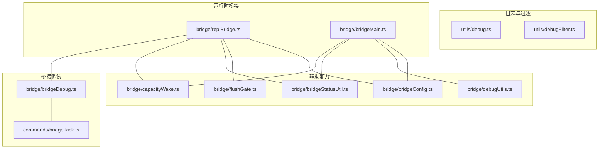
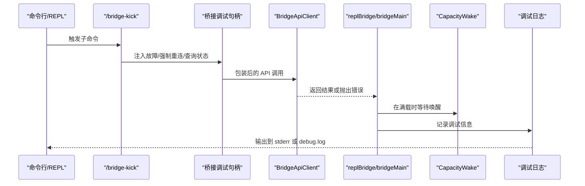
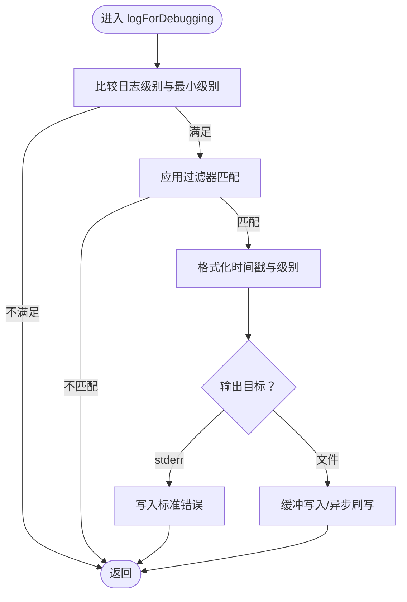
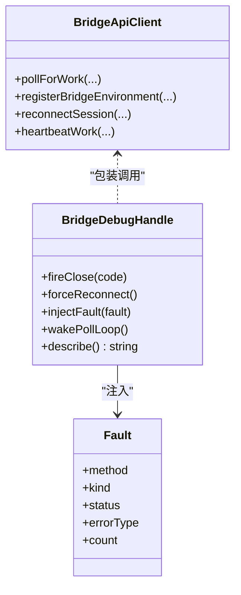
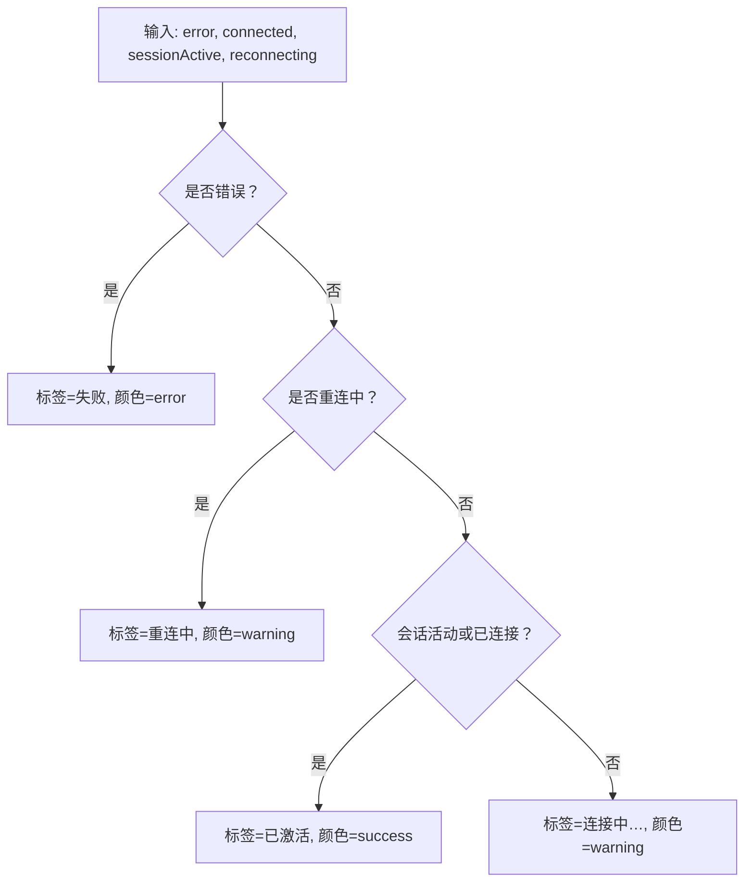
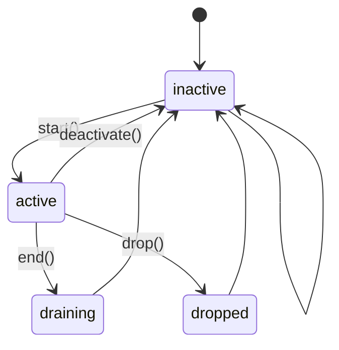
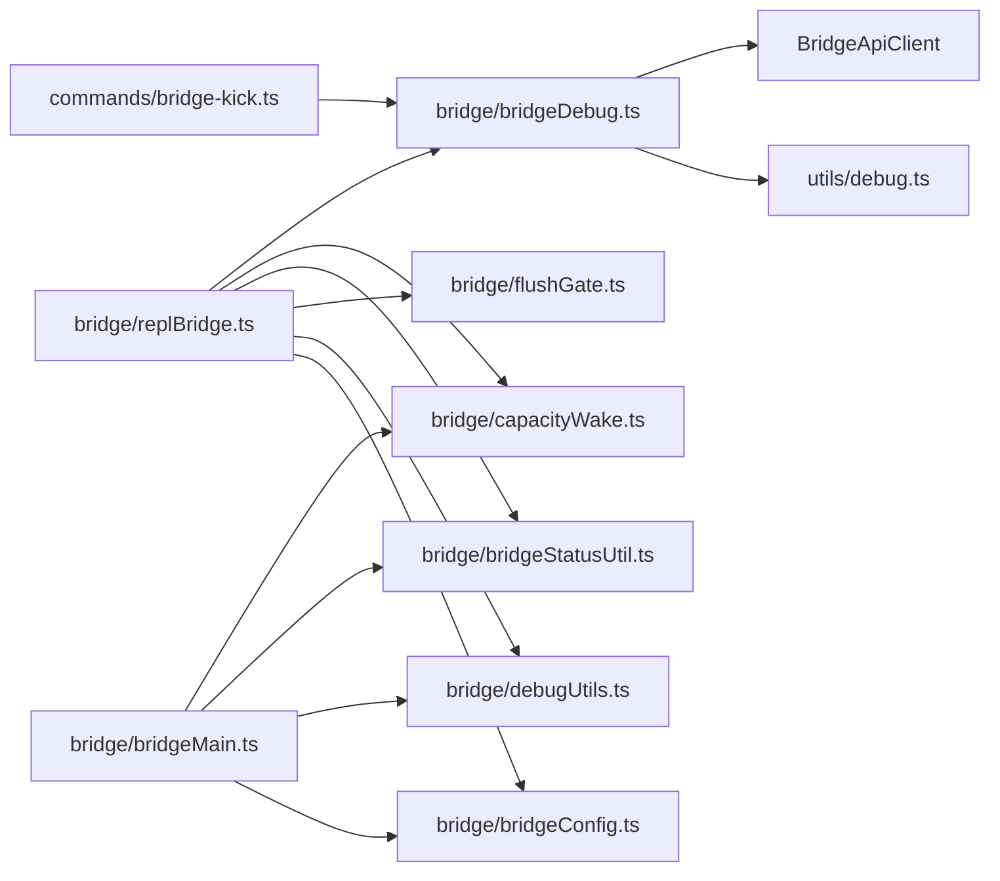

# 桥接系统调试

<cite>
**本文引用的文件**   
- [src/bridge/bridgeDebug.ts](file://src/bridge/bridgeDebug.ts)
- [src/bridge/debugUtils.ts](file://src/bridge/debugUtils.ts)
- [src/bridge/capacityWake.ts](file://src/bridge/capacityWake.ts)
- [src/bridge/bridgeStatusUtil.ts](file://src/bridge/bridgeStatusUtil.ts)
- [src/bridge/bridgeConfig.ts](file://src/bridge/bridgeConfig.ts)
- [src/utils/debug.ts](file://src/utils/debug.ts)
- [src/utils/debugFilter.ts](file://src/utils/debugFilter.ts)
- [src/bridge/replBridge.ts](file://src/bridge/replBridge.ts)
- [src/bridge/bridgeMain.ts](file://src/bridge/bridgeMain.ts)
- [src/commands/bridge-kick.ts](file://src/commands/bridge-kick.ts)
- [src/bridge/flushGate.ts](file://src/bridge/flushGate.ts)
- [src/services/diagnosticTracking.ts](file://src/services/diagnosticTracking.ts)
</cite>

## 目录
1. [简介](#简介)
2. [项目结构](#项目结构)
3. [核心组件](#核心组件)
4. [架构总览](#架构总览)
5. [详细组件分析](#详细组件分析)
6. [依赖关系分析](#依赖关系分析)
7. [性能考量](#性能考量)
8. [故障排除指南](#故障排除指南)
9. [结论](#结论)
10. [附录](#附录)

## 简介
本指南面向 Claude Code 的桥接系统（Remote Control）调试与诊断，聚焦以下目标：
- 调试输出格式、日志级别与过滤机制
- 性能监控与诊断工具：容量唤醒机制、状态显示与性能指标采集
- 常见问题诊断：连接失败、会话异常、性能问题的排查步骤
- 调试配置选项与工具使用指南
- 调试信息的分析与解读方法
- 故障排除最佳实践与解决方案

## 项目结构
桥接系统的调试相关代码主要分布在以下模块：
- 日志与调试：utils/debug.ts、utils/debugFilter.ts
- 桥接调试与故障注入：src/bridge/bridgeDebug.ts、src/commands/bridge-kick.ts
- 容量唤醒与状态显示：src/bridge/capacityWake.ts、src/bridge/bridgeStatusUtil.ts
- 配置与认证：src/bridge/bridgeConfig.ts
- 运行时桥接逻辑：src/bridge/replBridge.ts、src/bridge/bridgeMain.ts
- 初始消息写入门控：src/bridge/flushGate.ts
- 诊断跟踪（IDE/LSP）：src/services/diagnosticTracking.ts



图示来源
- [src/utils/debug.ts:1-270](file://src/utils/debug.ts#L1-L270)
- [src/utils/debugFilter.ts:1-45](file://src/utils/debugFilter.ts#L1-L45)
- [src/bridge/bridgeDebug.ts:1-138](file://src/bridge/bridgeDebug.ts#L1-L138)
- [src/commands/bridge-kick.ts:1-203](file://src/commands/bridge-kick.ts#L1-L203)
- [src/bridge/replBridge.ts:1-2409](file://src/bridge/replBridge.ts#L1-L2409)
- [src/bridge/bridgeMain.ts:1-3002](file://src/bridge/bridgeMain.ts#L1-L3002)
- [src/bridge/capacityWake.ts:1-59](file://src/bridge/capacityWake.ts#L1-L59)
- [src/bridge/bridgeStatusUtil.ts:1-166](file://src/bridge/bridgeStatusUtil.ts#L1-L166)
- [src/bridge/flushGate.ts:1-74](file://src/bridge/flushGate.ts#L1-L74)
- [src/bridge/debugUtils.ts:1-144](file://src/bridge/debugUtils.ts#L1-L144)
- [src/bridge/bridgeConfig.ts:1-51](file://src/bridge/bridgeConfig.ts#L1-L51)

章节来源
- [src/utils/debug.ts:1-270](file://src/utils/debug.ts#L1-L270)
- [src/bridge/bridgeDebug.ts:1-138](file://src/bridge/bridgeDebug.ts#L1-L138)
- [src/commands/bridge-kick.ts:1-203](file://src/commands/bridge-kick.ts#L1-L203)
- [src/bridge/replBridge.ts:1-2409](file://src/bridge/replBridge.ts#L1-L2409)
- [src/bridge/bridgeMain.ts:1-3002](file://src/bridge/bridgeMain.ts#L1-L3002)
- [src/bridge/capacityWake.ts:1-59](file://src/bridge/capacityWake.ts#L1-L59)
- [src/bridge/bridgeStatusUtil.ts:1-166](file://src/bridge/bridgeStatusUtil.ts#L1-L166)
- [src/bridge/flushGate.ts:1-74](file://src/bridge/flushGate.ts#L1-L74)
- [src/bridge/debugUtils.ts:1-144](file://src/bridge/debugUtils.ts#L1-L144)
- [src/bridge/bridgeConfig.ts:1-51](file://src/bridge/bridgeConfig.ts#L1-L51)

## 核心组件
- 调试日志系统：统一的日志级别、过滤器、输出位置与缓冲策略，支持标准错误输出与文件落盘，并维护“最新日志”符号链接。
- 桥接调试与故障注入：在特定用户类型下提供故障注入与强制重连能力，便于复现与验证恢复路径。
- 容量唤醒机制：在“满载”状态下睡眠并可被事件唤醒，避免无谓轮询。
- 状态显示与 URL 构建：桥接状态标签、颜色、超链接 URL 生成与闪烁动画片段计算。
- 初始消息写入门控：在初始历史消息批量刷新期间阻塞新消息写入，防止乱序。
- 配置与认证：桥接访问令牌与基础 URL 的优先级解析（开发覆盖优先于 OAuth 存储）。

章节来源
- [src/utils/debug.ts:18-270](file://src/utils/debug.ts#L18-L270)
- [src/bridge/bridgeDebug.ts:21-138](file://src/bridge/bridgeDebug.ts#L21-L138)
- [src/bridge/capacityWake.ts:11-59](file://src/bridge/capacityWake.ts#L11-L59)
- [src/bridge/bridgeStatusUtil.ts:9-166](file://src/bridge/bridgeStatusUtil.ts#L9-L166)
- [src/bridge/flushGate.ts:16-74](file://src/bridge/flushGate.ts#L16-L74)
- [src/bridge/bridgeConfig.ts:17-51](file://src/bridge/bridgeConfig.ts#L17-L51)

## 架构总览
桥接系统在 REPL 与主进程两种形态中运行，均通过 API 客户端与后端交互，采用容量唤醒与门控机制保证稳定与有序的消息处理。



图示来源
- [src/commands/bridge-kick.ts:51-189](file://src/commands/bridge-kick.ts#L51-L189)
- [src/bridge/bridgeDebug.ts:70-135](file://src/bridge/bridgeDebug.ts#L70-L135)
- [src/bridge/replBridge.ts:64-68](file://src/bridge/replBridge.ts#L64-L68)
- [src/bridge/bridgeMain.ts:194-194](file://src/bridge/bridgeMain.ts#L194-L194)
- [src/utils/debug.ts:203-228](file://src/utils/debug.ts#L203-L228)

## 详细组件分析

### 调试日志系统与过滤
- 日志级别：verbose、debug、info、warn、error；可通过环境变量设置最小级别，默认为 debug。
- 过滤机制：支持基于模式的包含/排除过滤，混合使用时按规则降级为无过滤。
- 输出目标：默认写入会话专属 debug.log 文件，也可输出到标准错误；支持“最新日志”符号链接自动更新。
- 缓冲策略：非调试模式下每秒异步刷写，避免事件循环挂起；调试模式下同步写入以保证完整性。
- 安全性：对敏感字段进行脱敏处理，限制单条日志长度，必要时转为 JSON 字符串。



图示来源
- [src/utils/debug.ts:18-270](file://src/utils/debug.ts#L18-L270)
- [src/utils/debugFilter.ts:9-45](file://src/utils/debugFilter.ts#L9-L45)

章节来源
- [src/utils/debug.ts:18-270](file://src/utils/debug.ts#L18-L270)
- [src/utils/debugFilter.ts:9-45](file://src/utils/debugFilter.ts#L9-L45)

### 桥接调试与故障注入
- 故障注入：针对 poll、注册、重连、心跳等关键 API 方法，按需注入致命或瞬态错误，用于测试恢复路径。
- 强制重连：直接触发环境重连流程，模拟 SIGUSR2 行为。
- 状态查询：打印当前桥接环境与会话标识，便于 grep 定位日志。
- 仅限特定用户类型：在外部构建中零开销，仅在内部测试用户类型下启用。



图示来源
- [src/bridge/bridgeDebug.ts:38-135](file://src/bridge/bridgeDebug.ts#L38-L135)
- [src/commands/bridge-kick.ts:51-189](file://src/commands/bridge-kick.ts#L51-L189)

章节来源
- [src/bridge/bridgeDebug.ts:21-138](file://src/bridge/bridgeDebug.ts#L21-L138)
- [src/commands/bridge-kick.ts:1-203](file://src/commands/bridge-kick.ts#L1-L203)

### 容量唤醒机制
- 目标：在“满载”状态下睡眠，当外部信号或容量释放事件发生时提前唤醒，避免无效轮询。
- 实现：合并外层控制信号与容量唤醒控制器信号，提供一次性唤醒与清理回调。

```mermaid
sequenceDiagram
participant Loop as "桥接轮询"
participant Cap as "CapacityWake"
participant Sig as "AbortSignal"
Loop->>Cap : signal()
Cap-->>Loop : 合并后的 AbortSignal
Loop->>Loop : 等待信号或超时
Note over Loop : 若容量释放或外部中断
Loop->>Cap : wake()
Cap-->>Loop : 立即退出等待
```

图示来源
- [src/bridge/capacityWake.ts:28-56](file://src/bridge/capacityWake.ts#L28-L56)
- [src/bridge/bridgeMain.ts:194-194](file://src/bridge/bridgeMain.ts#L194-L194)
- [src/bridge/replBridge.ts:55-55](file://src/bridge/replBridge.ts#L55-L55)

章节来源
- [src/bridge/capacityWake.ts:11-59](file://src/bridge/capacityWake.ts#L11-L59)
- [src/bridge/bridgeMain.ts:141-200](file://src/bridge/bridgeMain.ts#L141-L200)
- [src/bridge/replBridge.ts:1-200](file://src/bridge/replBridge.ts#L1-L200)

### 状态显示与 URL 构建
- 状态标签与颜色：根据错误、重连、会话活动与连接状态生成标签与颜色。
- URL 构建：连接 URL 与会话 URL，支持自定义 ingress 地址。
- 动画片段：基于图形段分割与视觉宽度计算闪烁片段，确保多字节字符与表情正确渲染。



图示来源
- [src/bridge/bridgeStatusUtil.ts:124-141](file://src/bridge/bridgeStatusUtil.ts#L124-L141)
- [src/bridge/bridgeStatusUtil.ts:39-58](file://src/bridge/bridgeStatusUtil.ts#L39-L58)
- [src/bridge/bridgeStatusUtil.ts:79-111](file://src/bridge/bridgeStatusUtil.ts#L79-L111)

章节来源
- [src/bridge/bridgeStatusUtil.ts:9-166](file://src/bridge/bridgeStatusUtil.ts#L9-L166)

### 初始消息写入门控
- 目标：在初始历史消息批量刷新期间阻塞新消息写入，防止与历史消息交错。
- 生命周期：start() 开启队列，end() 返回队列并结束，drop() 放弃队列，deactivate() 清理但保留队列（传输替换场景）。



图示来源
- [src/bridge/flushGate.ts:16-74](file://src/bridge/flushGate.ts#L16-L74)

章节来源
- [src/bridge/flushGate.ts:1-74](file://src/bridge/flushGate.ts#L1-L74)

### 配置与认证
- 访问令牌优先级：开发覆盖（环境变量）优先于 OAuth 存储；基础 URL 同理。
- 适用范围：适用于桥接 API 调用与相关工具链。

章节来源
- [src/bridge/bridgeConfig.ts:17-51](file://src/bridge/bridgeConfig.ts#L17-L51)

### 诊断工具与日志增强
- 错误描述增强：从 axios 错误中提取服务器响应详情与状态码，便于定位。
- 诊断跟踪：对 IDE/LSP 诊断进行基线对比与增量提取，支持摘要格式化与截断。

章节来源
- [src/bridge/debugUtils.ts:55-144](file://src/bridge/debugUtils.ts#L55-L144)
- [src/services/diagnosticTracking.ts:30-399](file://src/services/diagnosticTracking.ts#L30-L399)

## 依赖关系分析
- 日志系统被广泛使用于桥接与诊断模块，形成统一的调试输出入口。
- 桥接调试模块依赖日志系统与 API 客户端包装，向 REPL/主进程注入故障。
- 容量唤醒与门控分别服务于轮询与消息顺序控制，降低资源消耗并提升稳定性。
- 状态工具为 UI 层提供状态标签与 URL 构建，提升可观测性。



图示来源
- [src/bridge/bridgeDebug.ts:1-138](file://src/bridge/bridgeDebug.ts#L1-L138)
- [src/utils/debug.ts:1-270](file://src/utils/debug.ts#L1-L270)
- [src/commands/bridge-kick.ts:1-203](file://src/commands/bridge-kick.ts#L1-L203)
- [src/bridge/replBridge.ts:1-2409](file://src/bridge/replBridge.ts#L1-L2409)
- [src/bridge/bridgeMain.ts:1-3002](file://src/bridge/bridgeMain.ts#L1-L3002)
- [src/bridge/capacityWake.ts:1-59](file://src/bridge/capacityWake.ts#L1-L59)
- [src/bridge/bridgeStatusUtil.ts:1-166](file://src/bridge/bridgeStatusUtil.ts#L1-L166)
- [src/bridge/flushGate.ts:1-74](file://src/bridge/flushGate.ts#L1-L74)
- [src/bridge/debugUtils.ts:1-144](file://src/bridge/debugUtils.ts#L1-L144)
- [src/bridge/bridgeConfig.ts:1-51](file://src/bridge/bridgeConfig.ts#L1-L51)

章节来源
- [src/bridge/bridgeDebug.ts:1-138](file://src/bridge/bridgeDebug.ts#L1-L138)
- [src/utils/debug.ts:1-270](file://src/utils/debug.ts#L1-L270)
- [src/commands/bridge-kick.ts:1-203](file://src/commands/bridge-kick.ts#L1-L203)
- [src/bridge/replBridge.ts:1-2409](file://src/bridge/replBridge.ts#L1-L2409)
- [src/bridge/bridgeMain.ts:1-3002](file://src/bridge/bridgeMain.ts#L1-L3002)
- [src/bridge/capacityWake.ts:1-59](file://src/bridge/capacityWake.ts#L1-L59)
- [src/bridge/bridgeStatusUtil.ts:1-166](file://src/bridge/bridgeStatusUtil.ts#L1-L166)
- [src/bridge/flushGate.ts:1-74](file://src/bridge/flushGate.ts#L1-L74)
- [src/bridge/debugUtils.ts:1-144](file://src/bridge/debugUtils.ts#L1-L144)
- [src/bridge/bridgeConfig.ts:1-51](file://src/bridge/bridgeConfig.ts#L1-L51)

## 性能考量
- 轮询与回退：桥接主循环内置回退配置，检测系统休眠阈值高于最大回退上限，避免误判导致预算重置。
- 容量唤醒：减少空转轮询，提高吞吐与能效。
- 刷新与缓冲：调试日志在非调试模式下采用异步缓冲与定时刷写，平衡 I/O 与稳定性。
- 诊断摘要：对诊断信息进行截断与符号化，避免冗长输出影响性能。

章节来源
- [src/bridge/bridgeMain.ts:107-109](file://src/bridge/bridgeMain.ts#L107-L109)
- [src/bridge/capacityWake.ts:28-56](file://src/bridge/capacityWake.ts#L28-L56)
- [src/utils/debug.ts:155-201](file://src/utils/debug.ts#L155-L201)
- [src/services/diagnosticTracking.ts:352-394](file://src/services/diagnosticTracking.ts#L352-L394)

## 故障排除指南

### 连接失败
- 使用桥接调试命令注入瞬态/致命错误，观察恢复路径与日志标记：
  - 瞬态：模拟网络/5xx 错误，验证重试与回退。
  - 致命：模拟 404/401 等，验证环境丢失与会话 teardown。
- 关键日志关键词：[bridge:debug]、[bridge:repl]、fatal/error 类型。
- 参考命令与注入点：
  - [src/commands/bridge-kick.ts:76-114](file://src/commands/bridge-kick.ts#L76-L114)
  - [src/bridge/bridgeDebug.ts:70-135](file://src/bridge/bridgeDebug.ts#L70-L135)

章节来源
- [src/commands/bridge-kick.ts:1-203](file://src/commands/bridge-kick.ts#L1-L203)
- [src/bridge/bridgeDebug.ts:1-138](file://src/bridge/bridgeDebug.ts#L1-L138)

### 会话异常
- 使用初始消息写入门控确认历史消息刷新期间的消息顺序问题。
- 检查容量唤醒是否及时唤醒，避免长时间阻塞。
- 参考：
  - [src/bridge/flushGate.ts:16-74](file://src/bridge/flushGate.ts#L16-L74)
  - [src/bridge/capacityWake.ts:28-56](file://src/bridge/capacityWake.ts#L28-L56)

章节来源
- [src/bridge/flushGate.ts:1-74](file://src/bridge/flushGate.ts#L1-L74)
- [src/bridge/capacityWake.ts:1-59](file://src/bridge/capacityWake.ts#L1-L59)

### 性能问题
- 提升日志级别：设置环境变量以捕获更详细输出，结合过滤器缩小范围。
- 分析诊断摘要：对 IDE/LSP 诊断进行增量提取，定位热点文件与严重级别。
- 参考：
  - [src/utils/debug.ts:28-40](file://src/utils/debug.ts#L28-L40)
  - [src/services/diagnosticTracking.ts:352-394](file://src/services/diagnosticTracking.ts#L352-L394)

章节来源
- [src/utils/debug.ts:18-270](file://src/utils/debug.ts#L18-L270)
- [src/services/diagnosticTracking.ts:30-399](file://src/services/diagnosticTracking.ts#L30-L399)

### 调试配置与工具使用
- 启用调试：启动参数或运行时命令开启调试模式，或设置最小日志级别。
- 输出目标：选择标准错误输出或指定日志文件路径，维护“最新日志”符号链接。
- 过滤器：使用包含/排除模式组合，避免混合使用导致降级。
- 参考：
  - [src/utils/debug.ts:44-102](file://src/utils/debug.ts#L44-L102)
  - [src/utils/debug.ts:230-253](file://src/utils/debug.ts#L230-L253)
  - [src/utils/debugFilter.ts:16-45](file://src/utils/debugFilter.ts#L16-L45)

章节来源
- [src/utils/debug.ts:1-270](file://src/utils/debug.ts#L1-L270)
- [src/utils/debugFilter.ts:1-45](file://src/utils/debugFilter.ts#L1-L45)

### 调试信息分析与解读
- 错误描述增强：从 axios 响应中提取 message/detail，辅助快速定位。
- 状态标签：依据连接/会话/重连状态生成标签与颜色，便于 UI 快速识别。
- 参考：
  - [src/bridge/debugUtils.ts:55-121](file://src/bridge/debugUtils.ts#L55-L121)
  - [src/bridge/bridgeStatusUtil.ts:124-141](file://src/bridge/bridgeStatusUtil.ts#L124-L141)

章节来源
- [src/bridge/debugUtils.ts:1-144](file://src/bridge/debugUtils.ts#L1-L144)
- [src/bridge/bridgeStatusUtil.ts:1-166](file://src/bridge/bridgeStatusUtil.ts#L1-L166)

## 结论
通过统一的日志系统、可注入的故障场景、容量唤醒与门控机制，以及状态与诊断工具，桥接系统具备了完善的可观测性与可调试性。建议在问题复现阶段优先使用桥接调试命令与过滤器，结合状态标签与诊断摘要，快速定位根因并验证修复效果。

## 附录

### 常用调试命令与参数
- 启用调试模式与最小日志级别
  - [src/utils/debug.ts:28-40](file://src/utils/debug.ts#L28-L40)
- 输出到标准错误
  - [src/utils/debug.ts:85-89](file://src/utils/debug.ts#L85-L89)
- 指定日志文件路径
  - [src/utils/debug.ts:91-102](file://src/utils/debug.ts#L91-L102)
- 过滤器语法
  - [src/utils/debugFilter.ts:16-45](file://src/utils/debugFilter.ts#L16-L45)

### 桥接调试命令参考
- 注入瞬态/致命错误、强制重连、查询状态
  - [src/commands/bridge-kick.ts:40-189](file://src/commands/bridge-kick.ts#L40-L189)