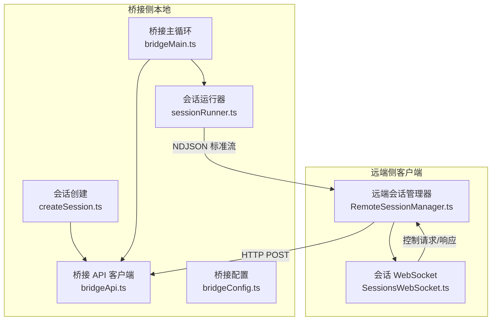
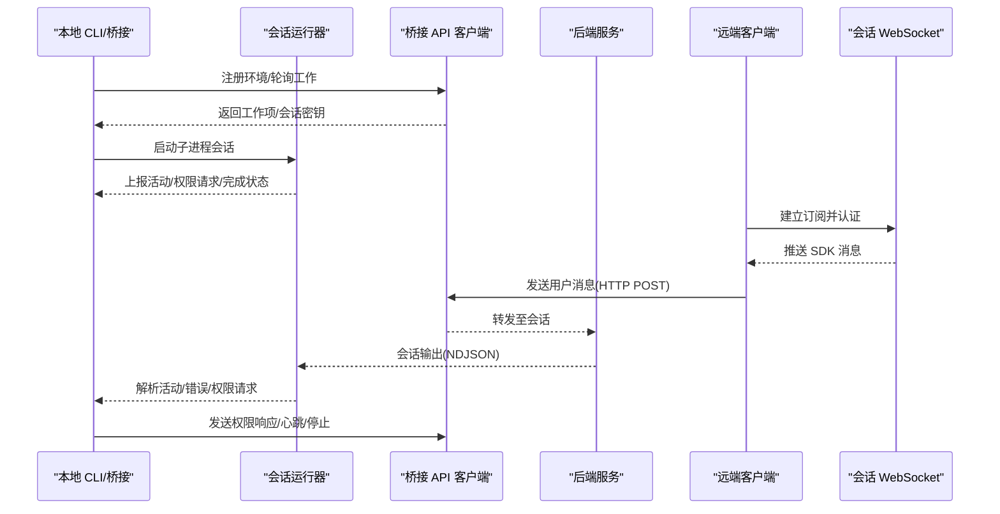
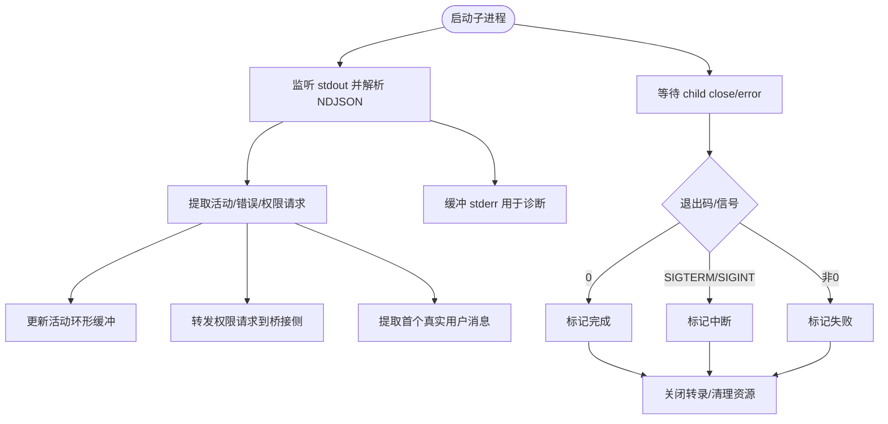
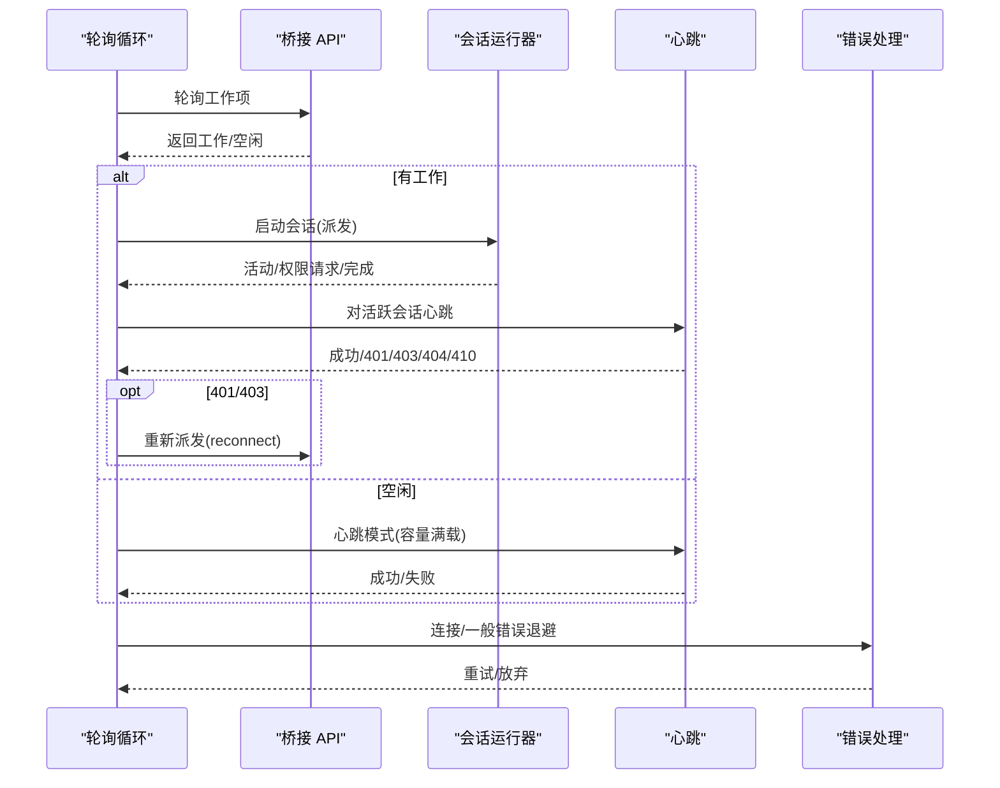
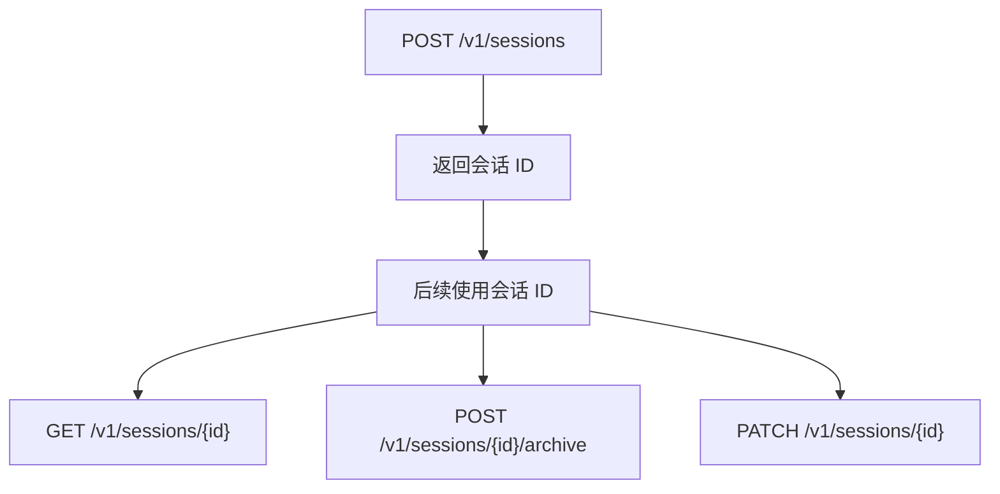
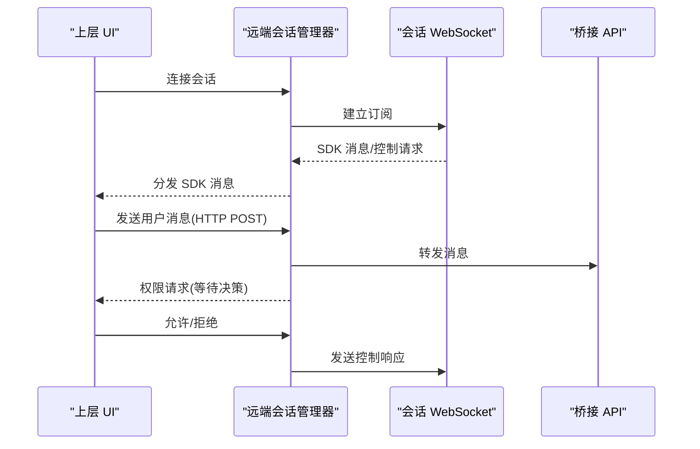
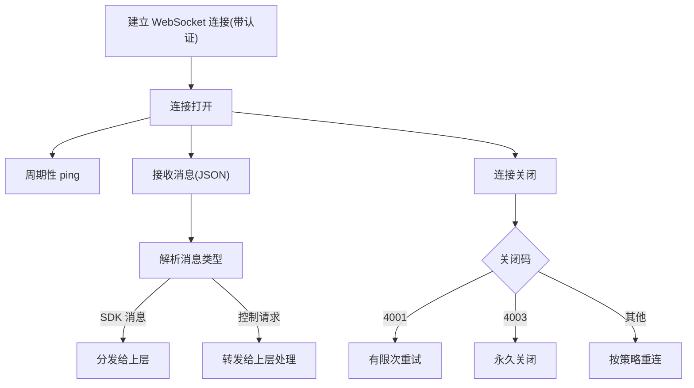
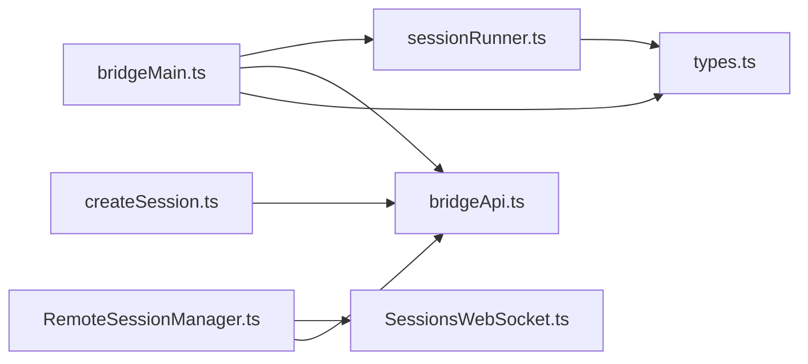

# 远程会话管理

<cite>
**本文引用的文件**
- [sessionRunner.ts](file://src/bridge/sessionRunner.ts)
- [RemoteSessionManager.ts](file://src/remote/RemoteSessionManager.ts)
- [SessionsWebSocket.ts](file://src/remote/SessionsWebSocket.ts)
- [createSession.ts](file://src/bridge/createSession.ts)
- [bridgeApi.ts](file://src/bridge/bridgeApi.ts)
- [types.ts](file://src/bridge/types.ts)
- [bridgeMain.ts](file://src/bridge/bridgeMain.ts)
- [bridgeConfig.ts](file://src/bridge/bridgeConfig.ts)
</cite>

## 目录
1. [简介](#简介)
2. [项目结构](#项目结构)
3. [核心组件](#核心组件)
4. [架构总览](#架构总览)
5. [详细组件分析](#详细组件分析)
6. [依赖关系分析](#依赖关系分析)
7. [性能考量](#性能考量)
8. [故障排查指南](#故障排查指南)
9. [结论](#结论)
10. [附录](#附录)

## 简介
本技术文档聚焦 Claude Code 的远程会话管理系统，系统性阐述会话运行器的工作原理、会话生命周期管理、资源分配与状态跟踪；详细说明会话创建流程（工作树初始化、环境变量设置、权限配置）；解释会话监控机制（活动跟踪、超时管理、错误恢复）；并提供远程会话的调试技巧（日志分析、性能监控、故障诊断）与最佳实践及性能优化建议。

## 项目结构
围绕远程会话管理的关键模块如下：
- 桥接侧（本地桥接进程）
  - 会话运行器：负责子进程会话的启动、标准流解析、活动追踪、权限请求转发、令牌更新与终止控制
  - 桥接 API 客户端：封装与后端环境服务的交互（轮询、心跳、停止、归档等）
  - 会话创建：通过 HTTP 接口创建/获取/归档会话元数据
  - 主循环：桥接主循环负责轮询工作项、派发会话、超时与错误处理、容量唤醒与多会话管理
  - 配置解析：桥接配置与认证来源解析
- 远端侧（客户端）
  - 远端会话管理器：协调 WebSocket 订阅、HTTP 发送消息、权限请求响应
  - 会话 WebSocket：连接到会话订阅端点，处理重连、心跳、控制请求/响应

图表来源
- [sessionRunner.ts:248-548](file://src/bridge/sessionRunner.ts#L248-L548)
- [bridgeApi.ts:68-451](file://src/bridge/bridgeApi.ts#L68-L451)
- [createSession.ts:34-180](file://src/bridge/createSession.ts#L34-L180)
- [bridgeMain.ts:141-2762](file://src/bridge/bridgeMain.ts#L141-L2762)
- [bridgeConfig.ts:1-51](file://src/bridge/bridgeConfig.ts#L1-L51)
- [RemoteSessionManager.ts:95-324](file://src/remote/RemoteSessionManager.ts#L95-L324)
- [SessionsWebSocket.ts:82-404](file://src/remote/SessionsWebSocket.ts#L82-L404)

章节来源
- [sessionRunner.ts:1-553](file://src/bridge/sessionRunner.ts#L1-L553)
- [bridgeApi.ts:1-542](file://src/bridge/bridgeApi.ts#L1-L542)
- [createSession.ts:1-387](file://src/bridge/createSession.ts#L1-L387)
- [bridgeMain.ts:1-3002](file://src/bridge/bridgeMain.ts#L1-L3002)
- [bridgeConfig.ts:1-51](file://src/bridge/bridgeConfig.ts#L1-L51)
- [RemoteSessionManager.ts:1-345](file://src/remote/RemoteSessionManager.ts#L1-L345)
- [SessionsWebSocket.ts:1-406](file://src/remote/SessionsWebSocket.ts#L1-L406)

## 核心组件
- 会话运行器（SessionRunner）
  - 负责子进程会话的启动、标准输入输出/错误流解析、活动提取与上报、权限请求转发、令牌刷新、终止与强制终止
  - 提供会话句柄（SessionHandle），包含完成状态、活动列表、当前活动、最近 stderr、写入 stdin、更新访问令牌等能力
- 桥接 API 客户端（BridgeApiClient）
  - 封装环境注册、轮询工作、确认工作、停止工作、反注册、发送权限事件、归档会话、重连会话、心跳等接口
  - 统一处理 401 刷新、错误类型判定与致命错误抛出
- 远端会话管理器（RemoteSessionManager）
  - 通过 WebSocket 订阅会话消息，处理控制请求（如工具使用授权）、向远端发送用户消息、响应权限请求
  - 维护待处理权限请求映射，支持断线重连、取消会话、断开连接
- 会话 WebSocket（SessionsWebSocket）
  - 建立与后端的 WebSocket 连接，认证基于请求头，支持 ping 心跳、有限次数重连、特定关闭码处理
- 会话创建（createBridgeSession）
  - 通过 HTTP POST 创建会话，携带标题、事件、Git 来源与结果上下文、模型、权限模式等
  - 支持获取会话信息与归档会话

章节来源
- [sessionRunner.ts:248-548](file://src/bridge/sessionRunner.ts#L248-L548)
- [types.ts:178-211](file://src/bridge/types.ts#L178-L211)
- [bridgeApi.ts:68-451](file://src/bridge/bridgeApi.ts#L68-L451)
- [RemoteSessionManager.ts:95-324](file://src/remote/RemoteSessionManager.ts#L95-L324)
- [SessionsWebSocket.ts:82-404](file://src/remote/SessionsWebSocket.ts#L82-L404)
- [createSession.ts:34-180](file://src/bridge/createSession.ts#L34-L180)

## 架构总览
远程会话管理由“桥接侧 + 远端侧”协同完成：
- 桥接侧在本地启动子进程会话，解析其 NDJSON 输出，提取活动、错误与权限请求，并通过桥接 API 与后端交互
- 远端侧通过 WebSocket 订阅会话事件，接收 SDK 消息并通过 HTTP 向会话发送用户消息；同时处理权限请求
- 会话创建在桥接侧发起，用于预创建或获取会话元数据；归档与标题更新在桥接侧完成

图表来源
- [bridgeMain.ts:141-2762](file://src/bridge/bridgeMain.ts#L141-L2762)
- [sessionRunner.ts:248-548](file://src/bridge/sessionRunner.ts#L248-L548)
- [bridgeApi.ts:141-451](file://src/bridge/bridgeApi.ts#L141-L451)
- [RemoteSessionManager.ts:95-324](file://src/remote/RemoteSessionManager.ts#L95-L324)
- [SessionsWebSocket.ts:82-404](file://src/remote/SessionsWebSocket.ts#L82-L404)

## 详细组件分析

### 会话运行器（SessionRunner）
- 工作原理
  - 使用子进程执行 CLI，标准输入用于控制，标准输出按 NDJSON 行解析，标准错误缓冲用于诊断
  - 解析会话输出中的“助手消息”“结果”等事件，提取工具调用摘要、文本片段、错误摘要，形成活动列表
  - 捕获“control_request”类型的权限请求，转发给桥接侧回调；检测“user”类型消息中的首个真实用户消息
  - 提供会话句柄，支持写入 stdin、更新访问令牌、优雅/强制终止、查询最近 stderr、当前活动与历史活动
- 关键职责
  - 会话生命周期：启动、监控、完成（成功/失败/中断）、清理
  - 活动跟踪：维护环形缓冲区记录最近若干活动，支持 UI 展示与诊断
  - 权限集成：识别 per-invocation 权限请求并上送桥接侧
  - 令牌刷新：通过 stdin 发送更新后的访问令牌，确保会话端能及时获取新令牌
  - 资源管理：标准流管道化、调试文件与转录文件写入、平台差异（Windows 信号处理）

图表来源
- [sessionRunner.ts:368-480](file://src/bridge/sessionRunner.ts#L368-L480)

章节来源
- [sessionRunner.ts:1-553](file://src/bridge/sessionRunner.ts#L1-L553)
- [types.ts:178-190](file://src/bridge/types.ts#L178-L190)

### 桥接主循环（runBridgeLoop）
- 工作原理
  - 循环轮询后端工作项，解码工作密钥，派发会话启动；维护活跃会话集合、开始时间、工作 ID、兼容会话 ID、会话 ingress 令牌、定时器、已完成工作 ID、工作树映射、超时会话集合、已命名会话集合、容量唤醒器
  - 处理心跳：对活跃工作项发送心跳，处理 401/403（JWT 过期）触发服务器重新派发；处理 404/410 视为致命错误
  - 处理会话完成：清理定时器与刷新计划、移除会话、根据是否超时调整状态、在多会话模式下归档会话
  - 错误与重连：连接错误与一般错误采用指数退避与抖动，检测系统休眠并重置错误预算；在容量满载时采用心跳模式维持租约
  - 会话超时：为每个会话设置超时 watchdog，到期后标记为失败并触发终止
- 关键职责
  - 多会话调度与容量管理
  - 会话超时与中断处理
  - 令牌刷新与 JWT 过期重连
  - 错误恢复与断线重连策略

图表来源
- [bridgeMain.ts:141-2762](file://src/bridge/bridgeMain.ts#L141-L2762)
- [bridgeApi.ts:199-417](file://src/bridge/bridgeApi.ts#L199-L417)

章节来源
- [bridgeMain.ts:141-2762](file://src/bridge/bridgeMain.ts#L141-L2762)
- [bridgeApi.ts:199-417](file://src/bridge/bridgeApi.ts#L199-L417)

### 会话创建与归档（createBridgeSession）
- 工作原理
  - 通过 HTTP POST /v1/sessions 创建会话，携带标题、事件、Git 来源与结果上下文、模型、权限模式、环境 ID、来源标识
  - 通过 HTTP GET /v1/sessions/{id} 获取会话的环境 ID 与标题
  - 通过 HTTP POST /v1/sessions/{id}/archive 归档会话（幂等，409 视为成功）
  - 通过 HTTP PATCH /v1/sessions/{id} 更新标题（最佳努力）
- 关键职责
  - 会话生命周期前端入口：创建、获取、归档、重命名
  - 与组织级鉴权与 beta 头部协作

图表来源
- [createSession.ts:34-384](file://src/bridge/createSession.ts#L34-L384)

章节来源
- [createSession.ts:34-384](file://src/bridge/createSession.ts#L34-L384)

### 远端会话管理器（RemoteSessionManager）
- 工作原理
  - 通过 SessionsWebSocket 订阅会话事件，区分控制请求/响应/取消请求与 SDK 消息
  - 处理工具使用授权请求，维护待处理请求映射，回调上层进行决策
  - 通过 HTTP POST 向会话发送用户消息；发送权限响应（允许/拒绝）
  - 支持断线重连、取消会话、断开连接、检查连接状态
- 关键职责
  - 控制请求/响应编排
  - 用户消息发送与 SDK 消息分发
  - 会话生命周期与连接状态管理

图表来源
- [RemoteSessionManager.ts:95-324](file://src/remote/RemoteSessionManager.ts#L95-L324)
- [SessionsWebSocket.ts:82-404](file://src/remote/SessionsWebSocket.ts#L82-L404)

章节来源
- [RemoteSessionManager.ts:1-345](file://src/remote/RemoteSessionManager.ts#L1-L345)
- [SessionsWebSocket.ts:1-406](file://src/remote/SessionsWebSocket.ts#L1-L406)

### 会话 WebSocket（SessionsWebSocket）
- 工作原理
  - 建立 wss://.../v1/sessions/ws/{sessionId}/subscribe，使用请求头携带访问令牌进行认证
  - 支持 ping 心跳、有限次数重连、特定关闭码（如 4001）的临时重试策略
  - 消息解析失败时记录错误；关闭时区分永久关闭与可重连关闭
- 关键职责
  - 会话订阅与认证
  - 心跳与断线重连
  - 控制请求/响应发送

图表来源
- [SessionsWebSocket.ts:82-404](file://src/remote/SessionsWebSocket.ts#L82-L404)

章节来源
- [SessionsWebSocket.ts:1-406](file://src/remote/SessionsWebSocket.ts#L1-L406)

### 类型与协议（types.ts）
- 关键类型
  - 会话活动类型：工具开始、文本、结果、错误
  - 会话完成状态：完成、失败、中断
  - 会话句柄：完成 Promise、活动列表、当前活动、最近 stderr、写入 stdin、更新令牌、终止/强制终止
  - 会话启动参数：SDK URL、会话 ID、访问令牌、是否使用 CCR v2、工作器纪元、首个用户消息回调
  - 桥接 API 客户端接口：注册环境、轮询、确认、停止、反注册、发送权限事件、归档、重连、心跳
- 关键职责
  - 明确定义桥接与远端通信的数据结构与行为契约

章节来源
- [types.ts:1-265](file://src/bridge/types.ts#L1-L265)

## 依赖关系分析
- 组件耦合
  - 会话运行器依赖桥接 API 客户端提供的会话事件发送与心跳接口
  - 桥接主循环依赖会话运行器的启动与完成回调，以及桥接 API 客户端的轮询与心跳
  - 远端会话管理器依赖会话 WebSocket 的订阅与控制请求/响应发送
  - 会话创建依赖桥接 API 客户端的 HTTP 接口
- 外部依赖
  - HTTP 客户端（axios）用于与后端交互
  - WebSocket 客户端（浏览器原生或 ws 包）用于订阅会话
  - 子进程（child_process）用于启动会话进程
- 可能的循环依赖
  - 文件间通过导出类型与接口解耦，未见直接循环导入

图表来源
- [sessionRunner.ts:1-553](file://src/bridge/sessionRunner.ts#L1-L553)
- [bridgeMain.ts:1-3002](file://src/bridge/bridgeMain.ts#L1-L3002)
- [bridgeApi.ts:1-542](file://src/bridge/bridgeApi.ts#L1-L542)
- [createSession.ts:1-387](file://src/bridge/createSession.ts#L1-L387)
- [RemoteSessionManager.ts:1-345](file://src/remote/RemoteSessionManager.ts#L1-L345)
- [SessionsWebSocket.ts:1-406](file://src/remote/SessionsWebSocket.ts#L1-L406)
- [types.ts:1-265](file://src/bridge/types.ts#L1-L265)

章节来源
- [bridgeMain.ts:1-3002](file://src/bridge/bridgeMain.ts#L1-L3002)
- [sessionRunner.ts:1-553](file://src/bridge/sessionRunner.ts#L1-L553)
- [bridgeApi.ts:1-542](file://src/bridge/bridgeApi.ts#L1-L542)
- [createSession.ts:1-387](file://src/bridge/createSession.ts#L1-L387)
- [RemoteSessionManager.ts:1-345](file://src/remote/RemoteSessionManager.ts#L1-L345)
- [SessionsWebSocket.ts:1-406](file://src/remote/SessionsWebSocket.ts#L1-L406)
- [types.ts:1-265](file://src/bridge/types.ts#L1-L265)

## 性能考量
- 轮询与心跳
  - 在容量满载时采用“心跳模式”维持租约，避免频繁轮询带来的服务器压力
  - 心跳间隔与“满载轮询间隔”可通过配置动态调整，减少空闲轮询
- 会话超时
  - 为每个会话设置超时 watchdog，防止僵尸会话占用资源；默认超时可配置
- 令牌刷新
  - 在 JWT 过期前主动刷新，v2 会话通过服务器重新派发获取新 JWT，避免静默失效
- 日志与调试
  - 支持调试文件与转录文件，便于离线分析；在 ant 用户场景下自动输出调试日志路径
- 资源管理
  - 子进程标准流管道化，stderr 缓冲限制，避免内存膨胀
  - 会话完成后清理定时器、刷新计划与工作树，释放系统资源

[本节为通用性能讨论，不直接分析具体文件]

## 故障排查指南
- 日志分析
  - 桥接侧：启用 --verbose 或 --debug-file，查看会话运行器的 NDJSON 解析、活动上报、权限请求与 stderr 摘要
  - 远端侧：查看 SessionsWebSocket 的连接/重连/关闭事件与消息解析错误
- 常见问题定位
  - 401/403：检查访问令牌是否过期或权限不足；桥接 API 客户端支持一次自动刷新重试
  - 404/410：会话或环境过期，需重启或重新派发
  - 4001：会话不存在（可能因压缩/回收导致短暂不可用），有限次重试后仍失败则视为永久
  - 连接不稳定：观察退避与抖动策略，注意系统休眠检测与错误预算重置
- 性能监控
  - 使用会话活动环形缓冲与最近 stderr 摘要辅助定位卡顿与异常
  - 关注心跳成功率与失败原因，判断网络或服务器稳定性
- 故障恢复
  - 断线重连：SessionsWebSocket 与桥接主循环均具备有限次数重连与错误预算
  - 会话中断：区分服务器发起与桥接侧发起，避免重复停止
  - 超时处理：超时会话标记为失败并终止，避免资源泄漏

章节来源
- [bridgeApi.ts:454-541](file://src/bridge/bridgeApi.ts#L454-L541)
- [SessionsWebSocket.ts:234-288](file://src/remote/SessionsWebSocket.ts#L234-L288)
- [bridgeMain.ts:1236-1369](file://src/bridge/bridgeMain.ts#L1236-L1369)

## 结论
远程会话管理系统通过“桥接侧 + 远端侧”的协同设计，实现了从会话创建、运行、监控到归档的全生命周期管理。会话运行器负责子进程的实时监控与活动追踪，桥接主循环负责多会话调度与错误恢复，远端会话管理器负责与用户的交互与权限编排。配合完善的超时与令牌刷新机制、详尽的日志与调试能力，系统在复杂网络环境下仍能保持稳定与可观测性。

[本节为总结性内容，不直接分析具体文件]

## 附录

### 会话创建流程（工作树初始化、环境变量设置、权限配置）
- 工作树初始化
  - 在 worktree 模式下，为每个会话创建隔离的工作树分支，避免相互覆盖
- 环境变量设置
  - 会话运行器在启动子进程时注入会话访问令牌、环境标识、是否强制沙箱、是否使用 CCR v2 等关键变量
- 权限配置
  - 支持外部权限模式（如 auto、bubble 等），并在会话创建时传递到后端

章节来源
- [bridgeMain.ts:1178-1204](file://src/bridge/bridgeMain.ts#L1178-L1204)
- [sessionRunner.ts:306-323](file://src/bridge/sessionRunner.ts#L306-L323)
- [createSession.ts:34-180](file://src/bridge/createSession.ts#L34-L180)
- [bridgeConfig.ts:1-51](file://src/bridge/bridgeConfig.ts#L1-L51)

### 会话监控机制（活动跟踪、超时管理、错误恢复）
- 活动跟踪
  - 会话运行器解析 NDJSON 输出，提取工具调用摘要、文本片段、错误摘要，维护最近若干活动
- 超时管理
  - 桥接主循环为每个会话设置超时 watchdog，到期后标记失败并终止
- 错误恢复
  - 连接错误与一般错误采用指数退避与抖动；检测系统休眠并重置错误预算；401/403 通过服务器重新派发；4001 有限次重试

章节来源
- [sessionRunner.ts:107-200](file://src/bridge/sessionRunner.ts#L107-L200)
- [bridgeMain.ts:1178-1204](file://src/bridge/bridgeMain.ts#L1178-L1204)
- [bridgeMain.ts:1236-1369](file://src/bridge/bridgeMain.ts#L1236-L1369)

### 远程会话调试技巧（日志分析、性能监控、故障诊断）
- 日志分析
  - 使用 --debug-file 生成会话调试日志与转录文件，结合 stderr 摘要定位问题
- 性能监控
  - 关注会话活动环形缓冲与最近 stderr，结合心跳成功率评估网络与服务器健康度
- 故障诊断
  - 依据错误码与错误类型（过期、权限、连接、一般）采取不同策略；利用断线重连与有限重试缓解瞬时故障

章节来源
- [sessionRunner.ts:256-285](file://src/bridge/sessionRunner.ts#L256-L285)
- [SessionsWebSocket.ts:234-288](file://src/remote/SessionsWebSocket.ts#L234-L288)
- [bridgeApi.ts:454-541](file://src/bridge/bridgeApi.ts#L454-L541)

### 最佳实践与性能优化建议
- 最佳实践
  - 在多会话模式下合理设置容量与轮询间隔，避免过度轮询
  - 使用工作树模式隔离会话，减少相互影响
  - 合理配置会话超时，避免长时间占用资源
  - 在需要时启用调试文件与转录文件，便于问题复现
- 性能优化
  - 采用心跳模式维持租约，降低轮询频率
  - 优化令牌刷新策略，减少 JWT 过期带来的重新派发
  - 控制 stderr 缓冲大小与活动环形缓冲大小，避免内存压力

[本节为通用建议，不直接分析具体文件]