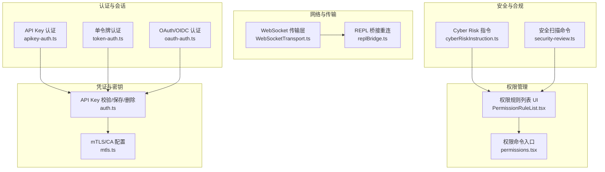
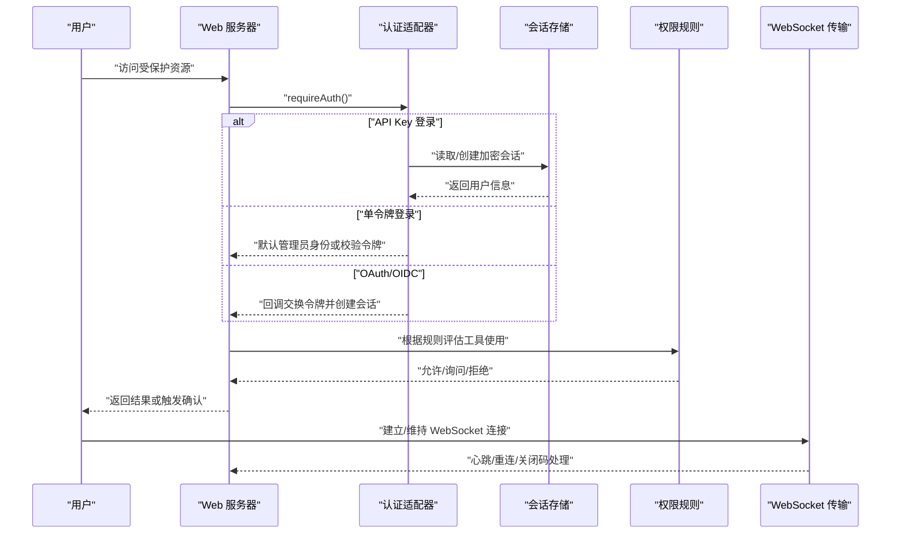
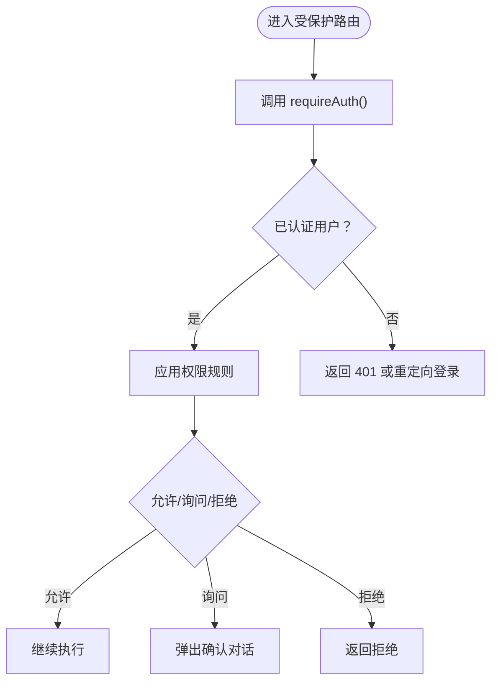
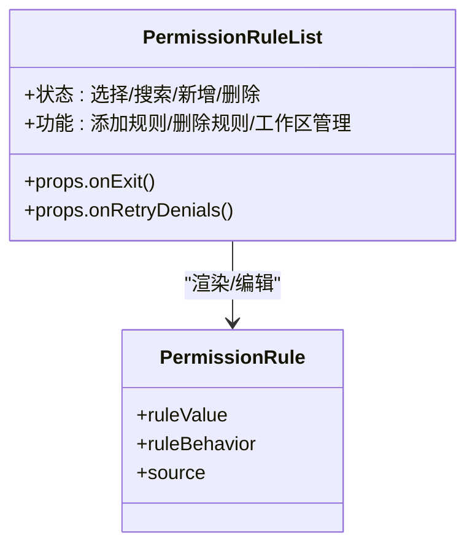
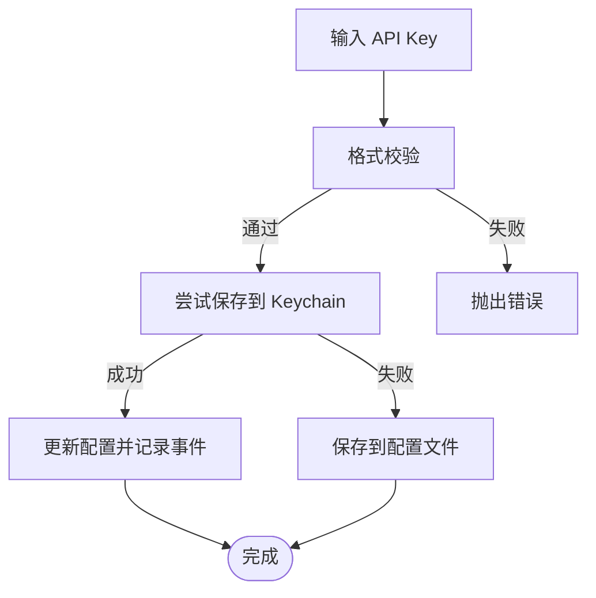
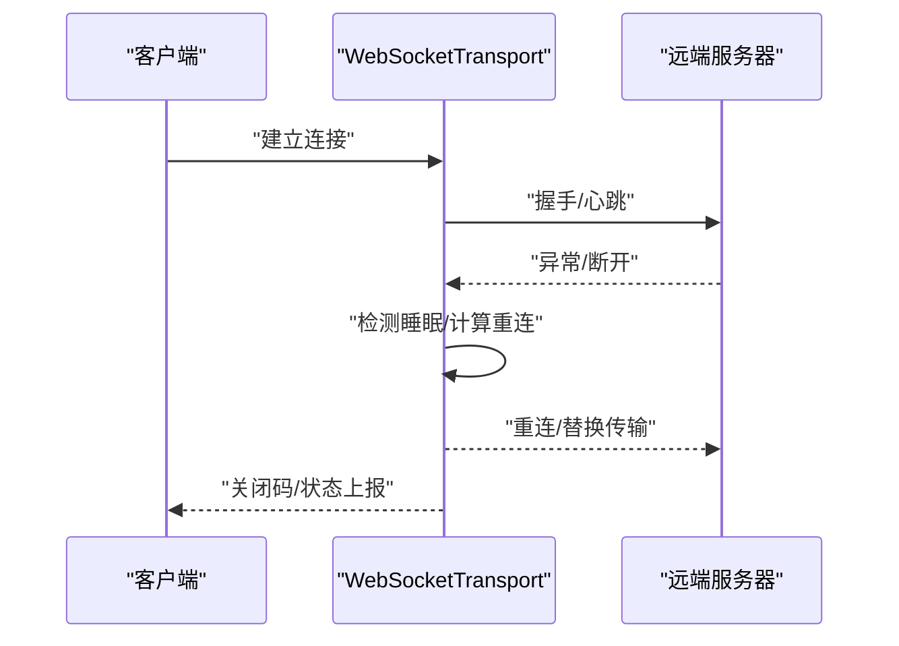
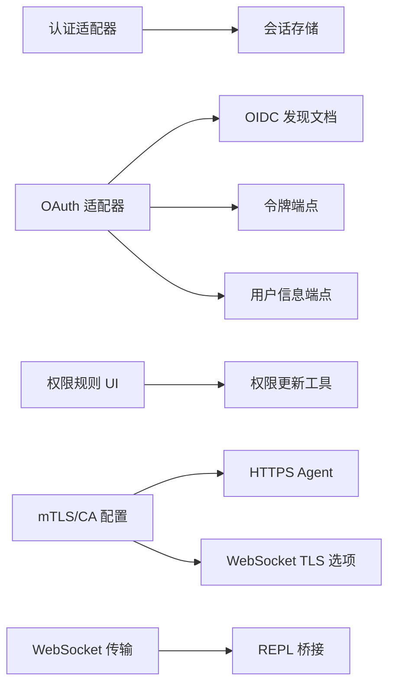

# 安全运维

<cite>
**本文引用的文件**
- [apikey-auth.ts](file://src/server/web/auth/apikey-auth.ts)
- [token-auth.ts](file://src/server/web/auth/token-auth.ts)
- [oauth-auth.ts](file://src/server/web/auth/oauth-auth.ts)
- [auth.ts](file://src/utils/auth.ts)
- [mtls.ts](file://src/utils/mtls.ts)
- [PermissionRuleList.tsx](file://src/components/permissions/rules/PermissionRuleList.tsx)
- [permissions.tsx](file://src/commands/permissions/permissions.tsx)
- [cyberRiskInstruction.ts](file://src/constants/cyberRiskInstruction.ts)
- [security-review.ts](file://src/commands/security-review.ts)
- [WebSocketTransport.ts](file://src/cli/transports/WebSocketTransport.ts)
- [replBridge.ts](file://src/bridge/replBridge.ts)
</cite>

## 目录
1. [简介](#简介)
2. [项目结构](#项目结构)
3. [核心组件](#核心组件)
4. [架构总览](#架构总览)
5. [详细组件分析](#详细组件分析)
6. [依赖关系分析](#依赖关系分析)
7. [性能考量](#性能考量)
8. [故障排查指南](#故障排查指南)
9. [结论](#结论)
10. [附录](#附录)

## 简介
本安全运维文档面向 Claude Code 的安全架构与运维实践，覆盖身份认证、授权控制、数据保护、网络与传输安全、密钥与凭证管理、安全审计与合规、漏洞预防与响应流程，以及安全配置检查清单与定期评估指南。文档以代码库为依据，结合实际实现细节，帮助读者理解系统如何在工程层面落实安全策略，并提供可操作的运维建议。

## 项目结构
从安全视角，项目中与安全相关的关键模块包括：
- 身份认证与会话：API Key 登录、单令牌登录、OAuth/OIDC 登录、会话存储与中间件校验
- 权限管理：工具使用规则、工作区目录白名单、自动模式拒绝列表与交互式规则编辑
- 网络与传输安全：mTLS 配置、CA 证书注入、WebSocket TLS 选项、代理与上游连接
- 凭证与密钥管理：API Key 校验、保存与删除、macOS Keychain 集成、配置文件持久化
- 安全审计与合规：Cyber Risk 指令、安全扫描命令、日志与遥测事件
- 运行时安全：WebSocket 传输层错误处理、REPL 桥接重连与会话失效处理

**图表来源**
- [apikey-auth.ts:1-231](file://src/server/web/auth/apikey-auth.ts#L1-L231)
- [token-auth.ts:1-82](file://src/server/web/auth/token-auth.ts#L1-L82)
- [oauth-auth.ts:1-277](file://src/server/web/auth/oauth-auth.ts#L1-L277)
- [auth.ts:1089-1160](file://src/utils/auth.ts#L1089-L1160)
- [mtls.ts:1-181](file://src/utils/mtls.ts#L1-L181)
- [PermissionRuleList.tsx:1-800](file://src/components/permissions/rules/PermissionRuleList.tsx#L1-L800)
- [permissions.tsx:1-9](file://src/commands/permissions/permissions.tsx#L1-L9)
- [cyberRiskInstruction.ts:1-24](file://src/constants/cyberRiskInstruction.ts#L1-L24)
- [security-review.ts:76-168](file://src/commands/security-review.ts#L76-L168)
- [WebSocketTransport.ts:30-419](file://src/cli/transports/WebSocketTransport.ts#L30-L419)
- [replBridge.ts:1077-1095](file://src/bridge/replBridge.ts#L1077-L1095)

**章节来源**
- [apikey-auth.ts:1-231](file://src/server/web/auth/apikey-auth.ts#L1-L231)
- [token-auth.ts:1-82](file://src/server/web/auth/token-auth.ts#L1-L82)
- [oauth-auth.ts:1-277](file://src/server/web/auth/oauth-auth.ts#L1-L277)
- [auth.ts:1089-1160](file://src/utils/auth.ts#L1089-L1160)
- [mtls.ts:1-181](file://src/utils/mtls.ts#L1-L181)
- [PermissionRuleList.tsx:1-800](file://src/components/permissions/rules/PermissionRuleList.tsx#L1-L800)
- [permissions.tsx:1-9](file://src/commands/permissions/permissions.tsx#L1-L9)
- [cyberRiskInstruction.ts:1-24](file://src/constants/cyberRiskInstruction.ts#L1-L24)
- [security-review.ts:76-168](file://src/commands/security-review.ts#L76-L168)
- [WebSocketTransport.ts:30-419](file://src/cli/transports/WebSocketTransport.ts#L30-L419)
- [replBridge.ts:1077-1095](file://src/bridge/replBridge.ts#L1077-L1095)

## 核心组件
- 身份认证适配器
  - API Key 适配器：支持用户在登录页提交 API Key，服务端加密存储于会话，派生用户 ID 并注入环境变量；支持管理员用户配置
  - 单令牌适配器：通过查询参数或 Bearer 头部携带的令牌进行认证，未配置时默认管理员身份
  - OAuth/OIDC 适配器：服务端授权码流程，支持 OIDC 发现文档、CSRF 状态校验、用户信息获取与会话创建
- 权限管理
  - 工具使用规则（允许/询问/拒绝）与工作区目录白名单，支持交互式增删改查与最近拒绝项查看
- 凭证与密钥
  - API Key 格式校验、保存到 macOS Keychain 或配置文件、删除清理、缓存与预取优化
  - mTLS/CA 证书加载、HTTPS Agent 与 WebSocket TLS 选项生成、全局 TLS 配置
- 网络与传输
  - WebSocket 传输层对断线、睡眠检测、永久关闭码的处理；REPL 桥接在新工作到达时替换旧传输并重用 JWT 入口令牌
- 安全与合规
  - Cyber Risk 指令约束 AI 行为边界；安全扫描命令定义分析方法论与排除项

**章节来源**
- [apikey-auth.ts:24-122](file://src/server/web/auth/apikey-auth.ts#L24-L122)
- [token-auth.ts:16-55](file://src/server/web/auth/token-auth.ts#L16-L55)
- [oauth-auth.ts:79-229](file://src/server/web/auth/oauth-auth.ts#L79-L229)
- [PermissionRuleList.tsx:464-800](file://src/components/permissions/rules/PermissionRuleList.tsx#L464-L800)
- [auth.ts:1089-1160](file://src/utils/auth.ts#L1089-L1160)
- [mtls.ts:23-152](file://src/utils/mtls.ts#L23-L152)
- [WebSocketTransport.ts:38-419](file://src/cli/transports/WebSocketTransport.ts#L38-L419)
- [replBridge.ts:1077-1095](file://src/bridge/replBridge.ts#L1077-L1095)
- [cyberRiskInstruction.ts:1-24](file://src/constants/cyberRiskInstruction.ts#L1-L24)
- [security-review.ts:76-168](file://src/commands/security-review.ts#L76-L168)

## 架构总览
下图展示认证、权限与传输层之间的交互关系，以及关键安全控制点。

**图表来源**
- [apikey-auth.ts:109-122](file://src/server/web/auth/apikey-auth.ts#L109-L122)
- [token-auth.ts:47-55](file://src/server/web/auth/token-auth.ts#L47-L55)
- [oauth-auth.ts:216-229](file://src/server/web/auth/oauth-auth.ts#L216-L229)
- [PermissionRuleList.tsx:464-800](file://src/components/permissions/rules/PermissionRuleList.tsx#L464-L800)
- [WebSocketTransport.ts:38-419](file://src/cli/transports/WebSocketTransport.ts#L38-L419)

## 详细组件分析

### 身份认证与授权控制
- API Key 认证
  - 登录页表单提交 API Key，服务端校验格式并派生用户 ID，加密后写入会话，设置 Cookie 并重定向
  - 中间件 requireAuth 在无用户时按请求类型返回 401 或跳转登录
- 单令牌认证
  - 支持查询参数与 Bearer 头部两种方式提取令牌；未配置时默认管理员身份
- OAuth/OIDC 认证
  - 服务端授权码流程，OIDC 发现文档解析，CSRF 状态令牌缓存与清理，回调阶段交换令牌与拉取用户信息
  - 管理员用户可通过用户 ID 或邮箱匹配
- 授权控制
  - 会话中包含 isAdmin 标记，配合权限规则决定工具使用行为（允许/询问/拒绝）

**图表来源**
- [apikey-auth.ts:109-122](file://src/server/web/auth/apikey-auth.ts#L109-L122)
- [token-auth.ts:47-55](file://src/server/web/auth/token-auth.ts#L47-L55)
- [oauth-auth.ts:216-229](file://src/server/web/auth/oauth-auth.ts#L216-L229)
- [PermissionRuleList.tsx:464-800](file://src/components/permissions/rules/PermissionRuleList.tsx#L464-L800)

**章节来源**
- [apikey-auth.ts:56-107](file://src/server/web/auth/apikey-auth.ts#L56-L107)
- [token-auth.ts:16-55](file://src/server/web/auth/token-auth.ts#L16-L55)
- [oauth-auth.ts:130-214](file://src/server/web/auth/oauth-auth.ts#L130-L214)

### 权限管理机制
- 规则类型
  - 允许（allow）：不提示直接使用
  - 询问（ask）：总是确认
  - 拒绝（deny）：始终拒绝
- 规则来源与编辑
  - 支持添加新规则、删除现有规则、搜索与排序、最近拒绝项查看
  - 策略设置来源的规则不可修改，提示联系管理员
- 工作区目录
  - 支持添加/移除工作区目录，作为路径级白名单
- 自动模式拒绝
  - 基于最近拒绝项生成重试命令，便于快速恢复

**图表来源**
- [PermissionRuleList.tsx:464-800](file://src/components/permissions/rules/PermissionRuleList.tsx#L464-L800)
- [permissions.tsx:1-9](file://src/commands/permissions/permissions.tsx#L1-L9)

**章节来源**
- [PermissionRuleList.tsx:1-800](file://src/components/permissions/rules/PermissionRuleList.tsx#L1-L800)
- [permissions.tsx:1-9](file://src/commands/permissions/permissions.tsx#L1-L9)

### 数据保护与密钥管理
- API Key 校验与保存
  - 仅允许字母数字、短横线与下划线；保存时尝试写入 macOS Keychain，失败回退至配置文件
  - 删除时清理 Keychain 与配置，清除缓存
- 凭证来源优先级
  - 命令行打印模式优先环境变量；CI/测试环境优先文件描述符；否则按设置与 Keychain/配置顺序
- mTLS 与 TLS
  - 从环境变量加载客户端证书/私钥/口令，合并 CA 证书，生成 HTTPS Agent 与 WebSocket TLS 选项
  - 支持全局 Node.js TLS 设置与缓存清理

**图表来源**
- [auth.ts:1089-1160](file://src/utils/auth.ts#L1089-L1160)
- [mtls.ts:23-152](file://src/utils/mtls.ts#L23-L152)

**章节来源**
- [auth.ts:1089-1160](file://src/utils/auth.ts#L1089-L1160)
- [mtls.ts:23-152](file://src/utils/mtls.ts#L23-L152)

### 网络安全与传输安全
- WebSocket 传输层
  - 断线检测、睡眠检测阈值、永久关闭码（会话过期/未授权等）处理、重连预算与遥测事件
- REPL 桥接
  - 新工作到达时若已有连接则替换传输，复用 JWT 入口令牌，避免卡死“重新连接”状态
- mTLS/CA 证书
  - 通过环境变量注入客户端证书与 CA 证书，统一用于 HTTP(S) 请求与 WebSocket 连接

**图表来源**
- [WebSocketTransport.ts:38-419](file://src/cli/transports/WebSocketTransport.ts#L38-L419)
- [replBridge.ts:1077-1095](file://src/bridge/replBridge.ts#L1077-L1095)
- [mtls.ts:97-152](file://src/utils/mtls.ts#L97-L152)

**章节来源**
- [WebSocketTransport.ts:38-419](file://src/cli/transports/WebSocketTransport.ts#L38-L419)
- [replBridge.ts:1077-1095](file://src/bridge/replBridge.ts#L1077-L1095)
- [mtls.ts:97-152](file://src/utils/mtls.ts#L97-L152)

### 安全审计与合规
- Cyber Risk 指令
  - 明确 AI 在安全测试、防御性安全、CTF 与教育场景中的协助边界，拒绝破坏性技术与恶意用途
- 安全扫描命令
  - 提供方法论：上下文研究、对比分析、脆弱性评估；明确硬性排除项（如仅本地网络可利用的 DoS、内存泄漏、文档不安全等）
- 日志与遥测
  - 传输层与桥接层记录连接状态、关闭码、活动时间等事件，辅助问题定位与安全审计

**章节来源**
- [cyberRiskInstruction.ts:1-24](file://src/constants/cyberRiskInstruction.ts#L1-L24)
- [security-review.ts:76-168](file://src/commands/security-review.ts#L76-L168)
- [WebSocketTransport.ts:397-419](file://src/cli/transports/WebSocketTransport.ts#L397-L419)
- [replBridge.ts:1077-1095](file://src/bridge/replBridge.ts#L1077-L1095)

## 依赖关系分析
- 认证适配器依赖会话存储（SessionStore），用于读取/创建/删除会话与设置 Cookie
- OAuth 适配器依赖 OIDC 发现文档与令牌端点，使用一次性状态令牌防止 CSRF
- 权限规则由 UI 组件驱动，与权限更新工具协作持久化
- mTLS/CA 配置被 HTTP(S) Agent 与 WebSocket 使用，确保出站连接具备正确的证书链
- WebSocket 传输层与 REPL 桥接共同保障远端会话的稳定性与安全性

**图表来源**
- [oauth-auth.ts:79-277](file://src/server/web/auth/oauth-auth.ts#L79-L277)
- [PermissionRuleList.tsx:464-800](file://src/components/permissions/rules/PermissionRuleList.tsx#L464-L800)
- [mtls.ts:78-152](file://src/utils/mtls.ts#L78-L152)
- [WebSocketTransport.ts:38-419](file://src/cli/transports/WebSocketTransport.ts#L38-L419)
- [replBridge.ts:1077-1095](file://src/bridge/replBridge.ts#L1077-L1095)

**章节来源**
- [oauth-auth.ts:79-277](file://src/server/web/auth/oauth-auth.ts#L79-L277)
- [PermissionRuleList.tsx:464-800](file://src/components/permissions/rules/PermissionRuleList.tsx#L464-L800)
- [mtls.ts:78-152](file://src/utils/mtls.ts#L78-L152)
- [WebSocketTransport.ts:38-419](file://src/cli/transports/WebSocketTransport.ts#L38-L419)
- [replBridge.ts:1077-1095](file://src/bridge/replBridge.ts#L1077-L1095)

## 性能考量
- 缓存与预取
  - API Key 助手缓存与 TTL 控制，冷启动去重并发，失败时采用保守刷新策略
  - AWS 凭证与模型字符串的预取需满足工作区信任条件，避免不必要的阻塞
- mTLS/CA 加载
  - 使用 memoize 缓存配置，减少重复 IO；仅在启用时懒加载 undici Agent
- WebSocket
  - keep-alive 与合理的重连预算，避免风暴式重连导致资源耗尽

**章节来源**
- [auth.ts:435-536](file://src/utils/auth.ts#L435-L536)
- [auth.ts:1017-1048](file://src/utils/auth.ts#L1017-L1048)
- [mtls.ts:78-95](file://src/utils/mtls.ts#L78-L95)
- [WebSocketTransport.ts:38-419](file://src/cli/transports/WebSocketTransport.ts#L38-L419)

## 故障排查指南
- 认证失败
  - API Key：检查格式是否以 sk-ant- 开头，确认会话是否创建成功
  - 单令牌：确认查询参数或 Bearer 头部是否正确传递
  - OAuth：检查回调 URL、状态令牌、OIDC 发现文档可用性
- 权限问题
  - 查看最近拒绝项，使用重试命令恢复；检查规则来源（策略设置不可修改）
- 传输问题
  - 关注关闭码（如 4001/4003）、睡眠检测阈值、重连次数；必要时清理 mTLS 缓存
- 凭证问题
  - Keychain 写入失败时回退配置文件；删除时确保清理 Keychain 与配置

**章节来源**
- [apikey-auth.ts:72-98](file://src/server/web/auth/apikey-auth.ts#L72-L98)
- [token-auth.ts:59-80](file://src/server/web/auth/token-auth.ts#L59-L80)
- [oauth-auth.ts:156-214](file://src/server/web/auth/oauth-auth.ts#L156-L214)
- [PermissionRuleList.tsx:796-800](file://src/components/permissions/rules/PermissionRuleList.tsx#L796-L800)
- [WebSocketTransport.ts:397-419](file://src/cli/transports/WebSocketTransport.ts#L397-L419)
- [auth.ts:1170-1183](file://src/utils/auth.ts#L1170-L1183)

## 结论
本项目在工程层面构建了多层安全控制：认证适配器提供灵活的身份来源，权限规则体系实现细粒度的工具使用控制，mTLS/CA 配置强化出站连接可信度，传输层与桥接层保障会话稳定与安全。结合 Cyber Risk 指令与安全扫描流程，形成从技术到策略的闭环。建议在生产环境中严格遵循凭据最小化、最小暴露面与持续审计的原则，并定期进行安全评估与演练。

## 附录

### 安全配置检查清单
- 身份认证
  - 是否启用所需认证方式（API Key/OAuth/单令牌）
  - 管理员用户列表是否准确维护
  - 回调 URL 与 OIDC 发现文档是否可达
- 权限管理
  - 工具规则是否覆盖关键工具
  - 工作区目录白名单是否完整
  - 最近拒绝项是否定期审查
- 凭证与密钥
  - API Key 格式校验是否开启
  - macOS Keychain 写入是否成功，失败回退逻辑是否生效
  - 配置文件权限最小化
- 网络与传输
  - mTLS/CA 证书是否正确加载
  - WebSocket 关闭码与重连策略是否合理
- 安全审计
  - 是否启用必要的遥测事件
  - Cyber Risk 指令是否生效
  - 安全扫描命令是否纳入常规评估

### 安全更新与补丁管理策略
- 版本升级
  - 优先升级依赖与运行时，关注安全公告
- 配置变更
  - 变更前进行灰度验证，记录变更影响
- 应急响应
  - 建立应急联系渠道与回滚预案，针对高危漏洞快速处置