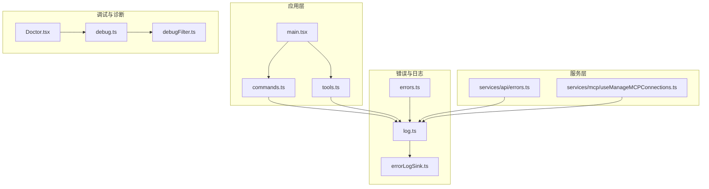
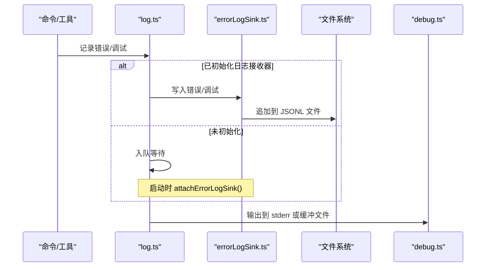
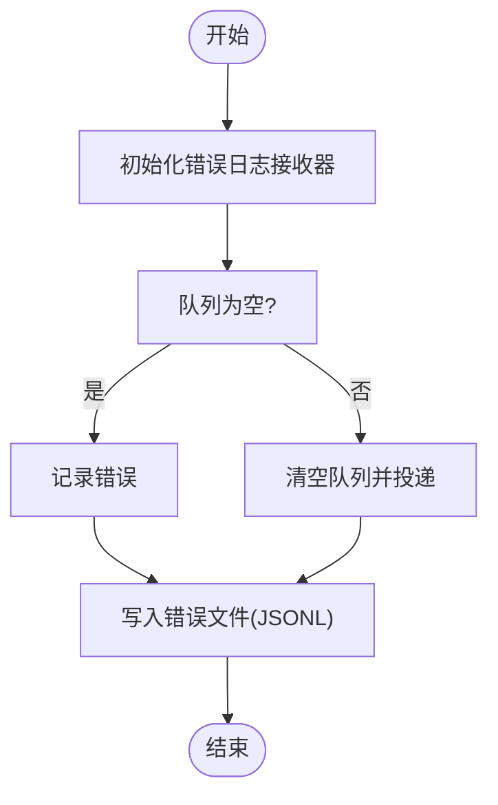
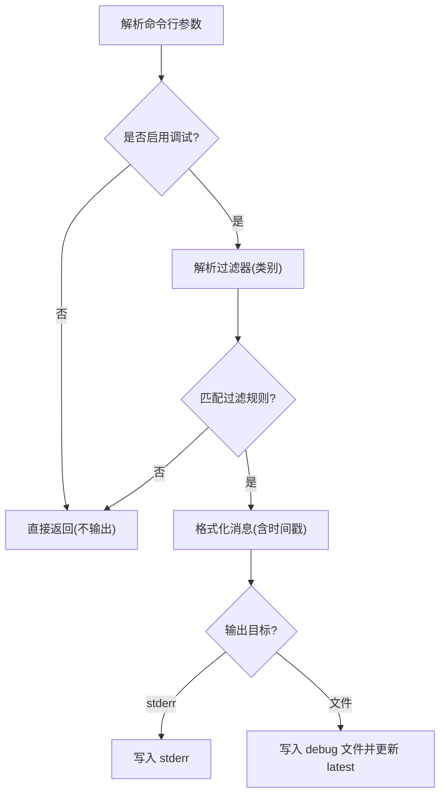
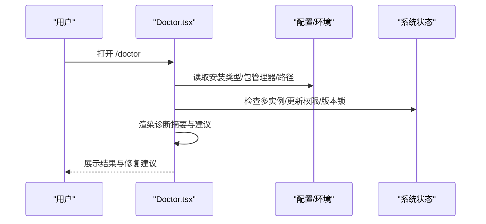
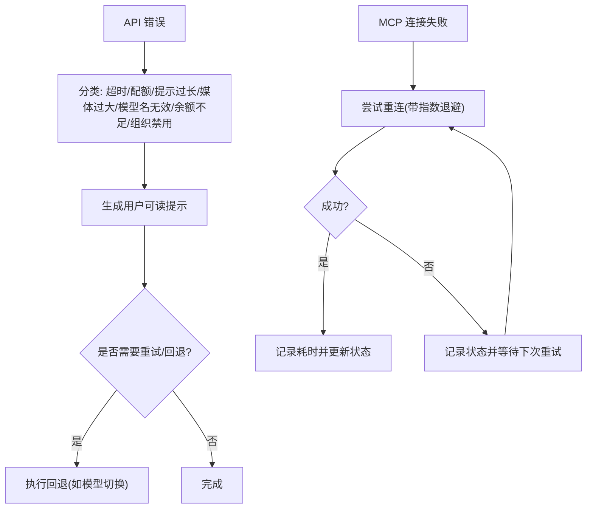
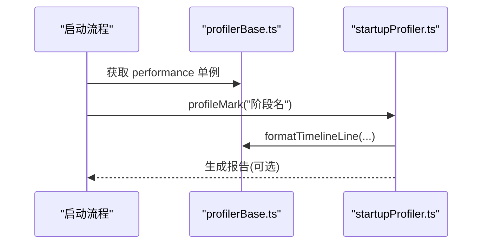
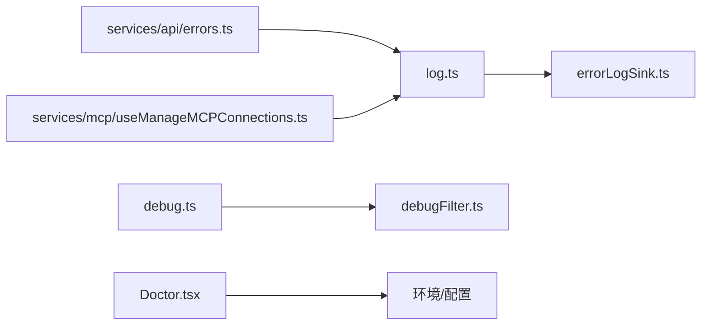

# 故障排除

<cite>
**本文引用的文件**
- [README.md](file://README.md)
- [CONTRIBUTING.md](file://CONTRIBUTING.md)
- [errorIds.ts](file://src/constants/errorIds.ts)
- [errors.ts](file://src/utils/errors.ts)
- [errorLogSink.ts](file://src/utils/errorLogSink.ts)
- [log.ts](file://src/utils/log.ts)
- [debug.ts](file://src/utils/debug.ts)
- [debugFilter.ts](file://src/utils/debugFilter.ts)
- [errors.ts（服务层）](file://src/services/api/errors.ts)
- [Doctor.tsx](file://src/screens/Doctor.tsx)
- [useManageMCPConnections.ts](file://src/services/mcp/useManageMCPConnections.ts)
- [mcpServer.ts（Claude In Chrome）](file://src/utils/claudeInChrome/mcpServer.ts)
- [profilerBase.ts](file://src/utils/profilerBase.ts)
- [startupProfiler.ts](file://src/utils/startupProfiler.ts)
</cite>

## 目录
1. [简介](#简介)
2. [项目结构](#项目结构)
3. [核心组件](#核心组件)
4. [架构总览](#架构总览)
5. [详细组件分析](#详细组件分析)
6. [依赖关系分析](#依赖关系分析)
7. [性能考量](#性能考量)
8. [故障排除指南](#故障排除指南)
9. [结论](#结论)
10. [附录](#附录)

## 简介
本指南面向使用 Claude Code 的用户与维护者，系统化梳理安装、运行时错误、性能与集成问题的排查路径。文档基于仓库中的错误处理、日志、调试与诊断能力，提供可操作的诊断步骤、工具与示例流程，并给出预防性维护建议与健康检查清单。

## 项目结构
- 核心入口与命令行解析：main.tsx、commands.ts、tools.ts
- 错误与日志：src/utils/errors.ts、src/utils/errorLogSink.ts、src/utils/log.ts
- 调试与过滤：src/utils/debug.ts、src/utils/debugFilter.ts
- 医生诊断界面：src/screens/Doctor.tsx
- API 与 MCP 连接：src/services/api/errors.ts、src/services/mcp/useManageMCPConnections.ts
- 性能剖析：src/utils/profilerBase.ts、src/utils/startupProfiler.ts

图表来源
- [main.tsx](file://src/main.tsx)
- [commands.ts](file://src/commands.ts)
- [tools.ts](file://src/tools.ts)
- [errors.ts](file://src/utils/errors.ts)
- [log.ts](file://src/utils/log.ts)
- [errorLogSink.ts](file://src/utils/errorLogSink.ts)
- [debug.ts](file://src/utils/debug.ts)
- [debugFilter.ts](file://src/utils/debugFilter.ts)
- [Doctor.tsx](file://src/screens/Doctor.tsx)
- [errors.ts（服务层）](file://src/services/api/errors.ts)
- [useManageMCPConnections.ts](file://src/services/mcp/useManageMCPConnections.ts)

章节来源
- [README.md: 193-236:193-236](file://README.md#L193-L236)

## 核心组件
- 错误类型与通用错误工具：提供统一的错误类、消息提取、errno 归类等，便于在各模块中一致处理。
- 错误日志与队列：延迟初始化的错误日志接收器，支持队列落盘与 MCP 日志分离。
- 调试日志与过滤：支持按级别、类别过滤输出，支持写入 stderr 或文件，便于生产环境与本地调试。
- 医生诊断界面：集中展示安装状态、包管理器、更新通道、版本锁、插件与代理警告等。
- API 与 MCP 错误映射：将底层错误转换为用户可读提示，并记录重试与回退策略。
- 性能剖析：启动阶段时间线与内存快照，辅助定位性能瓶颈。

章节来源
- [errors.ts:1-240](file://src/utils/errors.ts#L1-L240)
- [errorLogSink.ts:1-237](file://src/utils/errorLogSink.ts#L1-L237)
- [log.ts:96-223](file://src/utils/log.ts#L96-L223)
- [debug.ts:1-270](file://src/utils/debug.ts#L1-L270)
- [debugFilter.ts:1-159](file://src/utils/debugFilter.ts#L1-L159)
- [Doctor.tsx:1-576](file://src/screens/Doctor.tsx#L1-L576)
- [errors.ts（服务层）:1-800](file://src/services/api/errors.ts#L1-L800)
- [profilerBase.ts:1-46](file://src/utils/profilerBase.ts#L1-L46)
- [startupProfiler.ts:68-128](file://src/utils/startupProfiler.ts#L68-L128)

## 架构总览
下图展示错误与日志在系统中的流转路径，以及调试与诊断工具如何协同工作。

图表来源
- [log.ts:96-223](file://src/utils/log.ts#L96-L223)
- [errorLogSink.ts:149-235](file://src/utils/errorLogSink.ts#L149-L235)
- [debug.ts:155-228](file://src/utils/debug.ts#L155-L228)

## 详细组件分析

### 组件一：错误与日志系统
- 设计要点
  - 错误类型统一：Abort、ConfigParse、Shell、TeleportOperation、TelemetrySafe 等，便于分支处理。
  - 分类与归因：isAbortError、isFsInaccessible、classifyAxiosError 提供快速判断。
  - 延迟初始化：attachErrorLogSink 支持先写队列再落盘，避免丢失。
  - MCP 专用日志：独立目录与文件，便于隔离诊断。
- 关键流程
  - 初始化：initializeErrorLogSink 在启动早期调用，随后 drain 队列。
  - 记录：logError 将错误转为字符串并写入内存与磁盘；MCP 使用 logMCPError/logMCPDebug。
  - 读取：loadErrorLogs/getErrorLogByIndex 提供历史日志检索。

图表来源
- [log.ts:96-134](file://src/utils/log.ts#L96-L134)
- [errorLogSink.ts:225-235](file://src/utils/errorLogSink.ts#L225-L235)

章节来源
- [errors.ts:1-240](file://src/utils/errors.ts#L1-L240)
- [errorLogSink.ts:1-237](file://src/utils/errorLogSink.ts#L1-L237)
- [log.ts:96-223](file://src/utils/log.ts#L96-L223)

### 组件二：调试与过滤
- 设计要点
  - 动态开关：--debug/-d、DEBUG、DEBUG_SDK、--debug-file、--debug-to-stderr 等。
  - 类别过滤：--debug=api,hooks 或 --debug=!file,!1p，支持混用时降级为无过滤。
  - 输出目标：默认写入 ~/.claude/debug/<sessionId>.txt，同时维护 latest 符号链接。
  - 级别控制：CLAUDE_CODE_DEBUG_LOG_LEVEL 控制最小输出级别。
- 关键流程
  - 解析参数与过滤器，决定是否输出。
  - 缓冲写入，非 --debug 模式下每秒刷新一次，避免阻塞事件循环。

图表来源
- [debug.ts:42-125](file://src/utils/debug.ts#L42-L125)
- [debugFilter.ts:16-53](file://src/utils/debugFilter.ts#L16-L53)
- [debugFilter.ts:145-159](file://src/utils/debugFilter.ts#L145-L159)

章节来源
- [debug.ts:1-270](file://src/utils/debug.ts#L1-L270)
- [debugFilter.ts:1-159](file://src/utils/debugFilter.ts#L1-L159)

### 组件三：医生诊断界面（/doctor）
- 设计要点
  - 集中展示安装类型、包管理器、路径、更新通道、版本锁、插件与代理警告。
  - 自动检测多实例、无效设置、环境变量越界、不可达文件系统路径等。
  - 通过 Suspense 异步加载远端版本标签，便于对比最新稳定版。
- 关键流程
  - 首次渲染显示“检查安装状态…”；完成后渲染诊断摘要与建议。
  - 对版本锁、Agent 解析错误、插件错误、上下文使用警告进行分类展示。

图表来源
- [Doctor.tsx:100-502](file://src/screens/Doctor.tsx#L100-L502)

章节来源
- [Doctor.tsx:1-576](file://src/screens/Doctor.tsx#L1-L576)

### 组件四：API 与 MCP 错误映射
- 设计要点
  - API 错误映射：超时、配额/速率限制、提示过长、媒体过大、模型名无效、余额不足、组织禁用等。
  - MCP 连接：自动重连、指数退避、最大尝试次数、失败后状态更新。
  - 调试日志：MCP 服务器名称与耗时、最终失败原因均被记录。
- 关键流程
  - API 错误分类与用户提示生成，必要时触发回退（如 Opus 回退到 Sonnet）。
  - MCP 重连：每次尝试记录耗时与状态，最终失败时清理定时器并标记失败。

图表来源
- [errors.ts（服务层）:425-780](file://src/services/api/errors.ts#L425-L780)
- [useManageMCPConnections.ts:387-468](file://src/services/mcp/useManageMCPConnections.ts#L387-L468)

章节来源
- [errors.ts（服务层）:1-800](file://src/services/api/errors.ts#L1-L800)
- [useManageMCPConnections.ts:387-468](file://src/services/mcp/useManageMCPConnections.ts#L387-L468)

### 组件五：性能剖析与内存监控
- 设计要点
  - 启动阶段打点：profileMark 记录关键节点，生成时间线报告。
  - 内存快照：可选捕获进程内存使用，辅助定位内存增长。
  - 报告输出：仅在启用详细剖析时生成，避免影响正常运行。
- 关键流程
  - 启动时注册 mark，按需采集内存快照。
  - 生成报告并上报采样统计。

图表来源
- [profilerBase.ts:14-46](file://src/utils/profilerBase.ts#L14-L46)
- [startupProfiler.ts:68-128](file://src/utils/startupProfiler.ts#L68-L128)

章节来源
- [profilerBase.ts:1-46](file://src/utils/profilerBase.ts#L1-L46)
- [startupProfiler.ts:68-128](file://src/utils/startupProfiler.ts#L68-L128)

## 依赖关系分析
- 模块耦合
  - log.ts 与 errorLogSink.ts：前者负责调度，后者负责落盘；通过 attachErrorLogSink 松耦合。
  - debug.ts 与 debugFilter.ts：前者提供开关与输出，后者提供过滤逻辑。
  - Doctor.tsx 依赖环境变量、配置与系统状态，用于汇总诊断。
  - API 与 MCP 错误映射依赖错误工具与日志系统，形成闭环。
- 外部依赖
  - Axios 用于网络错误分类。
  - perf_hooks 用于性能剖析。
  - 文件系统与符号链接用于调试日志与版本锁。

图表来源
- [log.ts:96-223](file://src/utils/log.ts#L96-L223)
- [errorLogSink.ts:1-237](file://src/utils/errorLogSink.ts#L1-L237)
- [debug.ts:1-270](file://src/utils/debug.ts#L1-L270)
- [debugFilter.ts:1-159](file://src/utils/debugFilter.ts#L1-L159)
- [Doctor.tsx:1-576](file://src/screens/Doctor.tsx#L1-L576)
- [errors.ts（服务层）:1-800](file://src/services/api/errors.ts#L1-L800)
- [useManageMCPConnections.ts:387-468](file://src/services/mcp/useManageMCPConnections.ts#L387-L468)

章节来源
- [log.ts:96-223](file://src/utils/log.ts#L96-L223)
- [errorLogSink.ts:1-237](file://src/utils/errorLogSink.ts#L1-L237)
- [debug.ts:1-270](file://src/utils/debug.ts#L1-L270)
- [debugFilter.ts:1-159](file://src/utils/debugFilter.ts#L1-L159)
- [Doctor.tsx:1-576](file://src/screens/Doctor.tsx#L1-L576)
- [errors.ts（服务层）:1-800](file://src/services/api/errors.ts#L1-L800)
- [useManageMCPConnections.ts:387-468](file://src/services/mcp/useManageMCPConnections.ts#L387-L468)

## 性能考量
- 启动性能
  - 使用性能标记与时间线报告，定位耗时阶段；在详细剖析模式下可叠加内存快照。
- 日志与 I/O
  - 错误日志与调试日志采用缓冲写入，避免频繁同步 I/O；MCP 日志独立目录，降低竞争。
- 资源限制
  - 环境变量对输出长度与令牌上限有边界约束，避免过载。

章节来源
- [startupProfiler.ts:68-128](file://src/utils/startupProfiler.ts#L68-L128)
- [profilerBase.ts:14-46](file://src/utils/profilerBase.ts#L14-L46)
- [errorLogSink.ts:46-109](file://src/utils/errorLogSink.ts#L46-L109)
- [debug.ts:155-196](file://src/utils/debug.ts#L155-L196)

## 故障排除指南

### 一、安装与环境问题
- 症状
  - 多个安装版本共存、包管理器冲突、更新权限不足、版本锁导致无法升级。
- 诊断步骤
  - 运行 /doctor 查看“当前运行”“包管理器”“路径”“推荐”“多实例”“更新权限”“版本锁”等字段。
  - 检查环境变量：CLAUDE_CODE_DEBUG_LOGS_DIR、CLAUDE_CODE_DEBUG_LOG_LEVEL、DISABLE_ERROR_REPORTING 等。
- 修复建议
  - 清理多余安装或切换到单一来源；以管理员权限授予更新权限；清理过期版本锁。

章节来源
- [Doctor.tsx:274-348](file://src/screens/Doctor.tsx#L274-L348)
- [Doctor.tsx:381-414](file://src/screens/Doctor.tsx#L381-L414)
- [Doctor.tsx:441-447](file://src/screens/Doctor.tsx#L441-L447)

### 二、运行时错误与 API 问题
- 常见错误类型
  - 超时、配额/速率限制、提示过长、媒体过大、模型名无效、余额不足、组织禁用。
- 诊断步骤
  - 启用调试：--debug 或 /debug，观察 API 错误映射生成的用户提示。
  - 查看错误日志：logError 会写入 JSONL 文件，结合 sessionId 定位。
  - 若为 Axios 请求错误，classifyAxiosError 可区分认证、超时、网络、HTTP。
- 修复建议
  - 速率限制：等待重置或切换模型；提示过长：压缩上下文；媒体过大：预处理或裁剪；模型名无效：确认订阅与计划；余额不足：充值；组织禁用：更换密钥或联系管理员。

章节来源
- [errors.ts（服务层）:425-780](file://src/services/api/errors.ts#L425-L780)
- [errors.ts:197-239](file://src/utils/errors.ts#L197-L239)
- [log.ts:158-199](file://src/utils/log.ts#L158-L199)
- [errorLogSink.ts:152-174](file://src/utils/errorLogSink.ts#L152-L174)

### 三、MCP 服务器连接问题
- 症状
  - 连接断开、重连失败、超时、服务器不可达。
- 诊断步骤
  - 观察 MCP 重连日志：记录每次尝试耗时、状态与最终结果。
  - 使用 --debug=mcp 或 --debug="服务器名" 精确过滤 MCP 日志。
- 修复建议
  - 指数退避重试至最大次数；检查网络与防火墙；确认服务器配置正确。

章节来源
- [useManageMCPConnections.ts:387-468](file://src/services/mcp/useManageMCPConnections.ts#L387-L468)
- [debugFilter.ts:65-108](file://src/utils/debugFilter.ts#L65-L108)
- [mcpServer.ts（Claude In Chrome）:277-293](file://src/utils/claudeInChrome/mcpServer.ts#L277-L293)

### 四、权限与上下文问题
- 症状
  - 工具调用被拒绝、权限规则不可达、上下文使用警告。
- 诊断步骤
  - /doctor 展示“不可达权限规则”“上下文使用警告”等。
  - 查看权限更新日志：applyPermissionUpdate 会记录模式变更与规则增删。
- 修复建议
  - 更新权限规则；调整上下文使用策略；必要时重试被拒操作。

章节来源
- [Doctor.tsx:466-479](file://src/screens/Doctor.tsx#L466-L479)
- [Doctor.tsx:473-479](file://src/screens/Doctor.tsx#L473-L479)
- [utils/permissions/PermissionUpdate.ts:55-83](file://src/utils/permissions/PermissionUpdate.ts#L55-L83)

### 五、调试与日志收集
- 调试开关
  - --debug/-d、DEBUG、DEBUG_SDK、--debug-file、--debug-to-stderr、--debug=过滤器。
- 日志位置
  - 默认：~/.claude/debug/<sessionId>.txt；latest 为最新会话链接。
- 收集步骤
  - 启用调试并复现问题；导出最近 N 行日志；附带 /doctor 输出与错误日志索引。
- 注意事项
  - 生产环境默认不输出调试日志，除非 USER_TYPE=ant 或显式启用。

章节来源
- [debug.ts:42-102](file://src/utils/debug.ts#L42-L102)
- [debug.ts:230-236](file://src/utils/debug.ts#L230-L236)
- [skills/bundled/debug.ts:31-64](file://src/skills/bundled/debug.ts#L31-L64)

### 六、性能问题
- 症状
  - 启动缓慢、内存占用高、长时间会话内存持续增长。
- 诊断步骤
  - 启用详细剖析：DETAILED_PROFILING；查看启动时间线与内存快照。
  - 结合调试日志定位热点模块。
- 修复建议
  - 优化模块加载顺序；减少不必要的内存分配；定期重启以释放内存。

章节来源
- [startupProfiler.ts:68-128](file://src/utils/startupProfiler.ts#L68-L128)
- [profilerBase.ts:22-46](file://src/utils/profilerBase.ts#L22-L46)

### 七、网络连接与代理问题
- 症状
  - 请求超时、连接被拒、DNS 解析失败。
- 诊断步骤
  - classifyAxiosError 区分超时、网络、HTTP；查看错误日志中的 url/status/body。
  - 使用 --debug-to-stderr 快速定位网络异常。
- 修复建议
  - 检查代理与防火墙；重试或切换网络；必要时配置上游代理。

章节来源
- [errors.ts:197-239](file://src/utils/errors.ts#L197-L239)
- [errorLogSink.ts:155-167](file://src/utils/errorLogSink.ts#L155-L167)
- [debug.ts:85-89](file://src/utils/debug.ts#L85-L89)

### 八、权限与资源限制
- 症状
  - 文件系统访问失败（ENOENT/EACCES/EPERM/ENOTDIR/ELOOP）、输出长度越界。
- 诊断步骤
  - isFsInaccessible 判断不可达路径；validateBoundedIntEnvVar 检查环境变量越界。
- 修复建议
  - 修正路径与权限；调整 BASH/TASK 最大输出长度；确保磁盘空间充足。

章节来源
- [errors.ts:186-195](file://src/utils/errors.ts#L186-L195)
- [errors.ts:128-153](file://src/utils/errors.ts#L128-L153)
- [Doctor.tsx:144-161](file://src/screens/Doctor.tsx#L144-L161)

### 九、兼容性问题
- 症状
  - 不同平台/Node 版本行为差异、包管理器冲突。
- 诊断步骤
  - /doctor 检查“包管理器”“安装类型”“多实例”；对比远端版本标签。
- 修复建议
  - 固定 Node 版本；统一包管理器；避免多源安装混用。

章节来源
- [Doctor.tsx:284-314](file://src/screens/Doctor.tsx#L284-L314)
- [Doctor.tsx:381-401](file://src/screens/Doctor.tsx#L381-L401)

### 十、提交问题报告
- 收集信息
  - /doctor 输出、最近 N 行调试日志、错误日志索引、环境变量、Node 版本、操作系统。
- 提交渠道
  - 参考仓库贡献说明与相关文档。

章节来源
- [CONTRIBUTING.md:1-73](file://CONTRIBUTING.md#L1-L73)
- [README.md:67-79](file://README.md#L67-L79)

## 结论
通过统一的错误与日志体系、完善的调试与过滤机制、集中化的医生诊断界面，以及针对 API 与 MCP 的错误映射与重连策略，Claude Code 提供了系统性的故障排除能力。遵循本文提供的诊断步骤与修复建议，可高效定位并解决大多数安装、运行时、性能与集成问题。

## 附录

### A. 常见错误代码与含义
- 错误 ID：用于生产追踪的唯一标识，便于溯源。
- 错误类型：Abort、ConfigParse、Shell、TeleportOperation、TelemetrySafe 等。
- API 错误：超时、配额/速率限制、提示过长、媒体过大、模型名无效、余额不足、组织禁用等。

章节来源
- [errorIds.ts:1-17](file://src/constants/errorIds.ts#L1-L17)
- [errors.ts:1-240](file://src/utils/errors.ts#L1-L240)
- [errors.ts（服务层）:425-780](file://src/services/api/errors.ts#L425-L780)

### B. 系统性排查流程（从基础到高级）
- 基础检查
  - /doctor、检查多实例与更新权限、查看版本锁。
- 中级诊断
  - 启用 --debug，过滤特定模块；查看错误日志与 MCP 日志。
- 高级诊断
  - 启用详细剖析；导出性能报告；检查权限与上下文使用。
- 预防措施
  - 固定 Node 版本与包管理器；定期清理版本锁；限制输出长度；监控日志与内存。

章节来源
- [Doctor.tsx:100-502](file://src/screens/Doctor.tsx#L100-L502)
- [debug.ts:42-102](file://src/utils/debug.ts#L42-L102)
- [startupProfiler.ts:68-128](file://src/utils/startupProfiler.ts#L68-L128)