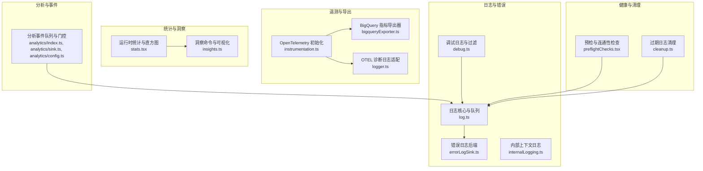
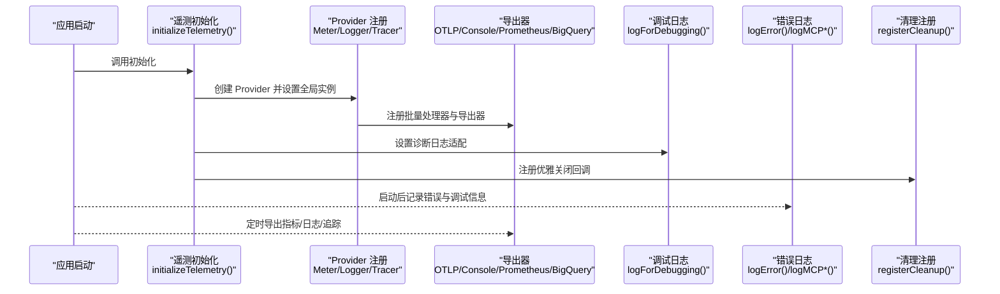
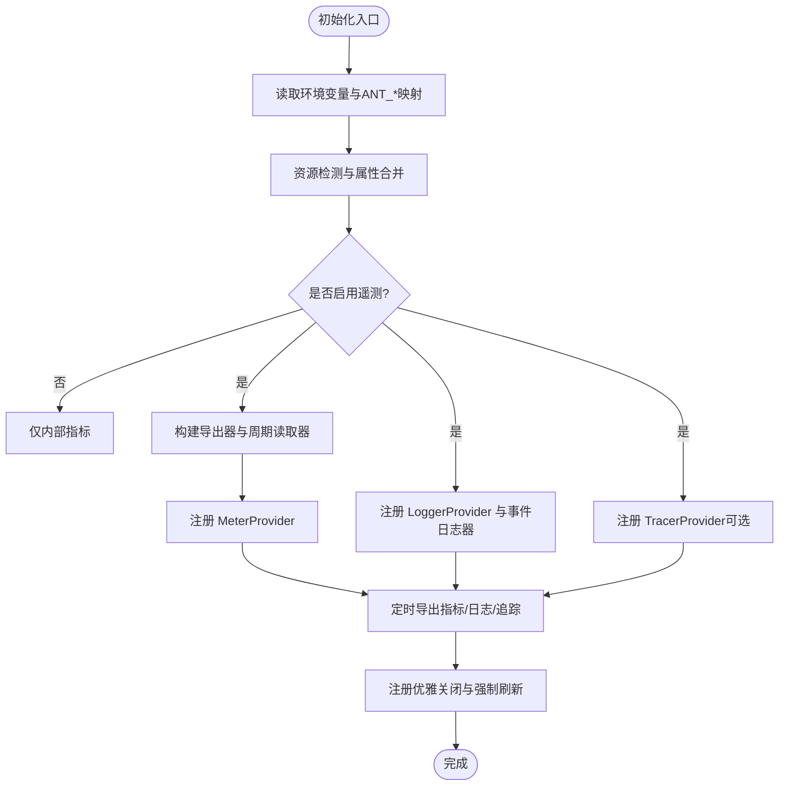
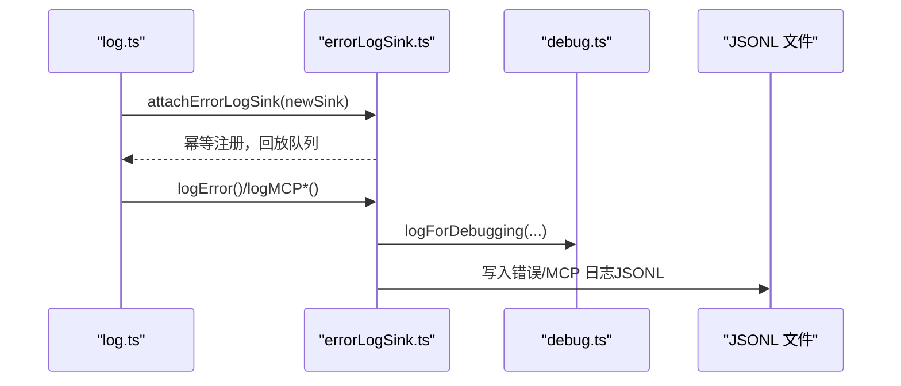
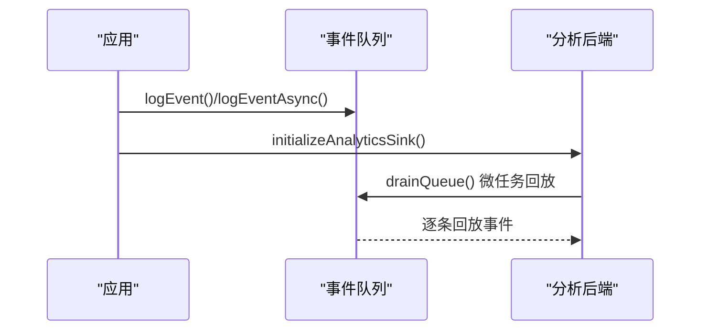
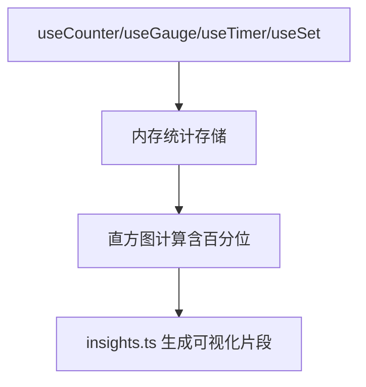
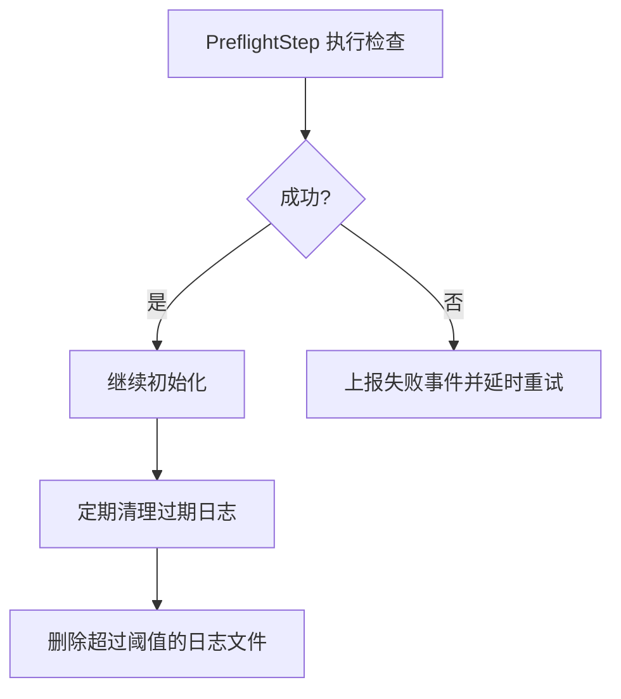
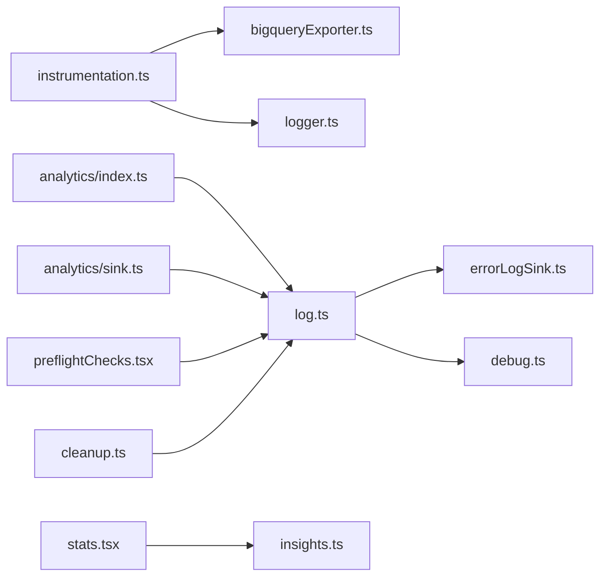

# 监控与日志

<cite>
**本文引用的文件**
- [instrumentation.ts](file://src/utils/telemetry/instrumentation.ts)
- [logger.ts](file://src/utils/telemetry/logger.ts)
- [bigqueryExporter.ts](file://src/utils/telemetry/bigqueryExporter.ts)
- [log.ts](file://src/utils/log.ts)
- [errorLogSink.ts](file://src/utils/errorLogSink.ts)
- [debug.ts](file://src/utils/debug.ts)
- [internalLogging.ts](file://src/services/internalLogging.ts)
- [analytics/index.ts](file://src/services/analytics/index.ts)
- [analytics/sink.ts](file://src/services/analytics/sink.ts)
- [analytics/config.ts](file://src/services/analytics/config.ts)
- [cleanup.ts](file://src/utils/cleanup.ts)
- [stats.tsx](file://src/context/stats.tsx)
- [insights.ts](file://src/commands/insights.ts)
- [SentryErrorBoundary.ts](file://src/components/SentryErrorBoundary.ts)
- [preflightChecks.tsx](file://src/utils/preflightChecks.tsx)
</cite>

## 目录
1. [简介](#简介)
2. [项目结构](#项目结构)
3. [核心组件](#核心组件)
4. [架构总览](#架构总览)
5. [详细组件分析](#详细组件分析)
6. [依赖关系分析](#依赖关系分析)
7. [性能考量](#性能考量)
8. [故障排查指南](#故障排查指南)
9. [结论](#结论)
10. [附录](#附录)

## 简介
本文件面向 Claude Code 的监控与日志管理，系统性梳理其监控架构（性能指标、系统健康检查、告警机制）、日志体系（日志级别、输出格式、存储策略）、错误追踪与异常处理（错误分类、堆栈跟踪、调试信息收集），并提供日志分析工具使用指南（日志聚合、搜索、可视化）。同时覆盖监控数据采集与上报（自定义指标、业务指标、基础设施指标）、监控仪表板配置与告警规则设置建议，以及日志管理与存储最佳实践（轮转、压缩、归档）。

## 项目结构
围绕监控与日志的关键模块分布如下：
- 三态遥测（Telemetry）：基于 OpenTelemetry 的指标、日志、追踪初始化与导出器配置
- 内部日志与错误日志：统一错误记录、MCP 日志、调试日志与持久化
- 分析与事件：事件队列、门控开关、延迟初始化与回放
- 统计与洞察：运行时统计、直方图与可视化
- 健康检查与清理：预检流程、过期日志清理

**图表来源**
- [instrumentation.ts:421-701](file://src/utils/telemetry/instrumentation.ts#L421-L701)
- [bigqueryExporter.ts:40-254](file://src/utils/telemetry/bigqueryExporter.ts#L40-L254)
- [logger.ts:4-28](file://src/utils/telemetry/logger.ts#L4-L28)
- [errorLogSink.ts:225-237](file://src/utils/errorLogSink.ts#L225-L237)
- [log.ts:109-134](file://src/utils/log.ts#L109-L134)
- [debug.ts:203-228](file://src/utils/debug.ts#L203-L228)
- [internalLogging.ts:71-92](file://src/services/internalLogging.ts#L71-L92)
- [analytics/index.ts:95-123](file://src/services/analytics/index.ts#L95-L123)
- [analytics/sink.ts:109-114](file://src/services/analytics/sink.ts#L109-L114)
- [analytics/config.ts:19-27](file://src/services/analytics/config.ts#L19-L27)
- [stats.tsx:38-219](file://src/context/stats.tsx#L38-L219)
- [insights.ts:1863-1911](file://src/commands/insights.ts#L1863-L1911)
- [preflightChecks.tsx:78-121](file://src/utils/preflightChecks.tsx#L78-L121)
- [cleanup.ts:93-109](file://src/utils/cleanup.ts#L93-L109)

**章节来源**
- [instrumentation.ts:421-701](file://src/utils/telemetry/instrumentation.ts#L421-L701)
- [log.ts:109-134](file://src/utils/log.ts#L109-L134)
- [debug.ts:203-228](file://src/utils/debug.ts#L203-L228)
- [errorLogSink.ts:225-237](file://src/utils/errorLogSink.ts#L225-L237)
- [analytics/index.ts:95-123](file://src/services/analytics/index.ts#L95-L123)
- [analytics/sink.ts:109-114](file://src/services/analytics/sink.ts#L109-L114)
- [analytics/config.ts:19-27](file://src/services/analytics/config.ts#L19-L27)
- [stats.tsx:38-219](file://src/context/stats.tsx#L38-L219)
- [insights.ts:1863-1911](file://src/commands/insights.ts#L1863-L1911)
- [preflightChecks.tsx:78-121](file://src/utils/preflightChecks.tsx#L78-L121)
- [cleanup.ts:93-109](file://src/utils/cleanup.ts#L93-L109)

## 核心组件
- 遥测初始化与导出
  - 指标：支持控制台、OTLP、Prometheus；默认周期导出；BigQuery 导出器按条件启用
  - 日志：OTLP 日志导出器；批量处理器；事件日志器；优雅关闭与强制刷新
  - 追踪：可选增强追踪（OTLP HTTP）
  - 诊断日志：OTEL 诊断日志桥接到内部日志系统
- 错误与调试日志
  - 错误日志：队列化、延迟初始化、JSONL 文件写入、MCP 专用日志
  - 调试日志：级别过滤、模式过滤、标准输出/文件、最新日志软链
- 分析与事件
  - 事件队列：启动前事件缓存，后端初始化后异步回放
  - 门控：功能门控与隐私级别控制
- 统计与洞察
  - 运行时统计：计数器、量规、直方图、集合
  - 可视化：响应时间直方图、时段分布等
- 健康检查与清理
  - 预检：连通性检查与失败事件上报
  - 清理：按时间阈值清理旧日志文件

**章节来源**
- [instrumentation.ts:421-701](file://src/utils/telemetry/instrumentation.ts#L421-L701)
- [logger.ts:4-28](file://src/utils/telemetry/logger.ts#L4-L28)
- [bigqueryExporter.ts:40-254](file://src/utils/telemetry/bigqueryExporter.ts#L40-L254)
- [errorLogSink.ts:225-237](file://src/utils/errorLogSink.ts#L225-L237)
- [log.ts:109-134](file://src/utils/log.ts#L109-L134)
- [debug.ts:203-228](file://src/utils/debug.ts#L203-L228)
- [analytics/index.ts:95-123](file://src/services/analytics/index.ts#L95-L123)
- [analytics/sink.ts:109-114](file://src/services/analytics/sink.ts#L109-L114)
- [analytics/config.ts:19-27](file://src/services/analytics/config.ts#L19-L27)
- [stats.tsx:38-219](file://src/context/stats.tsx#L38-L219)
- [insights.ts:1863-1911](file://src/commands/insights.ts#L1863-L1911)
- [preflightChecks.tsx:78-121](file://src/utils/preflightChecks.tsx#L78-L121)
- [cleanup.ts:93-109](file://src/utils/cleanup.ts#L93-L109)

## 架构总览
下图展示从应用启动到遥测与日志的完整路径，包括初始化、导出、清理与健康检查。

**图表来源**
- [instrumentation.ts:421-701](file://src/utils/telemetry/instrumentation.ts#L421-L701)
- [logger.ts:4-28](file://src/utils/telemetry/logger.ts#L4-L28)
- [debug.ts:203-228](file://src/utils/debug.ts#L203-L228)
- [errorLogSink.ts:225-237](file://src/utils/errorLogSink.ts#L225-L237)

## 详细组件分析

### 遥测与指标导出
- 初始化流程
  - 环境变量注入（ANT_* 变量对齐）、默认聚合方式、平台资源属性合并
  - 条件启用：用户显式开启遥测或 BigQuery 条件满足时才启用
  - 日志与追踪：按需启用；事件日志器命名空间固定
- 指标导出
  - 控制台/OTLP/Prometheus 多协议动态导入；周期导出间隔可配置
  - BigQuery 导出器：仅在 API 客户端、C4E 或团队订阅用户启用；带超时与信任校验
- 日志与追踪
  - 日志：批量处理器+OTLP 导出器；退出前强制刷新
  - 追踪：增强追踪独立路径，HTTP 协议，事件日志器
- 诊断日志
  - OTEL 诊断日志桥接至内部日志与调试输出

**图表来源**
- [instrumentation.ts:421-701](file://src/utils/telemetry/instrumentation.ts#L421-L701)
- [bigqueryExporter.ts:40-254](file://src/utils/telemetry/bigqueryExporter.ts#L40-L254)
- [logger.ts:4-28](file://src/utils/telemetry/logger.ts#L4-L28)

**章节来源**
- [instrumentation.ts:421-701](file://src/utils/telemetry/instrumentation.ts#L421-L701)
- [bigqueryExporter.ts:40-254](file://src/utils/telemetry/bigqueryExporter.ts#L40-L254)
- [logger.ts:4-28](file://src/utils/telemetry/logger.ts#L4-L28)

### 错误追踪与异常处理
- 错误日志后端
  - 延迟初始化：attachErrorLogSink 支持多次调用且幂等
  - 队列化：初始化前的错误事件入队，初始化后立即回放
  - JSONL 文件：按日期分片，MCP 专用日志目录
  - 上下文：会话 ID、工作目录、版本号、用户类型
- 调试日志
  - 级别过滤：verbose/debug/info/warn/error
  - 模式过滤：支持包含/排除模式组合，混合模式视为无过滤
  - 输出目标：标准错误或文件；自动维护“latest”软链
- 异常边界
  - React 异常边界：捕获渲染错误，避免崩溃

**图表来源**
- [log.ts:109-134](file://src/utils/log.ts#L109-L134)
- [errorLogSink.ts:225-237](file://src/utils/errorLogSink.ts#L225-L237)
- [debug.ts:203-228](file://src/utils/debug.ts#L203-L228)

**章节来源**
- [log.ts:109-134](file://src/utils/log.ts#L109-L134)
- [errorLogSink.ts:225-237](file://src/utils/errorLogSink.ts#L225-L237)
- [debug.ts:203-228](file://src/utils/debug.ts#L203-L228)
- [SentryErrorBoundary.ts:11-27](file://src/components/SentryErrorBoundary.ts#L11-L27)

### 分析与事件队列
- 事件队列
  - 初始化前事件缓存，后端就绪后微任务异步回放，避免阻塞启动
  - 计数：用于观测队列长度（蚂蚁用户）
- 门控
  - 功能门控：Datadog 门控
  - 隐私级别：测试环境、第三方云提供商、隐私级别禁用分析

**图表来源**
- [analytics/index.ts:95-123](file://src/services/analytics/index.ts#L95-L123)
- [analytics/sink.ts:109-114](file://src/services/analytics/sink.ts#L109-L114)
- [analytics/config.ts:19-27](file://src/services/analytics/config.ts#L19-L27)

**章节来源**
- [analytics/index.ts:95-123](file://src/services/analytics/index.ts#L95-L123)
- [analytics/sink.ts:109-114](file://src/services/analytics/sink.ts#L109-L114)
- [analytics/config.ts:19-27](file://src/services/analytics/config.ts#L19-L27)

### 统计与洞察
- 运行时统计
  - 计数器、量规、直方图（含 p50/p90 等）、集合
  - 基于蓄水池抽样的近似统计
- 洞察命令
  - 响应时间直方图、时段分布等可视化 HTML 片段生成

**图表来源**
- [stats.tsx:38-219](file://src/context/stats.tsx#L38-L219)
- [insights.ts:1863-1911](file://src/commands/insights.ts#L1863-L1911)

**章节来源**
- [stats.tsx:38-219](file://src/context/stats.tsx#L38-L219)
- [insights.ts:1863-1911](file://src/commands/insights.ts#L1863-L1911)

### 健康检查与清理
- 预检
  - 连通性检查与失败事件上报，失败时延时重试
- 清理
  - 按时间阈值删除旧消息与错误日志文件，支持 MCP 日志清理

**图表来源**
- [preflightChecks.tsx:78-121](file://src/utils/preflightChecks.tsx#L78-L121)
- [cleanup.ts:93-109](file://src/utils/cleanup.ts#L93-L109)

**章节来源**
- [preflightChecks.tsx:78-121](file://src/utils/preflightChecks.tsx#L78-L121)
- [cleanup.ts:93-109](file://src/utils/cleanup.ts#L93-L109)

## 依赖关系分析
- 组件耦合
  - 遥测初始化与导出器解耦，按协议动态导入，降低冷启动成本
  - 错误日志与调试日志通过统一接口桥接，避免循环依赖
  - 分析事件队列与后端解耦，支持延迟初始化与回放
- 外部依赖
  - OpenTelemetry SDK、HTTP 导出器、BigQuery API、React 异常边界
- 潜在环路
  - 通过延迟初始化与接口抽象避免直接循环引用

**图表来源**
- [instrumentation.ts:421-701](file://src/utils/telemetry/instrumentation.ts#L421-L701)
- [bigqueryExporter.ts:40-254](file://src/utils/telemetry/bigqueryExporter.ts#L40-L254)
- [logger.ts:4-28](file://src/utils/telemetry/logger.ts#L4-L28)
- [log.ts:109-134](file://src/utils/log.ts#L109-L134)
- [errorLogSink.ts:225-237](file://src/utils/errorLogSink.ts#L225-L237)
- [debug.ts:203-228](file://src/utils/debug.ts#L203-L228)
- [analytics/index.ts:95-123](file://src/services/analytics/index.ts#L95-L123)
- [analytics/sink.ts:109-114](file://src/services/analytics/sink.ts#L109-L114)
- [stats.tsx:38-219](file://src/context/stats.tsx#L38-L219)
- [insights.ts:1863-1911](file://src/commands/insights.ts#L1863-L1911)
- [preflightChecks.tsx:78-121](file://src/utils/preflightChecks.tsx#L78-L121)
- [cleanup.ts:93-109](file://src/utils/cleanup.ts#L93-L109)

**章节来源**
- [instrumentation.ts:421-701](file://src/utils/telemetry/instrumentation.ts#L421-L701)
- [log.ts:109-134](file://src/utils/log.ts#L109-L134)
- [errorLogSink.ts:225-237](file://src/utils/errorLogSink.ts#L225-L237)
- [debug.ts:203-228](file://src/utils/debug.ts#L203-L228)
- [analytics/index.ts:95-123](file://src/services/analytics/index.ts#L95-L123)
- [analytics/sink.ts:109-114](file://src/services/analytics/sink.ts#L109-L114)
- [stats.tsx:38-219](file://src/context/stats.tsx#L38-L219)
- [insights.ts:1863-1911](file://src/commands/insights.ts#L1863-L1911)
- [preflightChecks.tsx:78-121](file://src/utils/preflightChecks.tsx#L78-L121)
- [cleanup.ts:93-109](file://src/utils/cleanup.ts#L93-L109)

## 性能考量
- 遥测初始化
  - 动态导入导出器，避免不必要的包加载
  - 默认导出间隔与批量处理器减少网络开销
- 日志写入
  - 缓冲写入与异步刷新，避免阻塞主流程
  - “latest”软链更新在后台进行，不影响写入路径
- BigQuery 导出
  - 5 分钟导出周期降低负载；信任状态与组织级开关保护
- 事件回放
  - 微任务异步回放，避免阻塞启动路径

[本节为通用指导，无需特定文件引用]

## 故障排查指南
- 遥测导出失败
  - 检查环境变量：导出器类型、协议、端点、头部、代理与 mTLS 配置
  - 查看诊断日志：OTEL 诊断日志桥接至内部错误日志与调试输出
  - 超时处理：增大 CLAUDE_CODE_OTEL_SHUTDOWN_TIMEOUT_MS 或调整后端容量
- 错误日志缺失
  - 确认 initializeErrorLogSink 在 initializeAnalyticsSink 之前调用
  - 检查隐私级别与 DISABLE_ERROR_REPORTING 环境变量
- 调试日志不显示
  - 确认 --debug 或 CLAUDE_CODE_DEBUG_LOG_LEVEL 设置
  - 使用 --debug=pattern 过滤类别，避免混合包含/排除模式
- 日志清理无效
  - 检查清理阈值与目录权限；确认过期文件名格式转换逻辑
- 健康检查失败
  - 关注预检失败事件与延时重试；必要时缩短超时或提升网络质量

**章节来源**
- [instrumentation.ts:654-699](file://src/utils/telemetry/instrumentation.ts#L654-L699)
- [logger.ts:4-28](file://src/utils/telemetry/logger.ts#L4-L28)
- [errorLogSink.ts:225-237](file://src/utils/errorLogSink.ts#L225-L237)
- [log.ts:168-177](file://src/utils/log.ts#L168-L177)
- [debug.ts:34-40](file://src/utils/debug.ts#L34-L40)
- [cleanup.ts:93-109](file://src/utils/cleanup.ts#L93-L109)
- [preflightChecks.tsx:78-121](file://src/utils/preflightChecks.tsx#L78-L121)

## 结论
该系统以 OpenTelemetry 为核心，结合内部日志与分析事件队列，提供了完整的监控与日志能力：可观测性数据可按需导出至多种后端，错误与调试日志具备完善的持久化与过滤机制，事件队列与门控确保在不同隐私与功能条件下稳定运行。配合健康检查与日志清理，整体形成闭环的运维保障。

[本节为总结，无需特定文件引用]

## 附录

### 监控数据采集与上报要点
- 自定义指标
  - 使用运行时统计接口（计数器/量规/直方图/集合）采集业务与系统指标
  - 通过 BigQuery 导出器上报内部指标，注意信任状态与组织级开关
- 业务指标
  - 响应时间、时段分布等由洞察命令生成可视化
- 基础设施指标
  - 由遥测初始化注入的资源属性（服务名、版本、OS/主机架构、WSL 版本）参与聚合

**章节来源**
- [stats.tsx:38-219](file://src/context/stats.tsx#L38-L219)
- [insights.ts:1863-1911](file://src/commands/insights.ts#L1863-L1911)
- [bigqueryExporter.ts:150-196](file://src/utils/telemetry/bigqueryExporter.ts#L150-L196)
- [instrumentation.ts:471-511](file://src/utils/telemetry/instrumentation.ts#L471-L511)

### 日志分析工具使用指南
- 日志聚合
  - 将 JSONL 错误日志与 MCP 日志按日期分片，便于聚合查询
- 日志搜索
  - 使用调试过滤模式（--debug=pattern）缩小范围
  - 通过“latest”软链快速定位当前会话日志
- 可视化
  - 使用洞察命令生成 HTML 图表，如响应时间直方图与时段分布

**章节来源**
- [errorLogSink.ts:29-38](file://src/utils/errorLogSink.ts#L29-L38)
- [debug.ts:230-236](file://src/utils/debug.ts#L230-L236)
- [insights.ts:1863-1911](file://src/commands/insights.ts#L1863-L1911)

### 监控仪表板与告警规则建议
- 仪表板
  - 指标：响应时间直方图、时段分布、错误率、资源利用率
  - 日志：错误数量趋势、MCP 服务器错误分布
- 告警规则
  - 指标类：错误率突增、响应时间 P95 超阈、导出失败次数
  - 日志类：关键错误关键字命中、MCP 连接失败频次
  - 健康类：预检失败率、遥测导出超时比例

[本节为概念性建议，无需特定文件引用]

### 日志管理与存储最佳实践
- 轮转
  - 按日期分片（JSONL），避免单文件过大
- 压缩与归档
  - 对历史日志进行压缩归档，保留最近 N 天
- 清理策略
  - 基于时间阈值定期清理；区分消息日志与错误日志目录
- 安全与合规
  - 严格遵循隐私级别与组织级开关，避免敏感数据外泄

**章节来源**
- [errorLogSink.ts:85-109](file://src/utils/errorLogSink.ts#L85-L109)
- [cleanup.ts:93-109](file://src/utils/cleanup.ts#L93-L109)
- [analytics/config.ts:19-27](file://src/services/analytics/config.ts#L19-L27)