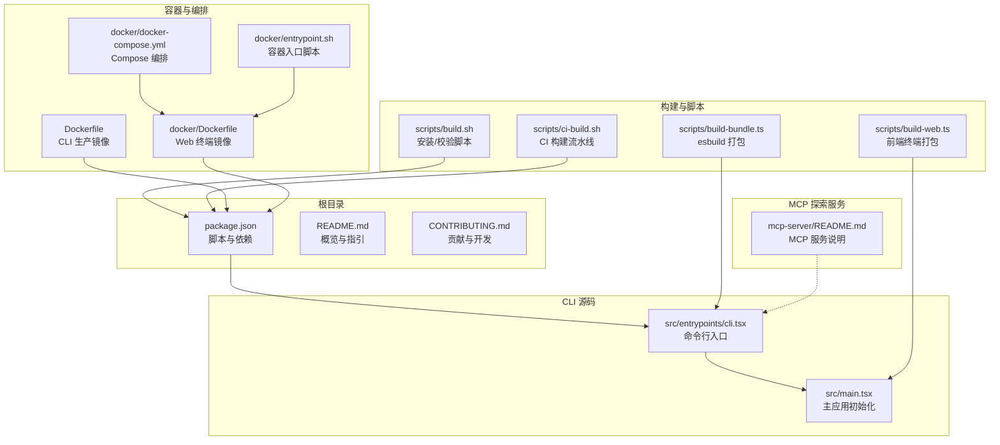
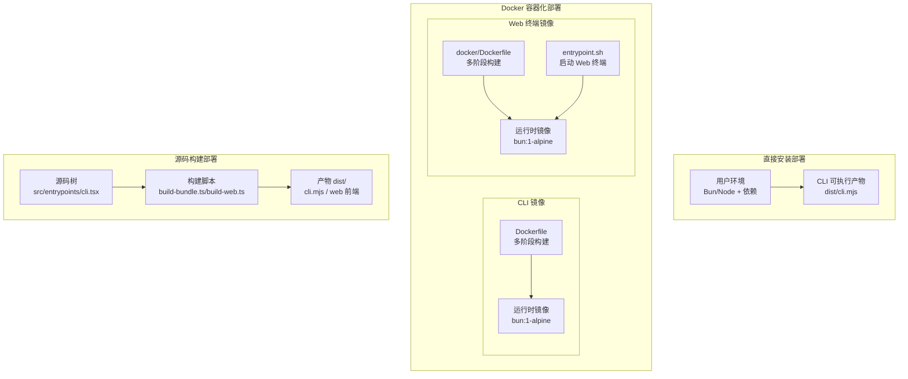
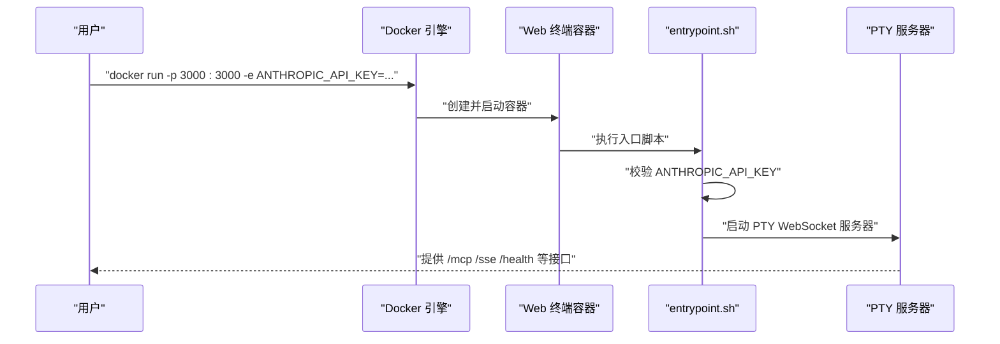
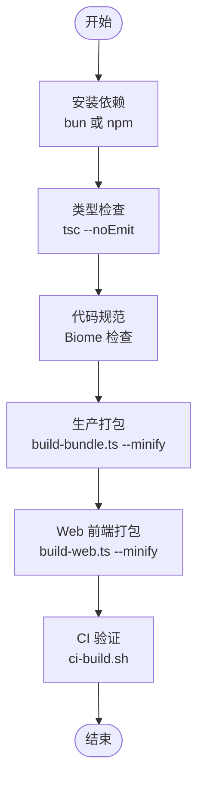
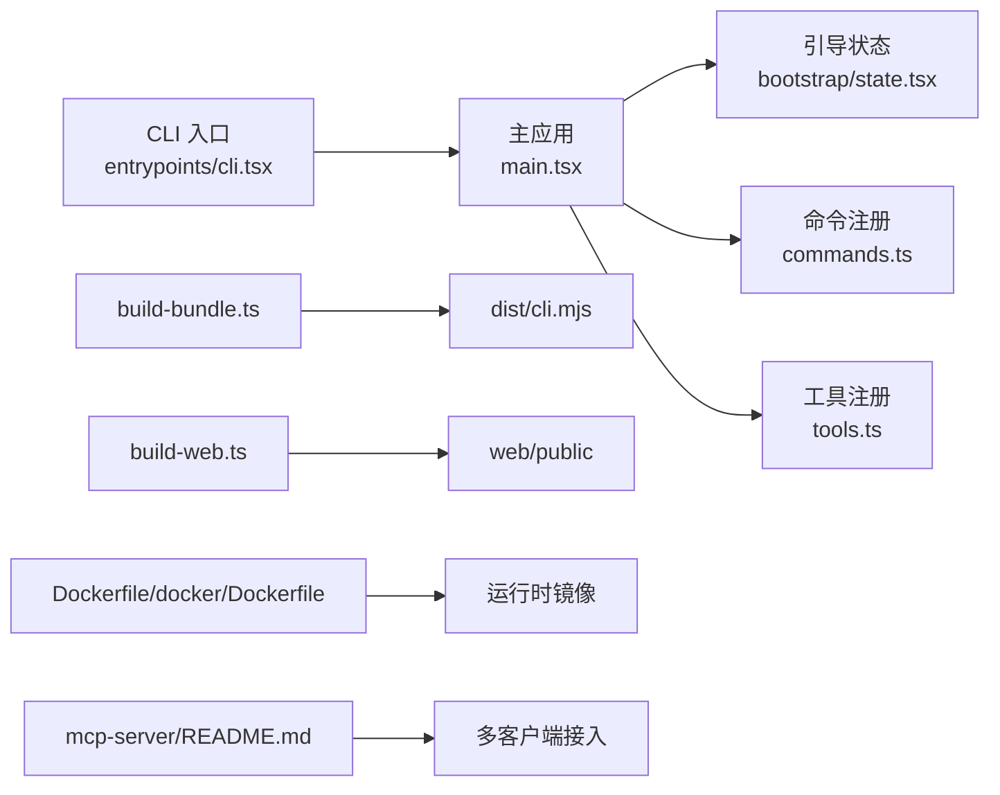

# 部署方式

<cite>
**本文引用的文件**
- [README.md](file://README.md)
- [Dockerfile](file://Dockerfile)
- [docker/Dockerfile](file://docker/Dockerfile)
- [docker/docker-compose.yml](file://docker/docker-compose.yml)
- [docker/entrypoint.sh](file://docker/entrypoint.sh)
- [scripts/build.sh](file://scripts/build.sh)
- [scripts/ci-build.sh](file://scripts/ci-build.sh)
- [scripts/build-bundle.ts](file://scripts/build-bundle.ts)
- [scripts/build-web.ts](file://scripts/build-web.ts)
- [package.json](file://package.json)
- [src/entrypoints/cli.tsx](file://src/entrypoints/cli.tsx)
- [src/main.tsx](file://src/main.tsx)
- [mcp-server/README.md](file://mcp-server/README.md)
- [CONTRIBUTING.md](file://CONTRIBUTING.md)
</cite>

## 目录
1. [简介](#简介)
2. [项目结构](#项目结构)
3. [核心组件](#核心组件)
4. [架构总览](#架构总览)
5. [详细组件分析](#详细组件分析)
6. [依赖关系分析](#依赖关系分析)
7. [性能考量](#性能考量)
8. [故障排查指南](#故障排查指南)
9. [结论](#结论)
10. [附录](#附录)

## 简介
本文件面向希望在本地或生产环境中部署 Claude Code 的用户与运维人员，系统性地阐述三种主要部署方式：直接安装部署、Docker 容器化部署与源码构建部署。文档覆盖适用场景、优缺点、配置要求、镜像构建流程、容器运行参数与环境变量、源码构建步骤（依赖安装、编译、产物）、跨平台（Linux/macOS/Windows）部署要点、部署前准备与验证、以及常见问题与排障建议。

## 项目结构
仓库采用多模块组织，核心 CLI 入口位于 src/entrypoints/cli.tsx，主应用逻辑在 src/main.tsx；同时提供 Docker 多阶段构建与 Web 终端容器化方案，并配套 MCP 探索服务器与脚本工具链。

图示来源
- [package.json:1-95](file://package.json#L1-L95)
- [src/entrypoints/cli.tsx:1-304](file://src/entrypoints/cli.tsx#L1-L304)
- [src/main.tsx:1-800](file://src/main.tsx#L1-L800)
- [scripts/build-bundle.ts:1-198](file://scripts/build-bundle.ts#L1-L198)
- [scripts/build-web.ts:1-59](file://scripts/build-web.ts#L1-L59)
- [scripts/build.sh:1-59](file://scripts/build.sh#L1-L59)
- [scripts/ci-build.sh:1-50](file://scripts/ci-build.sh#L1-L50)
- [Dockerfile:1-46](file://Dockerfile#L1-L46)
- [docker/Dockerfile:1-84](file://docker/Dockerfile#L1-L84)
- [docker/docker-compose.yml:1-29](file://docker/docker-compose.yml#L1-L29)
- [docker/entrypoint.sh:1-29](file://docker/entrypoint.sh#L1-L29)
- [mcp-server/README.md:1-280](file://mcp-server/README.md#L1-L280)

章节来源
- [README.md:1-448](file://README.md#L1-L448)
- [package.json:1-95](file://package.json#L1-L95)

## 核心组件
- CLI 入口与主应用
  - CLI 入口负责解析命令行参数、快速路径短路、按需动态导入与特性门控加载，最终委托主应用完成初始化与渲染。
  - 主应用负责并行预取、权限与策略初始化、遥测、插件与技能加载、REPL 启动等。
- 构建与打包
  - 使用 esbuild 将入口打包为单文件 ESM 输出，支持 watch、minify、sourcemap、define 注入与外部依赖排除。
  - 提供 Web 前端终端打包脚本，用于容器内 Web 终端体验。
- 容器与编排
  - 提供 CLI 生产镜像与 Web 终端镜像，分别面向命令行与浏览器终端场景。
  - 提供 docker-compose 编排与健康检查、持久化卷与 tmpfs 配置。
- MCP 探索服务
  - 提供 STDIO/HTTP/SSE 三种传输协议，暴露工具、资源与提示模板，便于在多种客户端中探索源码。

章节来源
- [src/entrypoints/cli.tsx:1-304](file://src/entrypoints/cli.tsx#L1-L304)
- [src/main.tsx:1-800](file://src/main.tsx#L1-L800)
- [scripts/build-bundle.ts:1-198](file://scripts/build-bundle.ts#L1-L198)
- [scripts/build-web.ts:1-59](file://scripts/build-web.ts#L1-L59)
- [Dockerfile:1-46](file://Dockerfile#L1-L46)
- [docker/Dockerfile:1-84](file://docker/Dockerfile#L1-L84)
- [docker/docker-compose.yml:1-29](file://docker/docker-compose.yml#L1-L29)
- [mcp-server/README.md:1-280](file://mcp-server/README.md#L1-L280)

## 架构总览
下图展示三种部署方式的总体架构与交互关系：直接安装通过本地运行 CLI；Docker 容器化部署提供 CLI 与 Web 终端两种镜像；源码构建部署则从源码出发，经由构建脚本产出可执行产物。

图示来源
- [Dockerfile:1-46](file://Dockerfile#L1-L46)
- [docker/Dockerfile:1-84](file://docker/Dockerfile#L1-L84)
- [docker/entrypoint.sh:1-29](file://docker/entrypoint.sh#L1-L29)
- [scripts/build-bundle.ts:1-198](file://scripts/build-bundle.ts#L1-L198)
- [scripts/build-web.ts:1-59](file://scripts/build-web.ts#L1-L59)
- [src/entrypoints/cli.tsx:1-304](file://src/entrypoints/cli.tsx#L1-L304)

## 详细组件分析

### 直接安装部署
- 适用场景
  - 开发调试、本地快速试用、无需隔离运行环境。
- 优点
  - 部署简单，无额外虚拟化开销。
- 缺点
  - 依赖管理与系统环境差异可能带来兼容性问题。
- 配置要求
  - 运行时：Bun（版本要求见 package.json engines 字段）。
  - 依赖：安装脚本会自动处理（优先使用 bun install，其次 npm install）。
  - 认证：需要设置 ANTHROPIC_API_KEY 环境变量（CLI 运行时读取）。
- 步骤
  - 安装依赖：根据 scripts/build.sh 逻辑，优先使用 bun 或 npm。
  - 运行：通过 CLI 入口执行命令（例如 -p 参数进行非交互模式测试）。
- 跨平台要点
  - Linux/macOS：确保 Bun 版本满足要求，PATH 中包含 bun。
  - Windows：注意 PATH 劫持安全变量设置已在主应用中处理；如需使用 SSH/远程功能，请确认对应工具可用。

章节来源
- [scripts/build.sh:1-59](file://scripts/build.sh#L1-L59)
- [package.json:90-94](file://package.json#L90-L94)
- [src/main.tsx:585-800](file://src/main.tsx#L585-L800)
- [src/entrypoints/cli.tsx:1-304](file://src/entrypoints/cli.tsx#L1-L304)

### Docker 容器化部署
- 适用场景
  - 需要隔离运行环境、统一依赖、便于横向扩展与云原生编排。
- 优点
  - 一次构建，多处运行；镜像层缓存优化安装流程；健康检查与资源限制明确。
- 缺点
  - 需要掌握 Docker/Compose 基础；网络与存储配置需按需调整。
- 镜像与构建
  - CLI 生产镜像：基于 oven/bun:1-alpine，多阶段构建，仅复制 dist/cli.mjs 到运行时镜像。
  - Web 终端镜像：多阶段构建 node-pty 原生模块，复制 CLI 产物与前端静态资源，提供 HTTP/WebSocket 终端服务。
- 容器运行参数与环境变量
  - 必需：ANTHROPIC_API_KEY（CLI 镜像）；MCP_API_KEY（HTTP 模式，可选）。
  - 可选：AUTH_TOKEN（启用访问令牌保护）、MAX_SESSIONS（最大并发会话数）、ALLOWED_ORIGINS（CORS 白名单）。
  - 端口：Web 终端默认 3000/TCP；CLI 镜像通常不暴露端口，以命令行方式运行。
- 编排与持久化
  - docker-compose.yml 提供端口映射、环境变量注入、持久化卷（~/.claude）、tmpfs（临时文件）与健康检查。
- 容器启动流程（Web 终端）
  - entrypoint.sh 校验 ANTHROPIC_API_KEY，打印运行参数，随后启动 PTY WebSocket 服务器。

图示来源
- [docker/docker-compose.yml:1-29](file://docker/docker-compose.yml#L1-L29)
- [docker/entrypoint.sh:1-29](file://docker/entrypoint.sh#L1-L29)
- [docker/Dockerfile:1-84](file://docker/Dockerfile#L1-L84)

章节来源
- [Dockerfile:1-46](file://Dockerfile#L1-L46)
- [docker/Dockerfile:1-84](file://docker/Dockerfile#L1-L84)
- [docker/docker-compose.yml:1-29](file://docker/docker-compose.yml#L1-L29)
- [docker/entrypoint.sh:1-29](file://docker/entrypoint.sh#L1-L29)

### 源码构建部署
- 适用场景
  - 需要自定义构建参数、离线环境、或对产物进行二次封装。
- 优点
  - 完全可控的构建流程与产物；便于集成到现有 CI/CD。
- 缺点
  - 需要具备 Node/Bun 环境与 esbuild 工具链。
- 依赖安装
  - 优先使用 bun install；若无 bun 则回退到 npm install。
- 编译步骤
  - 生产打包：bun scripts/build-bundle.ts --minify，输出 dist/cli.mjs（ESM 单文件）。
  - Web 前端：bun scripts/build-web.ts --minify，输出到 src/server/web/public。
  - 观察模式：添加 --watch 支持增量构建。
- 产物说明
  - CLI：dist/cli.mjs（可直接执行，内置 shebang）。
  - Web：前端静态资源位于 src/server/web/public，配合容器内服务器使用。
- CI 验证
  - scripts/ci-build.sh 提供完整流水线：安装 → 类型检查 → 代码规范 → 生产打包 → 产物校验（存在性、大小、Node/Bun 可运行性）。

图示来源
- [scripts/build.sh:1-59](file://scripts/build.sh#L1-L59)
- [scripts/ci-build.sh:1-50](file://scripts/ci-build.sh#L1-L50)
- [scripts/build-bundle.ts:1-198](file://scripts/build-bundle.ts#L1-L198)
- [scripts/build-web.ts:1-59](file://scripts/build-web.ts#L1-L59)

章节来源
- [scripts/build.sh:1-59](file://scripts/build.sh#L1-L59)
- [scripts/ci-build.sh:1-50](file://scripts/ci-build.sh#L1-L50)
- [scripts/build-bundle.ts:1-198](file://scripts/build-bundle.ts#L1-L198)
- [scripts/build-web.ts:1-59](file://scripts/build-web.ts#L1-L59)

## 依赖关系分析
- CLI 入口与主应用
  - CLI 入口通过动态导入实现快速路径与特性门控，避免不必要的模块加载。
  - 主应用在启动早期并行预取 MDM、钥匙串与策略等，减少首帧阻塞。
- 构建脚本与打包
  - build-bundle.ts 使用 esbuild，配置别名、外部依赖排除、define 注入与 sourcemap 控制，确保产物体积与可调试性。
- 容器镜像
  - CLI 镜像仅复制 dist/cli.mjs，最小化运行时依赖；Web 镜像复制 node_modules、CLI 产物与前端资源，提供完整的终端服务。
- MCP 探索服务
  - mcp-server/README.md 提供 STDIO/HTTP/SSE 三种传输方式与认证配置，便于在不同客户端中接入。

图示来源
- [src/entrypoints/cli.tsx:1-304](file://src/entrypoints/cli.tsx#L1-L304)
- [src/main.tsx:1-800](file://src/main.tsx#L1-L800)
- [scripts/build-bundle.ts:1-198](file://scripts/build-bundle.ts#L1-L198)
- [scripts/build-web.ts:1-59](file://scripts/build-web.ts#L1-L59)
- [Dockerfile:1-46](file://Dockerfile#L1-L46)
- [docker/Dockerfile:1-84](file://docker/Dockerfile#L1-L84)
- [mcp-server/README.md:1-280](file://mcp-server/README.md#L1-L280)

章节来源
- [src/entrypoints/cli.tsx:1-304](file://src/entrypoints/cli.tsx#L1-L304)
- [src/main.tsx:1-800](file://src/main.tsx#L1-L800)
- [scripts/build-bundle.ts:1-198](file://scripts/build-bundle.ts#L1-L198)
- [scripts/build-web.ts:1-59](file://scripts/build-web.ts#L1-L59)
- [Dockerfile:1-46](file://Dockerfile#L1-L46)
- [docker/Dockerfile:1-84](file://docker/Dockerfile#L1-L84)
- [mcp-server/README.md:1-280](file://mcp-server/README.md#L1-L280)

## 性能考量
- 启动性能
  - CLI 入口与主应用均采用并行预取与延迟加载策略，减少首次渲染阻塞。
  - 特性门控（feature gates）在构建期裁剪未使用的分支，降低运行时开销。
- 构建性能
  - 多阶段 Docker 构建与层缓存提升重复构建速度；esbuild 产物单文件减少冷启动时间。
- 运行性能
  - Web 终端镜像预编译 node-pty 原生模块，避免运行时编译开销。
  - 容器内 tmpfs 用于 PTY 临时文件，减少磁盘 IO。

## 故障排查指南
- 依赖安装失败
  - 确认已安装 Bun（满足 engines 要求），或回退到 npm。
  - 参考 scripts/build.sh 的安装逻辑与错误输出。
- 构建失败
  - 检查 TypeScript 类型与 Biome 规范；参考 scripts/ci-build.sh 的完整流水线输出定位问题。
  - 确认 dist/cli.mjs 是否生成，大小是否合理。
- 容器启动异常
  - CLI 镜像：必须设置 ANTHROPIC_API_KEY；检查 entrypoint.sh 的校验逻辑。
  - Web 镜像：确认端口映射（默认 3000）、AUTH_TOKEN 与 ALLOWED_ORIGINS 设置；查看健康检查结果。
- 权限与策略
  - 主应用在启动早期加载策略与权限，若被组织策略限制，部分功能可能不可用；可通过日志与错误信息定位。
- MCP 服务接入问题
  - 按 mcp-server/README.md 配置 STDIO/HTTP/SSE 传输与认证头；确认 CLAUDE_CODE_SRC_ROOT 指向正确源码路径。

章节来源
- [scripts/build.sh:1-59](file://scripts/build.sh#L1-L59)
- [scripts/ci-build.sh:1-50](file://scripts/ci-build.sh#L1-L50)
- [docker/entrypoint.sh:1-29](file://docker/entrypoint.sh#L1-L29)
- [src/main.tsx:1-800](file://src/main.tsx#L1-L800)
- [mcp-server/README.md:1-280](file://mcp-server/README.md#L1-L280)

## 结论
三种部署方式各有侧重：直接安装适合快速上手与开发调试；Docker 容器化适合生产与云原生场景；源码构建适合需要完全控制构建流程的团队。结合仓库提供的脚本与容器配置，可在 Linux/macOS/Windows 上高效完成部署与验证。

## 附录

### 不同操作系统下的部署要点
- Linux
  - 安装 Bun 并满足 engines 要求；使用 docker-compose 进行编排时，注意宿主机端口占用与 SELinux/防火墙策略。
- macOS
  - 注意 URL Scheme 与深链处理逻辑；容器运行时建议使用 Docker Desktop。
- Windows
  - CLI 启动时会设置安全相关环境变量以防止当前目录劫持；如需使用 SSH/远程功能，确保相应工具可用。

章节来源
- [package.json:90-94](file://package.json#L90-L94)
- [src/main.tsx:585-800](file://src/main.tsx#L585-L800)

### 部署前准备清单
- 环境准备
  - 安装 Bun（或 npm）并确保版本满足要求。
  - 准备 Anthropic API 密钥（ANTHROPIC_API_KEY）。
- 依赖检查
  - 运行 scripts/build.sh check 或 scripts/ci-build.sh 完整流水线。
- 配置验证
  - CLI：通过 -p 参数执行非交互命令验证版本与基础功能。
  - Web：访问 /health 端点确认健康状态；必要时配置 AUTH_TOKEN 与 ALLOWED_ORIGINS。

章节来源
- [scripts/build.sh:1-59](file://scripts/build.sh#L1-L59)
- [scripts/ci-build.sh:1-50](file://scripts/ci-build.sh#L1-L50)
- [docker/docker-compose.yml:1-29](file://docker/docker-compose.yml#L1-L29)