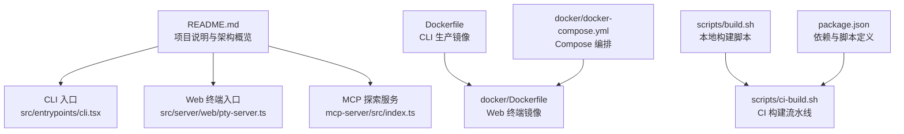
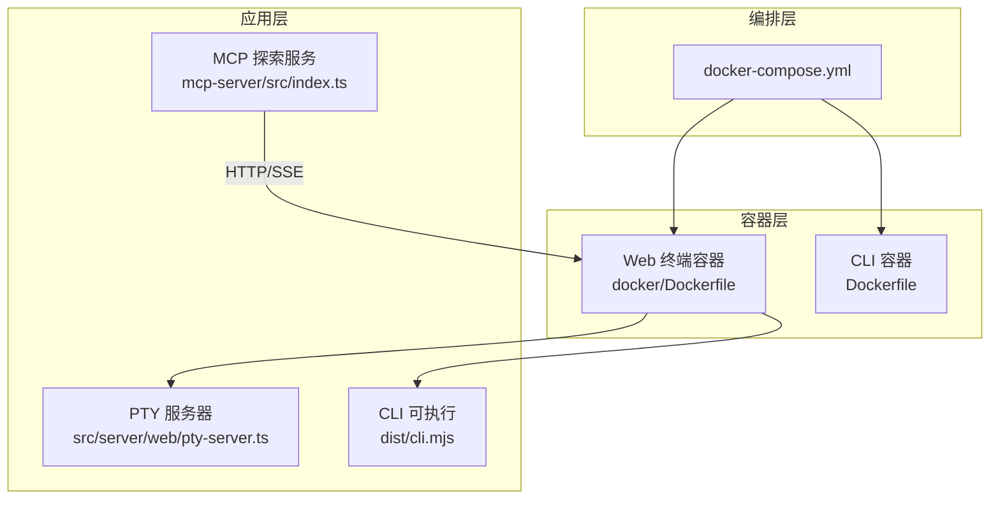
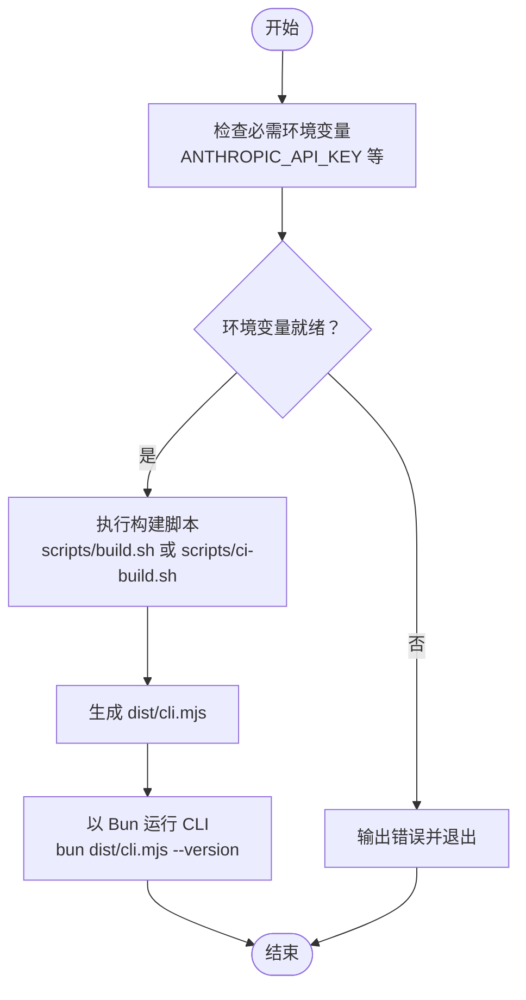
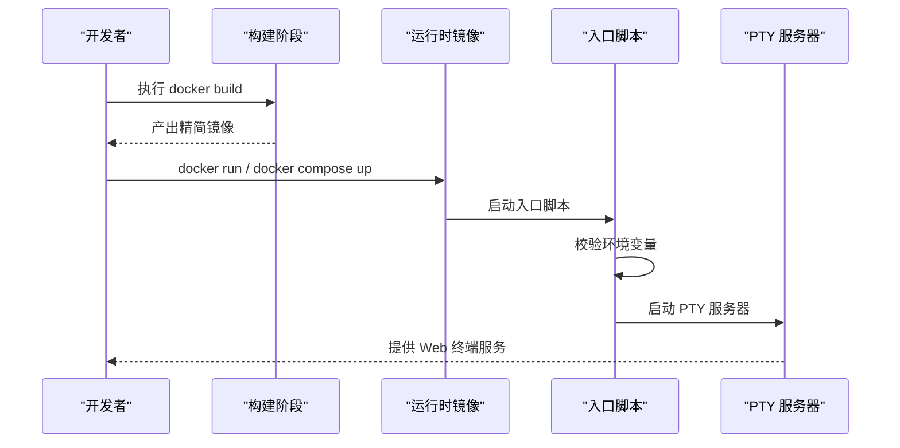
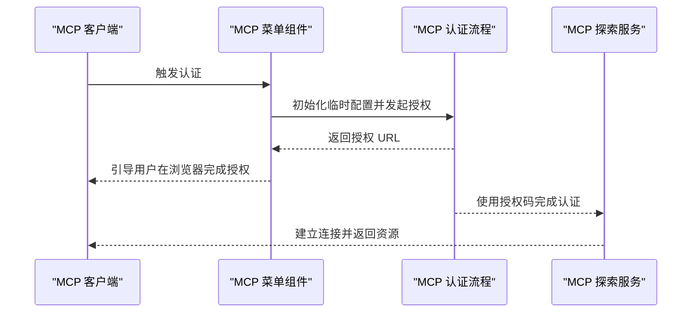
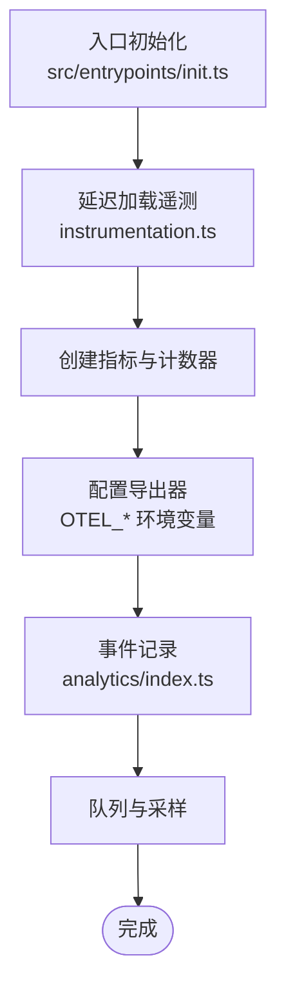
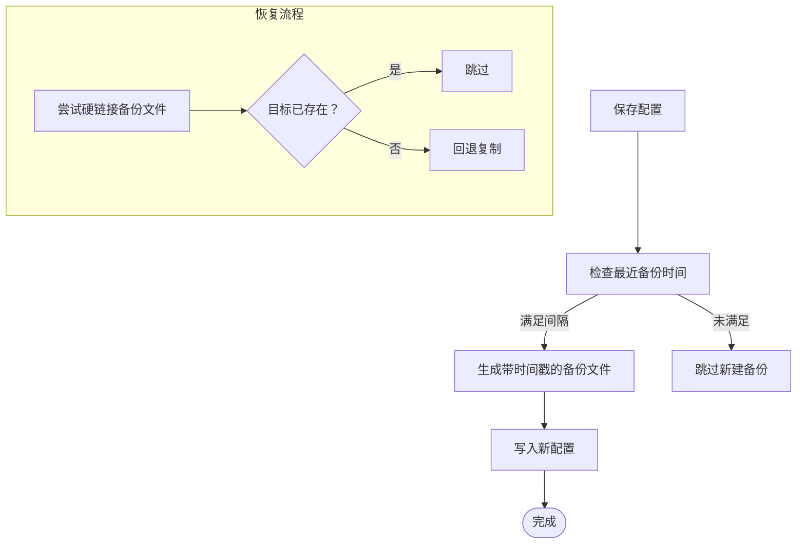
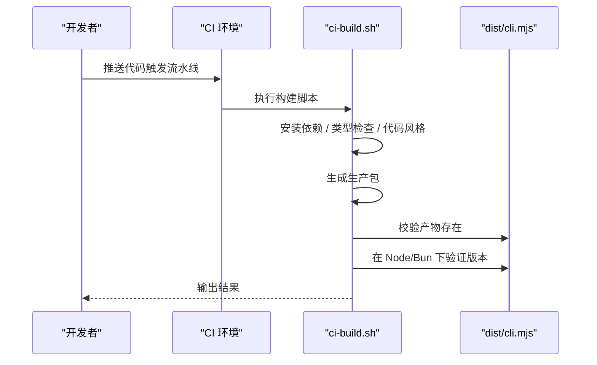
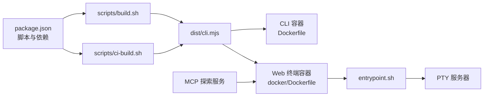

# 部署运维

<cite>
**本文引用的文件**
- [README.md](file://README.md)
- [Dockerfile](file://Dockerfile)
- [docker/Dockerfile](file://docker/Dockerfile)
- [docker/docker-compose.yml](file://docker/docker-compose.yml)
- [docker/entrypoint.sh](file://docker/entrypoint.sh)
- [package.json](file://package.json)
- [scripts/build.sh](file://scripts/build.sh)
- [scripts/ci-build.sh](file://scripts/ci-build.sh)
- [server.json](file://server.json)
- [src/utils/managedEnv.ts](file://src/utils/managedEnv.ts)
- [src/services/mcp/envExpansion.ts](file://src/services/mcp/envExpansion.ts)
- [src/utils/telemetry/instrumentation.ts](file://src/utils/telemetry/instrumentation.ts)
- [src/entrypoints/init.ts](file://src/entrypoints/init.ts)
- [src/services/analytics/index.ts](file://src/services/analytics/index.ts)
- [src/services/mcp/auth.ts](file://src/services/mcp/auth.ts)
- [src/components/mcp/MCPAgentServerMenu.tsx](file://src/components/mcp/MCPAgentServerMenu.tsx)
- [src/utils/fileHistory.ts](file://src/utils/fileHistory.ts)
- [src/utils/config.ts](file://src/utils/config.ts)
</cite>

## 目录
1. [简介](#简介)
2. [项目结构](#项目结构)
3. [核心组件](#核心组件)
4. [架构总览](#架构总览)
5. [详细组件分析](#详细组件分析)
6. [依赖关系分析](#依赖关系分析)
7. [性能考量](#性能考量)
8. [故障排除指南](#故障排除指南)
9. [结论](#结论)
10. [附录](#附录)

## 简介
本文件面向运维与平台工程团队，提供 Claude Code 的部署与运维指南。内容覆盖本地安装、Docker 容器化与源码构建三种方式；生产环境配置（系统资源、网络与安全）；监控与日志管理（性能指标、错误追踪与日志聚合）；故障排除（常见问题诊断、错误代码解释与解决方案）；备份与恢复策略；以及自动化运维工具（CI/CD 流水线与容器编排）的最佳实践与安全建议。

## 项目结构
仓库包含 CLI、Web 终端、MCP 探索服务器、Docker 化产物与脚本等模块。CLI 通过 Bun 运行，支持终端 UI 与命令行模式；Web 终端提供基于 PTY 的浏览器交互；MCP 服务器用于在兼容客户端中探索源码；Dockerfile 提供多阶段构建与运行时镜像；脚本提供本地与 CI 构建流程。

图表来源
- [README.md:193-236](file://README.md#L193-L236)
- [Dockerfile:1-46](file://Dockerfile#L1-L46)
- [docker/Dockerfile:1-84](file://docker/Dockerfile#L1-L84)
- [docker/docker-compose.yml:1-29](file://docker/docker-compose.yml#L1-L29)
- [scripts/build.sh:1-59](file://scripts/build.sh#L1-L59)
- [scripts/ci-build.sh:1-50](file://scripts/ci-build.sh#L1-L50)
- [package.json:12-24](file://package.json#L12-L24)

章节来源
- [README.md:193-236](file://README.md#L193-L236)
- [package.json:12-24](file://package.json#L12-L24)

## 核心组件
- CLI 与终端 UI：基于 React + Ink 的终端界面，命令解析由 Commander.js 驱动，启动时进行并行预取与延迟加载以优化性能。
- Web 终端：提供浏览器内 PTY 会话，支持多会话并发与健康检查。
- MCP 探索服务器：可被 MCP 客户端（如 Claude Code、VS Code Copilot、Cursor）调用，提供源码浏览与搜索能力。
- Docker 化：提供 CLI 与 Web 终端的多阶段构建镜像，包含运行时依赖与非 root 用户执行。
- 构建与 CI：提供本地与 CI 的统一构建脚本，验证产物完整性与运行版本信息。

章节来源
- [README.md:240-338](file://README.md#L240-L338)
- [Dockerfile:12-44](file://Dockerfile#L12-L44)
- [docker/Dockerfile:34-84](file://docker/Dockerfile#L34-L84)
- [scripts/ci-build.sh:22-47](file://scripts/ci-build.sh#L22-L47)

## 架构总览
下图展示 CLI、Web 终端与 MCP 服务器之间的关系，以及容器化与编排的关键路径。

图表来源
- [docker/Dockerfile:54-61](file://docker/Dockerfile#L54-L61)
- [docker/docker-compose.yml:1-29](file://docker/docker-compose.yml#L1-L29)
- [Dockerfile:37-43](file://Dockerfile#L37-L43)

## 详细组件分析

### CLI 部署与运行
- 直接安装与运行：通过包管理器安装后，使用二进制入口运行 CLI 命令。
- 源码构建：使用构建脚本生成生产包，产物位于 dist/cli.mjs。
- 环境变量：需要设置 API 密钥等敏感参数，建议通过环境注入或密钥管理服务。

图表来源
- [scripts/build.sh:14-24](file://scripts/build.sh#L14-L24)
- [scripts/ci-build.sh:22-47](file://scripts/ci-build.sh#L22-L47)
- [Dockerfile:26-27](file://Dockerfile#L26-L27)

章节来源
- [scripts/build.sh:14-24](file://scripts/build.sh#L14-L24)
- [scripts/ci-build.sh:22-47](file://scripts/ci-build.sh#L22-L47)
- [Dockerfile:26-27](file://Dockerfile#L26-L27)

### Docker 容器化部署
- CLI 容器：多阶段构建，仅复制生产包到最小运行时镜像，安装必要系统依赖。
- Web 终端容器：多阶段构建，编译原生模块，复制 node_modules、CLI 产物与服务器源码，以非 root 用户运行，暴露端口并配置健康检查。
- Compose 编排：映射端口、挂载持久化卷、注入环境变量、配置健康检查与重启策略。

图表来源
- [docker/Dockerfile:12-33](file://docker/Dockerfile#L12-L33)
- [docker/Dockerfile:34-84](file://docker/Dockerfile#L34-L84)
- [docker/docker-compose.yml:1-29](file://docker/docker-compose.yml#L1-L29)
- [docker/entrypoint.sh:4-28](file://docker/entrypoint.sh#L4-L28)

章节来源
- [docker/Dockerfile:12-33](file://docker/Dockerfile#L12-L33)
- [docker/Dockerfile:34-84](file://docker/Dockerfile#L34-L84)
- [docker/docker-compose.yml:1-29](file://docker/docker-compose.yml#L1-L29)
- [docker/entrypoint.sh:4-28](file://docker/entrypoint.sh#L4-L28)

### MCP 探索服务器
- 用途：在 MCP 客户端中浏览与搜索源码，提供工具与命令的源码读取能力。
- 配置：可通过 JSON 描述文件声明服务器元数据与包信息。
- 认证：支持 OAuth 流程，带超时控制与取消处理。

图表来源
- [src/components/mcp/MCPAgentServerMenu.tsx:56-81](file://src/components/mcp/MCPAgentServerMenu.tsx#L56-L81)
- [src/services/mcp/auth.ts:1185-1226](file://src/services/mcp/auth.ts#L1185-L1226)
- [server.json:1-25](file://server.json#L1-L25)

章节来源
- [src/components/mcp/MCPAgentServerMenu.tsx:56-81](file://src/components/mcp/MCPAgentServerMenu.tsx#L56-L81)
- [src/services/mcp/auth.ts:1185-1226](file://src/services/mcp/auth.ts#L1185-L1226)
- [server.json:1-25](file://server.json#L1-L25)

### 监控与日志管理
- 指标与遥测：按需延迟加载 OpenTelemetry，支持 OTLP 日志导出器与周期性指标导出器，支持多种导出类型与协议配置。
- 分析事件：提供同步与异步事件记录接口，支持动态采样与队列机制。
- 启动初始化：在入口处进行遥测初始化，避免重复初始化并保证属性一致性。

图表来源
- [src/entrypoints/init.ts:288-340](file://src/entrypoints/init.ts#L288-L340)
- [src/utils/telemetry/instrumentation.ts:206-234](file://src/utils/telemetry/instrumentation.ts#L206-L234)
- [src/services/analytics/index.ts:125-173](file://src/services/analytics/index.ts#L125-L173)

章节来源
- [src/entrypoints/init.ts:288-340](file://src/entrypoints/init.ts#L288-L340)
- [src/utils/telemetry/instrumentation.ts:206-234](file://src/utils/telemetry/instrumentation.ts#L206-L234)
- [src/services/analytics/index.ts:125-173](file://src/services/analytics/index.ts#L125-L173)

### 备份与恢复策略
- 配置备份：在写入全局配置前，按最小间隔生成带时间戳的备份文件，避免频繁写入导致磁盘占用。
- 文件历史迁移：在会话恢复时对备份文件进行硬链接或回退复制，确保数据一致性与可用性。
- 环境变量安全应用：区分可信与项目级来源的安全变量，仅在建立信任后应用潜在危险变量，降低风险面。

图表来源
- [src/utils/config.ts:1249-1281](file://src/utils/config.ts#L1249-L1281)
- [src/utils/fileHistory.ts:970-1010](file://src/utils/fileHistory.ts#L970-L1010)
- [src/utils/managedEnv.ts:124-178](file://src/utils/managedEnv.ts#L124-L178)

章节来源
- [src/utils/config.ts:1249-1281](file://src/utils/config.ts#L1249-L1281)
- [src/utils/fileHistory.ts:970-1010](file://src/utils/fileHistory.ts#L970-L1010)
- [src/utils/managedEnv.ts:124-178](file://src/utils/managedEnv.ts#L124-L178)

### 自动化运维与 CI/CD
- 本地开发：提供一键安装、类型检查与格式化校验脚本，便于本地快速验证。
- CI 流水线：统一安装、类型检查、代码风格检查、生产打包与产物验证步骤，确保质量门禁。
- 构建产物：校验 dist/cli.mjs 是否存在，并分别在 Node 与 Bun 下验证版本输出。

图表来源
- [scripts/build.sh:14-34](file://scripts/build.sh#L14-L34)
- [scripts/ci-build.sh:13-47](file://scripts/ci-build.sh#L13-L47)

章节来源
- [scripts/build.sh:14-34](file://scripts/build.sh#L14-L34)
- [scripts/ci-build.sh:13-47](file://scripts/ci-build.sh#L13-L47)

## 依赖关系分析
- CLI 与 Web 终端共享底层运行时（Bun），Web 终端通过入口脚本启动 PTY 服务器，容器镜像中包含 node-pty 原生模块与 TS 配置以便运行。
- MCP 服务器作为外部服务，通过 HTTP/SSE 与 Web 终端交互，认证流程由前端菜单组件协调。
- 构建脚本与包管理脚本统一了开发与 CI 的构建体验，Dockerfile 将构建产物与运行时分离，提升安全性与可维护性。

图表来源
- [package.json:12-24](file://package.json#L12-L24)
- [scripts/build.sh:14-34](file://scripts/build.sh#L14-L34)
- [scripts/ci-build.sh:13-47](file://scripts/ci-build.sh#L13-L47)
- [Dockerfile:37-43](file://Dockerfile#L37-L43)
- [docker/Dockerfile:47-61](file://docker/Dockerfile#L47-L61)
- [docker/entrypoint.sh:18-28](file://docker/entrypoint.sh#L18-L28)

章节来源
- [package.json:12-24](file://package.json#L12-L24)
- [Dockerfile:37-43](file://Dockerfile#L37-L43)
- [docker/Dockerfile:47-61](file://docker/Dockerfile#L47-L61)
- [docker/entrypoint.sh:18-28](file://docker/entrypoint.sh#L18-L28)

## 性能考量
- 启动优化：入口并行预取与延迟加载，减少冷启动时间。
- 指标导出：按需加载遥测库，避免不必要的内存占用。
- 构建优化：多阶段构建仅复制必要产物，减小镜像体积与攻击面。
- 并发会话：Web 终端支持多会话并发，合理设置最大会话数以平衡资源与用户体验。

## 故障排除指南
- 环境变量缺失
  - 症状：容器启动时报错提示缺少关键环境变量。
  - 排查：确认 ANTHROPIC_API_KEY、AUTH_TOKEN、ALLOWED_ORIGINS、MAX_SESSIONS 等是否正确注入。
  - 解决：通过 docker run 或 docker-compose 的环境变量配置补齐。
  - 参考
    - [docker/entrypoint.sh:5-13](file://docker/entrypoint.sh#L5-L13)
    - [docker/docker-compose.yml:8-12](file://docker/docker-compose.yml#L8-L12)
- 构建失败或产物缺失
  - 症状：CI 报告 dist/cli.mjs 不存在或无法运行。
  - 排查：检查安装依赖、类型检查、代码风格与构建步骤是否全部通过。
  - 解决：修复类型与风格问题，重新执行构建脚本。
  - 参考
    - [scripts/ci-build.sh:28-47](file://scripts/ci-build.sh#L28-L47)
    - [scripts/build.sh:14-34](file://scripts/build.sh#L14-L34)
- Web 终端不可用
  - 症状：访问 /health 失败或端口不通。
  - 排查：确认端口映射、健康检查配置与容器状态。
  - 解决：调整端口映射与健康检查参数，确保容器健康。
  - 参考
    - [docker/docker-compose.yml:6-25](file://docker/docker-compose.yml#L6-L25)
    - [docker/Dockerfile:80-81](file://docker/Dockerfile#L80-L81)
- MCP 认证超时或中断
  - 症状：OAuth 授权超时或用户取消。
  - 排查：确认浏览器打开授权页、超时时间与取消信号处理。
  - 解决：延长超时时间或在 UI 中正确处理取消操作。
  - 参考
    - [src/services/mcp/auth.ts:1204-1214](file://src/services/mcp/auth.ts#L1204-L1214)
    - [src/components/mcp/MCPAgentServerMenu.tsx:43-55](file://src/components/mcp/MCPAgentServerMenu.tsx#L43-L55)
- 配置写入异常
  - 症状：配置备份失败或恢复时文件不存在。
  - 排查：检查备份目录权限、硬链接与复制回退逻辑。
  - 解决：确保备份目录存在且具备写权限，必要时清理旧备份。
  - 参考
    - [src/utils/config.ts:1249-1281](file://src/utils/config.ts#L1249-L1281)
    - [src/utils/fileHistory.ts:970-1010](file://src/utils/fileHistory.ts#L970-L1010)

章节来源
- [docker/entrypoint.sh:5-13](file://docker/entrypoint.sh#L5-L13)
- [docker/docker-compose.yml:6-25](file://docker/docker-compose.yml#L6-L25)
- [scripts/ci-build.sh:28-47](file://scripts/ci-build.sh#L28-L47)
- [src/services/mcp/auth.ts:1204-1214](file://src/services/mcp/auth.ts#L1204-L1214)
- [src/components/mcp/MCPAgentServerMenu.tsx:43-55](file://src/components/mcp/MCPAgentServerMenu.tsx#L43-L55)
- [src/utils/config.ts:1249-1281](file://src/utils/config.ts#L1249-L1281)
- [src/utils/fileHistory.ts:970-1010](file://src/utils/fileHistory.ts#L970-L1010)

## 结论
通过本地安装、Docker 容器化与源码构建三种方式，Claude Code 可灵活适配不同部署场景。生产环境应重点关注资源规划、网络与安全配置、可观测性与备份恢复策略。结合 CI/CD 流水线与容器编排，可实现高效、稳定与可追溯的运维体系。

## 附录
- 环境变量与安全
  - 关键变量：ANTHROPIC_API_KEY、AUTH_TOKEN、ALLOWED_ORIGINS、MAX_SESSIONS。
  - 安全建议：仅在受信来源注入环境变量，遵循最小权限原则；对潜在危险变量（如代理、证书）在建立信任后再应用。
  - 参考
    - [docker/entrypoint.sh:5-13](file://docker/entrypoint.sh#L5-L13)
    - [src/utils/managedEnv.ts:124-178](file://src/utils/managedEnv.ts#L124-L178)
- MCP 配置与扩展
  - 服务器描述：通过 server.json 声明服务器元数据与包信息。
  - 环境变量展开：支持 ${VAR} 与 ${VAR:-default} 语法，便于配置复用。
  - 参考
    - [server.json:1-25](file://server.json#L1-L25)
    - [src/services/mcp/envExpansion.ts:10-38](file://src/services/mcp/envExpansion.ts#L10-L38)