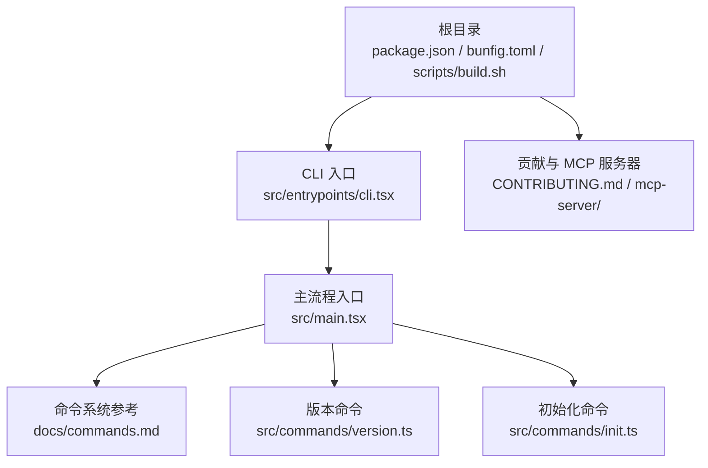
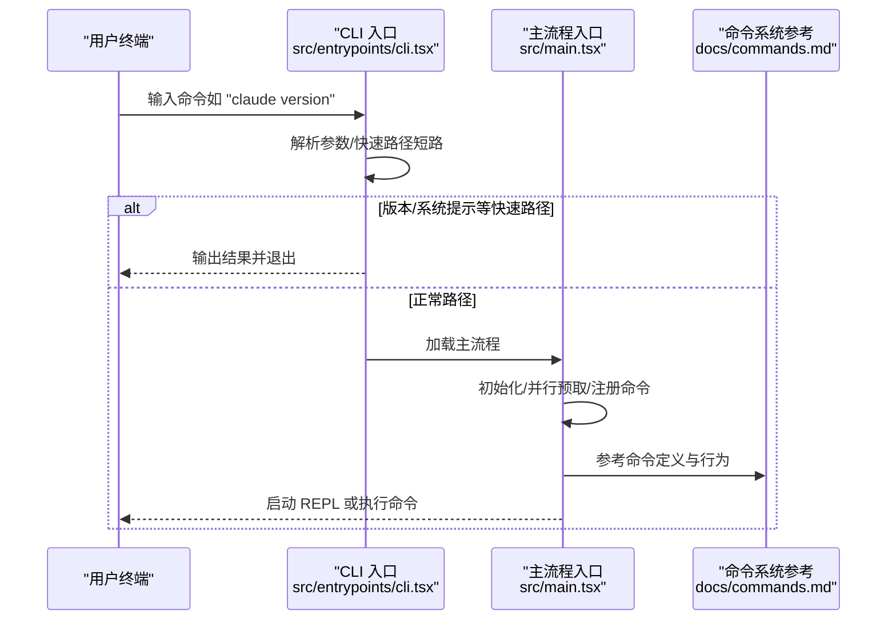
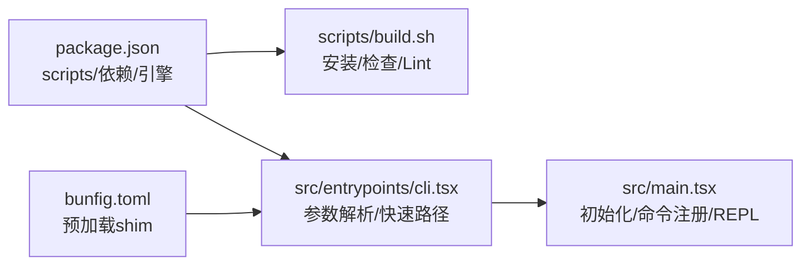

# 快速开始

<cite>
**本文引用的文件**
- [README.md](file://README.md)
- [package.json](file://package.json)
- [bunfig.toml](file://bunfig.toml)
- [scripts/build.sh](file://scripts/build.sh)
- [src/entrypoints/cli.tsx](file://src/entrypoints/cli.tsx)
- [src/main.tsx](file://src/main.tsx)
- [docs/commands.md](file://docs/commands.md)
- [src/commands/version.ts](file://src/commands/version.ts)
- [src/commands/init.ts](file://src/commands/init.ts)
- [CONTRIBUTING.md](file://CONTRIBUTING.md)
</cite>

## 目录
1. [简介](#简介)
2. [项目结构](#项目结构)
3. [核心组件](#核心组件)
4. [架构总览](#架构总览)
5. [详细组件分析](#详细组件分析)
6. [依赖分析](#依赖分析)
7. [性能考虑](#性能考虑)
8. [故障排除指南](#故障排除指南)
9. [结论](#结论)
10. [附录](#附录)

## 简介
本指南面向首次接触 Claude Code 的用户，帮助你在本地快速完成环境准备、安装与配置、构建与运行，并掌握基本使用方法（启动 CLI、执行第一个命令、文件操作示例、权限设置）。同时提供常见问题排查建议与安全注意事项，确保你能在正确的环境下安全地使用该项目。

## 项目结构
该仓库包含 CLI 源码、文档、MCP 探索服务器、脚本与构建工具等模块。对快速开始而言，以下目录与文件最为关键：
- 根级包管理与构建脚本：package.json、bunfig.toml、scripts/build.sh
- CLI 入口与主流程：src/entrypoints/cli.tsx、src/main.tsx
- 命令参考与常用命令：docs/commands.md、src/commands/version.ts、src/commands/init.ts
- 贡献与 MCP 服务器：CONTRIBUTING.md、mcp-server/

图表来源
- [package.json:1-95](file://package.json#L1-L95)
- [bunfig.toml:1-5](file://bunfig.toml#L1-L5)
- [scripts/build.sh:1-59](file://scripts/build.sh#L1-L59)
- [src/entrypoints/cli.tsx:1-304](file://src/entrypoints/cli.tsx#L1-L304)
- [src/main.tsx:1-800](file://src/main.tsx#L1-L800)
- [docs/commands.md:1-212](file://docs/commands.md#L1-L212)
- [src/commands/version.ts:1-25](file://src/commands/version.ts#L1-L25)
- [src/commands/init.ts:1-259](file://src/commands/init.ts#L1-L259)

章节来源
- [README.md:193-236](file://README.md#L193-L236)
- [package.json:1-95](file://package.json#L1-L95)
- [bunfig.toml:1-5](file://bunfig.toml#L1-L5)
- [scripts/build.sh:1-59](file://scripts/build.sh#L1-L59)
- [src/entrypoints/cli.tsx:1-304](file://src/entrypoints/cli.tsx#L1-L304)
- [src/main.tsx:1-800](file://src/main.tsx#L1-L800)
- [docs/commands.md:1-212](file://docs/commands.md#L1-L212)
- [src/commands/version.ts:1-25](file://src/commands/version.ts#L1-L25)
- [src/commands/init.ts:1-259](file://src/commands/init.ts#L1-L259)

## 核心组件
- CLI 入口与启动路径
  - CLI 入口文件负责解析参数、快速路径短路（如版本查询、系统提示导出）、桥接模式、守护进程、后台会话管理、模板任务、环境运行器、自托管运行器、工作树与 tmux 集成等，并在无特殊标志时加载主流程。
  - 主流程入口负责并行预取、初始化、命令注册、REPL 启动、遥测与迁移等。
- 命令系统
  - 文档提供了命令分类与用法参考；内置命令包括版本查询、初始化项目、权限与主题设置、MCP 与插件管理、任务与代理、诊断与状态等。
- 构建与运行
  - 使用 Bun 作为运行时与包管理器，支持开发模式下的预加载 shim 与脚本化构建流程。

章节来源
- [src/entrypoints/cli.tsx:33-299](file://src/entrypoints/cli.tsx#L33-L299)
- [src/main.tsx:585-800](file://src/main.tsx#L585-L800)
- [docs/commands.md:1-212](file://docs/commands.md#L1-L212)

## 架构总览
下图展示了从命令行到主流程的关键调用链，以及与命令系统的交互关系。

图表来源
- [src/entrypoints/cli.tsx:33-299](file://src/entrypoints/cli.tsx#L33-L299)
- [src/main.tsx:585-800](file://src/main.tsx#L585-L800)
- [docs/commands.md:1-212](file://docs/commands.md#L1-L212)

## 详细组件分析

### 安装与环境准备
- 运行时与包管理
  - 项目以 Bun 作为运行时与包管理器，要求 Bun 版本满足 engines 字段。
  - 开发模式通过 bunfig.toml 预加载插件 shim，便于特性门控与打包。
- 依赖安装
  - 推荐使用 Bun 安装依赖；若系统未安装 Bun，脚本提供自动检测与降级到 npm 的逻辑。
- 构建与检查
  - 提供一键安装、类型检查与 Lint 的脚本，便于快速验证环境。

章节来源
- [package.json:90-94](file://package.json#L90-L94)
- [bunfig.toml:1-5](file://bunfig.toml#L1-L5)
- [scripts/build.sh:14-34](file://scripts/build.sh#L14-L34)

### 项目克隆与基础配置
- 克隆仓库后，进入项目根目录，确认 package.json 中的 bin 指向 CLI 入口文件。
- 若需要 MCP 探索服务器，可按 README 中的步骤安装或直接从源码构建。

章节来源
- [README.md:83-122](file://README.md#L83-L122)
- [package.json:8-11](file://package.json#L8-L11)

### 构建与运行
- 构建方式
  - 使用 Bun 执行 scripts/build-bundle.ts 进行打包；也可使用 scripts/build-web.ts 构建 Web 版本。
  - 开发模式支持 watch 与 minify 参数。
- 运行方式
  - CLI 通过二进制入口直接运行；主流程入口负责初始化与命令处理。
  - 常见运行场景包括：版本查询、系统提示导出、桥接模式、守护进程、后台会话管理、模板任务、环境运行器、自托管运行器、工作树与 tmux 集成等。

章节来源
- [package.json:12-24](file://package.json#L12-L24)
- [src/entrypoints/cli.tsx:100-162](file://src/entrypoints/cli.tsx#L100-L162)
- [src/entrypoints/cli.tsx:164-180](file://src/entrypoints/cli.tsx#L164-L180)
- [src/entrypoints/cli.tsx:182-209](file://src/entrypoints/cli.tsx#L182-L209)
- [src/entrypoints/cli.tsx:211-245](file://src/entrypoints/cli.tsx#L211-L245)
- [src/entrypoints/cli.tsx:247-274](file://src/entrypoints/cli.tsx#L247-L274)

### 基本使用方法
- 启动 CLI
  - 在终端输入二进制名称（由 package.json 的 bin 指定）即可启动 CLI。
- 执行第一个命令
  - 查看版本：使用内置版本命令查看当前运行版本。
  - 初始化项目：使用初始化命令生成 CLAUDE.md 与技能/钩子（可选），帮助 Claude 更好理解你的项目。
- 文件操作示例
  - 通过命令系统中的文件相关命令进行读取、编辑、搜索等操作（详见命令参考）。
- 权限设置
  - 使用权限命令管理工具调用权限策略，支持多种权限模式与自动决策。

章节来源
- [src/commands/version.ts:1-25](file://src/commands/version.ts#L1-L25)
- [src/commands/init.ts:226-254](file://src/commands/init.ts#L226-L254)
- [docs/commands.md:1-212](file://docs/commands.md#L1-L212)

### 常见问题与故障排除
- 无法找到 Bun 或 npm
  - 脚本会检测 Bun 与 npm 并给出错误提示；请先安装 Bun 或 npm。
- 权限不足或策略限制
  - 某些功能可能受组织策略限制（例如远程控制），需检查策略限制后再尝试。
- 环境变量与信任
  - 在交互式模式下，系统会在建立信任后再进行某些预取；非交互模式下可跳过信任检查。
- 调试与诊断
  - 使用诊断命令查看系统与会话状态，必要时输出日志以便定位问题。

章节来源
- [scripts/build.sh:16-23](file://scripts/build.sh#L16-L23)
- [src/main.tsx:360-380](file://src/main.tsx#L360-L380)
- [docs/commands.md:121-133](file://docs/commands.md#L121-L133)

## 依赖分析
- 运行时与包管理
  - Bun 作为运行时与包管理器，引擎版本要求见 engines 字段。
  - 开发模式通过 bunfig.toml 预加载插件 shim。
- 构建与脚本
  - scripts/build.sh 提供安装、类型检查与 Lint 的组合流程。
  - package.json 中定义了构建与开发脚本，分别用于打包与 Web 构建。
- CLI 入口与主流程
  - CLI 入口文件负责参数解析与快速路径短路；主流程入口负责初始化、并行预取、命令注册与 REPL 启动。

图表来源
- [package.json:12-24](file://package.json#L12-L24)
- [package.json:90-94](file://package.json#L90-L94)
- [scripts/build.sh:1-59](file://scripts/build.sh#L1-L59)
- [src/entrypoints/cli.tsx:1-304](file://src/entrypoints/cli.tsx#L1-L304)
- [src/main.tsx:1-800](file://src/main.tsx#L1-L800)
- [bunfig.toml:1-5](file://bunfig.toml#L1-L5)

章节来源
- [package.json:12-24](file://package.json#L12-L24)
- [package.json:90-94](file://package.json#L90-L94)
- [scripts/build.sh:1-59](file://scripts/build.sh#L1-L59)
- [src/entrypoints/cli.tsx:1-304](file://src/entrypoints/cli.tsx#L1-L304)
- [src/main.tsx:1-800](file://src/main.tsx#L1-L800)
- [bunfig.toml:1-5](file://bunfig.toml#L1-L5)

## 性能考虑
- 并行预取与懒加载
  - CLI 入口与主流程均采用并行预取与懒加载策略，减少冷启动时间。
- 特性门控与死代码消除
  - 通过特性门控在构建阶段剔除不使用的代码，降低体积与启动开销。
- 启动性能测量
  - 通过启动性能探针记录关键节点耗时，便于优化与对比。

章节来源
- [src/entrypoints/cli.tsx:44-48](file://src/entrypoints/cli.tsx#L44-L48)
- [src/main.tsx:10-21](file://src/main.tsx#L10-L21)

## 故障排除指南
- 依赖安装失败
  - 确认系统已安装 Bun 或 npm；若使用 npm，请确保网络与缓存正常。
- 权限被拒绝或策略限制
  - 检查组织策略限制，必要时联系管理员调整权限。
- 交互式模式下预取未生效
  - 确认已建立信任；非交互模式下可跳过信任检查。
- 调试与诊断
  - 使用诊断命令查看系统与会话状态，结合日志定位问题。

章节来源
- [scripts/build.sh:16-23](file://scripts/build.sh#L16-L23)
- [src/main.tsx:360-380](file://src/main.tsx#L360-L380)
- [docs/commands.md:121-133](file://docs/commands.md#L121-L133)

## 结论
通过本快速开始指南，你已经完成了环境准备、安装与配置、构建与运行，并掌握了基本使用方法与常见问题的排查思路。建议在正式使用前，先阅读命令参考与架构文档，以便更深入地理解系统能力与扩展点。

## 附录
- 常用命令参考
  - 版本：查看当前运行版本
  - 初始化：生成 CLAUDE.md 与技能/钩子（可选）
  - 权限：管理工具调用权限
  - 诊断：查看系统与会话状态
- MCP 服务器
  - 可按 README 中的步骤安装或从源码构建 MCP 服务器，以便在其他客户端中探索源码。

章节来源
- [docs/commands.md:1-212](file://docs/commands.md#L1-L212)
- [README.md:83-122](file://README.md#L83-L122)
- [src/commands/version.ts:1-25](file://src/commands/version.ts#L1-L25)
- [src/commands/init.ts:226-254](file://src/commands/init.ts#L226-L254)