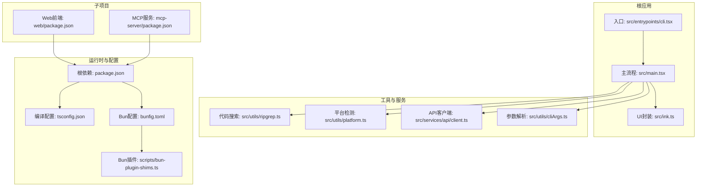
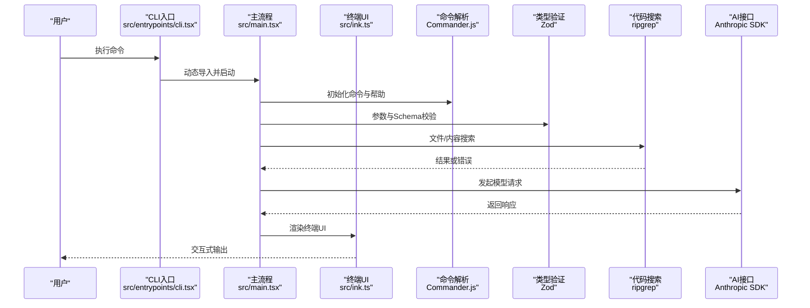
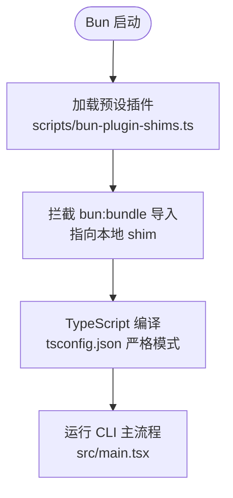
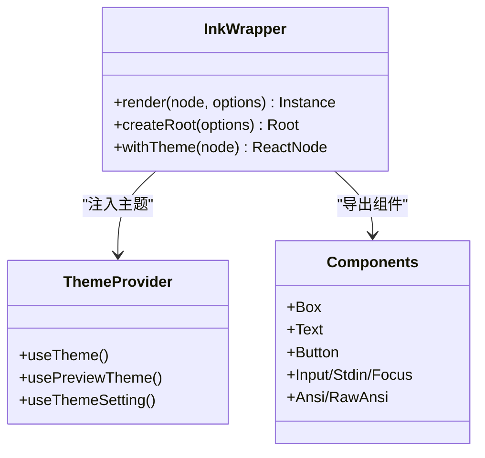
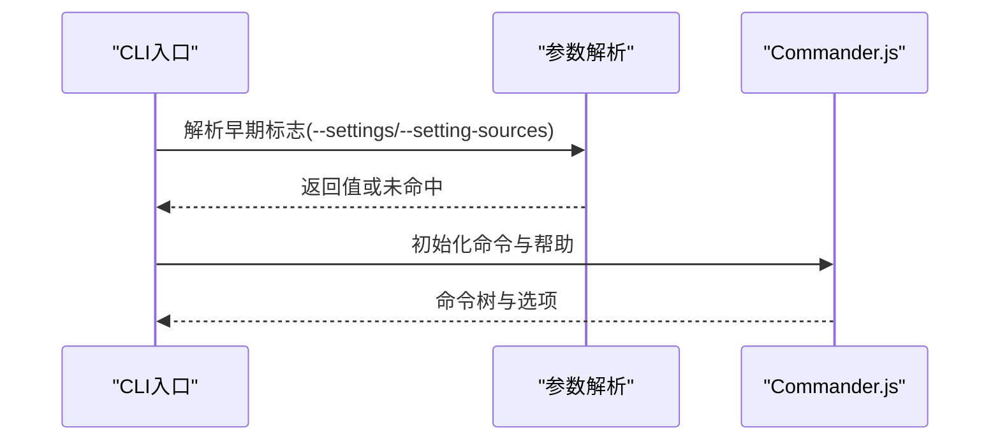
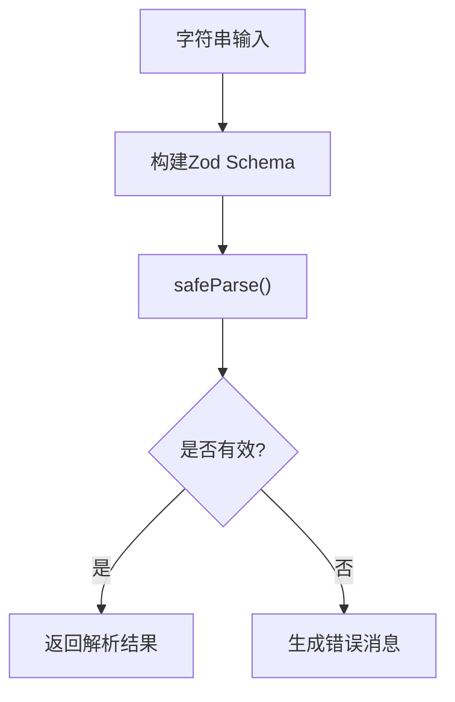
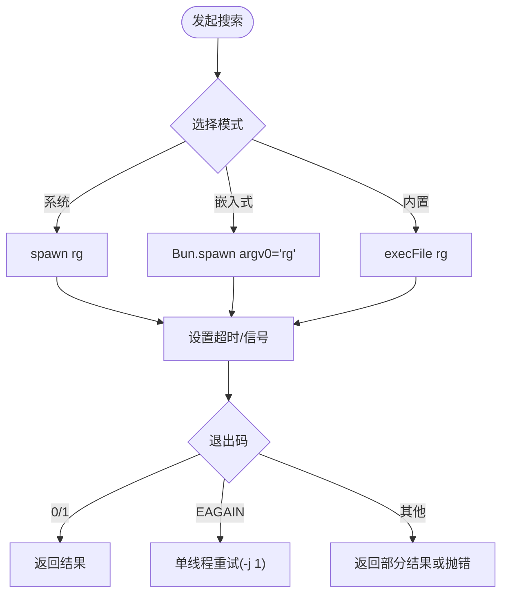
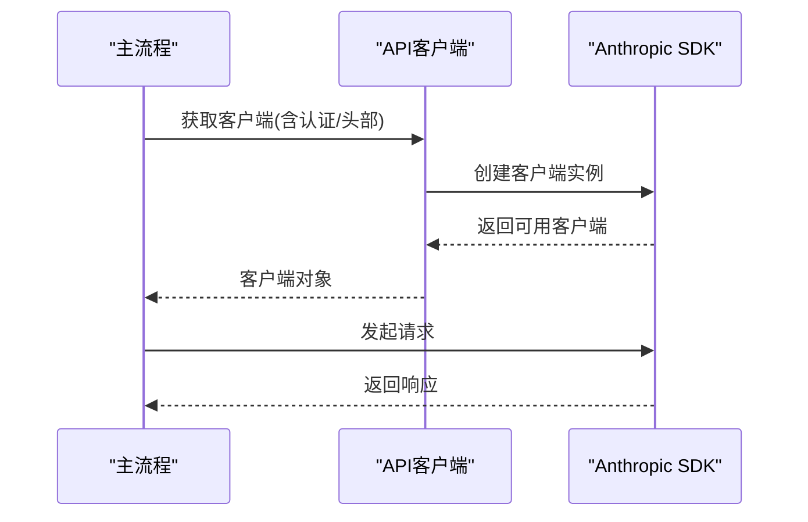
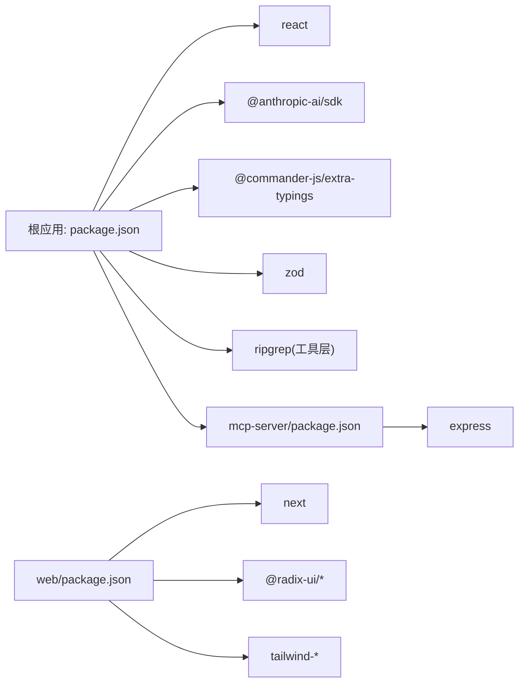

# 技术栈

<cite>
**本文引用的文件**
- [package.json](file://package.json)
- [tsconfig.json](file://tsconfig.json)
- [bunfig.toml](file://bunfig.toml)
- [src/main.tsx](file://src/main.tsx)
- [src/entrypoints/cli.tsx](file://src/entrypoints/cli.tsx)
- [src/ink.ts](file://src/ink.ts)
- [scripts/bun-plugin-shims.ts](file://scripts/bun-plugin-shims.ts)
- [src/utils/ripgrep.ts](file://src/utils/ripgrep.ts)
- [src/utils/platform.ts](file://src/utils/platform.ts)
- [src/utils/cliArgs.ts](file://src/utils/cliArgs.ts)
- [src/services/api/client.ts](file://src/services/api/client.ts)
- [web/package.json](file://web/package.json)
- [mcp-server/package.json](file://mcp-server/package.json)
</cite>

## 目录
1. [简介](#简介)
2. [项目结构](#项目结构)
3. [核心组件](#核心组件)
4. [架构总览](#架构总览)
5. [详细组件分析](#详细组件分析)
6. [依赖分析](#依赖分析)
7. [性能考量](#性能考量)
8. [故障排查指南](#故障排查指南)
9. [结论](#结论)
10. [附录](#附录)

## 简介
本技术栈文档面向 Claude Code 项目，系统阐述其核心技术选型与实现方式，重点覆盖以下方面：
- 开发语言与编译配置：TypeScript（严格模式）与 Bun 运行时
- 终端 UI 框架：React + Ink
- 命令行解析：Commander.js
- 类型验证：Zod
- 代码搜索：ripgrep（系统/内置/嵌入式）
- AI 接口调用：Anthropic SDK
- 版本兼容性与依赖关系
- 最佳实践与背景知识

该文档旨在帮助开发者快速理解项目技术栈、掌握使用方法，并在扩展与维护中遵循一致的设计原则。

## 项目结构
从仓库结构可见，项目采用多模块组织：
- 核心 CLI 应用位于根目录，入口为 src/entrypoints/cli.tsx，主流程在 src/main.tsx
- 终端 UI 封装在 src/ink.ts，基于 React + Ink 实现
- 工具与服务分布在 src/utils、src/services 等目录
- web 子项目位于 web/，mcp-server 子项目位于 mcp-server/

图表来源
- [src/entrypoints/cli.tsx:1-304](file://src/entrypoints/cli.tsx#L1-L304)
- [src/main.tsx:1-120](file://src/main.tsx#L1-L120)
- [src/ink.ts:1-87](file://src/ink.ts#L1-L87)
- [src/utils/ripgrep.ts:1-120](file://src/utils/ripgrep.ts#L1-L120)
- [src/services/api/client.ts:88-120](file://src/services/api/client.ts#L88-L120)
- [web/package.json:1-53](file://web/package.json#L1-L53)
- [mcp-server/package.json:1-34](file://mcp-server/package.json#L1-L34)
- [package.json:1-95](file://package.json#L1-L95)
- [tsconfig.json:1-28](file://tsconfig.json#L1-L28)
- [bunfig.toml:1-5](file://bunfig.toml#L1-L5)
- [scripts/bun-plugin-shims.ts:1-19](file://scripts/bun-plugin-shims.ts#L1-L19)

章节来源
- [package.json:1-95](file://package.json#L1-L95)
- [tsconfig.json:1-28](file://tsconfig.json#L1-L28)
- [bunfig.toml:1-5](file://bunfig.toml#L1-L5)
- [src/entrypoints/cli.tsx:1-304](file://src/entrypoints/cli.tsx#L1-L304)
- [src/main.tsx:1-120](file://src/main.tsx#L1-L120)
- [src/ink.ts:1-87](file://src/ink.ts#L1-L87)
- [web/package.json:1-53](file://web/package.json#L1-L53)
- [mcp-server/package.json:1-34](file://mcp-server/package.json#L1-L34)

## 核心组件
- TypeScript（严格模式）：通过 tsconfig.json 启用严格模式、隔离模块、禁用 emit，确保类型安全与构建稳定性
- Bun 运行时：引擎要求 >= 1.1.0，配合 bunfig.toml 预加载插件以支持本地开发中的 bun:bundle 导入
- React + Ink：终端 UI 渲染，统一主题包装与组件导出，便于在终端内构建交互式界面
- Commander.js：命令行解析，支持排序帮助、位置参数与选项比较
- Zod：类型验证与输入校验，广泛用于参数、Schema 校验与错误提示
- ripgrep：高性能代码搜索，支持系统、内置与嵌入式三种模式，具备超时、单线程重试、缓冲区溢出处理等鲁棒性机制
- Anthropic SDK：统一的 API 客户端封装，支持多认证方式、自定义头部、日志与遥测

章节来源
- [tsconfig.json:1-28](file://tsconfig.json#L1-L28)
- [bunfig.toml:1-5](file://bunfig.toml#L1-L5)
- [src/ink.ts:1-87](file://src/ink.ts#L1-L87)
- [src/utils/cliArgs.ts:1-60](file://src/utils/cliArgs.ts#L1-L60)
- [src/utils/ripgrep.ts:1-120](file://src/utils/ripgrep.ts#L1-L120)
- [src/services/api/client.ts:88-120](file://src/services/api/client.ts#L88-L120)

## 架构总览
下图展示从 CLI 入口到核心功能模块的调用链与数据流：

图表来源
- [src/entrypoints/cli.tsx:1-304](file://src/entrypoints/cli.tsx#L1-L304)
- [src/main.tsx:887-903](file://src/main.tsx#L887-L903)
- [src/ink.ts:1-87](file://src/ink.ts#L1-L87)
- [src/utils/ripgrep.ts:345-463](file://src/utils/ripgrep.ts#L345-L463)
- [src/services/api/client.ts:300-316](file://src/services/api/client.ts#L300-L316)

## 详细组件分析

### TypeScript（严格模式）与 Bun 运行时
- 严格模式：启用 strict、isolatedModules、noEmit 等，确保类型安全与模块化
- Bun 配置：bunfig.toml 预加载 scripts/bun-plugin-shims.ts，拦截 bun:bundle 导入，使 CLI 在无生产打包阶段即可运行
- 编译目标：ESNext + React JSX，路径映射与类型声明由 tsconfig.json 管理

图表来源
- [bunfig.toml:1-5](file://bunfig.toml#L1-L5)
- [scripts/bun-plugin-shims.ts:1-19](file://scripts/bun-plugin-shims.ts#L1-L19)
- [tsconfig.json:1-28](file://tsconfig.json#L1-L28)
- [src/main.tsx:1-120](file://src/main.tsx#L1-L120)

章节来源
- [tsconfig.json:1-28](file://tsconfig.json#L1-L28)
- [bunfig.toml:1-5](file://bunfig.toml#L1-L5)
- [scripts/bun-plugin-shims.ts:1-19](file://scripts/bun-plugin-shims.ts#L1-L19)
- [src/main.tsx:1-120](file://src/main.tsx#L1-L120)

### React + Ink 终端 UI
- 封装渲染：src/ink.ts 对 Ink 渲染进行统一封装，自动注入主题提供者，简化调用方使用
- 组件导出：提供 Box、Text、Button、事件与钩子等，适配终端交互场景
- 主题系统：通过 ThemeProvider 支持主题切换与样式一致性

图表来源
- [src/ink.ts:1-87](file://src/ink.ts#L1-L87)

章节来源
- [src/ink.ts:1-87](file://src/ink.ts#L1-L87)

### 命令行解析（Commander.js）
- 帮助排序：通过自定义 compareOptions 对选项按名称排序，提升可读性
- 位置参数：启用 positionalOptions，支持更灵活的命令行语义
- 早期参数解析：src/utils/cliArgs.ts 提供 eagerParseCliFlag，用于在初始化前解析关键标志（如 --settings）

图表来源
- [src/utils/cliArgs.ts:1-60](file://src/utils/cliArgs.ts#L1-L60)
- [src/main.tsx:887-903](file://src/main.tsx#L887-L903)

章节来源
- [src/utils/cliArgs.ts:1-60](file://src/utils/cliArgs.ts#L1-L60)
- [src/main.tsx:887-903](file://src/main.tsx#L887-L903)

### 类型验证（Zod）
- 输入校验：在参数与外部输入处使用 Zod Schema，生成明确的错误消息
- 懒加载 Schema：通过 lazySchema 缓存工厂函数，延迟构造以优化启动时间
- 弹性验证：根据格式（email、uri、date、date-time）与范围约束动态生成校验规则

图表来源
- [src/utils/mcp/elicitationValidation.ts:135-230](file://src/utils/mcp/elicitationValidation.ts#L135-L230)
- [src/utils/lazySchema.ts:1-8](file://src/utils/lazySchema.ts#L1-L8)

章节来源
- [src/utils/mcp/elicitationValidation.ts:135-230](file://src/utils/mcp/elicitationValidation.ts#L135-L230)
- [src/utils/lazySchema.ts:1-8](file://src/utils/lazySchema.ts#L1-L8)

### 代码搜索（ripgrep）
- 多模式支持：优先使用系统 rg；否则在捆绑模式下使用嵌入式 rg；最后回退到内置二进制
- 鲁棒性设计：超时控制、SIGKILL 升级、单线程重试（EAGAIN）、缓冲区溢出处理、部分结果返回
- 性能优化：流式行计数、内存限制、平台差异化超时（WSL 更长）

图表来源
- [src/utils/ripgrep.ts:31-78](file://src/utils/ripgrep.ts#L31-L78)
- [src/utils/ripgrep.ts:108-232](file://src/utils/ripgrep.ts#L108-L232)
- [src/utils/ripgrep.ts:295-343](file://src/utils/ripgrep.ts#L295-L343)
- [src/utils/ripgrep.ts:345-463](file://src/utils/ripgrep.ts#L345-L463)

章节来源
- [src/utils/ripgrep.ts:1-120](file://src/utils/ripgrep.ts#L1-L120)
- [src/utils/ripgrep.ts:345-463](file://src/utils/ripgrep.ts#L345-L463)

### AI 接口调用（Anthropic SDK）
- 认证与头部：支持 API Key 与 Token 双通道；可注入自定义头部与会话标识
- 多后端：支持标准 API、Vertex（GCP）、Azure AD 等后端，按环境变量动态切换
- 日志与调试：可开启调试日志输出至标准错误，便于问题定位

图表来源
- [src/services/api/client.ts:88-120](file://src/services/api/client.ts#L88-L120)
- [src/services/api/client.ts:300-316](file://src/services/api/client.ts#L300-L316)

章节来源
- [src/services/api/client.ts:88-120](file://src/services/api/client.ts#L88-L120)
- [src/services/api/client.ts:300-316](file://src/services/api/client.ts#L300-L316)

### 平台与环境检测
- 平台识别：区分 macOS、Windows、WSL、Linux，WSL 版本探测与发行版信息获取
- VCS 检测：通过目录标记检测 Git/Hg/SVN 等版本控制工具

章节来源
- [src/utils/platform.ts:1-152](file://src/utils/platform.ts#L1-L152)

## 依赖分析
- 根依赖（package.json）：包含 React、@anthropic-ai/sdk、@commander-js/extra-typings、zod、ripgrep（通过工具层集成）、@modelcontextprotocol/sdk 等
- Web 子项目（web/package.json）：Next.js 14、React 18、Radix UI、Tailwind 等
- MCP 服务（mcp-server/package.json）：基于 @modelcontextprotocol/sdk 与 Express

图表来源
- [package.json:25-95](file://package.json#L25-L95)
- [web/package.json:12-53](file://web/package.json#L12-L53)
- [mcp-server/package.json:21-34](file://mcp-server/package.json#L21-L34)

章节来源
- [package.json:25-95](file://package.json#L25-L95)
- [web/package.json:12-53](file://web/package.json#L12-L53)
- [mcp-server/package.json:21-34](file://mcp-server/package.json#L21-L34)

## 性能考量
- 启动路径优化：CLI 入口对 --version、--dump-system-prompt 等路径进行“零模块加载”快速返回
- 模块懒加载：大量动态 import，减少首屏模块评估时间
- ripgrep 性能：WSL 使用更长超时；EAGAIN 自适应单线程重试；流式输出避免大缓冲区
- 平台差异化：针对不同平台设置不同的超时与行为，兼顾稳定性与性能

章节来源
- [src/entrypoints/cli.tsx:33-120](file://src/entrypoints/cli.tsx#L33-L120)
- [src/utils/ripgrep.ts:108-232](file://src/utils/ripgrep.ts#L108-L232)
- [src/utils/platform.ts:51-79](file://src/utils/platform.ts#L51-L79)

## 故障排查指南
- ripgrep 相关
  - 超时：检查 CLAUDE_CODE_GLOB_TIMEOUT_SECONDS；WSL 默认更长超时
  - EAGAIN：自动单线程重试；若持续出现，考虑降低并发或调整资源
  - 缓冲区溢出：部分结果会被截断返回；可通过缩短搜索范围或增加超时缓解
  - macOS 签名：内置二进制会在首次使用时尝试签名与移除 quarantine 属性
- API 客户端
  - 认证失败：确认 API Key 或 OAuth Token 设置；检查自定义头部与会话标识
  - 后端切换：根据环境变量切换 Vertex/Azure；注意凭据刷新与缓存策略
- 命令行参数
  - 早期标志：--settings、--setting-sources 需在 init 前解析；使用 eagerParseCliFlag
  - 帮助排序：compareOptions 保证选项按名称排序，便于查阅

章节来源
- [src/utils/ripgrep.ts:87-106](file://src/utils/ripgrep.ts#L87-L106)
- [src/utils/ripgrep.ts:390-463](file://src/utils/ripgrep.ts#L390-L463)
- [src/utils/ripgrep.ts:619-681](file://src/utils/ripgrep.ts#L619-L681)
- [src/services/api/client.ts:318-340](file://src/services/api/client.ts#L318-L340)
- [src/utils/cliArgs.ts:1-60](file://src/utils/cliArgs.ts#L1-L60)

## 结论
本项目以 TypeScript 严格模式为基础，结合 Bun 的高性能运行时与 React + Ink 的终端 UI 能力，构建了稳定、可扩展且体验友好的命令行产品。通过 Commander.js、Zod、ripgrep 与 Anthropic SDK 等关键依赖，实现了从命令行解析、类型验证、高效搜索到模型调用的完整闭环。平台差异化与鲁棒性设计进一步提升了在复杂环境下的可靠性。建议在后续开发中延续严格的类型约束、模块懒加载与平台适配策略，持续优化启动与搜索性能。

## 附录
- 版本兼容性摘要
  - Bun：>= 1.1.0（engines 字段）
  - TypeScript：^5.7.0（devDependencies）
  - React：^19.0.0（根依赖），Next.js 14 中使用 ^18.3.0
  - @anthropic-ai/sdk：^0.39.0
  - @commander-js/extra-typings：^13.1.0
  - zod：^3.24.0
  - @modelcontextprotocol/sdk：^1.12.1

章节来源
- [package.json:90-95](file://package.json#L90-L95)
- [web/package.json:12-53](file://web/package.json#L12-L53)