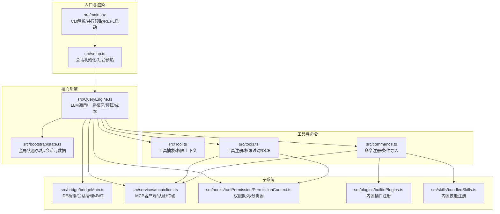
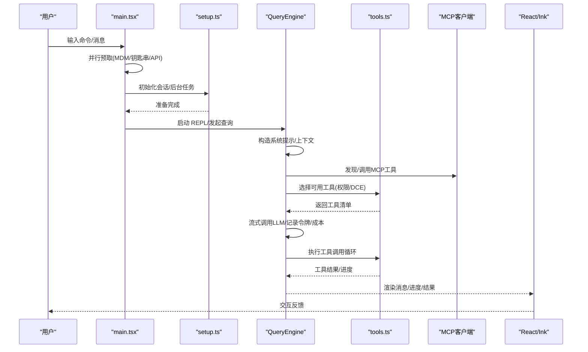
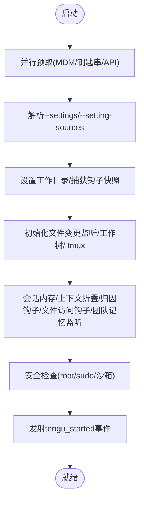
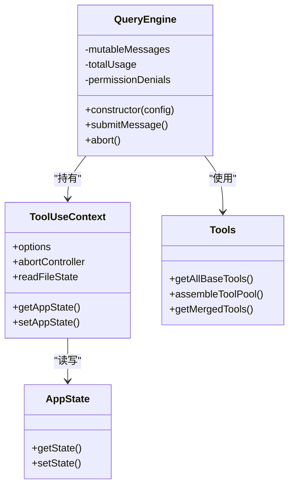
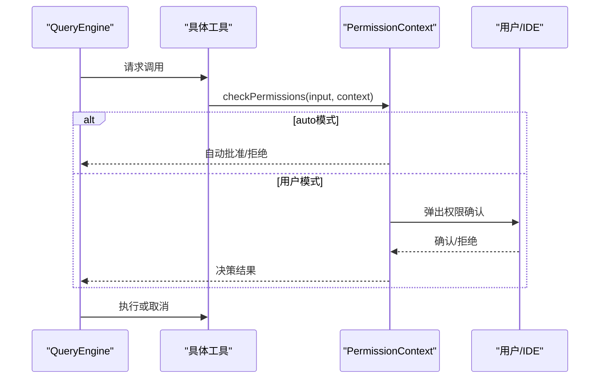
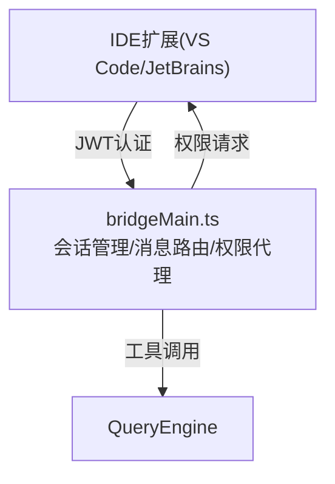
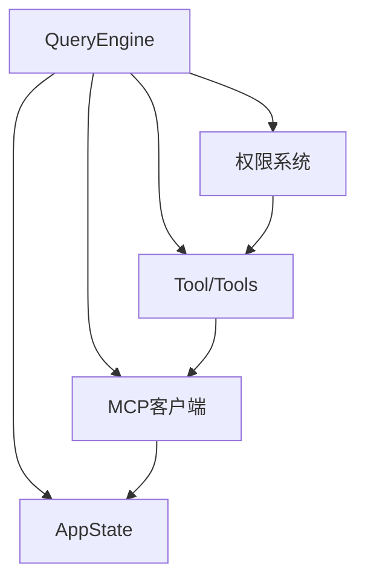

# 架构概览

<cite>
**本文档引用的文件**
- [README.md](file://README.md)
- [docs/architecture.md](file://docs/architecture.md)
- [docs/tools.md](file://docs/tools.md)
- [docs/subsystems.md](file://docs/subsystems.md)
- [src/main.tsx](file://src/main.tsx)
- [src/setup.ts](file://src/setup.ts)
- [src/bootstrap/state.ts](file://src/bootstrap/state.ts)
- [src/QueryEngine.ts](file://src/QueryEngine.ts)
- [src/Tool.ts](file://src/Tool.ts)
- [src/tools.ts](file://src/tools.ts)
- [src/commands.ts](file://src/commands.ts)
- [src/bridge/bridgeMain.ts](file://src/bridge/bridgeMain.ts)
- [src/hooks/toolPermission/PermissionContext.ts](file://src/hooks/toolPermission/PermissionContext.ts)
- [src/services/mcp/client.ts](file://src/services/mcp/client.ts)
- [src/plugins/builtinPlugins.ts](file://src/plugins/builtinPlugins.ts)
- [src/skills/bundledSkills.ts](file://src/skills/bundledSkills.ts)
</cite>

## 目录
1. [简介](#简介)
2. [项目结构](#项目结构)
3. [核心组件](#核心组件)
4. [架构总览](#架构总览)
5. [详细组件分析](#详细组件分析)
6. [依赖分析](#依赖分析)
7. [性能考量](#性能考量)
8. [故障排查指南](#故障排查指南)
9. [结论](#结论)

## 简介
本文件面向架构师与高级开发者，系统性梳理 Claude Code 的整体架构设计与实现细节。项目采用模块化设计与插件架构，结合权限驱动、异步处理与死代码消除（DCE）等关键技术，构建了从终端到 LLM 的完整推理与执行流水线。文档重点覆盖启动流程、查询引擎、工具系统、命令系统、桥接系统（IDE 集成）、MCP 协议、权限体系与技能/插件扩展机制，并通过多种架构图帮助读者快速建立全局认知。

## 项目结构
项目采用“功能域 + 层次化”的组织方式：
- 入口与启动：src/main.tsx 负责 CLI 解析、并行预取、React/Ink 渲染与 REPL 启动；src/setup.ts 执行会话级初始化与后台任务预热。
- 核心引擎：src/QueryEngine.ts 是推理与工具循环的核心，负责消息管理、令牌预算、重试与成本追踪。
- 工具系统：src/Tool.ts 定义工具抽象与上下文；src/tools.ts 汇总内置工具并按权限与特性条件装配。
- 命令系统：src/commands.ts 注册各类用户命令，支持交互式与非交互式两类命令。
- 子系统：bridge（IDE 桥接）、MCP（模型上下文协议客户端/服务端）、权限系统、插件与技能等。
- 状态与配置：src/bootstrap/state.ts 提供全局状态；Zod 配置与迁移位于 schemas 与 migrations 目录。

**图表来源**
- [src/main.tsx:1-800](file://src/main.tsx#L1-L800)
- [src/setup.ts:1-479](file://src/setup.ts#L1-L479)
- [src/QueryEngine.ts:1-200](file://src/QueryEngine.ts#L1-L200)
- [src/bootstrap/state.ts:1-800](file://src/bootstrap/state.ts#L1-L800)
- [src/Tool.ts:1-200](file://src/Tool.ts#L1-L200)
- [src/tools.ts:1-391](file://src/tools.ts#L1-L391)
- [src/commands.ts:1-200](file://src/commands.ts#L1-L200)
- [src/bridge/bridgeMain.ts:1-200](file://src/bridge/bridgeMain.ts#L1-L200)
- [src/hooks/toolPermission/PermissionContext.ts:1-200](file://src/hooks/toolPermission/PermissionContext.ts#L1-L200)
- [src/services/mcp/client.ts:1-200](file://src/services/mcp/client.ts#L1-L200)
- [src/plugins/builtinPlugins.ts:1-161](file://src/plugins/builtinPlugins.ts#L1-L161)
- [src/skills/bundledSkills.ts:1-200](file://src/skills/bundledSkills.ts#L1-L200)

**章节来源**
- [README.md:193-236](file://README.md#L193-L236)
- [docs/architecture.md:19-225](file://docs/architecture.md#L19-L225)

## 核心组件
- 启动与初始化
  - main.tsx：并行预取 MDM、钥匙串、API 连接；解析 CLI 参数；初始化 React/Ink；触发 REPL 启动。
  - setup.ts：设置工作目录、钩子快照、工作树/ tmux、后台任务（会话内存、上下文折叠、提交归因钩子、会话文件访问钩子、团队记忆监听）；发射 tengu_started 事件；安全检查（root/sudo、沙箱环境）。
- 查询引擎（QueryEngine）
  - 统一的查询生命周期管理，包含流式响应、工具调用循环、思考模式、重试逻辑、令牌计数与成本追踪、上下文管理与压缩。
- 工具系统（Tool/Tools）
  - Tool.ts 定义工具输入模式、权限上下文、进度类型与上下文接口；tools.ts 汇总内置工具，按特性标志与权限规则进行死代码消除与动态装配。
- 命令系统（commands.ts）
  - 注册约 50 个命令，分为 Prompt 命令（向 LLM 发送格式化提示）、本地命令（纯文本输出）、本地 JSX 命令（React JSX 输出），支持条件导入与特性门控。
- 权限系统（toolPermission）
  - 中央化的权限检查与决策队列，支持 default/plan/bypassPermissions/auto 等模式；ML 分类器可自动审批；持久化权限更新。
- 桥接系统（bridge）
  - 双向通信层，连接 IDE 扩展与 CLI；会话管理、消息路由、权限代理、JWT 认证、心跳与超时处理。
- MCP 系统
  - 既是 MCP 客户端（发现工具/资源、认证、连接监控），也可作为 MCP 服务器暴露自身工具。
- 插件与技能
  - 插件：内置插件注册与启用/禁用；技能：内置技能注册与首次调用时的参考文件提取。

**章节来源**
- [src/main.tsx:585-800](file://src/main.tsx#L585-L800)
- [src/setup.ts:56-479](file://src/setup.ts#L56-L479)
- [src/QueryEngine.ts:184-200](file://src/QueryEngine.ts#L184-L200)
- [src/Tool.ts:158-200](file://src/Tool.ts#L158-L200)
- [src/tools.ts:193-391](file://src/tools.ts#L193-L391)
- [src/commands.ts:1-200](file://src/commands.ts#L1-L200)
- [src/hooks/toolPermission/PermissionContext.ts:96-200](file://src/hooks/toolPermission/PermissionContext.ts#L96-L200)
- [src/bridge/bridgeMain.ts:141-200](file://src/bridge/bridgeMain.ts#L141-L200)
- [src/services/mcp/client.ts:146-200](file://src/services/mcp/client.ts#L146-L200)
- [src/plugins/builtinPlugins.ts:21-161](file://src/plugins/builtinPlugins.ts#L21-L161)
- [src/skills/bundledSkills.ts:43-200](file://src/skills/bundledSkills.ts#L43-L200)

## 架构总览
Claude Code 的核心管道遵循“用户输入 → CLI 解析 → 查询引擎 → LLM API → 工具执行循环 → 终端 UI”的单向数据流。系统以 React/Ink 构建终端 UI，采用并发渲染与事件循环模型，配合 Web Worker/子进程承载 CPU 密集型任务；通过特性门控与死代码消除实现按需裁剪与性能优化。

**图表来源**
- [src/main.tsx:585-800](file://src/main.tsx#L585-L800)
- [src/setup.ts:56-479](file://src/setup.ts#L56-L479)
- [src/QueryEngine.ts:184-200](file://src/QueryEngine.ts#L184-L200)
- [src/tools.ts:193-391](file://src/tools.ts#L193-L391)
- [src/services/mcp/client.ts:146-200](file://src/services/mcp/client.ts#L146-L200)

## 详细组件分析

### 启动流程与初始化
- 并行预取：在加载重型模块前，先并行触发 MDM 设置读取、钥匙串预取、API 预连接，缩短首包时间。
- 早期参数解析：支持 --settings 与 --setting-sources 等标志，尽早应用配置以影响后续初始化。
- 会话初始化：设置工作目录、捕获钩子配置快照、初始化文件变更监听、工作树/ tmux 创建、会话内存、上下文折叠、提交归因钩子、会话文件访问钩子、团队记忆监听。
- 安全检查：禁止 root/sudo 在无沙箱且有网络的环境中使用危险跳过权限标志；在沙箱容器中限制策略。
- 事件发射：tengu_started 作为最早可靠的“进程启动”信号，用于健康监控与释放跟踪。

**图表来源**
- [src/main.tsx:585-800](file://src/main.tsx#L585-L800)
- [src/setup.ts:56-479](file://src/setup.ts#L56-L479)

**章节来源**
- [src/main.tsx:517-800](file://src/main.tsx#L517-L800)
- [src/setup.ts:56-479](file://src/setup.ts#L56-L479)

### 查询引擎（QueryEngine）
- 职责：统一管理一次对话的生命周期，包括消息构建、系统提示注入、工具选择与调用、流式响应、重试与回退、令牌与成本统计、上下文压缩与历史截断。
- 关键能力：
  - 工具循环：当 LLM 请求工具时，引擎根据权限与 MCP 工具池选择并执行，再将结果回传给 LLM。
  - 思考模式：扩展思考阶段，配合预算管理。
  - 死代码消除：按特性标志按需引入协调者模式、历史截断等模块。
  - 会话状态：与 AppState 协作，持久化消息、文件缓存、用量与指标。

**图表来源**
- [src/QueryEngine.ts:184-200](file://src/QueryEngine.ts#L184-L200)
- [src/Tool.ts:158-200](file://src/Tool.ts#L158-L200)
- [src/tools.ts:193-391](file://src/tools.ts#L193-L391)
- [src/bootstrap/state.ts:1-800](file://src/bootstrap/state.ts#L1-L800)

**章节来源**
- [src/QueryEngine.ts:184-200](file://src/QueryEngine.ts#L184-L200)
- [src/Tool.ts:158-200](file://src/Tool.ts#L158-L200)
- [src/tools.ts:193-391](file://src/tools.ts#L193-L391)

### 工具系统（Tool/Tools）
- Tool 抽象：定义工具输入模式、权限上下文、进度类型、上下文接口与 UI 渲染钩子。
- tools.ts：集中注册内置工具，按特性标志与权限规则进行死代码消除与动态装配；提供工具池合并（内置+MCP）与去重策略，保证提示缓存稳定性。
- 权限过滤：基于 deny 规则在运行前剔除被禁止的工具，避免越权暴露。

**图表来源**
- [src/tools.ts:193-391](file://src/tools.ts#L193-L391)
- [src/Tool.ts:158-200](file://src/Tool.ts#L158-L200)

**章节来源**
- [src/Tool.ts:158-200](file://src/Tool.ts#L158-L200)
- [src/tools.ts:193-391](file://src/tools.ts#L193-L391)
- [docs/tools.md:19-50](file://docs/tools.md#L19-L50)

### 命令系统（commands.ts）
- 注册约 50 个命令，按类型分为 Prompt 命令（向 LLM 发送格式化提示）、本地命令（纯文本输出）、本地 JSX 命令（React JSX 输出）。
- 条件导入：通过特性标志与环境变量控制命令可用性，实现死代码消除与按需加载。
- 动态技能与插件：命令可聚合来自技能与插件的指令，形成统一的命令入口。

**章节来源**
- [src/commands.ts:1-200](file://src/commands.ts#L1-L200)
- [docs/tools.md:163-174](file://docs/tools.md#L163-L174)

### 权限系统（toolPermission）
- 决策队列：解耦于 React 的通用接口，支持 REPL 中由 React 状态驱动的队列操作。
- 模式与规则：支持 default/plan/bypassPermissions/auto；规则采用通配符匹配；ML 分类器可自动审批 Bash 等高风险工具。
- 持久化：权限更新可持久化并即时反映到权限上下文，确保跨轮次一致性。

**图表来源**
- [src/hooks/toolPermission/PermissionContext.ts:96-200](file://src/hooks/toolPermission/PermissionContext.ts#L96-L200)
- [src/Tool.ts:158-200](file://src/Tool.ts#L158-L200)

**章节来源**
- [src/hooks/toolPermission/PermissionContext.ts:96-200](file://src/hooks/toolPermission/PermissionContext.ts#L96-L200)
- [docs/subsystems.md:106-148](file://docs/subsystems.md#L106-L148)

### 桥接系统（IDE 集成）
- 双向通道：IDE 扩展（VS Code、JetBrains）通过 JWT 认证与 CLI 建立双向通信，桥接层负责会话管理、消息路由与权限代理。
- 主循环：维护活动会话、心跳、超时与容量唤醒；支持多会话并发与工作树隔离。
- 类型与协议：统一的消息序列化/反序列化与错误处理，确保跨进程/跨平台一致性。

**图表来源**
- [src/bridge/bridgeMain.ts:141-200](file://src/bridge/bridgeMain.ts#L141-L200)
- [docs/subsystems.md:22-70](file://docs/subsystems.md#L22-L70)

**章节来源**
- [src/bridge/bridgeMain.ts:141-200](file://src/bridge/bridgeMain.ts#L141-L200)
- [docs/subsystems.md:22-70](file://docs/subsystems.md#L22-L70)

### MCP 系统
- 客户端：支持工具发现、资源浏览、动态工具加载、认证与连接健康监控；对大输出内容进行截断与存储。
- 服务端：可通过入口点作为 MCP 服务器对外暴露工具与资源，供其他 AI 代理使用。
- 错误与会话：对会话过期、认证失败等进行专门错误封装与恢复策略。

**章节来源**
- [src/services/mcp/client.ts:146-200](file://src/services/mcp/client.ts#L146-L200)
- [docs/subsystems.md:72-104](file://docs/subsystems.md#L72-L104)

### 插件与技能系统
- 插件：内置插件注册表，支持启用/禁用与多组件（技能、钩子、MCP 服务器）组合；与命令系统集成，提供统一的 UI 与入口。
- 技能：内置技能在首次调用时惰性提取参考文件至磁盘，便于模型按需读取与搜索；支持钩子与上下文配置。

**章节来源**
- [src/plugins/builtinPlugins.ts:21-161](file://src/plugins/builtinPlugins.ts#L21-L161)
- [src/skills/bundledSkills.ts:43-200](file://src/skills/bundledSkills.ts#L43-L200)
- [docs/subsystems.md:150-180](file://docs/subsystems.md#L150-L180)

## 依赖分析
- 组件耦合
  - QueryEngine 与 ToolUseContext 强耦合，但通过 AppState 解耦状态读写；工具与 MCP 工具通过统一接口合并。
  - 权限系统与工具系统弱耦合，仅在调用前通过 checkPermissions 接口交互。
  - 桥接系统与 QueryEngine 通过会话句柄与心跳协议耦合，保持低侵入。
- 外部依赖
  - MCP SDK、Anthropic SDK、React/Ink、Zod、Commander.js、OpenTelemetry 等。
- 特性门控与死代码消除
  - 通过 Bun 的 feature 标记按构建时裁剪未使用的分支，显著减少二进制体积与冷启动时间。

**图表来源**
- [src/QueryEngine.ts:184-200](file://src/QueryEngine.ts#L184-L200)
- [src/tools.ts:193-391](file://src/tools.ts#L193-L391)
- [src/hooks/toolPermission/PermissionContext.ts:96-200](file://src/hooks/toolPermission/PermissionContext.ts#L96-L200)
- [src/services/mcp/client.ts:146-200](file://src/services/mcp/client.ts#L146-L200)
- [src/bootstrap/state.ts:1-800](file://src/bootstrap/state.ts#L1-L800)

**章节来源**
- [src/QueryEngine.ts:184-200](file://src/QueryEngine.ts#L184-L200)
- [src/tools.ts:193-391](file://src/tools.ts#L193-L391)
- [src/hooks/toolPermission/PermissionContext.ts:96-200](file://src/hooks/toolPermission/PermissionContext.ts#L96-L200)
- [src/services/mcp/client.ts:146-200](file://src/services/mcp/client.ts#L146-L200)
- [src/bootstrap/state.ts:1-800](file://src/bootstrap/state.ts#L1-L800)

## 性能考量
- 并行预取与懒加载：在 main.tsx 中并行触发 MDM、钥匙串与 API 预连接；OpenTelemetry、gRPC 等重型模块按需动态导入，降低冷启动开销。
- 死代码消除：通过 Bun 的 feature 标记在构建时移除未使用分支，减少二进制体积与运行时分支判断。
- 事件循环与并发：单线程事件循环 + React 并发渲染；CPU 密集型任务通过 Web Worker 或子进程执行，避免阻塞主线程。
- 上下文压缩与历史截断：在长会话中通过上下文折叠与历史截断控制内存占用与 API 成本。
- 缓存与快照：钩子配置快照、会话文件访问钩子、团队记忆监听等后台任务在合适时机预热，提升首轮响应速度。

**章节来源**
- [docs/architecture.md:145-188](file://docs/architecture.md#L145-L188)
- [src/main.tsx:585-800](file://src/main.tsx#L585-L800)
- [src/setup.ts:56-479](file://src/setup.ts#L56-L479)

## 故障排查指南
- 启动阶段
  - 检查 Node.js 版本要求与 --bare/--simple 模式下的差异；确认工作目录与钩子快照是否正确捕获。
  - 若出现 tengu_started 事件缺失，检查初始化路径与日志输出。
- 权限相关
  - 确认权限模式（default/plan/bypassPermissions/auto）与规则配置；查看权限决策日志与持久化更新。
  - 对于 Bash 等高风险工具，若 auto 模式未生效，检查分类器状态与规则匹配。
- MCP 连接
  - 检查服务器认证状态与会话有效期；关注会话过期与 401/403 错误的处理与重连策略。
- 桥接问题
  - 核对 JWT 令牌有效性与心跳间隔；确认多会话并发与工作树隔离配置。

**章节来源**
- [src/setup.ts:56-479](file://src/setup.ts#L56-L479)
- [src/hooks/toolPermission/PermissionContext.ts:96-200](file://src/hooks/toolPermission/PermissionContext.ts#L96-L200)
- [src/services/mcp/client.ts:146-200](file://src/services/mcp/client.ts#L146-L200)
- [src/bridge/bridgeMain.ts:141-200](file://src/bridge/bridgeMain.ts#L141-L200)

## 结论
Claude Code 通过模块化设计与插件架构实现了高度可扩展的终端 AI 编码助手。其核心以 QueryEngine 为中心，结合权限驱动、MCP 协议与桥接系统，形成从输入到执行再到 UI 呈现的完整闭环。特性门控与死代码消除确保了在不同部署场景下的性能与安全性平衡。对于架构师与高级开发者而言，理解上述组件关系与数据流是高效扩展与优化的关键。