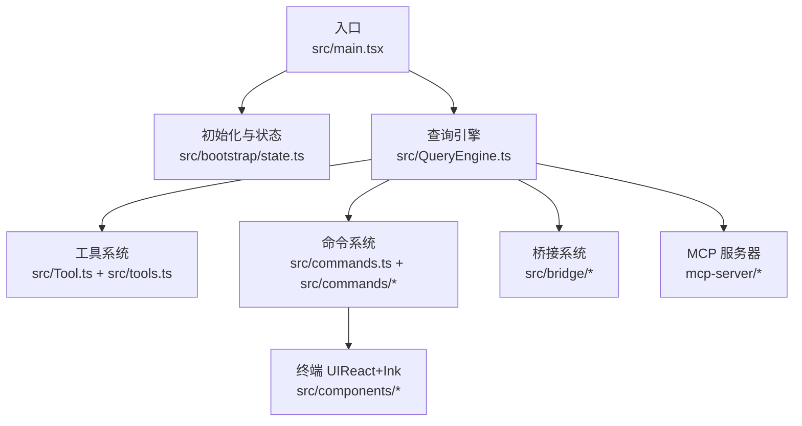
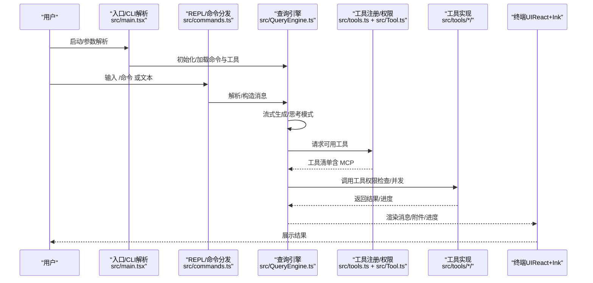
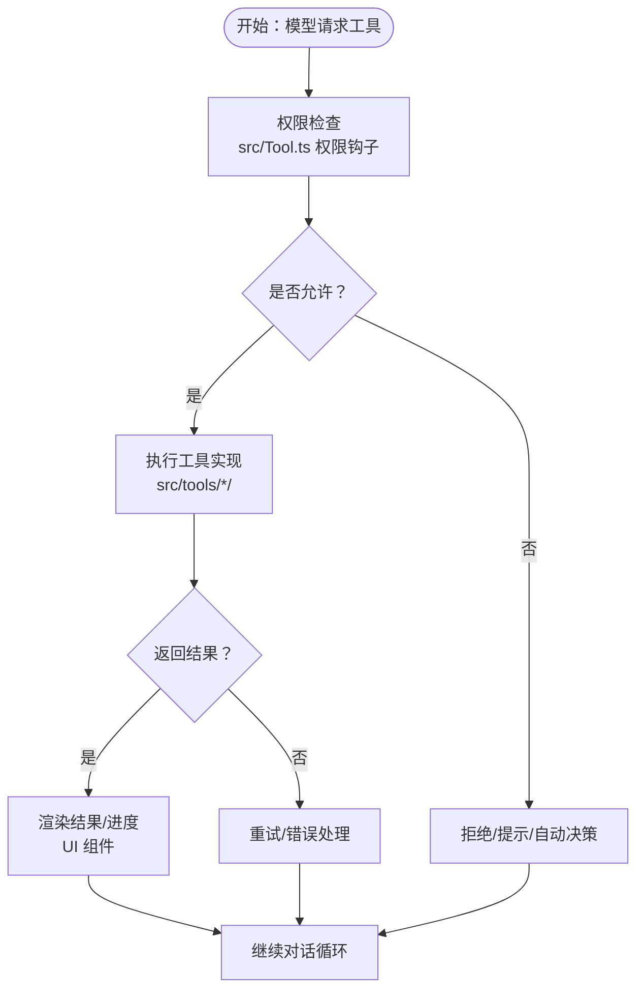
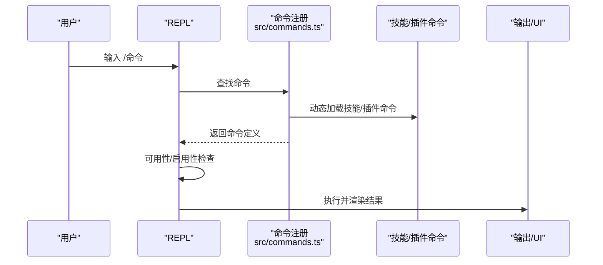
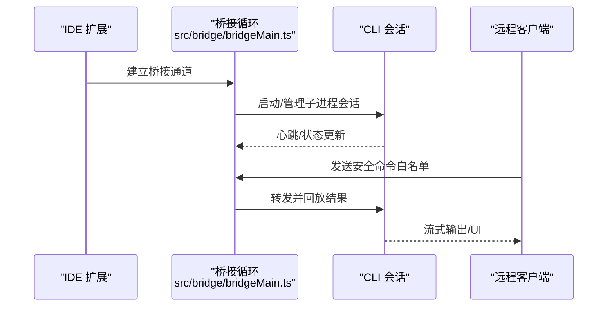
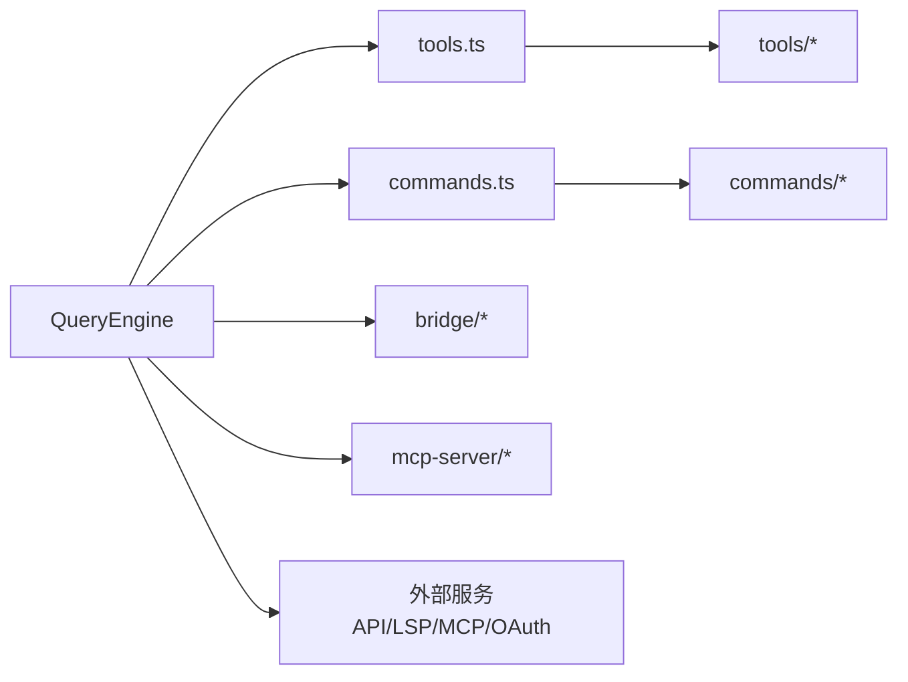

# 核心特性

<cite>
**本文引用的文件**
- [README.md](file://README.md)
- [package.json](file://package.json)
- [src/main.tsx](file://src/main.tsx)
- [src/bootstrap/state.ts](file://src/bootstrap/state.ts)
- [src/tools.ts](file://src/tools.ts)
- [src/commands.ts](file://src/commands.ts)
- [src/Tool.ts](file://src/Tool.ts)
- [src/QueryEngine.ts](file://src/QueryEngine.ts)
- [docs/architecture.md](file://docs/architecture.md)
- [docs/tools.md](file://docs/tools.md)
- [docs/commands.md](file://docs/commands.md)
- [src/bridge/bridgeMain.ts](file://src/bridge/bridgeMain.ts)
</cite>

## 目录
1. [简介](#简介)
2. [项目结构](#项目结构)
3. [核心组件](#核心组件)
4. [架构总览](#架构总览)
5. [详细组件分析](#详细组件分析)
6. [依赖关系分析](#依赖关系分析)
7. [性能考量](#性能考量)
8. [故障排查指南](#故障排查指南)
9. [结论](#结论)
10. [附录](#附录)

## 简介
本文件面向 Claude Code 项目，系统化梳理其核心特性与架构要点，重点覆盖以下方面：
- AI 编程助手：基于流式响应、工具循环、思维模式与重试机制的对话引擎
- 多平台支持：CLI、桌面应用、Web、MCP 服务器
- 智能工具系统：约 40 种内置工具，涵盖文件读写、搜索、执行、任务与代理编排、MCP 集成等
- 权限控制系统：按工具与路径粒度的权限模型与多种许可模式
- 远程协作能力：IDE 桥接、远程会话、移动端/桌面端手递手、跨设备传输

同时提供特性对比表、功能矩阵与使用示例，帮助读者快速定位适合自身工作流的使用方式。

## 项目结构
Claude Code 是一个终端原生的 AI 编程助手，采用单二进制 CLI，以 React + Ink 构建终端 UI，围绕“命令解析 → 查询引擎 → 工具循环 → 终端渲染”的流水线组织代码。关键目录与职责概览：
- src/main.tsx：入口与启动流程，负责并行预取、初始化与 REPL 启动
- src/QueryEngine.ts：核心对话引擎，处理流式响应、工具调用循环、思考模式、重试与令牌统计
- src/Tool.ts 与 src/tools.ts：工具类型定义与注册，统一输入校验、权限检查、并发安全与 UI 渲染
- src/commands.ts 与 src/commands/：Slash 命令注册与执行，覆盖 Git/版本控制、代码质量、会话上下文、配置、MCP/插件、任务/代理、诊断等
- src/bridge/：IDE 桥接（VS Code、JetBrains）与远程会话管理
- docs/：架构、工具、命令参考文档
- mcp-server/：MCP 服务器，使任意 MCP 客户端可交互探索源码树

图表来源
- [src/main.tsx:585-800](file://src/main.tsx#L585-L800)
- [src/bootstrap/state.ts:429-430](file://src/bootstrap/state.ts#L429-L430)
- [src/QueryEngine.ts:184-200](file://src/QueryEngine.ts#L184-L200)
- [src/Tool.ts:1-120](file://src/Tool.ts#L1-L120)
- [src/commands.ts:259-348](file://src/commands.ts#L259-L348)
- [src/bridge/bridgeMain.ts:141-152](file://src/bridge/bridgeMain.ts#L141-L152)

章节来源
- [README.md:193-236](file://README.md#L193-L236)
- [docs/architecture.md:7-78](file://docs/architecture.md#L7-L78)

## 核心组件
- 入口与启动（src/main.tsx）
  - 并行预取 MDM、钥匙串与 API 连接，避免阻塞主模块导入
  - 解析 CLI 参数，设置入口点（CLI/SDK/MCP），初始化 Telemetry 与策略限制
  - 启动 REPL，加载命令与工具池，进入交互循环
- 查询引擎（src/QueryEngine.ts）
  - 流式接收模型输出，维护消息历史，驱动工具调用循环
  - 支持思考模式、预算控制、重试与钩子扩展
  - 聚合令牌用量与成本统计，暴露给命令与 UI
- 工具系统（src/Tool.ts + src/tools.ts）
  - 统一的工具基类与注册机制，内置约 40 种工具
  - 每个工具定义输入模式、权限规则、并发安全与 UI 渲染
  - 支持 MCP 工具动态合并，去重与排序保证提示缓存稳定
- 命令系统（src/commands.ts + src/commands/*）
  - Slash 命令注册与可用性过滤（认证/提供商条件）
  - 分类覆盖：Git/版本控制、代码质量、会话上下文、配置、MCP/插件、任务/代理、诊断等
  - 远程/桥接安全命令白名单，保障移动端/网页端安全回放
- 桥接系统（src/bridge/）
  - 双向通信层，连接 IDE 扩展与 CLI，支持多会话、心跳、超时与容量唤醒
  - 提供远程会话、直连服务器、信任设备与令牌刷新等能力

章节来源
- [src/main.tsx:585-800](file://src/main.tsx#L585-L800)
- [src/QueryEngine.ts:184-200](file://src/QueryEngine.ts#L184-L200)
- [src/Tool.ts:1-120](file://src/Tool.ts#L1-L120)
- [src/tools.ts:193-251](file://src/tools.ts#L193-L251)
- [src/commands.ts:259-348](file://src/commands.ts#L259-L348)
- [src/bridge/bridgeMain.ts:141-152](file://src/bridge/bridgeMain.ts#L141-L152)

## 架构总览
下图展示从用户输入到工具执行再到终端渲染的完整链路，并标注关键组件与数据流：

图表来源
- [src/main.tsx:585-800](file://src/main.tsx#L585-L800)
- [src/commands.ts:478-520](file://src/commands.ts#L478-L520)
- [src/QueryEngine.ts:184-200](file://src/QueryEngine.ts#L184-L200)
- [src/tools.ts:345-367](file://src/tools.ts#L345-L367)

章节来源
- [docs/architecture.md:7-78](file://docs/architecture.md#L7-L78)

## 详细组件分析

### 组件 A：工具系统（40+ 工具）
- 设计要点
  - 工具即插即用：每个工具自包含输入模式、权限规则、执行逻辑与 UI 渲染
  - 注册中心：统一在 tools.ts 中装配内置工具与 MCP 工具，自动去重与排序
  - 条件构建：通过 Bun 的 feature 标记按需裁剪工具集，减少体积与复杂度
  - 权限模型：每工具实现权限检查，结合全局规则与许可模式（默认/计划/绕过/自动）
- 关键流程（工具调用循环）

图表来源
- [src/Tool.ts:123-148](file://src/Tool.ts#L123-L148)
- [src/tools.ts:345-367](file://src/tools.ts#L345-L367)

章节来源
- [docs/tools.md:1-174](file://docs/tools.md#L1-L174)
- [src/tools.ts:193-251](file://src/tools.ts#L193-L251)
- [src/Tool.ts:1-120](file://src/Tool.ts#L1-L120)

### 组件 B：命令系统（约 85 个 Slash 命令）
- 设计要点
  - 三类命令：Prompt（发送格式化提示）、Local（本地纯文本）、LocalJSX（渲染 UI）
  - 动态加载：技能、插件、工作流命令与内置命令合并，支持去重与插入位置控制
  - 可用性过滤：按认证/提供商条件即时生效
  - 远程/桥接安全：明确允许从移动端/网页端回放到本地的安全命令集合
- 使用示例（路径指引）
  - 代码审查：/review（见命令注册与实现）
  - 提交与 PR：/commit、/commit-push-pr（版本控制相关命令）
  - 会话压缩与上下文可视化：/compact、/context
  - 配置与权限：/config、/permissions
  - MCP 与插件：/mcp、/plugin、/skills
  - 诊断与状态：/doctor、/status、/stats、/cost

图表来源
- [src/commands.ts:478-520](file://src/commands.ts#L478-L520)
- [src/commands.ts:621-688](file://src/commands.ts#L621-L688)

章节来源
- [docs/commands.md:1-212](file://docs/commands.md#L1-L212)
- [src/commands.ts:259-348](file://src/commands.ts#L259-L348)

### 组件 C：桥接系统（IDE 桥接与远程协作）
- 设计要点
  - 多会话与心跳：支持容量唤醒、超时检测与错误预算
  - 令牌与信任：支持信任设备令牌、JWT 刷新与会话令牌
  - 远程会话：支持直连服务器、会话标题与清理
- 使用场景
  - 在 VS Code/JetBrains 中直接与 CLI 交互
  - 通过移动端/网页端发起远程指令，受限于桥接安全命令白名单
  - 跨设备传输会话（Teleport）或手递手切换（Desktop/Mobile）

图表来源
- [src/bridge/bridgeMain.ts:141-152](file://src/bridge/bridgeMain.ts#L141-L152)
- [src/commands.ts:653-678](file://src/commands.ts#L653-L678)

章节来源
- [src/bridge/bridgeMain.ts:141-152](file://src/bridge/bridgeMain.ts#L141-L152)
- [src/commands.ts:621-688](file://src/commands.ts#L621-L688)

### 组件 D：服务层与外部集成
- 外部服务集成
  - Anthropic API 客户端、文件 API、引导数据
  - MCP（Model Context Protocol）连接与管理
  - OAuth 2.0 认证、语言服务器协议（LSP）管理
  - 分析与遥测（GrowthBook 特征旗标、OpenTelemetry）
- 作用
  - 为查询引擎与命令系统提供基础设施支撑，如认证、网络、日志与指标

章节来源
- [README.md:294-312](file://README.md#L294-L312)
- [package.json:25-74](file://package.json#L25-L74)

## 依赖关系分析
- 组件耦合
  - QueryEngine 依赖工具注册中心与命令注册中心，形成“模型 → 工具 → 实现”的单向依赖
  - 工具系统与命令系统均依赖权限钩子与状态存储，保持一致的许可与上下文访问
  - 桥接系统独立于 REPL，但与远程会话与信任令牌紧密关联
- 外部依赖
  - 运行时：Bun（原生 JSX/TSX、bun:bundle 死代码消除）
  - 协议：MCP SDK、LSP
  - UI：React + Ink
  - 数据：Zod（模式校验）、OpenTelemetry（遥测）

图表来源
- [src/QueryEngine.ts:184-200](file://src/QueryEngine.ts#L184-L200)
- [src/tools.ts:193-251](file://src/tools.ts#L193-L251)
- [src/commands.ts:259-348](file://src/commands.ts#L259-L348)
- [src/bridge/bridgeMain.ts:141-152](file://src/bridge/bridgeMain.ts#L141-L152)

章节来源
- [docs/architecture.md:145-187](file://docs/architecture.md#L145-L187)
- [package.json:25-74](file://package.json#L25-L74)

## 性能考量
- 启动优化
  - 并行预取：MDM 设置、钥匙串读取与 API 预连接，缩短首包时间
  - 延迟加载：OpenTelemetry、gRPC 等重型模块按需动态导入
- 事件循环与并发
  - 单线程事件循环 + 异步 I/O；React 并发渲染用于 UI 更新
  - 工具并发安全：每个工具声明是否可并行，避免资源竞争
- 上下文压缩与成本控制
  - 提供上下文压缩命令与令牌预算跟踪，降低长会话内存与成本压力

章节来源
- [src/main.tsx:1-120](file://src/main.tsx#L1-L120)
- [src/QueryEngine.ts:184-200](file://src/QueryEngine.ts#L184-L200)
- [docs/architecture.md:208-216](file://docs/architecture.md#L208-L216)

## 故障排查指南
- 常见问题
  - 权限被拒：检查许可模式与规则；必要时使用计划模式或绕过模式
  - 工具不可用：确认工具是否在当前模式下启用，或已被 MCP/权限规则屏蔽
  - 远程命令无效：仅允许桥接安全命令；确认移动端/网页端已正确接入
  - 诊断环境：使用 /doctor 命令检查 API 连通性、认证状态与工具可用性
- 定位手段
  - 使用 /cost 与 /stats 查看令牌用量与会话统计
  - 使用 /debug-tool-call 定位特定工具调用问题
  - 查看最近错误日志与会话快照

章节来源
- [src/commands.ts:621-688](file://src/commands.ts#L621-L688)
- [docs/commands.md:121-133](file://docs/commands.md#L121-L133)

## 结论
Claude Code 以“查询引擎 + 工具系统 + 命令系统”为核心，配合桥接与 MCP 服务器，实现了从 CLI 到桌面、Web、IDE 的全栈协作体验。其 40+ 工具覆盖文件操作、搜索、执行、任务与代理编排，并通过严格的权限模型与远程安全白名单保障安全可控。借助上下文压缩、成本追踪与遥测体系，可在复杂项目中保持高效与稳定。

## 附录

### 特性对比表（核心能力）
- AI 编程助手
  - 流式响应、工具循环、思考模式、重试与预算控制
  - 适用：日常对话、代码生成、问题定位
- 多平台支持
  - CLI：命令行交互、脚本化
  - 桌面/移动：手递手、远程会话、跨设备传输
  - Web：通过 MCP 客户端探索源码
- 智能工具系统（约 40 种）
  - 文件 I/O、搜索、执行、任务与代理编排、MCP 集成
  - 适用：自动化脚本、批量编辑、知识检索
- 权限控制系统
  - 工具级权限、路径白名单、多种许可模式
  - 适用：企业合规、沙箱环境
- 远程协作
  - IDE 桥接、远程命令白名单、直连与信任设备
  - 适用：远程办公、跨设备协同

章节来源
- [README.md:240-338](file://README.md#L240-L338)
- [docs/tools.md:1-174](file://docs/tools.md#L1-L174)
- [docs/commands.md:1-212](file://docs/commands.md#L1-L212)

### 功能矩阵（按场景推荐）
- 快速修复/重构
  - 推荐：/review、/security-review、/compact、/context
  - 工具：FileRead/Write/Edit、Grep/Glob、Bash/PowerShell
- 自动化脚本
  - 推荐：/tasks、/agents、/plan、/ultraplan
  - 工具：Task*、Agent*、ScheduleCron、RemoteTrigger
- 代码检索与浏览
  - 推荐：/files、/grep、/web-search、/web-fetch
  - 工具：Grep/Glob、WebSearch/WebFetch、LSP
- 会话管理与分享
  - 推荐：/session、/resume、/share、/export、/summary
- 远程协作
  - 推荐：/bridge、/desktop、/mobile、/teleport
  - 安全：仅允许桥接安全命令

章节来源
- [docs/commands.md:37-186](file://docs/commands.md#L37-L186)
- [docs/tools.md:53-136](file://docs/tools.md#L53-L136)