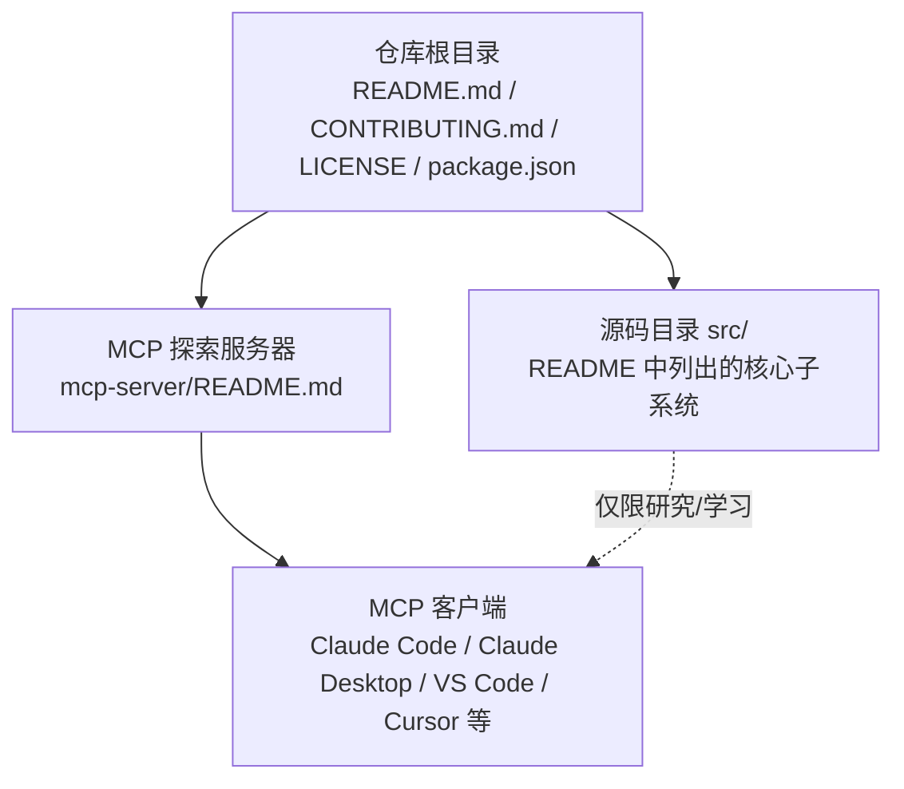
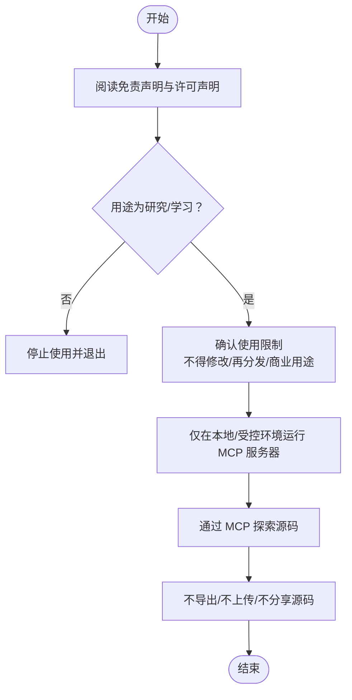

# 法律声明

<cite>
**本文引用的文件**
- [README.md](file://README.md)
- [CONTRIBUTING.md](file://CONTRIBUTING.md)
- [LICENSE](file://LICENSE)
- [package.json](file://package.json)
- [mcp-server/README.md](file://mcp-server/README.md)
</cite>

## 目录
1. [引言](#引言)
2. [项目结构与背景](#项目结构与背景)
3. [核心法律要点](#核心法律要点)
4. [架构总览](#架构总览)
5. [详细组件分析](#详细组件分析)
6. [依赖关系分析](#依赖关系分析)
7. [性能考量](#性能考量)
8. [故障排查指南](#故障排查指南)
9. [结论](#结论)
10. [附录](#附录)

## 引言
本仓库为 Anthropic 公司 Claude Code CLI 的“泄露源码”归档，发布于 2026 年 3 月 31 日。根据仓库公开信息，该源码并非官方发布版本，且明确标注“未授权再分发”。本法律声明旨在帮助研究人员、教育工作者与开发者在遵守法律的前提下，理解并使用本仓库中的内容，同时规避潜在的法律与合规风险。

## 项目结构与背景
- 仓库主体为 Claude Code 的源码目录（src/），包含约 1900 个文件与超过 51 万行代码，采用 TypeScript/TSX 与 Bun 运行时。
- 仓库首页明确指出：该源码来自 Anthropic 的 npm 注册表，包含一个指向完整未混淆 TypeScript 源码的 .map 文件；原始未修改的源码保存在 backup 分支中。
- 仓库 LICENSE 明确标注：该仓库包含 Anthropic 的专有泄露源码，仅用于教育与研究目的，且不得再分发。
- package.json 中的 license 字段为 UNLICENSED，并注明该软件并非开源，Anthropic 未将其发布为任何许可协议。

章节来源
- [README.md:1-16](file://README.md#L1-L16)
- [README.md:43-50](file://README.md#L43-L50)
- [LICENSE:1-12](file://LICENSE#L1-L12)
- [package.json:1-12](file://package.json#L1-L12)

## 核心法律要点
- 版权归属与来源
  - 所有原始源码均为 Anthropic 公司的专有财产。该仓库仅归档泄露源码，不代表官方发布或授权。
  - 仓库首页与 CONTRIBUTING 均强调：src/ 目录为原始泄露源码，应保持不变，不得修改。
- 使用限制与免责声明
  - 仓库明确声明：该仓库为“未授权再分发”，仅供“教育与研究”目的使用。
  - 不得将原始源码进行商业再分发或用于商业用途；也不得对原始源码进行修改。
  - 该仓库不是官方发布版本，不提供任何明示或暗示的许可。
- 合法使用指导原则
  - 仅限个人或学术研究使用，不得用于生产环境或商业产品。
  - 不得对外传播或分发原始源码；不得将其作为自有项目的基础进行二次开发。
  - 若需在 MCP 客户端中探索源码，请遵循 MCP Server 的配置与运行方式，但不得将源码复制到外部系统或第三方平台。
- 法律风险提示与责任声明
  - 使用本仓库内容即表示您已知悉并接受其“未授权再分发”的属性与法律风险。
  - 如因使用本仓库导致的任何法律纠纷，使用者需自行承担相应责任。
  - 本仓库不对任何使用后果承担责任，亦不提供任何形式的保证。

章节来源
- [README.md:438-447](file://README.md#L438-L447)
- [CONTRIBUTING.md:7-21](file://CONTRIBUTING.md#L7-L21)
- [LICENSE:1-12](file://LICENSE#L1-L12)
- [package.json:4-6](file://package.json#L4-L6)

## 架构总览
下图展示仓库中与法律合规相关的关键模块及其交互关系，帮助理解“可否使用”与“如何使用”的边界。

图表来源
- [README.md:193-236](file://README.md#L193-L236)
- [mcp-server/README.md:1-280](file://mcp-server/README.md#L1-L280)

## 详细组件分析

### 组件一：README 与免责声明
- 关键点
  - 明确标注“泄露源码”与泄露日期（2026-03-31）。
  - 明确“未授权再分发”，仅用于教育与研究。
  - 提供 backup 分支以存证原始未修改源码。
- 合规建议
  - 在使用前务必阅读并理解该免责声明。
  - 不得将 README 中的免责声明视为许可或授权。

章节来源
- [README.md:43-50](file://README.md#L43-L50)
- [README.md:438-447](file://README.md#L438-L447)

### 组件二：CONTRIBUTING 与源码保护
- 关键点
  - 明确贡献范围为“文档、工具与探索辅助”，而非修改原始源码。
  - 强调 src/ 目录为原始泄露源码，不得修改。
  - 指出 backup 分支保存了未修改的原始源码。
- 合规建议
  - 对仓库的任何改动仅限于文档、MCP 服务器与探索工具，严禁改动 src/。
  - 如需验证某功能是否被修改，可比对 backup 分支与当前分支差异。

章节来源
- [CONTRIBUTING.md:7-21](file://CONTRIBUTING.md#L7-L21)

### 组件三：LICENSE 与 package.json 的许可声明
- 关键点
  - LICENSE 明确标注“未授权再分发”，仅供教育与研究使用，且使用风险自担。
  - package.json 的 license 字段为 UNLICENSED，表明未授予再分发许可。
- 合规建议
  - 不得将该仓库或其内容用于商业用途或再分发。
  - 不得基于该源码生成衍生作品或商业产品。

章节来源
- [LICENSE:1-12](file://LICENSE#L1-L12)
- [package.json:4-6](file://package.json#L4-L6)

### 组件四：MCP 探索服务器与使用边界
- 关键点
  - MCP 服务器允许通过多种传输协议（STDIO、HTTP、SSE）探索源码。
  - 服务器支持通过环境变量指定源码根路径，便于本地或远程部署。
  - 仓库明确 MCP 服务器的安装与使用方式，但未改变“未授权再分发”的属性。
- 合规建议
  - 仅在本地或受控环境中运行 MCP 服务器，避免将源码带出受控环境。
  - 不得将 MCP 服务器部署到公共平台或第三方托管服务用于商业用途。

章节来源
- [mcp-server/README.md:1-280](file://mcp-server/README.md#L1-L280)

### 组件五：使用流程与合规检查清单
以下流程图展示了在遵守法律前提下的典型使用步骤，帮助用户在研究与学习过程中避免违规行为。

图表来源
- [README.md:438-447](file://README.md#L438-L447)
- [LICENSE:1-12](file://LICENSE#L1-L12)
- [mcp-server/README.md:1-280](file://mcp-server/README.md#L1-L280)

## 依赖关系分析
- 仓库与外部依赖的关系
  - package.json 显示项目依赖 Anthropic SDK、React、Ink、Commander、Zod 等，这些依赖均来自官方渠道。
  - 本仓库的法律属性与这些依赖无关，不影响“未授权再分发”的结论。
- 合规建议
  - 仅将这些依赖用于本地研究与学习，不得将其打包进商业产品或再分发。

章节来源
- [package.json:25-75](file://package.json#L25-L75)

## 性能考量
- 本节为通用建议，不涉及具体文件分析。
- 在本地运行 MCP 服务器时，注意资源占用与网络访问控制，避免无意间将源码暴露至不受控环境。

## 故障排查指南
- 常见问题与处理
  - 误以为仓库可商用：请重新阅读免责声明与 LICENSE，确认不可再分发与商业使用。
  - 想要修改源码：请严格遵守 CONTRIBUTING 的要求，仅在文档与工具层面进行贡献，不得修改 src/。
  - 想要部署 MCP 服务器到公网：请勿将源码暴露于公网，仅在受控环境中使用。
- 风险提示
  - 任何超出“研究/学习”范围的使用均可能构成侵权，责任自负。

章节来源
- [CONTRIBUTING.md:7-21](file://CONTRIBUTING.md#L7-L21)
- [LICENSE:1-12](file://LICENSE#L1-L12)

## 结论
本仓库为 Anthropic Claude Code 的泄露源码归档，明确标注“未授权再分发”，仅供教育与研究使用。使用者应在严格遵守免责声明与 LICENSE 的前提下，仅在本地或受控环境中进行探索与学习，不得修改、再分发或用于商业用途。如需进一步使用，请务必评估自身合规能力并承担相应法律风险。

## 附录
- 快速参考
  - 不得修改原始源码（src/）
  - 不得再分发或商业使用
  - 仅限研究/学习目的
  - 使用风险自担