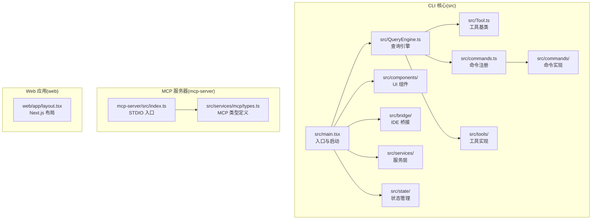
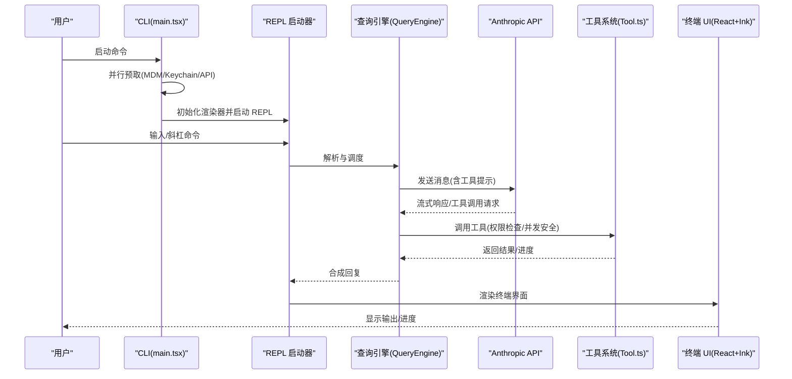
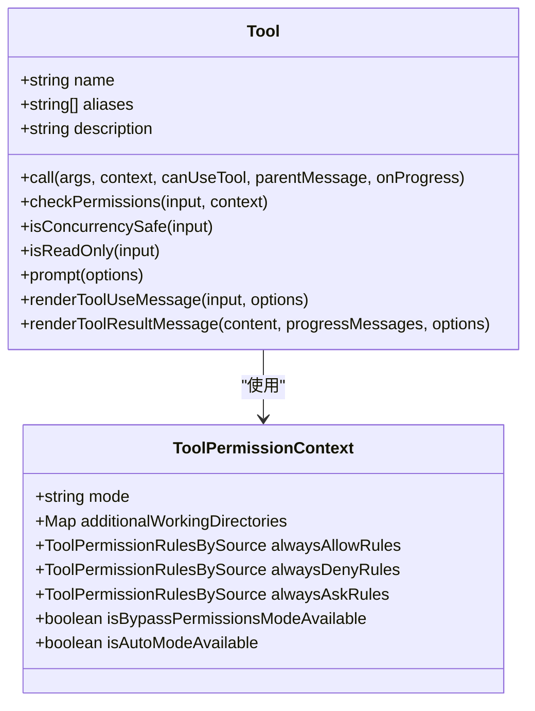
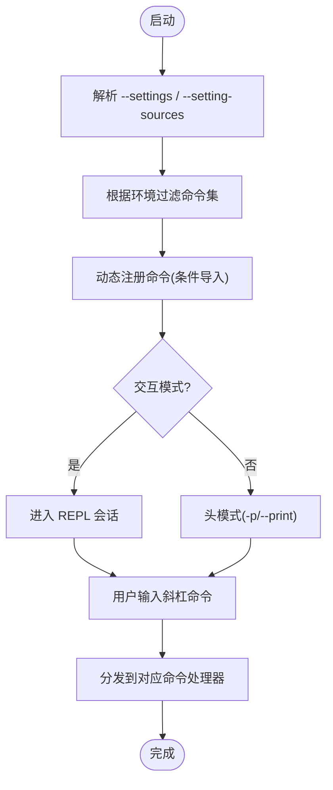
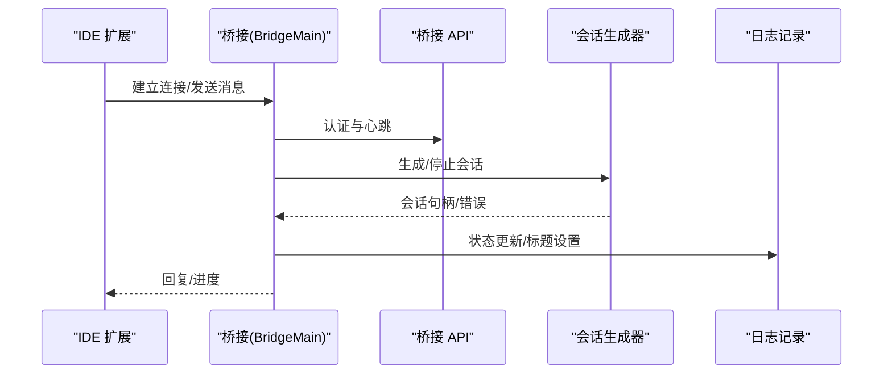
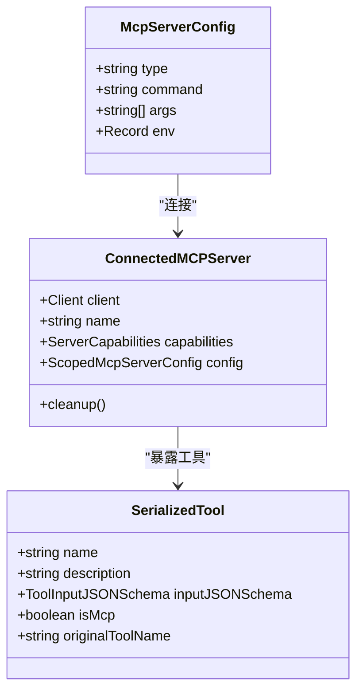
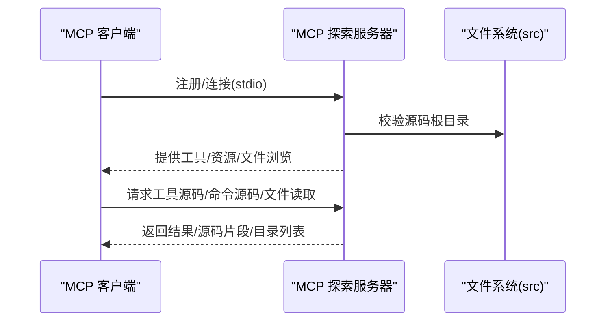
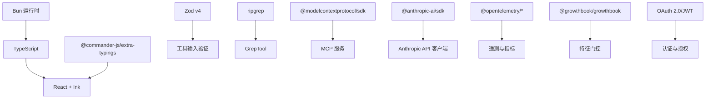

# 项目概述

<cite>
**本文档引用的文件**
- [README.md](file://README.md)
- [package.json](file://package.json)
- [src/main.tsx](file://src/main.tsx)
- [src/Tool.ts](file://src/Tool.ts)
- [src/commands.ts](file://src/commands.ts)
- [src/bridge/bridgeMain.ts](file://src/bridge/bridgeMain.ts)
- [src/services/mcp/types.ts](file://src/services/mcp/types.ts)
- [mcp-server/src/index.ts](file://mcp-server/src/index.ts)
- [web/app/layout.tsx](file://web/app/layout.tsx)
- [docs/architecture.md](file://docs/architecture.md)
- [docs/tools.md](file://docs/tools.md)
- [docs/exploration-guide.md](file://docs/exploration-guide.md)
- [CONTRIBUTING.md](file://CONTRIBUTING.md)
</cite>

## 目录
1. [引言](#引言)
2. [项目结构](#项目结构)
3. [核心组件](#核心组件)
4. [架构总览](#架构总览)
5. [详细组件分析](#详细组件分析)
6. [依赖分析](#依赖分析)
7. [性能考量](#性能考量)
8. [故障排除指南](#故障排除指南)
9. [结论](#结论)
10. [附录](#附录)

## 引言
Claude Code 是由 Anthropic 发布的官方命令行编程助手，该项目在 2026 年 3 月 31 日以“泄露源码”的形式被公开，仓库保留了原始未修改的源码。本项目旨在提供一个完整的 AI 编程助手工具链，覆盖 CLI、桌面应用、Web 服务以及 MCP 服务器，形成从终端到 IDE 的一体化开发体验。

- 核心目标：通过终端交互实现文件编辑、命令执行、代码搜索、Git 工作流管理等能力，并以 React + Ink 构建终端 UI，提供类 Web 应用的响应式交互体验。
- 技术架构：采用单二进制 CLI，基于 React/Ink 的终端 UI，Commander.js 命令解析，Bun 运行时，支持 MCP 协议与 IDE 桥接，具备权限系统、插件与技能扩展、多代理编排、上下文压缩与成本追踪等企业级能力。
- 主要特性：工具系统（约 40 个工具）、命令系统（约 50 个斜杠命令）、MCP 探索服务器、IDE 桥接、语音输入、远程会话、多代理协作、插件与技能生态、配置与策略限制、遥测与诊断等。

**章节来源**
- [README.md: 53-64:53-64](file://README.md#L53-L64)
- [README.md: 240-339:240-339](file://README.md#L240-L339)

## 项目结构
项目采用按功能域划分的模块化组织方式，核心目录包括：
- src：主程序源码，包含入口、查询引擎、工具系统、命令系统、UI 组件、桥接层、服务层、状态管理、脚本与工具等。
- mcp-server：MCP 探索服务器，允许任何 MCP 客户端（如 Claude Code、VS Code Copilot、Cursor）交互式探索源码。
- web：Next.js Web 应用（作为演示或配套前端存在）。
- docs：架构、工具、命令、子系统与探索指南等文档。
- scripts：构建、打包、测试与开发辅助脚本。

**图表来源**
- [src/main.tsx: 1-120:1-120](file://src/main.tsx#L1-L120)
- [src/Tool.ts: 1-120:1-120](file://src/Tool.ts#L1-L120)
- [src/commands.ts: 1-120:1-120](file://src/commands.ts#L1-L120)
- [src/bridge/bridgeMain.ts: 1-120:1-120](file://src/bridge/bridgeMain.ts#L1-L120)
- [src/services/mcp/types.ts: 1-120:1-120](file://src/services/mcp/types.ts#L1-L120)
- [mcp-server/src/index.ts: 1-25:1-25](file://mcp-server/src/index.ts#L1-L25)
- [web/app/layout.tsx: 1-57:1-57](file://web/app/layout.tsx#L1-L57)

**章节来源**
- [README.md: 193-236:193-236](file://README.md#L193-L236)
- [docs/architecture.md: 7-16:7-16](file://docs/architecture.md#L7-L16)

## 核心组件
- 查询引擎（QueryEngine）：负责与 Anthropic API 的流式通信、工具调用循环、思考模式、重试逻辑、令牌计数与上下文管理。
- 工具系统（Tool）：每个工具是自包含模块，包含输入模式、权限模型、执行逻辑与 UI 渲染；工具注册于 tools.ts 并在工具循环中被发现与调用。
- 命令系统（commands.ts）：用户在 REPL 中通过斜杠命令触发，分为 PromptCommand、LocalCommand、LocalJSXCommand 三类；注册于 commands.ts 并按需加载。
- UI 层（React + Ink）：终端 UI 使用 React + Ink 构建，包含屏幕、组件、钩子与渲染器包装。
- 桥接系统（Bridge）：连接 IDE 扩展（VS Code、JetBrains）与 CLI，支持双向通信、权限回调、REPL 会话桥接等。
- 服务层（services）：外部集成与基础设施，包括 MCP 客户端、OAuth、语言服务器协议、分析与遥测、插件加载、上下文压缩、策略限制等。
- 状态管理（state）：全局可变状态对象 AppState，配合 React Context 与选择器、变更观察者实现响应式更新。
- MCP 子系统：支持多种传输类型（stdio、sse、http、ws、sdk），统一配置与资源管理，工具与资源的序列化状态用于 CLI 状态展示。

**章节来源**
- [docs/architecture.md: 41-78:41-78](file://docs/architecture.md#L41-L78)
- [docs/tools.md: 7-50:7-50](file://docs/tools.md#L7-L50)
- [src/Tool.ts: 150-200:150-200](file://src/Tool.ts#L150-L200)
- [src/commands.ts: 60-123:60-123](file://src/commands.ts#L60-L123)
- [src/bridge/bridgeMain.ts: 141-200:141-200](file://src/bridge/bridgeMain.ts#L141-L200)
- [src/services/mcp/types.ts: 124-175:124-175](file://src/services/mcp/types.ts#L124-L175)

## 架构总览
Claude Code 的整体架构遵循“用户输入 → CLI 解析器 → 查询引擎 → LLM API → 工具执行循环 → 终端 UI”的流水线模型。入口文件 main.tsx 在启动阶段进行并行预取与初始化，随后进入 REPL 会话；查询引擎驱动工具循环与 LLM 交互，工具系统与命令系统分别处理具体能力与用户指令，UI 层通过 React/Ink 实时渲染。

**图表来源**
- [docs/architecture.md: 21-38:21-38](file://docs/architecture.md#L21-L38)
- [src/main.tsx: 585-800:585-800](file://src/main.tsx#L585-L800)
- [src/Tool.ts: 158-200:158-200](file://src/Tool.ts#L158-L200)

**章节来源**
- [docs/architecture.md: 19-78:19-78](file://docs/architecture.md#L19-L78)
- [src/main.tsx: 1-120:1-120](file://src/main.tsx#L1-L120)

## 详细组件分析

### 组件 A 分析：工具系统（Tool）
- 设计模式：每个工具通过 buildTool 模式定义，包含名称、别名、描述、输入模式、调用函数、权限检查、并发安全声明、只读属性、系统提示注入、UI 渲染等。
- 数据结构：工具输入使用 Zod 验证，权限上下文包含模式、附加工作目录、规则集合、是否绕过权限可用等；工具进度数据类型涵盖 Bash、MCP、技能、任务输出等。
- 复杂度与性能：工具循环涉及流式响应、重试与令牌计数，需要在并发安全与资源隔离上做权衡；部分工具声明 isConcurrencySafe 以允许并行执行。

**图表来源**
- [docs/tools.md: 19-50:19-50](file://docs/tools.md#L19-L50)
- [src/Tool.ts: 123-148:123-148](file://src/Tool.ts#L123-L148)
- [src/Tool.ts: 158-200:158-200](file://src/Tool.ts#L158-L200)

**章节来源**
- [docs/tools.md: 7-50:7-50](file://docs/tools.md#L7-L50)
- [src/Tool.ts: 1-120:1-120](file://src/Tool.ts#L1-L120)

### 组件 B 分析：命令系统（commands.ts）
- 注册机制：commands.ts 动态导入各类命令，支持按特征门控条件加载（如 PROACTIVE、KAIROS、VOICE_MODE 等），并在非交互模式下过滤命令集。
- 命令类型：PromptCommand 将格式化提示发送给 LLM；LocalCommand 在进程中运行返回纯文本；LocalJSXCommand 返回 React JSX。
- 插件与技能：动态加载插件命令与技能命令，支持缓存清理与索引重建。

**图表来源**
- [src/commands.ts: 1-123:1-123](file://src/commands.ts#L1-L123)
- [src/main.tsx: 517-540:517-540](file://src/main.tsx#L517-L540)

**章节来源**
- [src/commands.ts: 1-123:1-123](file://src/commands.ts#L1-L123)
- [src/main.tsx: 517-540:517-540](file://src/main.tsx#L517-L540)

### 组件 C 分析：桥接系统（Bridge）
- 双向通信：桥接层负责 IDE 与 CLI 的双向通信，包括心跳、会话管理、权限回调、REPL 会话桥接、JWT 认证与会话超时处理。
- 会话生命周期：维护活动会话映射、启动时间、工作树信息、超时监控与容量唤醒机制，支持多会话并发与容量控制。
- 错误与回退：实现指数回退策略、睡眠检测阈值、错误预算与重连尝试，确保稳定性与可观测性。

**图表来源**
- [src/bridge/bridgeMain.ts: 141-200:141-200](file://src/bridge/bridgeMain.ts#L141-L200)
- [src/bridge/bridgeMain.ts: 196-250:196-250](file://src/bridge/bridgeMain.ts#L196-L250)

**章节来源**
- [src/bridge/bridgeMain.ts: 1-200:1-200](file://src/bridge/bridgeMain.ts#L1-L200)

### 组件 D 分析：MCP 子系统
- 配置与类型：支持多种传输类型（stdio、sse、http、ws、sdk），统一配置模式与资源类型，提供连接状态的序列化视图。
- 工具与资源：MCP 工具可在运行时发现与调用，资源列表与读取工具提供对远端资源的访问；CLI 状态包含已连接客户端、工具清单与资源映射。
- 服务器管理：支持标准 MCP 服务器配置、OAuth 与跨应用访问（XAA）标志，以及代理服务器配置。

**图表来源**
- [src/services/mcp/types.ts: 124-175:124-175](file://src/services/mcp/types.ts#L124-L175)
- [src/services/mcp/types.ts: 180-227:180-227](file://src/services/mcp/types.ts#L180-L227)
- [src/services/mcp/types.ts: 232-260:232-260](file://src/services/mcp/types.ts#L232-L260)

**章节来源**
- [src/services/mcp/types.ts: 1-120:1-120](file://src/services/mcp/types.ts#L1-L120)

### 组件 E 分析：MCP 探索服务器
- 入口与传输：STDIO 入口，验证源码根路径后创建服务器并通过 STDIO 传输连接，支持通过环境变量指定源码根目录。
- 集成方式：可在 Claude Code、Claude Desktop、VS Code Copilot、Cursor 等客户端中注册为 MCP 服务器，实现对源码的交互式探索。

**图表来源**
- [mcp-server/src/index.ts: 1-25:1-25](file://mcp-server/src/index.ts#L1-L25)
- [README.md: 83-190:83-190](file://README.md#L83-L190)

**章节来源**
- [mcp-server/src/index.ts: 1-25:1-25](file://mcp-server/src/index.ts#L1-L25)
- [README.md: 83-190:83-190](file://README.md#L83-L190)

### 组件 F 分析：Web 应用（Next.js）
- 布局与主题：Next.js 应用提供基础布局、字体与主题提供器，作为 Web 前端示例或配套界面。
- 适用场景：可用于展示、演示或与 CLI/Web 服务联动的前端界面。

**章节来源**
- [web/app/layout.tsx: 1-57:1-57](file://web/app/layout.tsx#L1-L57)

## 依赖分析
- 运行时与语言：Bun（非 Node.js），TypeScript（严格模式），React + Ink（终端 UI）。
- CLI 解析：Commander.js（额外类型）。
- 模式验证：Zod v4。
- 代码搜索：ripgrep（通过 GrepTool）。
- 协议：MCP SDK、LSP。
- API：Anthropic SDK。
- 遥测：OpenTelemetry + gRPC。
- 特征门控：GrowthBook。
- 认证：OAuth 2.0、JWT、macOS Keychain。
- 依赖管理：package.json 指定 Bun 运行时与包管理器版本。

**图表来源**
- [package.json: 25-95:25-95](file://package.json#L25-L95)
- [README.md: 352-367:352-367](file://README.md#L352-L367)

**章节来源**
- [package.json: 25-95:25-95](file://package.json#L25-L95)
- [README.md: 352-367:352-367](file://README.md#L352-L367)

## 性能考量
- 启动优化：main.tsx 在导入前执行并行预取（MDM 设置、Keychain、API 预连接），减少首次渲染阻塞。
- 延迟加载：OpenTelemetry、gRPC 等重型模块通过动态 import() 按需加载，降低冷启动开销。
- 死代码消除：通过 Bun 的 feature 门控在构建时剔除未启用的功能分支，减小二进制体积。
- 并发与回退：桥接循环实现指数回退与睡眠检测阈值，避免频繁重试导致的系统抖动。
- 上下文压缩与成本追踪：提供上下文压缩与令牌计数，帮助控制成本与提升响应速度。

**章节来源**
- [src/main.tsx: 11-21:11-21](file://src/main.tsx#L11-L21)
- [docs/architecture.md: 180-187:180-187](file://docs/architecture.md#L180-L187)
- [src/bridge/bridgeMain.ts: 107-109:107-109](file://src/bridge/bridgeMain.ts#L107-L109)

## 故障排除指南
- 权限问题：工具调用需经过权限系统，可通过权限模式（default、plan、bypassPermissions、auto）调整行为；支持通配符规则与自动分类器。
- MCP 连接：检查 MCP 服务器配置（传输类型、URL、头部、OAuth），确认客户端状态（connected/failed/needs-auth/pending/disabled）与资源清单。
- 诊断命令：/doctor 屏幕运行环境检查，包括 API 连接性、认证状态、工具可用性、MCP 服务器状态等。
- 会话与桥接：若出现会话超时或权限弹窗异常，检查桥接日志、心跳令牌与会话标题设置；必要时重启桥接循环或清理超时会话。

**章节来源**
- [docs/tools.md: 140-160:140-160](file://docs/tools.md#L140-L160)
- [src/services/mcp/types.ts: 180-227:180-227](file://src/services/mcp/types.ts#L180-L227)
- [docs/architecture.md: 202-205:202-205](file://docs/architecture.md#L202-L205)
- [src/bridge/bridgeMain.ts: 196-250:196-250](file://src/bridge/bridgeMain.ts#L196-L250)

## 结论
Claude Code 以 CLI 为核心，结合 React/Ink 终端 UI、MCP 协议与 IDE 桥接，构建了从终端到 IDE 的完整开发体验。其工具系统与命令系统提供了强大的可扩展能力，权限模型与遥测体系保障了安全性与可观测性。通过 MCP 探索服务器，用户可以在任意 MCP 客户端中交互式探索源码，极大提升了学习与研究效率。尽管源码来自“泄露”，但其工程实践与架构设计仍具有很高的参考价值。

**章节来源**
- [README.md: 53-64:53-64](file://README.md#L53-L64)
- [docs/architecture.md: 7-16:7-16](file://docs/architecture.md#L7-L16)

## 附录

### 快速开始指南
- 安装与运行
  - 使用 npm 包安装 MCP 探索服务器，无需克隆仓库即可直接使用。
  - 也可从源码构建：在 mcp-server 目录执行安装与构建，然后通过 claude mcp add 或 VS Code/Cursor/Claude Desktop 配置注册。
- 基本使用
  - 在 REPL 中输入斜杠命令（如 /review、/mcp、/doctor）触发相应功能。
  - 通过 /cost 查看令牌使用与估算成本。
  - 使用 /desktop 将当前会话转至桌面应用（受平台支持）。
- MCP 服务器配置
  - 支持 stdio、sse、http、ws、sdk 等传输类型；可配置 OAuth 与跨应用访问（XAA）。
  - 通过环境变量 CLAUDE_CODE_SRC_ROOT 指定源码根目录。

**章节来源**
- [README.md: 83-190:83-190](file://README.md#L83-L190)
- [docs/exploration-guide.md: 7-24:7-24](file://docs/exploration-guide.md#L7-L24)

### 法律免责声明
- 本仓库归档的是 Anthropic 的 Claude Code CLI 泄露源码。所有原始源码均为 Anthropic 的财产。这不是官方发布版，且未经许可不得再分发。如有疑问，请联系 nichxbt。

**章节来源**
- [README.md: 443-448:443-448](file://README.md#L443-L448)

### 贡献说明
- 本仓库仅归档泄露源码，贡献应聚焦于文档、MCP 服务器与探索工具，不修改 src/ 目录中的原始源码。
- MCP 服务器开发：在 mcp-server 目录下安装依赖、开发与构建。
- 代码风格：TypeScript 严格模式、ES 模块、2 空格缩进、清晰命名与最小注释。

**章节来源**
- [CONTRIBUTING.md: 1-73:1-73](file://CONTRIBUTING.md#L1-L73)