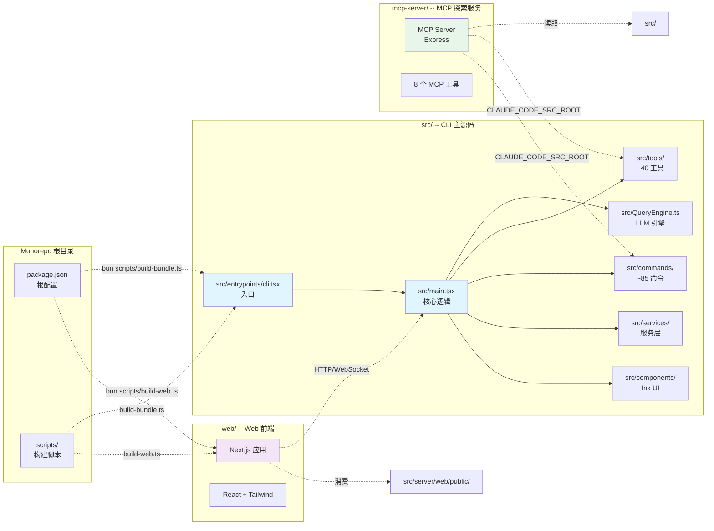

# Claude Code 架构分析 -- 01. 总体概览

> 分析日期: 2026-04-01
> 源码版本: leaked source (2026-03-31)
> 项目规模: ~1,900 文件, 512,000+ 行 TypeScript 代码

---

## 1. 项目整体定位和目标

Claude Code 是 Anthropic 官方的 CLI 工具，允许开发者在终端中直接与 Claude 大模型交互，完成代码编辑、命令执行、代码库搜索、Git 工作流管理等任务。

**核心定位**: 一个终端原生的 AI 编程助手，采用 "工具调用循环" (Tool-Call Loop) 架构 -- LLM 可以自主调用文件读写、Shell 命令、网络搜索等工具来完成复杂编程任务。

**项目来源**: 本仓库是 2026-03-31 通过 npm 包的 `.map` 源映射文件泄露的完整未混淆 TypeScript 源码。泄露者发现 Anthropic 发布的 npm 包中包含了指向 R2 存储桶完整源码的 source map。

**仓库结构**: 这是一个 monorepo，包含三个子项目：
- `src/` -- Claude Code CLI 主源码（泄露的原始代码）
- `web/` -- 浏览器端 Web 终端前端（Next.js 应用，用于远程会话访问）
- `mcp-server/` -- MCP 源码探索服务器（用于让其他 AI 客户端交互式浏览源码）

---

## 2. 技术栈概览

| 类别 | 技术 | 说明 |
|------|------|------|
| **运行时** | [Bun](https://bun.sh) >= 1.1.0 | 替代 Node.js，提供原生 JSX/TSX 支持、更快的启动速度 |
| **语言** | TypeScript (strict mode) | 全量严格类型检查 |
| **终端 UI** | React 19 + Ink | 使用 React 组件模型渲染终端界面 |
| **CLI 解析** | Commander.js (extra-typings) | 命令行参数解析 |
| **Schema 验证** | Zod v4 | 工具输入参数、配置项的类型验证 |
| **LLM API** | @anthropic-ai/sdk ^0.39.0 | Anthropic Messages API 客户端 |
| **MCP 协议** | @modelcontextprotocol/sdk ^1.12.1 | Model Context Protocol 实现 |
| **代码搜索** | ripgrep (通过 GrepTool) | 高性能正则内容搜索 |
| **LSP** | 自定义 LSP 管理器 | 语言服务器协议集成 |
| **遥测** | OpenTelemetry + gRPC | 分布式追踪和指标收集 |
| **特性开关** | GrowthBook | 特性标志和 A/B 测试 |
| **认证** | OAuth 2.0 + JWT + macOS Keychain | 多模式身份验证 |
| **构建工具** | esbuild | 快速打包，支持 tree-shaking 和 DCE |
| **代码质量** | Biome | Linting 和格式化 |

---

## 3. 顶层架构图

```mermaid
graph TB
    subgraph "用户交互层"
        CLI[CLI 终端界面]
        IDE[IDE 扩展<br/>VS Code / JetBrains]
        Web[Web 浏览器<br/>远程会话]
    end

    subgraph "入口层 entrypoints/"
        CLI_Entry[cli.tsx<br/>启动路由]
        MCP_Entry[mcp.ts<br/>MCP 服务模式]
        SDK_Entry[sdk/<br/>Agent SDK]
    end

    subgraph "核心引擎层"
        Main[main.tsx<br/>4,684 行<br/>Commander + Ink 渲染]
        QueryEngine[QueryEngine.ts<br/>~46K 行<br/>LLM API 引擎]
        ToolReg[tools.ts<br/>工具注册中心]
        CmdReg[commands.ts<br/>~25K 行<br/>命令注册中心]
    end

    subgraph "工具层 tools/ (~40 个工具)"
        FileTools[文件工具<br/>Read/Write/Edit/Glob/Grep]
        ShellTools[Shell 工具<br/>Bash/PowerShell/REPL]
        AgentTools[Agent 工具<br/>Agent/Team/SendMessage]
        WebTools[Web 工具<br/>Search/Fetch]
        MCP_Tools[MCP 工具<br/>MCP/Auth/Search]
        TaskTools[任务工具<br/>Create/Update/List/Stop]
    end

    subgraph "命令层 commands/ (~85 个命令)"
        GitCmd[Git 命令<br/>commit/review/diff]
        SessionCmd[会话命令<br/>compact/resume/share]
        ConfigCmd[配置命令<br/>config/permissions/theme]
        DiagCmd[诊断命令<br/>doctor/cost/stats]
    end

    subgraph "服务层 services/"
        APISvc[API 服务<br/>Anthropic SDK]
        MCPSvc[MCP 服务<br/>客户端连接]
        OAuthSvc[OAuth 服务<br/>认证流程]
        LSPSvc[LSP 服务<br/>语言服务器]
        AnalyticsSvc[分析服务<br/>GrowthBook]
        CompactSvc[压缩服务<br/>上下文压缩]
    end

    subgraph "子系统"
        Bridge[Bridge 层<br/>IDE 双向通信]
        Plugins[插件系统<br/>扩展机制]
        Skills[技能系统<br/>可复用工作流]
        Memory[记忆系统<br/>CLAUDE.md]
        Tasks[任务系统<br/>后台/并行任务]
        Coordinator[协调器<br/>多 Agent 编排]
    end

    subgraph "UI 层"
        Components[components/<br/>~140 Ink 组件]
        Hooks[hooks/<br/>~80 React Hooks]
        Screens[screens/<br/>全屏 UI]
    end

    subgraph "状态管理"
        AppState[AppState Store<br/>全局可变状态]
        Context[React Context<br/>通知/统计/FPS]
    end

    subgraph "构建系统"
        BuildBundle[build-bundle.ts<br/>CLI 打包]
        BuildWeb[build-web.ts<br/>Web 前端打包]
    end

    CLI --> CLI_Entry
    IDE -->|WebSocket/SSE| Bridge
    Web -->|HTTP| CLI_Entry

    CLI_Entry --> Main
    MCP_Entry --> Main
    SDK_Entry --> Main

    Main --> QueryEngine
    Main --> ToolReg
    Main --> CmdReg

    QueryEngine --> FileTools
    QueryEngine --> ShellTools
    QueryEngine --> AgentTools
    QueryEngine --> WebTools
    QueryEngine --> MCP_Tools
    QueryEngine --> TaskTools

    ToolReg --> FileTools
    ToolReg --> ShellTools
    ToolReg --> AgentTools
    ToolReg --> WebTools
    ToolReg --> MCP_Tools
    ToolReg --> TaskTools

    CmdReg --> GitCmd
    CmdReg --> SessionCmd
    CmdReg --> ConfigCmd
    CmdReg --> DiagCmd

    QueryEngine --> APISvc
    QueryEngine --> MCPSvc
    QueryEngine --> CompactSvc

    Bridge --> MCPSvc
    Bridge --> OAuthSvc

    Main --> Components
    Main --> Hooks
    Main --> Screens

    Components --> AppState
    Hooks --> AppState
    AppState --> Context

    Main --> Bridge
    Main --> Plugins
    Main --> Skills
    Main --> Memory
    Main --> Tasks
    Main --> Coordinator

    BuildBundle -.-> Main
    BuildWeb -.-> Web
```



---

## 4. 核心数据流

### 4.1 启动流程

```
用户执行 `claude` 命令
    │
    ▼
cli.tsx (入口路由)
    │
    ├── 快速路径: --version → 直接输出版本号 (零额外导入)
    ├── 快速路径: --claude-in-chrome-mcp → 启动 Chrome MCP 服务
    ├── 快速路径: --chrome-native-host → 启动 Chrome Native Messaging
    ├── 快速路径: remote-control → 启动 Bridge 远程模式
    ├── 快速路径: daemon → 启动后台守护进程
    ├── 快速路径: ps/logs/attach/kill → 会话管理
    └── 默认路径: 加载 main.tsx
            │
            ▼
        main.tsx (4,684 行)
            │
            ├── 并行预取: MDM 设置 + Keychain + API 预连接
            ├── 解析 CLI 参数和标志
            ├── 初始化配置、遥测、OAuth
            ├── 初始化 React/Ink 渲染器
            └── 启动 REPL (交互式循环)
                    │
                    ▼
                REPL 循环
                    │
                    ├── 接收用户输入
                    ├── 构建系统提示 (含 CLAUDE.md 记忆)
                    ├── 组装可用工具列表
                    ├── 调用 QueryEngine 发送 LLM 请求
                    │       │
                    │       ▼
                    │   QueryEngine.ts
                    │       │
                    │       ├── 流式接收 LLM 响应
                    │       ├── 检测工具调用 (Tool Use)
                    │       ├── 执行工具 (权限检查 → 执行 → 返回结果)
                    │       ├── 将结果反馈给 LLM
                    │       ├── 循环直到 LLM 不再调用工具
                    │       └── 追踪 Token 用量和成本
                    │
                    ├── 渲染 LLM 响应到终端
                    └── 等待下一轮输入
```

### 4.2 工具调用循环 (Tool-Call Loop)

```
┌─────────────────────────────────────────────────────────────┐
│                    QueryEngine 主循环                        │
├─────────────────────────────────────────────────────────────┤
│                                                             │
│  1. 构建消息列表 (历史 + 系统提示 + 用户输入)                  │
│  2. 组装工具列表 (内置工具 + MCP 工具)                        │
│  3. 调用 Anthropic Messages API (流式)                       │
│  4. 接收响应:                                               │
│     ├── 文本内容 → 渲染到终端                                │
│     └── 工具调用 (Tool Use) → 进入工具执行流程:               │
│         ├── 权限检查 (checkPermissions)                      │
│         │   ├── 自动批准 (alwaysAllow 规则匹配)              │
│         │   ├── 自动拒绝 (alwaysDeny 规则匹配)               │
│         │   ├── 自动模式 (ML 分类器决策)                     │
│         │   └── 用户交互 (终端/IDE 弹窗)                     │
│         ├── 执行工具 (tool.call())                           │
│         ├── 收集结果 (ToolResult)                            │
│         ├── 渲染工具使用 UI (renderToolUseMessage)            │
│         ├── 渲染工具结果 UI (renderToolResultMessage)         │
│         └── 将结果追加到消息列表, 回到步骤 3                  │
│  5. LLM 不再调用工具 → 本轮结束                               │
│  6. 等待用户下一条输入                                       │
│                                                             │
└─────────────────────────────────────────────────────────────┘
```

### 4.3 Bridge 通信流程 (IDE 集成)

```
┌──────────────┐         ┌──────────────────┐         ┌──────────────────┐
│  IDE 扩展     │◄───────►│  Session-Ingress  │◄───────►│  Claude Code CLI │
│ (VS Code/JB) │  JWT    │  (API Gateway)    │  WS/SSE │  (bridge/)       │
│              │  Auth   │                  │         │                  │
│  - UI 渲染    │         │  - 消息路由       │         │  - 会话管理       │
│  - 文件监听   │         │  - JWT 验证       │         │  - 工具执行       │
│  - Diff 显示  │         │  - 环境管理       │         │  - 权限代理       │
└──────────────┘         └──────────────────┘         └──────────────────┘

入站消息 (IDE → CLI):
  - user 消息 (来自 Web UI 的提示)
  - control_request (初始化、设置模型、中断、权限模式)
  - control_response (权限决策)

出站消息 (CLI → IDE):
  - assistant 消息 (Claude 的响应)
  - result 消息 (轮次完成)
  - 系统事件、工具启动、活动状态
```

---

## 5. 各子项目职责和关系

### 5.1 src/ -- Claude Code CLI 主源码

**定位**: 核心 CLI 应用，包含所有业务逻辑。

**规模**: ~1,900 文件, 512,000+ 行代码

**顶层结构**:

```
src/
├── entrypoints/          # 入口点 (cli.tsx, mcp.ts, sdk/)
├── main.tsx              # 主入口 (4,684 行) -- Commander + Ink 渲染
├── QueryEngine.ts        # LLM API 引擎 (~46K 行)
├── Tool.ts               # 工具类型定义 (~29K 行)
├── tools.ts              # 工具注册中心
├── commands.ts           # 命令注册中心 (~25K 行)
├── query.ts              # 查询管道
├── context.ts            # 系统/用户上下文
├── cost-tracker.ts       # Token 成本追踪
├── Task.ts               # 任务类型定义
│
├── tools/                # ~40 个工具实现 (每个工具一个目录)
├── commands/             # ~85 个斜杠命令实现
├── components/           # ~140 个 Ink UI 组件
├── services/             # 外部服务集成 (API, MCP, OAuth, LSP, Analytics)
├── hooks/                # ~80 个 React Hooks (权限检查、IDE 集成、输入处理)
├── state/                # 状态管理 (AppState Store)
├── types/                # TypeScript 类型定义
├── utils/                # 331 个工具函数目录
│
├── bridge/               # IDE 集成 (VS Code, JetBrains) -- 34 文件
├── coordinator/          # 多 Agent 编排
├── plugins/              # 插件系统
├── skills/               # 技能系统 (16 个内置技能)
├── server/               # 服务模式 (含 Web 终端)
├── remote/               # 远程会话
├── memdir/               # 持久记忆目录 (CLAUDE.md)
├── tasks/                # 任务管理 (本地/远程 Agent)
│
├── voice/                # 语音输入输出
├── vim/                  # Vim 模式
├── keybindings/          # 快捷键配置
├── schemas/              # 配置 Schema (Zod)
├── migrations/           # 配置迁移
├── ink/                  # Ink 渲染器封装
├── buddy/                # 伴侣精灵 (彩蛋)
├── native-ts/            # 原生 TypeScript 工具
├── outputStyles/         # 输出样式
└── upstreamproxy/        # 代理配置
```

**核心文件说明**:

| 文件 | 行数 | 职责 |
|------|------|------|
| `src/entrypoints/cli.tsx` | ~300 | 启动路由 -- 根据 CLI 参数分发到不同模式 |
| `src/main.tsx` | 4,684 | CLI 主逻辑 -- Commander 解析器 + Ink 渲染器 |
| `src/QueryEngine.ts` | ~46,000 | LLM 引擎 -- 流式响应、工具循环、思考模式、重试 |
| `src/Tool.ts` | ~29,500 | 工具类型系统 -- 输入 Schema、权限、进度状态 |
| `src/tools.ts` | ~17,300 | 工具注册 -- 组装、过滤、去重内置工具和 MCP 工具 |
| `src/commands.ts` | ~25,200 | 命令注册 -- 加载、过滤、动态技能/插件/工作流 |
| `src/query.ts` | ~68,700 | 查询管道 -- 消息处理、上下文构建 |
| `src/interactiveHelpers.tsx` | ~57,400 | 交互辅助 -- 输入处理、命令队列 |
| `src/dialogLaunchers.tsx` | ~22,900 | 对话框启动器 |

### 5.2 web/ -- Web 终端前端

**定位**: 浏览器端的终端 UI，用于远程访问 Claude Code 会话。

**技术栈**:
- **框架**: Next.js 14
- **UI**: React 18 + Tailwind CSS + Radix UI
- **状态管理**: Zustand
- **数据获取**: SWR
- **动画**: Framer Motion
- **代码高亮**: Shiki
- **虚拟化**: @tanstack/react-virtual

**目录结构**:
```
web/
├── app/              # Next.js App Router
├── components/       # Web UI 组件 (16 个)
├── hooks/            # React Hooks (16 个)
├── lib/              # 工具库 (24 个)
├── public/           # 静态资源
├── next.config.ts    # Next.js 配置
├── tailwind.config.ts # Tailwind 配置
└── package.json
```

**与 src/ 的关系**: web/ 是一个独立的前端应用，通过 HTTP/WebSocket 与 `src/server/` 中的服务端通信，提供浏览器端的终端体验。`scripts/build-web.ts` 将 `src/server/web/terminal.ts` 打包为浏览器可用的 JS 资源。

### 5.3 mcp-server/ -- MCP 源码探索服务器

**定位**: 一个独立的 MCP 服务器，允许任何兼容的 MCP 客户端（Claude Code、Claude Desktop、VS Code Copilot、Cursor）交互式地浏览 Claude Code 源码。

**技术栈**:
- **框架**: Express.js
- **MCP SDK**: @modelcontextprotocol/sdk ^1.12.1
- **运行时**: Node.js (非 Bun)

**提供的工具**:
| 工具 | 描述 |
|------|------|
| `list_tools` | 列出所有 ~40 个 Agent 工具及源文件 |
| `list_commands` | 列出所有 ~85 个斜杠命令及源文件 |
| `get_tool_source` | 读取任意工具的完整源码 |
| `get_command_source` | 读取任意命令的源码 |
| `read_source_file` | 按路径读取 src/ 下的任意文件 |
| `search_source` | 在整个源码树中执行正则搜索 |
| `list_directory` | 浏览 src/ 下的任意目录 |
| `get_architecture` | 获取架构概览 |

**部署方式**: 支持 STDIO、Streamable HTTP、SSE 三种传输方式，可部署到 Railway、Vercel、Docker 等平台。

**与 src/ 的关系**: mcp-server/ 不依赖 Claude Code 的运行时代码，它只是一个源码浏览工具，通过 `CLAUDE_CODE_SRC_ROOT` 环境变量指向 src/ 目录。

---

## 6. 构建和部署流程

### 6.1 CLI 构建 (scripts/build-bundle.ts)

```
输入: src/entrypoints/cli.tsx
工具: esbuild
输出: dist/cli.mjs (单文件 ESM bundle)

关键配置:
├── 平台: node (target: node20, es2022)
├── 格式: ESM (.mjs)
├── JSX: automatic (React 19)
├── Tree-shaking: 启用
├── 源码映射: 外部 .map 文件
├── Shebang: #!/usr/bin/env node
│
├── 别名:
│   └── bun:bundle → src/shims/bun-bundle.ts (兼容性垫片)
│
├── 外部依赖 (不打包):
│   ├── Node.js 内置模块 (fs, path, os, crypto 等)
│   ├── 原生插件 (fsevents, sharp, image-processor-napi)
│   ├── Anthropic 内部包 (@anthropic-ai/sandbox-runtime 等)
│   └── @ant/* (Anthropic 内部包)
│
├── 宏定义 (编译时替换):
│   ├── MACRO.VERSION → 从 package.json 读取
│   ├── MACRO.PACKAGE_URL → "@anthropic-ai/claude-code"
│   ├── process.env.USER_TYPE → "external" (消除内部代码)
│   └── process.env.NODE_ENV → "production" / "development"
│
└── 自定义插件:
    └── src-resolver: 处理 src/ 开头的导入路径
```

**构建模式**:
| 模式 | 命令 | 说明 |
|------|------|------|
| 开发构建 | `bun scripts/build-bundle.ts` | 无压缩，含源码映射 |
| 监听模式 | `bun scripts/build-bundle.ts --watch` | 文件变更自动重新构建 |
| 生产构建 | `bun scripts/build-bundle.ts --minify` | 压缩 + tree-shaking |

### 6.2 Web 构建 (scripts/build-web.ts)

```
输入: src/server/web/terminal.ts
工具: esbuild
输出: src/server/web/public/ (浏览器端资源)

关键配置:
├── 平台: browser
├── 目标: es2020, chrome90, firefox90, safari14
├── 格式: ESM
├── CSS: 从 JS 导入自动提取
└── 源码映射: 内联 (开发) / 无 (生产)
```

### 6.3 特性开关与死代码消除

构建系统通过 `bun:bundle` 的 `feature()` 函数实现编译时特性开关。未启用的特性代码在构建时被完全移除：

```typescript
import { feature } from 'bun:bundle'

// 如果 PROACTIVE 为 false，整个 require 语句在构建时被消除
const SleepTool = feature('PROACTIVE') || feature('KAIROS')
    ? require('./tools/SleepTool/SleepTool.js').SleepTool
    : null
```

**主要特性开关**:

| 开关 | 功能 |
|------|------|
| `PROACTIVE` | 主动 Agent 模式 (自主行动) |
| `KAIROS` | Kairos 子系统 |
| `BRIDGE_MODE` | IDE Bridge 集成 |
| `DAEMON` | 后台守护进程模式 |
| `VOICE_MODE` | 语音输入/输出 |
| `AGENT_TRIGGERS` | 触发的 Agent 动作 |
| `MONITOR_TOOL` | 监控工具 |
| `COORDINATOR_MODE` | 多 Agent 协调器 |
| `WORKFLOW_SCRIPTS` | 工作流自动化脚本 |
| `HISTORY_SNIP` | 历史裁剪 |
| `UDS_INBOX` | Unix 域套接字收件箱 |
| `WEB_BROWSER_TOOL` | Web 浏览器工具 |
| `CONTEXT_COLLAPSE` | 上下文折叠 |
| `TERMINAL_PANEL` | 终端面板 |
| `FORK_SUBAGENT` | 子 Agent 分叉 |
| `BUDDY` | 伴侣精灵 |
| `ULTRAPLAN` | 超级计划模式 |
| `CCR_REMOTE_SETUP` | 远程设置 |
| `BYOC_ENVIRONMENT_RUNNER` | BYOC 环境运行器 |
| `SELF_HOSTED_RUNNER` | 自托管运行器 |
| `TEMPLATES` | 模板系统 |
| `BG_SESSIONS` | 后台会话 |

### 6.4 MCP Server 构建

```
输入: mcp-server/src/
工具: TypeScript 编译器 (tsc)
输出: mcp-server/dist/

部署:
├── STDIO: node dist/index.js (本地)
├── HTTP: node dist/http.js (远程)
├── Railway: Docker 自动部署
├── Vercel: Serverless 函数
└── Docker: docker build -f mcp-server/Dockerfile
```

---

## 7. 核心设计模式

### 7.1 工具定义模式 (Tool Definition Pattern)

每个工具是一个自包含模块，通过 `buildTool()` 工厂函数创建：

```typescript
export const MyTool = buildTool({
  name: 'MyTool',
  description: '工具描述',
  inputSchema: z.object({ param: z.string() }),
  async call(args, context, canUseTool, parentMessage, onProgress) {
    // 执行逻辑
  },
  async checkPermissions(input, context) { /* 权限检查 */ },
  isConcurrencySafe(input) { /* 并发安全 */ },
  isReadOnly(input) { /* 只读判断 */ },
  prompt(options) { /* 系统提示注入 */ },
  renderToolUseMessage(input, options) { /* 使用 UI */ },
  renderToolResultMessage(content, progressMessages, options) { /* 结果 UI */ },
})
```

**默认值策略** (fail-closed):
- `isEnabled` → `true` (默认启用)
- `isConcurrencySafe` → `false` (默认不安全)
- `isReadOnly` → `false` (默认非只读)
- `isDestructive` → `false` (默认非破坏性)
- `checkPermissions` → `allow` (委托给通用权限系统)

### 7.2 命令定义模式 (Command Definition Pattern)

三种命令类型：

| 类型 | 执行方式 | 返回值 | 示例 |
|------|----------|--------|------|
| `PromptCommand` | 格式化后发送给 LLM | 提示词 | `/review`, `/commit` |
| `LocalCommand` | 进程内执行 | 纯文本 | `/cost`, `/version` |
| `LocalJSXCommand` | 进程内执行 | React JSX | `/doctor`, `/install` |

### 7.3 延迟加载 (Lazy Loading)

重型模块通过动态 `import()` 延迟加载，减少启动时间：

```typescript
// OpenTelemetry (~400KB) 和 gRPC (~700KB) 仅在需要时加载
const otel = await import('./services/analytics/otel.js')
```

### 7.4 并行预取 (Parallel Prefetch)

启动时并行触发多个 I/O 操作，在重型模块加载完成前预热：

```typescript
// main.tsx 启动优化
startMdmRawRead()      // MDM 策略读取
startKeychainPrefetch() // Keychain 预取
// 同时加载 Commander 和 Ink 模块
```

### 7.5 状态管理模式

```
AppState Store (全局可变对象)
    │
    ├── 传递给工具上下文 (ToolUseContext)
    ├── React Context 提供者 (通知/统计/FPS)
    ├── 选择器函数 (派生状态)
    └── 变更观察者 (状态变更副作用)
```

### 7.6 Agent 集群模式 (Agent Swarms)

```
主 Agent
    ├── AgentTool → 生成子 Agent
    ├── TeamCreateTool → 创建并行 Agent 团队
    ├── SendMessageTool → Agent 间通信
    └── Coordinator → 多 Agent 编排 (COORDINATOR_MODE 特性开关)
```

---

## 8. 关键子系统概览

### 8.1 工具系统 (src/tools/)

~40 个工具，分为 8 大类：

| 类别 | 工具 | 数量 |
|------|------|------|
| 文件系统 | FileRead, FileWrite, FileEdit, Glob, Grep, NotebookEdit, TodoWrite | 7 |
| Shell 执行 | Bash, PowerShell, REPL | 3 |
| Agent 编排 | Agent, SendMessage, TeamCreate, TeamDelete, PlanMode, Worktree, Sleep | 7 |
| 任务管理 | TaskCreate, TaskUpdate, TaskGet, TaskList, TaskOutput, TaskStop | 6 |
| Web | WebFetch, WebSearch | 2 |
| MCP | MCP, ListMcpResources, ReadMcpResource, McpAuth, ToolSearch | 5 |
| 集成 | LSP, Skill | 2 |
| 调度/工具 | ScheduleCron, RemoteTrigger, AskUserQuestion, Brief, Config | 5 |

### 8.2 命令系统 (src/commands/)

~85 个斜杠命令，分为 14 个类别：

| 类别 | 示例命令 | 数量 |
|------|----------|------|
| Git 与版本控制 | /commit, /review, /diff, /branch | 6 |
| 代码质量 | /review, /security-review, /advisor, /bughunter | 4 |
| 会话与上下文 | /compact, /context, /resume, /share | 8 |
| 配置与设置 | /config, /permissions, /theme, /vim | 12 |
| 记忆与知识 | /memory, /add-dir, /files | 3 |
| MCP 与插件 | /mcp, /plugin, /skills | 3 |
| 认证 | /login, /logout, /oauth-refresh | 3 |
| 任务与 Agent | /tasks, /agents, /plan | 4 |
| 诊断与状态 | /doctor, /cost, /stats, /status | 7 |
| 安装与设置 | /install, /upgrade, /init, /onboarding | 6 |
| IDE 集成 | /bridge, /ide, /desktop, /mobile, /teleport | 5 |
| 远程与环境 | /remote-env, /remote-setup, /env | 4 |
| 杂项 | /help, /exit, /feedback, /voice | 15+ |
| 内部/调试 | /ant-trace, /heapdump, /debug-tool-call | 10+ |

### 8.3 权限系统 (src/hooks/toolPermission/)

四级权限模式：

| 模式 | 行为 |
|------|------|
| `default` | 每个潜在破坏性操作都提示用户 |
| `plan` | 显示完整执行计划，一次性批量审批 |
| `bypassPermissions` | 自动批准所有操作 (危险) |
| `auto` | ML 分类器自动决策 (实验性) |

权限规则支持通配符匹配：
```
Bash(git *)           # 允许所有 git 命令
FileEdit(/src/*)      # 允许 src/ 下的文件编辑
FileRead(*)           # 允许读取任何文件
```

### 8.4 记忆系统 (src/memdir/)

基于 `CLAUDE.md` 文件的多层记忆：

| 范围 | 位置 | 用途 |
|------|------|------|
| 项目记忆 | 项目根目录 `CLAUDE.md` | 项目特定的事实、约定 |
| 用户记忆 | `~/.claude/CLAUDE.md` | 用户偏好，跨项目 |
| 提取记忆 | `src/services/extractMemories/` | 从对话中自动提取 |
| 团队记忆同步 | `src/services/teamMemorySync/` | 团队知识共享 |

---

## 9. 三子项目关系图



---

## 10. 总结

Claude Code 是一个架构复杂但设计精良的大型 TypeScript 项目。其核心设计哲学可以概括为：

1. **工具即能力**: 每个工具是自包含模块，拥有独立的输入验证、权限模型、执行逻辑和 UI 渲染
2. **循环即智能**: QueryEngine 通过工具调用循环实现 LLM 的自主行动能力
3. **特性即开关**: 通过编译时特性开关实现代码的按需裁剪，支持多种部署形态
4. **React 即终端**: 使用 React + Ink 将 Web 开发模式引入终端 UI，实现组件化、Hook 化的界面开发
5. **MCP 即扩展**: 通过 MCP 协议实现工具能力的动态扩展，支持第三方工具服务器
6. **Bridge 即桥梁**: 双向通信层将 CLI 能力延伸到 IDE 和 Web 界面

三个子项目各司其职：`src/` 是核心引擎，`web/` 是浏览器前端，`mcp-server/` 是源码探索工具，共同构成了一个完整的开发生态。
