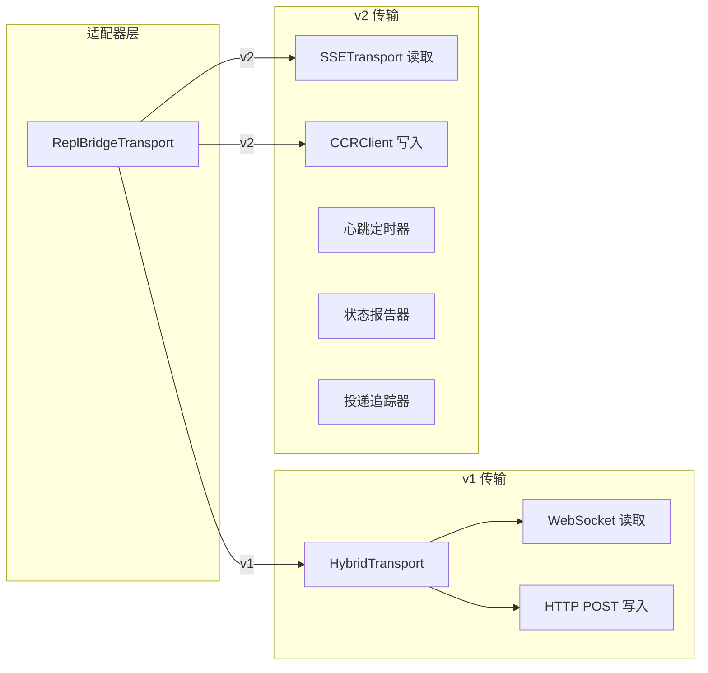
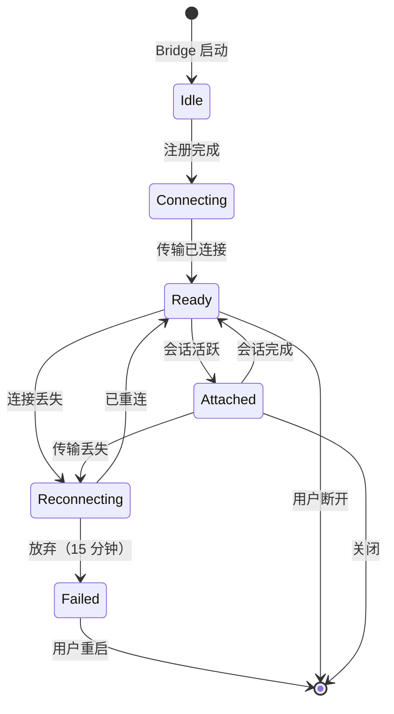
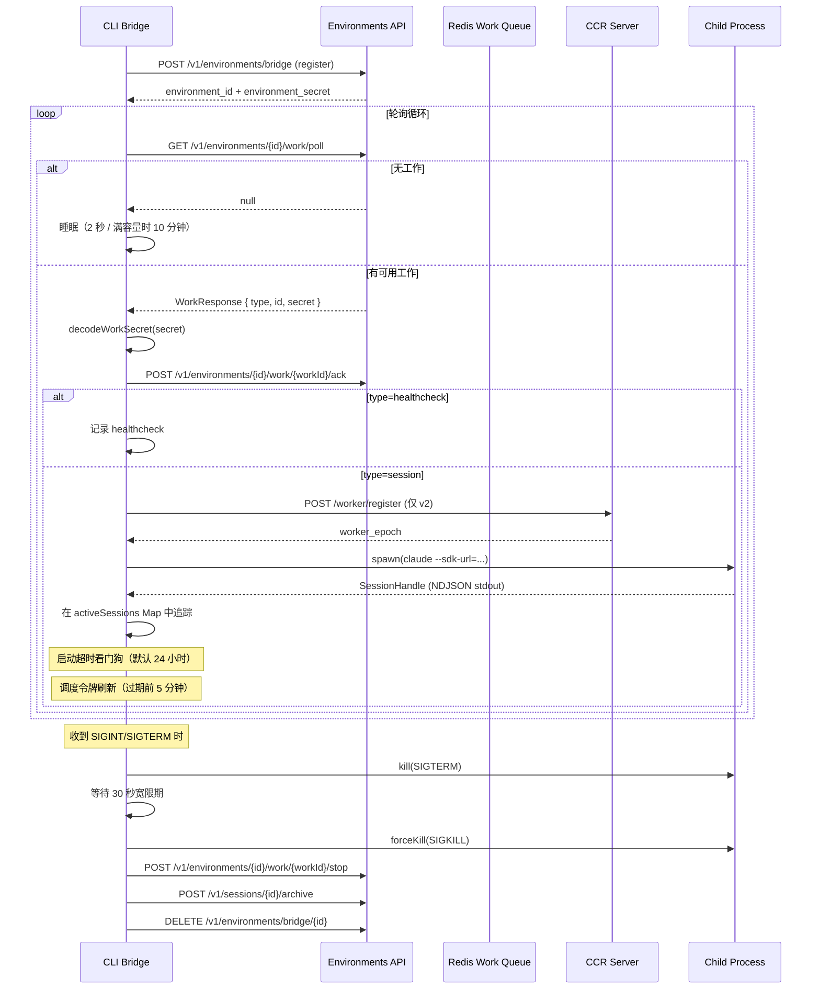
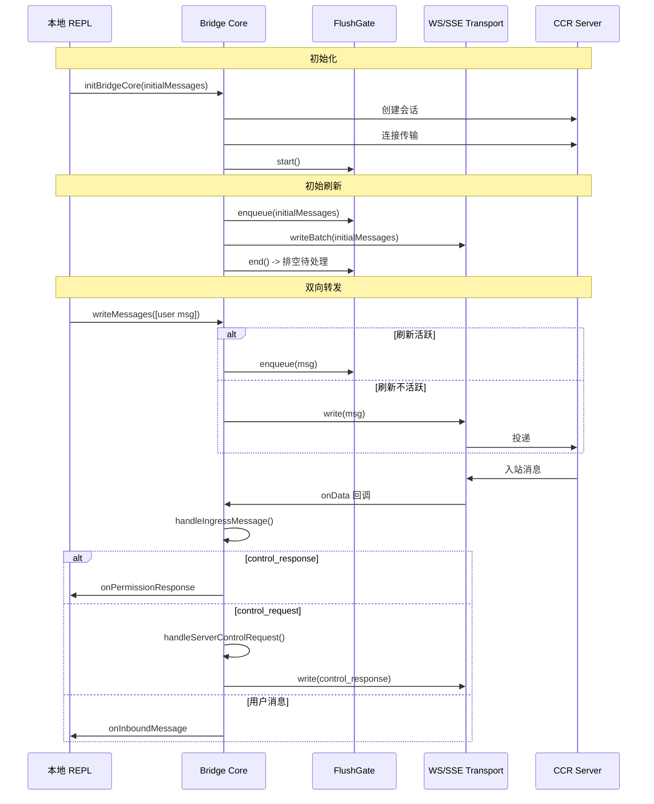

# Bridge 模块分析

## 1. 文件清单与职责

`bridge/` 目录包含 **32 个 TypeScript 文件**（总计约 560KB），实现了连接终端 REPL 和 Web UI 的核心桥接层，用于 Claude Code 的"远程控制"功能。该功能允许用户从 claude.ai/code 或 Claude 移动应用控制本地 CLI 会话。

### 按层级分类的文件

| 文件 | 大小 | 类别 | 职责 |
|------|------|------|------|
| **bridgeMain.ts** | 112.9KB | 独立 Bridge | `claude remote-control` CLI 命令的入口点。管理轮询循环、会话生成、容量管理和优雅关闭。 |
| **replBridge.ts** | 98.2KB | REPL Bridge | 核心 REPL 桥接实现。`initBridgeCore()` 处理环境注册、会话创建、WebSocket 接入、消息转发和传输生命周期。 |
| **remoteBridgeCore.ts** | 38.5KB | 无环境 Bridge (v2) | 直接会话接入桥接，无需 Environments API 层。使用 `/bridge` 端点进行 OAuth 到 worker-JWT 的交换。 |
| **initReplBridge.ts** | 23.3KB | REPL 引导 | REPL 特定的包装器，读取引导状态（cwd、会话 ID、git、OAuth），运行权限门控，然后委托给 `initBridgeCore`。 |
| **bridgeApi.ts** | 17.6KB | HTTP API 客户端 | Environments API 的 RESTful 客户端：注册、轮询、确认、停止、注销、归档、重连、心跳。 |
| **bridgeUI.ts** | 16.4KB | 终端 UI | 带 ANSI 转义码的 TUI 日志器、二维码生成、闪烁动画、多会话项目列表和状态状态机。 |
| **bridgeMessaging.ts** | 15.3KB | 消息协议 | 接入消息解析、控制请求/响应处理、通过 BoundedUUIDSet 进行回显去重、消息资格过滤。 |
| **replBridgeTransport.ts** | 15.2KB | 传输抽象 | v1/v2 传输适配器层。v1 使用 HybridTransport (WS+POST)，v2 使用 SSETransport+CCRClient。 |
| **createSession.ts** | 11.9KB | 会话 CRUD | 针对 Sessions API 的会话创建/获取/归档/标题更新，带组织范围头部。 |
| **types.ts** | 9.9KB | 类型定义 | 核心类型：BridgeConfig、BridgeApiClient、SessionHandle、WorkSecret、WorkResponse、SpawnMode。 |
| **jwtUtils.ts** | 9.2KB | JWT/令牌刷新 | 主动令牌刷新调度器，带基于生成号的失效机制、过期时间解码和后续刷新链。 |
| **bridgeEnabled.ts** | 8.2KB | 功能门控 | 权限检查（订阅、GrowthBook 门控）、版本检查、CCR 镜像模式、cse_ 兼容切换。 |
| **bridgePointer.ts** | 7.4KB | 崩溃恢复 | 用于崩溃后会话恢复的持久指针文件。支持 worktree 感知扇出读取，4 小时 TTL 陈旧性检查。 |
| **envLessBridgeConfig.ts** | 7.1KB | v2 配置 | 无环境桥接的 GrowthBook 支持的时序配置：重试、心跳、超时、抖动参数。 |
| **inboundAttachments.ts** | 6.1KB | 附件解析 | 从 web composer 下载 file_uuid 附件，写入 ~/.claude/uploads/，前置 @path 引用。 |
| **bridgeStatusUtil.ts** | 5.0KB | 状态工具 | URL 构建器、持续时间格式化、OSC8 超链接、闪烁段计算、状态派生。 |
| **pollConfig.ts** | 4.5KB | 轮询配置 | GrowthBook 支持的轮询间隔配置，带 Zod 验证、纵深防御下限、满容量活性保证。 |
| **workSecret.ts** | 4.6KB | 工作密钥 | 解码 base64url 工作密钥，构建 SDK URL（v1 WS / v2 HTTP），注册 worker，会话 ID 比较。 |
| **debugUtils.ts** | 4.1KB | 调试工具 | 密钥脱敏、错误描述、HTTP 状态提取、桥接跳过日志。 |
| **bridgeDebug.ts** | 4.8KB | 故障注入 | 仅内部使用的故障注入，用于测试恢复路径。包装 BridgeApiClient 注入致命/瞬态错误。 |
| **codeSessionApi.ts** | 4.7KB | CCR v2 API | createCodeSession 和 fetchRemoteCredentials (/bridge 端点) 的薄 HTTP 包装。 |
| **pollConfigDefaults.ts** | 3.9KB | 轮询默认值 | 默认轮询间隔常量和 PollIntervalConfig 类型。 |
| **inboundMessages.ts** | 2.7KB | 入站消息 | 提取入站消息字段，规范化图像块（camelCase mediaType -> snake_case）。 |
| **sessionIdCompat.ts** | 2.5KB | ID 兼容性 | cse_ <-> session_ 标签转换，用于 CCR v2 兼容层。 |
| **trustedDevice.ts** | 7.6KB | 可信设备 | 可信设备令牌注册和检索，用于提升认证（SecurityTier=ELEVATED）。 |
| **capacityWake.ts** | 1.8KB | 容量唤醒 | 用于满容量睡眠中断的共享唤醒原语。合并外部 abort signal 与容量唤醒控制器。 |
| **flushGate.ts** | 1.9KB | 刷新门控 | 状态机，用于在初始历史刷新期间门控消息写入，防止交错。 |
| **bridgePermissionCallbacks.ts** | 1.4KB | 权限回调 | 桥接和 web UI 之间权限请求/响应回调的类型定义。 |
| **bridgeConfig.ts** | 1.7KB | 认证/URL 配置 | 共享认证/URL 解析，带仅内部使用的开发覆盖（CLAUDE_BRIDGE_OAUTH_TOKEN、CLAUDE_BRIDGE_BASE_URL）。 |
| **replBridgeHandle.ts** | 1.4KB | 全局句柄 | 指向活跃 REPL 桥接句柄的全局单例指针，用于跨模块访问。 |
| **stub.ts** | 1.7KB | 空操作存根 | 当 BRIDGE_MODE 在构建时禁用时的空操作实现。 |

---

## 2. 架构概览

### 2.1 系统架构

```mermaid
graph TB
    subgraph "Web UI (claude.ai/code)"
        WebUI[Claude Web App]
        SessionPicker[Session Picker]
        EnvFilter[Env Filter by worker_type]
    end

    subgraph "后端 (Anthropic Cloud)"
        EnvironmentsAPI[Environments API]
        SessionsAPI[Sessions API]
        SessionIngress[Session Ingress WS/SSE]
        WorkQueue[Redis Work Queue]
        CCRServer[CCR Server]
    end

    subgraph "CLI 进程"
        subgraph "独立 Bridge (bridgeMain.ts)"
            PollLoop[Poll Loop]
            SessionSpawner[Session Spawner]
            ChildProcess[Child claude Process]
            TUI[TUILogger]
        end

        subgraph "REPL Bridge (replBridge.ts)"
            EnvBridge[Env-based Bridge Core]
            WSTransport[WebSocket Transport]
            MessageForward[Message Forwarder]
            FlushGate[Flush Gate]
        end

        subgraph "无环境 Bridge (remoteBridgeCore.ts)"
            DirectBridge[Direct Session Bridge]
            SSETransport[SSE Transport]
            CCRClient[CCR Client]
        end

        subgraph "共享基础设施"
            BridgeAPI[Bridge API Client]
            JWTRefresh[Token Refresh Scheduler]
            BridgePointer[Crash Recovery Pointer]
            TrustedDevice[Trusted Device Auth]
        end
    end

    WebUI -->|HTTP| EnvironmentsAPI
    WebUI -->|HTTP| SessionsAPI
    SessionPicker -->|Filter by worker_type| EnvFilter

    EnvironmentsAPI -->|pollForWork| WorkQueue
    EnvironmentsAPI -->|registerBridgeEnvironment| WorkQueue

    PollLoop -->|pollForWork| EnvironmentsAPI
    PollLoop -->|spawn| SessionSpawner
    SessionSpawner -->|spawn child| ChildProcess
    ChildProcess -->|WS/SSE| SessionIngress

    EnvBridge -->|register| EnvironmentsAPI
    EnvBridge -->|create session| SessionsAPI
    EnvBridge -->|WS connect| SessionIngress
    EnvBridge -->|forward messages| MessageForward

    DirectBridge -->|create session| SessionsAPI
    DirectBridge -->|/bridge| CCRServer
    DirectBridge -->|SSE connect| SessionIngress
    DirectBridge -->|write events| CCRClient

    BridgeAPI -->|REST calls| EnvironmentsAPI
    BridgeAPI -->|REST calls| SessionsAPI

    JWTRefresh -->|OAuth refresh| BridgeAPI
    TrustedDevice -->|X-Trusted-Device-Token| BridgeAPI
    BridgePointer -->|persist/restore| PollLoop
    BridgePointer -->|persist/restore| EnvBridge
```



### 2.2 两种 Bridge 模式

系统支持两种根本不同的桥接架构：

#### 模式 1：基于环境的 Bridge (v1 / 独立 + REPL)

```
CLI -> Environments API (register) -> Work Queue (poll) -> Session Ingress (WS)
```

- 使用 **Environments API** 作为工作分发层
- CLI 注册为"桥接环境"并轮询工作项
- 每个工作项包含带有 session_ingress_token 的 `WorkSecret`
- 通过 **WebSocket** 与 Session Ingress 通信
- 支持多会话模式（最多 32 个并发会话）
- 使用者：`claude remote-control` CLI 命令、REPL `/remote-control`

#### 模式 2：无环境 Bridge (v2 / 仅 REPL)

```
CLI -> Sessions API (create) -> /bridge endpoint (JWT) -> SSE + CCRClient
```

- **完全绕过 Environments API**
- 通过 `POST /v1/code/sessions/{id}/bridge` 进行直接的 OAuth 到 worker-JWT 交换
- 通过 **SSE**（读取）+ **CCRClient HTTP POST**（写入）通信
- 每次 `/bridge` 调用都会增加 `worker_epoch`（充当注册）
- 更简单，API 调用更少，无需轮询循环
- 由 `tengu_bridge_repl_v2` GrowthBook 标志门控

---

## 3. Bridge 协议设计

### 3.1 消息格式

桥接使用**基于 JSON 的鉴别联合**消息协议。所有消息都有一个 `type` 字段作为鉴别器：

```typescript
// SDK 消息（双向）
type SDKMessage =
  | { type: 'user'; message: ContentBlock[]; uuid: string }
  | { type: 'assistant'; message: { content: ContentBlock[] } }
  | { type: 'result'; subtype: 'success' | 'error'; ... }
  | { type: 'system'; subtype: 'local_command'; ... }

// 控制消息（服务器 <-> 客户端）
type SDKControlRequest = {
  type: 'control_request'
  request_id: string
  request: { subtype: 'initialize' | 'set_model' | 'interrupt' | 'set_permission_mode' | 'set_max_thinking_tokens' | 'can_use_tool'; ... }
}

type SDKControlResponse = {
  type: 'control_response'
  response: { subtype: 'success' | 'error'; request_id: string; ... }
}
```

### 3.2 传输层



**关键差异：**

| 方面 | v1 (HybridTransport) | v2 (SSE + CCRClient) |
|------|---------------------|---------------------|
| 读取通道 | WebSocket | SSE（Server-Sent Events） |
| 写入通道 | HTTP POST 到 Session Ingress | 通过 CCRClient 的 HTTP POST (/worker/*) |
| 认证 | OAuth 令牌 | JWT（session_ingress_token） |
| 序列号 | 未使用 | 带恢复功能的 SSE 序列号 |
| 状态报告 | 不支持 | PUT /worker 状态 |
| 投递追踪 | 不支持 | POST /worker/events/{id}/delivery |
| 心跳 | 不需要 | 20 秒间隔（60 秒 TTL 下 3 倍余量） |
| 纪元管理 | 不适用 | worker_epoch 用于一致性 |

### 3.3 状态机



**状态状态（bridgeUI.ts）：**
- `idle` - 无活跃会话，显示二维码和连接 URL
- `attached` - 会话已连接，显示"已连接"状态
- `titled` - 会话有用户分配的标题
- `reconnecting` - 连接丢失，指数退避重试
- `failed` - 不可恢复的错误

### 3.4 工作轮询协议（独立 Bridge）



### 3.5 消息流（REPL Bridge）



### 3.6 回显去重

桥接使用 **BoundedUUIDSet**（环形缓冲区）来防止消息回显：

```
recentPostedUUIDs  -> 过滤服务器回显的自身消息
recentInboundUUIDs -> 过滤传输交换后重新投递的消息
```

环形缓冲区具有可配置的容量（v2 默认 2000，v1 通过 hook 的 lastWrittenIndexRef 作为主要去重机制无限制）。

---

## 4. 安全机制

### 4.1 认证层级

```mermaid
graph TB
    subgraph "第 1 层：OAuth"
        OAuth[claude.ai OAuth 令牌]
        OAuthCheck[isClaudeAISubscriber]
        ProfileScope[hasProfileScope]
    end

    subgraph "第 2 层：环境密钥"
        EnvSecret[environment_secret]
        EnvSecretUse[用于 poll/ack/stop]
    end

    subgraph "第 3 层：Session Ingress JWT"
        JWT[session_ingress_token]
        JWTDecode[decodeJwtExpiry]
        JWTRefresh[主动刷新]
    end

    subgraph "第 4 层：可信设备"
        DeviceToken[X-Trusted-Device-Token]
        Enrollment[POST /auth/trusted_devices]
        Keychain[安全存储]
    end

    OAuth --> OAuthCheck
    OAuthCheck --> ProfileScope
    EnvSecret --> EnvSecretUse
    JWT --> JWTDecode
    JWTDecode --> JWTRefresh
    DeviceToken --> Enrollment
    Enrollment --> Keychain
```



### 4.2 JWT 令牌刷新调度器

`jwtUtils.ts` 中的 `createTokenRefreshScheduler` 实现了主动刷新机制：

```
时间线：
|-- JWT 签发 --|-- 5 分钟缓冲 --|-- JWT 过期 --|
                              ^
                         在此处触发刷新

后续：刷新后，30 分钟后再调度一次（FALLBACK_REFRESH_INTERVAL_MS）
最大失败次数：连续 3 次失败后放弃
生成计数器：防止过期的异步刷新设置孤立定时器
```

**关键设计决策：**
- 在过期前 5 分钟刷新（TOKEN_REFRESH_BUFFER_MS）
- 使用生成计数器使飞行中的异步刷新失效
- 当 JWT 过期时间未知时，回退到 30 分钟周期性刷新
- 基于 v2Sessions 分支：v1 将 OAuth 传递给子进程，v2 触发服务器重新分发

### 4.3 WorkSecret 协议

`WorkSecret` 是一个 base64url 编码的 JSON 负载，随每个工作项一起传递：

```json
{
  "version": 1,
  "session_ingress_token": "sk-ant-si-...",
  "api_base_url": "https://api.anthropic.com",
  "sources": [{ "type": "git_repository", "git_info": {...} }],
  "auth": [{ "type": "oauth", "token": "..." }],
  "use_code_sessions": true,
  "environment_variables": {...},
  "mcp_config": {...}
}
```

该令牌用于：
1. 确认工作（`acknowledgeWork`）
2. 认证 WebSocket/SSE 连接
3. 心跳检测活跃工作项
4. 发送权限响应

### 4.4 可信设备认证

对于提升的安全性（SecurityTier=ELEVATED），桥接支持可信设备令牌：

```
注册流程（在 /login 期间）：
  1. 检查 GrowthBook 门控：tengu_sessions_elevated_auth_enforcement
  2. POST /api/auth/trusted_devices（门控：账户 < 10 分钟）
  3. 将 device_token 存储在 macOS Keychain 中
  4. 记忆化令牌（在注册/注销时清除）

使用流程（每次 API 调用）：
  1. 检查 GrowthBook 门控（实时，非缓存）
  2. 从 keychain 读取记忆化的令牌
  3. 添加 X-Trusted-Device-Token 头部
```

### 4.5 ID 验证

所有服务器提供的 ID 在 URL 插值前都会针对 `SAFE_ID_PATTERN = /^[a-zA-Z0-9_-]+$/` 进行验证，以防止路径遍历攻击。

---

## 5. 远程 Bridge 与本地 Bridge

### 5.1 对比

| 维度 | 本地 Bridge（基于环境） | 远程 Bridge（无环境 v2） |
|------|----------------------|----------------------|
| **入口点** | `bridgeMain()` / `initBridgeCore()` | `initEnvLessBridgeCore()` |
| **API 层** | Environments API + Sessions API | 仅 Sessions API |
| **工作分发** | 基于轮询（拉取模型） | 直接连接（推送模型） |
| **传输** | v1: WS+POST, v2: SSE+CCR | 仅 v2: SSE+CCR |
| **认证流** | OAuth -> env_secret -> JWT | OAuth -> worker_JWT（通过 /bridge） |
| **会话生命周期** | 服务器分发工作 -> CLI 生成 | CLI 创建会话 -> 连接 |
| **多会话** | 是（最多 32 个，带 worktree） | 否（单会话） |
| **心跳** | 可选（基于轮询的活性） | 必需（20 秒，CCRClient） |
| **纪元管理** | 不适用 | worker_epoch（一致性） |
| **状态报告** | 不适用 | PUT /worker 状态 |
| **投递追踪** | 不适用 | POST /worker/events/{id}/delivery |
| **崩溃恢复** | bridge-pointer.json | 不适用（会话绑定到进程） |
| **GrowthBook 门控** | `tengu_ccr_bridge` | `tengu_bridge_repl_v2` |

### 5.2 数据流对比

**本地 Bridge（独立）：**
```
用户运行：claude remote-control
    |
    v
bridgeMain()
    |-- parseArgs()
    |-- 检查权限（OAuth、信任对话框）
    |-- registerBridgeEnvironment()
    |-- createBridgeSession()（可选预创建）
    |-- writeBridgePointer()（崩溃恢复）
    |-- runBridgeLoop()
         |-- pollForWork()  [每 2 秒]
         |-- decodeWorkSecret()
         |-- acknowledgeWork()
         |-- 生成子进程
         |-- 追踪活跃会话
         |-- heartbeatWork() [满容量时]
         |-- onSessionDone() -> 归档 + 停止工作
    |-- SIGINT/SIGTERM -> 优雅关闭
         |-- 杀死子进程（SIGTERM -> 30 秒 -> SIGKILL）
         |-- 停止所有活跃工作
         |-- archiveSession()
         |-- deregisterEnvironment()
         |-- clearBridgePointer()
```

**远程 Bridge（无环境 v2）：**
```
用户运行：/remote-control (REPL)
    |
    v
initReplBridge()
    |-- 检查权限（OAuth、策略、版本）
    |-- isEnvLessBridgeEnabled()?
         |-- 是 -> initEnvLessBridgeCore()
         |-- 否  -> initBridgeCore()

initEnvLessBridgeCore()
    |-- createCodeSession() [POST /v1/code/sessions]
    |-- fetchRemoteCredentials() [POST /bridge]
    |-- createV2ReplTransport(worker_jwt, worker_epoch)
    |-- createTokenRefreshScheduler()
    |-- 刷新初始消息
    |-- 连接 SSE + CCRClient
    |-- onStateChange 回调
    |-- 拆除 -> 归档会话
```

---

## 6. 核心设计模式

### 6.1 依赖注入

桥接广泛使用依赖注入来避免紧耦合并支持测试：

```typescript
// BridgeCoreParams - 所有依赖都是显式的
type BridgeCoreParams = {
  dir: string
  getAccessToken: () => string | undefined
  createSession: (opts: {...}) => Promise<string | null>
  archiveSession: (sessionId: string) => Promise<void>
  toSDKMessages?: (messages: Message[]) => SDKMessage[]
  onAuth401?: (staleAccessToken: string) => Promise<boolean>
  getPollIntervalConfig?: () => PollIntervalConfig
  // ... 更多回调
}
```

**理由：** REPL 导入 `sessionStorage.ts` 会传递性地引入约 1300 个模块（命令注册表 + React 树）。通过将这些作为回调注入，守护进程/SDK 路径可以在不膨胀包大小的情况下导入桥接核心。

### 6.2 适配器模式（传输）

`ReplBridgeTransport` 接口抽象了 v1 和 v2 传输实现：

```typescript
type ReplBridgeTransport = {
  write(message): Promise<void>
  writeBatch(messages): Promise<void>
  close(): void
  isConnectedStatus(): boolean
  setOnData(callback): void
  setOnClose(callback): void
  setOnConnect(callback): void
  connect(): void
  getLastSequenceNum(): number
  reportState(state): void        // 仅 v2，v1 空操作
  reportMetadata(metadata): void  // 仅 v2，v1 空操作
  reportDelivery(eventId, status): void // 仅 v2，v1 空操作
  flush(): Promise<void>          // 仅 v2，v1 立即解析
}
```

### 6.3 状态机（FlushGate）

`FlushGate<T>` 防止初始历史同步期间的消息交错：

```
start() -> enqueue() 返回 true（项目排队）
end()   -> 返回排队项目用于排空
drop()  -> 丢弃排队项目（永久关闭）
deactivate() -> 清除活跃标志而不丢弃（传输交换）
```

### 6.4 环形缓冲区（BoundedUUIDSet）

用于回显去重的 FIFO 有界集合，O(1) 添加/检查，O(capacity) 内存：

```typescript
class BoundedUUIDSet {
  private ring: (string | undefined)[]  // 循环缓冲区
  private set = new Set<string>()        // O(1) 查找
  private writeIdx = 0                   // 下一个写入位置

  add(uuid): void {
    // 驱逐最旧的，插入新的
    const evicted = this.ring[this.writeIdx]
    if (evicted) this.set.delete(evicted)
    this.ring[this.writeIdx] = uuid
    this.set.add(uuid)
    this.writeIdx = (this.writeIdx + 1) % capacity
  }
}
```

### 6.5 容量唤醒模式

`CapacityWake` 原语合并两个 abort signal（外部循环 + 容量变化）以实现高效的满容量睡眠：

```typescript
function createCapacityWake(outerSignal: AbortSignal): CapacityWake {
  let wakeController = new AbortController()

  return {
    wake(): void {
      wakeController.abort()     // 唤醒当前睡眠
      wakeController = new AbortController()  // 为下次睡眠准备
    },
    signal(): CapacitySignal {
      // 合并 outerSignal + wakeController 为一个 AbortSignal
      const merged = new AbortController()
      outerSignal.addEventListener('abort', () => merged.abort())
      wakeController.signal.addEventListener('abort', () => merged.abort())
      return { signal: merged.signal, cleanup: removeListeners }
    }
  }
}
```

### 6.6 带抖动的指数退避

连接错误和一般错误使用独立的退避轨道：

```
连接错误：2 秒 -> 4 秒 -> 8 秒 -> ... -> 120 秒上限 -> 10 分钟放弃
一般错误：  0.5 秒 -> 1 秒 -> 2 秒 -> ... -> 30 秒上限 -> 10 分钟放弃
抖动：+/- 25% 随机变化
```

### 6.7 会话 ID 兼容层

CCR v2 兼容层使用标记 ID：
- 基础设施层：`cse_{uuid}`（工作轮询、worker 端点）
- 面向客户端的兼容层：`session_{uuid}`（Sessions API、web UI）

```typescript
toCompatSessionId('cse_abc123')  // -> 'session_abc123'
toInfraSessionId('session_abc123') // -> 'cse_abc123'
sameSessionId('cse_abc123', 'session_abc123') // -> true
```

---

## 7. 轮询配置系统

轮询间隔由 GrowthBook 功能标志控制，允许运维团队在不更新客户端的情况下调整整个集群：

```typescript
type PollIntervalConfig = {
  poll_interval_ms_not_at_capacity: 2000,       // 主动寻找工作
  poll_interval_ms_at_capacity: 600_000,        // 10 分钟活性信号
  non_exclusive_heartbeat_interval_ms: 0,       // 默认禁用
  multisession_poll_interval_ms_not_at_capacity: 2000,
  multisession_poll_interval_ms_partial_capacity: 2000,
  multisession_poll_interval_ms_at_capacity: 600_000,
  reclaim_older_than_ms: 5000,                   // 回收陈旧工作
  session_keepalive_interval_v2_ms: 120_000,    // 2 分钟保活
}
```

**纵深防御：** Zod 模式验证在任何违规时拒绝整个配置对象（而不是部分信任），回退到默认值。最小下限（100 毫秒）防止误操作值导致紧密循环。

---

## 8. 崩溃恢复系统

`bridgePointer` 机制支持非正常关闭后的会话恢复：

```
写入：会话创建后 -> bridge-pointer.json
  { sessionId: "session_abc", environmentId: "env_xyz", source: "standalone"|"repl" }

读取：下次启动时 -> 检查 mtime 陈旧性（4 小时 TTL）
  - 新鲜：通过 --continue 提供恢复选项
  - 陈旧：删除并重新开始

支持 Worktree：readBridgePointerAcrossWorktrees()
  - 快速路径：检查当前目录（1 次 stat）
  - 扇出：git worktree 兄弟节点（并行 stat+读取，上限 50）
  - 选择最新的（最低 ageMs）
```

---

## 9. 关键观察

### 9.1 优势

1. **清晰的关注点分离**：无引导核心（`initBridgeCore`）与 REPL 特定包装器（`initReplBridge`）使守护进程/SDK 可以复用而不会膨胀包大小。

2. **健壮的错误处理**：双轨退避（连接 vs 一般）、睡眠检测、基于生成号的定时器失效以及全程的幂等操作。

3. **卓越的运维能力**：GrowthBook 控制的轮询间隔、用于测试恢复路径的故障注入、全面的分析事件。

4. **安全深度**：四层认证（OAuth、环境密钥、JWT、可信设备）、ID 验证、日志中的密钥脱敏。

### 9.2 复杂度热点

1. **bridgeMain.ts**（112KB）：独立桥接循环是最大的文件，将轮询逻辑、会话管理、容量控制、心跳、worktree 管理和关闭合并到单个函数中。

2. **replBridge.ts**（98KB）：REPL 桥接核心在一个模块中处理传输生命周期、消息转发、刷新门控、重连策略和永久模式。

3. **会话 ID 标记**：cse_/session_ 兼容层在多个文件中增加了复杂度（sessionIdCompat.ts、workSecret.ts、bridgeMain.ts、createSession.ts）。

### 9.3 演进路径

代码库展示了清晰的迁移路径：
- **v1**：基于环境、轮询驱动、WebSocket 传输
- **v2（无环境）**：直接会话创建、/bridge 端点、SSE+CCR 传输
- v2 路径完全消除了 Environments API 层，在通过功能标志保持向后兼容的同时简化了架构。
