# 04 - Components 模块分析

## 概述

`src/components/` 是 Claude Code 项目的核心 UI 层，基于 **Ink**（React for Terminal）框架构建。该模块包含 **389 个源文件**（`.tsx` / `.ts`），总计约 **82,000 行代码**，是项目中最大的前端模块。

## 1. 目录结构

```
src/components/
├── App.tsx                          # 应用根组件（业务层）
├── Messages.tsx                     # 消息列表容器（834 行）
├── Message.tsx                      # 单条消息渲染分发器
├── MessageRow.tsx                   # 消息行包装器
├── VirtualMessageList.tsx           # 虚拟滚动消息列表（1082 行）
├── FullscreenLayout.tsx             # 全屏布局容器
├── StatusLine.tsx                   # 状态栏
├── StatusNotices.tsx                # 状态通知
├── Stats.tsx                        # 统计信息面板（1228 行）
│
├── PromptInput/                     # 提示输入模块（14 个文件）
│   ├── PromptInput.tsx              # 主输入组件（2339 行 - 最大文件）
│   ├── PromptInputFooter.tsx        # 输入底部栏
│   ├── PromptInputFooterLeftSide.tsx
│   ├── PromptInputFooterSuggestions.tsx
│   ├── PromptInputHelpMenu.tsx
│   ├── PromptInputModeIndicator.tsx
│   ├── PromptInputQueuedCommands.tsx
│   ├── PromptInputStashNotice.tsx
│   ├── ShimmeredInput.tsx
│   ├── VoiceIndicator.tsx
│   ├── SandboxPromptFooterHint.tsx
│   ├── HistorySearchInput.tsx
│   ├── IssueFlagBanner.tsx
│   ├── Notifications.tsx
│   └── [hooks & utils]
│
├── messages/                        # 消息类型组件（30+ 文件）
│   ├── AssistantTextMessage.tsx
│   ├── AssistantThinkingMessage.tsx
│   ├── AssistantToolUseMessage.tsx
│   ├── AssistantRedactedThinkingMessage.tsx
│   ├── UserTextMessage.tsx
│   ├── UserPromptMessage.tsx
│   ├── UserImageMessage.tsx
│   ├── UserToolResultMessage/       # 工具结果消息
│   ├── UserBashInputMessage.tsx
│   ├── UserBashOutputMessage.tsx
│   ├── UserCommandMessage.tsx
│   ├── UserPlanMessage.tsx
│   ├── UserMemoryInputMessage.tsx
│   ├── UserTeammateMessage.tsx
│   ├── SystemTextMessage.tsx
│   ├── CompactBoundaryMessage.tsx
│   ├── GroupedToolUseContent.tsx
│   ├── CollapsedReadSearchContent.tsx
│   ├── HookProgressMessage.tsx
│   ├── PlanApprovalMessage.tsx
│   ├── RateLimitMessage.tsx
│   ├── ShutdownMessage.tsx
│   ├── TaskAssignmentMessage.tsx
│   ├── AdvisorMessage.tsx
│   └── ...
│
├── design-system/                   # 设计系统（16 个文件）
│   ├── Box.tsx (via ThemedBox)      # 主题感知容器
│   ├── Text.tsx (via ThemedText)    # 主题感知文本
│   ├── Dialog.tsx                   # 对话框基础组件
│   ├── Pane.tsx                     # 面板容器
│   ├── Divider.tsx                  # 分隔线
│   ├── ProgressBar.tsx              # 进度条
│   ├── Tabs.tsx                     # 标签页
│   ├── ListItem.tsx                 # 列表项
│   ├── KeyboardShortcutHint.tsx     # 快捷键提示
│   ├── StatusIcon.tsx               # 状态图标
│   ├── LoadingState.tsx             # 加载状态
│   ├── FuzzyPicker.tsx              # 模糊选择器
│   ├── Byline.tsx                   # 副标题行
│   ├── Ratchet.tsx                  # 棘轮组件
│   ├── ThemeProvider.tsx            # 主题提供者
│   ├── ThemedBox.tsx                # 主题 Box
│   ├── ThemedText.tsx               # 主题 Text
│   └── color.ts                     # 颜色工具
│
├── permissions/                     # 权限请求组件（15+ 子目录）
│   ├── PermissionRequest.tsx        # 权限请求分发器
│   ├── FileEditPermissionRequest/
│   ├── FileWritePermissionRequest/
│   ├── BashPermissionRequest/
│   ├── FilesystemPermissionRequest/
│   ├── WebFetchPermissionRequest/
│   ├── NotebookEditPermissionRequest/
│   ├── SedEditPermissionRequest/
│   ├── PowerShellPermissionRequest/
│   ├── ComputerUseApproval/
│   ├── SkillPermissionRequest/
│   ├── AskUserQuestionPermissionRequest/
│   ├── EnterPlanModePermissionRequest/
│   ├── ExitPlanModePermissionRequest/
│   ├── FilePermissionDialog/
│   ├── WorkerPendingPermission.tsx
│   ├── SandboxPermissionRequest.tsx
│   └── rules/                       # 权限规则
│
├── Spinner/                         # 加载动画模块（12 个文件）
│   ├── index.ts
│   ├── SpinnerGlyph.tsx
│   ├── FlashingChar.tsx
│   ├── ShimmerChar.tsx
│   ├── GlimmerMessage.tsx
│   ├── SpinnerAnimationRow.tsx
│   ├── TeammateSpinnerLine.tsx
│   ├── TeammateSpinnerTree.tsx
│   ├── useShimmerAnimation.ts
│   ├── useStalledAnimation.ts
│   └── utils.ts
│
├── agents/                          # Agent 管理模块（20+ 文件）
│   ├── AgentsList.tsx
│   ├── AgentsMenu.tsx               # Agent 菜单（800 行）
│   ├── AgentDetail.tsx
│   ├── AgentEditor.tsx
│   ├── AgentNavigationFooter.tsx
│   ├── ModelSelector.tsx
│   ├── ToolSelector.tsx
│   ├── ColorPicker.tsx
│   ├── new-agent-creation/          # 新建 Agent 向导
│   │   ├── CreateAgentWizard.tsx
│   │   └── wizard-steps/            # 10 个向导步骤
│   └── [utils & types]
│
├── mcp/                             # MCP 服务器管理（12 个文件）
│   ├── MCPSettings.tsx
│   ├── MCPListPanel.tsx
│   ├── MCPToolDetailView.tsx
│   ├── MCPToolListView.tsx
│   ├── ElicitationDialog.tsx        # 诱导对话框（1169 行）
│   ├── MCPRemoteServerMenu.tsx      # 远程服务器菜单（649 行）
│   ├── MCPAgentServerMenu.tsx
│   ├── MCPStdioServerMenu.tsx
│   ├── MCPRemoteServerMenu.tsx
│   ├── MCPReconnect.tsx
│   ├── CapabilitiesSection.tsx
│   └── McpParsingWarnings.tsx
│
├── Settings/                        # 设置模块
│   ├── Settings.tsx
│   ├── Config.tsx                   # 配置面板（1822 行）
│   ├── Status.tsx
│   └── Usage.tsx
│
├── FeedbackSurvey/                  # 反馈调查（8 个文件）
│   ├── FeedbackSurvey.tsx
│   ├── FeedbackSurveyView.tsx
│   ├── TranscriptSharePrompt.tsx
│   ├── useFeedbackSurvey.tsx
│   ├── useMemorySurvey.tsx
│   ├── usePostCompactSurvey.tsx
│   ├── useSurveyState.tsx
│   └── useDebouncedDigitInput.ts
│
├── CustomSelect/                    # 自定义选择器（9 个文件）
│   ├── select.tsx                   # 核心选择器（690 行）
│   ├── SelectMulti.tsx
│   ├── use-select-state.ts
│   ├── use-multi-select-state.ts
│   ├── use-select-input.ts
│   ├── use-select-navigation.ts     # 导航逻辑（654 行）
│   └── ...
│
├── LogoV2/                          # Logo 和欢迎界面（12 个文件）
│   ├── LogoV2.tsx
│   ├── WelcomeV2.tsx
│   ├── CondensedLogo.tsx
│   ├── AnimatedAsterisk.tsx
│   ├── AnimatedClawd.tsx
│   ├── Clawd.tsx
│   ├── Feed.tsx
│   ├── FeedColumn.tsx
│   ├── feedConfigs.tsx
│   ├── ChannelsNotice.tsx
│   ├── GuestPassesUpsell.tsx
│   ├── OverageCreditUpsell.tsx
│   ├── Opus1mMergeNotice.tsx
│   └── VoiceModeNotice.tsx
│
├── HelpV2/                          # 帮助系统
│   ├── HelpV2.tsx
│   ├── Commands.tsx
│   └── General.tsx
│
├── HighlightedCode/                 # 代码高亮
│   ├── Fallback.tsx
│   └── ...
│
├── StructuredDiff/                  # 结构化 Diff
│   ├── colorDiff.ts
│   ├── Fallback.tsx
│   └── ...
│
├── diff/                            # Diff 对话框
│   ├── DiffDialog.tsx
│   ├── DiffDetailView.tsx
│   └── DiffFileList.tsx
│
├── tasks/                           # 任务管理
│   ├── BackgroundTasksDialog.tsx    # 后台任务对话框（652 行）
│   ├── RemoteSessionDetailDialog.tsx
│   └── ...
│
├── teams/                           # 团队管理
│   └── TeamsDialog.tsx              # 团队对话框（715 行）
│
├── hooks/                           # Hooks 配置
│   ├── HooksConfigMenu.tsx
│   ├── PromptDialog.tsx
│   ├── SelectEventMode.tsx
│   ├── SelectHookMode.tsx
│   ├── SelectMatcherMode.tsx
│   └── ViewHookMode.tsx
│
├── memory/                          # 记忆管理
│   ├── MemoryFileSelector.tsx
│   └── MemoryUpdateNotification.tsx
│
├── sandbox/                         # 沙盒
├── shell/                           # Shell 输出
├── skills/                          # 技能
├── ui/                              # 通用 UI
├── wizard/                          # 向导
├── grove/                           # Grove
├── Passes/                          # Passes
├── TrustDialog/                     # 信任对话框
├── ManagedSettingsSecurityDialog/   # 托管设置安全
│
├── [独立对话框组件]
│   ├── AutoModeOptInDialog.tsx
│   ├── BridgeDialog.tsx
│   ├── BypassPermissionsModeDialog.tsx
│   ├── ChannelDowngradeDialog.tsx
│   ├── CostThresholdDialog.tsx
│   ├── DevChannelsDialog.tsx
│   ├── ExportDialog.tsx
│   ├── GlobalSearchDialog.tsx
│   ├── HistorySearchDialog.tsx
│   ├── IdeAutoConnectDialog.tsx
│   ├── IdeOnboardingDialog.tsx
│   ├── IdleReturnDialog.tsx
│   ├── InvalidConfigDialog.tsx
│   ├── InvalidSettingsDialog.tsx
│   ├── MCPServerApprovalDialog.tsx
│   ├── MCPServerDesktopImportDialog.tsx
│   ├── MCPServerMultiselectDialog.tsx
│   ├── QuickOpenDialog.tsx
│   ├── RemoteEnvironmentDialog.tsx
│   ├── TeleportRepoMismatchDialog.tsx
│   ├── WorkflowMultiselectDialog.tsx
│   ├── WorktreeExitDialog.tsx
│   ├── ClaudeMdExternalIncludesDialog.tsx
│   └── SandboxViolationExpandedView.tsx
│
├── [工具展示组件]
│   ├── FileEditToolDiff.tsx
│   ├── FileEditToolUpdatedMessage.tsx
│   ├── FileEditToolUseRejectedMessage.tsx
│   ├── NotebookEditToolUseRejectedMessage.tsx
│   ├── ToolUseLoader.tsx
│   ├── FallbackToolUseErrorMessage.tsx
│   └── FallbackToolUseRejectedMessage.tsx
│
├── [状态展示组件]
│   ├── CoordinatorAgentStatus.tsx
│   ├── EffortIndicator.ts
│   ├── FastIcon.tsx
│   ├── MemoryUsageIndicator.tsx
│   ├── PrBadge.tsx
│   ├── TokenWarning.tsx
│   ├── IdeStatusIndicator.tsx
│   ├── AwsAuthStatusBox.tsx
│   └── RemoteCallout.tsx
│
├── [输入组件]
│   ├── TextInput.tsx
│   ├── VimTextInput.tsx
│   ├── BaseTextInput.tsx
│   ├── SearchBox.tsx
│   └── LogSelector.tsx              # 日志选择器（1575 行）
│
├── [自动模式组件]
│   ├── AutoUpdater.tsx
│   ├── AutoUpdaterWrapper.tsx
│   ├── NativeAutoUpdater.tsx
│   └── PackageManagerAutoUpdater.tsx
│
├── [桥接组件]
│   ├── BridgeDialog.tsx
│   └── DesktopHandoff.tsx
│
├── [其他独立组件]
│   ├── Markdown.tsx
│   ├── MarkdownTable.tsx
│   ├── CompactSummary.tsx
│   ├── ContextVisualization.tsx
│   ├── ContextSuggestions.tsx
│   ├── DiagnosticsDisplay.tsx
│   ├── ExitFlow.tsx
│   ├── Feedback.tsx
│   ├── FilePathLink.tsx
│   ├── ClickableImageRef.tsx
│   ├── ConfigurableShortcutHint.tsx
│   ├── ConsoleOAuthFlow.tsx
│   ├── CtrlOToExpand.tsx
│   ├── InterruptedByUser.tsx
│   ├── KeybindingWarnings.tsx
│   ├── LanguagePicker.tsx
│   ├── ModelPicker.tsx
│   ├── OutputStylePicker.tsx
│   ├── PressEnterToContinue.tsx
│   ├── ResumeTask.tsx
│   ├── ScrollKeybindingHandler.tsx  # 滚动键盘处理（1012 行）
│   ├── SentryErrorBoundary.ts
│   ├── SessionBackgroundHint.tsx
│   ├── SessionPreview.tsx
│   ├── ShowInIDEPrompt.tsx
│   ├── SkillImprovementSurvey.tsx
│   ├── TagTabs.tsx
│   ├── TaskListV2.tsx
│   ├── TeammateViewHeader.tsx
│   ├── TeleportError.tsx
│   ├── TeleportProgress.tsx
│   ├── TeleportResumeWrapper.tsx
│   ├── TeleportStash.tsx
│   ├── ThemePicker.tsx
│   ├── ThinkingToggle.tsx
│   ├── ValidationErrorsList.tsx
│   ├── OffscreenFreeze.tsx
│   ├── AgentProgressLine.tsx
│   ├── ApproveApiKey.tsx
│   ├── BashModeProgress.tsx
│   ├── ClaudeInChromeOnboarding.tsx
│   ├── DevBar.tsx
│   ├── EffortCallout.tsx
│   ├── messageActions.tsx
│   └── MessageSelector.tsx          # 消息选择器（831 行）
│
└── LspRecommendation/               # LSP 推荐
    └── LspRecommendationMenu.tsx
```

## 2. 应用根组件架构

### 2.1 业务层 App.tsx

```
src/components/App.tsx
```

这是业务层的根组件，职责是提供全局 Context Provider 链：

```
FpsMetricsProvider (FPS 性能指标)
  └── StatsProvider (统计数据存储)
        └── AppStateProvider (应用状态管理)
              └── {children} (由 REPL.tsx 传入的实际 UI)
```

关键特征：
- 使用 **React Compiler**（`import { c as _c } from "react/compiler-runtime"`）自动优化渲染
- 通过 `onChangeAppState` 回调实现状态变更通知
- 接收 `initialState: AppState` 作为初始状态注入

### 2.2 Ink 层 App.tsx

```
src/ink/components/App.tsx (658 行)
```

这是 Ink 框架的底层根组件，负责：

- **终端 I/O 管理**：stdin/stdout/stderr 流处理
- **原始模式管理**：raw mode 计数引用，支持多组件共享
- **按键解析**：状态机解析按键序列（含 Kitty 键盘协议）
- **鼠标追踪**：SGR 鼠标事件处理，支持双击/三击/拖拽
- **终端查询/响应**：XTVERSION 查询终端身份
- **挂起/恢复**：SIGSTOP/SIGCONT 处理
- **错误边界**：`getDerivedStateFromError` + `componentDidCatch`
- **光标管理**：隐藏/显示终端光标
- **焦点管理**：DECSET 1004 终端焦点报告

提供的 Context 链：
```
TerminalSizeContext (终端尺寸)
  └── AppContext (exit 方法)
        └── StdinContext (stdin, setRawMode, eventEmitter, querier)
              └── TerminalFocusProvider (焦点状态)
                    └── ClockProvider (时钟/动画)
                          └── CursorDeclarationContext (光标声明)
                                └── ErrorOverview | children
```

## 3. 组件分类详解

### 3.1 对话框组件（*Dialog.tsx）

共 **25+ 个对话框组件**，全部基于设计系统的 `Dialog.tsx` 基础组件构建。

**设计系统 Dialog 核心接口**：
```typescript
type DialogProps = {
  title: React.ReactNode;
  subtitle?: React.ReactNode;
  children: React.ReactNode;
  onCancel: () => void;
  color?: keyof Theme;
  hideInputGuide?: boolean;
  hideBorder?: boolean;
  inputGuide?: (exitState: ExitState) => React.ReactNode;
  isCancelActive?: boolean;
};
```

**Dialog 组件的关键设计**：
- 内置 Ctrl+C/D 退出处理（`useExitOnCtrlCDWithKeybindings`）
- 内置 Esc/n 取消键绑定（`useKeybinding("confirm:no", onCancel)`）
- 使用 `Pane` 组件绘制边框
- 底部输入指南区域（可自定义）

**对话框分类**：

| 类别 | 组件 | 用途 |
|------|------|------|
| 权限 | FilePermissionDialog, MCPServerApprovalDialog | 用户授权确认 |
| 设置 | InvalidConfigDialog, InvalidSettingsDialog, DevChannelsDialog | 配置错误提示 |
| 搜索 | GlobalSearchDialog, HistorySearchDialog, QuickOpenDialog | 搜索与导航 |
| 功能 | BridgeDialog, ExportDialog, WorkflowMultiselectDialog | 功能操作 |
| 模式 | AutoModeOptInDialog, BypassPermissionsModeDialog | 模式切换确认 |
| 会话 | IdleReturnDialog, WorktreeExitDialog, TeleportRepoMismatchDialog | 会话管理 |
| 团队 | TeamsDialog, BackgroundTasksDialog | 团队与任务 |
| MCP | ElicitationDialog, MCPServerMultiselectDialog | MCP 服务器管理 |
| 安全 | ManagedSettingsSecurityDialog, CostThresholdDialog | 安全与成本 |

### 3.2 工具展示组件

**FileEditToolDiff.tsx** - 文件编辑差异展示
- 使用 `StructuredDiff` 组件渲染 diff
- 支持 IDE 集成 diff 查看

**ToolUseLoader.tsx** - 工具调用加载状态
- 显示工具执行中的动画

**FileEditToolUpdatedMessage / FileEditToolUseRejectedMessage** - 工具结果消息
- 展示工具执行成功/失败状态

### 3.3 消息组件（messages/ 目录）

这是最庞大的组件族，共 **30+ 个文件**，处理所有消息类型的渲染。

**消息渲染管道**：
```
Messages.tsx (容器)
  └── VirtualMessageList.tsx (虚拟滚动) 或 flatMap
        └── MessageRow.tsx (行包装)
              └── Message.tsx (类型分发器)
                    ├── attachment → AttachmentMessage
                    ├── assistant
                    │     ├── text → AssistantTextMessage
                    │     ├── tool_use → AssistantToolUseMessage
                    │     ├── thinking → AssistantThinkingMessage
                    │     ├── redacted_thinking → AssistantRedactedThinkingMessage
                    │     └── advisor_tool_result → AdvisorMessage
                    ├── user
                    │     ├── text → UserTextMessage
                    │     ├── image → UserImageMessage
                    │     └── tool_result → UserToolResultMessage
                    ├── system → SystemTextMessage
                    ├── grouped_tool_use → GroupedToolUseContent
                    └── collapsed_read_search → CollapsedReadSearchContent
```

**Messages.tsx 核心特性**：
- **消息规范化**：`normalizeMessages()` 统一消息格式
- **消息分组**：`applyGrouping()` 合并相关工具调用
- **消息折叠**：`collapseHookSummaries()`, `collapseReadSearchGroups()`, `collapseBackgroundBashNotifications()`
- **渲染上限**：非虚拟模式下最多渲染 200 条消息（`MAX_MESSAGES_WITHOUT_VIRTUALIZATION`）
- **UUID 锚点切片**：使用 UUID 而非索引进行切片，避免压缩/重组时的滚动偏移
- **自定义 memo 比较器**：精细控制 streamingToolUses、inProgressToolUseIDs 等高频变化 props 的重渲染
- **Brief 模式过滤**：`filterForBriefTool()` 仅显示 Brief 工具输出

**Message.tsx 优化策略**：
- 自定义 `areMessagePropsEqual` 比较器
- 仅当消息 UUID、thinking 可见性、verbose 状态、bash 输出状态变化时才重渲染
- 静态消息标记（`shouldRenderStatically`）避免不必要的更新

### 3.4 布局组件

**FullscreenLayout.tsx** - 全屏模式布局
- 滚动区域（scrollable）+ 底部固定区域（bottom）
- 支持模态对话框覆盖层（modal）
- 支持浮动元素（bottomFloat）
- 支持覆盖层内容（overlay，用于权限请求）
- "N 条新消息" 药丸提示（pill）
- 粘性提示头（sticky prompt header）
- `ScrollChromeContext` 提供滚动派生状态

**关键 Hooks**：
- `useUnseenDivider`：追踪未读消息分割线位置
- `countUnseenAssistantTurns`：计算未读助手回复数

### 3.5 状态展示组件

| 组件 | 功能 |
|------|------|
| `CoordinatorAgentStatus.tsx` | 协调器 Agent 状态 |
| `EffortIndicator.ts` | 努力程度指标 |
| `FastIcon.tsx` | Fast 模式图标 |
| `MemoryUsageIndicator.tsx` | 内存使用 |
| `PrBadge.tsx` | PR 徽章 |
| `TokenWarning.tsx` | Token 警告 |
| `IdeStatusIndicator.tsx` | IDE 连接状态 |
| `StatusLine.tsx` | 状态栏（模型、权限模式、上下文窗口、成本） |
| `StatusNotices.tsx` | 状态通知聚合 |

**StatusLine** 的特殊设计：
- 通过 hooks 向外部命令提供上下文数据（`buildStatusLineCommandInput`）
- 包含模型信息、工作目录、成本、上下文窗口使用率、速率限制等
- 支持 `statusLine` 设置项控制显示

### 3.6 输入组件

**PromptInput.tsx（2339 行）** - 整个项目中最大的组件

职责极其丰富：
- 文本输入与光标管理
- 命令模式检测（`!` bash, `?` help, `/` slash commands）
- 图片粘贴与引用管理（`[Image #N]` pill）
- 文本粘贴处理（长文本折叠为引用）
- 快捷键绑定（undo, newline, external editor, stash, model picker, cycle mode）
- Footer pill 导航（tasks, tmux, teams, bridge, companion）
- 自动模式 opt-in 对话框
- 输入建议（typeahead）
- 推测执行（speculation）接受
- 历史搜索集成
- 团队成员 @提及高亮
- 关键词触发高亮（ultrathink, ultraplan, ultrareview, /buddy, /command, token budget）
- 多行输入与点击定位光标
- Vim 模式支持

**TextInput.tsx** - 文本输入渲染
- 光标闪烁动画
- 语音模式波形光标
- 文本高亮渲染（关键词、@提及、图片引用）
- 辅助功能支持

**BaseTextInput.tsx** - 基础输入逻辑
- 光标移动
- 文本编辑
- 选择处理

**VimTextInput.tsx** - Vim 模式输入

### 3.7 设置组件

**Settings/Config.tsx（1822 行）** - 设置配置面板
- 模型选择
- 权限模式配置
- 输出样式
- MCP 服务器管理
- 主题设置
- 各种功能开关

### 3.8 反馈组件

**FeedbackSurvey/** - 用户反馈调查
- `FeedbackSurvey.tsx` - 调查主组件
- `FeedbackSurveyView.tsx` - 调查视图
- `TranscriptSharePrompt.tsx` - 转录分享提示
- `useFeedbackSurvey.tsx` - 调查状态管理
- `useMemorySurvey.tsx` - 记忆调查
- `usePostCompactSurvey.tsx` - 压缩后调查
- `useDebouncedDigitInput.ts` - 防抖数字输入

### 3.9 插件组件

**LspRecommendation/LspRecommendationMenu.tsx** - LSP 插件推荐
**ClaudeCodeHint/PluginHintMenu.tsx** - Claude Code 插件提示

### 3.10 自动模式组件

- `AutoUpdater.tsx` - 自动更新逻辑
- `AutoUpdaterWrapper.tsx` - 更新器包装
- `NativeAutoUpdater.tsx` - 原生更新
- `PackageManagerAutoUpdater.tsx` - 包管理器更新

### 3.11 桥接组件

- `BridgeDialog.tsx` - REPL 桥接对话框
- `DesktopHandoff.tsx` - 桌面交接

## 4. Ink 框架使用方式

### 4.1 核心原语

项目从 `src/ink.ts` 导出 Ink 原语，并做了主题封装：

```typescript
// 导出的核心原语
export { default as Box } from './components/design-system/ThemedBox.js'    // 主题化 Box
export { default as Text } from './components/design-system/ThemedText.js'  // 主题化 Text
export { Ansi } from './ink/Ansi.js'                                         // 原始 ANSI 渲染
export { RawAnsi } from './ink/components/RawAnsi.js'                       // 原始 ANSI（无处理）
export { default as Spacer } from './ink/components/Spacer.js'              // 空白占位
export { default as Newline } from './ink/components/Newline.js'            // 换行
export { default as Button } from './ink/components/Button.js'              // 按钮
export { default as Link } from './ink/components/Link.js'                  // 链接
export { NoSelect } from './ink/components/NoSelect.js'                     // 不可选择区域
```

### 4.2 Box 组件（布局核心）

`ThemedBox.tsx` 是对 Ink 原始 Box 的主题封装：

```typescript
// 支持主题颜色键
type ThemedColorProps = {
  borderColor?: keyof Theme | Color;
  borderTopColor?: keyof Theme | Color;
  borderBottomColor?: keyof Theme | Color;
  borderLeftColor?: keyof Theme | Color;
  borderRightColor?: keyof Theme | Color;
  backgroundColor?: keyof Theme | Color;
};
```

- 自动将主题键（如 `"permission"`, `"text"`, `"warning"`）解析为实际 ANSI 颜色
- 支持原始颜色格式（`rgb()`, `#`, `ansi256()`, `ansi:`）
- 支持所有 Ink 样式属性（flexDirection, flexGrow, padding, margin 等）
- 支持事件处理（onClick, onFocus, onBlur, onKeyDown, onMouseEnter/Leave）

### 4.3 Text 组件（ThemedText）

与 ThemedBox 类似，支持主题颜色的文本渲染。

### 4.4 useInput Hook

```typescript
import { useInput } from '../ink.js';
```

用于捕获键盘输入，是终端交互的核心：

```typescript
useInput((char, key) => {
  // char: 字符
  // key: { escape, ctrl, meta, shift, return, backspace, delete, ... }
});
```

**使用模式**：
- PromptInput 中用于 Esc 处理、模式切换
- ScrollKeybindingHandler 中用于 j/k/PgUp/PgDn 滚动
- Dialog 中用于确认/取消
- 全局快捷键注册

### 4.5 其他关键 Hooks

| Hook | 用途 |
|------|------|
| `useStdin` | 访问 stdin 上下文 |
| `useTerminalFocus` | 终端焦点状态 |
| `useTerminalSize` | 终端行列数 |
| `useTerminalViewport` | 视口信息 |
| `useTerminalTitle` | 设置终端标题 |
| `useAnimationFrame` | 动画帧回调 |
| `useInterval` | 定时器 |
| `useTheme` | 当前主题 |
| `useApp` | 应用上下文 |
| `useSelection` | 文本选择 |
| `useTabStatus` | 标签页状态 |
| `measureElement` | 测量元素尺寸 |

### 4.6 终端渲染特殊处理

**ANSI 处理**：
- `Ansi` 组件：解析并渲染 ANSI 转义序列
- `RawAnsi` 组件：直接输出 ANSI，不处理
- `strip-ansi` 库用于清理文本中的 ANSI 码

**布局策略**：
- 使用 `flexDirection="column"` / `"row"` 进行 Flexbox 布局
- 使用 `flexGrow`, `flexShrink` 控制空间分配
- 使用 `width`, `minWidth`, `maxWidth` 控制宽度
- 使用 `padding`, `margin` 控制间距
- 使用 `gap` 控制子元素间距

**滚动处理**：
- `ScrollBox.tsx`（Ink 内部）：自定义滚动容器
- `VirtualMessageList.tsx`：虚拟滚动，仅渲染可见区域的消息
- `useVirtualScroll` Hook：虚拟滚动核心逻辑
- 高度缓存：按消息 UUID 缓存渲染高度，避免重复测量

**性能优化**：
- React Compiler 自动 memo 化
- 自定义 `React.memo` 比较器（Messages, Message）
- `useMemo` 缓存昂贵计算（消息规范化、分组、折叠）
- `useRef` 避免不必要的重渲染
- `OffscreenFreeze` 组件：冻结离屏内容
- 渲染上限（200 条消息 cap）
- UUID 锚点切片（避免索引偏移）

## 5. 组件间数据流和状态管理

### 5.1 状态管理架构

```
AppState (Zustand-like 模式)
  ├── tasks: 任务状态
  ├── toolPermissionContext: 权限模式
  ├── footerSelection: 底部栏选择
  ├── viewingAgentTaskId: 查看的 Agent 任务
  ├── promptSuggestion: 输入建议
  ├── speculation: 推测执行
  ├── thinkingEnabled: 思考模式
  ├── fastMode: 快速模式
  ├── effortValue: 努力程度
  ├── mainLoopModel: 主循环模型
  ├── coordinatorTaskIndex: 协调器任务索引
  └── ...

GlobalConfig (本地 JSON 文件)
  ├── theme: 主题设置
  ├── terminalProgressBarEnabled
  ├── hasUsedStash
  ├── hasSeenTasksHint
  └── ...

Settings (CLAUDE.md / 配置文件)
  ├── statusLine
  ├── outputStyle
  ├── prefersReducedMotion
  └── ...
```

### 5.2 数据流图

```
                    REPL.tsx (屏幕控制器)
                         │
           ┌─────────────┼─────────────┐
           │             │             │
     AppState      Messages      PromptInput
           │             │             │
           │      ┌──────┴──────┐      │
           │      │             │      │
           │  VirtualList   MessageRow │
           │      │             │      │
           │      │         Message.tsx│
           │      │             │      │
           │      │    ┌────────┼────┐ │
           │      │    │        │    │ │
           │      │  User   Assistant  │
           │      │  Text    ToolUse   │
           │      │  Image   Thinking  │
           │      │  ToolRes Text     │
           │      │                   │
     Permissions ◄──┘             Submit
           │                          │
           └────────── Query ─────────┘
```

### 5.3 关键数据流

1. **消息流**：
   ```
   API Response → handleMessageFromStream() → messages[] → Messages.tsx
     → normalizeMessages() → reorderMessagesInUI() → applyGrouping()
     → collapse*() → buildMessageLookups() → renderableMessages[]
     → VirtualMessageList / flatMap → MessageRow → Message → 具体消息组件
   ```

2. **输入流**：
   ```
   用户按键 → useInput → PromptInput onChange
     → 模式检测 → 建议匹配 → onSubmit
     → handlePromptSubmit() → query() → API Request
   ```

3. **权限流**：
   ```
   工具调用 → toolUseConfirmQueue → PermissionRequest.tsx
     → 类型分发 → 具体权限组件 (FileEdit/Bash/WebFetch/...)
     → 用户确认/拒绝 → onDone/onReject → 继续/中止工具执行
   ```

4. **主题流**：
   ```
   ThemeProvider (ink.ts 自动包装)
     → useTheme() → ThemeContext
     → ThemedBox/ThemedText 解析主题颜色
   ```

## 6. 终端渲染特殊处理

### 6.1 双缓冲渲染

Ink 使用 **alt screen**（备用屏幕缓冲区）实现全屏模式：
- `AlternateScreen.tsx`：进入/退出 alt screen
- 主屏幕模式（main-screen）：使用原生终端滚动
- 全屏模式（fullscreen）：使用 ScrollBox 自定义滚动

### 6.2 帧渲染优化

- **Blit 优化**：`render-node-to-output.ts` 使用屏幕缓冲区比对，仅重绘变化区域
- **脏标记传播**：`seenDirtyChild` 级联禁用 blit 优化
- **LogoHeader memo**：防止 logo 重渲染导致所有 MessageRow 失去 blit 优化

### 6.3 虚拟滚动

`VirtualMessageList.tsx` 实现：
- 高度缓存（按列宽失效）
- 可见区域计算
- 粘性提示头（sticky prompt）
- 搜索索引和跳转
- 消息操作导航

### 6.4 ANSI 和颜色

- 使用 `chalk` 库进行颜色格式化
- `ThemedBox`/`ThemedText` 支持主题色键
- 支持 ANSI 256 色和 RGB 真彩色
- `Ansi` 组件解析终端 ANSI 序列

### 6.5 鼠标支持

- Mode 1002/1003 鼠标追踪
- SGR 扩展鼠标协议
- 点击/拖拽/双击/三击处理
- 文本选择（copy-on-select）
- 超链接点击（OSC 8）
- 全屏模式下启用，主屏幕模式下禁用

## 7. 核心组件关系图

```mermaid
graph TB
    subgraph "Ink Framework Layer"
        InkApp["ink/App.tsx<br/>终端I/O管理"]
        Box["ThemedBox<br/>主题容器"]
        Text["ThemedText<br/>主题文本"]
        UseInput["useInput Hook<br/>键盘输入"]
        ScrollBox["ScrollBox<br/>滚动容器"]
    end

    subgraph "Design System"
        Dialog["Dialog<br/>对话框基础"]
        Pane["Pane<br/>面板"]
        Divider["Divider<br/>分隔线"]
        Tabs["Tabs<br/>标签页"]
        ProgressBar["ProgressBar<br/>进度条"]
        ThemeProvider["ThemeProvider<br/>主题提供者"]
    end

    subgraph "Business Layer"
        App["components/App.tsx<br/>业务根组件"]
        REPL["REPL.tsx<br/>屏幕控制器"]
    end

    subgraph "Layout"
        FullscreenLayout["FullscreenLayout<br/>全屏布局"]
        StatusLine["StatusLine<br/>状态栏"]
    end

    subgraph "Message System"
        Messages["Messages.tsx<br/>消息容器"]
        VirtualList["VirtualMessageList<br/>虚拟滚动"]
        MessageRow["MessageRow<br/>消息行"]
        Message["Message.tsx<br/>类型分发"]
        AssistantMsg["Assistant*Message<br/>助手消息族"]
        UserMsg["User*Message<br/>用户消息族"]
        SystemMsg["SystemTextMessage<br/>系统消息"]
    end

    subgraph "Input System"
        PromptInput["PromptInput.tsx<br/>主输入组件"]
        TextInput["TextInput.tsx<br/>文本渲染"]
        BaseTextInput["BaseTextInput<br/>基础输入"]
    end

    subgraph "Permission System"
        PermissionReq["PermissionRequest<br/>权限分发"]
        FileEditReq["FileEditPermissionRequest"]
        BashReq["BashPermissionRequest"]
        WebFetchReq["WebFetchPermissionRequest"]
    end

    subgraph "Dialog System"
        GlobalSearch["GlobalSearchDialog"]
        HistorySearch["HistorySearchDialog"]
        MCPElicit["ElicitationDialog"]
        TeamsDlg["TeamsDialog"]
        AutoModeDlg["AutoModeOptInDialog"]
    end

    subgraph "Status & Feedback"
        Spinner["Spinner/*<br/>加载动画"]
        Feedback["FeedbackSurvey/*<br/>反馈调查"]
        StatusNotices["StatusNotices<br/>状态通知"]
    end

    subgraph "Agent System"
        AgentsMenu["AgentsMenu<br/>Agent菜单"]
        AgentEditor["AgentEditor<br/>Agent编辑"]
        CreateWizard["CreateAgentWizard<br/>创建向导"]
    end

    subgraph "MCP System"
        MCPSettings["MCPSettings"]
        MCPList["MCPListPanel"]
        MCPToolDetail["MCPToolDetailView"]
    end

    subgraph "State Management"
        AppState["AppState<br/>应用状态"]
        GlobalConfig["GlobalConfig<br/>本地配置"]
    end

    %% 连接关系
    InkApp --> App
    App --> REPL
    REPL --> FullscreenLayout
    REPL --> Messages
    REPL --> PromptInput
    REPL --> PermissionReq

    FullscreenLayout --> StatusLine
    FullscreenLayout --> ScrollBox

    Messages --> VirtualList
    VirtualList --> MessageRow
    MessageRow --> Message
    Message --> AssistantMsg
    Message --> UserMsg
    Message --> SystemMsg

    PromptInput --> TextInput
    TextInput --> BaseTextInput
    PromptInput --> GlobalSearch
    PromptInput --> HistorySearch
    PromptInput --> AutoModeDlg

    PermissionReq --> FileEditReq
    PermissionReq --> BashReq
    PermissionReq --> WebFetchReq

    Dialog --> MCPElicit
    Dialog --> TeamsDlg
    Dialog --> AutoModeDlg

    REPL --> Spinner
    REPL --> Feedback
    REPL --> StatusNotices

    REPL --> AgentsMenu
    AgentsMenu --> AgentEditor
    AgentEditor --> CreateWizard

    REPL --> MCPSettings
    MCPSettings --> MCPList
    MCPList --> MCPToolDetail

    REPL -.uses.-> AppState
    REPL -.uses.-> GlobalConfig
    ThemeProvider -.provides.-> Box
    ThemeProvider -.provides.-> Text
    Box -.used by.-> FullscreenLayout
    Text -.used by.-> All components
    UseInput -.used by.-> PromptInput
    UseInput -.used by.-> Dialog
```

## 8. 组件层次图

```mermaid
graph TD
    REPL["REPL.tsx<br/>主屏幕控制器"]

    REPL --> KeySetup["KeybindingSetup<br/>键盘绑定提供者"]
    REPL --> FullscreenLayout["FullscreenLayout<br/>全屏布局"]
    REPL --> InlineDialogs["内联对话框<br/>CostThreshold/IdleReturn/..."]

    FullscreenLayout --> ScrollBox["ScrollBox<br/>滚动容器"]
    FullscreenLayout --> BottomSlot["底部固定区域"]
    FullscreenLayout --> ModalSlot["模态对话框槽位"]
    FullscreenLayout --> Pill["新消息药丸提示"]

    ScrollBox --> MessagesArea["消息区域"]
    ScrollBox --> Overlay["覆盖层<br/>权限请求"]

    MessagesArea --> LogoHeader["LogoHeader<br/>Logo+状态通知"]
    MessagesArea --> TruncIndicator["截断指示器"]
    MessagesArea --> MessageList["消息列表"]

    MessageList --> VirtualList["VirtualMessageList<br/>虚拟滚动"]
    MessageList --> FlatList["FlatList<br/>直接渲染"]

    VirtualList --> StickyHeader["粘性提示头"]
    VirtualList --> VisibleMessages["可见消息行"]

    VisibleMessages --> MessageRow["MessageRow<br/>消息行"]
    MessageRow --> Message["Message.tsx<br/>类型分发"]

    Message --> AttachMsg["AttachmentMessage"]
    Message --> AssistantBlocks["Assistant Content Blocks"]
    Message --> UserBlocks["User Content Blocks"]
    Message --> SysMsg["SystemTextMessage"]
    Message --> GroupedTool["GroupedToolUseContent"]
    Message --> CollapsedRS["CollapsedReadSearchContent"]

    AssistantBlocks --> AsstText["AssistantTextMessage"]
    AssistantBlocks --> AsstTool["AssistantToolUseMessage"]
    AssistantBlocks --> AsstThink["AssistantThinkingMessage"]
    AssistantBlocks --> AsstRedact["AssistantRedactedThinking"]
    AssistantBlocks --> AdvisorMsg["AdvisorMessage"]

    UserBlocks --> UserText["UserTextMessage"]
    UserBlocks --> UserImg["UserImageMessage"]
    UserBlocks --> UserToolRes["UserToolResultMessage"]
    UserBlocks --> UserBash["UserBashOutputMessage"]
    UserBlocks --> UserCmd["UserCommandMessage"]
    UserBlocks --> UserPlan["UserPlanMessage"]

    BottomSlot --> SpinnerArea["Spinner 区域"]
    BottomSlot --> PromptInputArea["PromptInput 区域"]
    BottomSlot --> FooterItems["Footer Pills"]

    PromptInputArea --> PromptInput["PromptInput.tsx<br/>2339行"]
    PromptInput --> TextInp["TextInput.tsx"]
    PromptInput --> PIFooter["PromptInputFooter"]
    PromptInput --> PIQueuedCmd["PromptInputQueuedCommands"]
    PromptInput --> PINotifications["Notifications"]

    PIFooter --> PISuggestions["FooterSuggestions"]
    PIFooter --> PIModeInd["ModeIndicator"]
    PIFooter --> PIStashNotice["StashNotice"]
    PIFooter --> PIVoiceInd["VoiceIndicator"]

    FooterItems --> TasksPill["任务 Pill"]
    FooterItems --> TeamsPill["团队 Pill"]
    FooterItems --> BridgePill["桥接 Pill"]
    FooterItems --> CompanionPill["Companion Pill"]

    ModalSlot --> DialogOverlay["对话框覆盖层"]
    DialogOverlay --> GlobalSearchDlg["GlobalSearchDialog"]
    DialogOverlay --> QuickOpenDlg["QuickOpenDialog"]
    DialogOverlay --> HistoryPickDlg["HistorySearchDialog"]
    DialogOverlay --> TeamsDialog["TeamsDialog"]
    DialogOverlay --> BridgeDialog["BridgeDialog"]
    DialogOverlay --> MCPDialog["MCP Dialogs"]
    DialogOverlay --> SettingsDlg["Settings/Config"]

    Overlay --> PermReq["PermissionRequest<br/>权限请求"]
    PermReq --> FileEditPR["FileEditPermissionRequest"]
    PermReq --> BashPR["BashPermissionRequest"]
    PermReq --> WebFetchPR["WebFetchPermissionRequest"]
    PermReq --> FileWritePR["FileWritePermissionRequest"]
    PermReq --> SkillPR["SkillPermissionRequest"]
    PermReq --> ComputerUseAppr["ComputerUseApproval"]

    REPL --> MessageSelector["MessageSelector<br/>消息选择器"]
    REPL --> ScrollKeyHandler["ScrollKeybindingHandler"]
    REPL --> MsgActions["MessageActions<br/>消息操作"]
    REPL --> CancelHandler["CancelRequestHandler"]
```



## 9. 关键设计模式

### 9.1 类型分发模式

`Message.tsx` 使用 switch-case 根据消息类型分发到不同组件：

```typescript
switch (message.type) {
  case "attachment": return <AttachmentMessage .../>;
  case "assistant": return message.message.content.map(block => <AssistantMessageBlock .../>);
  case "user": return message.message.content.map(param => <UserMessage .../>);
  case "system": return <SystemTextMessage .../>;
  case "grouped_tool_use": return <GroupedToolUseContent .../>;
  case "collapsed_read_search": return <CollapsedReadSearchContent .../>;
}
```

### 9.2 权限请求分发模式

`PermissionRequest.tsx` 根据工具名称分发到具体权限组件：

```typescript
// 工具名称 → 权限组件映射
switch (toolName) {
  case "FileEdit": return <FileEditPermissionRequest .../>;
  case "Bash": return <BashPermissionRequest .../>;
  case "WebFetch": return <WebFetchPermissionRequest .../>;
  // ...
}
```

### 9.3 Context 提供者模式

多层 Context 提供者链传递全局状态：
- `ThemeProvider` → 主题
- `TerminalSizeContext` → 终端尺寸
- `TerminalFocusProvider` → 焦点状态
- `StdinContext` → stdin 和事件发射器
- `ScrollChromeContext` → 滚动派生状态
- `MessageActionsSelectedContext` → 消息操作选中状态

### 9.4 特征标志模式

使用 `feature()` 函数进行编译时特性开关：

```typescript
const VoiceModule = feature('VOICE_MODE') ? require('./voice') : null;
const ProactiveModule = feature('PROACTIVE') ? require('./proactive') : null;
```

支持的特性标志包括：`VOICE_MODE`, `PROACTIVE`, `KAIROS`, `ULTRAPLAN`, `QUICK_SEARCH`, `HISTORY_PICKER`, `COORDINATOR_MODE`, `WEB_BROWSER_TOOL`, `BUDDY`, `TOKEN_BUDGET`, `CONNECTOR_TEXT`, `HISTORY_SNIP`, `TRANSCRIPT_CLASSIFIER`, `AGENT_TRIGGERS` 等。

### 9.5 虚拟滚动模式

`VirtualMessageList` + `useVirtualScroll` + `ScrollBox` 实现高性能虚拟滚动：
- 高度缓存避免重复测量
- 仅渲染可见区域
- 粘性提示头
- 搜索索引和跳转

## 10. 性能优化策略

| 策略 | 位置 | 效果 |
|------|------|------|
| React Compiler | 全局 | 自动 memo 化，减少不必要的重渲染 |
| 自定义 memo 比较器 | Messages, Message | 精细控制高频 props 的重渲染 |
| 渲染上限（200 条） | Messages.tsx | 防止长会话内存爆炸 |
| UUID 锚点切片 | Messages.tsx | 避免压缩/重组时滚动偏移 |
| 虚拟滚动 | VirtualMessageList | 仅渲染可见区域消息 |
| 高度缓存 | VirtualMessageList | 避免重复测量消息高度 |
| OffscreenFreeze | 多处 | 冻结离屏内容 |
| 消息折叠 | Messages.tsx | 减少渲染节点数 |
| 搜索文本缓存 | VirtualMessageList | 避免每按键重复提取 |
| 弱引用缓存 | VirtualMessageList | 搜索文本自动 GC |
| Blit 优化 | Ink 渲染层 | 仅重绘变化区域 |
| LogoHeader memo | Messages.tsx | 防止 logo 脏标记传播 |
| 特征标志 DCE | 全局 | 编译时消除未启用代码 |

## 11. 总结

Claude Code 的 components 模块是一个**高度工程化的终端 UI 系统**，其特点包括：

1. **规模庞大**：389 个文件，82,000+ 行代码，覆盖消息、输入、权限、设置、Agent、MCP、反馈等全方位功能
2. **双层架构**：Ink 框架层（终端 I/O、渲染引擎）+ 业务层（消息、输入、权限等）
3. **极致性能优化**：虚拟滚动、渲染上限、自定义 memo、Blit 优化、React Compiler
4. **丰富的终端交互**：鼠标追踪、按键解析、ANSI 渲染、全屏/主屏幕双模式
5. **模块化设计**：按功能域组织（messages/, permissions/, agents/, mcp/ 等），职责清晰
6. **特性标志驱动**：通过 `feature()` 实现编译时特性开关，支持多构建变体
7. **主题系统**：完整的主题支持，包括暗色/亮色/自动模式
