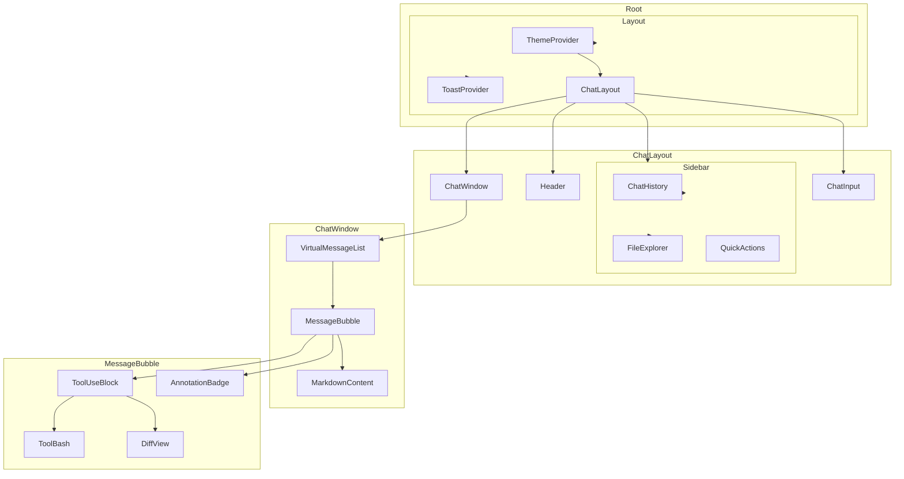

# 05. Web 前端模块分析

## 1. 项目概览

### 1.1 基本信息

| 属性 | 值 |
|------|-----|
| 项目名称 | `claude-code-web` |
| 版本 | 0.1.0 |
| 框架 | Next.js 14.2 (App Router) |
| React | 18.3 |
| 语言 | TypeScript 5 |
| 样式 | Tailwind CSS 3.4 + CSS Custom Properties |
| 状态管理 | Zustand 4.5 (persist middleware) |
| 数据获取 | SWR 2.2 |

### 1.2 核心依赖分析

```
依赖分类:
├── 框架层: next, react, react-dom
├── UI 组件: @radix-ui/* (9 个子包), lucide-react, class-variance-authority
├── 状态管理: zustand (带 persist 中间件)
├── 数据获取: swr
├── 动画: framer-motion
├── 虚拟列表: @tanstack/react-virtual
├── Markdown: react-markdown, remark-gfm
├── 语法高亮: shiki (在 Worker 中加载)
├── 工具: nanoid, clsx, tailwind-merge
└── 开发: @next/bundle-analyzer, eslint, typescript
```

**关键设计选择:**
- 使用 **Zustand** 而非 Redux/Context -- 轻量且支持 persist 中间件直接序列化到 localStorage
- 使用 **Radix UI** 作为无样式基础组件 -- 保证可访问性 (a11y) 同时完全自定义样式
- 使用 **Framer Motion** 处理所有动画 -- 统一的动画语言
- 使用 **@tanstack/react-virtual** -- 长对话列表的虚拟滚动

---

## 2. 目录结构

```
web/
├── app/                          # Next.js App Router
│   ├── layout.tsx                # 根布局 (字体 + ThemeProvider + ToastProvider)
│   ├── page.tsx                  # 首页入口 -> ChatLayout
│   ├── globals.css               # 设计令牌 (CSS Custom Properties) + 动画 + 滚动条
│   └── api/                      # API Routes (BFF 层)
│       ├── chat/route.ts         # 聊天代理 (转发到后端 + 流式透传)
│       ├── files/
│       │   ├── read/route.ts     # 文件读取 (支持图片 base64 + 文本)
│       │   └── write/route.ts    # 文件写入
│       ├── export/route.ts       # 导出服务 (md/json/html/txt)
│       └── share/
│           ├── route.ts          # 创建分享链接
│           └── [shareId]/route.ts # 获取/撤销分享
│
├── components/                   # React 组件
│   ├── chat/                     # 聊天核心组件
│   │   ├── ChatLayout.tsx        # 主布局容器 (Sidebar + Header + ChatWindow + ChatInput)
│   │   ├── ChatWindow.tsx        # 消息列表容器 + 无障碍播报
│   │   ├── ChatInput.tsx         # 消息输入框 + 流式发送控制
│   │   ├── MessageBubble.tsx     # 单条消息气泡 (用户/助手/错误)
│   │   ├── VirtualMessageList.tsx # 虚拟滚动消息列表 (tanstack/virtual)
│   │   └── MarkdownContent.tsx   # Markdown 渲染 (react-markdown + GFM)
│   │
│   ├── tools/                    # 工具展示组件
│   │   ├── ToolUseBlock.tsx      # 通用工具调用卡片 (可折叠 + 状态徽章)
│   │   ├── ToolBash.tsx          # Bash 工具输出 (ANSI 渲染 + 退出码)
│   │   ├── ToolFileRead.tsx      # 文件读取展示
│   │   ├── ToolFileWrite.tsx     # 文件写入展示
│   │   ├── ToolFileEdit.tsx      # 文件编辑展示
│   │   ├── ToolGrep.tsx          # Grep 搜索结果
│   │   ├── ToolGlob.tsx          # Glob 文件匹配
│   │   ├── ToolWebSearch.tsx     # 网络搜索
│   │   ├── ToolWebFetch.tsx      # 网页抓取
│   │   ├── DiffView.tsx          # Diff 查看器 (统一/并排 + LCS 算法)
│   │   ├── SyntaxHighlight.tsx   # 语法高亮 (Shiki)
│   │   ├── AnsiRenderer.tsx      # ANSI 转义码渲染
│   │   └── FileIcon.tsx          # 文件类型图标
│   │
│   ├── collaboration/            # 协作功能组件
│   │   ├── CollaborationProvider.tsx # 协作上下文提供者
│   │   ├── CursorGhost.tsx       # 远程光标幽灵 (textarea 位置映射)
│   │   ├── PresenceAvatars.tsx   # 在线用户头像堆叠
│   │   ├── TypingIndicator.tsx   # 打字指示器 (动画点)
│   │   └── AnnotationBadge.tsx   # 批注徽章 + 线程弹窗
│   │
│   ├── settings/                 # 设置面板
│   │   ├── GeneralSettings.tsx   # 通用设置 (主题/字体/发送方式)
│   │   ├── ModelSettings.tsx     # 模型设置 (模型/Token/温度/System Prompt)
│   │   ├── ApiSettings.tsx       # API 设置
│   │   ├── PermissionSettings.tsx # 权限设置
│   │   ├── McpSettings.tsx       # MCP 服务器设置
│   │   ├── KeyboardSettings.tsx  # 快捷键设置
│   │   ├── DataSettings.tsx      # 数据设置
│   │   ├── SettingsNav.tsx       # 设置导航
│   │   └── SettingRow.tsx        # 设置行基础组件
│   │
│   ├── layout/                   # 布局组件
│   │   ├── ThemeProvider.tsx     # 主题管理 (light/dark/system)
│   │   ├── Sidebar.tsx           # 侧边栏 (可拖拽调整宽度 + 多标签)
│   │   ├── Header.tsx            # 顶栏 (模型选择 + 通知 + 主题切换)
│   │   └── SidebarToggle.tsx     # 侧边栏切换
│   │
│   ├── ui/                       # 基础 UI 组件 (shadcn 风格)
│   │   ├── button.tsx, input.tsx, textarea.tsx, select.tsx
│   │   ├── dialog.tsx, dropdown-menu.tsx, tabs.tsx, tooltip.tsx
│   │   ├── toast.tsx, badge.tsx, avatar.tsx
│   │   └── ToastProvider.tsx
│   │
│   ├── command-palette/          # 命令面板 (Ctrl+K)
│   ├── notifications/            # 通知系统
│   ├── export/                   # 导出 UI
│   ├── file-viewer/              # 文件查看器
│   ├── mobile/                   # 移动端适配
│   ├── shortcuts/                # 快捷键帮助
│   ├── a11y/                     # 无障碍组件
│   └── adapted/                  # 从终端版本适配的组件
│
├── hooks/                        # 自定义 Hooks
│   ├── useCollaboration.ts       # 协作状态管理 (WebSocket 事件处理)
│   ├── usePresence.ts            # 在线状态管理 (光标/打字/用户列表)
│   ├── useConversation.ts        # 会话操作封装
│   ├── useTheme.ts               # 主题 Hook (代理 ThemeProvider)
│   ├── useKeyboardShortcuts.ts   # 全局快捷键 (支持按键序列)
│   ├── useCommandRegistry.ts     # 命令注册表
│   ├── useToast.ts               # Toast 通知
│   ├── useNotifications.ts       # 通知管理
│   ├── useMediaQuery.ts          # 响应式断点
│   ├── useReducedMotion.ts       # 减少动效偏好
│   ├── useFocusReturn.ts         # 焦点管理
│   ├── useTouchGesture.ts        # 触摸手势
│   ├── useViewportHeight.ts      # 移动端视口高度
│   └── useAriaLive.ts            # ARIA 实时区域
│
├── lib/                          # 工具库
│   ├── store.ts                  # Zustand 全局状态 (核心!)
│   ├── types.ts                  # 类型定义
│   ├── constants.ts              # 常量 (模型列表/默认值)
│   ├── utils.ts                  # 工具函数 (cn, formatDate, extractTextContent)
│   │
│   ├── api/                      # API 客户端层
│   │   ├── client.ts             # ApiClient (重试/超时/去重/认证)
│   │   ├── stream.ts             # SSE 流解析 + 长连接管理
│   │   ├── messages.ts           # 消息 API (send/retry/edit/stop)
│   │   ├── conversations.ts      # 会话 API (基于 Zustand store)
│   │   ├── files.ts              # 文件 API (MCP 客户端)
│   │   └── types.ts              # API 类型 (StreamEvent/ApiError/MCP)
│   │
│   ├── collaboration/            # 协作核心
│   │   ├── socket.ts             # CollabSocket (WebSocket 封装)
│   │   ├── presence.ts           # 在线状态 (不可变更新器)
│   │   ├── permissions.ts        # 权限系统 (角色层级/分享链接)
│   │   └── types.ts              # 协作类型 (批注/工具审批/分享链接)
│   │
│   ├── search/                   # 搜索功能
│   │   ├── client-search.ts      # 客户端全文搜索 (评分算法)
│   │   ├── search-api.ts         # 服务端搜索 API (stub)
│   │   └── highlighter.ts        # 高亮 + 摘要提取
│   │
│   ├── export/                   # 导出功能
│   │   ├── markdown.ts           # Markdown 导出
│   │   ├── json.ts               # JSON 导出
│   │   ├── html.ts               # HTML 导出 (自包含页面)
│   │   └── plaintext.ts          # 纯文本导出
│   │
│   ├── performance/              # 性能优化
│   │   ├── streaming-optimizer.ts # rAF 批量刷新 (60fps 流式)
│   │   ├── worker-pool.ts        # Web Worker 线程池
│   │   └── metrics.ts            # Core Web Vitals + 自定义指标
│   │
│   ├── workers/                  # Web Workers
│   │   ├── search.worker.ts      # 搜索索引 Worker (倒排索引)
│   │   ├── highlight.worker.ts   # 语法高亮 Worker (Shiki 懒加载)
│   │   └── markdown.worker.ts    # Markdown 预处理 Worker
│   │
│   ├── ink-compat/               # Ink/终端兼容层
│   │   ├── Box.tsx               # Ink Box -> CSS 转换
│   │   ├── color-mapping.ts      # ANSI 颜色 -> CSS 映射
│   │   └── prop-mapping.ts       # Ink 布局/文本属性 -> CSS
│   │
│   ├── share-store.ts            # 分享存储 (服务端内存单例)
│   ├── terminal-compat.ts        # 终端 API stub (process.stdout 等)
│   ├── platform.ts               # 平台检测
│   ├── keyParser.ts              # 快捷键解析器
│   ├── shortcuts.ts              # 快捷键定义
│   ├── theme.tsx                 # 主题工具
│   ├── ansi-to-html.ts           # ANSI -> HTML 转换
│   ├── fileViewerStore.ts        # 文件查看器状态
│   ├── notifications.ts          # 通知工具
│   └── browser-notifications.ts  # 浏览器通知 API
│
├── public/                       # 静态资源
│   ├── fonts/                    # JetBrains Mono 字体
│   └── manifest.json             # PWA manifest
│
├── next.config.ts                # Next.js 配置 (worker-loader/压缩/缓存)
├── tailwind.config.ts            # Tailwind 配置
├── tsconfig.json                 # TypeScript 配置
└── package.json
```

---

## 3. 核心架构分析

### 3.1 应用入口与布局

```
RootLayout (app/layout.tsx)
├── Inter 字体 (无衬线)
├── JetBrains Mono 字体 (等宽)
├── ThemeProvider (dark/light/system)
│   └── 通过 document.documentElement.classList 切换
└── ToastProvider
    └── children (页面内容)

Home Page (app/page.tsx)
└── ChatLayout
    ├── AnnouncerProvider (无障碍)
    ├── SkipToContent (无障碍)
    ├── Sidebar (左侧导航, 可拖拽调整宽度)
    └── Main Content
        ├── Header (模型选择 + 通知 + 主题)
        ├── ChatWindow (消息列表)
        └── ChatInput (输入框)
```

### 3.2 状态管理架构 (Zustand)

`/Users/zaxtyson/Documents/claude-code-analyze/claude-code/web/lib/store.ts` 是整个应用的核心状态容器:

```typescript
// 持久化配置
persist(
  (set, get) => ({ ... }),
  {
    name: "claude-code-chat",        // localStorage key
    partialize: (state) => ({       // 只持久化必要数据
      conversations,
      activeConversationId,
      settings,
      pinnedIds,
      recentSearches,
      tags,
    }),
    merge: (persisted, current) => ({ // 合并策略
      ...current,
      ...persisted,
      settings: { ...DEFAULT_SETTINGS, ...persisted.settings },
      // 从不持久化 UI 状态
      settingsOpen: false,
      isSearchOpen: false,
      sidebarTab: "chats",
      selectedConversationIds: [],
    }),
  }
)
```

**状态结构:**
- `conversations`: 会话列表 (每个包含 messages 数组)
- `activeConversationId`: 当前激活会话
- `settings`: 应用设置 (主题/模型/权限/MCP/快捷键)
- `sidebarOpen/sidebarWidth/sidebarTab`: 侧边栏状态
- `tags`: 会话标签系统
- `searchQuery/recentSearches`: 搜索状态

### 3.3 数据流图

```mermaid
graph TB
    subgraph "用户交互层"
        UI[ChatInput]
        SidebarComp[Sidebar]
        SettingsComp[Settings]
    end

    subgraph "状态管理层"
        Store[(Zustand Store<br/>+ localStorage persist)]
    end

    subgraph "API 客户端层"
        ChatInputComp[ChatInput]
        MessageAPI[messageAPI<br/>send/retry/edit/stop]
        ApiClient[ApiClient<br/>重试/超时/去重]
        McpClient[McpClient<br/>JSON-RPC]
    end

    subgraph "BFF 层 (Next.js API Routes)"
        ChatRoute[/api/chat<br/>流式代理]
        FileReadRoute[/api/files/read]
        FileWriteRoute[/api/files/write]
        ExportRoute[/api/export]
        ShareRoute[/api/share]
    end

    subgraph "后端服务"
        Backend[Backend API<br/>localhost:3001]
        WSServer[WebSocket Server<br/>ws://localhost:3001/collab]
        MCPServer[MCP Server<br/>Streamable HTTP]
    end

    subgraph "流式处理"
        SSEParser[SSE Parser<br/>parseStream]
        StreamOpt[StreamingOptimizer<br/>rAF 批量刷新]
    end

    UI --> Store
    SidebarComp --> Store
    SettingsComp --> Store
    ChatInputComp --> MessageAPI
    MessageAPI --> ApiClient
    ApiClient --> ChatRoute
    ChatRoute --> Backend
    MessageAPI --> SSEParser
    SSEParser --> StreamOpt
    StreamOpt --> Store
    McpClient --> MCPServer
    ApiClient -->|files| FileReadRoute
    FileReadRoute -->|fs| LocalFS
    FileWriteRoute -->|fs| LocalFS
    ShareRoute --> ShareStore[(内存存储)]
    ExportRoute --> ExportLib[Export Lib<br/>md/json/html/txt]
    WSServer -.->|WebSocket| CollabSocket[CollabSocket]
    CollabSocket --> Store
```

### 3.4 组件层次图



---

## 4. API 路由层分析 (BFF 模式)

### 4.1 聊天 API (`/api/chat/route.ts`)

**角色:** BFF (Backend for Frontend) 代理层

```typescript
// 核心逻辑
POST /api/chat
  -> 转发到 ${NEXT_PUBLIC_API_URL}/api/chat
  -> 透传 ANTHROPIC_API_KEY (如果设置)
  -> 流式返回 response.body (SSE 格式)
```

**设计特点:**
- 不处理业务逻辑, 纯粹代理转发
- 支持流式透传 (`new NextResponse(response.body)`)
- 可选的 API Key 注入 (开发模式)

### 4.2 文件 API

**`/api/files/read/route.ts`:**
- 支持文本文件读取 (UTF-8)
- 图片文件自动转 base64 Data URL
- MIME 类型自动检测 (png/jpg/gif/webp/bmp/ico)
- SVG 作为文本处理但标记 `isImage: true`

**`/api/files/write/route.ts`:**
- 简单文件写入 (UTF-8)
- 返回写入后文件大小

### 4.3 导出 API (`/api/export/route.ts`)

支持 4 种格式:
| 格式 | MIME | 扩展名 | 处理位置 |
|------|------|--------|----------|
| Markdown | `text/markdown` | .md | 服务端 |
| JSON | `application/json` | .json | 服务端 |
| HTML | `text/html` | .html | 服务端 (自包含) |
| Plaintext | `text/plain` | .txt | 服务端 |
| PDF | - | - | 客户端 (window.print) |

### 4.4 分享 API

**创建分享 (`POST /api/share`):**
- 生成 12 位 nanoid 作为 shareId
- 支持 3 种可见性: public / unlisted / password
- 支持 5 种过期: 1h / 24h / 7d / 30d / never
- 密码保护模式需要密码验证

**获取分享 (`GET /api/share/:shareId`):**
- 密码保护需 `x-share-password` 头或 `?password=` 参数
- 自动检查过期时间
- 返回会话标题和消息

**撤销分享 (`DELETE /api/share/:shareId`):**

**存储实现 (`lib/share-store.ts`):**
- 内存 Map 存储 (Node.js 进程生命周期)
- 注释提示生产环境应替换为 Redis/Postgres
- 密码简单字符串比较 (生产环境应使用 bcrypt)

---

## 5. 聊天组件深度分析

### 5.1 ChatInput - 流式发送控制

```typescript
// 核心流程
handleSubmit()
  -> addMessage(role: "user")         // 添加用户消息
  -> addMessage(role: "assistant")    // 添加占位助手消息
  -> new AbortController()            // 创建取消控制器
  -> streamChat(messages, model, signal)  // 发起流式请求
  -> for await (chunk) {              // 消费 SSE 流
       updateMessage(content, "streaming")  // 实时更新
     }
  -> updateMessage(status: "complete")     // 标记完成
```

**关键设计:**
- `AbortController` 支持中途停止生成
- `textarea` 自动高度调整 (最大 200px)
- Enter 发送, Shift+Enter 换行
- 消息长度限制 100,000 字符

### 5.2 VirtualMessageList - 虚拟滚动

使用 `@tanstack/react-virtual`:

```typescript
useVirtualizer({
  count: messages.length,
  estimateSize: (index) => estimateMessageHeight(messages[index]),  // 预估高度
  overscan: 5,   // 额外渲染 5 条
})
```

**高度估算策略:**
| 内容长度 | 预估高度 |
|----------|----------|
| < 100 字符 | 80px (短消息) |
| < 500 字符 或含代码块 | 160px (中等) |
| > 500 字符 | 320px (长消息) |

**自动滚动逻辑:**
- 流式传输中: 即时滚动 (`scrollTop = scrollHeight`)
- 非流式: 平滑滚动 (`behavior: "smooth"`)
- 用户手动上滚时暂停自动滚动 (80px 阈值)

### 5.3 MessageBubble - 消息气泡

- 用户消息: 右对齐, 品牌紫色背景
- 助手消息: 左对齐, 深色背景, Markdown 渲染
- 错误消息: 红色边框和背景
- 流式状态: 显示脉冲光标动画
- 无障碍: `aria-label` 标识发送者, 屏幕阅读器播报

### 5.4 DiffView - 差异查看器

**算法:** 经典 LCS (最长公共子序列) 动态规划
- 时间复杂度: O(m*n)
- 空间复杂度: O(m*n) (使用 Uint32Array 优化)

**视图模式:**
- 统一视图 (Unified): 类似 `diff -u`, 可折叠连续相同行
- 并排视图 (Side-by-Side): 左右对比, 自动配对 add/remove

---

## 6. 协作功能设计

### 6.1 架构概览

```
CollaborationProvider
├── useCollaboration (WebSocket 事件处理)
│   ├── 角色管理 (owner/collaborator/viewer)
│   ├── 工具审批 (approve/deny)
│   ├── 批注系统 (add/resolve/reply)
│   └── 会话管理 (revoke/changeRole/transferOwnership)
│
└── usePresence (在线状态管理)
    ├── 用户列表同步
    ├── 光标位置追踪
    └── 打字状态指示
```

### 6.2 CollabSocket - WebSocket 封装

```
CollabSocket
├── 连接管理
│   ├── connect(wsUrl) - 带 sessionId 和 token 参数
│   ├── disconnect() - 停止重连
│   └── 自动重连 (指数退避, 最多 5 次)
│
├── 心跳机制
│   └── 每 30 秒发送 ping
│
├── 事件系统
│   ├── on(type, handler) - 订阅事件, 返回取消函数
│   ├── off(type, handler) - 取消订阅
│   └── send(event) - 发送事件 (自动添加 timestamp)
│
└── 事件类型 (18 种)
    ├── 消息: message_added, message_streaming
    ├── 工具: tool_use_pending, tool_use_approved, tool_use_denied
    ├── 用户: user_joined, user_left, presence_sync
    ├── 交互: cursor_update, typing_start, typing_stop
    ├── 批注: annotation_added, annotation_resolved, annotation_reply
    ├── 管理: role_changed, access_revoked, ownership_transferred
    ├── 状态: session_state
    └── 错误: error
```

### 6.3 权限系统

```
角色层级:
  Owner (3) > Collaborator (2) > Viewer (1)

权限矩阵:
┌─────────────────────┬────────┬──────────────┬────────┐
│ 操作                │ Owner  │ Collaborator │ Viewer │
├─────────────────────┼────────┼──────────────┼────────┤
│ 发送消息            │   ✓    │      ✓       │   ✗    │
│ 审批工具 (owner-only)│   ✓   │      ✗       │   ✗    │
│ 审批工具 (any)      │   ✓    │      ✓       │   ✗    │
│ 管理访问权限        │   ✓    │      ✗       │   ✗    │
│ 转移所有权          │   ✓    │      ✗       │   ✗    │
│ 添加批注            │   ✓    │      ✓       │   ✗    │
│ 修改角色            │   ✓    │      ✗       │   ✗    │
│ 实时观看            │   ✓    │      ✓       │   ✓    │
└─────────────────────┴────────┴──────────────┴────────┘
```

### 6.4 协作组件

| 组件 | 功能 | 技术要点 |
|------|------|----------|
| CursorGhost | 远程光标显示 | 使用隐藏 mirror div 测量 textarea 像素位置 |
| PresenceAvatars | 在线用户头像 | 最多显示 4 个 + 溢出计数, 堆叠布局 |
| TypingIndicator | 打字指示 | 动画弹跳点 + 用户头像 |
| AnnotationBadge | 批注徽章 | 未解决计数 + 弹出线程面板 |

### 6.5 光标位置映射算法

```typescript
measureCursorPosition(textarea, offset):
  1. 创建隐藏 mirror div, 复制 textarea 的所有样式
  2. 设置 mirror 的 textContent = textarea.value.slice(0, offset)
  3. 在末尾添加零宽字符 (\u200b) + span 包裹
  4. 测量 span 相对于 textarea 的位置
  5. 返回 { top, left }
```

---

## 7. 性能优化策略

### 7.1 流式优化 (StreamingOptimizer)

```typescript
class StreamingOptimizer {
  // 核心思路: 使用 requestAnimationFrame 批量刷新
  // 避免每个 token 都触发 React 重渲染

  push(chunk) {
    buffer += chunk;
    if (rafId !== null) return;  // 已有 rAF 调度, 跳过

    if (timeSinceLast >= maxDelay) {
      flush();  // 超时强制刷新
    } else {
      rafId = requestAnimationFrame(() => flush());  // 下一帧刷新
    }
  }
}
```

**效果:** 将高频 token 更新合并到 60fps 的 rAF 周期, 避免过度渲染

### 7.2 Web Worker 池

```
WorkerPool (最多 4 个 Worker)
├── search.worker.ts    # 倒排索引搜索 (不阻塞主线程)
├── highlight.worker.ts # Shiki 语法高亮 (懒加载, ~2MB)
└── markdown.worker.ts  # Markdown 预处理 (行分类)

单例池管理:
  getWorkerPool(key, factory) -> 按 key 复用, 避免重复创建
```

**Worker 通信协议:**
```
search.worker:
  In:  { type: "index"|"query"|"remove", ... }
  Out: { id, results: SearchResult[] }

highlight.worker:
  In:  { id, code, lang, theme? }
  Out: { id, html, plainText }

markdown.worker:
  In:  { id, markdown }
  Out: { id, tokens, headings, codeBlockCount }
```

### 7.3 Core Web Vitals 监控

```
监控指标:
├── LCP (Largest Contentful Paint) - 目标 < 2.5s
├── FID (First Input Delay) - 目标 < 100ms
├── CLS (Cumulative Layout Shift) - 目标 < 0.1
├── INP (Interaction to Next Paint) - 目标 < 200ms
├── TTFB (Time to First Byte) - 目标 < 800ms
├── FCP (First Contentful Paint) - 目标 < 1.8s
├── time_to_interactive - 自定义
├── first_message_render - 自定义
├── streaming_token_latency_ms - 自定义
└── scroll_fps - 自定义 (目标 >= 55fps)
```

### 7.4 Next.js 构建优化

```typescript
// next.config.ts
{
  compress: true,  // Gzip/Brotli 压缩
  images: {
    formats: ["image/avif", "image/webp"],  // 现代格式
    minimumCacheTTL: 60,
  },
  experimental: {
    typedRoutes: true,
    optimizePackageImports: [  // Tree-shaking
      "lucide-react",
      "@radix-ui/react-dialog",
      "@radix-ui/react-dropdown-menu",
      "@radix-ui/react-tooltip",
    ],
  },
  webpack: {
    // Web Worker 支持 (worker-loader)
    // 浏览器端忽略 Node.js 模块 (fs/path/os)
  },
  headers: [
    // 静态资源: 1 年缓存 (immutable)
    // 字体: 1 年缓存 (immutable)
  ],
}
```

---

## 8. 搜索功能

### 8.1 客户端搜索 (client-search.ts)

**评分算法:**
```
scoreText(text, tokens):
  对每个 token:
    基础分: +1 (匹配到)
    词边界奖励: +0.5 (前后都是非词字符)
    多次出现: +0.2 * min(count-1, 3)
  全匹配奖励: score *= matchedTokens / totalTokens

标题权重: titleScore * 1.5
```

**支持的过滤器:**
- 日期范围 (dateFrom/dateTo)
- 角色 (user/assistant/system/tool)
- 会话 ID
- 内容类型 (text/code/tool_use/file)
- 模型
- 标签

### 8.2 Worker 搜索 (search.worker.ts)

**倒排索引:**
```
index: Map<term, Set<entryIndex>>
entries: SearchEntry[]

搜索流程:
  1. Tokenize 查询
  2. 对每个 token, 查找 index 中包含该 token 的所有 term
  3. 精确匹配 boost = 2, 部分匹配 boost = 1
  4. 按分数排序, 返回 top N
```

---

## 9. Web UI 与终端版本的关系

### 9.1 共享设计语言

| 维度 | 终端版本 (Ink) | Web 版本 |
|------|---------------|----------|
| 布局系统 | Ink Box (flex) | CSS Flexbox |
| 颜色系统 | ANSI 256 色 | CSS Custom Properties |
| 字体 | 终端等宽字体 | JetBrains Mono |
| 组件风格 | 终端字符画 | Tailwind CSS |

### 9.2 兼容层 (`lib/ink-compat/`)

```
ink-compat/
├── Box.tsx              # Ink Box -> CSS 转换
├── color-mapping.ts     # ANSI 颜色名 -> CSS 颜色值
└── prop-mapping.ts      # Ink 属性 -> CSSProperties

转换示例:
  Ink: <Box flexDirection="column" padding={1}>
  CSS: { display: "flex", flexDirection: "column", padding: "1ch" }
```

### 9.3 终端 API Stub (`lib/terminal-compat.ts`)

```
终端 API          -> Web 替代
─────────────────────────────────────────────
process.stdout    -> console.log
process.exit()    -> window.location.href = "/"
useInput()        -> document.addEventListener("keydown")
useApp()          -> 自定义 Hook
getColumns()      -> window.innerWidth / 8
getRows()         -> window.innerHeight / 16
```

### 9.4 共享后端

```
                  ┌──────────────────┐
                  │   后端 API 服务    │
                  │  localhost:3001  │
                  └────────┬─────────┘
                           │
              ┌────────────┼────────────┐
              │            │            │
        ┌─────▼─────┐ ┌───▼────┐ ┌────▼─────┐
        │ HTTP API  │ │  SSE   │ │ WebSocket │
        │ /api/chat │ │ Stream │ │  /collab  │
        └─────┬─────┘ └───┬────┘ └────┬─────┘
              │            │            │
        ┌─────▼─────┐ ┌───▼────┐ ┌────▼─────┐
        │ 终端 CLI  │ │ Web UI │ │ Web UI   │
        │ (Ink)     │ │ (聊天)  │ │ (协作)    │
        └───────────┘ └────────┘ └──────────┘
```

**结论:** Web 版本与终端版本 **共享同一后端**, 但前端是 **完全独立实现**。Web 版本通过以下机制与后端通信:
1. HTTP REST API (via Next.js BFF 代理)
2. SSE 流式响应 (聊天)
3. WebSocket (实时协作)
4. MCP JSON-RPC (文件系统工具)

---

## 10. 无障碍设计 (a11y)

### 10.1 组件

| 组件 | 功能 |
|------|------|
| SkipToContent | 跳过导航链接 (键盘用户) |
| AnnouncerProvider | 全局 ARIA live region 提供者 |
| FocusTrap | 模态框焦点陷阱 |
| VisuallyHidden | 视觉隐藏但屏幕阅读器可见 |
| LiveRegion | 动态内容播报 |

### 10.2 关键实现

- 所有图标按钮都有 `aria-label`
- 装饰性图标标记 `aria-hidden="true"`
- 流式消息完成时通过 `aria-live="polite"` 播报
- 焦点可见性: `:focus-visible` 使用品牌紫色 2px 描边
- 颜色对比度: 暗色/亮色主题都经过对比度验证

---

## 11. 快捷键系统

```
全局快捷键 (useKeyboardShortcuts):
├── 支持单键组合: mod+k, ctrl+b
├── 支持按键序列: g d, g c (类似 Vim)
├── 输入框抑制: 在 INPUT/TEXTAREA/SELECT 中抑制非全局快捷键
├── 序列超时: 1000ms
└── 条件匹配: cmd.when() 函数

默认快捷键:
┌─────────────────────┬──────────────────┐
│ 快捷键              │ 功能             │
├─────────────────────┼──────────────────┤
│ Ctrl+Shift+N        │ 新对话           │
│ Enter               │ 发送消息         │
│ Ctrl+L              │ 聚焦输入框       │
│ Ctrl+B              │ 切换侧边栏       │
│ Ctrl+,              │ 打开设置         │
│ Ctrl+K              │ 命令面板         │
└─────────────────────┴──────────────────┘
```

---

## 12. 移动端适配

```
mobile/
├── MobileHeader.tsx      # 移动端顶栏
├── MobileSidebar.tsx     # 抽屉式侧边栏
├── MobileInput.tsx       # 移动端输入框 (处理虚拟键盘)
├── MobileFileViewer.tsx  # 移动端文件查看
├── BottomSheet.tsx       # 底部弹出面板
└── SwipeableRow.tsx      # 可滑动行 (删除操作)

适配策略:
├── useMediaQuery: 断点检测 (md: 768px)
├── useViewportHeight: 处理 iOS Safari 视口变化
├── useTouchGesture: 触摸手势识别
└── Sidebar: md 以下隐藏, 使用 MobileSidebar 替代
```

---

## 13. 通知系统

```
notifications/
├── ToastProvider.tsx     # Radix Toast 提供者
├── Toast.tsx             # 单条 Toast
├── ToastStack.tsx        # Toast 堆叠
├── NotificationCenter.tsx # 通知中心
├── NotificationItem.tsx  # 通知项
├── NotificationBadge.tsx # 未读计数徽章
└── hooks/useNotifications.ts

lib/
├── notifications.ts      # 通知工具函数
└── browser-notifications.ts # 浏览器 Notification API
```

---

## 14. 主题系统

```
ThemeProvider:
├── 3 种模式: light / dark / system
├── system 模式: 监听 prefers-color-scheme 媒体查询
├── 实现: document.documentElement.classList.toggle("light")
└── CSS 变量: 两套完整的 CSS Custom Properties

设计令牌 (globals.css):
├── 背景色: bg-primary, bg-secondary, bg-elevated
├── 文本色: text-primary, text-secondary, text-muted
├── 强调色: accent (品牌紫 #8b5cf6)
├── 状态色: success/warning/error/info
├── 边框色: border, border-hover
├── 阴影: sm/md/lg
├── 圆角: sm/md/lg/xl
└── 动画: fast/normal/slow
```

---

## 15. 总结

### 15.1 架构优势

1. **清晰的层次结构**: App Router -> 组件 -> 状态 -> API -> 后端
2. **优秀的性能设计**: 虚拟列表 + Worker 池 + rAF 批量刷新
3. **完善的无障碍支持**: ARIA + 键盘导航 + 屏幕阅读器
4. **灵活的协作架构**: WebSocket + 角色权限 + 乐观更新
5. **良好的可维护性**: TypeScript + 模块化 + 兼容层抽象

### 15.2 技术亮点

| 亮点 | 实现方式 |
|------|----------|
| 流式渲染优化 | rAF 批量刷新, 60fps 不丢帧 |
| 长列表性能 | @tanstack/react-virtual 虚拟滚动 |
| 语法高亮不阻塞 | Shiki 在 Web Worker 中懒加载 |
| 搜索不卡顿 | 倒排索引在 Worker 中维护 |
| 状态持久化 | Zustand persist 中间件 |
| API 容错 | 重试 + 超时 + 去重 + 指数退避 |
| 协作实时性 | WebSocket + 乐观更新 + 冲突处理 |
| 终端兼容 | Ink 属性 -> CSS 转换层 |

### 15.3 可改进方向

1. **分享存储**: 当前为内存存储, 生产环境需迁移到 Redis/Postgres
2. **密码安全**: 当前为明文比较, 应使用 bcrypt/argon2
3. **搜索扩展**: 客户端搜索适合小规模, 大规模需接入服务端搜索引擎
4. **MCP 集成**: 文件 API 通过 MCP 调用, 可增加更多 MCP 工具支持
5. **PWA 完善**: 已有 manifest.json, 可增加 Service Worker 离线支持
