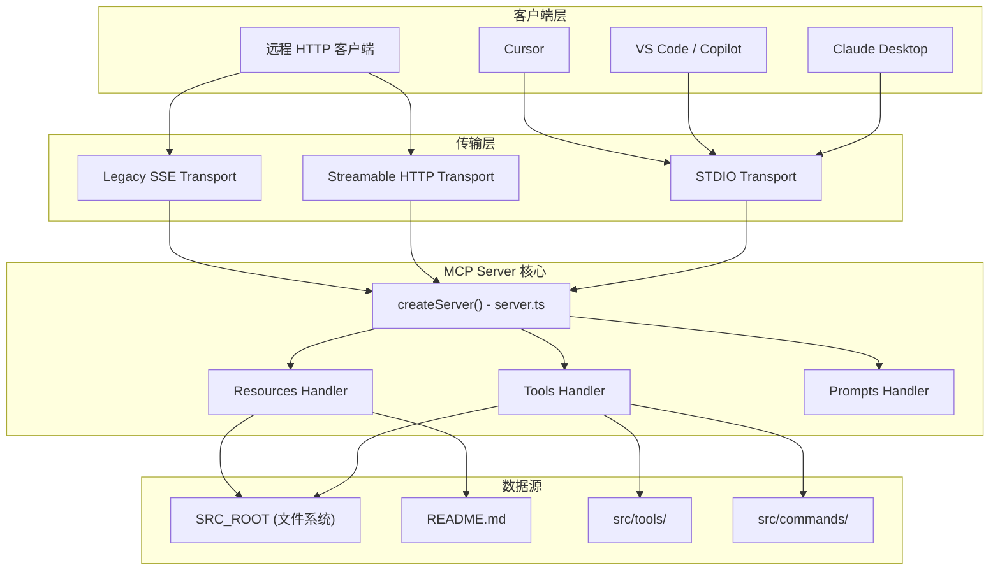
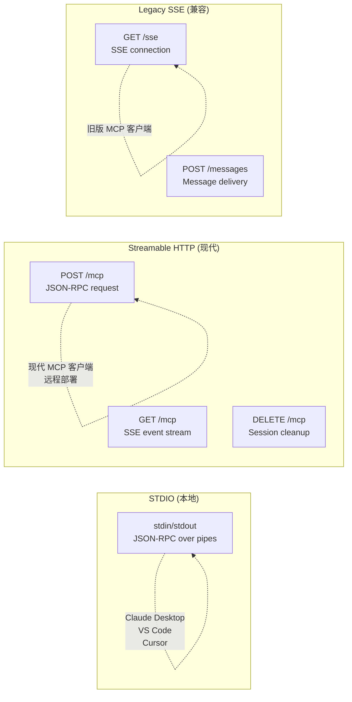
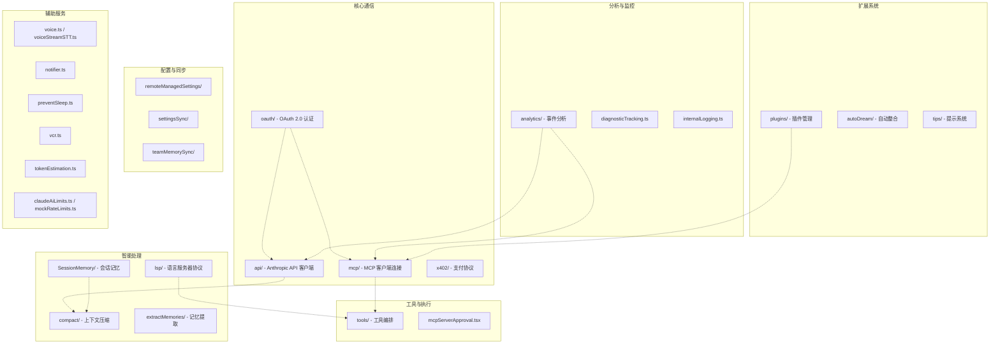
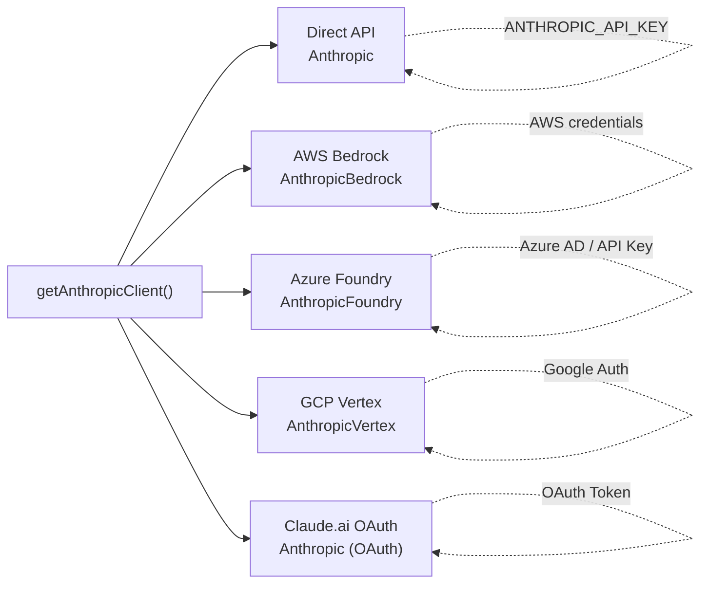
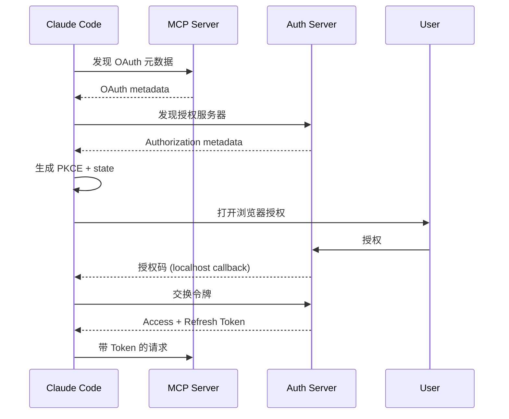
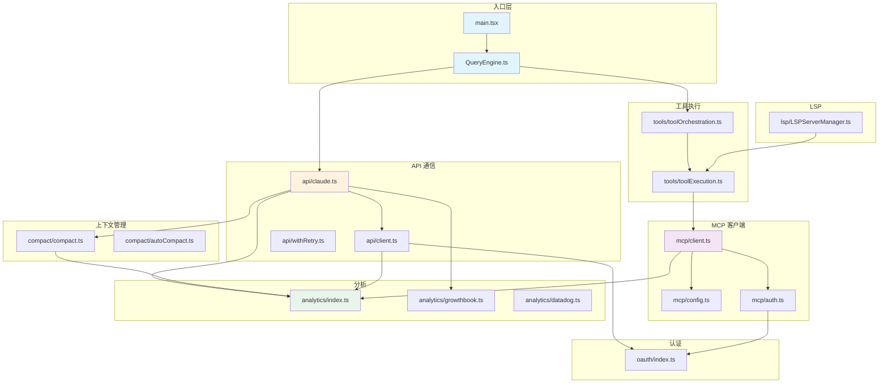
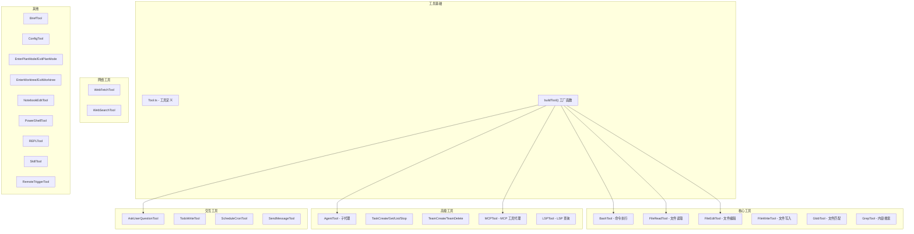
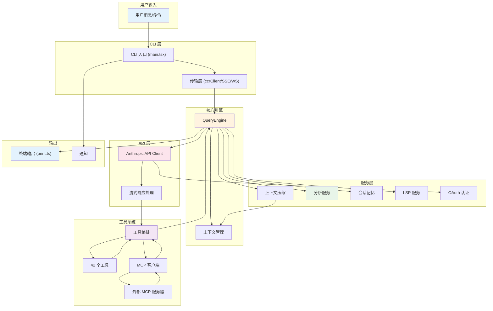

# 06 - MCP Server & Services 模块分析

## 目录

- [1. MCP Server 模块](#1-mcp-server-模块)
  - [1.1 概述](#11-概述)
  - [1.2 架构设计](#12-架构设计)
  - [1.3 核心文件分析](#13-核心文件分析)
  - [1.4 传输层协议](#14-传输层协议)
  - [1.5 工具/资源/提示系统](#15-工具资源提示系统)
  - [1.6 部署方案](#16-部署方案)
  - [1.7 安全机制](#17-安全机制)
- [2. Services 层](#2-services-层)
  - [2.1 服务总览](#21-服务总览)
  - [2.2 API 服务](#22-api-服务)
  - [2.3 MCP 客户端服务](#23-mcp-客户端服务)
  - [2.4 分析服务](#24-分析服务)
  - [2.5 Compact 服务](#25-compact-服务)
  - [2.6 LSP 服务](#26-lsp-服务)
  - [2.7 OAuth 服务](#27-oauth-服务)
  - [2.8 工具编排服务](#28-工具编排服务)
  - [2.9 其他服务](#29-其他服务)
  - [2.10 服务依赖关系图](#210-服务依赖关系图)
- [3. 核心模块补充分析](#3-核心模块补充分析)
  - [3.1 Tools 工具系统](#31-tools-工具系统)
  - [3.2 CLI 传输层](#32-cli-传输层)
  - [3.3 Buddy 伙伴系统](#33-buddy-伙伴系统)
- [4. 全局数据流](#4-全局数据流)

---

## 1. MCP Server 模块

### 1.1 概述

`mcp-server/` 是一个独立的 **Model Context Protocol (MCP) Server**，名为 `claude-code-explorer-mcp`。它的核心职责是：**让任何 MCP 兼容的客户端能够浏览和探索 Claude Code 的源代码库**。

这不是 Claude Code 内部使用的 MCP 客户端，而是一个**独立的、可部署的 MCP 服务端**，用于对外提供代码探索能力。

**基本信息：**
- **名称**: `claude-code-explorer-mcp`
- **版本**: `1.1.0`
- **MCP 注册名**: `io.github.nirholas/claude-code-explorer-mcp`
- **仓库**: `https://github.com/nirholas/claude-code`
- **运行时**: Node.js 22 (ESM)
- **核心依赖**: `@modelcontextprotocol/sdk@^1.12.1`, `express@^4.21.0`

**关键文件结构：**
```
mcp-server/
├── src/
│   ├── server.ts        # 核心 MCP 服务器定义（传输层无关）
│   ├── index.ts         # STDIO 入口（本地使用）
│   └── http.ts          # HTTP + SSE 入口（远程部署）
├── api/
│   ├── index.ts         # Vercel Serverless 函数
│   └── vercelApp.ts     # Vercel 的 Express 应用
├── Dockerfile           # 多阶段 Docker 构建
├── railway.json         # Railway 部署配置
├── server.json          # MCP Registry 元数据
├── package.json
└── tsconfig.json
```

### 1.2 架构设计

MCP Server 采用**传输层无关**的架构设计，核心服务器逻辑与传输层完全解耦：



### 1.3 核心文件分析

#### 1.3.1 `src/server.ts` — 核心服务器定义（958 行）

这是整个 MCP Server 的**核心模块**，实现了传输层无关的 MCP 服务器。

**关键职责：**

1. **配置管理**
   - `SRC_ROOT`: 通过环境变量 `CLAUDE_CODE_SRC_ROOT` 配置，默认为 `../../src`（相对于 dist/）
   - 路径安全: `safePath()` 函数防止路径遍历攻击

2. **辅助函数**
   - `dirExists()`, `fileExists()`: 文件系统检查
   - `listDir()`: 目录列表（区分文件/目录）
   - `walkFiles()`: 递归遍历文件树
   - `safePath()`: 安全路径解析（防止 `../` 遍历）

3. **元数据收集**
   - `getToolList()`: 扫描 `src/tools/` 目录，获取所有 Agent 工具信息
   - `getCommandList()`: 扫描 `src/commands/` 目录，获取所有斜杠命令信息

4. **Server 工厂函数 `createServer()`**
   - 创建 `@modelcontextprotocol/sdk` 的 Server 实例
   - 注册三大能力: `tools`, `resources`, `prompts`
   - 设置请求处理器

5. **验证函数 `validateSrcRoot()`**
   - 启动前验证 SRC_ROOT 目录存在
   - 不存在则退出并提示设置环境变量

**核心代码模式：**
```typescript
// 路径安全解析 - 防止目录遍历
function safePath(relPath: string): string | null {
  const resolved = path.resolve(SRC_ROOT, relPath);
  if (!resolved.startsWith(SRC_ROOT)) return null;
  return resolved;
}
```

#### 1.3.2 `src/index.ts` — STDIO 入口（24 行）

STDIO 传输层的入口点，用于本地使用（Claude Desktop、Claude Code CLI 等）。

**执行流程：**
```
1. validateSrcRoot()     -> 验证源码目录存在
2. createServer()        -> 创建 MCP 服务器实例
3. new StdioServerTransport() -> 创建 STDIO 传输
4. server.connect(transport)  -> 连接传输层
5. 通过 stdin/stdout 进行 JSON-RPC 通信
```

**使用方式：**
```bash
node dist/index.js
CLAUDE_CODE_SRC_ROOT=/path/to/src node dist/index.js
```

#### 1.3.3 `src/http.ts` — HTTP 入口（173 行）

HTTP/SSE 传输层的入口点，用于远程部署（Railway、Render、VPS 等）。

**支持的端点：**

| 端点 | 方法 | 传输类型 | 用途 |
|------|------|----------|------|
| `/mcp` | POST | Streamable HTTP | JSON-RPC 请求 |
| `/mcp` | GET | Streamable HTTP | SSE 事件流 |
| `/mcp` | DELETE | Streamable HTTP | 会话清理 |
| `/sse` | GET | Legacy SSE | SSE 连接建立 |
| `/messages` | POST | Legacy SSE | SSE 消息投递 |
| `/health` | GET | - | 健康检查 |

**会话管理：**
```typescript
// Streamable HTTP 会话管理
const transports = new Map<string, StreamableHTTPServerTransport>();

app.post("/mcp", async (req, res) => {
  const sessionId = req.headers["mcp-session-id"];
  let transport = sessionId ? transports.get(sessionId) : undefined;

  if (!transport) {
    // 新会话：创建服务器和传输
    const server = createServer();
    transport = new StreamableHTTPServerTransport({
      sessionIdGenerator: () => randomUUID(),
    });
    await server.connect(transport);
    // ...存储会话
  }
  await transport.handleRequest(req, res, req.body);
});
```

**认证中间件：**
```typescript
function authMiddleware(req, res, next) {
  if (!API_KEY) return next();           // 未设置密钥则跳过
  if (req.path === "/health") return next(); // 健康检查跳过
  const auth = req.headers.authorization;
  if (!auth || auth !== `Bearer ${API_KEY}`) {
    res.status(401).json({ error: "Unauthorized" });
    return;
  }
  next();
}
```

#### 1.3.4 `api/index.ts` 和 `api/vercelApp.ts` — Vercel 部署

**`api/index.ts`** (21 行): Vercel Serverless 函数入口，导出 Express 应用作为默认导出。

**`api/vercelApp.ts`** (97 行): 与 `http.ts` 逻辑相同的 Express 应用，但设计为模块导入形式。

**Vercel 限制说明：**
- Serverless 函数是**无状态**的
- Streamable HTTP 传输（需要会话持久化）在 Vercel 上**无法正常工作**
- Legacy SSE 和无状态工具调用可以正常工作
- 执行时间限制：Hobby 10s / Pro 60s
- 建议：生产环境使用 Railway/Render/VPS

### 1.4 传输层协议

MCP Server 支持三种传输协议：



**对比分析：**

| 特性 | STDIO | Streamable HTTP | Legacy SSE |
|------|-------|-----------------|------------|
| 适用场景 | 本地 | 远程/云部署 | 旧客户端兼容 |
| 会话管理 | 无（单连接） | UUID 会话 | 内存 Map |
| 双向通信 | 是 | 是（POST+GET） | 是 |
| 状态持久化 | N/A | 需要持久化 | 内存 |
| 最佳部署 | 本地 | Railway/Docker | 任何平台 |

### 1.5 工具/资源/提示系统

#### 1.5.1 8 个 Tools

| 工具名 | 功能 | 输入参数 |
|--------|------|----------|
| `list_tools` | 列出所有 40+ Agent 工具 | 无 |
| `list_commands` | 列出所有 50+ 斜杠命令 | 无 |
| `get_tool_source` | 读取特定工具的源代码 | `toolName`, `fileName?` |
| `get_command_source` | 读取特定命令的源代码 | `commandName`, `fileName?` |
| `read_source_file` | 读取任意源文件（支持行范围） | `path`, `startLine?`, `endLine?` |
| `search_source` | 正则搜索整个源码树 | `pattern`, `filePattern?`, `maxResults?` |
| `list_directory` | 列出目录内容 | `path` |
| `get_architecture` | 获取架构概览 | 无 |

#### 1.5.2 3 个 Resources + 1 个模板

| 资源 URI | 类型 | 描述 |
|----------|------|------|
| `claude-code://architecture` | `text/markdown` | README 架构概览 |
| `claude-code://tools` | `application/json` | 工具注册表（JSON） |
| `claude-code://commands` | `application/json` | 命令注册表（JSON） |
| `claude-code://source/{path}` | `text/plain` | 任意源文件（模板） |

#### 1.5.3 5 个 Prompts

| 提示名 | 参数 | 用途 |
|--------|------|------|
| `explain_tool` | `toolName` | 深入解释特定工具 |
| `explain_command` | `commandName` | 解释斜杠命令 |
| `architecture_overview` | 无 | 架构导览 |
| `how_does_it_work` | `feature` | 解释子系统 |
| `compare_tools` | `tool1`, `tool2` | 工具对比 |

**Prompt 工作原理：**
```
用户请求 -> GetPromptRequest -> 构建上下文消息 -> 返回预填充的用户消息
                                                        |
                                                        v
                                            包含相关源代码 + 分析指令
```

### 1.6 部署方案

#### 1.6.1 Docker 部署

```dockerfile
# 多阶段构建
FROM node:22-slim AS build
WORKDIR /app
COPY . .
WORKDIR /app/mcp-server
RUN npm ci && npm run build

FROM node:22-slim
WORKDIR /app
# 复制构建产物 + 源码（运行时访问）
COPY --from=build /app/mcp-server/dist /app/mcp-server/dist
COPY --from=build /app/mcp-server/node_modules /app/mcp-server/node_modules
COPY --from=build /app/src /app/src
COPY --from=build /app/README.md /app/README.md

ENV CLAUDE_CODE_SRC_ROOT=/app/src
ENV PORT=3000
EXPOSE 3000
CMD ["node", "dist/http.js"]
```

**适用平台：** Railway, Fly.io, Render, AWS ECS, Google Cloud Run

#### 1.6.2 Railway 部署

```json
{
  "build": { "builder": "DOCKERFILE", "dockerfilePath": "mcp-server/Dockerfile" },
  "deploy": {
    "startCommand": "node dist/http.js",
    "healthcheckPath": "/health",
    "restartPolicyType": "ON_FAILURE",
    "restartPolicyMaxRetries": 3
  }
}
```

#### 1.6.3 Vercel 部署

```bash
cd mcp-server && npx vercel
```

**限制：** 无状态、执行时间受限，仅适合简单工具调用。

#### 1.6.4 MCP Registry 发布

通过 GitHub Actions 发布到 [MCP Registry](https://registry.modelcontextprotocol.io)：
1. 发布 npm 包到 npmjs.org
2. 使用 GitHub OIDC 认证 MCP Registry
3. 发布 `server.json` 元数据

### 1.7 安全机制

1. **路径遍历防护**: `safePath()` 确保所有路径解析后仍在 `SRC_ROOT` 内
2. **Bearer Token 认证**: 可选的 `MCP_API_KEY` 环境变量
3. **健康检查免认证**: `/health` 端点跳过认证
4. **输入验证**: 所有工具参数都有严格的类型检查

---

## 2. Services 层

### 2.1 服务总览

Services 层包含 **39 个子目录/文件**，总计 **120+ 个源文件**，是 Claude Code 最大的功能模块层。



### 2.2 API 服务 (`services/api/`)

**21 个文件，核心是与 Anthropic API 的通信层。**

| 文件 | 行数 | 职责 |
|------|------|------|
| `claude.ts` | ~3,200 | **核心 API 调用器** — 流式消息、工具循环、上下文管理 |
| `client.ts` | ~400 | **Anthropic SDK 客户端工厂** — 多后端支持 |
| `withRetry.ts` | ~700 | **重试机制** — 指数退避、错误分类 |
| `errors.ts` | ~1,000 | **错误处理** — API 错误分类和恢复 |
| `filesApi.ts` | ~550 | **文件 API** — 文件上传/下载 |
| `logging.ts` | ~600 | **API 日志** — 请求/响应记录 |
| `grove.ts` | ~300 | **Grove 服务** — 代码索引/搜索 |
| `sessionIngress.ts` | ~430 | **会话入口** — 远程会话管理 |
| `bootstrap.ts` | ~120 | **API 引导** — 初始化配置 |
| `promptCacheBreakDetection.ts` | ~660 | **缓存断裂检测** — prompt cache 优化 |

#### `client.ts` — 多后端客户端工厂

支持 **5 种后端提供商**：



**关键特性：**
- 动态 import 各 SDK（按需加载）
- 自定义 Headers（session ID、container ID、client app）
- x402 支付协议包装
- 代理支持
- 请求 ID 注入（用于超时关联）

#### `claude.ts` — 核心 API 调用器

这是整个系统最核心的文件之一（~3,200 行），负责：
- 构建 API 请求（系统提示、工具定义、消息）
- 流式响应处理
- 工具调用循环
- Beta 特性管理（context management, prompt caching, thinking, fast mode 等）
- Token 计数和成本追踪
- 配额/限制检查

### 2.3 MCP 客户端服务 (`services/mcp/`)

**24 个文件，~400KB 源码，是 Claude Code 作为 MCP 客户端的实现。**

| 文件 | 行数 | 职责 |
|------|------|------|
| `client.ts` | ~3,000 | **MCP 客户端核心** — 连接管理、工具调用、资源读取 |
| `config.ts` | ~1,300 | **MCP 配置管理** — 多作用域配置加载/保存 |
| `auth.ts` | ~2,200 | **MCP OAuth 认证** — 自动发现、令牌管理、XAA |
| `useManageMCPConnections.tsx` | ~1,100 | **React Hook** — 连接生命周期管理 |
| `types.ts` | ~180 | **类型定义** — 配置 schema、连接状态 |
| `channelNotification.ts` | ~320 | **通道通知** — MCP 服务器通知处理 |
| `channelPermissions.ts` | ~230 | **通道权限** — 权限中继 |
| `elicitationHandler.ts` | ~260 | **请求处理** — MCP elicitation 协议 |
| `xaa.ts` | ~460 | **跨应用访问** — SEP-990 实现 |
| `xaaIdpLogin.ts` | ~410 | **XAA IdP 登录** — OIDC 发现 |

#### 连接类型体系

```typescript
type MCPServerConnection =
  | ConnectedMCPServer   // 已连接，可正常使用
  | FailedMCPServer      // 连接失败，显示错误
  | NeedsAuthMCPServer   // 需要认证
  | PendingMCPServer     // 连接中（重试）
  | DisabledMCPServer    // 已禁用
```

#### 支持的传输类型

```typescript
type Transport = 'stdio' | 'sse' | 'sse-ide' | 'http' | 'ws' | 'sdk'
```

#### 配置作用域

```typescript
type ConfigScope = 'local' | 'user' | 'project' | 'dynamic' | 'enterprise' | 'claudeai' | 'managed'
```

#### OAuth 认证流程



### 2.4 分析服务 (`services/analytics/`)

**10 个文件，事件分析和遥测系统。**

| 文件 | 职责 |
|------|------|
| `index.ts` | **公共 API** — `logEvent()`, `logEventAsync()`, 事件队列 |
| `sink.ts` | **事件接收器** — 路由到 Datadog 和 1P 日志 |
| `datadog.ts` | **Datadog 集成** — 指标和日志上报 |
| `firstPartyEventLogger.ts` | **1P 事件日志** — 内部事件系统 |
| `firstPartyEventLoggingExporter.ts` | **1P 导出器** — Protocol Buffers 序列化 |
| `growthbook.ts` | **GrowthBook** — 特性开关和动态配置 |
| `metadata.ts` | **元数据** — 事件元数据构建和验证 |
| `config.ts` | **分析配置** — 采样率等 |
| `sinkKillswitch.ts` | **Kill Switch** — 紧急关闭分析 |

**设计模式：**
- **零依赖设计**: `index.ts` 不依赖其他模块，避免循环依赖
- **事件队列**: 在 sink 附加前的事件排队
- **PII 保护**: `AnalyticsMetadata_I_VERIFIED_THIS_IS_NOT_CODE_OR_FILEPATHS` 类型强制验证
- **Proto 字段**: `_PROTO_*` 键用于 PII 标记的安全列

### 2.5 Compact 服务 (`services/compact/`)

**12 个文件，上下文窗口管理和压缩系统。**

| 文件 | 职责 |
|------|------|
| `compact.ts` | **核心压缩** — ~1,500 行，对话摘要生成 |
| `autoCompact.ts` | **自动压缩** — 触发条件和策略 |
| `apiMicrocompact.ts` | **API 级微压缩** — 上下文管理 |
| `microCompact.ts` | **微压缩** — 轻量级压缩 |
| `sessionMemoryCompact.ts` | **会话记忆压缩** — 与记忆系统集成 |
| `prompt.ts` | **压缩提示** — 发送给 LLM 的压缩指令 |
| `grouping.ts` | **消息分组** — API 轮次分组 |
| `postCompactCleanup.ts` | **压缩后清理** — 恢复关键文件上下文 |
| `timeBasedMCConfig.ts` | **基于时间的配置** — 动态 MC 设置 |

**压缩流程：**
```
上下文超限 -> 触发压缩 -> 调用 LLM 生成摘要 -> 替换历史消息
     -> 压缩后清理 -> 恢复关键文件 -> 继续对话
```

### 2.6 LSP 服务 (`services/lsp/`)

**7 个文件，Language Server Protocol 集成。**

| 文件 | 职责 |
|------|------|
| `LSPServerManager.ts` | **管理器** — 多 LSP 服务器管理，按文件扩展名路由 |
| `LSPServerInstance.ts` | **实例** — 单个 LSP 服务器生命周期 |
| `LSPClient.ts` | **客户端** — LSP JSON-RPC 通信 |
| `LSPDiagnosticRegistry.ts` | **诊断注册** — 诊断信息收集和分发 |
| `manager.ts` | **管理器接口** — 统一 LSP 操作 |
| `config.ts` | **配置** — LSP 服务器配置加载 |
| `passiveFeedback.ts` | **被动反馈** — 从 LSP 获取代码质量反馈 |

### 2.7 OAuth 服务 (`services/oauth/`)

**5 个文件，Claude Code 自身的 OAuth 2.0 认证。**

| 文件 | 职责 |
|------|------|
| `index.ts` | **OAuthService 类** — PKCE 流程、令牌交换 |
| `client.ts` | **API 客户端** — 令牌交换、配置文件获取 |
| `auth-code-listener.ts` | **授权码监听器** — localhost HTTP 服务器 |
| `crypto.ts` | **加密工具** — PKCE 值生成 |
| `getOauthProfile.ts` | **配置文件获取** — 订阅类型、速率限制 |

**支持两种流程：**
1. **自动流程**: 打开浏览器 -> localhost 回调捕获授权码
2. **手动流程**: 用户手动复制粘贴授权码（非浏览器环境）

### 2.8 工具编排服务 (`services/tools/`)

**4 个文件，工具执行编排。**

| 文件 | 职责 |
|------|------|
| `toolOrchestration.ts` | **编排器** — 并发/串行工具执行、批处理分区 |
| `toolExecution.ts` | **执行器** — 单个工具调用执行 |
| `toolHooks.ts` | **钩子** — 工具执行前后钩子 |
| `StreamingToolExecutor.ts` | **流式执行器** — 支持进度更新的工具执行 |

**并发策略：**
```
工具调用列表 -> 分区（只读可并发，写操作串行）
     -> 只读批次: 并发执行（默认 10）
     -> 写操作: 逐个串行执行
     -> 上下文修改: 排队后按序应用
```

### 2.9 其他服务

#### `services/x402/` — 支付协议（6 个文件）
基于 [x402 协议](https://github.com/coinbase/x402) 的 HTTP 402 支付处理，使用 USDC on Base 链。
- 自动处理 `402 Payment Required` 响应
- 包装 fetch 和 axios 拦截器
- 会话支付追踪

#### `services/plugins/` — 插件系统（3 个文件）
- `PluginInstallationManager.ts`: 后台插件安装
- `pluginCliCommands.ts`: 插件 CLI 命令
- `pluginOperations.ts`: 插件操作

#### `services/SessionMemory/` — 会话记忆（3 个文件）
自动维护 Markdown 文件记录对话要点，使用 forked subagent 定期提取。

#### `services/autoDream/` — 自动整合（4 个文件）
自动合并和整理项目上下文。

#### `services/remoteManagedSettings/` — 远程管理设置（4 个文件）
企业级远程配置管理。

#### `services/teamMemorySync/` — 团队记忆同步（5 个文件）
团队级别的记忆共享，包含密钥扫描保护。

#### `services/tips/` — 提示系统（3 个文件）
用户提示和历史记录。

#### 独立服务文件

| 文件 | 职责 |
|------|------|
| `voice.ts` | 语音输入处理 |
| `voiceStreamSTT.ts` | 流式语音识别 |
| `voiceKeyterms.ts` | 语音关键词 |
| `notifier.ts` | 桌面通知（iTerm2、Kitty、Ghostty） |
| `preventSleep.ts` | 防止系统休眠 |
| `vcr.ts` | 测试录制/回放（fixture 管理） |
| `tokenEstimation.ts` | Token 估算 |
| `claudeAiLimits.ts` | Claude.ai 速率限制 |
| `rateLimitMessages.ts` | 限制提示消息 |
| `diagnosticTracking.ts` | 诊断追踪 |
| `internalLogging.ts` | 内部日志 |
| `mcpServerApproval.tsx` | MCP 服务器审批 UI |

### 2.10 服务依赖关系图



---

## 3. 核心模块补充分析

### 3.1 Tools 工具系统

**42 个工具目录**，每个工具遵循统一的 `buildTool()` 模式：



**工具统一接口：**
```typescript
interface ToolDef<Input, Output> {
  name: string
  description: string | () => Promise<string>
  prompt: string | () => Promise<string>
  inputSchema: Zod schema
  outputSchema: Zod schema
  call(input, context): Promise<Output>
  checkPermissions(input, context): Promise<PermissionResult>
  renderToolUseMessage, renderToolResultMessage, ...
  isConcurrencySafe?(input): boolean
  maxResultSizeChars?: number
}
```

### 3.2 CLI 传输层 (`src/cli/`)

**传输层负责 Claude Code 与远程后端的通信：**

| 文件/目录 | 职责 |
|-----------|------|
| `transports/ccrClient.ts` | **CCR 客户端** — 远程会话通信，心跳、事件上传 |
| `transports/SSETransport.ts` | **SSE 传输** — Server-Sent Events 接收 |
| `transports/WebSocketTransport.ts` | **WebSocket 传输** — 双向实时通信 |
| `transports/HybridTransport.ts` | **混合传输** — SSE + WebSocket 组合 |
| `transports/SerialBatchEventUploader.ts` | **批量上传** — 事件序列化上传 |
| `transports/WorkerStateUploader.ts` | **Worker 状态上传** |
| `handlers/mcp.tsx` | **MCP 命令处理器** — ~1,400 行，MCP CLI 命令 |
| `handlers/plugins.ts` | **插件命令处理器** — 插件管理 CLI |
| `handlers/auth.ts` | **认证命令处理器** — 登录/登出 |
| `handlers/agents.ts` | **代理命令处理器** |
| `handlers/autoMode.ts` | **自动模式处理器** |
| `handlers/util.tsx` | **通用工具** |
| `print.ts` | **输出打印** — ~5,300 行，终端渲染 |
| `structuredIO.ts` | **结构化 I/O** — 机器可读输出 |
| `remoteIO.ts` | **远程 I/O** |
| `update.ts` | **自动更新** |
| `exit.ts` | **退出处理** |

### 3.3 Buddy 伙伴系统 (`src/buddy/`)

Claude Code 的**虚拟伙伴系统**，提供动画精灵和陪伴体验：

| 文件 | 职责 |
|------|------|
| `companion.ts` | **伙伴生成** — 基于用户 ID 的确定性随机生成 |
| `types.ts` | **类型定义** — Companion, Rarity, Species, Stats |
| `sprites.ts` | **精灵数据** — 动画帧定义 |
| `CompanionSprite.tsx` | **精灵渲染** — React 组件 |
| `prompt.ts` | **伙伴提示** |
| `useBuddyNotification.tsx` | **伙伴通知 Hook** |

**伙伴生成算法：**
```
用户 ID + Salt -> Hash -> 种子 PRNG (Mulberry32)
     -> 稀有度 (加权随机: common > uncommon > rare > epic > legendary)
     -> 物种、眼睛、帽子
     -> 属性值 (峰值/低谷/分散)
     -> 闪光 (1% 概率)
```

**稀有度权重：**
- Common: 基础属性 5+
- Uncommon: 基础属性 15+
- Rare: 基础属性 25+
- Epic: 基础属性 35+
- Legendary: 基础属性 50+

**设计亮点：**
- **确定性生成**: 同一用户 ID 始终生成相同的伙伴
- **不持久化骨骼**: 物种重命名不会破坏已存储的伙伴
- **缓存优化**: 同一 userId 的多次调用返回缓存结果

---

## 4. 全局数据流



---

## 关键发现总结

### MCP Server 模块

1. **独立部署架构**: 与 Claude Code 主程序完全解耦，可独立部署到任何平台
2. **三传输支持**: STDIO（本地）、Streamable HTTP（现代远程）、Legacy SSE（兼容）
3. **代码探索专用**: 8 个工具 + 3 个资源 + 5 个提示，专注于代码浏览
4. **安全设计**: 路径遍历防护 + 可选 Bearer Token 认证
5. **MCP Registry 发布**: 已发布到官方 MCP 注册中心

### Services 层

1. **规模庞大**: 39 个子模块，120+ 源文件，覆盖所有核心功能
2. **多后端支持**: API 客户端支持 5 种 Anthropic 后端（Direct、Bedrock、Foundry、Vertex、OAuth）
3. **MCP 客户端完善**: 支持 6 种传输类型、7 种配置作用域、完整的 OAuth 流程
4. **分析系统精巧**: 零依赖设计、事件队列、PII 保护、Proto 标记
5. **上下文管理复杂**: 多层压缩（auto/micro/API/session memory）、缓存优化
6. **支付协议集成**: x402 协议支持自动处理 HTTP 402 支付请求
7. **插件生态**: 后台安装、市场管理、MCP 插件集成

### 架构特点

1. **传输层解耦**: MCP Server 和 CLI 都采用了传输层无关设计
2. **异步优先**: 大量使用 AsyncGenerator、流式处理
3. **缓存策略**: 多层缓存（内存、磁盘、LRU）
4. **安全优先**: 路径安全、权限检查、PII 保护
5. **可观测性**: 完善的分析、诊断、日志系统
